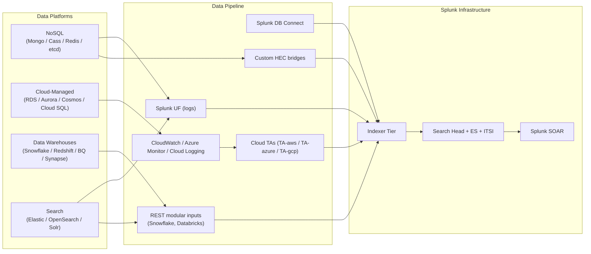

# NoSQL, Cloud-Managed Databases, Data Warehouses & Search Platforms Integration Guide

> The definitive guide to integrating NoSQL databases, cloud-managed
> RDBMS, data warehouses, and search platforms with Splunk. **100 use
> cases** spanning NoSQL (MongoDB, Apache Cassandra, ScyllaDB,
> Couchbase, Redis, Memcached, HBase, etcd, Neo4j); cloud-managed
> databases (AWS RDS / Aurora / DynamoDB / DocumentDB / Neptune /
> Keyspaces; Azure SQL DB / Azure Database for MySQL/PostgreSQL /
> Cosmos DB; Google Cloud SQL / Spanner / Firestore / Bigtable); data
> warehouses (Snowflake, AWS Redshift, Google BigQuery, Azure Synapse,
> Databricks SQL, ClickHouse); and search platforms (Elasticsearch,
> OpenSearch, Apache Solr). Cluster membership monitoring, query
> performance trending, slow-query analysis, audit-log compliance, data
> exfiltration detection, cost / DPU / DBU monitoring, capacity
> forecasting, and the full data-platform observability story across
> on-prem, cloud, and SaaS.

---

## Table of Contents

- [Quick Start](#quick-start)
- [Overview](#overview)
- [Architecture and Data Flow](#architecture)
- [Prerequisites](#prerequisites)
- [Platform Coverage Matrix](#platform-matrix)
- [MongoDB & MongoDB Atlas](#mongodb)
- [Apache Cassandra & ScyllaDB](#cassandra)
- [Couchbase, HBase, etcd, Neo4j](#other-nosql)
- [Redis & Memcached](#redis)
- [AWS RDS / Aurora / DynamoDB / DocumentDB](#aws-db)
- [Azure SQL Database & Cosmos DB](#azure-db)
- [Google Cloud SQL / Spanner / Firestore / Bigtable / BigQuery](#gcp-db)
- [Snowflake](#snowflake)
- [AWS Redshift, Azure Synapse, Databricks SQL](#warehouses)
- [Elasticsearch & OpenSearch](#elasticsearch)
- [Apache Solr](#solr)
- [Field Dictionary](#field-dictionary)
- [Sample Events](#sample-events)
- [Splunk-Side Configuration](#splunk-config)
- [Cross-Product Correlation](#cross-product)
- [CIM Mapping Reference](#cim-mapping)
- [Splunk ES Detection Pipeline](#es-detect)
- [Compliance Mapping](#compliance)
- [Capacity Planning and Sizing](#sizing)
- [Recommended Dashboard Layouts](#dashboards)
- [ITSI Service Modeling](#itsi)
- [SOAR Playbook Examples](#soar)
- [Multi-Tenant Strategy](#multi-tenant)
- [Security Hardening](#security-hardening)
- [Crawl / Walk / Run Roadmap](#roadmap)
- [Validation Checklist](#validation-checklist)
- [Known Limitations and Gaps](#known-limitations)
- [Troubleshooting](#troubleshooting)
- [FAQ](#faq)
- [Glossary](#glossary)
- [References](#references)
- [Contribution and Feedback](#contribution)

---

<a id="quick-start"></a>
## Quick Start — 90 Minutes to First DB Insight

### MongoDB (most common NoSQL)

1. Install Splunk UF on each MongoDB host.
2. inputs.conf:
    ```ini
    [monitor:///var/log/mongodb/mongod.log]
    sourcetype = mongodb:log
    index = mongodb

    [monitor:///var/log/mongodb/audit.log]
    sourcetype = mongodb:audit
    index = mongodb
    ```
3. Validate: `index=mongodb sourcetype="mongodb:log" earliest=-15m | stats count by host, severity`

### AWS RDS (most common cloud-managed)

1. RDS instance → Logs & events → enable export (Audit, General, Slow query, Error).
2. Splunk Add-on for AWS [1876](https://splunkbase.splunk.com/app/1876): CloudWatch Logs input on `/aws/rds/instance/<name>/audit`, `/aws/rds/instance/<name>/slowquery`.
3. Validate: `index=aws_rds sourcetype="aws:rds:slowquery" earliest=-15m | stats count by db_instance`

### Snowflake

1. Snowflake → SECURITY_ADMIN role → grant access to ACCOUNT_USAGE schema.
2. Custom REST modular input or Snowflake Connector → Splunk HEC.
3. Pull QUERY_HISTORY, LOGIN_HISTORY, ACCESS_HISTORY tables.
4. Validate: `index=snowflake sourcetype="snowflake:query_history" earliest=-15m | stats count by user_name`

### Activate crawl tier

UC-7.2.1 (Cluster Membership), UC-7.3.1 (Cloud DB Cost Trending), UC-7.4.1 (Warehouse Query Performance), UC-7.5.1 (Search Cluster Health).

---

<a id="overview"></a>
## Overview

### Why NoSQL/cloud DB observability matters

Modern data architectures span **dozens of data platforms**:
- Microservices use polyglot persistence (Mongo + Redis + ES per service)
- Cloud-managed DBs hide internals → vendor-controlled metrics
- Data warehouses cost real money — DBU / credits / slot-hours
- Search platforms (ES/OS) underpin observability + apps
- Auditing for compliance (PCI / HIPAA<sup class="ref">[<a href="#ref-14">14</a>]</sup> / GDPR<sup class="ref">[<a href="#ref-5">5</a>]</sup>) requires complete coverage

### What good looks like

| Dimension | Without integration | With full integration |
|-----------|---------------------|-----------------------|
| Cross-platform query performance | Per-vendor consoles | Unified Splunk view |
| Slow query trending | Per-DB scripts | Centralized analysis |
| Data exfil detection | Manual log review | Auto-detection |
| Cost / spend visibility | Monthly bill shock | Daily forecasting |
| Audit completeness | Spotty | Comprehensive evidence |

---

<a id="architecture"></a>
## Architecture and Data Flow



---

<a id="prerequisites"></a>
## Prerequisites

| Item | Detail |
|------|--------|
| **Splunk version** | 9.0+ Enterprise / Cloud |
| **CIM 6.x** | Authentication, Change, Database, Performance |
| **DB Connect** | For SQL queryable systems |
| **Cloud TAs** | For managed databases |

---

<a id="platform-matrix"></a>
## Platform Coverage Matrix

| Category | Platform | Integration |
|----------|----------|-------------|
| **NoSQL** | MongoDB | UF on logs + Atlas REST API |
| **NoSQL** | Cassandra | UF on system.log + audit |
| **NoSQL** | Redis | UF on log + slowlog REST |
| **NoSQL** | Couchbase | REST API + UF |
| **NoSQL** | etcd | UF + REST |
| **NoSQL** | Neo4j | UF |
| **Cloud DB** | AWS RDS / Aurora / DynamoDB / DocumentDB | Splunk_TA_aws CloudWatch |
| **Cloud DB** | Azure SQL / Cosmos DB | TA-MS Cloud Services |
| **Cloud DB** | GCP Cloud SQL / Spanner / BigQuery | TA-GCP |
| **Warehouse** | Snowflake | Custom REST + Snowflake Connector |
| **Warehouse** | Redshift | TA-aws |
| **Warehouse** | Databricks | REST API + audit log delivery |
| **Search** | Elasticsearch / OpenSearch | UF + audit + Cluster API |
| **Search** | Apache Solr | UF on solr.log |

---

<a id="mongodb"></a>
## MongoDB & MongoDB Atlas

### Self-hosted

```ini
# /etc/mongod.conf
auditLog:
  destination: file
  format: JSON
  path: /var/log/mongodb/audit.log
  filter: '{ atype: { $in: ["authenticate","logout","createUser","dropUser","grantRolesToUser","revokeRolesFromUser","createCollection","dropCollection","insert","update","delete","createIndex","dropIndex","authCheck","listSessions"] } }'

operationProfiling:
  mode: slowOp
  slowOpThresholdMs: 100
```

### MongoDB Atlas (cloud)

```
Atlas → Project → Activity Feed → Integrations → +Add Splunk webhook
Atlas → Database Access → Audit Filter
```

Sourcetypes: `mongodb:log`, `mongodb:audit`, `mongodb:profiler`, `mongodb:atlas:event`.

### SPL — Cluster membership changes

```spl
index=mongodb sourcetype="mongodb:log" "replSet" ("added" OR "removed" OR "election") earliest=-1d
| table _time, host, message
| sort -_time
```

### SPL — MongoDB slow ops

```spl
index=mongodb sourcetype="mongodb:profiler" earliest=-1d
| where millis > 1000
| stats count, avg(millis) as avg_ms, perc95(millis) as p95_ms by ns, op
| sort -avg_ms
```

### SPL — MongoDB audit failed auth

```spl
index=mongodb sourcetype="mongodb:audit" atype="authenticate" "result":18 earliest=-1d
| stats count by user, db
| where count > 5
```

---

<a id="cassandra"></a>
## Apache Cassandra & ScyllaDB

```ini
# /etc/cassandra/cassandra.yaml
audit_logging_options:
  enabled: true
  logger:
    - class_name: BinAuditLogger
  audit_logs_dir: /var/log/cassandra/audit
  included_keyspaces:
  excluded_keyspaces: system, system_schema, system_virtual_schema
  included_categories:
    - AUTH
    - DDL
    - DML
    - DCL
```

Sourcetypes: `cassandra:system`, `cassandra:audit`, `cassandra:gc`.

### SPL — Cassandra GC pause trending

```spl
index=cassandra sourcetype="cassandra:gc" earliest=-1d
| rex field=_raw "Total time for which application threads were stopped: (?<gc_pause_sec>\d+\.\d+)"
| stats avg(gc_pause_sec) as avg_pause, max(gc_pause_sec) as max_pause by host
```

### SPL — Tombstone warning trending

```spl
index=cassandra sourcetype="cassandra:system" "tombstone" earliest=-1d
| rex field=_raw "Read (?<tombstones>\d+) live rows and (?<tombstone_count>\d+) tombstone cells"
| stats sum(tombstone_count) as total_tombstones by table
| sort -total_tombstones
```

---

<a id="other-nosql"></a>
## Couchbase, HBase, etcd, Neo4j

### Couchbase

```
Couchbase → Settings → Audit:
  + Enable Audit
  + Filter: pool, security, n1ql:audit
  + Log path: /opt/couchbase/var/lib/couchbase/logs/audit.log
```

UF tail of audit.log → sourcetype `couchbase:audit`.

### HBase

UF tail of `/var/log/hbase/hbase-hbase-master-*.log` → sourcetype `hbase:log`.

### etcd

UF tail of journald or `/var/log/etcd/*.log` → sourcetype `etcd:event`.

### Neo4j

UF tail of `/var/log/neo4j/*.log` → sourcetype `neo4j:log`.

---

<a id="redis"></a>
## Redis & Memcached

### Redis logging

```ini
# /etc/redis/redis.conf
loglevel notice
logfile /var/log/redis/redis-server.log
slowlog-log-slower-than 10000
slowlog-max-len 1024
```

UF tail of `/var/log/redis/*.log` → sourcetype `redis:cli`.

### Redis slowlog

```bash
redis-cli SLOWLOG GET 100 | jq
```

Custom HEC scripted input pulls slowlog → sourcetype `redis:slowlog`.

### Redis Sentinel / Cluster

UF tail of sentinel.log → sourcetype `redis:sentinel`.

### Memcached

UF tail of memcached log → sourcetype `memcached:event`.

---

<a id="aws-db"></a>
## AWS RDS / Aurora / DynamoDB / DocumentDB

### RDS / Aurora log export

```
RDS Console → Modify Instance → Log exports:
  + Audit log
  + Error log
  + General log
  + Slow query log

CloudWatch → Splunk_TA_aws CloudWatch Logs input
```

### DynamoDB

```
EventBridge → Rules → Source: aws.dynamodb
  → Splunk Add-on for AWS
```

Sourcetypes: `aws:rds:slowquery`, `aws:rds:audit`, `aws:dynamodb:event`.

### SPL — RDS slow query analysis

```spl
index=aws_rds sourcetype="aws:rds:slowquery" earliest=-1d
| rex field=_raw "Query_time:\s*(?<query_time>\d+\.\d+)"
| stats avg(query_time) as avg_qt, perc95(query_time) as p95_qt, count by db_instance
| sort -avg_qt
```

### SPL — DynamoDB throttling

```spl
index=aws sourcetype="aws:cloudwatch" namespace="AWS/DynamoDB" metric_name="ThrottledRequests" earliest=-1d
| timechart span=1h sum(Sum) by table_name
```

---

<a id="azure-db"></a>
## Azure SQL Database & Cosmos DB

### Azure SQL Database

```
Azure Portal → SQL Database → Diagnostic Settings → Stream to Event Hub
  → Splunk Add-on for Microsoft Cloud Services
Categories: SQLSecurityAuditEvents, AutomaticTuning, BlockEvents, DeadlockEvents
```

### Cosmos DB

```
Azure Portal → Cosmos DB → Diagnostic Settings → Stream to Event Hub
Categories: DataPlaneRequests, QueryRuntimeStatistics, MongoRequests, PartitionKeyStatistics, ControlPlaneRequests
```

Sourcetypes: `azure:sql:audit`, `azure:cosmosdb:diagnostic`.

---

<a id="gcp-db"></a>
## Google Cloud SQL / Spanner / Firestore / Bigtable / BigQuery

```
Cloud Logging → Sink → Pub/Sub → Splunk_TA_google-cloudplatform
Filter: resource.type IN ("cloudsql_database","spanner_instance","bigquery_dataset","bigtable_instance","firestore_instance")
```

Sourcetypes: `google:gcp:cloudsql:event`, `google:gcp:spanner:audit`, `google:gcp:bigquery:audit`, etc.

### SPL — BigQuery cost analysis

```spl
index=bigquery sourcetype="google:gcp:bigquery:audit" methodName="jobservice.jobcompleted" earliest=-1d
| eval bytes_billed=jobChange.job.jobStats.queryStats.totalBilledBytes
| eval cost_usd=bytes_billed/1099511627776*5.0
| stats sum(cost_usd) as total_cost by principalEmail
| sort -total_cost
```

---

<a id="snowflake"></a>
## Snowflake

### Configuration

```sql
USE ROLE SECURITYADMIN;
CREATE USER splunk_integration PASSWORD='...' DEFAULT_ROLE=ACCOUNTADMIN;
GRANT IMPORTED PRIVILEGES ON DATABASE SNOWFLAKE TO ROLE ACCOUNTADMIN;
```

### Custom REST modular input

```python
# Pull from SNOWFLAKE.ACCOUNT_USAGE
queries = {
    "snowflake:query_history": "SELECT * FROM SNOWFLAKE.ACCOUNT_USAGE.QUERY_HISTORY WHERE END_TIME > {checkpoint}",
    "snowflake:login_history": "SELECT * FROM SNOWFLAKE.ACCOUNT_USAGE.LOGIN_HISTORY WHERE EVENT_TIMESTAMP > {checkpoint}",
    "snowflake:warehouse_metering": "SELECT * FROM SNOWFLAKE.ACCOUNT_USAGE.WAREHOUSE_METERING_HISTORY WHERE END_TIME > {checkpoint}",
}
```

### SPL — Snowflake credit consumption

```spl
index=snowflake sourcetype="snowflake:warehouse_metering" earliest=-7d
| stats sum(CREDITS_USED) as credits by WAREHOUSE_NAME
| sort -credits
```

### SPL — Snowflake long-running queries

```spl
index=snowflake sourcetype="snowflake:query_history" earliest=-1d
| where TOTAL_ELAPSED_TIME > 600000
| stats count, avg(TOTAL_ELAPSED_TIME)/1000 as avg_sec by USER_NAME, QUERY_TAG
```

### SPL — Snowflake unauthorized DB access

```spl
index=snowflake sourcetype="snowflake:query_history" QUERY_TYPE IN ("SELECT","INSERT","UPDATE","DELETE","DROP") earliest=-1d
| join USER_NAME [search index=snowflake sourcetype="snowflake:login_history" IS_SUCCESS=false earliest=-1d
    | stats count as failed_logins by USER_NAME]
| where failed_logins > 5
```

---

<a id="warehouses"></a>
## AWS Redshift, Azure Synapse, Databricks SQL

### AWS Redshift

```
Redshift → Cluster → Audit Logging → S3:
  + connection log, user log, useractivity log
S3 → Splunk_TA_aws SQS+S3 input
```

Sourcetypes: `aws:redshift:audit`, `aws:redshift:slow_query`.

### Azure Synapse

```
Synapse Studio → Settings → Diagnostic Settings:
  + SqlSecurityAuditEvents → Event Hub → Splunk
```

Sourcetype: `azure:synapse:audit`.

### Databricks

```
Databricks Workspace → Admin Console → Audit Logs → Configure delivery:
  + S3 / Azure Storage / GCS → Splunk Cloud HEC bridge
```

Sourcetypes: `databricks:audit`, `databricks:cluster`, `databricks:job`.

### SPL — Databricks DBU consumption

```spl
index=databricks sourcetype="databricks:cluster" event_type="terminated" earliest=-7d
| eval dbu=duration_ms/3600000 * dbu_per_hour
| stats sum(dbu) as total_dbu by user
| sort -total_dbu
```

---

<a id="elasticsearch"></a>
## Elasticsearch & OpenSearch

### Self-hosted

```ini
# elasticsearch.yml
xpack.security.audit.enabled: true
xpack.security.audit.logfile.events.include: authentication_failed, access_denied, anonymous_access_denied, tampered_request, run_as_denied
```

UF tail of `/var/log/elasticsearch/*_audit.json` → sourcetype `elasticsearch:audit`.

### Cluster health REST

Custom HEC scripted input pulls `GET /_cluster/health` → sourcetype `elasticsearch:cluster_health`.

### Slow log

```ini
index.search.slowlog.threshold.query.warn: 1s
index.indexing.slowlog.threshold.index.warn: 5s
```

UF tail → sourcetype `elasticsearch:slow_log`.

### OpenSearch

Same patterns; sourcetypes `opensearch:audit`, `opensearch:cluster`.

### SPL — Elasticsearch cluster status RED

```spl
index=elasticsearch sourcetype="elasticsearch:cluster_health" status="red" earliest=-1h
| stats count by cluster_name
```

### SPL — Elasticsearch slow query

```spl
index=elasticsearch sourcetype="elasticsearch:slow_log" earliest=-1d
| rex field=_raw "took\\[(?<took_ms>\\d+)ms\\]"
| where took_ms > 1000
| stats avg(took_ms) as avg_ms, perc95(took_ms) as p95_ms by index
| sort -p95_ms
```

---

<a id="solr"></a>
## Apache Solr

UF tail of `/var/solr/logs/solr.log` → sourcetype `solr:event`.

UF tail of slowQueryLog → sourcetype `solr:slow_query`.

---

<a id="field-dictionary"></a>
## Field Dictionary

| Field | Mongo | Cassandra | RDS | Snowflake | Elastic |
|-------|-------|-----------|-----|-----------|---------|
| `db` | db | keyspace | db_instance | DATABASE_NAME | index |
| `user` | user | user_name | user | USER_NAME | user.name |
| `query_time` | millis | (varies) | query_time | TOTAL_ELAPSED_TIME | took_ms |
| `action` | atype | category | command_type | QUERY_TYPE | event.action |
| `result` | result | (varies) | (status) | EXECUTION_STATUS | event.outcome |

---

<a id="sample-events"></a>
## Sample Events

(See per-platform sections.)

---

<a id="splunk-config"></a>
## Splunk-Side Configuration

### Index strategy

```ini
[mongodb]
homePath = $SPLUNK_DB/mongodb/db
maxDataSize = auto
frozenTimePeriodInSecs = 31536000

[cassandra]
homePath = $SPLUNK_DB/cassandra/db
maxDataSize = auto
frozenTimePeriodInSecs = 31536000

[aws_rds]
homePath = $SPLUNK_DB/aws_rds/db
maxDataSize = auto
frozenTimePeriodInSecs = 94608000   # 3 years SOX

[snowflake]
homePath = $SPLUNK_DB/snowflake/db
maxDataSize = auto
frozenTimePeriodInSecs = 94608000

[bigquery]
homePath = $SPLUNK_DB/bigquery/db
maxDataSize = auto
frozenTimePeriodInSecs = 94608000

[elasticsearch]
homePath = $SPLUNK_DB/elasticsearch/db
maxDataSize = auto
frozenTimePeriodInSecs = 31536000
```

---

<a id="cross-product"></a>
## Cross-Product Correlation

### App slow → DB slow query

```spl
(index=apm earliest=-1h | stats avg(latency_ms) as app_latency by service)
| join service [search index=mongodb sourcetype="mongodb:profiler" earliest=-1h | rename ns as service | stats avg(millis) as db_latency by service]
| eval correlation=if(app_latency > 500 AND db_latency > 100, "DB-bound", "OK")
```

### Failed app login → DB exfil

```spl
(index=app sourcetype="app:auth" event="login_fail" earliest=-1h | stats values(src_ip) as bad_ips by user)
| join user [search index=database sourcetype IN ("mongodb:audit","cassandra:audit") action="select" earliest=-1h | stats sum(rows_returned) as rows_returned by user]
| where rows_returned > 100000
```

---

<a id="cim-mapping"></a>
## CIM Mapping Reference

| CIM model | Sourcetype |
|-----------|-----------|
| **Authentication** | All audit + login events |
| **Database** | All query / DML events |
| **Performance** | All cluster + query timing |
| **Change** | DDL / config events |

---

<a id="es-detect"></a>
## Splunk ES Detection Pipeline

ES correlation searches:
- "DB — Excessive Failed Auth"
- "DB — Off-Hours Privileged Activity"
- "DB — Mass Data Export"
- "DB — Schema Changes Outside Window"
- "Snowflake — Anomalous DBU Spike"
- "Elasticsearch — Index Deletion"

---

<a id="compliance"></a>
## Compliance Mapping

### PCI-DSS 4.0

| Requirement | Coverage |
|-------------|----------|
| **3.x** Stored cardholder data | DB audit ingest |
| **10.x** Logging + audit | All DB audit logs |
| **8.x** Identification + auth | Login events |

### GDPR Art 32

- Encryption at rest validation (TLS in transit)
- Audit of access to PII tables

### SOX

- 7-year retention of audit
- DBA access audit
- Schema change tracking

### HIPAA §164.312

- All ePHI database access logged
- User identification per access

---

<a id="sizing"></a>
## Capacity Planning and Sizing

| Fleet size | Daily volume |
|-----------|--------------|
| Small (<10 DBs) | ~500 MB |
| Medium (10-100 DBs) | ~5 GB |
| Large (100-1000 DBs) | ~50 GB |
| Hyper-scale (1000+ DBs) | ~500 GB |

---

<a id="dashboards"></a>
## Recommended Dashboard Layouts

### Crawl

```
+---------------------+---------------------+
| DB CLUSTER HEALTH (per platform)           |
+---------------------+---------------------+
| TOP SLOW QUERIES                           |
+---------------------+---------------------+
| FAILED AUTH RATE                           |
+---------------------+---------------------+
| CLOUD DB COST TREND                        |
+---------------------+---------------------+
```

### Walk

```
+---------------------+---------------------+
| QUERY P95 LATENCY HEAT-MAP                 |
+---------------------+---------------------+
| AUDIT EVENTS BY ACTION                     |
+---------------------+---------------------+
| WAREHOUSE CREDIT / DBU CONSUMPTION         |
+---------------------+---------------------+
| SEARCH PLATFORM HEALTH                     |
+---------------------+---------------------+
```

### Run

```
+---------------------+---------------------+
| DATA PLATFORM EFFICIENCY SCORECARD         |
+---------------------+---------------------+
| ML QUERY ANOMALY DETECTION                 |
+---------------------+---------------------+
| DATA EXFIL DETECTION                       |
+---------------------+---------------------+
| EXEC COMPLIANCE PANE (PCI/GDPR/SOX)        |
+---------------------+---------------------+
```

---

<a id="itsi"></a>
## ITSI Service Modeling

### Service hierarchy

```
Data Platform Posture
├── Per-Service / Per-App
│   ├── MongoDB cluster
│   ├── Cassandra cluster
│   ├── RDS instances
│   └── ...
├── Cloud Spend Health
│   ├── Snowflake credits
│   ├── BigQuery slot-hours
│   └── Databricks DBU
├── Search Platform
│   ├── Elasticsearch cluster green
│   └── Solr availability
└── Compliance
    ├── Audit completeness
    └── PII access tracking
```

---

<a id="soar"></a>
## SOAR Playbook Examples

### Playbook 1: Mass data export → Auto-revoke

```
1. RECEIVE notable: > 100k rows exported
2. CALL DB API → revoke user role
3. CALL IAM → disable user
4. CREATE Sev-1 ticket
5. NOTIFY data security team
```

### Playbook 2: Snowflake DBU spike → Alert

```
1. RECEIVE notable: warehouse credits 2x baseline
2. ENRICH: top queries from last 1h
3. EMAIL warehouse owner
4. CREATE FinOps ticket
```

### Playbook 3: ES cluster RED → Auto-restart

```
1. RECEIVE notable: cluster RED > 5min
2. CALL Cluster API → trigger node restart
3. ESCALATE if not GREEN within 15min
```

---

<a id="multi-tenant"></a>
## Multi-Tenant Strategy

- Per-tenant indexes (`mongodb_tenant_a`, `mongodb_tenant_b`)
- Per-cloud-account TA accounts
- RBAC for sensitive query logs (PII)

---

<a id="security-hardening"></a>
## Security Hardening

- TLS for all DB connections
- Read-only audit user per platform
- Field-level RBAC for query content
- Snowflake / BQ minimum-credential principle
- Audit logs to immutable storage

---

<a id="roadmap"></a>
## Crawl / Walk / Run Roadmap

### Crawl (Week 1-4)

1. Onboard 1-2 critical DB platforms
2. CIM Database + Authentication acceleration
3. Crawl-tier dashboards
4. UC-7.2.1, UC-7.5.1

### Walk (Month 2-3)

1. Onboard cloud-managed DBs
2. Snowflake / DBX cost dashboards
3. ES correlation enabled
4. SOAR auto-revoke on mass export

### Run (Month 4+)

1. Multi-platform unified scorecard
2. ML query anomaly detection
3. Quarterly PCI/GDPR/SOX<sup class="ref">[<a href="#ref-12">12</a>]</sup> evidence
4. FinOps automation

---

<a id="validation-checklist"></a>
## Validation Checklist

- [ ] Day 1: First DB platform sending events
- [ ] Day 14: All major platforms ingesting
- [ ] Day 30: Walk-tier UCs deployed
- [ ] Day 90: SOAR playbooks operational; cost dashboards live

---

<a id="known-limitations"></a>
## Known Limitations and Gaps

| Limitation | Impact | Workaround |
|------------|--------|------------|
| **Snowflake ACCOUNT_USAGE 45-180 min lag** | Not real-time | Use Snowpipe + event-based for critical |
| **DynamoDB no slow query log** | Limited diag | Use CloudWatch + Contributor Insights |
| **Cosmos DB schema-less audit** | Field variance | Per-collection field aliasing |
| **Cassandra audit overhead** | Performance impact | Filter to security categories only |

---

<a id="troubleshooting"></a>
## Troubleshooting

### MongoDB audit log empty

- Verify auditLog.filter syntax
- Check audit user has permissions
- Verify log file rotation

### Snowflake REST input slow

- Use ACCOUNT_USAGE schema (cached)
- Avoid INFORMATION_SCHEMA (live, slower)

### Elasticsearch UF lag

- Check audit log volume vs UF batchsize
- Increase max_pipeline_threads

---

<a id="faq"></a>
## FAQ

**Q: NoSQL audit vs RDBMS audit completeness?**
A: NoSQL audit was historically weak; modern (Mongo 5+, Cassandra 4+) is comparable to RDBMS.

**Q: How to track cloud DB cost without surprise bills?**
A: Daily Snowflake credits / BQ slot-hours / DBU dashboards with predictive alerts.

**Q: Should I send Elasticsearch logs to Splunk or vice-versa?**
A: For SIEM/audit → Splunk. ES is a great app search/log platform but is not a SIEM.

**Q: How long to retain warehouse query history?**
A: 1 year for most; 7 years for SOX/financial reporting context.

---

<a id="glossary"></a>
## Glossary

| Term | Definition |
|------|-----------|
| **NoSQL** | Non-relational database |
| **RDBMS** | Relational Database Management System |
| **DBU** | Databricks Unit (compute billing) |
| **DPU** | Data Processing Unit |
| **AOF** | Append-Only File (Redis) |
| **MVCC** | Multi-Version Concurrency Control |
| **CDC** | Change Data Capture |
| **OLAP** | Online Analytical Processing |
| **OLTP** | Online Transaction Processing |
| **Polyglot Persistence** | Using multiple DBs per app |

---

<a id="references"></a>
## References

- [Splunk DB Connect (Splunkbase 2686)](https://splunkbase.splunk.com/app/2686)
- [Splunk Add-on for AWS (Splunkbase 1876)](https://splunkbase.splunk.com/app/1876)
- [Splunk Add-on for Microsoft Cloud Services (Splunkbase 3110)](https://splunkbase.splunk.com/app/3110)
- [Splunk Add-on for Google Cloud Platform (Splunkbase 3088)](https://splunkbase.splunk.com/app/3088)
- [MongoDB Audit](https://www.mongodb.com/docs/manual/core/auditing/)
- [Cassandra Audit Logging](https://cassandra.apache.org/doc/latest/cassandra/operating/audit_logging.html)
- [Snowflake ACCOUNT_USAGE](https://docs.snowflake.com/en/sql-reference/account-usage)

---

<a id="contribution"></a>
## Contribution and Feedback

Part of the [Splunk Monitoring Use Cases](https://github.com/fenre/splunk-monitoring-use-cases) project. [Open an issue](https://github.com/fenre/splunk-monitoring-use-cases/issues/new).

---

*Last updated: 2026-05-09. Covers MongoDB 7.x / Atlas, Cassandra 4.x, Couchbase 7.x, Redis 7.x, AWS RDS / Aurora / DynamoDB current, Azure SQL / Cosmos DB current, GCP Cloud SQL / Spanner / BigQuery current, Snowflake current, Databricks current, Elasticsearch 8.x / OpenSearch 2.x.*

---

<!-- BEGIN-AUTOGENERATED-SOURCES -->

## References

*Auto-generated by `scripts/generate_doc_references.py` from `data/source-references.json` and `data/source-mappings.json`. Edit those files (or the document body) to change citations; this footer is rewritten on every run.*

### Primary sources

<a id="ref-1"></a>**[1]** Splunk Inc. (2026). *Splunk Common Information Model Add-on Manual*. Splunk LLC, a Cisco company. Retrieved May 11, 2026, from https://docs.splunk.com/Documentation/CIM

### Supporting sources

<a id="ref-2"></a>**[2]** Amazon Web Services, Inc. (2026). *AWS Documentation*. Retrieved May 11, 2026, from https://docs.aws.amazon.com/

<a id="ref-3"></a>**[3]** American Institute of Certified Public Accountants. (2017). *Trust Services Criteria (2017) for Security, Availability, Processing Integrity, Confidentiality, and Privacy*. AICPA & CIMA. SOC 2 / TSP Section 100. https://www.aicpa-cima.com/topic/audit-assurance/soc-suite-of-services

<a id="ref-4"></a>**[4]** California Office of the Attorney General. (2020). *California Consumer Privacy Act / California Privacy Rights Act*. State of California. CA Civ Code § 1798.100 et seq. https://oag.ca.gov/privacy/ccpa

<a id="ref-5"></a>**[5]** European Parliament and Council of the European Union. (2016, April). *Regulation (EU) 2016/679 — General Data Protection Regulation*. Official Journal of the European Union, L 119. ELI: reg/2016/679. https://eur-lex.europa.eu/eli/reg/2016/679/oj

<a id="ref-6"></a>**[6]** Google LLC. (2026). *Google Cloud Documentation*. Retrieved May 11, 2026, from https://cloud.google.com/docs

<a id="ref-7"></a>**[7]** International Organization for Standardization. (2022). *ISO/IEC 27001:2022 — Information security, cybersecurity and privacy protection — Information security management systems — Requirements*. ISO/IEC. ISO/IEC 27001:2022. https://www.iso.org/standard/27001

<a id="ref-8"></a>**[8]** Microsoft Corporation. (2026). *Azure Monitor Documentation*. Retrieved May 11, 2026, from https://learn.microsoft.com/en-us/azure/azure-monitor/

<a id="ref-9"></a>**[9]** Public Company Accounting Oversight Board. (2007). *Auditing Standard 2201 — An Audit of Internal Control Over Financial Reporting*. PCAOB. PCAOB AS 2201. https://pcaobus.org/oversight/standards/auditing-standards/details/AS2201

<a id="ref-10"></a>**[10]** Splunk Inc. (2026). *Splunk Infrastructure Monitoring Documentation*. Splunk LLC, a Cisco company. Retrieved May 11, 2026, from https://docs.splunk.com/observability/en/infrastructure/intro-to-infrastructure.html

<a id="ref-11"></a>**[11]** Splunk Inc. (2026). *Splunk Observability Cloud Documentation*. Splunk LLC, a Cisco company. Retrieved May 11, 2026, from https://docs.splunk.com/observability/en/

<a id="ref-12"></a>**[12]** U.S. Congress. (2002). *Sarbanes-Oxley Act of 2002 — Public Company Accounting Reform and Investor Protection Act*. U.S. Government. Pub. L. 107–204. https://www.sec.gov/about/laws/soa2002.pdf

<a id="ref-13"></a>**[13]** U.S. Department of Health & Human Services. (2002). *HIPAA Privacy Rule (45 CFR Parts 160 and 164, Subparts A and E)*. Office for Civil Rights, HHS. 45 CFR 160, 164. https://www.hhs.gov/hipaa/for-professionals/privacy/index.html

<a id="ref-14"></a>**[14]** U.S. Department of Health & Human Services. (2013). *HIPAA Security Rule (45 CFR Parts 160 and 164, Subparts A and C)*. Office for Civil Rights, HHS. 45 CFR 160, 164. https://www.hhs.gov/hipaa/for-professionals/security/index.html

<details>
<summary>Additional online sources cited in the document body (10)</summary>

<a id="ref-15"></a>**[15]** splunkbase.splunk.com. *Splunkbase app #1876*. Retrieved May 11, 2026, from https://splunkbase.splunk.com/app/1876

<a id="ref-16"></a>**[16]** splunkbase.splunk.com. *Splunk DB Connect (Splunkbase 2686)*. Retrieved May 11, 2026, from https://splunkbase.splunk.com/app/2686

<a id="ref-17"></a>**[17]** splunkbase.splunk.com. *Splunk Add-on for Microsoft Cloud Services (Splunkbase 3110)*. Retrieved May 11, 2026, from https://splunkbase.splunk.com/app/3110

<a id="ref-18"></a>**[18]** splunkbase.splunk.com. *Splunk Add-on for Google Cloud Platform (Splunkbase 3088)*. Retrieved May 11, 2026, from https://splunkbase.splunk.com/app/3088

<a id="ref-19"></a>**[19]** mongodb.com. *MongoDB Audit*. Retrieved May 11, 2026, from https://www.mongodb.com/docs/manual/core/auditing/

<a id="ref-20"></a>**[20]** cassandra.apache.org. *Cassandra Audit Logging*. Retrieved May 11, 2026, from https://cassandra.apache.org/doc/latest/cassandra/operating/audit_logging.html

<a id="ref-21"></a>**[21]** docs.snowflake.com. *Snowflake ACCOUNT_USAGE*. Retrieved May 11, 2026, from https://docs.snowflake.com/en/sql-reference/account-usage

<a id="ref-22"></a>**[22]** github.com. *Splunk Monitoring Use Cases*. Retrieved May 11, 2026, from https://github.com/fenre/splunk-monitoring-use-cases

<a id="ref-23"></a>**[23]** github.com. *Open an issue*. Retrieved May 11, 2026, from https://github.com/fenre/splunk-monitoring-use-cases/issues/new

<a id="ref-24"></a>**[24]** splunkbase.splunk.com. *Splunkbase app #3203*. Retrieved May 11, 2026, from https://splunkbase.splunk.com/app/3203

</details>

### Cited by

- [`docs/guides/finops-cost-capacity.md`](finops-cost-capacity.md)
- [`docs/guides/industry-verticals.md`](industry-verticals.md)

<!-- END-AUTOGENERATED-SOURCES -->
