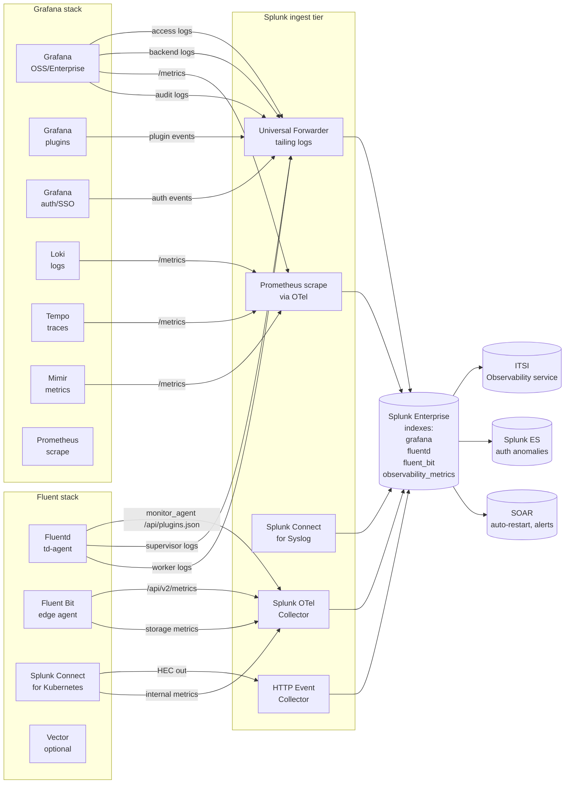

# Observability Tooling Operations Integration Guide

> Comprehensive monitoring guide for **Grafana<sup class="ref">[<a href="#ref-6">6</a>]</sup>** (15 UCs in cat-13.6)
> and **Fluentd / Fluent Bit** (12 UCs in cat-13.7) — the
> observability tooling that often sits alongside Splunk in modern
> data-platform stacks. Covers Grafana dashboard render time,
> datasource query errors, Unified Alerting, plugin health, RBAC,
> public dashboards, annotation storms, organization permission
> drift; and Fluentd / Fluent Bit buffer overflow, retry exhaustion,
> output plugin errors, throughput parity, worker crashes,
> filesystem-storage backlog, multiline parser stuck state, hot-reload
> governance. 27 use cases keeping your observability platform itself
> observable.

---

## Table of Contents

- [Quick Start](#quick-start)
- [Overview](#overview)
- [Architecture and Data Flow](#architecture)
- [Prerequisites](#prerequisites)
- [Grafana Health Monitoring (cat 13.6)](#grafana)
  - [Grafana Telemetry Sources](#grafana-sources)
  - [Dashboard / Panel Performance](#grafana-dashboards)
  - [Datasource Query Errors](#grafana-datasource)
  - [Unified Alerting (ngalert)](#grafana-alerting)
  - [Plugin Health and Provenance](#grafana-plugins)
  - [Authentication and Session Audit](#grafana-auth)
  - [Annotation Storm Detection](#grafana-annotations)
  - [Permission Drift](#grafana-permissions)
  - [Loki Cardinality](#grafana-loki)
- [Fluentd / Fluent Bit Health (cat 13.7)](#fluentd)
  - [Telemetry Sources](#fluentd-sources)
  - [Buffer Overflow / Retry Exhaustion](#fluentd-buffer)
  - [Output Plugin Errors](#fluentd-output)
  - [Throughput Parity](#fluentd-throughput)
  - [Worker Crash Detection](#fluentd-worker)
  - [Memory Buffer Forecast](#fluentd-memory-forecast)
  - [Filesystem Storage Backlog](#fluentd-fs-backlog)
  - [Multiline Parser State](#fluentd-multiline)
  - [Hot-Reload Governance](#fluentd-reload)
- [Splunk-Side Configuration](#splunk-config)
- [Field Dictionary](#field-dictionary)
- [Sample Events](#sample-events)
- [CIM Mapping](#cim-mapping)
- [Compliance Mapping](#compliance)
- [Recommended Dashboard Layouts](#dashboards)
- [ITSI Service Modeling](#itsi)
- [SOAR Playbook Examples](#soar)
- [Cross-Product Correlation](#cross-product)
- [Sizing and Performance](#sizing)
- [Security Hardening](#security-hardening)
- [Crawl / Walk / Run Roadmap](#roadmap)
- [Validation Checklist](#validation-checklist)
- [Known Limitations](#known-limitations)
- [Troubleshooting](#troubleshooting)
- [FAQ](#faq)
- [Glossary](#glossary)
- [References](#references)
- [Contribution and Feedback](#contribution)

---

<a id="quick-start"></a>
## Quick Start — 30 Minutes to First Dashboard

### 1. Identify what's running

Most enterprises that have Splunk also have:

| Tool | Common deployment |
|---|---|
| **Grafana OSS / Enterprise / Cloud** | Self-hosted or Grafana Cloud SaaS |
| **Fluentd / Fluent Bit** | Container log shipper, edge agent, K8s daemonset |
| **Splunk Connect for Kubernetes** | Fluentd-based, K8s container log ingest |

### 2. Land in dedicated indexes

```ini
# indexes.conf
[grafana]
homePath = $SPLUNK_DB/grafana/db
maxDataSizeMB = 2000
frozenTimePeriodInSecs = 7776000   # 90 days

[fluentd]
homePath = $SPLUNK_DB/fluentd/db
maxDataSizeMB = 2000
frozenTimePeriodInSecs = 7776000

[observability_metrics]
homePath = $SPLUNK_DB/observability_metrics/db
maxDataSizeMB = 5000
frozenTimePeriodInSecs = 7776000
```

### 3. First dashboard — Grafana load + Fluentd queue health

```spl
# Grafana dashboard load P95
index=grafana sourcetype=grafana:access uri="*/api/dashboards/uid/*"
        earliest=-1h
| stats perc95(duration_ms) AS load_p95 BY dashboard_uid
| sort -load_p95 | head 10
```

```spl
# Fluentd buffer queue saturation
index=fluentd OR index=observability_metrics
        (sourcetype=fluentd:metrics OR metric_name LIKE "fluentd.buffer.*")
        earliest=-1h
| stats max(buffer_queue_length) AS max_queue
        max(buffer_total_bytes) AS max_bytes
        BY host, plugin_id
```

### 4. Activate crawl tier

UC-13.6.1 (Dashboard load), UC-13.6.5 (Auth audit), UC-13.7.1 (Buffer
overflow), UC-13.7.4 (Worker crash), UC-13.7.5 (Memory buffer forecast).

---

<a id="overview"></a>
## Overview

### What this guide covers

| Domain | Examples |
|---|---|
| **Grafana operations** | Dashboard render P95, panel query duration, plugin signing, RBAC drift |
| **Grafana security** | Auth anomalies, account takeover, session forgery, public dashboard exposure |
| **Grafana governance** | Permission drift, annotation storms, datasource configuration |
| **Fluentd / Fluent Bit performance** | Buffer queue saturation, retry exhaustion, throughput parity |
| **Fluentd / Fluent Bit reliability** | Worker crash, supervisor restart, multiline stuck state |
| **Fluentd / Fluent Bit configuration** | Hot-reload governance, drift detection |
| **Splunk Connect for Kubernetes** | SCK Fluentd HEC output health |

### What's NOT in scope

| Domain | Where to look |
|---|---|
| Splunk's own platform health | [Splunk Platform Health Guide](splunk-platform-health.md) |
| Splunk Observability Cloud<sup class="ref">[<a href="#ref-1">1</a>]</sup> APM / RUM / Synthetics | [Splunk Observability Cloud Guide](splunk-observability-cloud.md) |
| AI/LLM observability via OTel | [AI & LLM Observability Guide](ai-llm-observability.md) |
| Third-party monitoring tools (Nagios, Datadog, etc.) | [Third-Party Monitoring Guide](third-party-monitoring.md) |
| Application telemetry (your own services) | [Splunk Observability Cloud Guide](splunk-observability-cloud.md) |
| Splunk ITSI configuration | [Splunk ITSI Guide](splunk-itsi.md) |

### Why monitor your observability platform

Observability tools are themselves critical infrastructure. When
Grafana goes slow, your incident response is slower. When Fluentd
drops events, your detections are blind.

| Without integration | With full deployment |
|---|---|
| Grafana slow → users complain in chat | Per-dashboard P95 SLO with auto-alert |
| Plugin upgrade breaks query → discovered hours later | Plugin install / version skew alert in 5 min |
| Fluentd buffer overflows → silent log drops | Pre-overflow forecast (UC-13.7.5) |
| Anonymous Grafana org accidentally exposed publicly | UC-13.6.5 detects in real time |
| Annotation spam from CI breaks dashboards | UC-13.6.6 detects; team notified |
| Permission drift → wrong people see PCI dashboard | UC-13.6.10 detects; SOC ticket |

---

<a id="architecture"></a>
## Architecture and Data Flow



### EPS budgeting

| Source | Typical EPS |
|---|---|
| Grafana access logs (medium org, 200 dashboards) | 50-300 |
| Grafana backend logs | 20-100 |
| Grafana /metrics scrape (10s interval) | 10-50 (metrics, not events) |
| Fluentd metrics (every 10s, 100 plugins) | 50-200 |
| Fluent Bit metrics (every 10s, 50 outputs) | 25-100 |
| SCK Fluentd HEC ack metadata | 100-500 |

---

<a id="prerequisites"></a>
## Prerequisites

| Item | Notes |
|---|---|
| **Splunk Enterprise** ≥ 9.0 (recommended 9.4) | |
| **Indexes** | `grafana`, `fluentd`, `fluent_bit`, `observability_metrics`, `platform` |
| **Splunk OpenTelemetry Collector** ≥ 0.115 | For Prometheus<sup class="ref">[<a href="#ref-11">11</a>]</sup> / metrics scrape |
| **Splunk Universal Forwarder** | For Grafana / Fluentd log file tail |
| **Splunk Add-on for Prometheus / OpenMetrics** | Optional, alternative to OTel |
| **HEC token** for SCK | If using Splunk Connect for Kubernetes |
| **Lookups** | `grafana_dashboard_inventory.csv`, `grafana_dashboard_metadata` (CMDB), `fluentd_pipeline_owner.csv`, `fluent_bit_input_to_output.csv` |

### Grafana access

- Read-only Grafana viewer for `/api/admin/stats`, `/metrics`,
  `/api/health`
- API token (rotate quarterly) for inventory pulls

### Fluentd / Fluent Bit access

- Fluentd `monitor_agent` plugin enabled (port 24220)
- Fluent Bit `[HTTP_SERVER]` enabled (port 2020)
- Read access to log directories (typically `/var/log/td-agent/`,
  `/var/log/fluent-bit/`)

---

<a id="grafana"></a>
## Grafana Health Monitoring (cat 13.6)

<a id="grafana-sources"></a>
### Grafana Telemetry Sources

| Source | Path | Sourcetype |
|---|---|---|
| **Access logs** | `/var/log/grafana/grafana.log` (or stdout in K8s) | `grafana:access` |
| **Backend logs** | Same file, structured `logger=` lines | `grafana:logs` |
| **Audit logs** (Enterprise) | `/var/log/grafana/grafana_audit.log` | `grafana:audit` |
| **Notifier logs** | Inside `grafana.log` with `logger=alerting.notifier` | `grafana:notifier` |
| **/metrics** (Prometheus) | `https://grafana:3000/metrics` | `grafana:metrics` (mstats) |
| **Health endpoint** | `https://grafana:3000/api/health` | (probed) |

### Setup — Splunk OTel Collector for Grafana metrics scrape

```yaml
# otel-collector-config.yaml
receivers:
  prometheus:
    config:
      scrape_configs:
        - job_name: 'grafana'
          scrape_interval: 30s
          static_configs:
            - targets: ['grafana-prod-01:3000', 'grafana-prod-02:3000']
          metrics_path: '/metrics'
          basic_auth:
            username: ${GRAFANA_USER}
            password: ${GRAFANA_PASS}
exporters:
  splunk_hec/metrics:
    token: ${SPLUNK_HEC_TOKEN}
    endpoint: https://splunk-hec.example.com:8088/services/collector/event
    source: grafana_metrics
    index: observability_metrics
service:
  pipelines:
    metrics:
      receivers: [prometheus]
      exporters: [splunk_hec/metrics]
```

### Setup — Universal Forwarder for Grafana logs

```ini
# inputs.conf on Grafana host
[monitor:///var/log/grafana/grafana.log]
sourcetype = grafana:access
index = grafana
disabled = 0

[monitor:///var/log/grafana/grafana_audit.log]
sourcetype = grafana:audit
index = grafana
disabled = 0
```

```ini
# props.conf — split access vs backend
[grafana:access]
TIME_PREFIX = ^t=
TIME_FORMAT = %Y-%m-%dT%H:%M:%S%z
SHOULD_LINEMERGE = false
EXTRACT-grafana_access = level=(?<level>\w+)\s+msg="(?<msg>[^"]*)"\s+(?:.*?)logger=(?<logger>\S+)\s+(?:.*?)method=(?<method>\S+)\s+path=(?<path>\S+)\s+status=(?<status_code>\d+)\s+(?:.*?)time_ms=(?<duration_ms>\d+)
```

<a id="grafana-dashboards"></a>
### Dashboard / Panel Performance (UC-13.6.1)

```spl
index=grafana sourcetype=grafana:access
        (uri="*/api/dashboards/uid/*" OR uri="*/d/*" OR uri="*/render*")
        earliest=-4h@m
| eval load_ms = tonumber(coalesce(duration_ms, request_time_ms, latency_ms, "0"))
| where load_ms > 0 AND load_ms < 3000000
| rex field=uri "/api/dashboards/uid/(?<dashboard_uid>[a-zA-Z0-9_-]+)"
| rex field=uri "/d/(?<dashboard_uid_alt>[a-zA-Z0-9_-]+)/"
| eval dashboard_uid = coalesce(dashboard_uid, dashboard_uid_alt, "unknown")
| bin _time span=5m
| stats perc95(load_ms) AS load_p95
        perc99(load_ms) AS load_p99
        max(load_ms) AS load_max
        count AS request_count
        BY dashboard_uid, _time
| eval severity = case(
    load_p95 > 5000, "critical",
    load_p95 > 3500, "high",
    load_p95 > 2200, "medium",
    1==1, "low")
| sort -load_p95
```

#### Identify slowest panel queries

```spl
index=grafana sourcetype=grafana:logs
        (logger="tsdb.prometheus" OR logger="tsdb.loki" OR logger="plugin.querydata")
        earliest=-4h
| eval query_ms = tonumber(coalesce(duration_ms, query_duration_ms))
| stats perc99(query_ms) AS query_p99
        max(query_ms) AS query_max
        count BY datasource, dashboard_uid, panel_id
| sort -query_max
```

#### Anonymous vs authenticated load divergence

```spl
index=grafana sourcetype=grafana:access uri="*/api/dashboards/uid/*"
        earliest=-1h
| eval auth_kind = case(
    user="" OR user="-" OR like(user,"%anonymous%"), "anon",
    1==1, "auth")
| stats perc95(duration_ms) AS load_p95 BY auth_kind, dashboard_uid
| eval ratio = anon / auth
| where ratio < 0.55  /* anon way faster than auth — auth proxy issue */
```

<a id="grafana-datasource"></a>
### Datasource Query Errors (UC-13.6.2)

```spl
index=grafana sourcetype IN ("grafana:access","grafana:logs")
        earliest=-1h
| eval is_query = if(uri LIKE "%/api/datasources/proxy/%" OR uri LIKE "%/api/ds/query%", 1, 0)
| eval is_error = if(status_code >= 400 OR match(level,"(?i)error"), 1, 0)
| where is_query = 1
| stats count AS total
        sum(is_error) AS errors
        BY datasource_name
| eval error_rate = round(errors / total * 100, 2)
| where error_rate > 5
```

<a id="grafana-alerting"></a>
### Unified Alerting (ngalert) — UC-13.6.3

```spl
# Rule evaluation duration + concurrency
index=grafana sourcetype=grafana:logs logger="ngalert.scheduler"
        earliest=-1h
| eval eval_ms = tonumber(coalesce(duration_ms, eval_duration_ms))
| stats perc95(eval_ms) AS eval_p95
        max(eval_ms) AS eval_max
        count(eval(eval_ms > 30000)) AS slow_evals
        BY rule_uid, rule_title
| where slow_evals > 0 OR eval_p95 > 5000
```

#### Alertmanager notification delivery (UC-13.6.13)

```spl
index=grafana sourcetype=grafana:notifier earliest=-1h
| stats count AS notifications
        count(eval(level="error")) AS errors
        BY notifier_uid, notifier_name
| eval error_rate = round(errors / notifications * 100, 2)
| where error_rate > 0
```

<a id="grafana-plugins"></a>
### Plugin Health and Provenance (UC-13.6.4)

```spl
# Cluster-wide plugin version skew
| rest /services/server/info splunk_server=*
        | head 1
        | mvexpand grafana_node
| join host [search index=grafana sourcetype=grafana:audit
              event_type="plugin_install" OR event_type="plugin_update"
              earliest=-30d
              | dedup plugin_id, host
              | table plugin_id, plugin_version, signature, host]
| stats values(plugin_version) AS versions
        dc(plugin_version) AS version_count
        values(signature) AS signatures
        BY plugin_id
| where version_count > 1
```

<a id="grafana-auth"></a>
### Authentication and Session Audit (UC-13.6.5)

```spl
# Failed login spike
index=grafana sourcetype IN ("grafana:audit","grafana:logs")
        (event_type="login_failed" OR msg="*login failed*")
        earliest=-1h
| stats count BY user, source_ip
| where count > 10
| sort -count
```

#### Anonymous org exposure detection

```spl
index=grafana sourcetype=grafana:access uri="*/public/dashboards*"
        OR uri="*/api/public*"
        earliest=-1h
| stats count
        dc(remote_addr) AS unique_ips
        BY uri, dashboard_uid
| where unique_ips > 5
```

#### Admin role promotion audit

```spl
index=grafana sourcetype=grafana:audit event_type="org_user_role_change"
        new_role IN ("Admin","Editor")
        earliest=-7d
| stats count BY actor_user, target_user, old_role, new_role, org_id
```

<a id="grafana-annotations"></a>
### Annotation Storm Detection (UC-13.6.6)

```spl
# Deployment marker storms — too many CI annotations
index=grafana sourcetype=grafana:audit event_type="annotation_create"
        earliest=-1h
| stats count BY actor_user, dashboard_uid
| where count > 20
| sort -count
```

<a id="grafana-permissions"></a>
### Permission Drift (UC-13.6.10)

```spl
# Folder / dashboard permission changes
index=grafana sourcetype=grafana:audit
        event_type IN ("folder_permission_change","dashboard_permission_change")
        earliest=-7d
| stats count BY actor_user, target_path, action
| sort -count
```

<a id="grafana-loki"></a>
### Loki Cardinality (UC-13.6.15)

```spl
# Loki query rejected for high cardinality
index=grafana sourcetype=grafana:logs logger LIKE "*loki*"
        (msg="*max_streams*" OR msg="*cardinality*")
        earliest=-1h
| stats count BY user, query
| sort -count
```

---

<a id="fluentd"></a>
## Fluentd / Fluent Bit Health (cat 13.7)

<a id="fluentd-sources"></a>
### Telemetry Sources

#### Fluentd

```ruby
# fluentd.conf - enable monitor_agent
<source>
  @type monitor_agent
  bind 0.0.0.0
  port 24220
</source>

<source>
  @type prometheus
  bind 0.0.0.0
  port 24231
</source>

<source>
  @type prometheus_output_monitor
  interval 10
  <labels>
    hostname ${hostname}
  </labels>
</source>
```

Then poll `http://fluentd:24220/api/plugins.json` and
`http://fluentd:24231/metrics` from Splunk OTel Collector.

#### Fluent Bit

```ini
# fluent-bit.conf - enable HTTP server
[SERVICE]
    HTTP_Server On
    HTTP_Listen 0.0.0.0
    HTTP_Port  2020
    storage.metrics on
```

Then scrape `http://fluent-bit:2020/api/v2/metrics/prometheus` from
Splunk OTel Collector.

#### Splunk Connect for Kubernetes (SCK)

SCK uses Fluentd internally; expose its metrics via
`/api/plugins.json` on each pod.

<a id="fluentd-buffer"></a>
### Buffer Overflow / Retry Exhaustion (UC-13.7.1)

```spl
# File / memory buffer queue saturation
index=observability_metrics
        (metric_name="fluentd_output_status_buffer_queue_length"
         OR metric_name="fluentd_output_status_buffer_total_bytes_total"
         OR metric_name LIKE "fluentbit_storage_chunks_*")
        earliest=-1h
| stats max(_value) AS max_value latest(_value) AS current_value
        BY host, plugin_id, metric_name
| eval critical = case(
    metric_name="fluentd_output_status_buffer_queue_length" AND current_value > 256, "YES",
    metric_name="fluentd_output_status_buffer_total_bytes_total" AND current_value > 1073741824, "YES",  /* 1GB */
    1==1, "NO")
| where critical = "YES"
```

#### Retry exhaustion

```spl
# fluentd_output_status_retry_count climbing
index=observability_metrics metric_name="fluentd_output_status_retry_count"
        earliest=-1h
| streamstats current=t window=10 max(_value) AS max_recent BY host, plugin_id
| where max_recent > 10
```

<a id="fluentd-output"></a>
### Output Plugin Errors (UC-13.7.2)

```spl
index=fluentd sourcetype="fluentd:worker"
        (msg LIKE "*output*error*" OR msg LIKE "*Could not push*"
         OR msg LIKE "*HEC*" OR msg LIKE "*4*" OR msg LIKE "*5*")
        earliest=-1h
| eval http_status = coalesce(http_status, status_code)
| eval status_class = case(
    http_status >= 500, "5xx",
    http_status >= 400, "4xx",
    1==1, "other")
| stats count BY plugin_id, output_type, status_class
| sort -count
```

<a id="fluentd-throughput"></a>
### Throughput Parity (UC-13.7.3)

```spl
# Compare emit_count vs write_count per tag — silent drops
index=observability_metrics
        (metric_name="fluentd_input_status_emit_records"
         OR metric_name="fluentd_output_status_write_count"
         OR metric_name="fluentd_output_status_emit_count")
        earliest=-15m
| eval direction = case(
    metric_name LIKE "fluentd_input%", "in",
    metric_name LIKE "fluentd_output%", "out",
    1==1, "?")
| stats sum(_value) AS total BY tag, direction
| eval drop_rate = round((in - out) / in * 100, 2)
| where drop_rate > 1
```

<a id="fluentd-worker"></a>
### Worker Crash Detection (UC-13.7.4)

```spl
# Supervisor restart detected
index=fluentd sourcetype IN ("fluentd:supervisor","fluentd:worker")
        (msg LIKE "*restarting worker*" OR msg LIKE "*OOM*"
         OR msg LIKE "*segfault*" OR msg LIKE "*signal*")
        earliest=-1h
| stats count earliest_seen=min(_time) latest_seen=max(_time)
        BY host, worker_pid
| where count > 3
| sort -count
```

#### Multi-worker blast-radius

```spl
# How many workers crashed simultaneously?
index=fluentd sourcetype="fluentd:supervisor"
        msg="*restarting worker*"
        earliest=-15m
| bucket _time span=1m
| stats dc(worker_pid) AS workers_crashed BY host, _time
| where workers_crashed > 2
```

<a id="fluentd-memory-forecast"></a>
### Memory Buffer Forecast (UC-13.7.5)

```spl
# Pre-overflow detection — extrapolate fill rate
index=observability_metrics
        metric_name="fluentd_output_status_buffer_total_bytes_total"
        earliest=-30m
| stats list(_value) AS values BY host, plugin_id
| eval first_val = mvindex(values, 0)
| eval last_val = mvindex(values, -1)
| eval fill_rate_per_min = round((last_val - first_val) / 30, 0)
| eval limit_bytes = 8589934592   /* 8 GB default — adjust per pipeline */
| eval headroom = limit_bytes - last_val
| eval minutes_to_full = if(fill_rate_per_min > 0, round(headroom / fill_rate_per_min, 0), 999999)
| where minutes_to_full < 60
| sort minutes_to_full
```

<a id="fluentd-fs-backlog"></a>
### Filesystem Storage Backlog (UC-13.7.8)

```spl
# Fluent Bit on-disk buffer chunk count
index=observability_metrics
        metric_name LIKE "fluentbit_storage_chunks_*"
        earliest=-15m
| stats max(_value) AS max_chunks BY host, plugin_id
| where max_chunks > 1000
```

<a id="fluentd-multiline"></a>
### Multiline Parser State (UC-13.7.10)

```spl
index=fluent_bit sourcetype="fluent_bit:metrics"
        msg LIKE "*multiline*timeout*"
        earliest=-1h
| stats count BY parser_id
| where count > 5
```

<a id="fluentd-reload"></a>
### Hot-Reload Governance (UC-13.7.12)

```spl
# Detect unauthorized config reloads
index=fluentd sourcetype="fluentd:supervisor"
        msg LIKE "*config reload*"
        earliest=-7d
| stats count earliest=min(_time) latest=max(_time) BY host, actor_user
| join host [| inputlookup fluentd_pipeline_owner.csv]
| eval unauthorized = if(actor_user != owner_user, "YES", "NO")
```

---

<a id="splunk-config"></a>
## Splunk-Side Configuration

### Index recipes

```ini
[grafana]
homePath = $SPLUNK_DB/grafana/db
maxDataSizeMB = 2000
frozenTimePeriodInSecs = 7776000

[fluentd]
homePath = $SPLUNK_DB/fluentd/db
maxDataSizeMB = 2000
frozenTimePeriodInSecs = 7776000

[fluent_bit]
homePath = $SPLUNK_DB/fluent_bit/db
maxDataSizeMB = 1000
frozenTimePeriodInSecs = 7776000

[observability_metrics]
homePath = $SPLUNK_DB/observability_metrics/db
maxDataSizeMB = 5000
frozenTimePeriodInSecs = 7776000
datatype = metric
```

### Macros

```ini
[grafana_idx]
definition = (index=grafana OR index=observability OR index=platform)

[fluentd_idx]
definition = (index=fluentd OR index=fluent_bit OR index=logshipper)

[obs_metrics]
definition = (index=observability_metrics OR index=prometheus_metrics OR index=metrics)
```

### Lookups

```csv
# grafana_dashboard_inventory.csv
dashboard_uid,dashboard_title,owner_team,business_priority,sla_class,runbook_url,last_reviewed
abc123,Production SRE Overview,sre,critical,gold,https://wiki/sre-runbook,2026-04-15
def456,Sales Pipeline,sales-eng,high,silver,https://wiki/sales,2026-03-01

# fluentd_pipeline_owner.csv
host,pipeline,owner_team,owner_user,sla_class
fluentd-prod-01,k8s_logs,platform,svc-sck,critical
fluentd-edge-01,edge_metrics,iot,svc-edge,high
```

---

<a id="field-dictionary"></a>
## Field Dictionary

| Field | Type | Source | Notes |
|---|---|---|---|
| `_time` | epoch | All | Auto |
| `host` | string | All | Hostname |
| `dashboard_uid` | string | Grafana | Unique dashboard ID |
| `dashboard_title` | string | Lookup | Friendly name |
| `panel_id` | string | Grafana | Panel ID within dashboard |
| `datasource` | string | Grafana | Prometheus, Loki, Splunk, etc. |
| `duration_ms` | float | Grafana | Request / query latency |
| `load_p95` / `load_p99` | float | Computed | Percentiles |
| `auth_kind` | string | Computed | anon / auth |
| `org_id` | string | Grafana | Multi-tenant org ID |
| `event_type` | string | grafana:audit | Audit event type |
| `actor_user` | string | grafana:audit | User performing action |
| `plugin_id` | string | Fluentd / FB | Output plugin ID |
| `worker_pid` | int | Fluentd | Worker process ID |
| `buffer_queue_length` | int | Metric | Queue size |
| `buffer_total_bytes_total` | int | Metric | Bytes in buffer |
| `retry_count` | int | Metric | Retry counter |
| `emit_records` | int | Metric | Input records emitted |
| `write_count` | int | Metric | Output records written |

---

<a id="sample-events"></a>
## Sample Events

### grafana:access

```
t=2026-05-09T12:34:56Z level=info msg="HTTP request handled" logger=context userId=42 orgId=1 uname=jdoe method=GET path=/api/dashboards/uid/abc123 status=200 remote_addr=10.10.20.30 time_ms=523 duration_ms=523 size=15234
```

### grafana:logs (tsdb backend)

```
t=2026-05-09T12:35:01Z level=warn msg="slow query" logger=tsdb.prometheus query="rate(http_requests_total[5m])" duration_ms=8245 datasource=prom-prod-01 dashboard_uid=abc123 panel_id=12
```

### grafana:audit

```
t=2026-05-09T12:36:00Z level=info msg="action recorded" logger=auditing event_type=annotation_create actor_user=svc-ci dashboard_uid=abc123 annotation_text="deploy v1.2.3"
```

### fluentd:metrics (Prometheus exposition)

```
fluentd_output_status_buffer_queue_length{plugin_id="output_splunk_hec",hostname="fluentd-prod-01"} 245
fluentd_output_status_retry_count{plugin_id="output_splunk_hec",hostname="fluentd-prod-01"} 12
fluentd_output_status_buffer_total_bytes_total{plugin_id="output_splunk_hec",hostname="fluentd-prod-01"} 8589934592
```

### fluentd:supervisor

```
2026-05-09 12:37:00 +0000 [info]: #0 fluentd worker is now running worker=0
2026-05-09 12:38:30 +0000 [warn]: #0 restarting worker because it died after 90 seconds, worker_pid=12345
```

### fluent_bit:metrics

```json
{
  "fluentbit": {
    "output": {
      "splunk.0": {
        "proc_records": 12345678,
        "proc_bytes": 9876543210,
        "errors": 12,
        "retries": 5,
        "retries_failed": 0
      }
    },
    "storage": {
      "chunks": 245,
      "fs_chunks_up": 200,
      "fs_chunks_down": 45
    }
  }
}
```

---

<a id="cim-mapping"></a>
## CIM Mapping

| CIM Data Model | Source |
|---|---|
| **Authentication** | grafana:audit (login events) |
| **Change** | grafana:audit (config / dashboard / permission changes) |
| **Web** | grafana:access (HTTP request log) |
| **Performance** | grafana:metrics (mstats), fluentd:metrics |

```ini
# eventtypes.conf
[grafana_auth]
search = sourcetype=grafana:audit (event_type=login* OR event_type=logout)

[grafana_change]
search = sourcetype=grafana:audit event_type IN ("dashboard_create","dashboard_update","dashboard_delete","datasource_change","plugin_install")

[grafana_web]
search = sourcetype=grafana:access

[fluentd_alert]
search = (sourcetype=fluentd:supervisor OR sourcetype=fluent_bit:metrics) (msg=*restart* OR msg=*OOM* OR msg=*overflow*)

# tags.conf
[eventtype=grafana_auth]
authentication = enabled

[eventtype=grafana_change]
change = enabled

[eventtype=grafana_web]
web = enabled

[eventtype=fluentd_alert]
alert = enabled
```

---

<a id="compliance"></a>
## Compliance Mapping

| Framework | Splunk evidence |
|---|---|
| **NIST 800-53<sup class="ref">[<a href="#ref-8">8</a>]</sup> AU-2 / AU-12** | Grafana audit log captured + retained |
| **NIST 800-53 SI-4** | Continuous monitoring of observability stack |
| **ISO 27001<sup class="ref">[<a href="#ref-7">7</a>]</sup> A.12.4** | Logging and monitoring (Grafana / Fluentd internal logs) |
| **SOC 2<sup class="ref">[<a href="#ref-2">2</a>]</sup> CC7.2** | System monitoring including the monitoring tools |
| **DORA<sup class="ref">[<a href="#ref-4">4</a>]</sup> Art. 16-17** | ICT operations resilience including telemetry layer |
| **PCI-DSS req 10** | Audit log of access to systems showing PCI data via Grafana |
| **HIPAA<sup class="ref">[<a href="#ref-14">14</a>]</sup> 164.312(b)** | Audit log of access to PHI dashboards |

---

<a id="dashboards"></a>
## Recommended Dashboard Layouts

### Observability platform health

| Row | Panel |
|---|---|
| **Headline** | Grafana up % (synth probe), Fluentd healthy %, dropped events 24h |
| **Grafana load** | P95 dashboard load by SLA class |
| **Grafana errors** | Top 10 erroring datasources |
| **Fluentd queue** | Top 10 hosts by queue length |
| **Recent restarts** | Worker / supervisor restarts 24h |

### Grafana operations

| Row | Panel |
|---|---|
| **Slowest dashboards** | Top 10 by P95 |
| **Plugin version skew** | Hosts with mismatched plugin versions |
| **Auth anomalies** | Failed logins, brute force, anonymous bursts |
| **Permission churn** | Top permission changes 7d |
| **Annotation storms** | Top annotation creators |

### Fluentd / Fluent Bit operations

| Row | Panel |
|---|---|
| **Buffer health** | Per-host queue + bytes |
| **Retry exhaustion** | Plugins approaching exhaustion |
| **Throughput parity** | In vs Out per tag |
| **Worker crashes** | Restart frequency |
| **Storage backlog** | On-disk chunk count |

---

<a id="itsi"></a>
## ITSI Service Modeling

| ITSI concept | Mapping |
|---|---|
| **Service** | "Observability Platform" (composite) |
| **Sub-services** | Grafana, Fluentd, Fluent Bit, SCK, Loki, Tempo, Mimir |
| **Entity** | Per-host instance |
| **KPIs** | Dashboard P95, Datasource error %, Buffer queue saturation, Worker restarts, Storage backlog |
| **Service tree** | Observability Platform → Component → Host instance |
| **Glass table** | NOC view with all observability components heatmap |

---

<a id="soar"></a>
## SOAR Playbook Examples

### Playbook 1 — Fluentd buffer near limit → restart

```yaml
name: fluentd_buffer_critical
trigger: splunk_alert: fluentd_buffer_uc_13_7_5
steps:
  - extract: [host, plugin_id, minutes_to_full]
  - if: minutes_to_full < 15
    then:
      - servicenow_create_change:
          type: emergency
          short_description: "Fluentd $host$ buffer overflow imminent ($minutes_to_full$ min)"
      - if: action_authorized
        then:
          - ssh_command:
              host: $host$
              command: "systemctl restart td-agent"
```

### Playbook 2 — Grafana auth anomaly → investigate

```yaml
name: grafana_auth_anomaly
trigger: splunk_alert: grafana_auth_uc_13_6_5
steps:
  - extract: [user, source_ip, login_count]
  - splunk_search:
      query: |  search index=grafana sourcetype=grafana:audit user=$user$ earliest=-7d 
                | stats count BY event_type
  - if: source_ip is impossible_travel
    then:
      - servicenow_create_incident:
          assignment_group: soc
          severity: high
          short_description: "Grafana impossible-travel login: $user$ from $source_ip$"
```

### Playbook 3 — Plugin version skew → reconcile

```yaml
name: grafana_plugin_skew
trigger: splunk_alert: grafana_plugin_uc_13_6_4
steps:
  - extract: [plugin_id, versions_seen]
  - jira_create_issue:
      project: PLATFORM
      issue_type: Task
      summary: "Reconcile Grafana plugin $plugin_id$ across $versions_seen$"
      assignee: platform-team@example.com
```

---

<a id="cross-product"></a>
## Cross-Product Correlation

| With… | Pattern |
|---|---|
| **Splunk Platform Health** | Correlate Grafana slowness with Splunk indexer queue if Splunk is a Grafana datasource |
| **Splunk Observability Cloud** | Grafana + Splunk APM for end-to-end dashboard load |
| **Splunk ES** | Anomalous Grafana access patterns |
| **Splunk SOAR** | Auto-restart Fluentd; raise plugin tickets |
| **Container platforms** | Fluent Bit DaemonSet health + container restarts |
| **AWS / Azure / GCP** | Grafana on managed K8s (EKS / AKS / GKE) — correlate with cloud control plane |

---

<a id="sizing"></a>
## Sizing and Performance

| Component | Sizing |
|---|---|
| Grafana log ingest | UF + tail of `/var/log/grafana/grafana.log` |
| Grafana metrics scrape | OTel collector with 1 vCPU / 1 GB RAM |
| Fluentd metrics scrape | Same OTel collector |
| Fluent Bit metrics scrape | Same OTel collector |
| Indexer | 1 indexer per 100k EPS |

### Edge Processor recommendation

For huge K8s deployments with 10k+ pods, consider Splunk Edge Processor
in front of SCK to drop noisy container logs before HEC ingest.

---

<a id="security-hardening"></a>
## Security Hardening

| Risk | Mitigation |
|---|---|
| **Grafana admin token leakage** | Rotate quarterly; use HEC tokens not API keys for ingest |
| **Anonymous Grafana org exposed** | UC-13.6.5 detects; alert SOC |
| **Public dashboards leak data** | Disable globally if not intentional; UC-13.6.5 |
| **Fluentd config reload not authorized** | UC-13.7.12 hot-reload governance |
| **HEC token reused across pipelines** | Per-pipeline HEC tokens; limit scope |

---

<a id="roadmap"></a>
## Crawl / Walk / Run Roadmap

### Crawl (Week 0-2) — 6 use cases

| UC | Why |
|---|---|
| 13.6.1 | Grafana dashboard load P95 |
| 13.6.5 | Grafana auth audit |
| 13.7.1 | Fluentd buffer overflow |
| 13.7.4 | Fluentd worker crash |
| 13.7.5 | Memory buffer forecast |
| 13.7.12 | Hot-reload governance |

### Walk (Month 1-3) — 12 more

| UC | Why |
|---|---|
| 13.6.2-3 | Datasource errors, alerting |
| 13.6.4 | Plugin version skew |
| 13.6.6 | Annotation storms |
| 13.6.10 | Permission drift |
| 13.6.13 | Notifier failures |
| 13.6.15 | Loki cardinality |
| 13.7.2-3 | Output errors, throughput parity |
| 13.7.8 | Filesystem backlog |
| 13.7.10 | Multiline parser state |

### Run (Month 3+) — 9 advanced

(detailed in cat-13.6.* and 13.7.* catalog)

---

<a id="validation-checklist"></a>
## Validation Checklist

- [ ] Grafana access logs flowing to `grafana` index
- [ ] Grafana audit logs flowing to `grafana` index (Enterprise / Cloud)
- [ ] Grafana /metrics scraped to `observability_metrics`
- [ ] Fluentd monitor_agent enabled + scraped
- [ ] Fluent Bit HTTP_Server enabled + scraped
- [ ] SCK metrics flowing if applicable
- [ ] Macros: `grafana_idx`, `fluentd_idx`, `obs_metrics`
- [ ] Lookups: `grafana_dashboard_inventory.csv`, `fluentd_pipeline_owner.csv`
- [ ] First dashboard live: dashboard load P95 + buffer queue
- [ ] First Crawl-tier UCs running
- [ ] First SOAR playbook tested

---

<a id="known-limitations"></a>
## Known Limitations

| Limitation | Workaround |
|---|---|
| Grafana audit log only in Enterprise / Cloud | OSS users limited to access logs + admin events |
| Grafana access logs format changes between versions | Re-validate field extractions on upgrade |
| Fluentd monitor_agent doesn't expose all output details in v1.x | Use Prometheus exposition |
| Fluent Bit metrics endpoint changed in v1.7+ | Use `/api/v2/metrics` |
| SCK 1.x deprecated; migrating to OpenTelemetry Collector for K8s | Plan migration; UCs updated |
| Multi-org Grafana adds complexity | Filter searches by `org_id` |

---

<a id="troubleshooting"></a>
## Troubleshooting

### "Grafana metrics scrape returns 401"

1. Anonymous /metrics access disabled (default in newer Grafana)
2. Configure basic auth or OAuth in OTel scrape config
3. Or enable `[metrics]` `disable_total_stats=false` in Grafana

### "Fluentd buffer queue stuck at 0 — no metrics"

1. monitor_agent not enabled
2. Check port 24220 listening
3. Use Prometheus `prometheus_output_monitor` instead

### "Fluent Bit `/api/v2/metrics` returns 404"

1. HTTP_Server not enabled in `[SERVICE]`
2. Wrong path — try `/api/v1/metrics` for older versions
3. Check `storage.metrics on` for storage metrics

### "Grafana dashboard SQL queries appear in access log"

1. They shouldn't (datasource queries go via `/api/datasources/proxy/`
   or `/api/ds/query`)
2. If so, check for custom plugins / unsafe API patterns

---

<a id="faq"></a>
## FAQ

**Q: Why monitor Grafana when we have Splunk?**
Grafana is often the user-facing layer atop Splunk + Prometheus +
Loki. When Grafana is slow, users blame Splunk. Visibility into
Grafana itself answers "is it the data source or the dashboard?"

**Q: Splunk Connect for Kubernetes (Fluentd-based) is being deprecated?**
Yes — Splunk recommends migrating to Splunk OpenTelemetry Collector
for K8s. The cat-13.7 UCs apply to both Fluentd and OTel Collector
internals (with sourcetype changes).

**Q: Should I use Vector instead of Fluentd / Fluent Bit?**
Vector (Datadog) is similar territory. The same patterns apply with
different sourcetypes. cat-13.7 UCs are written for Fluentd / Fluent
Bit; Vector deserves its own subcategory if widely deployed.

**Q: How to capture Grafana plugin signing without Enterprise audit log?**
Tail Grafana startup log (`grafana:logs` with `logger="plugin.loader"`)
— it logs signature status at boot.

**Q: Multi-tenant Grafana — how to isolate metrics per org?**
Filter all searches by `org_id`. Build per-org dashboards. Use
`org_id` as a service entity in ITSI.

---

<a id="glossary"></a>
## Glossary

| Term | Definition |
|---|---|
| **Grafana** | Open-source dashboarding and observability UI |
| **Loki** | Grafana's log aggregation database |
| **Mimir** | Grafana's Prometheus long-term storage |
| **Tempo** | Grafana's distributed tracing backend |
| **Pyroscope** | Grafana's continuous profiling backend |
| **Unified Alerting (ngalert)** | Grafana's modern alerting engine (replaces legacy alerting) |
| **Fluentd** | CNCF open-source data collector (Ruby + C) |
| **Fluent Bit** | Lightweight log shipper (C) |
| **td-agent** | Treasure Data's packaged Fluentd distribution |
| **SCK** | Splunk Connect for Kubernetes (Fluentd-based) |
| **HEC** | HTTP Event Collector (Splunk) |
| **Cardinality** | Number of unique label combinations in a metric/log series |
| **Bursting** | Sudden spike in events / metrics / queries |
| **Hot-reload** | Configuration reload without process restart |
| **monitor_agent** | Fluentd plugin exposing internal stats over HTTP |
| **Annotation storm** | Bursts of dashboard annotations (often from CI/CD) |

---

<a id="references"></a>
## References

### Grafana

- [Grafana documentation](https://grafana.com/docs/grafana/)
- [Grafana metrics](https://grafana.com/docs/grafana/latest/setup-grafana/set-up-grafana-monitoring/)
- [Grafana audit logs](https://grafana.com/docs/grafana/latest/setup-grafana/configure-security/audit-grafana/)
- [Grafana Unified Alerting](https://grafana.com/docs/grafana/latest/alerting/)

### Fluentd / Fluent Bit

- [Fluentd documentation](https://docs.fluentd.org/)
- [Fluent Bit documentation](https://docs.fluentbit.io/)
- [Fluentd monitor_agent](https://docs.fluentd.org/monitoring-fluentd/monitoring-rest-api)
- [Fluent Bit Prometheus metrics](https://docs.fluentbit.io/manual/administration/monitoring)

### Splunk

- [Splunk Connect for Kubernetes](https://github.com/splunk/splunk-connect-for-kubernetes)
- [Splunk OpenTelemetry Collector for K8s](https://github.com/signalfx/splunk-otel-collector-chart)
- [Splunk Add-on for Prometheus / OpenMetrics](https://splunkbase.splunk.com/app/4923)

### Lantern

- [Splunk Lantern — Observability stack articles](https://lantern.splunk.com/)

---

<a id="contribution"></a>
## Contribution and Feedback

This guide is part of the Splunk Monitoring Use Cases catalog.

- **Add a use case** — PR JSON sidecar in `content/cat-13-observability-monitoring-stack/`
- **Share a Grafana / Fluentd pattern** — PR documentation
- **Contribute a Vector / OTel Collector pattern** — PR `examples/observability/`

The full catalog is at
[github.com/fenre/splunk-monitoring-use-cases](https://github.com/fenre/splunk-monitoring-use-cases).

---

<!-- BEGIN-AUTOGENERATED-SOURCES -->

## References

*Auto-generated by `scripts/generate_doc_references.py` from `data/source-references.json` and `data/source-mappings.json`. Edit those files (or the document body) to change citations; this footer is rewritten on every run.*

### Primary sources

<a id="ref-1"></a>**[1]** Splunk Inc. (2026). *Splunk Observability Cloud Documentation*. Splunk LLC, a Cisco company. Retrieved May 11, 2026, from https://docs.splunk.com/observability/en/

### Supporting sources

<a id="ref-2"></a>**[2]** American Institute of Certified Public Accountants. (2017). *Trust Services Criteria (2017) for Security, Availability, Processing Integrity, Confidentiality, and Privacy*. AICPA & CIMA. SOC 2 / TSP Section 100. https://www.aicpa-cima.com/topic/audit-assurance/soc-suite-of-services

<a id="ref-3"></a>**[3]** Elasticsearch B.V. (2026). *Elastic Stack Documentation*. Retrieved May 11, 2026, from https://www.elastic.co/guide/index.html

<a id="ref-4"></a>**[4]** European Parliament and Council of the European Union. (2022, December). *Regulation (EU) 2022/2554 — Digital Operational Resilience Act (DORA)*. Official Journal of the European Union, L 333. ELI: reg/2022/2554. https://eur-lex.europa.eu/eli/reg/2022/2554/oj

<a id="ref-5"></a>**[5]** Gerhards, R. (2009, March). *The Syslog Protocol*. Internet Engineering Task Force. RFC 5424. https://www.rfc-editor.org/rfc/rfc5424

<a id="ref-6"></a>**[6]** Grafana Labs. (2026). *Grafana Documentation*. Retrieved May 11, 2026, from https://grafana.com/docs/

<a id="ref-7"></a>**[7]** International Organization for Standardization. (2022). *ISO/IEC 27001:2022 — Information security, cybersecurity and privacy protection — Information security management systems — Requirements*. ISO/IEC. ISO/IEC 27001:2022. https://www.iso.org/standard/27001

<a id="ref-8"></a>**[8]** National Institute of Standards and Technology. (2020). *Security and Privacy Controls for Information Systems and Organizations* (Revision 5). U.S. Department of Commerce. NIST SP 800-53 Rev. 5. https://csrc.nist.gov/pubs/sp/800/53/r5/upd1/final

<a id="ref-9"></a>**[9]** OpenTelemetry Authors. (2026). *OpenTelemetry Semantic Conventions*. Cloud Native Computing Foundation. Retrieved May 11, 2026, from https://opentelemetry.io/docs/specs/semconv/

<a id="ref-10"></a>**[10]** OpenTelemetry Authors. (2026). *OpenTelemetry Specification*. Cloud Native Computing Foundation. Retrieved May 11, 2026, from https://opentelemetry.io/docs/specs/otel/

<a id="ref-11"></a>**[11]** Prometheus Authors. (2026). *Prometheus Documentation*. Cloud Native Computing Foundation. Retrieved May 11, 2026, from https://prometheus.io/docs/introduction/overview/

<a id="ref-12"></a>**[12]** Splunk Inc. (2026). *Splunk Distribution of the OpenTelemetry Collector*. Splunk LLC, a Cisco company. Retrieved May 11, 2026, from https://docs.splunk.com/observability/en/gdi/opentelemetry/opentelemetry.html

<a id="ref-13"></a>**[13]** U.S. Department of Health & Human Services. (2002). *HIPAA Privacy Rule (45 CFR Parts 160 and 164, Subparts A and E)*. Office for Civil Rights, HHS. 45 CFR 160, 164. https://www.hhs.gov/hipaa/for-professionals/privacy/index.html

<a id="ref-14"></a>**[14]** U.S. Department of Health & Human Services. (2013). *HIPAA Security Rule (45 CFR Parts 160 and 164, Subparts A and C)*. Office for Civil Rights, HHS. 45 CFR 160, 164. https://www.hhs.gov/hipaa/for-professionals/security/index.html

<details>
<summary>Additional online sources cited in the document body (15)</summary>

<a id="ref-15"></a>**[15]** grafana.com. *Grafana documentation*. Retrieved May 11, 2026, from https://grafana.com/docs/grafana/

<a id="ref-16"></a>**[16]** grafana.com. *Grafana metrics*. Retrieved May 11, 2026, from https://grafana.com/docs/grafana/latest/setup-grafana/set-up-grafana-monitoring/

<a id="ref-17"></a>**[17]** grafana.com. *Grafana audit logs*. Retrieved May 11, 2026, from https://grafana.com/docs/grafana/latest/setup-grafana/configure-security/audit-grafana/

<a id="ref-18"></a>**[18]** grafana.com. *Grafana Unified Alerting*. Retrieved May 11, 2026, from https://grafana.com/docs/grafana/latest/alerting/

<a id="ref-19"></a>**[19]** docs.fluentd.org. *Fluentd documentation*. Retrieved May 11, 2026, from https://docs.fluentd.org/

<a id="ref-20"></a>**[20]** docs.fluentbit.io. *Fluent Bit documentation*. Retrieved May 11, 2026, from https://docs.fluentbit.io/

<a id="ref-21"></a>**[21]** docs.fluentd.org. *Fluentd monitor_agent*. Retrieved May 11, 2026, from https://docs.fluentd.org/monitoring-fluentd/monitoring-rest-api

<a id="ref-22"></a>**[22]** docs.fluentbit.io. *Fluent Bit Prometheus metrics*. Retrieved May 11, 2026, from https://docs.fluentbit.io/manual/administration/monitoring

<a id="ref-23"></a>**[23]** github.com. *Splunk Connect for Kubernetes*. Retrieved May 11, 2026, from https://github.com/splunk/splunk-connect-for-kubernetes

<a id="ref-24"></a>**[24]** github.com. *Splunk OpenTelemetry Collector for K8s*. Retrieved May 11, 2026, from https://github.com/signalfx/splunk-otel-collector-chart

<a id="ref-25"></a>**[25]** splunkbase.splunk.com. *Splunk Add-on for Prometheus / OpenMetrics*. Retrieved May 11, 2026, from https://splunkbase.splunk.com/app/4923

<a id="ref-26"></a>**[26]** lantern.splunk.com. *Splunk Lantern — Observability stack articles*. Retrieved May 11, 2026, from https://lantern.splunk.com/

<a id="ref-27"></a>**[27]** github.com. *github.com/fenre/splunk-monitoring-use-cases*. Retrieved May 11, 2026, from https://github.com/fenre/splunk-monitoring-use-cases

<a id="ref-28"></a>**[28]** github.com. *GitHub: signalfx/splunk-otel-collector*. Retrieved May 11, 2026, from https://github.com/signalfx/splunk-otel-collector

<a id="ref-29"></a>**[29]** github.com. *GitHub: splunk/splunk-connect-for-syslog*. Retrieved May 11, 2026, from https://github.com/splunk/splunk-connect-for-syslog

</details>

### Related repository documents

- [`docs/guides/ai-llm-observability.md`](ai-llm-observability.md)
- [`docs/guides/splunk-itsi.md`](splunk-itsi.md)
- [`docs/guides/splunk-observability-cloud.md`](splunk-observability-cloud.md)
- [`docs/guides/splunk-platform-health.md`](splunk-platform-health.md)
- [`docs/guides/third-party-monitoring.md`](third-party-monitoring.md)

<!-- END-AUTOGENERATED-SOURCES -->
