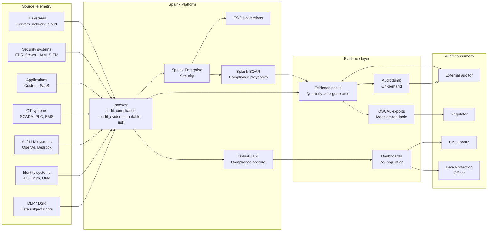
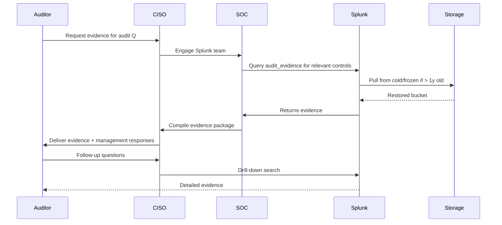

# Regulatory Compliance Master Integration Guide

> The cross-framework portal for using Splunk as the evidence platform
> for regulatory compliance. 1500+ use cases across 49 cat-22
> regulatory subcategories covering 30+ frameworks: privacy (GDPR<sup class="ref">[<a href="#ref-4">4</a>]</sup>,
> CCPA<sup class="ref">[<a href="#ref-2">2</a>]</sup>, PDPA), security (NIS2<sup class="ref">[<a href="#ref-3">3</a>]</sup>, ISO 27001, NIST 800-53<sup class="ref">[<a href="#ref-10">10</a>]</sup>, SOC 2),
> financial (PCI-DSS, SOX<sup class="ref">[<a href="#ref-16">16</a>]</sup>, DORA<sup class="ref">[<a href="#ref-5">5</a>]</sup>, MiFID II, PSD2, AML), healthcare
> (HIPAA, FDA 21 CFR Part 11), critical infrastructure (NERC CIP<sup class="ref">[<a href="#ref-11">11</a>]</sup>,
> IEC 62443, TSA Pipeline, KRITIS), federal (FedRAMP<sup class="ref">[<a href="#ref-20">20</a>]</sup>, FISMA, CMMC<sup class="ref">[<a href="#ref-17">17</a>]</sup>),
> AI governance (EU AI Act<sup class="ref">[<a href="#ref-6">6</a>]</sup>, ISO 42001, NIST AI RMF), and 14
> cross-cutting compliance domains (evidence continuity, DSR,
> cross-border, incident notification, privileged access, encryption,
> change mgmt, vulnerability mgmt, third-party, backup, training,
> control testing, SoD, retention).

---

## Table of Contents

- [How to use this guide](#how-to-use)
- [Compliance Architecture Overview](#architecture)
- [The Splunk Evidence Platform Pattern](#evidence-platform)
- [Framework Catalog](#framework-catalog)
  - [Privacy & Data Protection](#privacy)
  - [Security & Information Governance](#security)
  - [Financial Services](#financial)
  - [Healthcare](#healthcare)
  - [Critical Infrastructure / OT](#critical-infrastructure)
  - [Federal & Defense](#federal)
  - [AI Governance](#ai-governance)
  - [Regional & Sectoral](#regional)
- [Cross-Cutting Compliance Domains (22.35-22.49)](#cross-cutting)
- [Common Splunk Compliance Patterns](#patterns)
- [Evidence Pack Methodology](#evidence-packs)
- [OSCAL Integration](#oscal)
- [Audit Workflow](#audit-workflow)
- [Splunk-Side Configuration](#splunk-config)
- [ITSI Compliance Service Tree](#itsi)
- [SOAR Compliance Playbooks](#soar)
- [Recommended Dashboard Layouts](#dashboards)
- [Glossary](#glossary)
- [References](#references)

---

<a id="how-to-use"></a>
## How to Use This Guide

### If you're a compliance officer

1. Find your regulation in the [Framework Catalog](#framework-catalog)
2. Read the [regulatory primer](../regulatory-primer.md) section for that regulation
3. Review the corresponding evidence pack at `docs/evidence-packs/`
4. Validate that your Splunk catalog has the cat-22 UCs for that framework deployed
5. Configure evidence pack scheduled searches to land in `audit_evidence`
6. Use `audit_evidence` for auditor-facing reports

### If you're a Splunk practitioner

1. Identify which frameworks your organization is subject to
2. Configure prerequisite data sources (per the framework's TA list)
3. Deploy the cat-22 UCs and any cat-N (technical) UCs they reference
4. Validate the [Audit Workflow](#audit-workflow) end-to-end
5. Tune evidence retention per the longest-applicable framework

### If you're an auditor

1. Read the relevant [evidence pack](#evidence-packs) for your audit scope
2. Cross-reference with the OSCAL machine-readable export at `api/v1/compliance/`
3. Request reports from `audit_evidence` index for your control objectives
4. Use the [Audit Workflow](#audit-workflow) to gather evidence

---

<a id="architecture"></a>
## Compliance Architecture Overview



---

<a id="evidence-platform"></a>
## The Splunk Evidence Platform Pattern

Compliance is not a project — it's a continuous evidence stream. The
Splunk approach:

| Stage | Activity |
|---|---|
| **1. Identify obligations** | Map regulations applicable to your organization |
| **2. Map controls** | Each obligation → ≥1 cat-22 UC + supporting cat-N technical UCs |
| **3. Configure data sources** | Ensure source telemetry exists in Splunk |
| **4. Deploy detections** | Crawl-tier UCs first; expand to walk/run |
| **5. Continuous evidence** | Scheduled searches land summaries in `audit_evidence` |
| **6. Periodic review** | Quarterly review of evidence completeness |
| **7. Audit response** | Auditor request → Splunk search of `audit_evidence` |
| **8. Continuous improvement** | Gap analysis → new UCs → updated evidence |

### What an "evidence pack" is

An evidence pack is a curated set of:

1. **Plain-language regulation overview** — what does this regulation require?
2. **Control objectives** — broken down to the clause level
3. **Splunk searches** — that produce evidence per control
4. **Sample evidence outputs** — what the auditor will see
5. **Gap analysis** — where Splunk cannot provide evidence
6. **Refresh cadence** — quarterly default; faster for high-risk

Located in `docs/evidence-packs/`. Tier-1 regulations have full
evidence packs; tier-2/tier-3 regulations are covered via the
cross-cutting domains 22.35-22.49.

### Tier classification

| Tier | Definition | Examples |
|---|---|---|
| **Tier-1** | Direct evidence pack, dedicated cat-22 subcategory | GDPR, PCI-DSS v4, HIPAA, SOX/ITGC, SOC 2, ISO 27001, NIST CSF, NIST 800-53, NIS2, DORA, CMMC, UK GDPR<sup class="ref">[<a href="#ref-21">21</a>]</sup> |
| **Tier-2** | Dedicated cat-22 subcategory, evidence via cross-cutting | CCPA, MiFID II, IEC 62443, NERC CIP, TSA, FedRAMP, EU AI Act, eIDAS |
| **Tier-3** | Covered via cross-cutting + derivesFrom (Tier-1) | KRITIS, regional frameworks, derived obligations |

---

<a id="framework-catalog"></a>
## Framework Catalog

<a id="privacy"></a>
### Privacy & Data Protection

| Framework | cat-22 ID | Tier | Evidence pack | Primer |
|---|---|---|---|---|
| **GDPR (EU 2016/679)** | 22.1 | T1 | [`gdpr.md`](../evidence-packs/gdpr.md) | [primer §4.1](../regulatory-primer.md#4-1-gdpr) |
| **UK GDPR + DPA 2018** | 22.27 (UK), 22.1 derived | T1 | [`uk-gdpr.md`](../evidence-packs/uk-gdpr.md) | [primer §4.13](../regulatory-primer.md#4-13-uk-gdpr) |
| **CCPA / CPRA (California)** | 22.4 | T2 | (cross-cutting) | [primer §5.1](../regulatory-primer.md) |
| **PDPA Singapore** | 22.29 | T3 | (derives from GDPR) | (primer Appendix B) |
| **APPI Japan** | 22.29 | T3 | (derives from GDPR) | (primer Appendix B) |
| **PIPL<sup class="ref">[<a href="#ref-15">15</a>]</sup> China** | 22.29 | T3 | (derives from GDPR) | (primer Appendix B) |
| **POPIA South Africa** | 22.33 | T3 | (derives from GDPR) | (primer Appendix B) |
| **LGPD Brazil** | 22.32 | T3 | (derives from GDPR) | (primer Appendix B) |
| **PIPEDA Canada** | 22.32 | T3 | (derives from GDPR) | (primer Appendix B) |
| **OAIC Australian Privacy Principles** | 22.31 | T3 | (derives from GDPR) | (primer Appendix B) |

#### Common Splunk patterns for privacy

| Capability | Splunk pattern |
|---|---|
| Data subject access request (DSAR) | UC-22.36.* — query historical access events for a data subject |
| Right to erasure | UC-22.36.* — produce evidence of deletion across systems |
| Lawful basis tracking | UC-22.37.* — consent record audit |
| Cross-border transfer | UC-22.38.* — flag transfers to non-adequate jurisdictions |
| Breach notification 72h (GDPR Art. 33) | UC-22.39.* — incident notification timeliness |
| DPIA evidence | UC-22.1.* — high-risk processing audit |
| Cookie consent | Web app log + DLP integration |

<a id="security"></a>
### Security & Information Governance

| Framework | cat-22 ID | Tier | Evidence pack | Primer |
|---|---|---|---|---|
| **NIS2 (EU)** | 22.2 | T1 | [`nis2.md`](../evidence-packs/nis2.md) | [primer §4.2](../regulatory-primer.md#4-2-nis2) |
| **DORA (EU Financial)** | 22.3 | T1 | [`dora.md`](../evidence-packs/dora.md) | [primer §4.3](../regulatory-primer.md#4-3-dora) |
| **ISO/IEC 27001:2022<sup class="ref">[<a href="#ref-8">8</a>]</sup>** | 22.6 | T1 | [`iso-27001.md`](../evidence-packs/iso-27001.md) | [primer §4.6](../regulatory-primer.md#4-6-iso-27001) |
| **ISO/IEC 27017 (cloud)** | 22.6 derived | T2 | (via 27001 + cloud TAs) | (primer Appendix) |
| **ISO/IEC 27018 (PII in cloud)** | 22.6 derived | T2 | (via 27001 + GDPR) | (primer Appendix) |
| **NIST CSF 2.0<sup class="ref">[<a href="#ref-9">9</a>]</sup>** | 22.7 | T1 | [`nist-csf.md`](../evidence-packs/nist-csf.md) | [primer §4.7](../regulatory-primer.md#4-7-nist-csf) |
| **NIST 800-53 Rev. 5** | 22.14 | T1 | [`nist-800-53.md`](../evidence-packs/nist-800-53.md) | [primer §4.10](../regulatory-primer.md#4-10-nist-800-53) |
| **NIST 800-171** | 22.14 derived | T2 | (via 800-53 + CMMC) | (primer Appendix) |
| **SOC 2 (Trust Services Criteria<sup class="ref">[<a href="#ref-1">1</a>]</sup>)** | 22.8 | T1 | [`soc-2.md`](../evidence-packs/soc-2.md) | [primer §4.8](../regulatory-primer.md#4-8-soc-2) |

#### Common Splunk patterns for security

| Capability | Splunk pattern |
|---|---|
| Continuous control monitoring | UC-22.6.* / UC-22.14.* — control attestation |
| Annex A control mapping (ISO 27001) | UC-22.6.1-94 — per-control evidence |
| NIST CSF function-by-function | UC-22.7.1-72 — Identify/Protect/Detect/Respond/Recover |
| Vulnerability management | UC-22.43.* — patch SLA, scan compliance |
| Incident response | UC-22.39.* — IR timeliness |
| Access governance | UC-22.40.* — privileged access evidence |

<a id="financial"></a>
### Financial Services

| Framework | cat-22 ID | Tier | Evidence pack | Primer |
|---|---|---|---|---|
| **PCI-DSS v4.0** | 22.11 | T1 | [`pci-dss.md`](../evidence-packs/pci-dss.md) | [primer §4.4](../regulatory-primer.md#4-4-pci-dss) |
| **SOX / ITGC** | 22.12 | T1 | [`sox-itgc.md`](../evidence-packs/sox-itgc.md) | [primer §4.9](../regulatory-primer.md#4-9-sox) |
| **MiFID II** | 22.5 | T2 | (cross-cutting) | (primer §5.2) |
| **PSD2** | 22.22 | T2 | (cross-cutting) | (primer §5.3) |
| **AML / CFT** | 22.25 | T2 | (cross-cutting) | (primer §5.4) |
| **SWIFT CSP** | 22.34 | T2 | (cross-cutting) | (primer §5.5) |
| **HKMA / MAS / JFSA** | 22.30 | T3 | (derives from DORA + ISO 27001) | (primer Appendix) |

#### Common Splunk patterns for financial

| Capability | Splunk pattern |
|---|---|
| PCI cardholder data environment (CDE) segmentation | UC-22.11.* + cat 18 (DC fabric) microseg evidence |
| Transaction integrity (SOX) | UC-22.12.* + database audit |
| 7-year retention for SOX | `audit_evidence` index 7y retention |
| Order audit trails (MiFID II) | UC-22.5.* — order lifecycle audit |
| Strong customer authentication (PSD2) | UC-22.22.* + cat 17 (NAC + MFA) |
| Suspicious activity monitoring (AML) | UC-22.25.* + UEBA |
| ICT operational resilience (DORA Art. 7-17) | UC-22.3.* — operational resilience |

<a id="healthcare"></a>
### Healthcare

| Framework | cat-22 ID | Tier | Evidence pack | Primer |
|---|---|---|---|---|
| **HIPAA Security Rule<sup class="ref">[<a href="#ref-19">19</a>]</sup> (US)** | 22.10 | T1 | [`hipaa-security.md`](../evidence-packs/hipaa-security.md) | [primer §4.5](../regulatory-primer.md#4-5-hipaa) |
| **HITECH** | 22.10 derived | T2 | (via HIPAA + breach notification 22.39) | (primer Appendix) |
| **FDA 21 CFR Part 11** | 22.18 | T2 | (cross-cutting + control testing 22.47) | (primer §5.6) |
| **FDA 21 CFR Part 820 (QSR)** | 22.18 derived | T3 | (cross-cutting via change mgmt 22.42) | (primer Appendix) |
| **MDR (EU Medical Devices)** | 22.18 derived | T3 | (cross-cutting via change mgmt) | (primer Appendix) |

#### Common Splunk patterns for healthcare

| Capability | Splunk pattern |
|---|---|
| PHI access audit | UC-22.10.* — access to systems with PHI |
| Encryption at-rest / in-transit (HIPAA 164.312(a)(2)(iv)) | UC-22.41.* + UC-22.10.* |
| Audit log integrity (HIPAA 164.312(b)) | UC-22.35.* |
| Risk analysis (HIPAA 164.308(a)(1)(ii)(A)) | UC-22.10.* + cat-21 healthcare-specific UCs |
| BA agreement compliance | UC-22.44.* (third-party risk) |
| FDA Part 11 electronic records | UC-22.18.* — electronic signature integrity |

<a id="critical-infrastructure"></a>
### Critical Infrastructure / OT

| Framework | cat-22 ID | Tier | Evidence pack | Primer |
|---|---|---|---|---|
| **NERC CIP-002 through CIP-014** | 22.13 | T2 | (cross-cutting + dedicated UCs) | (primer §5.7) |
| **IEC 62443 (industrial automation)** | 22.15 | T2 | (cross-cutting + cat-14 OT) | (primer §5.8) |
| **TSA Pipeline Security Directives** | 22.16 | T2 | (cross-cutting + cat-14 OT) | (primer §5.9) |
| **API 1164 Pipeline SCADA** | 22.17 | T3 | (derives from TSA + IEC 62443) | (primer Appendix) |
| **KRITIS / BSI (Germany)** | 22.28 | T3 | (derives from NIS2 + IEC 62443) | (primer Appendix) |

#### Common Splunk patterns for OT

| Capability | Splunk pattern |
|---|---|
| BES Cyber Asset inventory | UC-22.13.* + cat-14.x asset discovery |
| Electronic Security Perimeter (CIP-005) | UC-22.13.* + cat-18.* (microseg) |
| Personnel & training (CIP-004) | UC-22.46.* (training awareness) |
| OT segmentation (IEC 62443 Zones & Conduits) | UC-22.15.* + cat-18.* (microseg) |
| TSA Pipeline notification | UC-22.39.* (incident timeliness) |
| OT/IT boundary monitoring | UC-22.42.* (change mgmt) + cat-14.* |

<a id="federal"></a>
### Federal & Defense

| Framework | cat-22 ID | Tier | Evidence pack | Primer |
|---|---|---|---|---|
| **FedRAMP** | 22.19 | T2 | (cross-cutting + NIST 800-53) | (primer §5.10) |
| **FISMA** | 22.19 derived | T2 | (via FedRAMP + NIST 800-53) | (primer Appendix) |
| **CMMC 2.0** | 22.20 | T1 | [`cmmc.md`](../evidence-packs/cmmc.md) | [primer §4.12](../regulatory-primer.md#4-12-cmmc) |
| **DFARS 7012** | 22.20 derived | T2 | (via CMMC + NIST 800-171) | (primer Appendix) |

#### Common Splunk patterns for federal

| Capability | Splunk pattern |
|---|---|
| Continuous monitoring (FedRAMP cont mon) | UC-22.19.* + UC-22.47.* (control testing) |
| FIPS 140-2 / 140-3 module use | UC-22.41.* (encryption attestation) |
| CUI handling (CMMC L2) | UC-22.20.* + UC-22.41.* + UC-22.40.* |
| ATO documentation | OSCAL export |
| 30-day continuous monitoring report | scheduled report from `audit_evidence` |

<a id="ai-governance"></a>
### AI Governance

| Framework | cat-22 ID | Tier | Evidence pack | Primer |
|---|---|---|---|---|
| **EU AI Act (Regulation 2024/1689)** | 22.21 | T2 | (cross-cutting + AI/LLM Observability cat-13.4) | (primer §5.11) |
| **ISO/IEC 42001 (AI management)** | 22.21 derived | T2 | (via AI Act + ISO 27001) | (primer Appendix) |
| **NIST AI RMF** | 22.21 derived | T2 | (via AI Act + NIST CSF) | (primer Appendix) |

#### Common Splunk patterns for AI governance

See also: [AI & LLM Observability Guide](ai-llm-observability.md).

| Capability | Splunk pattern |
|---|---|
| AI Act Art. 12 logging | OTel gen_ai semconv → `ai_platform` index |
| Risk management system | UC-22.21.* |
| High-risk AI system inventory | UC-22.21.* + asset inventory |
| Bias / drift monitoring | UC-13.4.* + dedicated 22.21.* |
| Hallucination detection (proxy) | UC-13.4.* RAG eval + drift detection |
| Prompt injection detection | UC-13.4.* + Splunk ES |

<a id="regional"></a>
### Regional & Sectoral

| Framework | cat-22 ID | Tier | Evidence pack | Primer |
|---|---|---|---|---|
| **eIDAS 2.0 / Trust Services** | 22.24 | T2 | (cross-cutting) | (primer §5.12) |
| **EU Cyber Resilience Act<sup class="ref">[<a href="#ref-7">7</a>]</sup> (CRA)** | 22.23 | T2 | (cross-cutting) | (primer §5.13) |
| **Norwegian framework** | 22.26 | T2 | (derives from NIS2 + GDPR) | (primer Appendix) |
| **UK NIS + FCA/PRA** | 22.27 | T2 | (derives from NIS2 + DORA) | (primer Appendix) |
| **APAC data protection** | 22.29 | T3 | (derives from GDPR) | (primer Appendix B) |
| **APAC financial regulation** | 22.30 | T3 | (derives from DORA + ISO 27001) | (primer Appendix) |
| **Australia & NZ** | 22.31 | T3 | (mixed: APP, ISM, Essential Eight) | (primer Appendix) |
| **Americas regulations** | 22.32 | T3 | (mixed regional) | (primer Appendix) |
| **Middle East cybersecurity** | 22.33 | T3 | (mixed regional) | (primer Appendix) |

---

<a id="cross-cutting"></a>
## Cross-Cutting Compliance Domains (22.35-22.49)

These 14 domains cover capabilities required by multiple regulations.
Most regulations call back into these via `derivesFrom` mappings.

| Domain | cat-22 ID | What it captures |
|---|---|---|
| **Evidence continuity and log integrity** | 22.35 | Tamper-evident logging, log-source coverage SLO, ingest gap detection |
| **Data subject rights fulfillment** | 22.36 | DSAR turnaround, right-to-erasure evidence, portability |
| **Consent lifecycle and lawful basis** | 22.37 | Consent capture, withdrawal, lawful-basis registry |
| **Cross-border transfer controls** | 22.38 | SCCs / BCRs / adequacy decision evidence; data flow mapping |
| **Incident notification timeliness** | 22.39 | 72h GDPR, 24h NIS2, 4h PCI; per-regulator timeliness |
| **Privileged access evidence** | 22.40 | PAM session recording, JIT access, just-in-time approval audit |
| **Encryption and key management attestation** | 22.41 | TLS / at-rest enforcement, KMS key rotation, FIPS validation |
| **Change management and configuration baseline** | 22.42 | Change ticket linkage, baseline drift, emergency change audit |
| **Vulnerability management and patch SLAs** | 22.43 | Scan completeness, patch SLA per criticality, exception tracking |
| **Third-party and supply-chain risk** | 22.44 | Vendor access audit, SBOM ingest, vendor risk scoring |
| **Backup integrity and recovery testing** | 22.45 | Backup success rate, restore test cadence, RTO/RPO evidence |
| **Training and awareness** | 22.46 | Phishing sim results, training completion, role-based training |
| **Control testing evidence freshness** | 22.47 | Last-tested per control, evidence age alerts |
| **Segregation of duties enforcement** | 22.48 | Toxic combination detection, conflicts of interest |
| **Retention and disposal automation** | 22.49 | Per-classification retention, automated deletion evidence |

### Why use cross-cutting

A single regulation (e.g., DORA) references dozens of capabilities
(continuous monitoring, vulnerability mgmt, third-party risk,
incident notification, etc.). Rather than duplicate each capability
per regulation, we define them once in 22.35-22.49 and reference
them. This keeps the catalog DRY.

When a regulation says "patch within 30 days of CVSS 9+ disclosure",
we point to UC-22.43.* (patch SLA) rather than re-implementing for
each regulation.

---

<a id="patterns"></a>
## Common Splunk Compliance Patterns

### Pattern 1 — Continuous Control Monitoring

```spl
# Per-control attestation: are we collecting the evidence we should?
| inputlookup compliance_controls.csv
| join control_id [search index=audit_evidence sourcetype=control:attestation
                    earliest=-30d
                    | stats max(_time) AS last_evidence BY control_id]
| eval days_since_evidence = round((now() - last_evidence) / 86400, 0)
| eval status = case(
    days_since_evidence <= 7, "FRESH",
    days_since_evidence <= 30, "RECENT",
    days_since_evidence <= 90, "STALE",
    1==1, "MISSING")
| stats count BY status, framework
```

### Pattern 2 — Evidence Pack Generation

```spl
# Quarterly evidence pack — auth events for SOX user access reviews
index=auth earliest=@q latest=now()
| stats count(eval(action="success")) AS successes
        count(eval(action="failure")) AS failures
        BY user, app
| eval _time = strptime(strftime(now(), "%Y-%m-01"), "%Y-%m-%d")
| collect index=audit_evidence sourcetype=evidence:sox:user_access_review
```

### Pattern 3 — Incident Notification Timeliness (UC-22.39.*)

```spl
# GDPR Art. 33: 72h breach notification clock
index=notable earliest=-30d severity IN (high, critical)
        ("personal data" OR "data breach" OR "PII" OR "PHI")
| eval breach_clock_start = _time
| join orig_notable_id [search index=audit_evidence sourcetype="incident:notification"
                        | rename notable_id AS orig_notable_id, _time AS notification_time]
| eval time_to_notification = (notification_time - breach_clock_start) / 3600
| eval gdpr_compliant = if(time_to_notification <= 72, "YES", "NO_BREACH")
| stats count BY gdpr_compliant
```

### Pattern 4 — Privileged Access Evidence (UC-22.40.*)

```spl
# All admin actions in last 24h, with approval ticket linkage
index=auth user_role IN ("admin","superadmin") action=success
        earliest=-24h
| join correlation_id [search index=ticketing source=servicenow
                       request_type="emergency_access" earliest=-24h
                       | rename request_id AS correlation_id]
| stats count BY user, app, ticket_status
| eval missing_ticket = if(isnull(ticket_status), "NO_TICKET", "OK")
```

### Pattern 5 — Encryption Attestation (UC-22.41.*)

```spl
# Cloud storage encryption status across AWS / Azure / GCP
(index=aws_config OR index=azure_config OR index=gcp_config) earliest=-1d
| eval resource_type = case(
    sourcetype="aws:config:resource" AND resourceType="AWS::S3::Bucket", "S3",
    sourcetype="azure:resource" AND type="Microsoft.Storage/storageAccounts", "BLOB",
    sourcetype="gcp:asset" AND assetType="storage.googleapis.com/Bucket", "GCS",
    1==1, null())
| eval encrypted = case(
    resource_type="S3", isnotnull('configuration.serverSideEncryptionConfiguration'),
    resource_type="BLOB", encryption.services.blob.enabled = "true",
    resource_type="GCS", encryption.defaultKmsKeyName != "",
    1==1, null())
| where isnotnull(resource_type)
| stats count BY resource_type, encrypted
```

### Pattern 6 — Cross-Border Transfer (UC-22.38.*)

```spl
# Detect data flows from EU to non-adequate jurisdictions
index=cloudtrail OR index=cloud_logs earliest=-1d
        ("DataExport" OR "BackupCopy" OR "CrossRegionReplication")
| iplocation client_ip
| eval is_eu_source = if(Country IN ("Germany","France","Ireland","Netherlands"), "YES", "NO")
| iplocation dest_ip
| eval is_adequate_dest = if(Country IN ("Germany","France","UK","Switzerland","Israel"), "YES", "NO")
| where is_eu_source="YES" AND is_adequate_dest="NO"
| stats count BY src_Country, dest_Country, resource
```

### Pattern 7 — Retention Automation (UC-22.49.*)

```spl
# Per-data-classification retention check
| inputlookup data_classification.csv
| eval expected_retention_days = case(
    classification="public", 30,
    classification="internal", 365,
    classification="confidential", 2190,
    classification="restricted", 2555)
| join system [search index=_internal source=*indexes.conf
                | stats values(frozenTimePeriodInSecs) AS retention_secs BY index
                | eval system = index]
| eval actual_retention_days = retention_secs / 86400
| eval compliant = if(actual_retention_days >= expected_retention_days, "YES", "NO")
```

---

<a id="evidence-packs"></a>
## Evidence Pack Methodology

### What's in an evidence pack

| Section | Purpose |
|---|---|
| Plain-language regulation overview | Auditor onboarding |
| Scope | Which entities / systems are in scope |
| Control objectives | Per-clause / per-control breakdown |
| Splunk searches | What evidence is generated, where it lands |
| Sample evidence outputs | Annotated screenshots / SPL output |
| Refresh cadence | Quarterly default; faster for incident-driven |
| Gap analysis | Where Splunk cannot provide evidence (e.g., physical security) |
| Auditor-ready summary | One-page exec summary |

### Tier-1 evidence packs (12 frameworks)

| Pack | Path | Last refresh |
|---|---|---|
| GDPR | [`gdpr.md`](../evidence-packs/gdpr.md) | Quarterly |
| UK GDPR | [`uk-gdpr.md`](../evidence-packs/uk-gdpr.md) | Quarterly |
| PCI-DSS v4 | [`pci-dss.md`](../evidence-packs/pci-dss.md) | Quarterly |
| HIPAA Security | [`hipaa-security.md`](../evidence-packs/hipaa-security.md) | Quarterly |
| SOX / ITGC | [`sox-itgc.md`](../evidence-packs/sox-itgc.md) | Quarterly |
| SOC 2 | [`soc-2.md`](../evidence-packs/soc-2.md) | Annual + quarterly |
| ISO 27001 | [`iso-27001.md`](../evidence-packs/iso-27001.md) | Annual + quarterly |
| NIST CSF | [`nist-csf.md`](../evidence-packs/nist-csf.md) | Annual |
| NIST 800-53 | [`nist-800-53.md`](../evidence-packs/nist-800-53.md) | Quarterly + monthly |
| NIS2 | [`nis2.md`](../evidence-packs/nis2.md) | Per Member State |
| DORA | [`dora.md`](../evidence-packs/dora.md) | Continuous |
| CMMC | [`cmmc.md`](../evidence-packs/cmmc.md) | C3PAO assessment cycle |

### How evidence is generated

```ini
# Saved search example — quarterly SOC 2 CC7.4 evidence
[evidence_soc2_cc7_4_quarterly]
search = | inputlookup soc2_cc7_4_controls.csv 
         | join control_id [search index=notable severity=high 
                            earliest=@q latest=now() 
                            | stats count BY control_id] 
         | collect index=audit_evidence 
                   sourcetype=evidence:soc2:cc7_4 
                   marker="auto-generated quarterly"
cron_schedule = 0 6 1 1,4,7,10 *
dispatch.earliest_time = -90d@d
dispatch.latest_time = now
```

### Evidence retention

Per the longest applicable framework:

| Framework | Retention required |
|---|---|
| HIPAA | 6 years |
| SOX / ITGC | 7 years |
| NERC CIP | 6 years (CIP-007 R5) — or full audit cycle |
| PCI-DSS | 1 year online, 1 year archive |
| GDPR | Variable (purpose-limitation + DPIA) |

Apply the longest. `audit_evidence` index typically retained 7+
years, on cold/frozen storage tier for cost.

---

<a id="oscal"></a>
## OSCAL Integration

[OSCAL](https://pages.nist.gov/OSCAL/) (Open Security Controls
Assessment Language) is NIST's machine-readable format for security
controls and assessments.

### Splunk OSCAL outputs

| OSCAL artifact | Splunk source |
|---|---|
| Catalog (NIST 800-53) | `api/v1/compliance/nist-800-53/catalog.json` |
| Profile (per-system tailoring) | `api/v1/compliance/<framework>/profile.json` |
| Component definition | `api/v1/components/splunk-platform.json` |
| Assessment plan | Generated from `audit_evidence` |
| Assessment results | Generated from `audit_evidence` |
| POA&M (Plan of Action & Milestones) | Generated from gap analysis |

### Use cases

- FedRAMP ConMon submission
- C3PAO CMMC submission
- DoD Risk Management Framework (RMF) ATO
- Cross-org control sharing

See `api/v1/oscal/` for the JSON outputs.

---

<a id="audit-workflow"></a>
## Audit Workflow



### Standard audit deliverables from Splunk

- Authentication logs for all in-scope systems (12 months minimum)
- Privileged user activity (per UC-22.40.*)
- Configuration change log (per UC-22.42.*)
- Access review evidence (UC-22.40.*)
- Incident records (notable events)
- Compliance dashboard screenshots
- Evidence pack PDF exports

---

<a id="splunk-config"></a>
## Splunk-Side Configuration

### Index recipes

```ini
[audit_evidence]
homePath = $SPLUNK_DB/audit_evidence/db
maxDataSizeMB = 5000
frozenTimePeriodInSecs = 220752000  # 7 years SOX/NERC

[compliance]
homePath = $SPLUNK_DB/compliance/db
maxDataSizeMB = 2000
frozenTimePeriodInSecs = 220752000

[evidence]
homePath = $SPLUNK_DB/evidence/db
maxDataSizeMB = 5000
frozenTimePeriodInSecs = 220752000
```

### Lookups

```csv
# compliance_controls.csv
control_id,framework,description,owner_email,evidence_search
SOX-ITGC-1,SOX,User access review quarterly,sox-team@example.com,evidence_sox_uar
PCI-1.4.5,PCI-DSS v4,Network segmentation,pci-team@example.com,evidence_pci_segmentation
HIPAA-164.312-b,HIPAA,Audit controls,hipaa-team@example.com,evidence_hipaa_audit
NIS2-Art-21-2-b,NIS2,Cybersecurity risk management,security@example.com,evidence_nis2_risk

# data_classification.csv
system,classification,owner,retention_days
crm-prod,confidential,sales-eng@example.com,2190
hris-prod,restricted,hr@example.com,2555
analytics-prod,internal,data@example.com,365
public-website,public,marketing@example.com,30
```

### Saved searches index

Maintain a list of evidence-generating saved searches in
`evidence_searches.csv` with columns: name, framework, control_id,
schedule, last_run, last_status.

---

<a id="itsi"></a>
## ITSI Compliance Service Tree

```
Compliance Posture
├── Privacy
│   ├── GDPR
│   │   ├── DSR turnaround SLO
│   │   ├── Cross-border transfer compliance
│   │   └── Breach notification timeliness
│   ├── UK GDPR
│   └── CCPA
├── Security
│   ├── ISO 27001
│   │   ├── A.5 Org controls
│   │   ├── A.6 People
│   │   ├── A.7 Physical
│   │   └── A.8 Tech
│   ├── NIST 800-53
│   ├── NIST CSF
│   └── SOC 2
├── Financial
│   ├── PCI-DSS v4
│   │   ├── Req 1 segmentation
│   │   ├── Req 2 secure config
│   │   └── ... per req
│   ├── SOX / ITGC
│   ├── DORA
│   └── MiFID II
├── Healthcare
│   ├── HIPAA
│   └── FDA Part 11
├── Critical Infrastructure
│   ├── NERC CIP
│   ├── IEC 62443
│   └── TSA Pipeline
├── Federal
│   ├── FedRAMP
│   └── CMMC
├── AI Governance
│   ├── EU AI Act
│   └── ISO 42001
└── Cross-cutting
    ├── Evidence continuity
    ├── DSR
    ├── Incident notification
    └── ... 22.35-22.49 domains
```

Each leaf has KPIs:
- **Evidence freshness** (% of controls with evidence < 30 days old)
- **Control attestation pass rate**
- **Open findings count**
- **POA&M items past due**
- **Auditor satisfaction score** (manually entered)

---

<a id="soar"></a>
## SOAR Compliance Playbooks

### Playbook 1 — DSAR turnaround

```yaml
name: gdpr_dsar_workflow
trigger: webhook: dsar_request
steps:
  - extract: [data_subject_email, request_type, legal_basis]
  - splunk_search:
      query: | search index=auth user=$data_subject_email$ earliest=-365d 
              | stats values(app) values(action) count BY user
  - splunk_search:
      query: | search index=hr user=$data_subject_email$ earliest=-365d 
              | table _time event_type
  - generate_report:
      template: dsar_response_template.md
      data: $search_results$
  - send_to_legal_for_review
  - on_approval: send_to_data_subject
  - on_completion: collect index=audit_evidence sourcetype=dsar:fulfilled
```

### Playbook 2 — Incident notification timer

```yaml
name: gdpr_breach_notification_timer
trigger: splunk_alert: data_breach_detected
steps:
  - extract: [breach_id, affected_count, jurisdiction]
  - calculate_clock: time_to_72h = 72 * 3600
  - if: jurisdiction in [EU, EEA]
    then:
      - schedule_alert:
          fire_at: now() + 60h  # 12h warning
          message: "GDPR 72h notification deadline in 12h - $breach_id$"
  - if: affected_count > 250
    then:
      - servicenow_notify_dpo
      - servicenow_create_high_severity_change
  - on_notification_sent:
      - collect index=audit_evidence sourcetype=incident:notification breach_id=$breach_id$
```

### Playbook 3 — Quarterly evidence collection

```yaml
name: quarterly_evidence_run
trigger: scheduled: "0 6 1 1,4,7,10 *"
steps:
  - splunk_search: evidence_soc2_cc7_4_quarterly
  - splunk_search: evidence_pci_4_2_1_quarterly
  - splunk_search: evidence_hipaa_164_312_b_quarterly
  - splunk_search: evidence_iso_a8_15_quarterly
  - generate_pdf:
      template: quarterly_evidence_template.pdf
      data: $all_searches$
  - upload_to_grc: archer_url
  - notify: ciso@example.com
```

---

<a id="dashboards"></a>
## Recommended Dashboard Layouts

### Compliance posture overview

| Row | Panel |
|---|---|
| **Headline** | Active frameworks, % evidence current, open POA&M |
| **By framework** | Health gauge per framework |
| **Evidence freshness** | Stale evidence (> 90 days) |
| **Recent incidents** | Notable events with compliance flags |

### Per-framework dashboard (e.g., GDPR)

| Row | Panel |
|---|---|
| **DSR queue** | Open requests + age |
| **Cross-border transfers** | Last 7 days non-adequate |
| **Breach clock** | Active breach notifications |
| **DPIA status** | Completed / pending |

### Evidence pack readiness

| Row | Panel |
|---|---|
| **Pack freshness** | Per-pack last-refresh date |
| **Search failures** | Saved searches that didn't run |
| **Coverage gaps** | Controls without evidence |

---

<a id="glossary"></a>
## Glossary

| Term | Definition |
|---|---|
| **OSCAL** | Open Security Controls Assessment Language (NIST) |
| **POA&M** | Plan of Action & Milestones (FedRAMP / NIST) |
| **DSAR** | Data Subject Access Request (GDPR) |
| **DSR** | Data Subject Rights (GDPR) |
| **DPIA** | Data Protection Impact Assessment (GDPR) |
| **ATO** | Authority to Operate (federal) |
| **C3PAO** | Certified Third-Party Assessor Organization (CMMC) |
| **CDE** | Cardholder Data Environment (PCI) |
| **PHI** | Protected Health Information (HIPAA) |
| **PII** | Personally Identifiable Information |
| **CUI** | Controlled Unclassified Information (CMMC) |
| **BES** | Bulk Electric System (NERC CIP) |
| **ESP** | Electronic Security Perimeter (NERC CIP) |
| **ITGC** | IT General Controls (SOX) |
| **SoD** | Segregation of Duties |
| **JIT** | Just-In-Time access |
| **PAM** | Privileged Access Management |
| **GRC** | Governance, Risk, Compliance |
| **ConMon** | Continuous Monitoring (FedRAMP) |
| **IRM** | Integrated Risk Management |
| **SCC** | Standard Contractual Clauses (GDPR cross-border) |
| **BCR** | Binding Corporate Rules (GDPR cross-border) |
| **TSC** | Trust Services Criteria (SOC 2) |
| **TSF** | Trust Services Framework (SOC 2) |

---

<a id="references"></a>
## References

### Internal

- [Regulatory primer (1375 lines)](../regulatory-primer.md) — full regulation overviews
- [Evidence packs directory](../evidence-packs/) — 12 tier-1 packs
- [Coverage methodology](../coverage-methodology.md) — clause coverage math
- [Compliance gaps](../compliance-gaps.md) — auditable clause-level gaps
- [Catalog of cat-22 use cases](../../content/cat-22-regulatory-compliance/) — 1500+ UCs
- [Catalog schema docs](../catalog-schema.md)

### Standards

- [OSCAL specification (NIST)](https://pages.nist.gov/OSCAL/)
- [GDPR full text (EUR-Lex)](https://eur-lex.europa.eu/eli/reg/2016/679/oj)
- [NIST CSF 2.0](https://www.nist.gov/cyberframework)
- [NIST 800-53 Rev. 5](https://csrc.nist.gov/publications/detail/sp/800-53/rev-5/final)
- [PCI-DSS v4.0](https://www.pcisecuritystandards.org/document_library/)
- [HIPAA Security Rule](https://www.hhs.gov/hipaa/for-professionals/security/index.html)
- [SOC 2 TSC](https://www.aicpa-cima.com/topic/audit-assurance/audit-and-assurance-greater-than-soc-2)
- [ISO/IEC 27001:2022](https://www.iso.org/standard/27001)
- [NIS2 Directive](https://digital-strategy.ec.europa.eu/en/policies/nis2-directive)
- [DORA Regulation](https://eur-lex.europa.eu/eli/reg/2022/2554/oj)
- [CMMC 2.0](https://dodcio.defense.gov/CMMC/)
- [EU AI Act](https://eur-lex.europa.eu/eli/reg/2024/1689/oj)

### Splunk

- [Splunk Enterprise Security](https://splunkbase.splunk.com/app/263)
- [Splunk Enterprise Security Content Update (ESCU)](https://splunkbase.splunk.com/app/3449)
- [Splunk Lantern — Compliance articles](https://lantern.splunk.com/Splunk_Platform/Compliance)

---

## Contribution and Feedback

This guide is a portal — for detailed content, see:

- Regulatory primer for plain-language overview
- Evidence packs for control-level templates
- Cat-22 catalog for 1500+ specific UCs

Contributions welcome via PR. UC IDs follow the cat-22.X.Y convention.
See [`AGENTS.md`](../../AGENTS.md) and
[`CONTRIBUTING.md`](../../CONTRIBUTING.md).

The full catalog is at
[github.com/fenre/splunk-monitoring-use-cases](https://github.com/fenre/splunk-monitoring-use-cases).

---

<!-- BEGIN-AUTOGENERATED-SOURCES -->

## References

*Auto-generated by `scripts/generate_doc_references.py` from `data/source-references.json` and `data/source-mappings.json`. Edit those files (or the document body) to change citations; this footer is rewritten on every run.*

### Supporting sources

<a id="ref-1"></a>**[1]** American Institute of Certified Public Accountants. (2017). *Trust Services Criteria (2017) for Security, Availability, Processing Integrity, Confidentiality, and Privacy*. AICPA & CIMA. SOC 2 / TSP Section 100. https://www.aicpa-cima.com/topic/audit-assurance/soc-suite-of-services

<a id="ref-2"></a>**[2]** California Office of the Attorney General. (2020). *California Consumer Privacy Act / California Privacy Rights Act*. State of California. CA Civ Code § 1798.100 et seq. https://oag.ca.gov/privacy/ccpa

<a id="ref-3"></a>**[3]** European Parliament and Council of the European Union. (2022, December). *Directive (EU) 2022/2555 — NIS2 Directive on cybersecurity*. Official Journal of the European Union, L 333. ELI: dir/2022/2555. https://eur-lex.europa.eu/eli/dir/2022/2555/oj

<a id="ref-4"></a>**[4]** European Parliament and Council of the European Union. (2016, April). *Regulation (EU) 2016/679 — General Data Protection Regulation*. Official Journal of the European Union, L 119. ELI: reg/2016/679. https://eur-lex.europa.eu/eli/reg/2016/679/oj

<a id="ref-5"></a>**[5]** European Parliament and Council of the European Union. (2022, December). *Regulation (EU) 2022/2554 — Digital Operational Resilience Act (DORA)*. Official Journal of the European Union, L 333. ELI: reg/2022/2554. https://eur-lex.europa.eu/eli/reg/2022/2554/oj

<a id="ref-6"></a>**[6]** European Parliament and Council of the European Union. (2024, June). *Regulation (EU) 2024/1689 — EU Artificial Intelligence Act*. Official Journal of the European Union. ELI: reg/2024/1689. https://eur-lex.europa.eu/eli/reg/2024/1689/oj

<a id="ref-7"></a>**[7]** European Parliament and Council of the European Union. (2024, October). *Regulation (EU) 2024/2847 — Cyber Resilience Act*. Official Journal of the European Union. ELI: reg/2024/2847. https://eur-lex.europa.eu/eli/reg/2024/2847/oj

<a id="ref-8"></a>**[8]** International Organization for Standardization. (2022). *ISO/IEC 27001:2022 — Information security, cybersecurity and privacy protection — Information security management systems — Requirements*. ISO/IEC. ISO/IEC 27001:2022. https://www.iso.org/standard/27001

<a id="ref-9"></a>**[9]** National Institute of Standards and Technology. (2024). *Cybersecurity Framework (CSF) 2.0* (2.0). U.S. Department of Commerce. NIST CSWP 29. https://www.nist.gov/cyberframework

<a id="ref-10"></a>**[10]** National Institute of Standards and Technology. (2020). *Security and Privacy Controls for Information Systems and Organizations* (Revision 5). U.S. Department of Commerce. NIST SP 800-53 Rev. 5. https://csrc.nist.gov/pubs/sp/800/53/r5/upd1/final

<a id="ref-11"></a>**[11]** North American Electric Reliability Corporation. (2024). *NERC Critical Infrastructure Protection (CIP) Reliability Standards*. NERC. https://www.nerc.com/pa/Stand/Pages/CIPStandards.aspx

<a id="ref-12"></a>**[12]** Payment Card Industry Security Standards Council. (2018). *Payment Card Industry Data Security Standard v3.2.1* (v3.2.1). PCI SSC. https://www.pcisecuritystandards.org/document_library/?category=pcidss

<a id="ref-13"></a>**[13]** Payment Card Industry Security Standards Council. (2022). *Payment Card Industry Data Security Standard v4.0* (v4.0). PCI SSC. https://www.pcisecuritystandards.org/document_library/?category=pcidss

<a id="ref-14"></a>**[14]** Public Company Accounting Oversight Board. (2007). *Auditing Standard 2201 — An Audit of Internal Control Over Financial Reporting*. PCAOB. PCAOB AS 2201. https://pcaobus.org/oversight/standards/auditing-standards/details/AS2201

<a id="ref-15"></a>**[15]** Standing Committee of the National People's Congress (China). (2021). *Personal Information Protection Law of the People's Republic of China*. National People's Congress. http://en.npc.gov.cn.cdurl.cn/2021-12/29/c_694559.htm

<a id="ref-16"></a>**[16]** U.S. Congress. (2002). *Sarbanes-Oxley Act of 2002 — Public Company Accounting Reform and Investor Protection Act*. U.S. Government. Pub. L. 107–204. https://www.sec.gov/about/laws/soa2002.pdf

<a id="ref-17"></a>**[17]** U.S. Department of Defense. (2024). *Cybersecurity Maturity Model Certification (CMMC) 2.0* (2.0). Office of the Under Secretary of Defense for Acquisition and Sustainment. https://dodcio.defense.gov/CMMC/

<a id="ref-18"></a>**[18]** U.S. Department of Health & Human Services. (2002). *HIPAA Privacy Rule (45 CFR Parts 160 and 164, Subparts A and E)*. Office for Civil Rights, HHS. 45 CFR 160, 164. https://www.hhs.gov/hipaa/for-professionals/privacy/index.html

<a id="ref-19"></a>**[19]** U.S. Department of Health & Human Services. (2013). *HIPAA Security Rule (45 CFR Parts 160 and 164, Subparts A and C)*. Office for Civil Rights, HHS. 45 CFR 160, 164. https://www.hhs.gov/hipaa/for-professionals/security/index.html

<a id="ref-20"></a>**[20]** U.S. General Services Administration / FedRAMP PMO. (2023). *FedRAMP Security Controls Baseline, Rev. 5* (Rev. 5). FedRAMP Program Management Office. https://www.fedramp.gov/rev5/baselines/

<a id="ref-21"></a>**[21]** United Kingdom Parliament. (2018). *Data Protection Act 2018 (UK GDPR, retained EU law)*. The Stationery Office. 2018 c. 12. https://www.legislation.gov.uk/ukpga/2018/12/contents

<details>
<summary>Additional online sources cited in the document body (15)</summary>

<a id="ref-22"></a>**[22]** pages.nist.gov. *OSCAL*. Retrieved May 11, 2026, from https://pages.nist.gov/OSCAL/

<a id="ref-23"></a>**[23]** csrc.nist.gov. *NIST 800-53 Rev. 5*. Retrieved May 11, 2026, from https://csrc.nist.gov/publications/detail/sp/800-53/rev-5/final

<a id="ref-24"></a>**[24]** pcisecuritystandards.org. *PCI-DSS v4.0*. Retrieved May 11, 2026, from https://www.pcisecuritystandards.org/document_library/

<a id="ref-25"></a>**[25]** aicpa-cima.com. *SOC 2 TSC*. Retrieved May 11, 2026, from https://www.aicpa-cima.com/topic/audit-assurance/audit-and-assurance-greater-than-soc-2

<a id="ref-26"></a>**[26]** digital-strategy.ec.europa.eu. *NIS2 Directive*. Retrieved May 11, 2026, from https://digital-strategy.ec.europa.eu/en/policies/nis2-directive

<a id="ref-27"></a>**[27]** splunkbase.splunk.com. *Splunk Enterprise Security*. Retrieved May 11, 2026, from https://splunkbase.splunk.com/app/263

<a id="ref-28"></a>**[28]** splunkbase.splunk.com. *Splunk Enterprise Security Content Update (ESCU)*. Retrieved May 11, 2026, from https://splunkbase.splunk.com/app/3449

<a id="ref-29"></a>**[29]** lantern.splunk.com. *Splunk Lantern — Compliance articles*. Retrieved May 11, 2026, from https://lantern.splunk.com/Splunk_Platform/Compliance

<a id="ref-30"></a>**[30]** github.com. *github.com/fenre/splunk-monitoring-use-cases*. Retrieved May 11, 2026, from https://github.com/fenre/splunk-monitoring-use-cases

<a id="ref-31"></a>**[31]** splunkbase.splunk.com. *Splunkbase app #1876*. Retrieved May 11, 2026, from https://splunkbase.splunk.com/app/1876

<a id="ref-32"></a>**[32]** splunkbase.splunk.com. *Splunkbase app #3110*. Retrieved May 11, 2026, from https://splunkbase.splunk.com/app/3110

<a id="ref-33"></a>**[33]** splunkbase.splunk.com. *Splunkbase app #3088*. Retrieved May 11, 2026, from https://splunkbase.splunk.com/app/3088

<a id="ref-34"></a>**[34]** splunkbase.splunk.com. *Splunkbase app #4055*. Retrieved May 11, 2026, from https://splunkbase.splunk.com/app/4055

<a id="ref-35"></a>**[35]** splunkbase.splunk.com. *Splunkbase app #1837*. Retrieved May 11, 2026, from https://splunkbase.splunk.com/app/1837

<a id="ref-36"></a>**[36]** splunkbase.splunk.com. *Splunkbase app #6225*. Retrieved May 11, 2026, from https://splunkbase.splunk.com/app/6225

</details>

### Related repository documents

- [`docs/catalog-schema.md`](../catalog-schema.md)
- [`docs/compliance-gaps.md`](../compliance-gaps.md)
- [`docs/coverage-methodology.md`](../coverage-methodology.md)
- [`docs/guides/ai-llm-observability.md`](ai-llm-observability.md)
- [`docs/regulatory-primer.md`](../regulatory-primer.md)

<!-- END-AUTOGENERATED-SOURCES -->
