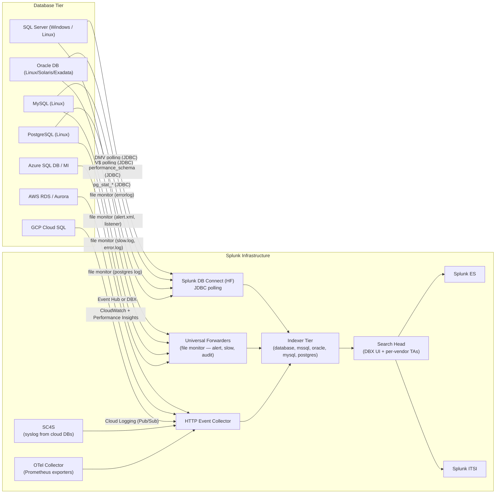

# Relational Databases (SQL Server, Oracle, MySQL, PostgreSQL) Integration Guide

> The definitive guide to monitoring relational databases with Splunk.
> 81 use cases across SQL Server, Oracle, MySQL/MariaDB/Percona, and
> PostgreSQL covering performance (slow queries, locks, deadlocks),
> capacity (storage, connection pools, IO), security (audit, privileged
> access, SQL injection patterns), availability (replication,
> Always-On AGs, Data Guard), and DBA operations (backup success,
> fragmentation, statistics freshness).

---

## Table of Contents

- [Quick Start](#quick-start)
- [Overview](#overview)
- [Architecture and Data Flow](#architecture)
- [Prerequisites](#prerequisites)
- [Database Coverage Matrix](#db-matrix)
- [Splunk DB Connect (DBX) — Foundation](#dbx)
- [Microsoft SQL Server](#mssql)
- [Oracle Database](#oracle)
- [MySQL / MariaDB / Percona](#mysql)
- [PostgreSQL](#postgresql)
- [Field Dictionary (Cross-DB)](#field-dictionary)
- [Sample Events](#sample-events)
- [Splunk-Side Configuration](#splunk-config)
- [Cloud-Managed Database Variants](#cloud-managed)
- [Cross-Product Correlation](#cross-product)
- [CIM Mapping Reference](#cim-mapping)
- [Compliance Mapping](#compliance)
- [Capacity Planning and Sizing](#sizing)
- [Recommended Dashboard Layouts](#dashboards)
- [ITSI Service Modeling](#itsi)
- [SOAR Playbook Examples](#soar)
- [Multi-Site / DR Strategy](#multi-site)
- [Security Hardening](#security-hardening)
- [Crawl / Walk / Run Roadmap](#roadmap)
- [Validation Checklist](#validation-checklist)
- [Known Limitations and Gaps](#known-limitations)
- [Troubleshooting](#troubleshooting)
- [FAQ](#faq)
- [Glossary](#glossary)
- [References](#references)
- [Contribution and Feedback](#contribution)

---

<a id="quick-start"></a>
## Quick Start — 60 Minutes from Zero to First Telemetry

> Two-pronged ingestion: (a) **DB Connect** for metrics from system
> views (DMVs in SQL Server, V$ in Oracle, `pg_stat_*` in PostgreSQL,
> `performance_schema` in MySQL); (b) **file monitor / SC4S** for
> error logs, slow logs, and audit logs.

1. **Install Splunk DB Connect** ([Splunkbase 2686](https://splunkbase.splunk.com/app/2686)) on a Heavy Forwarder + indexers + SH.
2. **Install per-vendor add-ons** as required:
   - SQL Server: [Splunk_TA_microsoft-sqlserver](https://splunkbase.splunk.com/app/2785)
   - Oracle: [Splunk Add-on for Oracle Database](https://splunkbase.splunk.com/app/3068)
3. **Create indexes**:

    ```ini
    [database]
    homePath = $SPLUNK_DB/database/db
    coldPath = $SPLUNK_DB/database/colddb
    thawedPath = $SPLUNK_DB/database/thaweddb
    maxDataSize = auto_high_volume
    frozenTimePeriodInSecs = 31536000   # 1 year for SOX / PCI / HIPAA audit
    ```

4. **DB Connect setup** — install JDBC driver(s), create per-DB identity (read-only), configure database connection, define a DBX input running every 60s.

5. **File monitor** for database error/audit/slow logs:

    ```ini
    # Linux (Oracle/MySQL/PostgreSQL UF)
    [monitor:///u01/app/oracle/diag/rdbms/*/alert/log.xml]
    sourcetype = oracle:alert
    index = database

    [monitor:///var/log/mysql/slow.log]
    sourcetype = mysql:slowquery
    index = database

    [monitor:///var/lib/pgsql/data/log/*.log]
    sourcetype = postgresql:log
    index = database
    ```

6. **Validate**:

    ```spl
    index=database earliest=-15m
    | stats count by sourcetype, host
    | sort -count
    ```

7. **Activate crawl tier** — UC-7.1.1 (slow queries), UC-7.1.5 (connection pool), UC-7.1.15 (backup success), UC-7.1.x (audit log ingestion).

---

<a id="overview"></a>
## Overview

### What this guide covers

| RDBMS | Use case fit |
|-------|-------------|
| **Microsoft SQL Server** | 2016, 2017, 2019, 2022; standalone + Always-On AG; Azure SQL DB / MI |
| **Oracle Database** | 12c, 19c, 21c, 23c; standalone + RAC; Data Guard; Exadata; Autonomous DB |
| **MySQL / MariaDB / Percona** | 5.7, 8.0; replication, group replication, InnoDB Cluster; Aurora MySQL |
| **PostgreSQL** | 12 – 17; streaming replication, logical replication; Aurora PG; Cloud SQL |

### Domains covered

| Domain | Examples |
|--------|---------|
| **Performance** | Slow queries, locks, blocking, deadlocks, plan regressions, wait stats |
| **Capacity** | Connections, storage growth, tablespace usage, IO throughput |
| **Availability** | Replication lag, failover events, AG health, Data Guard sync |
| **Backup/Recovery** | Backup success/fail, restore validation, RPO/RTO tracking |
| **Security** | Privileged access audit, failed logons, SQL injection patterns, schema changes |
| **DBA Operations** | Index fragmentation, statistics freshness, vacuum/analyze, maintenance |

### What's NOT in scope

| Domain | Where to look |
|--------|---------------|
| **NoSQL (Mongo, Cassandra, Elastic)** | Cat 7.5 guide (separate) |
| **Data warehouses (Snowflake, BigQuery, Redshift)** | Cat 7.6 guide (separate) |
| **OS-level health** | [Linux Servers](linux-servers.md), [Windows Servers](windows-servers.md) |
| **Hardware (storage arrays, SAN)** | Cat 6 storage guides |
| **Application-tier APM** | Splunk APM / Observability Cloud |
| **Cloud-RDS-specific telemetry** | [AWS](aws.md), [Azure](azure.md), [GCP](gcp.md) guides |

### What good looks like

| Dimension | Without integration | With full deployment |
|-----------|---------------------|----------------------|
| Slow query identification | Reactive ticket from app team | Proactive top-N daily |
| Backup failure | Discovered at recovery time | Real-time alert |
| Replication lag | Surprise cutover incident | Continuous SLO trend |
| Privileged access | No audit trail | SOX-ready audit reports |
| Capacity planning | Provisioning guesswork | Trended growth + 90-day forecast |
| Deadlock investigation | Manual log scrape | Indexed, searchable, correlated |

---

<a id="architecture"></a>
## Architecture and Data Flow



**Three primary ingest patterns:**

1. **DB Connect (DBX) JDBC polling** — for metrics from system views every 60s (or 5min for low-frequency)
2. **File monitor via UF** — for unstructured logs (Oracle alert log, MySQL slow query log, PostgreSQL log)
3. **Cloud-native pipelines** — for managed services (CloudWatch, Event Hubs, Cloud Logging)

---

<a id="prerequisites"></a>
## Prerequisites

### Splunk requirements

| Item | Detail |
|------|--------|
| **Splunk version** | Splunk Enterprise 9.0+ or Splunk Cloud (DBX requires HF) |
| **Splunk DB Connect** | 3.20+ — runs on a dedicated Heavy Forwarder ("DBX HF") |
| **Java version** | Java 11 or 17 (per DBX matrix) |
| **JDBC drivers** | SQL Server (Microsoft mssql-jdbc), Oracle (ojdbc11), MySQL (mysql-connector-j), PostgreSQL (postgresql-jdbc) |
| **Splunkbase add-ons** | Per RDBMS (see [Database Coverage Matrix](#db-matrix)) |
| **CIM Add-on** | For `Databases` data model (auto-installed in ES) |

### Database-side requirements

| Database | Required permissions | Required configs |
|---------|--------------------|-------------------|
| **SQL Server** | `VIEW SERVER STATE`, `VIEW DATABASE STATE`, `VIEW ANY DEFINITION`, `db_datareader` on each monitored DB | Audit enabled; Extended Events session for query stats |
| **Oracle** | `SELECT_CATALOG_ROLE`, `SELECT ANY DICTIONARY`, audit role | AUDIT_TRAIL=DB; Unified Auditing (12c+); ARCHIVELOG |
| **MySQL** | `PROCESS, REPLICATION CLIENT, SELECT` on `performance_schema` and `information_schema` | `slow_query_log=ON`, `long_query_time=1`, audit plugin loaded |
| **PostgreSQL** | `pg_monitor` role + `SELECT` on monitored schemas | `pg_stat_statements` extension; `log_destination='stderr'`; `logging_collector=on` |

### Networking

- DBX HF must reach each DB on its TCP port (1433, 1521, 3306, 5432) — typically restricted by firewall
- HF must reach indexers on splunkd port 9997 (TLS)
- DBs may need local UF (port 9997) for file monitor (or syslog)

---

<a id="db-matrix"></a>
## Database Coverage Matrix

| RDBMS | Native TA | Splunkbase | Sourcetypes | Cloud-vetted |
|-------|----------|-----------|-------------|--------------|
| **SQL Server** | Splunk_TA_microsoft-sqlserver | [2785](https://splunkbase.splunk.com/app/2785) | `mssql:errorlog`, `mssql:perf`, `mssql:query`, `mssql:audit` | Yes |
| **Oracle** | Splunk Add-on for Oracle Database | [3068](https://splunkbase.splunk.com/app/3068) | `oracle:alert`, `oracle:audit`, `oracle:listener`, `oracle:awr` | Yes |
| **MySQL** | (community via DBX) | [DBX 2686](https://splunkbase.splunk.com/app/2686) | `mysql:error`, `mysql:slowquery`, `mysql:status`, `mysql:audit` | Yes (DBX) |
| **PostgreSQL** | (community via DBX) | [DBX 2686](https://splunkbase.splunk.com/app/2686) | `postgresql:log`, `postgresql:metrics`, `postgresql:replication` | Yes (DBX) |

---

<a id="dbx"></a>
## Splunk DB Connect (DBX) — Foundation

DBX is the universal foundation for relational metrics across all four RDBMSes.

### Architecture

DBX runs as an **app on a Heavy Forwarder**. It exposes a UI (port 8000) for managing identities, connections, inputs, outputs, and lookups. Inputs poll a database via JDBC on a schedule and write events to an index.

### Best practices

| Topic | Recommendation |
|-------|----------------|
| **HF sizing** | 8 vCPU + 32 GB RAM minimum; SSD storage for DBX `kvstore` |
| **DBX HF count** | One per region or one per 50–100 DB connections |
| **Identity** | Per-DB read-only account, never `sa` / `sys` / `root` |
| **Polling interval** | 60s for high-value metrics; 300s for capacity; 24h for inventory |
| **Rising column** | Use timestamp or auto-increment ID to avoid re-polling same rows |
| **Batch size** | 5000 rows; tune up for high-volume DMV queries |
| **Throughput limit** | Use `maxConcurrentInputs` to throttle DBX workload |

### Identity creation example (least privilege)

**SQL Server:**
```sql
USE master;
CREATE LOGIN splunk_dbx WITH PASSWORD = '<strong-pwd>', CHECK_POLICY = ON;
GRANT VIEW SERVER STATE, VIEW ANY DEFINITION TO splunk_dbx;

USE [YourDB];
CREATE USER splunk_dbx FOR LOGIN splunk_dbx;
ALTER ROLE db_datareader ADD MEMBER splunk_dbx;
GRANT VIEW DATABASE STATE TO splunk_dbx;
```

**Oracle:**
```sql
CREATE USER splunk_dbx IDENTIFIED BY "<strong-pwd>";
GRANT CREATE SESSION TO splunk_dbx;
GRANT SELECT_CATALOG_ROLE TO splunk_dbx;
GRANT SELECT ANY DICTIONARY TO splunk_dbx;
GRANT SELECT ON SYS.AUD$ TO splunk_dbx;
GRANT SELECT ON SYS.DBA_AUDIT_SESSION TO splunk_dbx;
```

**MySQL:**
```sql
CREATE USER 'splunk_dbx'@'%' IDENTIFIED BY '<strong-pwd>';
GRANT PROCESS, REPLICATION CLIENT, SELECT ON *.* TO 'splunk_dbx'@'%';
FLUSH PRIVILEGES;
```

**PostgreSQL:**
```sql
CREATE ROLE splunk_dbx WITH LOGIN PASSWORD '<strong-pwd>';
GRANT pg_monitor TO splunk_dbx;
GRANT CONNECT ON DATABASE postgres TO splunk_dbx;
-- For pg_stat_statements:
CREATE EXTENSION IF NOT EXISTS pg_stat_statements;
```

### DBX input definition (UI / `db_inputs.conf`)

```ini
[mssql_perf_active_sessions]
connection = mssql_prod_01
mode = batch
query = SELECT host_name AS dest, login_name AS user, COUNT(*) AS active_sessions, GETDATE() AS poll_time \
        FROM sys.dm_exec_sessions WHERE is_user_process = 1 \
        GROUP BY host_name, login_name
interval = 60
sourcetype = mssql:perf
index = database
disabled = 0
```

### DBX health monitoring (UC-7.1.x)

```spl
index=_internal sourcetype=splunk_app_db_connect:server earliest=-15m
| stats count by host
| eval status=if(count>0, "DBX HF healthy", "DBX HF NOT REPORTING")
```

---

<a id="mssql"></a>
## Microsoft SQL Server

### Required Splunk components

| Component | Purpose |
|-----------|--------|
| Splunk_TA_microsoft-sqlserver | Field extractions for errorlog, audit, perf views |
| Splunk DB Connect | DMV polling |
| Splunk_TA_windows | Windows event log (SQL Server entries hit App + System logs) |

### Top DMVs to poll (DB Connect inputs)

| DMV | Purpose | Recommended interval |
|-----|---------|---------------------|
| `sys.dm_exec_query_stats` JOIN `sys.dm_exec_sql_text` | Top expensive queries | 60s (rising on `last_execution_time`) |
| `sys.dm_os_wait_stats` | Wait event analysis | 60s (delta math) |
| `sys.dm_exec_sessions` | Active session inventory | 60s |
| `sys.dm_exec_requests` | Currently executing | 30s |
| `sys.dm_db_index_physical_stats` | Fragmentation | weekly |
| `sys.dm_io_virtual_file_stats` | Per-file IO stats | 5min |
| `dm_hadr_database_replica_states` | Always-On AG health | 60s |
| `msdb.dbo.backupset` | Backup history | 5min (rising on `backup_finish_date`) |

### File monitor: SQL Server errorlog

Modern SQL Server (Linux) writes to `/var/opt/mssql/log/errorlog`; Windows to `C:\Program Files\Microsoft SQL Server\MSSQL15.MSSQLSERVER\MSSQL\Log\ERRORLOG`.

```ini
[monitor://C:\Program Files\Microsoft SQL Server\MSSQL15.MSSQLSERVER\MSSQL\Log\ERRORLOG]
sourcetype = mssql:errorlog
index = database
disabled = false
```

### Sample event (errorlog)

```
2026-04-25 14:30:00.50 spid51   Login failed for user 'app_user'. Reason: Could not find a login matching the name provided. [CLIENT: 203.0.113.5]
```

### SQL Server audit configuration

```sql
USE master;
CREATE SERVER AUDIT splunk_audit
    TO FILE (FILEPATH = 'D:\SQLAudit\', MAXSIZE = 256 MB, MAX_ROLLOVER_FILES = 10);
ALTER SERVER AUDIT splunk_audit WITH (STATE = ON);

CREATE SERVER AUDIT SPECIFICATION splunk_audit_spec
FOR SERVER AUDIT splunk_audit
    ADD (FAILED_LOGIN_GROUP),
    ADD (SUCCESSFUL_LOGIN_GROUP),
    ADD (SERVER_PERMISSION_CHANGE_GROUP),
    ADD (SCHEMA_OBJECT_CHANGE_GROUP),
    ADD (DATABASE_PRINCIPAL_CHANGE_GROUP),
    ADD (DATABASE_OBJECT_PERMISSION_CHANGE_GROUP)
    WITH (STATE = ON);
```

Then ingest the audit files via UF file monitor or DBX.

### Always-On AG monitoring (UC-7.1.x replication)

```sql
SELECT 
    db_name(database_id) AS db,
    is_local,
    synchronization_health_desc,
    log_send_queue_size,
    redo_queue_size,
    last_hardened_lsn,
    last_redone_lsn
FROM sys.dm_hadr_database_replica_states;
```

---

<a id="oracle"></a>
## Oracle Database

### Required Splunk components

| Component | Purpose |
|-----------|--------|
| Splunk Add-on for Oracle Database | Field extractions for alert log, listener, audit, AWR |
| Splunk DB Connect | V$ polling |
| Splunk Universal Forwarder | File monitor on Oracle host |

### Top V$/DBA views to poll

| View | Purpose | Recommended interval |
|------|---------|---------------------|
| `V$SESSION` | Active session inventory | 60s |
| `V$SQL` JOIN `V$SQLAREA` | Top expensive SQL | 60s |
| `V$ACTIVE_SESSION_HISTORY` | Wait analysis | 30s (or use AWR) |
| `V$LOCK` | Blocking locks | 60s |
| `DBA_TABLESPACE_USAGE_METRICS` | Tablespace fill % | 5min |
| `DBA_DATA_FILES` JOIN `V$DATAFILE` | File IO + size | 5min |
| `V$ARCHIVE_DEST_STATUS` | Archive log destination health | 60s |
| `V$DATAGUARD_STATS` | Data Guard lag | 60s |
| `DBA_AUDIT_TRAIL` | Audit events | 60s rising on `extended_timestamp` |
| `V$RMAN_BACKUP_JOB_DETAILS` | Backup history | 5min rising on `end_time` |

### File monitor: Oracle alert log + listener

Modern Oracle uses ADRCI directory structure:

```ini
[monitor:///u01/app/oracle/diag/rdbms/<dbname>/<sid>/alert/log.xml]
sourcetype = oracle:alert
index = database

[monitor:///u01/app/oracle/diag/tnslsnr/<host>/listener/alert/log.xml]
sourcetype = oracle:listener
index = database

[monitor:///u01/app/oracle/diag/rdbms/<dbname>/<sid>/trace/alert_<sid>.log]
sourcetype = oracle:alert
index = database
```

### Sample event (alert log)

```
2026-04-25T14:30:00.512+00:00
Errors in file /u01/app/oracle/diag/rdbms/orcl/orcl/trace/orcl_arc1_12345.trc:
ORA-19815: WARNING: db_recovery_file_dest_size of 53687091200 bytes is 95.42% used, and has 2456000000 remaining bytes available.
```

### Unified Auditing (12c+)

```sql
-- Create audit policy (privileged ops)
CREATE AUDIT POLICY splunk_priv_ops
    ACTIONS GRANT, ALTER USER, ALTER SYSTEM, CREATE USER, DROP USER,
            ALTER DATABASE, CREATE TABLE, DROP TABLE;
AUDIT POLICY splunk_priv_ops;

-- View audit trail
SELECT event_timestamp, dbusername, os_username, action_name, object_name, sql_text
FROM unified_audit_trail
WHERE event_timestamp > SYSDATE - 1/24;
```

DBX rising column: `event_timestamp`.

### Data Guard monitoring

```sql
SELECT name, value, time_computed
FROM v$dataguard_stats
WHERE name IN ('apply lag','transport lag','estimated startup time');
```

### AWR snapshot ingestion

For deep performance analysis, schedule a DBX query against `dba_hist_*` views to extract AWR-equivalent data into Splunk for trending. (Caution: AWR is licensed under Oracle Diagnostics Pack — verify your licensing.)

---

<a id="mysql"></a>
## MySQL / MariaDB / Percona

### Required Splunk components

| Component | Purpose |
|-----------|--------|
| Splunk DB Connect | `performance_schema` + `information_schema` polling |
| Splunk Universal Forwarder | File monitor for slow log + error log |

### Critical configurations

```ini
# my.cnf
[mysqld]
slow_query_log = ON
slow_query_log_file = /var/log/mysql/slow.log
long_query_time = 1
log_queries_not_using_indexes = ON
log_slow_admin_statements = ON

log_error = /var/log/mysql/error.log

# Audit (MariaDB plugin or Percona Audit Log Plugin)
plugin_load = "server_audit=server_audit.so"
server_audit_logging = ON
server_audit_events = "CONNECT,QUERY_DDL,QUERY_DCL,TABLE,QUERY"
server_audit_file_path = /var/log/mysql/audit.log

# Performance Schema (default ON in 5.7+)
performance_schema = ON
```

### Top performance_schema views to poll

| View | Purpose |
|------|--------|
| `events_statements_summary_by_digest` | Aggregated query patterns |
| `events_waits_summary_global_by_event_name` | Wait events |
| `replication_connection_status` JOIN `replication_applier_status` | Replication health |
| `processlist` | Current connections |
| `innodb_metrics` | InnoDB engine internals |

### File monitor

```ini
[monitor:///var/log/mysql/slow.log]
sourcetype = mysql:slowquery
index = database

[monitor:///var/log/mysql/error.log]
sourcetype = mysql:error
index = database

[monitor:///var/log/mysql/audit.log]
sourcetype = mysql:audit
index = database
```

### Sample event (slow log)

```
# Time: 2026-04-25T14:30:00.123456Z
# User@Host: app_user[app_user] @ app-server-01.example.com [10.0.0.50]
# Thread_id: 12345  Schema: orders  QC_hit: No
# Query_time: 5.234567  Lock_time: 0.000123  Rows_sent: 1  Rows_examined: 1234567
SET timestamp=1745596200;
SELECT * FROM orders WHERE customer_id = 42 AND status IN ('pending','processing');
```

Parsed: `query_time`=5.234567, `rows_examined`=1234567, `db`=orders, `user`=app_user, `clientip`=10.0.0.50.

### Replication monitoring

```sql
SHOW REPLICA STATUS\G

-- Or in modern MySQL 8.0:
SELECT * FROM performance_schema.replication_connection_status;
SELECT * FROM performance_schema.replication_applier_status_by_worker;
```

DBX poll interval 60s; alert if `Seconds_Behind_Source > 30`.

---

<a id="postgresql"></a>
## PostgreSQL

### Required Splunk components

| Component | Purpose |
|-----------|--------|
| Splunk DB Connect | `pg_stat_*` polling |
| Splunk Universal Forwarder | File monitor for PG log |

### Critical extensions

```sql
CREATE EXTENSION IF NOT EXISTS pg_stat_statements;
CREATE EXTENSION IF NOT EXISTS auto_explain;  -- optional
```

### postgresql.conf settings

```ini
# Logging
log_destination = 'stderr,csvlog'
logging_collector = on
log_directory = 'pg_log'
log_filename = 'postgresql-%a.log'
log_rotation_age = 1d
log_min_duration_statement = 1000   # log queries > 1 sec
log_checkpoints = on
log_connections = on
log_disconnections = on
log_lock_waits = on
log_temp_files = 0
log_autovacuum_min_duration = 0

# Audit (pgAudit extension)
shared_preload_libraries = 'pg_stat_statements,pgaudit'
pgaudit.log = 'role,read,write,ddl,misc'
pgaudit.log_catalog = off
pgaudit.log_parameter = on
```

### Top pg_stat_* views to poll

| View | Purpose |
|------|--------|
| `pg_stat_statements` | Top expensive queries (requires extension) |
| `pg_stat_activity` | Current connections + queries |
| `pg_stat_replication` | Standby lag for streaming replication |
| `pg_stat_database` | Per-DB stats (commits, rollbacks, blks) |
| `pg_stat_user_tables` | Table-level stats (vacuum, analyze freshness) |
| `pg_stat_bgwriter` | Background writer / checkpoint stats |
| `pg_locks` JOIN `pg_stat_activity` | Lock waits + blockers |

### File monitor

```ini
[monitor:///var/lib/pgsql/data/pg_log/*.log]
sourcetype = postgresql:log
index = database
```

### Sample event (PostgreSQL log)

```
2026-04-25 14:30:00.123 UTC [12345] LOG:  duration: 5234.567 ms  statement: SELECT o.*, c.name FROM orders o JOIN customers c ON c.id = o.customer_id WHERE o.status = 'pending'
2026-04-25 14:30:00.500 UTC [12346] FATAL:  password authentication failed for user "app_user"
2026-04-25 14:30:01.000 UTC [12347] LOG:  process 12347 still waiting for ShareLock on transaction 5678 after 1000.234 ms
```

### Replication monitoring

```sql
SELECT 
    application_name AS replica,
    client_addr,
    state,
    sync_state,
    pg_wal_lsn_diff(pg_current_wal_lsn(), sent_lsn) AS sent_lag_bytes,
    pg_wal_lsn_diff(pg_current_wal_lsn(), replay_lsn) AS replay_lag_bytes,
    EXTRACT(EPOCH FROM (now() - reply_time)) AS reply_lag_sec
FROM pg_stat_replication;
```

DBX poll interval 60s.

---

<a id="field-dictionary"></a>
## Field Dictionary (Cross-DB)

After CIM `Databases` mapping (or custom field aliases), these fields are normalised:

| CIM field | SQL Server | Oracle | MySQL | PostgreSQL |
|-----------|-----------|--------|-------|-----------|
| `host` | server name | DB host | DB host | DB host |
| `database` | dbname | service_name / pdb | schema | datname |
| `user` | login_name | dbusername | user | usename |
| `client_ip` | client_net_address | userhost | clientip | client_addr |
| `query_time_ms` | total_elapsed_time / 1000 | elapsed_time / 1000 | query_time*1000 | duration |
| `rows_examined` | reads | n/a | rows_examined | n/a |
| `cpu_time_ms` | cpu_time | cpu_time | n/a | n/a |
| `wait_event` | wait_type | event | wait_event | wait_event |
| `vendor_product` | "Microsoft SQL Server" | "Oracle" | "MySQL" | "PostgreSQL" |

### Cross-DB normalised SPL example (slow queries)

```spl
index=database (sourcetype="mysql:slowquery" OR sourcetype="postgresql:log" OR sourcetype="mssql:query" OR sourcetype="oracle:sql")
| eval dur_ms=coalesce(query_time_ms, duration_ms, query_time*1000)
| where dur_ms > 1000
| stats count, avg(dur_ms) as avg_ms, p95(dur_ms) as p95_ms by sourcetype, host, database
| sort -avg_ms
```

---

<a id="sample-events"></a>
## Sample Events

(See per-RDBMS sections above.)

---

<a id="splunk-config"></a>
## Splunk-Side Configuration

### Index strategy

```ini
# Single shared index (small estate)
[database]
homePath = $SPLUNK_DB/database/db
maxDataSize = auto_high_volume
frozenTimePeriodInSecs = 31536000   # 1 year audit baseline

# Per-vendor indexes (large estate)
[mssql]
maxDataSize = auto_high_volume

[oracle]
maxDataSize = auto_high_volume

[mysql]
maxDataSize = auto_high_volume

[postgres]
maxDataSize = auto_high_volume
```

### Datamodel acceleration (Databases)

```ini
# datamodel.conf (in DA-ESS-Databases or custom app)
[Databases]
acceleration = true
acceleration.earliest_time = -7d
acceleration.cron_schedule = */5 * * * *
```

Validate:

```spl
| tstats summariesonly=true count from datamodel=Databases.All_Databases by Databases.vendor_product
```

### Field aliases & calculated fields

In `props.conf` per sourcetype, map vendor-specific fields to CIM:

```ini
# props.conf
[mssql:perf]
FIELDALIAS-host_alias = host_name AS host
FIELDALIAS-user_alias = login_name AS user
EVAL-vendor_product = "Microsoft SQL Server"

[oracle:audit]
FIELDALIAS-host_alias = userhost AS host
FIELDALIAS-user_alias = dbusername AS user
EVAL-vendor_product = "Oracle"
```

---

<a id="cloud-managed"></a>
## Cloud-Managed Database Variants

| Cloud DB | Recommended ingestion |
|---------|----------------------|
| **AWS RDS / Aurora (MySQL/PG/MSSQL/Oracle)** | (a) Performance Insights API via [Splunk Add-on for AWS](aws.md); (b) RDS log files to CloudWatch Logs → Splunk; (c) DBX direct (if VPC peering) |
| **Azure SQL DB / MI** | (a) Azure Monitor Logs → Event Hub → [Splunk Add-on for Microsoft Cloud Services](azure.md); (b) DBX direct |
| **GCP Cloud SQL / AlloyDB** | (a) Cloud Logging → Pub/Sub → [Splunk Add-on for GCP](gcp.md); (b) DBX direct |
| **Snowflake / Databricks** | (Out of scope; cat 7.6 data warehouses guide) |

---

<a id="cross-product"></a>
## Cross-Product Correlation

### DB + Web (transaction tracing)

```spl
(index=database sourcetype="mysql:slowquery") OR (index=web sourcetype=access_combined)
| transaction client_ip uri maxspan=5s
| stats avg(query_time) as db_time, avg(response_time) as web_time, count by uri
```

### DB + Linux (storage / IO correlation)

```spl
(index=database sourcetype="postgresql:log" "checkpoint" OR "WAL")
OR (index=os sourcetype="iostat")
| stats avg(util) as disk_util, avg(checkpoint_duration) by host
```

### DB + AD (privileged user audit)

```spl
(index=database sourcetype="mssql:audit" action_id IN ("LGFL","LGSF","CR","DRP"))
| join type=left user [
    search index=ad sourcetype=admon object_class=user
    | rename sAMAccountName as user
]
| stats values(action_id) by user, displayName
```

### DB + ITSI (service health)

Bind DB metrics into ITSI service health scores — see [Splunk ITSI Guide](splunk-itsi.md).

---

<a id="cim-mapping"></a>
## CIM Mapping Reference

| CIM model | Object | Sourcetypes |
|-----------|--------|-------------|
| **Databases** | Databases | `mssql:perf`, `oracle:session`, `mysql:status`, `postgresql:metrics` |
| **Databases** | Instance_Stats | `mssql:perf`, `oracle:awr` |
| **Databases** | Query | `mysql:slowquery`, `postgresql:log`, `mssql:query`, `oracle:sql` |
| **Authentication** | Authentication | Audit logs (failed/success logins) |
| **Change** | All_Changes | Schema change audit events |

Validate:

```spl
| datamodel Databases All_Databases search 
| stats count by sourcetype, vendor_product
```

---

<a id="compliance"></a>
## Compliance Mapping

### SOX / ITGC (FF Section 404)

| Control | UC examples |
|---------|------------|
| Privileged access audit | UC-7.1.x audit (logins, GRANT, REVOKE) |
| Backup/recovery validation | UC-7.1.15 (backup success) |
| Change management | UC-7.1.x DDL audit |
| Segregation of duties | Role assignment audit |

### PCI-DSS 4.0

| Requirement | Coverage |
|-------------|----------|
| **3.5** Restrict access to PAN | DB encryption + access audit |
| **8.2** Strong authentication | Login audit |
| **10.2.1.1** Privileged access | DBA action audit |
| **10.2.1.2** Login attempts | Failed login UCs |
| **10.7** ≥1 year audit retention | Index policy |

### HIPAA Security Rule

| §164.312 | Coverage |
|---------|----------|
| (a)(1) Access Control | DB role audit |
| (b) Audit Controls | Full audit trail |
| (c)(2) Integrity | Backup verification |

### NIST 800-53

| Control | Coverage |
|---------|----------|
| **AC-2** Account Management | Account create/modify audit |
| **AC-6** Least Privilege | Role assignment audit |
| **AU-2/12** Audit | Foundational |
| **CP-9** System Backup | UC-7.1.15 + retention |
| **CP-10** Recovery | Restore validation UCs |

### GDPR

| Article | Coverage |
|---------|----------|
| Art 32 Security of processing | All security UCs |
| Art 33 Breach notification | Failed-access spike alerts |
| Art 30 Records of processing | DDL audit |

### CIS Database Benchmarks

Each RDBMS has a CIS hardening benchmark — Splunk dashboards can verify configuration drift.

---

<a id="sizing"></a>
## Capacity Planning and Sizing

### Per-DB ingest baseline (typical)

| Workload | Logs+DBX daily |
|----------|----------------|
| Small (low traffic, light audit) | ~100 MB/day |
| Medium (OLTP, full audit) | ~1 GB/day |
| Large (heavy traffic, slow log + audit + DMV) | ~10 GB/day |
| Very large (extreme volume / Oracle EBS / SAP) | ~50–200 GB/day |

### Worked examples

| Estate | Total ingest |
|--------|-------------|
| 10 DBs (mixed) | ~10 GB/day |
| 100 DBs | ~100 GB/day |
| 1000 DBs (large enterprise) | ~1 TB/day |

### Retention recommendations

| Data | Retention | Rationale |
|------|-----------|-----------|
| Audit | ≥1 year (often 7 years for SOX) | Compliance |
| Slow query logs | 90 days | Performance trending |
| DBX metrics | 90 days hot; 1-year cold | Capacity planning |
| Backup history | 2 years+ | Audit trail |
| Errorlog | 1 year | Debugging |

---

<a id="dashboards"></a>
## Recommended Dashboard Layouts

### Crawl — "Database At a Glance"

```
+---------------------+---------------------+
| INSTANCE INVENTORY (count by vendor)       |
+---------------------+---------------------+
| ALL ERRORS BY SEVERITY (last 24h)          |
+---------------------+---------------------+
| BACKUP STATUS GRID                         |
+---------------------+---------------------+
| FAILED LOGINS (last 1h)                    |
+---------------------+---------------------+
```

### Walk — "DBA Operations"

```
+---------------------+---------------------+
| TOP-N SLOW QUERIES (with avg/p95/p99)      |
+---------------------+---------------------+
| LOCK / DEADLOCK COUNT TREND                |
+---------------------+---------------------+
| CONNECTION POOL UTILISATION                |
+---------------------+---------------------+
| TABLESPACE / DB FILE GROWTH (90-day)       |
+---------------------+---------------------+
```

### Run — "Performance & Replication"

```
+---------------------+---------------------+
| WAIT EVENT BREAKDOWN (per instance)        |
+---------------------+---------------------+
| REPLICATION LAG (per replica)              |
+---------------------+---------------------+
| INDEX FRAGMENTATION HEAT MAP               |
+---------------------+---------------------+
| QUERY PLAN REGRESSION ALERTS               |
+---------------------+---------------------+
```

---

<a id="itsi"></a>
## ITSI Service Modeling

### Service hierarchy

```
Database Tier
├── OLTP (Transactional)
│   ├── orders-db (entity)
│   ├── inventory-db (entity)
│   └── ...
├── OLAP (Analytical)
│   ├── reporting-db
│   └── data-mart
├── Replication / DR
│   └── (replicas, AGs, Data Guards)
└── DBA Operations
    ├── backup-jobs
    └── maintenance-windows
```

### Recommended KPIs

| KPI | Source | Threshold |
|-----|--------|-----------|
| Slow query rate | DBX (top expensive queries) | Adaptive |
| Connection pool % | DBX | Static (warn 70%, page 90%) |
| Replication lag (sec) | DBX | Static (warn 30s, page 120s) |
| Backup success | Backup history | Static (page on fail) |
| Tablespace fill % | DBX | Static (warn 80%, page 90%) |
| Failed logon rate | Audit logs | Static (page > 10/min) |
| Deadlock count | Errorlog / pg_log | Static (page > 5/hour) |
| AG sync health | DMV `dm_hadr_*` | Static (page on degraded) |

---

<a id="soar"></a>
## SOAR Playbook Examples

### Playbook 1: Slow Query Spike (UC-7.1.1)

**Trigger:** Slow query rate > 10/min sustained 5 min.

```
1. RECEIVE alert (db, query_pattern, p99 duration)
2. PULL execution plan from system views
3. CHECK if recent app deployment or DB change correlates
4. CHECK if statistics are stale (last gather >7d)
5. CHECK if blocking lock is present
6. DECISION:
   - Bad plan → enable plan-guide / hint
   - Stale stats → run UPDATE STATISTICS
   - Lock blocker → kill blocker SPID
   - Capacity → page DBA
7. CREATE Sev-2 incident
```

### Playbook 2: Replication Lag (UC-7.1.x)

**Trigger:** Replica lag > 60s for 5 min.

```
1. RECEIVE alert (primary, replica, lag_sec)
2. CHECK network latency between primary and replica
3. CHECK replica IO/CPU saturation
4. CHECK if primary has long-running tx blocking WAL/redo
5. DECISION:
   - Network issue → page network team
   - Replica overload → page DBA, may need scale-up
   - Long tx on primary → identify session, escalate
6. NOTIFY app teams if read-replica traffic affected
```

### Playbook 3: Backup Failure (UC-7.1.15)

**Trigger:** Scheduled backup failed.

```
1. RECEIVE alert (db, job_name, error_message)
2. CHECK backup destination (filesystem, S3, tape) availability
3. CHECK previous successful backup time → RPO impact
4. CHECK backup credentials (expired secret? rotated key?)
5. RETRY backup if transient
6. ESCALATE to DBA if persistent
7. UPDATE compliance dashboard (failed backup = SOX exception)
```

### Playbook 4: Privileged Access Audit (security)

**Trigger:** GRANT or new sysadmin/DBA privilege detected.

```
1. RECEIVE alert (db, granted_user, granting_user, permission)
2. CROSS-CHECK against approved change ticket (ServiceNow query)
3. NOTIFY security team if no approved ticket
4. CREATE high-priority security investigation if unauthorised
5. AUTO-REVOKE if confirmed unauthorised + critical perm
```

---

<a id="multi-site"></a>
## Multi-Site / DR Strategy

For globally-distributed DB infrastructure:

- **Per-region DBX HF** writing to local indexer cluster
- **Per-site indexes** (`database_emea`, `database_amer`, `database_apac`)
- **Cross-region search** for global views (e.g., DBA bird's-eye)
- **DR site DBs** (replicas) monitored for lag — failover-ready check
- **Backup destinations** validated cross-region (geo-redundant)

---

<a id="security-hardening"></a>
## Security Hardening

### DBX hardening

- Run DBX HF on a hardened, dedicated host (not shared with other workloads)
- Store JDBC credentials in DBX encrypted credential store, never plain text
- Use TLS for all JDBC connections (`encrypt=true`, `trustServerCertificate=false`)
- Restrict DBX HF egress firewall to only required DB IPs:ports
- Use Splunk RBAC to restrict who can edit DBX inputs / connections
- Monitor DBX itself: `dbx:server_health` for the HF daemon

### Database account hygiene

- One read-only account per DB monitored (not shared with other tools)
- Strong password rotation policy (90-day max)
- Account scoped to needed views only (no `sa`, `sys`, `root`)
- Audit Splunk monitoring account activity (it should not run DML)

### Field-level RBAC

- `sql_text` field in slow query / audit logs may contain PII (customer names, SSNs in WHERE clauses)
- Restrict via Splunk role-based field filtering
- Consider hashing or truncating SQL text for cardinality control

```ini
# Example field-level mask in props.conf
[mssql:audit]
SEDCMD-mask_pii = s/\b\d{3}-\d{2}-\d{4}\b/[SSN-REDACTED]/g
```

---

<a id="roadmap"></a>
## Crawl / Walk / Run Roadmap

### Crawl (Week 1–2)

1. Install DB Connect on a HF
2. Install per-vendor TAs (SQL Server, Oracle)
3. Onboard 1–2 pilot DBs per vendor
4. Configure basic DBX inputs (active sessions, connections, top queries)
5. File monitor for error logs
6. UC-7.1.1 (slow queries) + UC-7.1.5 (connections)
7. Crawl dashboard

### Walk (Week 3–6)

1. Onboard remaining production DBs (20–80% coverage)
2. Enable DB-side audit (SQL Server audit, Oracle Unified Audit, MySQL audit plugin, pgAudit)
3. Backup history ingestion
4. Replication / AG / Data Guard monitoring
5. CIM Databases acceleration
6. Walk-tier UCs

### Run (Month 2+)

1. ITSI services per database
2. SOAR playbooks for top 5 incident patterns
3. Cross-product correlation (web, AD, OS)
4. Run-tier UCs (wait events, plan regression, fragmentation)
5. Quarterly performance + compliance review

---

<a id="validation-checklist"></a>
## Validation Checklist

### Day 1

- [ ] DBX installed on HF
- [ ] At least one per-vendor TA installed
- [ ] First pilot DB onboarded
- [ ] DBX input running every 60s
- [ ] CIM Databases populating
- [ ] UC-7.1.1 alert wired

### Day 7

- [ ] Pilot fleet (5–10 DBs) instrumented
- [ ] Crawl dashboard live
- [ ] File monitor for error logs
- [ ] Backup ingestion + alert

### Day 30

- [ ] >50% DB coverage
- [ ] Audit ingestion enabled
- [ ] Walk dashboards live
- [ ] First SOAR playbook in production

### Day 90

- [ ] All production DBs onboarded
- [ ] ITSI services per DB
- [ ] Run-tier UCs deployed
- [ ] Quarterly review

---

<a id="known-limitations"></a>
## Known Limitations and Gaps

| Limitation | Impact | Workaround |
|------------|--------|------------|
| **DBX requires Java + HF** | Heavyweight; not Splunk Cloud-native | Run on dedicated HF tier |
| **Polling = stale data** | 60s gap minimum | Use trigger-based DB streaming where available |
| **`sql_text` cardinality explosion** | Index pressure | Hash or truncate SQL text |
| **Oracle AWR licensing** | Diagnostics Pack required | Use V$ views, lighter footprint |
| **MySQL slow log flooding** | Disk pressure on DB host | Tune `long_query_time` upward |
| **PostgreSQL log line wrapping** | Multi-line events tricky | Use CSV log format |
| **Always-On AG metrics need sysadmin** | Privileged DBX account risk | Use dedicated AG-monitoring account |
| **Cloud-managed DB system view restrictions** | RDS hides some DMVs | Use Performance Insights API instead |

---

<a id="troubleshooting"></a>
## Troubleshooting

### DBX input not running

- Check DBX UI: **Health > Inputs** — look for failed status
- `index=_internal source="*splunk_app_db_connect*" log_level=ERROR earliest=-1h`
- Verify connection: **Connections > Test**
- Check JDBC driver version compatibility

### Slow query log not parsing

- MySQL: ensure `slow_query_log_file` is being written to and UF can read
- Check `props.conf` — sourcetype `mysql:slowquery` line breaking should match `^# Time:`

### Oracle alert log not found

- ADRCI path varies by Oracle version — verify `ADR_BASE` and instance dir
- For 12c+, alert log XML is at `<ADR_BASE>/diag/rdbms/<dbname>/<sid>/alert/log.xml`

### High volume from one DB

- DBX poll interval too aggressive — increase from 30s to 300s
- Audit policy too broad — reduce ADD AUDIT items
- MySQL `general_log` enabled — turn off (use slow log only)

### Replication monitoring shows lag spike

- Verify `pg_stat_replication.reply_time` is being captured (PG ≥10)
- For SQL Server AG, ensure `dm_hadr_database_replica_states` is queryable
- Use standby polling, not from primary if primary is in low-priv mode

### Time skew

- DB host clock vs Splunk indexer clock — sync via NTP
- Per-RDBMS timestamp formats vary; verify `TIME_FORMAT` in props.conf

---

<a id="faq"></a>
## FAQ

**Q: DB Connect or per-vendor TA?**
A: Both. DBX is the universal foundation for metrics from system views. Per-vendor TAs add field extractions for unstructured logs (errorlog, audit, alert log).

**Q: How many DBs can one DBX HF handle?**
A: 50–100 typical, depending on poll frequency and query complexity. Beyond that, scale to multiple HFs.

**Q: Should I monitor system DBs (master, msdb, mysql)?**
A: Yes for instance-level health (audit, backup), but not for application-level performance UCs.

**Q: Can DBX poll Always-On secondary replicas?**
A: Yes if read-only routing is configured. Useful for replica-specific monitoring without primary load.

**Q: Should I use CIM Databases or build custom dashboards?**
A: Use CIM for cross-vendor consistency; build custom for vendor-specific deep-dives.

**Q: How do I handle SQL text containing PII?**
A: Either hash via `md5(sql_text)`, truncate to first 100 chars, or apply field-level RBAC + SEDCMD mask in props.conf.

**Q: What about AWS RDS Performance Insights vs DBX?**
A: PI gives wait-event detail per-engine. Combine: PI for AWS-managed-DB metrics; DBX for everything else.

**Q: Should I audit `SELECT` statements?**
A: Generally no (volume too high). Audit DDL, DCL, privileged actions, failed logins, and selects on PII tables only.

**Q: How do I correlate slow query with end-user transaction?**
A: Add `request_id` as a SQL comment from the app: `SELECT /* request_id=abc-123 */ ...` then `transaction request_id` across DB + Web.

**Q: ITSI alone good enough or do I need ES too?**
A: ITSI for performance + capacity health. ES for security UCs (privileged access, anomaly detection on audit).

---

<a id="glossary"></a>
## Glossary

| Term | Definition |
|------|-----------|
| **DBX** | Splunk DB Connect (the app) |
| **DMV** | Dynamic Management View (SQL Server's runtime catalog) |
| **V$ view** | Oracle dynamic performance view |
| **AWR** | Automatic Workload Repository (Oracle, licensed) |
| **AG** | Always-On Availability Group (SQL Server HA/DR) |
| **Data Guard** | Oracle DR / replication tech |
| **WAL** | Write-Ahead Log (PostgreSQL) |
| **InnoDB** | MySQL's transactional storage engine |
| **RPO** | Recovery Point Objective |
| **RTO** | Recovery Time Objective |
| **OLTP** | Online Transaction Processing (transactional workload) |
| **OLAP** | Online Analytical Processing (reporting workload) |
| **Wait event** | Time the DB engine spent waiting for a resource |
| **pgAudit** | PostgreSQL audit extension |

---

<a id="references"></a>
## References

- [Splunk DB Connect (Splunkbase 2686)](https://splunkbase.splunk.com/app/2686)
- [Splunk Add-on for Microsoft SQL Server (Splunkbase 2785)](https://splunkbase.splunk.com/app/2785)
- [Splunk Add-on for Oracle Database (Splunkbase 3068)](https://splunkbase.splunk.com/app/3068)
- [DB Connect documentation](https://docs.splunk.com/Documentation/DBX)
- [SQL Server DMV reference](https://learn.microsoft.com/en-us/sql/relational-databases/system-dynamic-management-views/system-dynamic-management-views)
- [Oracle V$ views reference](https://docs.oracle.com/en/database/oracle/oracle-database/19/refrn/dynamic-performance-views.html)
- [MySQL Performance Schema](https://dev.mysql.com/doc/refman/8.0/en/performance-schema.html)
- [PostgreSQL pg_stat_statements](https://www.postgresql.org/docs/current/pgstatstatements.html)
- [CIS Database Benchmarks](https://www.cisecurity.org/cis-benchmarks)

---

<a id="contribution"></a>
## Contribution and Feedback

Part of the [Splunk Monitoring Use Cases](https://github.com/fenre/splunk-monitoring-use-cases) project. [Open an issue](https://github.com/fenre/splunk-monitoring-use-cases/issues/new) for feedback.

---

*Last updated: 2026-05-09. Covers Splunk DB Connect 3.20+, Splunk_TA_microsoft-sqlserver 6.x, Splunk Add-on for Oracle Database 4.x.*
