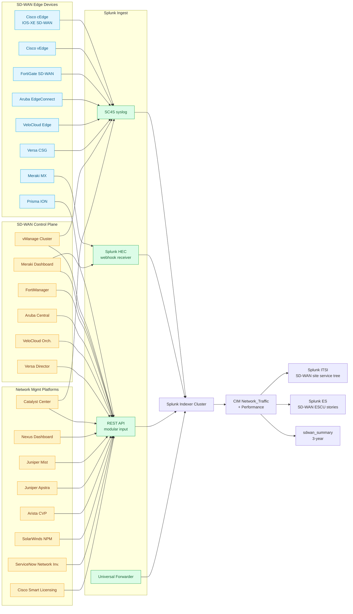

# SD-WAN & Network Management Platforms Integration Guide

> Operational, security, and compliance monitoring for the SD-WAN
> overlay (cat 5.5, 25 UCs) and the multi-vendor Network Management
> Platform layer (cat 5.8, 29 UCs). Covers Cisco Catalyst SD-WAN<sup class="ref">[<a href="#ref-1">1</a>]</sup>
> (vManage / cEdge / vEdge), Cisco Meraki MX, Aruba EdgeConnect,
> VeloCloud, Versa, Fortinet Secure SD-WAN, Prisma SD-WAN,
> Cisco Catalyst Center (DNA-C), Cisco Nexus Dashboard, Aruba Central,
> Juniper Mist + Apstra, Arista CloudVision, ServiceNow Network
> Inventory, SolarWinds, ManageEngine, and the integration with Cisco
> Smart Licensing. Companion guide to `cisco-networks.md` (cat 5.1) and
> `catalyst-center.md` (Catalyst Center deep dive).

## Table of Contents

- [Quick Start — From Zero to First SD-WAN Tunnel View](#quick-start--from-zero-to-first-sd-wan-tunnel-view)
- [Overview](#overview)
- [Architecture and Data Flow](#architecture-and-data-flow)
- [Prerequisites](#prerequisites)
- [Domain 1 — SD-WAN (cat 5.5, 25 UCs)](#domain-1--sd-wan-cat-55-25-ucs)
- [Domain 2 — Network Management Platforms (cat 5.8, 29 UCs)](#domain-2--network-management-platforms-cat-58-29-ucs)
- [Sizing and Capacity Planning](#sizing-and-capacity-planning)
- [Compliance and Audit Evidence Pack](#compliance-and-audit-evidence-pack)
- [Crawl / Walk / Run Roadmap](#crawl--walk--run-roadmap)
- [Dashboards](#dashboards)
- [SPL Examples](#spl-examples)
- [Troubleshooting](#troubleshooting)
- [SOAR Playbooks](#soar-playbooks)
- [Cross-Product Integration](#cross-product-integration)

## Quick Start — From Zero to First SD-WAN Tunnel View

### Day 1: Identify SD-WAN platform + management plane

| Platform | Control plane | Telemetry sources |
|---|---|---|
| Cisco Catalyst SD-WAN | vManage cluster | syslog + REST + Smart Licensing |
| Cisco Meraki SD-WAN | Meraki Dashboard | webhook + Dashboard API |
| Aruba EdgeConnect | Aruba Central / Orchestrator | REST + syslog |
| VeloCloud | VCO (Orchestrator) | REST + syslog from edge |
| Versa Networks | Versa Director + Analytics | REST + syslog |
| Fortinet Secure SD-WAN | FortiManager / FortiAnalyzer | REST + syslog + FortiAnalyzer event |
| Prisma SD-WAN | Prisma SASE Cloud | REST API + log forwarding |
| Cato SD-WAN | Cato Cloud | event API |
| Juniper SD-WAN (SSR) | Juniper Mist | event API |
| Citrix SD-WAN | NetScaler SD-WAN Center | syslog + REST |

### Day 2: Stand up the indexes

```ini
[sdwan]
homePath = $SPLUNK_DB/sdwan/db
coldPath = $SPLUNK_DB/sdwan/colddb
thawedPath = $SPLUNK_DB/sdwan/thaweddb
maxDataSize = auto_high_volume
frozenTimePeriodInSecs = 31536000

[sdwan_summary]
homePath = $SPLUNK_DB/sdwan_summary/db
coldPath = $SPLUNK_DB/sdwan_summary/colddb
thawedPath = $SPLUNK_DB/sdwan_summary/thaweddb
maxDataSize = auto
frozenTimePeriodInSecs = 220752000

[network_mgmt]
homePath = $SPLUNK_DB/network_mgmt/db
coldPath = $SPLUNK_DB/network_mgmt/colddb
thawedPath = $SPLUNK_DB/network_mgmt/thaweddb
maxDataSize = auto_high_volume
frozenTimePeriodInSecs = 31536000

[meraki]
homePath = $SPLUNK_DB/meraki/db
coldPath = $SPLUNK_DB/meraki/colddb
thawedPath = $SPLUNK_DB/meraki/thaweddb
maxDataSize = auto_high_volume
frozenTimePeriodInSecs = 31536000

[smart_licensing]
homePath = $SPLUNK_DB/smart_licensing/db
coldPath = $SPLUNK_DB/smart_licensing/colddb
thawedPath = $SPLUNK_DB/smart_licensing/thaweddb
maxDataSize = auto
frozenTimePeriodInSecs = 220752000
```

### Day 3: Cisco Catalyst SD-WAN

Install **Cisco Catalyst Add-on for Splunk** (Splunkbase 7538). Configure
syslog from vManage to SC4S; configure REST modular input on a Heavy
Forwarder polling vManage REST APIs (`/dataservice/device`,
`/dataservice/device/bfd/sessions`, `/dataservice/device/tunnel/statistics`).

Within 24 hours you'll have the headline panel: **per-site BFD tunnel
state matrix** showing every transport circuit at every branch, with
green/yellow/red status.

### Day 4–5: Add Meraki via webhook

Cisco Meraki Dashboard → Network-wide → Alerts → Webhook. Point at
Splunk HEC `https://hec.splunk.example.com:443/services/collector/raw?index=meraki&sourcetype=cisco:meraki:webhook`.

### Day 6–7: First SD-WAN dashboards

- BFD tunnel matrix (UC-5.5.1)
- WAN link utilisation per transport (UC-5.5.10)
- Application SLA compliance (UC-5.5.6)
- vManage controller health
- Meraki organization-level event timeline

## Overview

### Why SD-WAN + NMP visibility matters

SD-WAN is the third major networking architecture shift of the past
decade (after virtualization and cloud). Every enterprise of any size
runs at least one SD-WAN overlay across MPLS / Internet / 4G/5G
transports. SD-WAN failures cause branch outages, remote-worker
disruption, and (when paths fail in unexpected ways) compliance gaps
because PCI / HIPAA / GDPR<sup class="ref">[<a href="#ref-3">3</a>]</sup>-protected traffic ends up traversing
unintended paths.

### Why monitor SD-WAN in Splunk

Vendor management consoles (vManage, Meraki Dashboard, Aruba Central,
FortiManager) are excellent for live troubleshooting but suffer four
limitations Splunk solves:

| Vendor console limitation | Splunk solution |
|---|---|
| Retention capped (often 30 days, 90 max) | Index forever; rollup to summary index |
| One platform per console | Single Splunk view across vManage + Meraki + Aruba + FortiGate |
| No correlation with non-SD-WAN data | Join with firewall, identity, ITSM, CMDB |
| No audit-grade access trail | RBAC + audit-log retention satisfies SOX<sup class="ref">[<a href="#ref-10">10</a>]</sup> / PCI / HIPAA |

### Domains covered

| Sub | Name | UCs | Highlight |
|---|---|---|---|
| 5.5 | SD-WAN | 25 | Cisco Catalyst SD-WAN tunnels, OMP, BFD, application SLA |
| 5.8 | Network Management Platforms | 29 | Catalyst Center assurance, Meraki Dashboard, Smart Licensing |

### What "good" looks like

| KPI | Healthy target | Source |
|---|---|---|
| BFD tunnel state | 100% UP across all sites | vManage |
| OMP route convergence | < 30s after failure | vManage |
| Application SLA | > 99% within target | vManage / Meraki |
| Meraki API rate-limit headroom | < 80% of 5 req/sec | Meraki |
| Catalyst Center Assurance score | > 9.0 / 10 | DNA-C |
| Smart Licensing reservation valid | 100% of devices reserved | Cisco CSSM |
| ServiceNow CMDB sync coverage | > 99% of network devices in CI | ServiceNow Discovery |

## Architecture and Data Flow



### Core principles

1. **Meraki webhook before Meraki API.** Webhooks push real-time events
   with low latency; the Dashboard API has a hard 5-req/sec rate limit
   per organization that you'll exhaust quickly with polling.
2. **vManage REST + syslog, not REST alone.** REST gives you per-device
   inventory and historical SLA; syslog gives you real-time events
   (BFD down, IPSec down, OMP route flap).
3. **Catalyst Center via Assurance webhook + REST polling.** Assurance
   webhooks push per-issue events (no polling required); REST polls
   for inventory + topology.
4. **Smart Licensing telemetry is overlooked but critical.** A device
   that loses Smart Licensing satellite reach for 90 days enters
   "out-of-compliance" mode and stops accepting configuration changes
   — UC-5.8.13 catches this.
5. **CMDB sync coverage is a real KPI.** ServiceNow Discovery missing
   network devices means change management is missing them too —
   UC-5.8.20 audits the gap.

## Prerequisites

### Pre-deployment checklist

- [ ] SD-WAN inventory (every controller cluster, every edge model)
- [ ] Network Management Platform inventory (every console, every
  vendor)
- [ ] Splunk indexes pre-created
- [ ] Cisco Catalyst Add-on for Splunk installed
- [ ] Splunk Add-on for Cisco Meraki installed
- [ ] HEC token created for Meraki webhook
- [ ] vManage REST API service account (read-only)
- [ ] Meraki API key (limited to read-only when possible)
- [ ] Catalyst Center REST API client + service account
- [ ] FortiManager / FortiAnalyzer API key
- [ ] Aruba Central / Mist / Apstra REST API tokens
- [ ] Cisco Smart Licensing CSSM On-Prem connectivity (if used)
- [ ] CIM Network_Traffic + Performance + Inventory data models accelerated

### Splunk components used

- **Splunk Enterprise / Cloud**
- **Cisco Catalyst Add-on for Splunk** (Splunkbase 7538)
- **Splunk Add-on for Cisco Meraki** (Splunkbase 5580)
- **Splunk Add-on for ServiceNow** (Splunkbase 1928)
- **Splunk OpenTelemetry Collector for Network Devices** (gNMI / model-driven telemetry)
- **Splunk ITSI<sup class="ref">[<a href="#ref-8">8</a>]</sup>** — SD-WAN service tree (controller → site → tunnel)
- **Splunk Enterprise Security** — SD-WAN ESCU stories, RBA risk
  objects (e.g., abnormal-route-injection)
- **Splunk SOAR** — automated remediation
- **MLTK** — application SLA forecasting

## Domain 1 — SD-WAN (cat 5.5, 25 UCs)

### Subcategory map

SD-WAN at the catalogue level is a single subcategory (cat-5.5,
25 UCs), but operationally it spans four complementary signal
classes:

| Signal class | Example UCs | What it tells you |
|---|---|---|
| **Underlay transport health** | UC-5.5.1 BFD, UC-5.5.10 WAN link util, UC-5.5.12 BFD session | Did the WAN circuit move bits? |
| **Overlay control plane** | UC-5.5.11 OMP routes, UC-5.5.18 vSmart adjacency | Is the SD-WAN brain still talking? |
| **Application-aware steering** | UC-5.5.6 App SLA, UC-5.5.7 Path selection, UC-5.5.8 PfR shifts | Did the right traffic take the right path? |
| **Security & compliance** | UC-5.5.13 IPsec cipher, UC-5.5.20 Smart Licensing, UC-5.5.22 cert expiry | Is the overlay still trusted + entitled? |

A mature programme alerts on **all four**. Most early
implementations alert only on the first class (BFD up/down) and
miss the long-tail outages that come from cipher renegotiation
storms, OMP route limits, control-plane CPU saturation, or
expired Smart Licensing reservations.

### Highlight UCs

- **UC-5.5.1** — Tunnel Health Monitoring (BFD per transport)
- **UC-5.5.10** — WAN Link Utilization per Transport
- **UC-5.5.11** — OMP Route Table Monitoring
- **UC-5.5.12** — BFD Session Monitoring
- **UC-5.5.6** — Application SLA Compliance
- **UC-5.5.7** — Path Selection Decision Quality
- **UC-5.5.13** — IPsec Tunnel Cipher Compliance (FIPS 140-3)
- **UC-5.5.20** — Smart Licensing Reservation Health on cEdge
- **UC-5.5.18** — vSmart Controller Adjacency Health
- **UC-5.5.22** — SD-WAN Edge Certificate Expiry Tracking

### Vendor depth — Cisco Catalyst SD-WAN

Cisco Catalyst SD-WAN (formerly Viptela) is the largest installed
SD-WAN base. The control plane is a vManage cluster (often 3-node
HA) with vBond orchestrators and vSmart controllers. Edges run
either:

- **vEdge** — Viptela legacy, supports older fabrics
- **cEdge** — IOS-XE SD-WAN, the strategic platform; supports
  application-aware routing, advanced security, embedded NGFW

| Splunk signal | Source | Sourcetype |
|---|---|---|
| Real-time BFD up/down + IPSec down + OMP route flap | vManage syslog → SC4S | `cisco:vmanage:syslog` |
| Per-device inventory + softwareVersion + reachability | vManage REST `/dataservice/device` | `cisco:vmanage:rest` |
| BFD per-transport / per-tunnel / per-pair | `/dataservice/device/bfd/sessions` | `cisco:vmanage:bfd` |
| Tunnel statistics (bytes / drops / latency / jitter / loss) | `/dataservice/device/tunnel/statistics` | `cisco:vmanage:tunnel` |
| OMP routes / route-target / OMP peer state | `/dataservice/device/omp/routes` + `/omp/peers` | `cisco:vmanage:omp` |
| Application-aware routing decisions | `/dataservice/statistics/approute` | `cisco:vmanage:appflow` |
| AppFlow / NetFlow exports | IPFIX → Splunk Stream | `stream:cisco_hsl_netflow` |
| Smart Licensing reservation expiry | CSSM REST | `cisco:smart_licensing:event` |
| Certificate validity (control plane) | vManage REST `/dataservice/system/device/controllers` | `cisco:vmanage:rest` |

### Vendor depth — Cisco Meraki MX (SD-WAN)

Meraki MX is the volume SD-WAN product for the SMB and
distributed-branch market. Differs from Catalyst SD-WAN
fundamentally:

- **Cloud-only control plane** (Meraki Dashboard, no on-prem vManage)
- **Auto-VPN** mesh, no manual tunnel definition
- **Built-in NGFW + IDS/IPS + content filtering + AMP**
- **Webhook-first** telemetry (push, not poll)
- **Hard 5-req/sec rate limit** per organization on the Dashboard API

| Splunk signal | Source | Sourcetype |
|---|---|---|
| Per-event push (link change, security alert, license change) | Meraki webhook → HEC | `cisco:meraki:webhook` |
| Organization inventory | `/api/v1/organizations` | `cisco:meraki:org:event` |
| Device status (online/offline, last reported, public IP) | `/api/v1/organizations/<id>/devices/statuses` | `cisco:meraki:device:status` |
| Per-network event log | `/api/v1/networks/<id>/events` | `cisco:meraki:network:event` |
| Dashboard API audit (admin actions) | `/api/v1/organizations/<id>/adminAudit` | `cisco:meraki:dashboard:audit` |
| License inventory | `/api/v1/organizations/<id>/licenses` | `cisco:meraki:license:audit` |

### Vendor depth — Aruba EdgeConnect (Silver Peak)

HPE Aruba's SD-WAN platform (formerly Silver Peak Unity) emphasises
WAN optimisation (deduplication, compression, FEC) alongside SD-WAN
overlay. Control plane is **Aruba Orchestrator** (on-prem or cloud).

| Splunk signal | Source | Sourcetype |
|---|---|---|
| Real-time link / tunnel events | EdgeConnect syslog → SC4S | `aruba:edgeconnect:syslog` |
| Per-edge inventory + WAN bonding state | Aruba Central REST | `aruba:central:rest` |
| Webhook for assurance events | Aruba Central → HEC | `aruba:central:webhook` |
| Path Conditioning + Boost optimisation stats | Orchestrator API | `aruba:orchestrator:rest` |

### Vendor depth — VMware VeloCloud (now Broadcom VeloCloud)

VeloCloud (acquired by VMware 2017, now under Broadcom) emphasises
**Dynamic Multipath Optimization (DMPO)** with per-packet path
selection, plus on-net VeloCloud Gateways that provide
intermediate-hop optimisation for SaaS traffic.

| Splunk signal | Source | Sourcetype |
|---|---|---|
| Edge syslog | VeloCloud Edge syslog → SC4S | `velocloud:edge:syslog` |
| Edge / Hub inventory + link state | VCO REST `/portal/rest/enterprise/getEnterpriseEdges` | `velocloud:vco:rest` |
| QoE + DMPO metrics | VCO Monitoring API | `velocloud:vco:rest` |

### Vendor depth — Versa Networks

Versa Networks is the strongest "SASE-first" SD-WAN, with
embedded SSE (CASB + SWG + ZTNA + DLP) on the same data plane.
Control: Versa Director + Analytics + Concerto.

| Splunk signal | Source | Sourcetype |
|---|---|---|
| Per-device inventory + tunnel state | Director REST | `versa:director:rest` |
| Application analytics + SLA compliance | Analytics REST | `versa:analytics:rest` |

### Vendor depth — Fortinet Secure SD-WAN

Fortinet's SD-WAN runs on FortiGate NGFWs, managed by FortiManager.
Telemetry is unified with the FortiGate security stack, which is
both an advantage (single console for security + WAN) and a risk
(tight coupling between FortiOS bugs and SD-WAN reliability).

| Splunk signal | Source | Sourcetype |
|---|---|---|
| FortiGate SD-WAN performance SLA + path selection | FortiGate syslog → SC4S | `fortinet:fortigate:sdwan:sla` |
| FortiManager device manager audit + change | FortiManager REST | `fortinet:fortimanager:audit` |
| FortiAnalyzer event correlation | FortiAnalyzer REST | `fortinet:fortianalyzer:event` |

### Vendor depth — Palo Alto Prisma SD-WAN (CloudGenix)

Prisma SD-WAN (formerly CloudGenix) emphasises **app-defined**
networking: policies bound to applications, not IPs/ports. Strong
integration with the Prisma SASE stack (Access + Cloud).

| Splunk signal | Source | Sourcetype |
|---|---|---|
| ION (edge) telemetry + tunnel + app stats | Prisma SASE Cloud REST | `prisma:sdwan:rest` |
| Branch event log | Prisma SASE Cloud event API | `prisma:sdwan:rest` |

### Vendor depth — Cato Networks

Cato collapses SD-WAN, SASE, and global PoP backbone into a single
SaaS-delivered network. Splunk integration is event-API driven —
all telemetry goes through Cato Cloud first.

| Splunk signal | Source | Sourcetype |
|---|---|---|
| Cato Cloud event stream (security + networking + admin) | Cato Cloud event API | `cato:cloud:event` |

### Vendor depth — Citrix SD-WAN, Juniper Session Smart Router

Smaller installed base but present in specific verticals
(Citrix in healthcare / VDI-heavy; Juniper SSR in service-provider
and telco). Both expose syslog + REST.

### Configuration — Cisco vManage REST

```ini
[REST://vmanage_devices]
endpoint = https://vmanage.example.com/dataservice/device
auth_type = session
session_endpoint = https://vmanage.example.com/j_security_check
session_user = splunk_readonly
session_pass = <PW>
custom_headers = X-XSRF-TOKEN: <token>
polling_interval = 300
sourcetype = cisco:vmanage:rest
index = vmanage

[REST://vmanage_bfd_sessions]
endpoint = https://vmanage.example.com/dataservice/device/bfd/sessions
auth_type = session
polling_interval = 60
sourcetype = cisco:vmanage:bfd
index = vmanage

[REST://vmanage_tunnel_stats]
endpoint = https://vmanage.example.com/dataservice/device/tunnel/statistics
auth_type = session
polling_interval = 60
sourcetype = cisco:vmanage:tunnel
index = vmanage

[REST://vmanage_omp_routes]
endpoint = https://vmanage.example.com/dataservice/device/omp/routes
auth_type = session
polling_interval = 300
sourcetype = cisco:vmanage:omp
index = vmanage
```

### Configuration — vManage syslog

On vManage admin → Administration → Settings → Syslog Server:

```
Server Address: sc4s.splunk.example.com
Port: 514 (or 6514 for TLS)
Severity: 6 (Informational)
```

SC4S auto-detects vManage; routes to `vmanage` / `cisco:vmanage:syslog`.

### Configuration — Meraki webhook + API

Webhook (push, low latency):

```
Meraki Dashboard → Network-wide → Configure → Alerts → Webhook
  Webhook receiver: HEC
  URL: https://hec.splunk.example.com:443/services/collector/raw?index=meraki&sourcetype=cisco:meraki:webhook
  Shared secret: <random>
```

REST polling (inventory + slow signals):

```ini
[REST://meraki_org_status]
endpoint = https://api.meraki.com/api/v1/organizations
auth_type = bearer
bearer_token = <MERAKI_API_KEY>
polling_interval = 600
sourcetype = cisco:meraki:org:event
index = meraki

[REST://meraki_device_status]
endpoint = https://api.meraki.com/api/v1/organizations/<org_id>/devices/statuses
auth_type = bearer
bearer_token = <MERAKI_API_KEY>
polling_interval = 60
sourcetype = cisco:meraki:device:status
index = meraki
```

## Domain 2 — Network Management Platforms (cat 5.8, 29 UCs)

### Subcategory map

Network Management Platforms (NMPs) are a heterogeneous family.
The catalogue groups them by management role rather than vendor:

| Management role | Example platforms | Splunk angle |
|---|---|---|
| **Cisco-native NMP** | Catalyst Center (DNA-C), Catalyst SD-WAN Manager (vManage), Nexus Dashboard, Cisco Crosswork, Cisco Smart Licensing CSSM, Intersight | First-party Splunkbase TAs |
| **Cloud-native vendor NMP** | Cisco Meraki Dashboard, Aruba Central, Juniper Mist, Mist Marvis, Aruba ClearPass | Webhook + REST hybrid |
| **Multi-vendor NMP** | SolarWinds NPM/NCM/NTA, ManageEngine OpManager, ScienceLogic SL1, BMC TrueSight, ScienceLogic, ProactiveNet | REST-based polling, often SNMP-derived |
| **Intent / source-of-truth** | Juniper Apstra, NetBox, Nautobot, Itential, Forward Networks | API exports, often nightly diffs |
| **CMDB / inventory** | ServiceNow CMDB Network Inventory + Discovery, BMC Helix Discovery / ADDM | Reference for cross-correlation |
| **Configuration management** | RANCID, NetBox-as-CMDB, Cisco Crosswork Network Controller | Configuration drift detection |

A mature programme covers **all six roles**. The biggest gaps in
typical deployments: cloud-native vendor NMPs not feeding the
correlation layer, multi-vendor NMPs duplicating inventory the
CMDB already has, intent platforms not feeding closed-loop
remediation.

### Highlight UCs

- **UC-5.8.1** — DNA Center Assurance Alerts
- **UC-5.8.10** — Firmware Update Compliance and Version Tracking (Meraki)
- **UC-5.8.11** — API Call Rate Monitoring (Meraki rate-limit)
- **UC-5.8.12** — License Expiration Tracking (Meraki)
- **UC-5.8.13** — Cisco Smart Licensing Compliance
- **UC-5.8.20** — ServiceNow CMDB Network Inventory Coverage
- **UC-5.8.21** — SolarWinds NPM Node Coverage
- **UC-5.8.22** — Catalyst Center Wireless Assurance Score
- **UC-5.8.23** — Nexus Dashboard Insights AI Operations Score
- **UC-5.8.24** — Aruba Central Health Score Tracking
- **UC-5.8.25** — Juniper Mist Marvis Insights Trend
- **UC-5.8.26** — Apstra Intent Validation Failures
- **UC-5.8.27** — Arista CloudVision Topology Drift
- **UC-5.8.28** — NetBox / Nautobot Source-of-Truth Sync Lag

### Vendor depth — Cisco Catalyst Center (DNA-C)

Catalyst Center is the strategic Cisco campus / branch network
controller. Splunk integration uses the **Cisco Catalyst Add-on
for Splunk** (Splunkbase 7538) which speaks two complementary APIs:

- **Assurance API** — experience-centric KPIs (network/client/
  device health scores, RF, onboarding latency, QoE)
- **Intent API** — automation-facing inventory + topology + fabric
  state + wireless assurance summaries

The Splunk integration also subscribes to **Catalyst Center event
notifications** (webhook to HEC) for real-time issue propagation
without REST polling lag.

| Sourcetype | Endpoint | Use |
|---|---|---|
| `cisco:dnac:networkhealth` | `/dna/intent/api/v1/network-health` | Aggregate score |
| `cisco:dnac:devicehealth` | `/dna/intent/api/v1/device-health` | Per-device health |
| `cisco:dnac:clienthealth` | `/dna/intent/api/v1/client-health` | Wired/wireless rollup |
| `cisco:dnac:issue` | `/dna/intent/api/v1/issues` | Active issues |
| `cisco:dnac:device` | `/dna/intent/api/v1/network-device` | Inventory |
| `cisco:dnac:client` | `/dna/intent/api/v1/client-detail` | Per-client detail |
| `cisco:dnac:swim` | `/dna/intent/api/v1/image/importation` | Image compliance |
| `cisco:dnac:securityadvisory` | `/dna/intent/api/v1/security-advisory/advisory` | PSIRT/CVE coverage |
| `cisco:dnac:audit` | `/dna/intent/api/v1/event/event-series` (audit family) | Admin actions |

For full Catalyst Center depth, see `catalyst-center.md`.

### Vendor depth — Aruba Central

Aruba Central is HPE Aruba's cloud-managed network platform
(switches + APs + EdgeConnect). Cloud-only; webhook-first
telemetry; REST inventory + assurance.

| Sourcetype | Source | Use |
|---|---|---|
| `aruba:central:rest` | REST polling for inventory + health | Periodic health |
| `aruba:central:webhook` | Webhook → HEC | Real-time alerts |

### Vendor depth — Juniper Mist + Apstra

Mist is the cloud-native AI-driven WLAN/wired/SD-WAN platform with
the **Marvis** virtual network assistant. Apstra (also Juniper)
provides intent-based DC fabric automation.

| Sourcetype | Source | Use |
|---|---|---|
| `juniper:mist:event` | Mist event API | Real-time events |
| `juniper:apstra:event` | Apstra REST | Intent validation events |

### Vendor depth — Arista CloudVision

CloudVision Portal (CVP) is Arista's network management plane —
provisioning + telemetry + change tracking + EVPN-VXLAN
operationalisation across spine-leaf fabrics.

| Sourcetype | Source | Use |
|---|---|---|
| `arista:cvp:event` | CVP REST + streaming telemetry | Events + topology |

### Vendor depth — Cisco Nexus Dashboard

Nexus Dashboard is the unified ops console for ACI + NDFC + NDI +
NDO. See `nexus-dashboard.md` for full DC fabric coverage.

| Sourcetype | Source | Use |
|---|---|---|
| `cisco:nexus_dashboard:event` | ND REST + webhook | DC fabric events |
| `cisco:nexus_dashboard:insights` | NDI REST | Anomaly + advisory |

### Vendor depth — SolarWinds NPM, ManageEngine OpManager

Multi-vendor NMPs that aggregate SNMP-derived inventory and
performance across heterogeneous estates. Often present as
brownfield + can co-exist with vendor-native NMPs. Splunk
integration via REST APIs with rate-limit awareness.

| Sourcetype | Source | Use |
|---|---|---|
| `solarwinds:event` | Orion REST | Aggregated SNMP inventory |
| `solarwinds:nta:event` | NetFlow Traffic Analyzer | Flow-derived alerts |

### Vendor depth — ServiceNow Network Inventory + Discovery

ServiceNow CMDB Network Inventory (paired with ServiceNow
Discovery) is the most common enterprise CMDB. Splunk's value is
the **drift audit** — comparing the CMDB inventory to what Splunk
actually sees in syslog / SNMP / NetFlow, and surfacing CIs that
exist in one but not the other.

| Sourcetype | Source | Use |
|---|---|---|
| `servicenow:cmdb:network` | ServiceNow REST `/api/now/table/cmdb_ci_netgear` | CMDB authoritative |

### Vendor depth — NetBox + Nautobot

Open-source / commercial **source-of-truth** platforms that
intentionally diverge from CMDB. NetBox / Nautobot hold the
**intended** topology + IP plan + circuit inventory; Splunk
audits actual against intended.

### Configuration — Cisco Catalyst Center (DNA-C)

```ini
[REST://dnac_assurance_issues]
endpoint = https://dnac.example.com/dna/intent/api/v1/issues
auth_type = session
session_endpoint = https://dnac.example.com/dna/system/api/v1/auth/token
session_user = splunk_readonly
session_pass = <PW>
polling_interval = 60
sourcetype = cisco:catalyst_center:assurance
index = dnac

[REST://dnac_inventory]
endpoint = https://dnac.example.com/dna/intent/api/v1/network-device
polling_interval = 600
sourcetype = cisco:catalyst_center:rest
index = dnac
```

### Configuration — Cisco Smart Licensing

```ini
[REST://smart_licensing_inventory]
endpoint = https://api.cisco.com/smartlicensing/v3/customer/<id>/instances
auth_type = oauth2
oauth2_token_endpoint = https://cloudsso.cisco.com/as/token.oauth2
client_id = <SMART_LICENSING_CLIENT_ID>
client_secret = <SMART_LICENSING_CLIENT_SECRET>
polling_interval = 3600
sourcetype = cisco:smart_licensing:event
index = smart_licensing
```

## Common SD-WAN Failure-Mode Catalogue

The most expensive SD-WAN outages are rarely "tunnel went down."
They are the long-tail failure modes that take hours to diagnose
because they straddle WAN, security, certificate, licensing, and
routing planes. The catalogue below maps each failure mode to the
detecting UC and the cross-domain correlation pattern.

### 1. Single-tunnel BFD bounce, no app impact

- **Pattern:** One transport (e.g. MPLS) BFD goes down momentarily
  (<30s); SD-WAN steers application traffic to alternate transport
  (e.g. Internet); user sees no impact.
- **Detection:** UC-5.5.1 BFD up/down with throttle on `(site,
  transport)` to suppress single-bounce noise.
- **Risk:** Pager fatigue if alerted unfiltered.
- **Anti-pattern:** Alerting on every BFD bounce.

### 2. Multi-tunnel correlated outage, app impact

- **Pattern:** Multiple transports at one site go down within
  seconds — usually a power event, ISP regional outage, or facility
  evacuation.
- **Detection:** Correlated UC-5.5.1 BFD across all transports at
  one site within 60s window. Cross-correlate with UC-15.1.1 UPS
  battery + UC-15.1.13 ATS transfer.
- **Severity:** Critical (branch outage).
- **Playbook:** `sdwan_tunnel_down` SOAR.

### 3. OMP route table near limit

- **Pattern:** vSmart OMP route table approaches platform limit
  (e.g. 100k routes); new routes silently dropped; downstream
  branches lose visibility to specific prefixes.
- **Detection:** UC-5.5.11 OMP route table size monitoring with
  threshold on `routes / max_routes`.
- **Severity:** High (silent failure).
- **Playbook:** Open vendor case + capacity review.

### 4. Application SLA degradation, no tunnel down

- **Pattern:** All tunnels up, all BFD green, but specific
  application SLA degraded (e.g. SaaS app latency > 200ms while
  SLA target 100ms).
- **Detection:** UC-5.5.6 App SLA compliance vs target. Cross-
  correlate with UC-5.9.x ThousandEyes path / SaaS data.
- **Severity:** Medium-High (app-specific degradation).
- **Playbook:** Check ThousandEyes path; check SaaS provider
  status; consider AAR policy adjustment.

### 5. IPSec cipher renegotiation storm

- **Pattern:** vSmart pushes new IPSec policy; edges renegotiate
  cipher in waves; CPU spikes; some edges fail to renegotiate
  within timeout; tunnels flap.
- **Detection:** UC-5.5.13 IPsec cipher compliance + correlated
  CPU on edges.
- **Severity:** High (operations + security).
- **Playbook:** Pause vSmart change; staged rollout.

### 6. Smart Licensing reservation expiry

- **Pattern:** cEdge loses Smart Licensing satellite reach for >90
  days; enters out-of-compliance mode; refuses new configuration
  changes; **does not** drop traffic but blocks change windows.
- **Detection:** UC-5.5.20 / UC-5.8.13 Smart Licensing reservation
  health.
- **Severity:** Medium (operational, no immediate outage).
- **Playbook:** Renew reservation; verify CSSM connectivity.

### 7. Edge certificate expiry

- **Pattern:** Edge device certificate expires; control-plane
  connection to vBond/vSmart fails; edge orphans; site outage when
  configuration changes pushed.
- **Detection:** UC-5.5.22 Edge certificate expiry tracking with
  30/60/90-day alerts.
- **Severity:** Critical (silent until expiry).
- **Playbook:** Certificate rotation runbook + ACME automation.

### 8. vManage cluster split-brain

- **Pattern:** vManage HA cluster loses quorum; configuration
  pushes fail; **existing data plane keeps working**, but no
  changes possible.
- **Detection:** vManage cluster member health + quorum status.
- **Severity:** High (operational, no data plane impact).

### 9. Meraki API rate-limit exhaustion

- **Pattern:** Splunk poller exceeds 5 req/sec on Meraki Dashboard
  API; receives 429; data gaps; or — worse — exhausts the org's
  rate limit and breaks other automation.
- **Detection:** UC-5.8.11 Meraki API rate-limit usage monitoring.
- **Severity:** Medium-High (data loss + cross-system impact).
- **Playbook:** Reduce poll cadence; combine into bulk endpoints;
  use webhook for real-time signals.

### 10. ServiceNow CMDB drift

- **Pattern:** ServiceNow Discovery missing 5%+ of network devices
  Splunk sees in syslog / SNMP. Change management blind to those
  devices.
- **Detection:** UC-5.8.20 CMDB Network Inventory Coverage drift
  audit.
- **Severity:** Medium (governance + audit).
- **Playbook:** Discovery MID server health check; ACL audit.

### 11. Catalyst Center Assurance score drop

- **Pattern:** Aggregate network or wireless health score drops
  below 9.0/10 (vendor-recommended baseline) for sustained period.
- **Detection:** UC-5.8.22 Catalyst Center Wireless Assurance
  Score baseline + threshold.
- **Severity:** Medium-High (user-experience impact).

### 12. SD-WAN ESCU detection: unauthorized OMP route injection

- **Pattern:** New OMP route appears with no associated change
  ticket; potential adversary in the SD-WAN control plane.
- **Detection:** SD-WAN ESCU detection cross-referenced with
  ServiceNow change record.
- **Severity:** Critical (security incident).
- **Playbook:** Quarantine source vSmart; security incident.

---

## Reference Architecture Variants

SD-WAN deployments are not monolithic. The Splunk integration
patterns vary based on the architecture variant.

### Variant 1 — Pure Cisco Catalyst SD-WAN (greenfield)

- **Edge:** All cEdge (IOS-XE SD-WAN)
- **Control:** vManage cluster (3-node HA), vBond, vSmart
- **Splunk integration:** Catalyst Add-on (7538) + SC4S syslog
- **Branch type:** Mixed campus + branch
- **Splunk daily volume estimate (1000 sites):** ~5.5 GB

### Variant 2 — Pure Meraki MX (SMB / distributed branch)

- **Edge:** All Meraki MX (often co-deployed with MR + MS + MT)
- **Control:** Meraki Dashboard (cloud-only)
- **Splunk integration:** Meraki Add-on (5580) + webhook + REST
- **Branch type:** Retail / restaurant / clinic / SMB office
- **Splunk daily volume estimate (1000 sites):** ~2 GB

### Variant 3 — Multi-vendor (Cisco + Meraki + Aruba + Fortinet)

- **Edge:** Cisco at HQ + DCs, Meraki at branches, Aruba at
  campuses, Fortinet at security-sensitive sites
- **Control:** Each vendor's native console
- **Splunk integration:** All four vendor TAs + SC4S + multiple
  webhooks + multiple REST polls
- **Operational risk:** Console proliferation; Splunk becomes
  single pane of glass
- **Splunk daily volume estimate (1000 sites):** ~10-15 GB

### Variant 4 — SD-WAN-to-SASE convergence

- **Edge:** Cisco Catalyst SD-WAN + Cisco Secure Access (SSE) OR
  Prisma SD-WAN + Prisma Access OR Cato + Cato SSE
- **Control:** Vendor SASE cloud
- **Splunk integration:** SD-WAN TA + SASE TA (often distinct)
- **Operational note:** Forwarding policy from SD-WAN to SSE
  becomes a critical reliability dependency
- **Splunk daily volume estimate (1000 sites):** ~10-20 GB
  (SASE event volume often dominates)

### Variant 5 — SD-WAN + 4G/5G underlay

- **Edge:** Cisco Catalyst SD-WAN with cellular backhaul
- **Control:** vManage + cellular plan management (Cisco IoT
  Operations Dashboard / vendor cellular console)
- **Splunk integration:** Catalyst Add-on + cellular plan REST
  for usage / SLA
- **Operational note:** Data plan cost monitoring matters as
  much as connectivity SLA
- **Critical UC:** Cellular plan usage forecasting, signal
  strength baselining, eSIM rotation events

### Variant 6 — DC interconnect SD-WAN

- **Edge:** Cisco cEdge + Catalyst SD-WAN at DC edge for
  inter-DC connectivity
- **Control:** vManage cluster
- **Splunk integration:** Same as Variant 1 + ACI / NDFC integration
  for inter-DC fabric
- **Critical UC:** Inter-DC tunnel health, DR replication path
  health

---

## Sizing and Capacity Planning

| Source | Per-1000-edge daily volume | Per-1000-edge monthly storage |
|---|---|---|
| vManage syslog | 5 GB | 150 GB |
| vManage REST polling | 500 MB | 15 GB |
| Meraki webhook + REST | 2 GB | 60 GB |
| FortiManager + FortiAnalyzer | 8 GB | 240 GB |
| Aruba Central | 3 GB | 90 GB |
| VeloCloud / Versa / Prisma | 2 GB / each | 60 GB |
| Catalyst Center Assurance | 5 GB | 150 GB |
| Nexus Dashboard | 2 GB | 60 GB |
| SolarWinds NPM | 1 GB | 30 GB |
| Smart Licensing CSSM | 100 MB | 3 GB |

For a 1,000-branch enterprise (Cisco Catalyst SD-WAN + Meraki +
Catalyst Center + FortiManager): budget **~30 GB/day** of indexed
SD-WAN/NMP data.

## Compliance and Audit Evidence Pack

### SOC 2 Type II (CC7.x)

UC-5.5.1 + UC-5.5.10 + UC-5.5.6 jointly satisfy CC7 availability
attestation for SD-WAN-delivered services.

### PCI DSS 4.0 §1 Network Security

UC-5.5.13 (IPsec cipher compliance) + UC-5.5.7 (path selection) +
UC-5.8.10 (firmware compliance) jointly satisfy §1.2 + §1.4 evidence.

### HIPAA §164.312(e)(1) Transmission Security

UC-5.5.13 evidence of IPsec/IKEv2 encryption + UC-5.8.10 firmware
compliance (no known vulnerable firmware in production).

### NIS2 Annex II Resilience

UC-5.5.1 (BFD), UC-5.5.6 (SLA), UC-5.5.7 (path selection), UC-5.5.20
(licence reservation) jointly satisfy Annex II.

### DORA Art. 8 ICT Operational Resilience

For financial-services entities: UC-5.5.1 + UC-5.5.6 + UC-5.5.7 +
UC-5.8.13 satisfy DORA<sup class="ref">[<a href="#ref-4">4</a>]</sup> Art. 8 evidence requirements.

### DISA STIG Cisco IOS-XE Router

UC-5.5.13 satisfies STIG V-220xxx series (FIPS-validated cryptography),
plus UC-5.5.20 satisfies STIG SD-WAN profile.

### CIS Critical Controls v8 Control 12 + Control 13

Network Infrastructure Management + Network Monitoring & Defense —
every UC in cat-5.5 + cat-5.8 contributes to CIS evidence.

## Crawl / Walk / Run Roadmap

### Crawl tier (11 UCs — week 1–4)

| UC | Title |
|---|---|
| 5.5.1 | Tunnel Health Monitoring |
| 5.5.10 | WAN Link Utilization per Transport |
| 5.5.11 | OMP Route Table Monitoring |
| 5.5.12 | BFD Session Monitoring |
| 5.5.6 | Application SLA Compliance |
| 5.8.1 | DNA Center Assurance Alerts |
| 5.8.10 | Firmware Update Compliance (Meraki) |
| 5.8.11 | Meraki API Rate Limit |
| 5.8.12 | Meraki License Expiration |
| 5.8.13 | Cisco Smart Licensing Compliance |
| 5.8.20 | ServiceNow CMDB Network Inventory Coverage |

### Walk tier (26 UCs — month 2–3)

Highlights:
- All 25 SD-WAN UCs operationalised (per-application path selection,
  IPsec cipher compliance, vManage controller HA health)
- Catalyst Center Wireless Assurance score
- Nexus Dashboard Insights AI Operations score
- Aruba Central health
- Mist AI Marvis Insights
- Apstra intent-validation events
- Arista CVP topology drift
- SolarWinds NPM node coverage
- ManageEngine OpManager event correlation

### Run tier (17 UCs — month 4+)

Highlights:
- SD-WAN ESCU stories (route injection, OMP poisoning)
- ML-driven application SLA forecasting
- ML-driven path-selection optimisation
- ServiceNow CMDB drift remediation via SOAR
- Smart Licensing reservation auto-renewal monitoring
- SOC 2 / PCI / HIPAA / NIS2 / DORA evidence pack auto-generation
- Cross-vendor SD-WAN comparison dashboard (Cisco vs Meraki vs Aruba
  vs Fortinet performance benchmarking)

## Dashboards

| Dashboard | Audience | Refresh |
|---|---|---|
| SD-WAN Executive Health | Network Director | 5 min |
| Per-Site BFD Tunnel Matrix | Network Engineer | 1 min |
| Application SLA Performance | App Owner / Network | 5 min |
| Meraki Dashboard Sync | Meraki Engineer | 1 min |
| Catalyst Center Assurance | DNA-C Engineer | 1 min |
| Cisco Smart Licensing Compliance | Capacity / Procurement | daily |
| ServiceNow Network Inventory Coverage | CMDB Owner | daily |
| SD-WAN Vendor Comparison | Network Architect | weekly |

## SPL Examples

### BFD tunnel state matrix

```spl
index=vmanage sourcetype=cisco:vmanage:bfd
| stats latest(state) as state by site, transport, peer
| eval state_color = case(
    state = "up", "GREEN",
    state = "down", "RED",
    1==1, "YELLOW")
```

### Meraki API rate-limit usage

```spl
index=meraki sourcetype=cisco:meraki:dashboard:audit X-Cisco-Meraki-API-Limit
| rex "X-Cisco-Meraki-API-Limit:\s*(?P<used>\d+)\s*/\s*(?P<limit>\d+)"
| eval pct_used = round((tonumber(used) / tonumber(limit)) * 100, 2)
| timechart span=1m max(pct_used) by org_id
```

### Cisco Smart Licensing reservation expiry

```spl
index=smart_licensing sourcetype=cisco:smart_licensing:event
| rex "reservation_expires=(?P<expires>\S+)"
| eval days_to_expiry = round((strptime(expires, "%Y-%m-%d") - now())/86400, 1)
| where days_to_expiry < 30
| stats values(device_serial) as serials min(days_to_expiry) as min_days by license_type
```

### ServiceNow CMDB network inventory drift

```spl
| inputlookup splunk_observed_network_devices.csv
| join host
    [search index=servicenow_inventory sourcetype=servicenow:cmdb:network
     | dedup name | rename name AS host
     | fields host, sys_id, sys_updated_on]
| where isnull(sys_id) OR isnull(sys_updated_on)
| stats count by host
```

## Troubleshooting

| Symptom | Likely cause | Fix |
|---|---|---|
| vManage REST 401 | Session token expired | Re-authenticate; re-grab X-XSRF-TOKEN |
| Meraki webhook silent | Wrong shared secret / endpoint URL | Test with `curl` against the URL |
| Meraki API 429 | Rate limit exceeded | Reduce poll cadence; combine into bulk endpoints |
| DNA-C REST 401 | Token expired | Re-auth via `/auth/token` |
| FortiManager API silent | API role lacks permission | Grant adom-level read role |
| Smart Licensing OAuth 401 | Wrong client credentials | Recreate API client in cisco.com Smart Licensing portal |
| ServiceNow Discovery silent | MID server agent not running | Verify MID server status |
| SolarWinds REST 401 | OAuth client config wrong | Recreate SolarWinds Orion API client |

## SOAR Playbooks

### Playbook 1 — SD-WAN tunnel down emergency

```yaml
playbook: sdwan_tunnel_down
triggers:
  - notable_event: "BFD Tunnel Down"
phases:
  identify:
    - splunk_search:
        query: "index=vmanage sourcetype=cisco:vmanage:syslog site=${notable.site}"
  enrich:
    - thousandeyes_lookup_path: ${notable.site} ${notable.transport}
  notify:
    - servicenow_create_incident:
        category: "WAN / SD-WAN"
        severity: 2
        short_description: "BFD tunnel down at ${notable.site} on ${notable.transport}"
```

### Playbook 2 — Meraki license expiring

```yaml
playbook: meraki_license_expiring
triggers:
  - notable_event: "Meraki License < 30 days"
phases:
  notify:
    - jira_create_ticket:
        project: "PROC"
        summary: "Meraki org ${notable.org_id} license expiring in ${notable.days_left} days"
```

### Playbook 3 — Smart Licensing satellite outage

```yaml
playbook: smart_licensing_outage
triggers:
  - notable_event: "Smart Licensing Reservation Expired"
phases:
  contain:
    - cisco_csm_renew_reservation:
        device: ${notable.device_serial}
  notify:
    - pagerduty_alert:
        urgency: high
        service: "Network Operations On-call"
```

## Cross-Product Integration

| Other guide | Relationship |
|---|---|
| `cisco-networks.md` (cat 5.1) | Routers/switches that host the SD-WAN edge |
| `catalyst-center.md` | Catalyst Center deep-dive (cat-5.13) |
| `cisco-thousandeyes.md` | End-to-end path validation through SD-WAN (cat-5.9) |
| `cisco-ise.md` | Posture + TrustSec on SD-WAN edge |
| `firewalls.md` (cat 5.2) | FortiGate / Palo Alto + SD-WAN integration |
| `network-flow.md` (cat 5.7) | NetFlow/IPFIX from SD-WAN edge |
| `wireless-infrastructure.md` (cat 5.4) | Meraki MR + Aruba IAP under SD-WAN |
| `vpn-zerotrust-sase.md` (cat 17) | SD-WAN-to-SASE convergence |
| `service-management-itsm.md` (cat 16) | ServiceNow CMDB sync + incident routing |
| `splunk-itsi.md` (cat 13.2) | SD-WAN service tree definition |
| `infrastructure-monitoring.md` | Domain master guide (cat-1+2+5+6+15+18+19) |
| `compliance-business.md` | Compliance evidence packs (cat-22) |
| `dns-dhcp.md` (cat 5.6) | DHCP scope monitoring at branch |
| `nexus-dashboard.md` (cat 18.4) | NDFC / NDI for DC fabric, paired with branch SD-WAN |

---

## References

### Standards and frameworks

- SOC 2 Type II Trust Services Criteria — https://www.aicpa.org/
- ISO/IEC 27001:2022 + 27017 (cloud) + 27018 (PII clouds)
- HIPAA Security Rule<sup class="ref">[<a href="#ref-12">12</a>]</sup> §164.312 — https://www.hhs.gov/hipaa/
- PCI DSS 4.0 — https://www.pcisecuritystandards.org/
- GDPR Art. 32 (security of processing)
- EU NIS2 Directive<sup class="ref">[<a href="#ref-2">2</a>]</sup> — https://eur-lex.europa.eu/eli/dir/2022/2555/oj
- EU DORA — https://eur-lex.europa.eu/eli/reg/2022/2554/oj
- DISA STIG Cisco IOS-XE Router (V-220xxx series)
- DISA STIG SD-WAN
- Cisco IOS-XE FIPS 140-3 cipher compliance
- CIS Critical Security Controls v8 — Control 12 (Network
  Infrastructure Management) + Control 13 (Network Monitoring)
- NIST SP 800-53 r5 (SC + AU + SI families)
- NIST SP 800-207 (Zero Trust)
- FedRAMP Moderate / High (rev 5)
- Cisco Validated Designs (CVDs) — https://www.cisco.com/c/en/us/solutions/design-zone.html

### Vendor documentation

- Cisco Catalyst SD-WAN (vManage) — https://www.cisco.com/go/sdwan
- Cisco Catalyst Center — https://www.cisco.com/c/en/us/products/cloud-systems-management/dna-center/
- Cisco Meraki Dashboard API — https://developer.cisco.com/meraki/api-v1/
- Cisco Smart Software Manager (CSSM) — https://software.cisco.com/
- Cisco Crosswork Network Controller — https://www.cisco.com/c/en/us/products/cloud-systems-management/crosswork-network-controller/
- HPE Aruba Central — https://www.arubanetworks.com/products/network-management-operations/central/
- HPE Aruba EdgeConnect — https://www.arubanetworks.com/products/sd-wan/
- VMware VeloCloud SD-WAN — https://docs.vmware.com/en/VMware-SD-WAN/
- Versa Networks SD-WAN — https://docs.versa-networks.com/
- Fortinet Secure SD-WAN — https://docs.fortinet.com/
- Palo Alto Prisma SD-WAN — https://docs.paloaltonetworks.com/prisma/prisma-sd-wan
- Cato Networks — https://www.catonetworks.com/
- Juniper Mist — https://www.mist.com/documentation/
- Juniper Apstra — https://www.juniper.net/documentation/product/us/en/apstra/
- Arista CloudVision Portal — https://www.arista.com/en/products/eos/eos-cloudvision
- ServiceNow CMDB Network — https://docs.servicenow.com/
- SolarWinds NPM — https://documentation.solarwinds.com/
- ManageEngine OpManager — https://www.manageengine.com/network-monitoring/

### Splunk documentation

- Splunk Enterprise Security 8 — User Manual + ESCU Use Case Library
- Splunk SOAR — Playbook authoring + REST API
- Splunk ITSI — Service tree + KPI base searches
- Splunk MLTK — SD-WAN application SLA forecasting
- Cisco Catalyst Add-on for Splunk — https://splunkbase.splunk.com/app/7538
- Splunk Add-on for Cisco Meraki — https://splunkbase.splunk.com/app/5580
- Splunk Add-on for ServiceNow — https://splunkbase.splunk.com/app/1928
- Splunk Add-on for Cisco Catalyst SD-WAN — https://splunkbase.splunk.com/app/6656
- Cisco Catalyst SD-WAN App for Splunk — https://splunkbase.splunk.com/app/6657
- Splunk Connect for Syslog (SC4S) — https://splunk.github.io/splunk-connect-for-syslog/
- Splunk OpenTelemetry Collector for Network Devices

### Operator references

- Catalyst SD-WAN Design Guide — https://www.cisco.com/c/en/us/solutions/enterprise-networks/sd-wan/index.html
- Meraki Best Practices — https://documentation.meraki.com/
- Aruba EdgeConnect Best Practices — Aruba Validated Reference Designs
- Cisco SD-WAN Hardening Guide
- Cisco Catalyst Center Hardening Guide

---

**Document maintenance.** Reviewed quarterly against vendor release
notes (Cisco Catalyst SD-WAN, Cisco Meraki Dashboard, Aruba Central,
Fortinet, VMware VeloCloud, Versa, Prisma SD-WAN, Catalyst Center,
Nexus Dashboard). Last verified against:
- Splunk Enterprise 9.4
- Cisco Catalyst Add-on for Splunk 1.4
- Splunk Add-on for Cisco Meraki 2.4
- vManage 20.x / Catalyst SD-WAN Manager 25.x
- Cisco IOS-XE SD-WAN 17.13+
- Meraki Dashboard — current
- Catalyst Center 2.3.7+
- Aruba Central — current
- Cato Cloud — current
- Juniper Mist — current

For corrections or additions, file an issue with `cat-5.5` or
`cat-5.8` labels.

---

<!-- BEGIN-AUTOGENERATED-SOURCES -->

## References

*Auto-generated by `scripts/generate_doc_references.py` from `data/source-references.json` and `data/source-mappings.json`. Edit those files (or the document body) to change citations; this footer is rewritten on every run.*

### Primary sources

<a id="ref-1"></a>**[1]** Cisco Systems, Inc. (2026). *Cisco Catalyst SD-WAN Documentation*. Retrieved May 11, 2026, from https://www.cisco.com/c/en/us/support/routers/sd-wan/series.html

### Supporting sources

<a id="ref-2"></a>**[2]** European Parliament and Council of the European Union. (2022, December). *Directive (EU) 2022/2555 — NIS2 Directive on cybersecurity*. Official Journal of the European Union, L 333. ELI: dir/2022/2555. https://eur-lex.europa.eu/eli/dir/2022/2555/oj

<a id="ref-3"></a>**[3]** European Parliament and Council of the European Union. (2016, April). *Regulation (EU) 2016/679 — General Data Protection Regulation*. Official Journal of the European Union, L 119. ELI: reg/2016/679. https://eur-lex.europa.eu/eli/reg/2016/679/oj

<a id="ref-4"></a>**[4]** European Parliament and Council of the European Union. (2022, December). *Regulation (EU) 2022/2554 — Digital Operational Resilience Act (DORA)*. Official Journal of the European Union, L 333. ELI: reg/2022/2554. https://eur-lex.europa.eu/eli/reg/2022/2554/oj

<a id="ref-5"></a>**[5]** Payment Card Industry Security Standards Council. (2018). *Payment Card Industry Data Security Standard v3.2.1* (v3.2.1). PCI SSC. https://www.pcisecuritystandards.org/document_library/?category=pcidss

<a id="ref-6"></a>**[6]** Payment Card Industry Security Standards Council. (2022). *Payment Card Industry Data Security Standard v4.0* (v4.0). PCI SSC. https://www.pcisecuritystandards.org/document_library/?category=pcidss

<a id="ref-7"></a>**[7]** Splunk Inc. (2026). *Splunk Common Information Model Add-on Manual*. Splunk LLC, a Cisco company. Retrieved May 11, 2026, from https://docs.splunk.com/Documentation/CIM

<a id="ref-8"></a>**[8]** Splunk Inc. (2026). *Splunk IT Service Intelligence Administration Manual*. Splunk LLC, a Cisco company. Retrieved May 11, 2026, from https://docs.splunk.com/Documentation/ITSI

<a id="ref-9"></a>**[9]** Splunk Inc. (2026). *Splunk Observability Cloud Documentation*. Splunk LLC, a Cisco company. Retrieved May 11, 2026, from https://docs.splunk.com/observability/en/

<a id="ref-10"></a>**[10]** U.S. Congress. (2002). *Sarbanes-Oxley Act of 2002 — Public Company Accounting Reform and Investor Protection Act*. U.S. Government. Pub. L. 107–204. https://www.sec.gov/about/laws/soa2002.pdf

<a id="ref-11"></a>**[11]** U.S. Department of Health & Human Services. (2002). *HIPAA Privacy Rule (45 CFR Parts 160 and 164, Subparts A and E)*. Office for Civil Rights, HHS. 45 CFR 160, 164. https://www.hhs.gov/hipaa/for-professionals/privacy/index.html

<a id="ref-12"></a>**[12]** U.S. Department of Health & Human Services. (2013). *HIPAA Security Rule (45 CFR Parts 160 and 164, Subparts A and C)*. Office for Civil Rights, HHS. 45 CFR 160, 164. https://www.hhs.gov/hipaa/for-professionals/security/index.html

<details>
<summary>Additional online sources cited in the document body (30)</summary>

<a id="ref-13"></a>**[13]** splunkbase.splunk.com. *Splunkbase app #7538*. Retrieved May 11, 2026, from https://splunkbase.splunk.com/app/7538

<a id="ref-14"></a>**[14]** splunkbase.splunk.com. *Splunkbase app #5580*. Retrieved May 11, 2026, from https://splunkbase.splunk.com/app/5580

<a id="ref-15"></a>**[15]** splunkbase.splunk.com. *Splunkbase app #1928*. Retrieved May 11, 2026, from https://splunkbase.splunk.com/app/1928

<a id="ref-16"></a>**[16]** aicpa.org. *AICPA: standard*. Retrieved May 11, 2026, from https://www.aicpa.org/

<a id="ref-17"></a>**[17]** hhs.gov. *U.S. HHS: Hipaa*. Retrieved May 11, 2026, from https://www.hhs.gov/hipaa/

<a id="ref-18"></a>**[18]** pcisecuritystandards.org. *PCI SSC: document*. Retrieved May 11, 2026, from https://www.pcisecuritystandards.org/

<a id="ref-19"></a>**[19]** cisco.com. *Cisco: Design Zone*. Retrieved May 11, 2026, from https://www.cisco.com/c/en/us/solutions/design-zone.html

<a id="ref-20"></a>**[20]** cisco.com. *Cisco: Sdwan*. Retrieved May 11, 2026, from https://www.cisco.com/go/sdwan

<a id="ref-21"></a>**[21]** cisco.com. *Cisco: Dna Center*. Retrieved May 11, 2026, from https://www.cisco.com/c/en/us/products/cloud-systems-management/dna-center/

<a id="ref-22"></a>**[22]** developer.cisco.com. *Cisco: Api V1*. Retrieved May 11, 2026, from https://developer.cisco.com/meraki/api-v1/

<a id="ref-23"></a>**[23]** software.cisco.com. *Cisco*. Retrieved May 11, 2026, from https://software.cisco.com/

<a id="ref-24"></a>**[24]** cisco.com. *Cisco: Crosswork Network Controller*. Retrieved May 11, 2026, from https://www.cisco.com/c/en/us/products/cloud-systems-management/crosswork-network-controller/

<a id="ref-25"></a>**[25]** arubanetworks.com. *arubanetworks.com: Central*. Retrieved May 11, 2026, from https://www.arubanetworks.com/products/network-management-operations/central/

<a id="ref-26"></a>**[26]** arubanetworks.com. *arubanetworks.com: Sd Wan*. Retrieved May 11, 2026, from https://www.arubanetworks.com/products/sd-wan/

<a id="ref-27"></a>**[27]** docs.vmware.com. *VMware: Vmware Sd Wan*. Retrieved May 11, 2026, from https://docs.vmware.com/en/VMware-SD-WAN/

<a id="ref-28"></a>**[28]** docs.versa-networks.com. *docs.versa-networks.com*. Retrieved May 11, 2026, from https://docs.versa-networks.com/

<a id="ref-29"></a>**[29]** docs.fortinet.com. *Fortinet*. Retrieved May 11, 2026, from https://docs.fortinet.com/

<a id="ref-30"></a>**[30]** docs.paloaltonetworks.com. *Palo Alto Networks: Prisma Sd Wan*. Retrieved May 11, 2026, from https://docs.paloaltonetworks.com/prisma/prisma-sd-wan

<a id="ref-31"></a>**[31]** catonetworks.com. *catonetworks.com*. Retrieved May 11, 2026, from https://www.catonetworks.com/

<a id="ref-32"></a>**[32]** mist.com. *mist.com: Documentation*. Retrieved May 11, 2026, from https://www.mist.com/documentation/

<a id="ref-33"></a>**[33]** juniper.net. *juniper.net: Apstra*. Retrieved May 11, 2026, from https://www.juniper.net/documentation/product/us/en/apstra/

<a id="ref-34"></a>**[34]** arista.com. *arista.com: Eos Cloudvision*. Retrieved May 11, 2026, from https://www.arista.com/en/products/eos/eos-cloudvision

<a id="ref-35"></a>**[35]** docs.servicenow.com. *docs.servicenow.com*. Retrieved May 11, 2026, from https://docs.servicenow.com/

<a id="ref-36"></a>**[36]** documentation.solarwinds.com. *documentation.solarwinds.com*. Retrieved May 11, 2026, from https://documentation.solarwinds.com/

<a id="ref-37"></a>**[37]** manageengine.com. *manageengine.com: Network Monitoring*. Retrieved May 11, 2026, from https://www.manageengine.com/network-monitoring/

<a id="ref-38"></a>**[38]** splunkbase.splunk.com. *Splunkbase app #6656*. Retrieved May 11, 2026, from https://splunkbase.splunk.com/app/6656

<a id="ref-39"></a>**[39]** splunkbase.splunk.com. *Splunkbase app #6657*. Retrieved May 11, 2026, from https://splunkbase.splunk.com/app/6657

<a id="ref-40"></a>**[40]** splunk.github.io. *splunk.github.io: Splunk Connect For Syslog*. Retrieved May 11, 2026, from https://splunk.github.io/splunk-connect-for-syslog/

<a id="ref-41"></a>**[41]** cisco.com. *Cisco: Index*. Retrieved May 11, 2026, from https://www.cisco.com/c/en/us/solutions/enterprise-networks/sd-wan/index.html

<a id="ref-42"></a>**[42]** documentation.meraki.com. *Cisco Meraki*. Retrieved May 11, 2026, from https://documentation.meraki.com/

</details>

### Cited by

- [`docs/guides/datacenter-fabric-sdn.md`](datacenter-fabric-sdn.md)

<!-- END-AUTOGENERATED-SOURCES -->
