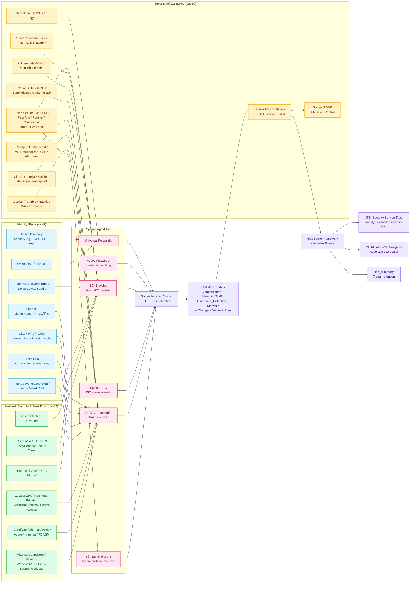

# Security Monitoring Domain Master Guide

> Splunk's value in security operations comes from **correlating identity
> signals, security-infrastructure control-plane telemetry, and
> network-enforcement context into coherent detection narratives** —
> not from collecting "more syslog" without priority. This domain
> guide bridges three catalogue pillars — Identity & Access Management
> (cat 9, 104 UCs), Security Infrastructure (cat 10, 2,402 UCs), and
> Network Security & Zero Trust (cat 17, 105 UCs) — into one
> sequenced operational programme. It is the **front door** for SOC
> architects, threat-hunters, GRC partners, and CISOs; the deep
> per-product detail lives in the integration guides linked below.

## Table of Contents

- [Audience and Use](#audience-and-use)
- [Quick Start — From Zero to First Detection in 30 Days](#quick-start--from-zero-to-first-detection-in-30-days)
- [Architecture and Data Flow](#architecture-and-data-flow)
- [Domain 1 — Identity & Access Management (cat 9, 104 UCs)](#domain-1--identity--access-management-cat-9-104-ucs)
- [Domain 2 — Security Infrastructure (cat 10, 2,402 UCs)](#domain-2--security-infrastructure-cat-10-2402-ucs)
- [Domain 3 — Network Security & Zero Trust (cat 17, 105 UCs)](#domain-3--network-security--zero-trust-cat-17-105-ucs)
- [Splunk Enterprise Security + Risk-Based Alerting Anchor](#splunk-enterprise-security--risk-based-alerting-anchor)
- [MITRE ATT&CK Coverage Mapping](#mitre-attck-coverage-mapping)
- [Crawl / Walk / Run Roadmap (24 / 67 / 50 UCs)](#crawl--walk--run-roadmap-24--67--50-ucs)
- [Sizing and Capacity Planning](#sizing-and-capacity-planning)
- [Compliance and Audit Evidence Pack](#compliance-and-audit-evidence-pack)
- [Reference Dashboards](#reference-dashboards)
- [SPL Examples](#spl-examples)
- [Troubleshooting](#troubleshooting)
- [SOAR Playbook Catalogue](#soar-playbook-catalogue)
- [Cross-Product Integration](#cross-product-integration)
- [References](#references)

## Audience and Use

| Audience | What you get from this guide | Where to go for depth |
|---|---|---|
| **CISO / Security Director** | Programme sequencing, capacity model, MITRE ATT&CK coverage scorecard, evidence-pack mapping for 25+ frameworks | `regulatory-compliance-master.md`, `docs/evidence-packs/` |
| **SOC Architect** | Domain-bridging architecture, ingestion ordering, RBA anchor, Splunk ES + ESCU + SOAR + ITSI integration | Per-product guides cited inline |
| **Threat Hunter** | MITRE ATT&CK technique → UC mapping, hunt patterns, SPL examples for cross-vendor correlation | `siem-soar.md`, `edr.md` |
| **Detection Engineer** | UC-level wiring of cat-9 + cat-10 + cat-17, ESCU lifecycle, CIM normalisation contract | `siem-soar.md`, `cisco-ise.md`, `edr.md`, `ngfw-security.md`, `email-security.md`, `web-security.md` |
| **GRC Partner / Auditor** | Compliance evidence pack mapping, RBA risk-object → control trail, MITRE → NIST CSF crosswalk | `regulatory-compliance-master.md`, `docs/evidence-packs/` |
| **MSSP / MDR Lead** | Multi-tenant CIM normalisation, escalation matrix, SLA-class detection prioritisation | `splunk-platform-health.md` |
| **OT / ICS Security Lead** | Bridge between IT SOC and OT DMZ via cat-10.14 + cat-14 | `iot-ot.md` |

## Quick Start — From Zero to First Detection in 30 Days

### Week 1 — Identity Foundation

1. **Active Directory Security log** (or XML rendering) into `sec_iam` with retention aligned to investigation horizon (90 days hot at minimum).
2. **Entra ID Graph signin + audit + identityProtection** via Splunk Add-on for Microsoft Cloud Services into `sec_iam`.
3. **Splunk ES Asset & Identity Framework** populated from HR + CMDB + Entra exports (nightly refresh).
4. **First three detections enabled:**
   - UC-9.1.1 Brute-Force Login Detection
   - UC-9.1.11 Entra ID Risky Sign-Ins
   - UC-9.1.15 Kerberoasting Detection

### Week 2 — MFA and PAM Telemetry

5. **Cisco Duo `duo:*` sourcetypes** into `sec_iam` (or dedicated `duo` index).
6. **Okta System Log** via REST polling (`/api/v1/logs`).
7. **PAM stack** — CyberArk audit / BeyondTrust PSM / Delinea audit into `sec_pam`.
8. **First three detections enabled:**
   - UC-9.5.7 Duo Authentication Denials
   - UC-9.5.2 Okta MFA Bypass Attempts
   - UC-9.4.1 PAM Vault Checkout Anomalies

### Week 3 — Threat-First Firewall Slices

9. **Cisco Secure Firewall** — IPS + Threat + File + Malware categories ahead of bulk Connection logs (5GB/day baseline per HA pair). Threat slice into `sec_threat`, connection into `sec_conn` (separate retention class).
10. **Palo Alto / Fortinet / Check Point** — `pan:threat`, `fortigate_utm`, `cp_log` into `sec_threat`.
11. **First three detections enabled:**
    - UC-10.1.1 Threat Prevention Event Trending
    - UC-10.1.2 Sandbox Verdict Changes (Wildfire / AMP)
    - UC-10.1.3 C2 Communication Detection

### Week 4 — Endpoint, NAC, VPN

12. **CrowdStrike Falcon / Microsoft Defender for Endpoint / SentinelOne** via vendor APIs into `sec_endpoint`.
13. **Cisco ISE** — MnT syslog aggregation into `sec_nac`; pxGrid `com.cisco.ise.session` subscription if SOC requires sub-minute NAC context.
14. **Cisco ASA / FTD VPN classes** — `%ASA-5-722051`, `%ASA-5-713049` into `sec_vpn` with VPN/SSL syslog list attached.
15. **First six detections enabled:**
    - UC-10.3.1 Endpoint Detection Events (Process / FileHash)
    - UC-10.3.2 Quarantine Action Monitoring
    - UC-17.1.2 Endpoint Posture Failures
    - UC-17.1.12 Rogue Device Detection
    - UC-17.2.14 Geo-Impossible VPN Connections
    - UC-17.2.8 Simultaneous Session Detection

By day 30 you have **15 production detections, all CIM-normalised**,
covering identity, MFA, PAM, NGFW, EDR, NAC, and VPN — the
"identity-first, threat-first, network-second" pattern documented in
the cross-cutting principles below.

## Architecture and Data Flow



### Core principles repeated throughout

1. **Identity-first ingestion ordering.** Every downstream alert in
   firewall, NAC, or EDR tiers is stronger when Splunk can answer
   "*which human or service principal, through which factor, against
   which policy version*." Bring AD, Entra, Okta, Duo, PAM up before
   bulk perimeter telemetry.
2. **Threat-first within Security Infrastructure.** Index NGFW
   IPS / Threat / File / Malware categories ahead of bulk connection
   logs. Threat events carry vendor disposition (priority impact),
   CVE linkage, and sandbox verdicts in **far fewer bytes per byte
   of investigative gain**.
3. **CIM normalisation is non-negotiable.** Splunk ES, ESCU, MLTK,
   and RBA assume normalised fields (`user`, `src`, `dest`,
   `signature`, `action`, `vendor_product`, `severity_id`). Vendor
   TAs do this for you; rolling your own props.conf without CIM
   alignment poisons the analytic backplane.
4. **Risk-Based Alerting is the destination, not the start.** RBA
   bundles low-fidelity risk-modifier events into high-fidelity
   notable events scored by accumulated risk per actor. Without RBA,
   a SOC drowns in single-event correlation searches that fire 50k
   notables a day.
5. **MITRE ATT&CK technique mapping at ingest, not search-time.** Tag
   `technique_id`, `technique_name`, `tactic_id`, `tactic_name` from
   vendor feeds via FIELDALIAS where possible, ESCU lookups
   otherwise. Search-time mapping doesn't survive RBA acceleration.
6. **Forensic timestamps end-to-end.** NTP-synchronised syslog
   receivers must honour consistent stratum; Splunk
   `TIME_PREFIX` / `MAX_TIMESTAMP_LOOKAHEAD` overrides belong in TA
   `props.conf` validated against `_indextime` skew dashboards.
7. **Separate retention class per index family.** `sec_threat` (high-
   value, low-volume, 7-year retention for compliance evidence),
   `sec_conn` (low-value, high-volume, 90-day retention), `sec_iam`
   (mid-value, mid-volume, 1-year retention), `sec_summary`
   (executive trending, 7-year retention).
8. **Splunk ES Assets & Identities is your single source of truth.**
   Populate from HR + CMDB + Entra nightly. Without accurate
   identity attribution, every geo-velocity and rare-event detection
   is unfalsifiable.

---

## Domain 1 — Identity & Access Management (cat 9, 104 UCs)

> Treat cat-9 as the **who** and **whether the session should
> exist** layer. Per-product depth lives in
> `active-directory-entra-id.md` (cat-9.1) and
> `identity-platforms-pam-sso.md` (cat-9.2-9.7).

### Subcategory map

| Sub | Focus | UCs | Deep-dive guide |
|---|---|---|---|
| 9.1 | Active Directory + Entra ID | 18 | `active-directory-entra-id.md` |
| 9.2 | LDAP directories | 12 | `identity-platforms-pam-sso.md` |
| 9.3 | IdP & SSO (Okta, Ping, Auth0, ForgeRock) | 16 | `identity-platforms-pam-sso.md` |
| 9.4 | Privileged Access Management | 26 | `identity-platforms-pam-sso.md` |
| 9.5 | Cloud Identity (Okta + Duo) | 15 | `identity-platforms-pam-sso.md` |
| 9.6 | Endpoint & Mobile Device Management | 6 | `identity-platforms-pam-sso.md` |
| 9.7 | Identity & Access Trending | 7 | `identity-platforms-pam-sso.md` |

### Active Directory & Entra ID — the credential plane

**Priority Event IDs (Windows Security log):**

- **4720 / 4722 / 4738** — user account creation / enable / change
- **4732 / 4756** — security-enabled group membership change
- **4768 / 4769** — Kerberos TGT / service ticket issuance
- **4625** — failed logon (password spray, brute force)
- **4670** — permissions on object changed (DACL tampering)
- **5136-5139** — directory service object change (GPO mod)
- **4904 / 4905** — audit list change
- **4624 type=10** — interactive RemoteInteractive logon (RDP)

**Entra ID via Microsoft Graph:**

- `/v1.0/auditLogs/signIns` — sign-in events with risk fields
- `/v1.0/auditLogs/directoryAudits` — audit events
- `/v1.0/identityProtection/riskyUsers` — Identity Protection risky users
- `/v1.0/identityProtection/riskDetections` — risk detection events
- `/v1.0/identityProtection/serviceProvidersIfAvailable` — IdP federations

**Critical UCs anchored here:**
- UC-9.1.1 Brute-Force Login Detection
- UC-9.1.11 Entra ID Risky Sign-Ins
- UC-9.1.15 Kerberoasting Detection
- UC-9.1.16 Golden / Silver Ticket Indicators
- UC-9.1.17 Entra Conditional Access Policy Changes

### Cisco Duo — gold-standard MFA telemetry

Duo provides step-up authentication, device trust, and adaptive
policies. Splunk must surface authentication **result**, **factor**,
**device posture**, and **administrative enrollment** changes. Use
the Splunk Add-on for Cisco Duo (`duo:*` sourcetypes) into a
dedicated index (commonly `duo` or aligned with team standard).
Splunk Connect for Cisco Security Cloud (Splunkbase **7404**)
unifies Duo telemetry with the rest of the Cisco security portfolio
when you standardise on Cisco connectors.

**Critical UCs:**
- UC-9.5.7 Duo Authentication Denials
- UC-9.5.8 Duo Device Trust Posture
- UC-9.5.9 Duo Enrollment Anomalies
- UC-9.5.2 Okta MFA Bypass Attempts (paired with Duo for synchronised attack detection)

### Privileged Access Management

Session recording metadata, credential checkout, JIT elevation, and
vault administrative actions go to `sec_pam` (separate ACL). Map
session IDs into Splunk Asset & Identity for incident reconstruction.

**Critical UCs:**
- UC-9.4.1 PAM Vault Checkout Anomalies
- UC-9.4.5 PSM Session Recording Lifecycle
- UC-9.4.10 JIT Elevation Patterns

### Cross-domain MFA adoption

UC-9.7.2 MFA Adoption Rate Trending intentionally blends Okta + Duo +
Entra fields — use it as an executive control metric, not only SOC.

---

## Domain 2 — Security Infrastructure (cat 10, 2,402 UCs)

> The largest catalogue bucket. Per-product depth lives in
> `ngfw-security.md` (cat-10.1), `ids-ips.md` (cat-10.2), `edr.md`
> (cat-10.3), `email-security.md` (cat-10.4), `web-security.md`
> (cat-10.5), `vulnerability-management.md` (cat-10.6),
> `siem-soar.md` (cat-10.7+10.9-10.16), `cert-pki.md` (cat-10.8),
> `iot-ot.md` (cat-10.14 OT overlap).

### Subcategory map

| Sub | Focus | UCs | Deep-dive guide |
|---|---|---|---|
| 10.1 | NGFW (Cisco Secure FW + FMC, PAN, FortiGate, CheckPoint) | 77 | `ngfw-security.md` |
| 10.2 | IDS / IPS / NDR | 168 | `ids-ips.md` |
| 10.3 | EDR / XDR | 681 | `edr.md` |
| 10.4 | Email Security (SEG, anti-phishing, BEC) | 150 | `email-security.md` |
| 10.5 | Web Security (Umbrella, Zscaler, Netskope) | 100+ | `web-security.md` |
| 10.6 | Vulnerability Management (Qualys, Tenable, Rapid7) | 100+ | `vulnerability-management.md` |
| 10.7 | SIEM & SOAR (Splunk ES + SOAR + ITSI) | 100+ | `siem-soar.md` |
| 10.8 | Certificate & PKI Lifecycle | 39 | `cert-pki.md` |
| 10.9 | ESCU & Detection Content Lifecycle | varies | `siem-soar.md` |
| 10.10 | Detection Efficacy | varies | `siem-soar.md` |
| 10.11 | Vendor-Specific Security Detections | varies | `siem-soar.md` |
| 10.12 | Industry-Specific Compliance & Fraud | varies | `industry-verticals.md` |
| 10.13 | CIM Patterns | varies | `siem-soar.md` |
| 10.14 | OT Security & MITRE ATT&CK for ICS | 20 | `iot-ot.md` |
| 10.15 | ML / Behavioural Analytics | varies | `siem-soar.md` |
| 10.16 | Security Operations Trending | varies | `siem-soar.md` |

### NGFW — Cisco Secure Firewall (gold standard)

| Principle | Detail |
|---|---|
| **Threat-first indexing** | Ship IPS / Threat / File / Malware stacks ahead of bulk Connection logs |
| **Volume economics** | ~5 GB/day per large HA pair baseline (threat slice only); connection logs dominate without filtering |
| **Transport** | Prefer syslog over legacy estreamer-only for greenfield; eStreamer eNcore (Splunkbase **3662**) for forensic-grade FMC correlation |
| **Splunk packaging** | Cisco Security Cloud (Splunkbase **7404**) for unified Cisco telemetry |
| **Sourcetypes** | `cisco:firepower:estreamer`, `cisco:ftd:syslog`, `cisco:asa:syslog`, `cisco:firepower:intrusion`, `cisco:firepower:connection`, `cisco:firepower:malware` |

**Critical UCs:**
- UC-10.1.1 Threat Prevention Event Trending
- UC-10.1.2 Sandbox Verdict Changes (Wildfire / AMP)
- UC-10.1.3 C2 Communication Detection
- UC-10.1.4 DNS Sinkhole Hits

**FMC 7.4+ syslog wizard** in **Devices → Platform Settings →
Logging / Syslog Servers** encodes Cisco-tested template bundles
that align with Splunk TA expectations. Validate message headers on
UF using `tcpdump` before enabling production routing rules.

### EDR — process ancestry, behavioural prevention, credential theft

| Vendor | TA / sourcetype | Notes |
|---|---|---|
| CrowdStrike Falcon | Splunk Add-on; `crowdstrike:falcon:*` | Stream API + Event Streaming API |
| Microsoft Defender for Endpoint | Add-on for MDE; `microsoft:defender:endpoint:*` | Graph API + Defender XDR |
| SentinelOne | Add-on; `sentinelone:event` | Singularity API |
| VMware Carbon Black | Add-on; `vmware:carbonblack:*` | EDR + Workload + Cloud |
| Palo Alto Cortex XDR / XSIAM | Cortex XDR add-on | Native correlation alternative |
| Sophos Intercept X | XG REST API | Endpoint posture + ATP |
| Trellix EDR (legacy McAfee MVISION) | TA-trellix-edr | ATD sandbox feeds |

**Critical UCs:**
- UC-10.3.1 Endpoint Detection Events
- UC-10.3.2 Quarantine Action Monitoring
- UC-10.3.5 LSASS Memory Access (Mimikatz indicator)
- UC-10.3.10 Suspicious PowerShell Execution
- UC-10.3.42 Living-off-the-Land Binary (LOLBin) Detection

### Email Security — BEC / EAC / phishing

Mailbox telemetry isolates patient-zero clicks feeding downstream
NGFW IOC hunts. Vendors: Proofpoint TAP, Mimecast, MS Defender for
Office 365, Abnormal Security, Sublime Security, Material Security.

**Critical UCs:**
- UC-10.4.1 Phishing Email Volume Trending
- UC-10.4.10 BEC Indicator Detection
- UC-10.4.25 QR Phishing Detection
- UC-10.4.50 DMARC Aggregate Alignment

### Vulnerability Management — exposure correlation

Scanner exports get value when intersected with reachability + CMDB
ownership. Splunk ES "Vulnerabilities" data model + nightly
acceleration is the canonical pattern.

**Critical UCs:**
- UC-10.6.1 Critical Vulnerability Trending
- UC-10.6.10 Internet-Exposed Vulnerable Service
- UC-10.6.50 Patch SLA Burn-Down

### SIEM & SOAR — the analytic backplane

This is where everything lands. See `siem-soar.md` for full depth.
Key UCs surfaced here:
- UC-10.7.1 Alert Volume Trending
- UC-10.7.2 Analyst Workload Distribution
- UC-10.7.4 Playbook Execution Monitoring
- UC-10.16.7 Risk Score Distribution Trending

### Certificate & PKI — the silent outage source

ACME renewal failures, CT log watchers (`crt.sh`), internal CA
backlog, SCEP enrollment spikes. TLS outages frequently coincide
with attacker tunnels failing closed — Splunk bridges PKI ops with
SecOps narratives via:
- UC-10.8.1 Certificate Expiry Monitoring
- UC-10.8.10 CT Log Domain Watch
- UC-10.8.20 Internal CA Issuance Backlog

### OT Security bridge — IT SOC ↔ OT DMZ

Where IT SOC overlaps OT DMZ monitoring, deploy the **OT Security
Add-on for Splunk** (Splunkbase **5151**, ES prerequisite). UC-10.14.1
OT Security Add-on Health validates parsers before ICS hunts proceed.
Map ICS narratives using **MITRE ATT&CK for ICS** alongside enterprise
ATT&CK overlays — dual overlays clarify when PLC-facing telemetry
differs from enterprise lateral movement signatures embedded in
Category 17 VPN telemetry. Full coverage in `iot-ot.md`.

---

## Domain 3 — Network Security & Zero Trust (cat 17, 105 UCs)

> Per-product depth: `cisco-ise.md` (cat-17.1),
> `vpn-zerotrust-sase.md` (cat-17.2-17.3),
> `edge-security-microsegmentation.md` (cat-17.4-17.6).

### Subcategory map

| Sub | Focus | UCs | Deep-dive guide |
|---|---|---|---|
| 17.1 | Network Access Control (Cisco ISE) | 14 | `cisco-ise.md` |
| 17.2 | VPN & Remote Access | 21 | `vpn-zerotrust-sase.md` |
| 17.3 | Zero Trust / SASE | 15 | `vpn-zerotrust-sase.md` |
| 17.4 | Edge Security (WAF / Bot / DDoS) | 9 | `edge-security-microsegmentation.md` |
| 17.5 | Forcepoint Security | 15 | `edge-security-microsegmentation.md` |
| 17.6 | Microsegmentation | 12 | `edge-security-microsegmentation.md` |

### Cisco ISE — NAC gold standard

| Topic | Detail |
|---|---|
| **MnT syslog aggregation** | Send syslog from Monitoring & Troubleshooting (MnT) nodes, NOT individually from each PSN |
| **UDP frame size** | Increase `log-msg-size` to **8192 bytes** — default 1024-byte truncations cut RADIUS attributes & pxGrid correlation |
| **Logging categories (production-safe)** | AAA Audit, Failed Attempts, Passed Authentication, RADIUS Accounting, Posture Audit, Administrative Audit, Guest, System Diagnostics |
| **AVOID** | Debug-class floods (10x EPS multiplication; license-killer) |
| **Posture timer** | ≥7200 seconds — aggressive timers churn DHCP and Splunk correlation noise |
| **Load balancer** | Sticky sessions for posture redirects on original PSN; stateless LB breaks CoA sequencing |
| **pxGrid** | Subscribe ONLY to `com.cisco.ise.session`, `com.cisco.ise.endpoint` — over-subscription inflates ISE PAN JVM heaps |

**Critical UCs:**
- UC-17.1.2 Endpoint Posture Failures
- UC-17.1.3 VLAN Assignment Audit
- UC-17.1.8 NAC Policy Change Audit
- UC-17.1.12 Rogue Device Detection

### Cisco ASA / FTD VPN — credential stuffing endpoint

VPN concentration telemetry — successful tunnels, AAA failures,
simultaneous sessions per identity, geographic attribution.
Credential stuffing culminates at VPN concentrators before lateral
movement; geo velocity signals stolen passwords.

**Required syslog classes:**
- `%ASA-5-722051` (AnyConnect tunnel established)
- `%ASA-5-713049` (group attribute applied)
- `%ASA-4-722051` (AnyConnect tunnel closed with reason)
- `%ASA-6-113004` (AAA user authentication successful)
- `%ASA-6-113005` (AAA user authentication failed)

**Critical UCs:**
- UC-17.2.2 VPN Authentication Failures
- UC-17.2.3 Geo-Location Anomalies
- UC-17.2.8 Simultaneous Session Detection
- UC-17.2.14 Geo-Impossible VPN Connections

**Pair with Duo / Okta MFA failures within ±60 seconds** for
credential-stuffing narratives — this is a high-yield RBA
risk-modifier rule.

### Zero Trust / SASE — Continuous verification

Vendors evaluate identity, device posture, and destination risk each
transaction. Use vendor TAs:
- **Zscaler NSS feeds → HEC** (`zscaler:nss:*`)
- **Netskope** (Splunkbase **3808**) (`netskope:event:*`)
- **Palo Alto Prisma Access** via PAN TA (Splunkbase **2757**)
- **Cloudflare Logpush** (Splunkbase **4501**)
- **Forcepoint One** (REST polling — see `edge-security-microsegmentation.md`)

**Critical UCs:**
- UC-17.3.1 Conditional Access Enforcement
- UC-17.3.3 Micro-Segmentation Audit
- UC-17.3.8 Zero Trust Access Denial Trending

**Tag `data_residency` and `tenant_region` fields at ingest** so EU
sovereign cloud tenants forbidding North American SaaS aggregation
can audit Splunk routing without ad-hoc spreadsheet reconciliations.

---

## Splunk Enterprise Security + Risk-Based Alerting Anchor

### Why RBA is the destination

Single-event correlation searches are useful for high-fidelity threats
(known-bad C2 domain hit). Most attacker activity is **low-fidelity
risk modifiers** that only become significant in aggregate per actor:
- Failed MFA from new device
- LDAP enumeration burst
- Off-hours PowerShell from finance laptop
- New cloud service enrollment

RBA accumulates risk per `risk_object` (user, host, IP) over a
sliding window, fires a notable when a threshold is crossed, and
attaches the underlying risk modifiers as evidence. SOC analysts get
**one notable per actor with full context**, not 50 individual alerts.

### Reference RBA risk score weights

| Signal | Risk score | Source UC | Notes |
|---|---|---|---|
| Failed MFA from new device | 15 | UC-9.5.7 + UC-9.5.8 | Modifier; not alone notable |
| Entra ID risky sign-in (high) | 40 | UC-9.1.11 | Modifier |
| Kerberoasting indicator | 80 | UC-9.1.15 | Notable on its own |
| LSASS access | 80 | UC-10.3.5 | Notable on its own |
| C2 domain hit | 80 | UC-10.1.3 | Notable on its own |
| Geo-impossible VPN | 60 | UC-17.2.14 | Notable on its own |
| Sandbox verdict change to malicious | 60 | UC-10.1.2 | Notable on its own |
| Off-hours admin enrollment | 30 | UC-9.5.9 | Modifier |
| Vulnerable internet-exposed service | 25 | UC-10.6.10 | Modifier (per asset) |
| New PSM session checkout | 10 | UC-9.4.5 | Modifier (legitimate often) |
| Threshold for notable creation | 100 per 24h per risk_object | — | Tune per environment |

### Splunk ES Asset & Identity Framework

Populate from:
- **HR system** — employee status, department, manager, location
- **CMDB** — asset owner, environment (prod/test), criticality tier
- **Entra ID / AD** — group memberships, OU, conditional access status
- **CrowdStrike / MDE** — endpoint sensor inventory, last-seen, OS

Daily refresh via Splunk DB Connect or REST modular inputs.
**Without accurate identity attribution, every geo-velocity and
rare-event detection is unfalsifiable.**

---

## MITRE ATT&CK Coverage Mapping

### Coverage scorecard pattern

Build a coverage scorecard via:
1. KV store `mitre_technique_map` keyed by vendor signature IDs
2. Nightly backfill from Splunk ATT&CK Analyzer (where licensed) or community transforms
3. ES correlation searches tagged with `technique_id` in saved-search description
4. Dashboard rendering ATT&CK Navigator JSON-compatible export

### High-priority technique → UC anchor

| Tactic | Technique | ATT&CK ID | Anchor UC | Domain |
|---|---|---|---|---|
| Initial Access | Phishing | T1566 | UC-10.4.1, UC-10.4.10 | Email Security |
| Initial Access | Exploit Public-Facing App | T1190 | UC-10.6.10 | Vuln Mgmt |
| Initial Access | Valid Accounts | T1078 | UC-9.1.11, UC-9.5.7 | Identity |
| Execution | PowerShell | T1059.001 | UC-10.3.10 | EDR |
| Execution | LOLBin | T1218 | UC-10.3.42 | EDR |
| Persistence | Create Account | T1136 | UC-9.1.1 (variant) | Identity |
| Persistence | Server Software Component | T1505 | UC-10.3.x | EDR |
| Privilege Esc | Valid Accounts | T1078 | UC-9.4.10 | PAM |
| Defense Evasion | Indicator Removal | T1070 | UC-10.3.x | EDR |
| Credential Access | Brute Force | T1110 | UC-9.1.1 | Identity |
| Credential Access | OS Credential Dumping | T1003 | UC-10.3.5 | EDR |
| Credential Access | Steal/Forge Kerberos | T1558 | UC-9.1.15, UC-9.1.16 | Identity |
| Discovery | Account Discovery | T1087 | UC-9.2.x | LDAP |
| Lateral Movement | Remote Services | T1021 | UC-10.15.2 | EDR + MLTK |
| Collection | Email Collection | T1114 | UC-10.4.x | Email |
| C2 | Application Layer Protocol | T1071 | UC-10.1.3 | NGFW |
| Exfiltration | C2 Channel | T1041 | UC-10.1.3 + UC-10.5.x | NGFW + Web |
| Impact | Data Encrypted for Impact | T1486 | UC-10.3.x ransomware | EDR |

### MITRE ATT&CK for ICS

Bridge to OT via UC-10.14.x and the per-product `iot-ot.md` guide.
ICS-specific tactics (Initial Access via T1190 or wireless T1456;
Inhibit Response Function T0814; Loss of Control T0828) require
ATT&CK for ICS overlay separate from Enterprise ATT&CK.

---

## Crawl / Walk / Run Roadmap (24 / 67 / 50 UCs)

### Crawl tier (24 UCs — month 1-2)

The "first 30 days" detections from the Quick Start, plus 9 high-
value extensions:

| UC | Domain | Title |
|---|---|---|
| 9.1.1 | Identity | Brute-Force Login Detection |
| 9.1.11 | Identity | Entra ID Risky Sign-Ins |
| 9.1.15 | Identity | Kerberoasting Detection |
| 9.5.7 | Identity | Duo Authentication Denials |
| 9.5.2 | Identity | Okta MFA Bypass Attempts |
| 9.4.1 | Identity | PAM Vault Checkout Anomalies |
| 9.6.1 | Identity | Device Compliance Status |
| 10.1.1 | NGFW | Threat Prevention Event Trending |
| 10.1.2 | NGFW | Sandbox Verdict Changes |
| 10.1.3 | NGFW | C2 Communication Detection |
| 10.1.4 | NGFW | DNS Sinkhole Hits |
| 10.2.1 | IDS | Alert Severity Trending |
| 10.3.1 | EDR | Endpoint Detection Events |
| 10.3.2 | EDR | Quarantine Action Monitoring |
| 10.4.1 | Email | Phishing Email Volume Trending |
| 10.6.1 | VulnMgmt | Critical Vulnerability Trending |
| 10.7.1 | SIEM | Alert Volume Trending |
| 10.8.1 | PKI | Certificate Expiry Monitoring |
| 17.1.2 | NAC | Endpoint Posture Failures |
| 17.1.8 | NAC | NAC Policy Change Audit |
| 17.1.12 | NAC | Rogue Device Detection |
| 17.2.2 | VPN | VPN Authentication Failures |
| 17.2.14 | VPN | Geo-Impossible VPN Connections |
| 17.2.8 | VPN | Simultaneous Session Detection |

### Walk tier (67 UCs — month 3-6)

Highlights:
- Full Identity & Access Trending (9.7.x)
- Full PAM coverage (9.4.x — 26 UCs)
- Cisco Duo full posture set (9.5.x)
- BEC / phishing campaign detection (10.4.x extended)
- DGA / DNS tunneling (10.1.x extended)
- LSASS / Mimikatz detections (10.3.5, 10.3.x credential theft)
- ESCU phishing + ransomware analytic stories
- VPN / Zero Trust full set (17.2.x + 17.3.x)
- WAF / Bot Mgmt / Cloudflare / Akamai (17.4.x)
- Microsegmentation audits (17.6.x)
- Vulnerability Management correlation with reachability (10.6.x)
- Email DMARC / DKIM / SPF alignment (10.4.x DMARC subset)
- Web Security policy enforcement (10.5.x)
- Splunk SOAR playbook execution monitoring (10.7.4)

### Run tier (50 UCs — month 7+)

Highlights:
- ESCU full deployment + ESCU lifecycle automation (10.9.x)
- MITRE ATT&CK Navigator coverage scorecard (10.10.x)
- ML-driven UEBA (10.15.x — Smart Outliers, DGA, beaconing)
- OT Security ATT&CK for ICS (10.14.x)
- Risk Score Distribution Trending + ML risk modelling (10.16.7)
- Detection Efficacy KPI scorecard (10.10.x)
- Industry-vertical fraud overlays (10.12.x — banking, healthcare, retail)
- Splunk Attack Analyzer integration for malware triage automation
- Splunk Threat Intelligence Management with MISP / ThreatConnect
- Continuous Adversary Emulation feedback loops (Atomic Red Team, Caldera)

---

## Sizing and Capacity Planning

| Source | Per-1k-employee daily volume | Per-1k-employee monthly storage |
|---|---|---|
| AD Security log | 5 GB | 150 GB |
| Entra ID Graph (signin + audit + risk) | 2 GB | 60 GB |
| Cisco Duo | 200 MB | 6 GB |
| Okta system_log | 500 MB | 15 GB |
| OpenLDAP / 389-DS audit | 200 MB | 6 GB |
| CyberArk / BeyondTrust audit | 300 MB | 9 GB |
| Cisco Secure Firewall threat slice | 5 GB / HA pair | 150 GB / HA pair |
| Cisco Secure Firewall connection slice | 50-200 GB / HA pair | 1.5-6 TB / HA pair |
| Palo Alto threat | 4 GB / 1k throughput | 120 GB |
| Fortinet FortiGate UTM | 5 GB / HA pair | 150 GB |
| Snort / Suricata IDS | 2 GB | 60 GB |
| CrowdStrike Falcon | 8 GB / 1k endpoints | 240 GB |
| Microsoft Defender for Endpoint | 10 GB / 1k endpoints | 300 GB |
| SentinelOne | 6 GB / 1k endpoints | 180 GB |
| Email Security (Proofpoint / Mimecast) | 3 GB / 1k mailboxes | 90 GB |
| Cisco Umbrella DNS | 4 GB / 1k endpoints | 120 GB |
| Zscaler NSS | 8 GB / 1k users | 240 GB |
| Netskope | 6 GB / 1k users | 180 GB |
| Vulnerability Management (Qualys / Tenable) | 1 GB / 10k assets | 30 GB |
| Cisco ISE MnT syslog | 10 GB / 10k auths/day | 300 GB |
| Cisco ASA / FTD VPN | 2 GB / 1k tunnels | 60 GB |
| WAF / Bot Mgmt | 5 GB / 1M req/day | 150 GB |
| Splunk ES notable + risk + correlation | 500 MB | 15 GB |

**Worked example (10k-employee mid-market enterprise):**
- AD + Entra: 70 GB/day
- Cisco Duo + Okta + PAM: ~10 GB/day
- 2 x Cisco Secure FW HA pairs (threat slice only): 10 GB/day
- 10k EDR endpoints: 80 GB/day (CrowdStrike) or 100 GB/day (MDE)
- 10k mailboxes Email Security: 30 GB/day
- 10k user Web Security: 80 GB/day (Zscaler)
- ISE: 50 GB/day at 50k auths
- VPN: 8 GB/day at 4k tunnels
- ES correlation overhead: 5 GB/day

→ **~340-360 GB/day indexed security data** for a balanced
threat-first ingestion pattern. Connection-log inclusion roughly
triples this to 1 TB/day; that's the reason we say
**"threat-first, connection-second."**

---

## Compliance and Audit Evidence Pack

Cross-reference: `regulatory-compliance-master.md` (cat 22) for the
full evidence-pack assembly. This guide provides the **security-domain
slice** of the compliance evidence catalogue.

| Framework | Evidence pack file | Anchor UCs |
|---|---|---|
| SOC 2 Type II | `docs/evidence-packs/soc-2.md` | 9.x, 10.7.x, 17.1.x, 17.2.x |
| ISO 27001:2022 | `docs/evidence-packs/iso-27001.md` | All cat-9, cat-10, cat-17 |
| HIPAA Security Rule | `docs/evidence-packs/hipaa-security.md` | 9.1.x, 9.4.x, 10.3.x, 10.6.x |
| PCI DSS 4.0 | `docs/evidence-packs/pci-dss.md` | 10.1.x, 10.3.x, 10.7.x, 17.x |
| GDPR | `docs/evidence-packs/gdpr.md` | 9.x, 10.4.x DLP |
| UK GDPR | `docs/evidence-packs/uk-gdpr.md` | Mirror GDPR set |
| NIS2 | `docs/evidence-packs/nis2.md` | 9.x, 10.7.x, 17.x; supply chain 10.6.x |
| DORA | `docs/evidence-packs/dora.md` | 10.7.x, 10.16.x; TLPT 10.x.x.x |
| CMMC 2.0 | `docs/evidence-packs/cmmc.md` | All controls inheriting from NIST 800-171 r3 |
| NIST CSF 2.0 | `docs/evidence-packs/nist-csf.md` | All cat-9, cat-10, cat-17 |
| NIST 800-53 r5 | `docs/evidence-packs/nist-800-53.md` | AC, AU, CA, CM, IA, IR, RA, SC, SI families |
| SOX ITGC | `docs/evidence-packs/sox-itgc.md` | 9.x, 10.7.x change-mgmt |

**Always-required evidence pack contents (per framework):**
1. Detection design rationale (which UC, why, what gap it closes)
2. Detection logic source (SPL or saved-search export)
3. Detection trigger evidence (notable IDs from prior 12 months)
4. Disposition evidence (analyst tickets, SOAR playbook runs)
5. Control owner attestation
6. Annual review attestation

The Splunk ES Risk Score framework + ITSI service tree produce the
**defensible audit trail**: every notable carries the contributing
risk modifiers (UCs that fired) and the analyst disposition.

---

## Reference Dashboards

| Dashboard | Audience | Refresh | Source |
|---|---|---|---|
| Security Executive Scorecard | CISO + Board | 24h | `sec_summary` |
| MITRE ATT&CK Coverage Heat Map | SOC Lead | 1h | ESCU + ES correlation |
| RBA Risk Object Top-N | SOC Tier 2 | 5 min | Risk index |
| Identity Anomaly Triage | Identity Team | 5 min | `sec_iam` |
| NGFW Threat Triage | Network Security | 1 min | `sec_threat` |
| EDR Detection Triage | Endpoint Security | 1 min | `sec_endpoint` |
| Email Security Triage | Email Security | 5 min | `sec_email` |
| VPN / NAC Operations | Network Security | 5 min | `sec_vpn`, `sec_nac` |
| Vulnerability Reachability | Vuln Mgmt + Asset Owners | 24h | `sec_vuln` |
| ESCU Detection Coverage | Detection Engineering | 24h | ESCU + correlation searches |
| Detection Efficacy KPI | SOC Manager | 7d | `notable`, ticketing |
| Compliance Evidence | GRC | 24h | `sec_summary` |

---

## SPL Examples

### RBA risk-object top-N (last 24h)

```spl
| from datamodel:Risk.All_Risk
| stats sum(risk_score) as total_risk by All_Risk.risk_object, All_Risk.risk_object_type
| sort - total_risk
| head 25
| eval risk_severity = case(
    total_risk >= 200, "critical",
    total_risk >= 100, "high",
    total_risk >= 50, "medium",
    1=1, "low")
```

### MITRE ATT&CK coverage scorecard

```spl
| inputlookup mitre_technique_map.csv
| join type=outer technique_id [
    | rest /servicesNS/-/-/saved/searches splunk_server=local
    | search action.correlationsearch.enabled="1" 
    | rex field=description "T(?<technique_id>\d+)(\.\d+)?"
    | stats values(title) as covering_searches by technique_id
  ]
| eval coverage = if(isnull(covering_searches), "uncovered", "covered")
| stats count by tactic_id, tactic_name, coverage
| chart sum(count) over tactic_name by coverage
```

### Geo-impossible VPN + MFA correlation (RBA modifier)

```spl
index=sec_vpn sourcetype=cisco:asa:syslog (722051 OR 113004 OR 113005)
| eval src_country = iplocation(src_ip)
| stats values(src_country) as countries, dc(src_country) as country_count, min(_time) as first_seen, max(_time) as last_seen by user
| eval time_diff = last_seen - first_seen
| where country_count > 1 AND time_diff < 3600
| eval risk_score = 60, risk_modifier = "geo_impossible_vpn", technique_id = "T1078"
| collect index=risk
```

### ESCU coverage by ATT&CK technique

```spl
| rest /servicesNS/-/SplunkEnterpriseSecuritySuite/saved/searches splunk_server=local
| search action.correlationsearch.label="ESCU*"
| rex field=description "T(?<technique_id>\d+)(\.\d+)?"
| stats dc(title) as detection_count, values(title) as detections by technique_id
| eval coverage_class = case(
    detection_count >= 5, "deep",
    detection_count >= 2, "moderate",
    detection_count = 1, "single",
    1=1, "uncovered")
```

### Detection efficacy (true / false positive ratio)

```spl
index=notable earliest=-30d
| join type=outer event_id [
    | search index=ticketing source="*splunk_es*"
    | stats latest(disposition) as analyst_disposition by event_id
  ]
| stats count by analyst_disposition
| eval pct = round(100 * count / mvfirst(mvexpand(count)) , 1)
```

### Cross-vendor MFA failure correlation

```spl
(index=sec_iam sourcetype="duo:authentication" result="denied")
OR (index=sec_iam sourcetype="okta:system_log" eventType="user.authentication.auth_via_mfa" outcome.result="FAILURE")
OR (index=sec_iam sourcetype="ms:aad:graph:signin" status.errorCode!=0)
| eval mfa_provider = case(
    sourcetype="duo:authentication", "Duo",
    sourcetype="okta:system_log", "Okta",
    sourcetype="ms:aad:graph:signin", "Entra ID")
| stats count by user, mfa_provider, _time
| eventstats dc(mfa_provider) as providers_failing by user
| where providers_failing >= 2
| eval risk_score = 50, risk_modifier = "multi_provider_mfa_failure"
| collect index=risk
```

---

## Troubleshooting

| Symptom | Likely cause | Fix |
|---|---|---|
| AD Security log not arriving | UF on DC not configured for `WinEventLog://Security` | Add stanza in `inputs.conf` and restart UF |
| Entra ID Graph API throttled | Polling too aggressive | Tune polling_interval to 15 min for sign-in, 60 min for audit |
| ISE syslog truncating RADIUS attributes | UDP frame size default 1024 | Set `log-msg-size 8192` on syslog receiver |
| FMC IPS events missing CVE field | Wrong TA version for FMC version | Match TA to FMC OS release; update eStreamer eNcore |
| ESCU detection not firing | Macro reference missing CIM acceleration | Verify `cim_modactions` index + DM acceleration |
| RBA notable not generating | Risk score threshold too high | Tune `risk.notable_threshold` per environment baseline |
| Cisco Duo audit empty | Wrong sourcetype scope (admin vs auth) | Subscribe to `duo:administrator` separately from `duo:authentication` |
| EDR detections lacking process ancestry | API scope insufficient | Re-issue API token with `events:full` scope |
| MITRE technique coverage scorecard reports 0% | KV store `mitre_technique_map` empty | Run nightly backfill from ATT&CK Workbench |
| Splunk ES Asset & Identity stale | DB Connect job failing | Check `/opt/splunk/var/log/splunk/db_connect.log` |
| Duo + Okta MFA correlation produces no results | Username field mismatch | Add lookup `email→username` and FIELDALIAS |
| pxGrid subscriber dies repeatedly | Certificate rotation broke trust | Reissue subscriber certs with PAN-rotated CA chain |
| `_indextime` skew dashboard shows >5 min | NTP drift on syslog receiver | Verify chrony / ntpq on receiver tier |
| `sec_threat` retention exhausted prematurely | Wrong DM acceleration overhead | Disable DM accel on `sec_conn`, leave on `sec_threat` |

---

## SOAR Playbook Catalogue

### Reference playbooks for the security domain

| Playbook | Trigger UC | Phases | Severity |
|---|---|---|---|
| `phishing_triage_full` | UC-10.4.1 (Phishing) | sandbox / URL detonation, click-tracking, mailbox sweep, contain | High |
| `bec_finance_response` | UC-10.4.10 (BEC) | quarantine, recipient warning, finance hold, IR ticket | Critical |
| `kerberoasting_response` | UC-9.1.15 | account-disable, password reset, KRBTGT rotation guard | High |
| `lsass_dump_response` | UC-10.3.5 | host isolation (CrowdStrike NRC / MDE Live Response), credential reset | Critical |
| `c2_beacon_response` | UC-10.1.3 | DNS sinkhole, NGFW deny, EDR isolate, IR ticket | Critical |
| `geo_impossible_vpn_response` | UC-17.2.14 | session terminate, MFA challenge, identity protection enforce | High |
| `pam_vault_anomaly_response` | UC-9.4.1 | session record retrieval, manager attestation, secret rotate | Medium |
| `ransomware_indicator_response` | UC-10.3.x | host isolate, fileshare lockdown, backup verify, exec page | Critical |
| `vulnerability_to_exploit_response` | UC-10.6.10 | reachability check, IPS rule activate, vendor escalation | High |
| `ot_threat_response` | UC-10.14.x | OT DMZ isolate, ICS engineer page, NIST CIP record | Critical |

Each playbook has its full YAML in `siem-soar.md` — this guide is
the **inventory and trigger map**, not the implementation.

---

## Cross-Product Integration

| Other guide | Relationship |
|---|---|
| `active-directory-entra-id.md` | Cat-9.1 deep dive (AD + Entra) |
| `identity-platforms-pam-sso.md` | Cat-9.2-9.7 deep dive |
| `ngfw-security.md` | Cat-10.1 deep dive (Cisco Secure FW + PAN + Fortinet) |
| `ids-ips.md` | Cat-10.2 deep dive |
| `edr.md` | Cat-10.3 deep dive |
| `email-security.md` | Cat-10.4 deep dive |
| `web-security.md` | Cat-10.5 deep dive |
| `vulnerability-management.md` | Cat-10.6 deep dive |
| `siem-soar.md` | Cat-10.7 + 10.9-10.16 (Splunk ES + SOAR + ESCU + ML) |
| `cert-pki.md` | Cat-10.8 deep dive |
| `cisco-ise.md` | Cat-17.1 deep dive (NAC) |
| `vpn-zerotrust-sase.md` | Cat-17.2 + 17.3 deep dive |
| `edge-security-microsegmentation.md` | Cat-17.4 + 17.5 + 17.6 deep dive |
| `cisco-thousandeyes.md` | Network telemetry corroboration |
| `network-flow.md` | NetFlow / IPFIX corroborating telemetry |
| `dns-dhcp.md` | DNS-layer enforcement (Cisco Umbrella) |
| `iot-ot.md` | Cat-10.14 OT security overlap |
| `industry-verticals.md` | Cat-10.12 industry-specific fraud overlays |
| `firewalls.md` | Cat-5.2 traditional firewall feeds |
| `splunk-platform-health.md` | Cat-13.5 SIEM platform health |
| `splunk-itsi.md` | Cat-13.2 security service tree |
| `regulatory-compliance-master.md` | Cat-22 evidence pack assembly |

---

## References

### Vendor documentation

- Cisco Duo Splunk integration — https://duo.com/docs
- Cisco Secure Firewall Management Center syslog export guides — Cisco Secure Firewall documentation portal
- Cisco ISE Administrator Guide — Logging, MnT sizing, syslog categories
- Cisco pxGrid Integration Guides — REST/WebSocket subscriber sizing, certificate rotation, topic catalogues
- Cisco ASA syslog messages reference — VPN and cryptographic subsystem classes
- Microsoft Learn — Entra ID reporting APIs (`graph.microsoft.com` audit & sign-in logs)
- Microsoft Learn — Windows Security auditing baseline (Event ID tables)
- Okta Developer Portal — System Log API, ThreatInsight
- CrowdStrike API documentation — Streams, Detection, Identity Protection
- Microsoft Defender for Endpoint API — Advanced Hunting, alerts, devices

### Splunk documentation

- Splunk Enterprise Security 8 — User Manual, Use Case Library, RBA setup
- Splunk Enterprise Security Content Updates (ESCU) — Release notes, Detection list
- Splunk SOAR — Playbook authoring, REST API
- Splunk Common Information Model (CIM) Add-on — Authentication, Network_Traffic, Intrusion_Detection, Malware, Change, Vulnerabilities data models
- Splunk Lantern — Operationalising ESCU, RBA implementation, Asset & Identity Framework
- Splunk MLTK — Smart Outliers, DGA Analyser, behavioural detections
- Splunk ITSI — Security service tree templates

### Standards and frameworks

- MITRE ATT&CK Enterprise + ICS — https://attack.mitre.org
- MITRE D3FEND — https://d3fend.mitre.org
- NIST CSF 2.0 — https://www.nist.gov/cyberframework
- NIST SP 800-53 r5 + 800-171 r3 + 800-218 SSDF + 800-207 ZTA
- CIS Critical Security Controls v8 — https://www.cisecurity.org/controls
- OWASP Top 10 2021 + API Top 10 + ASVS
- ISA/IEC 62443 (OT/ICS) — IEC 62443-3-3, 62443-4-2

---

**Document maintenance.** Reviewed quarterly against vendor + ATT&CK
+ ESCU + regulator release notes. Last verified against:
- Splunk Enterprise Security 8.0
- Splunk SOAR 6.x
- ESCU current quarterly drop
- Cisco ISE 3.4
- Cisco Secure Firewall (FMC 7.4 / FTD 7.4)
- Cisco Duo Beyond
- CrowdStrike Falcon Falcon 7.x
- Microsoft Defender XDR (current)
- Okta Identity Engine OIE (current)
- MITRE ATT&CK v15
- NIST CSF 2.0
- NIST 800-53 r5 + 800-171 r3
- PCI DSS 4.0.1
- ISO 27001:2022

For corrections or additions, file an issue with `domain-security`,
`cat-9`, `cat-10`, or `cat-17` labels.
