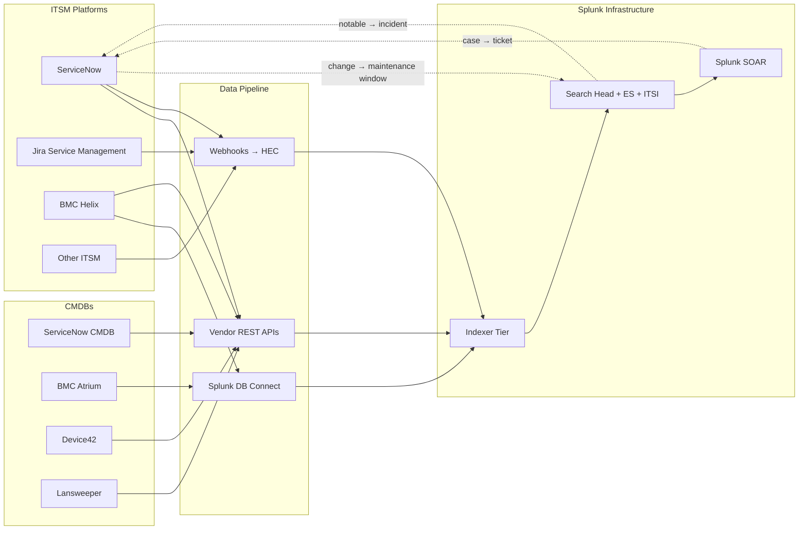

# Service Management & ITSM Integration Guide

> The definitive guide to integrating Service Management and ITSM
> platforms with Splunk. **102 use cases** spanning ServiceNow (ITSM,
> ITOM, ITBM, SecOps, GRC, CMDB), Atlassian Jira Service Management,
> BMC Helix ITSM (formerly Remedy), Cherwell / Ivanti Neurons,
> Freshworks Freshservice, ManageEngine ServiceDesk Plus, Ivanti Service
> Manager, TOPdesk, Zendesk for IT, SolarWinds Service Desk; CMDBs
> (ServiceNow CMDB, BMC Atrium, Device42, Lansweeper). Incident volume
> trending, MTTR / MTTA / first-call resolution, change success rate,
> CMDB completeness, asset reconciliation, problem-incident linkage,
> SLA breach prediction, ITIL 4 KPIs, and the full bidirectional flow
> between Splunk ITSI / ES and your service management platform.

---

## Table of Contents

- [Quick Start](#quick-start)
- [Overview](#overview)
- [Architecture and Data Flow](#architecture)
- [Prerequisites](#prerequisites)
- [Platform Coverage Matrix](#platform-matrix)
- [ServiceNow ITSM (most-deployed)](#servicenow)
- [Jira Service Management](#jsm)
- [BMC Helix ITSM (Remedy)](#bmc-helix)
- [Cherwell / Ivanti Neurons](#cherwell-ivanti)
- [Freshservice, ManageEngine, TOPdesk, Zendesk, SolarWinds](#other-itsm)
- [CMDB Integration (ServiceNow, BMC Atrium, Device42, Lansweeper)](#cmdb)
- [ITIL Process Coverage](#itil)
- [Incident Management Analytics](#incident-mgmt)
- [Change & Release Management Analytics](#change-mgmt)
- [Field Dictionary](#field-dictionary)
- [Sample Events](#sample-events)
- [Splunk-Side Configuration](#splunk-config)
- [Cross-Product Correlation](#cross-product)
- [CIM Mapping Reference](#cim-mapping)
- [Splunk ITSI ↔ ITSM Bidirectional](#itsi-bidi)
- [Splunk SOAR ↔ ITSM Bidirectional](#soar-bidi)
- [Compliance Mapping](#compliance)
- [Capacity Planning and Sizing](#sizing)
- [Recommended Dashboard Layouts](#dashboards)
- [SOAR Playbook Examples](#soar-playbooks)
- [Multi-Tenant Strategy](#multi-tenant)
- [Security Hardening](#security-hardening)
- [Crawl / Walk / Run Roadmap](#roadmap)
- [Validation Checklist](#validation-checklist)
- [Known Limitations and Gaps](#known-limitations)
- [Troubleshooting](#troubleshooting)
- [FAQ](#faq)
- [Glossary](#glossary)
- [References](#references)
- [Contribution and Feedback](#contribution)

---

<a id="quick-start"></a>
## Quick Start — 90 Minutes to First ITSM Insight

### ServiceNow (most common)

1. Install [Splunk Add-on for ServiceNow (Splunkbase 1928)](https://splunkbase.splunk.com/app/1928) on Splunk HF.
2. ServiceNow → System Web Services → REST → REST API Explorer:
    - Verify Table API access
3. Splunk → Add-on for ServiceNow → +Add Account:
    - URL: `https://yourcorp.service-now.com`
    - Username: integration user with `itil` role
    - Password (in credential store)
4. Configure data inputs:
    - incident, problem, change_request, sc_request, cmdb_ci, sysevent
5. Validate: `index=itsm sourcetype="snow:incident" earliest=-15m | stats count by priority, state`

### Jira Service Management

1. JSM Project → Settings → Webhooks → +Add:
    - URL: `https://splunk-hec.yourcorp.com:8088/services/collector`
    - Events: Issue created, updated, transitioned
2. Validate: `index=jira sourcetype="jsm:webhook" earliest=-15m | stats count by issue.fields.status.name`

### BMC Helix

1. Use [Splunk DB Connect (Splunkbase 2686)](https://splunkbase.splunk.com/app/2686) to query Helix database.
2. Or: Helix REST API via custom modular input.
3. Validate: `index=bmc_helix sourcetype="bmc:helix:incident" earliest=-15m | stats count by Status`

### Activate crawl tier

UC-16.1.1 (Incident Volume Trending), UC-16.4.1 (Change Success Rate), UC-16.2.1 (CMDB Completeness), UC-16.3.1 (SLA Compliance).

---

<a id="overview"></a>
## Overview

### Why ITSM observability matters

ITSM is the **system of record for IT operations**:
- Incident: customer-facing impact tracking
- Problem: root-cause analysis lifecycle
- Change: production-change governance
- Request: service catalog fulfillment
- CMDB: source of truth for assets and relationships

Integrating ITSM with Splunk:
- Enables ITIL KPI reporting
- Provides bidirectional automation (ES notable → SNOW incident, SNOW change → Splunk maintenance window)
- Powers ITSI service health correlation (incident impact → service KPI)
- Provides CMDB-driven enrichment for all other Splunk searches

### What good looks like

| Dimension | Without integration | With full integration |
|-----------|---------------------|-----------------------|
| Incident volume insight | Static reports | Real-time dashboards |
| MTTR/MTTA tracking | Manual spreadsheets | Auto-calculated per service |
| CMDB completeness | Annual audit | Daily report |
| ITSI ↔ ITSM | Manual ticket creation | Bidirectional automation |
| ES notable → SNOW SecOps | Email + manual | Automated, bi-directional |
| Change → maintenance window | Out of sync | Auto-suppress alerts |

---

<a id="architecture"></a>
## Architecture and Data Flow



---

<a id="prerequisites"></a>
## Prerequisites

| Item | Detail |
|------|--------|
| **Splunk version** | 9.0+ Enterprise / Cloud |
| **CIM 6.x** | Inventory, Change, Alerts, Ticket Management |
| **HEC** | Required for webhook-based ITSM |
| **Splunk DB Connect** | For BMC Helix and on-prem ITSM with no API |
| **Integration user** | Per ITSM platform with read access |

---

<a id="platform-matrix"></a>
## Platform Coverage Matrix

| Platform | Integration | TA / Tool |
|----------|-------------|-----------|
| **ServiceNow** | REST API | Splunk_TA_snow [1928](https://splunkbase.splunk.com/app/1928) |
| **JSM (Cloud)** | Webhook + REST | Custom HEC |
| **JSM (Server / Data Center)** | DB / API | DBX or REST |
| **BMC Helix** | DB / REST | DBX + custom REST |
| **Cherwell / Ivanti Neurons** | REST API | Custom REST modular input |
| **Freshservice** | Webhook + REST | Custom HEC |
| **ManageEngine SDP** | REST API | Custom REST |
| **TOPdesk** | REST API | Custom REST |
| **Zendesk for IT** | Webhook | Custom HEC |
| **CMDB — ServiceNow** | REST | Splunk_TA_snow |
| **CMDB — Device42** | REST API | Custom REST |
| **CMDB — Lansweeper** | REST API | Custom REST |

---

<a id="servicenow"></a>
## ServiceNow ITSM (most-deployed)

### TA setup

```
Splunk_TA_snow → Configuration → Add Account:
  URL: https://yourcorp.service-now.com
  Username: splunk_integration
  Password: <stored in credential store>
  Verify SSL: yes
```

### Required ServiceNow user roles

```
itil  -- read incident, problem, change
sn_es_admin  -- if SecOps integration
itsm_analytics_admin  -- if Performance Analytics
```

### Data inputs (most-common)

| Input | Table |
|-------|-------|
| **Incident** | incident |
| **Problem** | problem |
| **Change Request** | change_request |
| **Service Request** | sc_request, sc_req_item |
| **CMDB CI** | cmdb_ci |
| **CMDB CI Relationship** | cmdb_rel_ci |
| **Audit** | sys_audit |
| **Event Management** | em_alert, em_event |
| **Vulnerability Response** | sn_vul_vulnerable_item |
| **Security Incident** | sn_si_incident |

### Sample event (snow:incident)

```json
{
    "number": "INC0010234",
    "sys_id": "abc123def",
    "short_description": "Email service down",
    "priority": "1",
    "impact": "1",
    "urgency": "1",
    "state": "2",
    "assigned_to": "john.smith",
    "assignment_group": "Email Operations",
    "opened_at": "2026-04-25T14:30:00Z",
    "u_business_service": "Microsoft 365 Email",
    "category": "Software",
    "subcategory": "Email"
}
```

### SPL — Incident volume by priority

```spl
index=itsm sourcetype="snow:incident" earliest=-7d
| timechart span=1d count by priority
```

### SPL — MTTR by service

```spl
index=itsm sourcetype="snow:incident" state=6 earliest=-30d
| eval ttr_hours=(strptime(closed_at,"%Y-%m-%dT%H:%M:%SZ")-strptime(opened_at,"%Y-%m-%dT%H:%M:%SZ"))/3600
| stats avg(ttr_hours) as avg_ttr, perc95(ttr_hours) as p95_ttr by u_business_service
| sort -avg_ttr
```

---

<a id="jsm"></a>
## Jira Service Management

### Webhook configuration

```
Settings → System → Webhooks → +Add Webhook
URL: https://splunk-hec.yourcorp.com:8088/services/collector
Events:
  - Issue created
  - Issue updated
  - Issue transitioned
  - Issue commented
JQL filter: project IN (IT, ITSM, INC)
```

### SPL — JSM ticket SLA breach

```spl
index=jira sourcetype="jsm:webhook" "issue.fields.customfield_10000" earliest=-1d
| spath output=sla path=issue.fields.customfield_10000
| where sla.breached=true
| stats count by issue.fields.summary, sla.name
```

---

<a id="bmc-helix"></a>
## BMC Helix ITSM (Remedy)

### DB Connect approach

```
Splunk DB Connect → +Add Connection:
  Type: Oracle / MSSQL (Helix DB)
  Host / Port / Service / Schema (HPD)

Splunk DB Connect → +Add Input:
  Query:
    SELECT INC_NUM, STATUS, PRIORITY, ASSIGNED_GROUP, OPEN_TIME, MOD_TIME
    FROM HPD_HELP_DESK
    WHERE MOD_TIME > {checkpoint}
  Index: bmc_helix
  Sourcetype: bmc:helix:incident
```

### REST API approach

```
Helix REST API → endpoint /api/arsys/v1/entry/HPD:Help+Desk
  → Splunk modular input
```

### SPL — BMC Helix open by status

```spl
index=bmc_helix sourcetype="bmc:helix:incident" earliest=-1d
| stats count by Status, Priority
```

---

<a id="cherwell-ivanti"></a>
## Cherwell / Ivanti Neurons

Both moved under Ivanti. Use Ivanti Neurons REST API:

```
https://yourcorp.ivanticloud.com/api/V1/Token  (auth)
https://yourcorp.ivanticloud.com/api/V1/Incidents
```

Sourcetype: `ivanti:incident` or `cherwell:incident`.

---

<a id="other-itsm"></a>
## Freshservice, ManageEngine, TOPdesk, Zendesk, SolarWinds

All support webhook + REST. Use Splunk HEC + custom REST modular input.

Sourcetypes:
- `freshservice:ticket`
- `manageengine:ticket`
- `topdesk:ticket`
- `zendesk:ticket`
- `solarwinds:ticket`

---

<a id="cmdb"></a>
## CMDB Integration (ServiceNow, BMC Atrium, Device42, Lansweeper)

### ServiceNow CMDB

```
Splunk_TA_snow data input:
  Table: cmdb_ci
  Pull all fields per CI class
  Index: cmdb
```

### CMDB-driven enrichment lookup

```spl
| inputlookup cmdb_lookup.csv
| eval host=lower(name)
| outputlookup cmdb_lookup_indexed.csv
```

```ini
# transforms.conf
[cmdb_lookup]
filename = cmdb_lookup_indexed.csv
external_type = kvstore
```

```spl
| lookup cmdb_lookup host AS host OUTPUT business_service, owner, environment, criticality
```

### CMDB completeness audit

```spl
index=cmdb sourcetype="snow:cmdb_ci"
| eval missing_owner=if(isnull(owned_by) OR owned_by="","yes","no")
| eval missing_service=if(isnull(business_service) OR business_service="","yes","no")
| stats count(eval(missing_owner="yes")) as no_owner, count(eval(missing_service="yes")) as no_service, count as total by ci_class
```

### Asset reconciliation across discovery sources

```spl
| multisearch
    [search index=cmdb sourcetype="snow:cmdb_ci" | eval src="snow"]
    [search index=cmdb sourcetype="device42:asset" | eval src="device42"]
    [search index=cmdb sourcetype="lansweeper:asset" | eval src="lansweeper"]
| stats values(src) as found_in, dc(src) as src_count by serial_number, hostname
| where src_count < 3
```

---

<a id="itil"></a>
## ITIL Process Coverage

| ITIL practice | Splunk-ITSM coverage |
|---------------|----------------------|
| **Incident Mgmt** | UCs 16.1.1 - 16.1.31 |
| **Problem Mgmt** | Incident clustering + repeat incident detection |
| **Change Mgmt** | UCs 16.4.x — change success rate, CAB metrics |
| **Request Mgmt** | Service catalog fulfillment time |
| **Service Catalog** | Per-item SLA |
| **Knowledge Mgmt** | KB article gaps from repeat incidents |
| **Service Level Mgmt** | UCs 16.3.x — SLA breach prediction |
| **Service Continuity** | RTO/RPO tracking |
| **Service Asset & Config** | UCs 16.2.x — CMDB |
| **Release & Deployment** | (see DevOps guide) |

---

<a id="incident-mgmt"></a>
## Incident Management Analytics

### MTTA (Mean Time To Acknowledge)

```spl
index=itsm sourcetype="snow:incident" assigned_to!="" earliest=-30d
| eval mtta_min=(strptime(assigned_at,"%Y-%m-%dT%H:%M:%SZ")-strptime(opened_at,"%Y-%m-%dT%H:%M:%SZ"))/60
| stats avg(mtta_min) as avg_mtta_min, perc95(mtta_min) as p95_mtta_min by priority
```

### First Call Resolution (FCR)

```spl
index=itsm sourcetype="snow:incident" state=6 reassignment_count=0 earliest=-30d
| stats count as fcr by category
| append [search index=itsm sourcetype="snow:incident" state=6 earliest=-30d | stats count as total by category]
| stats sum(fcr) as fcr, sum(total) as total by category
| eval fcr_pct=round(fcr/total*100,1)
```

### Repeat incidents (problem candidates)

```spl
index=itsm sourcetype="snow:incident" earliest=-30d
| stats count, dc(short_description) as unique_descs by configuration_item
| where count > 5
| sort -count
```

---

<a id="change-mgmt"></a>
## Change & Release Management Analytics

### Change success rate

```spl
index=itsm sourcetype="snow:change_request" state="closed" earliest=-30d
| stats count(eval(close_code="successful")) as successes, count as total by type
| eval success_pct=round(successes/total*100,1)
```

### Failed change → incident correlation

```spl
(index=itsm sourcetype="snow:change_request" close_code="unsuccessful" earliest=-30d)
| eval change_time=strptime(end_date,"%Y-%m-%dT%H:%M:%SZ")
| join configuration_item [search index=itsm sourcetype="snow:incident" earliest=-30d | rename cmdb_ci as configuration_item | stats values(number) as caused_incidents, count as incidents by configuration_item]
| where incidents > 0
```

### Change-window adherence

```spl
index=itsm sourcetype="snow:change_request" state="closed" earliest=-30d
| eval start_time=strptime(start_date,"%Y-%m-%dT%H:%M:%SZ")
| eval planned_end=strptime(end_date,"%Y-%m-%dT%H:%M:%SZ")
| eval actual_end=strptime(work_end,"%Y-%m-%dT%H:%M:%SZ")
| eval overrun_min=if(actual_end > planned_end, (actual_end-planned_end)/60, 0)
| stats avg(overrun_min) as avg_overrun, max(overrun_min) as max_overrun by category
```

---

<a id="field-dictionary"></a>
## Field Dictionary

| Field | ServiceNow | JSM | BMC Helix |
|-------|-----------|-----|-----------|
| `number` | number | issue.key | INC_NUM |
| `state` | state | issue.fields.status.name | STATUS |
| `priority` | priority | issue.fields.priority.name | PRIORITY |
| `assigned_to` | assigned_to | issue.fields.assignee.displayName | ASSIGNED_LOGIN |
| `service` | u_business_service | (custom field) | SERVICE_CI |
| `opened_at` | opened_at | issue.fields.created | OPEN_TIME |
| `closed_at` | closed_at | issue.fields.resolutiondate | LAST_CLOSED_DATE |

---

<a id="sample-events"></a>
## Sample Events

(See per-platform sections.)

---

<a id="splunk-config"></a>
## Splunk-Side Configuration

### Index strategy

```ini
[itsm]
homePath = $SPLUNK_DB/itsm/db
maxDataSize = auto
frozenTimePeriodInSecs = 94608000   # 3 years (compliance + ITIL records)

[cmdb]
homePath = $SPLUNK_DB/cmdb/db
maxDataSize = auto
frozenTimePeriodInSecs = 94608000
```

### KV Store CMDB cache

Configure as KV Store collection for fast enrichment:

```yaml
# collections.conf
[kv_cmdb_lookup]
field.name = string
field.business_service = string
field.owner = string
field.environment = string
field.criticality = string
```

---

<a id="cross-product"></a>
## Cross-Product Correlation

### Splunk ITSI episode → ServiceNow incident

ITSI Notable Event Aggregation Policy → Action: Create Incident in ServiceNow.

```
Episode generated → ITSI sends REST POST to /api/now/table/incident:
  {
    "short_description": "<episode title>",
    "u_itsi_episode_id": "<episode id>",
    "priority": "<derived from severity>",
    "u_business_service": "<from KPI>"
  }
```

### Failed change → Splunk service health correlation

```spl
(index=itsm sourcetype="snow:change_request" state="closed" close_code="unsuccessful" earliest=-7d)
| join u_service [search `itsi_summary` earliest=-7d | stats min(health_score) as min_health by service_name as u_service]
| where min_health < 50
```

---

<a id="cim-mapping"></a>
## CIM Mapping Reference

| CIM model | Sourcetype |
|-----------|-----------|
| **Ticket Management** | All ITSM events |
| **Inventory** | All CMDB events |
| **Change** | snow:change_request, jsm:issue (change project) |
| **Alerts** | snow:em_alert |

---

<a id="itsi-bidi"></a>
## Splunk ITSI ↔ ITSM Bidirectional

### ITSI → ServiceNow

NEAP rule action sends notable to SNOW via Splunk Add-on for ServiceNow's `Create Service Now Incident` adaptive response action.

### ServiceNow → ITSI

ServiceNow workflow sends incident state changes back to Splunk via REST POST to ITSI Episode API:
- Acknowledge episode when SNOW incident assigned
- Close episode when SNOW incident resolved

---

<a id="soar-bidi"></a>
## Splunk SOAR ↔ ITSM Bidirectional

```
SOAR Event → SNOW Connector:
  + Action: create_incident
  + Maps SOAR event to SNOW INC

SNOW Webhook → SOAR REST endpoint:
  + Updates SOAR case status
```

---

<a id="compliance"></a>
## Compliance Mapping

### NIST 800-53

| Control | Coverage |
|---------|----------|
| **CM-3** Configuration Change Control | Change Management |
| **IR-4** Incident Handling | Incident Management |
| **AU-2/12** Audit | Audit table ingest |

### SOC 2

| Criteria | Coverage |
|----------|----------|
| **CC8.x** Change management | Change records + segregation of duties |
| **CC7.x** System operations | Incident records |

### SOX ITGC

- All change records linked to approver
- Segregation of duties report
- Quarterly access review for ITSM platform

### ISO 20000

| Process | Coverage |
|---------|----------|
| **8.1** Incident & service request | Incident + request UCs |
| **8.5** Change management | Change UCs |
| **9.1** Problem management | Repeat incident analysis |
| **9.2** Service continuity | RTO/RPO tracking |

---

<a id="sizing"></a>
## Capacity Planning and Sizing

| Org size | Incidents/day | Daily volume |
|----------|---------------|--------------|
| < 1k tickets/mo | < 100 | ~50 MB |
| 1k-10k | < 1k | ~500 MB |
| 10k-50k | < 5k | ~5 GB |
| 50k+ | > 5k | ~20+ GB |

CMDB inventory adds proportional to CI count (~1 KB/CI/day full refresh).

---

<a id="dashboards"></a>
## Recommended Dashboard Layouts

### Crawl

```
+---------------------+---------------------+
| INCIDENT VOLUME (24h, 7d, 30d)             |
+---------------------+---------------------+
| OPEN INCIDENTS BY PRIORITY                 |
+---------------------+---------------------+
| TOP CALLERS / TOP SERVICES                 |
+---------------------+---------------------+
| CHANGE BACKLOG                             |
+---------------------+---------------------+
```

### Walk

```
+---------------------+---------------------+
| MTTR / MTTA HEAT-MAP                       |
+---------------------+---------------------+
| SLA BREACH PREDICTION                      |
+---------------------+---------------------+
| CHANGE SUCCESS RATE TREND                  |
+---------------------+---------------------+
| CMDB COMPLETENESS GAUGE                    |
+---------------------+---------------------+
```

### Run

```
+---------------------+---------------------+
| ITIL 4 KPI SCORECARD                       |
+---------------------+---------------------+
| INCIDENT-PROBLEM-CHANGE LINKAGE            |
+---------------------+---------------------+
| EXECUTIVE SERVICE HEALTH (impact-weighted) |
+---------------------+---------------------+
| ITGC COMPLIANCE EVIDENCE                   |
+---------------------+---------------------+
```

---

<a id="soar-playbooks"></a>
## SOAR Playbook Examples

### Playbook 1: ES notable → SecOps incident

```
1. RECEIVE ES notable
2. CALL SNOW SecOps API → create sn_si_incident
3. POPULATE: short_description, business_service, severity
4. LINK back to ES notable_id
```

### Playbook 2: Critical incident → automated triage

```
1. RECEIVE SNOW incident webhook (priority 1)
2. SEARCH Splunk for last 24h on impacted CI
3. ATTACH search results + ITSI service health to ticket
4. PAGE on-call via PagerDuty
```

### Playbook 3: Change approval → maintenance window

```
1. RECEIVE SNOW change webhook (state=approved)
2. CREATE ITSI maintenance window for change start/end + impacted CIs
3. SUPPRESS Splunk alerts on impacted CIs during window
4. AUTO-CLOSE window on change completion
```

---

<a id="multi-tenant"></a>
## Multi-Tenant Strategy

- Per-org-unit indexes (`itsm_org_a`, `itsm_org_b`)
- Per-tenant SNOW instances → separate accounts in Splunk_TA_snow
- Tag events with tenant via lookup

---

<a id="security-hardening"></a>
## Security Hardening

- ServiceNow integration user: minimum `itil` role only
- API tokens stored in Splunk credential store, rotated 90-day
- TLS for all webhook endpoints
- Field-level RBAC for ticket assignee names (PII)

---

<a id="roadmap"></a>
## Crawl / Walk / Run Roadmap

### Crawl (Week 1-4)

1. Onboard primary ITSM (usually SNOW)
2. CIM Ticket Management acceleration
3. Crawl-tier dashboards
4. UC-16.1.1, UC-16.4.1

### Walk (Month 2-3)

1. Onboard CMDB + secondary ITSM
2. ITSI ↔ ITSM bidirectional
3. SOAR auto-triage on Sev-1
4. SLA breach prediction live

### Run (Month 4+)

1. Full bidirectional automation
2. Executive ITIL 4 dashboards
3. Quarterly ITGC evidence pipeline
4. Change-window auto-suppression

---

<a id="validation-checklist"></a>
## Validation Checklist

- [ ] Day 1: First ITSM event in Splunk
- [ ] Day 7: Daily ingest stable; CMDB lookup populated
- [ ] Day 30: Walk-tier UCs deployed; ITSI ↔ ITSM live
- [ ] Day 90: SOAR playbooks operational; ITIL KPIs reported

---

<a id="known-limitations"></a>
## Known Limitations and Gaps

| Limitation | Impact | Workaround |
|------------|--------|------------|
| **SNOW REST rate-limit** | Slow ingest large orgs | Use multiple integration users |
| **Custom fields per tenant** | Field naming variance | Per-tenant field aliases |
| **CMDB freshness** | Stale data | Trigger SNOW Discovery via Splunk SOAR |
| **JSM Cloud webhook reliability** | Missed events | Combine REST polling fallback |

---

<a id="troubleshooting"></a>
## Troubleshooting

### TA-snow not pulling data

- Verify integration user has `itil` role + table ACL
- Check `index=_internal source=*splunk_ta_snow*` for HTTP errors
- Verify SNOW URL has trailing slash

### CMDB lookup empty

- Verify `cmdb_lookup` KV Store has data
- Check scheduled search to refresh lookup runs daily

### ITSI episode not creating SNOW incident

- Verify NEAP action configured with valid Splunk_TA_snow account
- Check ES action history

---

<a id="faq"></a>
## FAQ

**Q: Webhook vs REST polling for ITSM?**
A: Webhook for incidents (real-time); REST polling for CMDB (daily refresh).

**Q: Which CMDB fields to enrich Splunk searches?**
A: business_service, owner, environment, criticality. Keep lookup small for performance.

**Q: How to avoid duplicate incidents from ES?**
A: Use ITSI NEAP grouping policies before creating SNOW incident. Or unique notable_id field.

**Q: Should I integrate Jira Software (not JSM)?**
A: Optional — Jira Software for dev tickets is closer to DevOps guide. JSM is ITSM proper.

---

<a id="glossary"></a>
## Glossary

| Term | Definition |
|------|-----------|
| **ITSM** | IT Service Management |
| **CMDB** | Configuration Management Database |
| **CI** | Configuration Item |
| **MTTA** | Mean Time To Acknowledge |
| **MTTR** | Mean Time To Resolve / Restore |
| **FCR** | First Call Resolution |
| **SLA** | Service Level Agreement |
| **CAB** | Change Advisory Board |
| **NEAP** | Notable Event Aggregation Policy |
| **ITIL** | Information Technology Infrastructure Library |
| **ITGC** | IT General Controls (audit) |
| **SecOps** | ServiceNow Security Operations |

---

<a id="references"></a>
## References

- [Splunk Add-on for ServiceNow (Splunkbase 1928)](https://splunkbase.splunk.com/app/1928)
- [Splunk DB Connect (Splunkbase 2686)](https://splunkbase.splunk.com/app/2686)
- [ServiceNow Now Platform docs](https://docs.servicenow.com/)
- [Atlassian Jira Service Management API](https://developer.atlassian.com/cloud/jira/service-desk/)
- [ITIL 4 Foundation](https://www.axelos.com/certifications/itil-service-management/itil-4-foundation/)
- [NIST 800-61r2 Computer Security Incident Handling Guide](https://csrc.nist.gov/pubs/sp/800/61/r2/final)

---

<a id="contribution"></a>
## Contribution and Feedback

Part of the [Splunk Monitoring Use Cases](https://github.com/fenre/splunk-monitoring-use-cases) project. [Open an issue](https://github.com/fenre/splunk-monitoring-use-cases/issues/new).

---

*Last updated: 2026-05-09. Covers ServiceNow Vancouver/Washington/Xanadu, JSM Cloud + DC, BMC Helix 22.x+, Cherwell / Ivanti Neurons current, Freshservice current, ManageEngine SDP current.*
