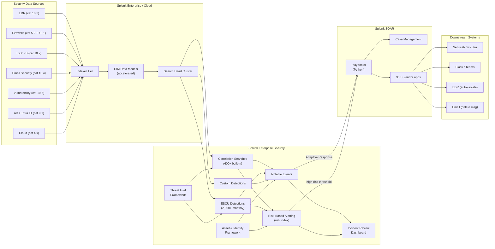

# SIEM & SOAR (Splunk Enterprise Security + SOAR + ESCU) Integration Guide

> The definitive guide to operating Splunk Enterprise Security (ES) +
> Splunk SOAR + Splunk Enterprise Security Content Update (ESCU) as a
> world-class SOC platform. **719 use cases** — the largest cluster of
> security operations content in the catalogue. Notable Event
> management, Risk-Based Alerting (RBA) lifecycle, MITRE ATT&CK
> coverage, threat intelligence operationalisation, SOAR playbook
> patterns, Mission Control / Tier-1 triage, Asset & Identity
> framework, ES KPI hygiene, and the complete detection-engineering
> pipeline from research → develop → deploy → tune → measure.
> Splunk ES is your security data lake, correlation engine, RBA
> engine, and notable-event workflow; SOAR is your response
> automation orchestrator; ESCU is your continuously-updated
> detection content library.

---

## Table of Contents

- [Quick Start](#quick-start)
- [Overview](#overview)
- [Architecture and Data Flow](#architecture)
- [Prerequisites](#prerequisites)
- [Splunk ES Components](#es-components)
- [Splunk SOAR Components](#soar-components)
- [ESCU (Splunk Enterprise Security Content Update)](#escu)
- [Splunk Security Essentials (SSE)](#sse)
- [Splunk Threat Intelligence Management (TIM)](#tim)
- [Notable Event Lifecycle](#notable-lifecycle)
- [Risk-Based Alerting (RBA)](#rba)
- [Asset & Identity Framework](#asset-identity)
- [MITRE ATT&CK Operationalisation](#mitre)
- [Field Dictionary (ES + SOAR)](#field-dictionary)
- [Sample Notable Event](#sample-events)
- [Splunk-Side Configuration](#splunk-config)
- [Detection Engineering Pipeline](#detection-engineering)
- [Cross-Product Correlation](#cross-product)
- [CIM Mapping Reference](#cim-mapping)
- [SOAR Playbook Patterns](#soar-playbooks)
- [Compliance Mapping](#compliance)
- [Capacity Planning and Sizing](#sizing)
- [Recommended Dashboard Layouts](#dashboards)
- [ITSI Service Modeling for SOC Health](#itsi)
- [Mission Control Integration](#mission-control)
- [Multi-Tenant / MSSP Strategy](#multi-tenant)
- [Security Hardening](#security-hardening)
- [Crawl / Walk / Run Roadmap](#roadmap)
- [Validation Checklist](#validation-checklist)
- [Known Limitations and Gaps](#known-limitations)
- [Troubleshooting](#troubleshooting)
- [FAQ](#faq)
- [Glossary](#glossary)
- [References](#references)
- [Contribution and Feedback](#contribution)

---

<a id="quick-start"></a>
## Quick Start — From Zero to First Notable Event

> Splunk Enterprise Security is the most-deployed enterprise SIEM. This
> Quick Start gets you from a fresh ES install to your first
> high-confidence notable event in **under 4 hours** with proper
> tuning. SOAR adds another half-day for first auto-response
> playbook. ESCU import is hours, not weeks.

### Day 1: Install Splunk Enterprise Security

1. Provision dedicated ES Search Head (or SHC).
2. Install [Splunk Enterprise Security (Splunkbase 263)](https://splunkbase.splunk.com/app/263) — premium licensed.
3. ES Setup wizard:
    - Configure indexes: `notable`, `risk`, `threat_intelligence`, `cim_modview`, `summary`
    - Confirm CIM data model acceleration enabled (Endpoint, Authentication, Network_Traffic, Web, Intrusion_Detection, Vulnerabilities)
    - Configure Asset & Identity sources (CSV, LDAP, ServiceNow, AD)
4. Validate: `index=notable earliest=-15m | stats count by source`

### Day 2: Install ESCU (Splunk Enterprise Security Content Update)

1. Install [ES Content Update (Splunkbase 3449)](https://splunkbase.splunk.com/app/3449) — free, monthly updates.
2. ESCU dashboard → Browse Content → Filter by Analytic Story
3. Enable correlation searches relevant to your data sources (start with 30-50 high-confidence detections, not the full 2,000+)
4. Validate: `| rest /services/saved/searches/?search=action.correlationsearch.enabled=1 | stats count`

### Day 3: Install Splunk SOAR

1. Provision SOAR cluster (typically 3-node HA).
2. Configure SOAR-to-ES integration (REST API to fetch notables).
3. Connect first vendor app (e.g., CrowdStrike, AD).
4. Build first playbook: "Notable → Enrich → Ticket"
5. Validate playbook execution end-to-end.

### Day 4-7: Tune

- Suppress 80% of false-positive notables via NEAPs (Notable Event Aggregation Policies)
- Tune top-10 noisiest correlation searches
- Enable RBA-mode for risk aggregation

---

<a id="overview"></a>
## Overview

### Why Splunk ES + SOAR matters

Splunk ES is the **#1 SIEM by Gartner Magic Quadrant** and Splunk SOAR is its native response orchestration platform. Together they:

- Aggregate **all** security telemetry (EDR, firewall, identity, vuln, email, cloud) into one correlation engine
- Apply **600+ pre-built correlation searches** + 2,000+ ESCU detections + custom searches
- Triage alerts via **MITRE ATT&CK**-mapped notable events
- Apply **Risk-Based Alerting (RBA)** to reduce alert fatigue 90%+
- Auto-respond via **SOAR playbooks** (containment, ticketing, enrichment)
- Provide **Mission Control** Tier-1 analyst workflow

### What this guide covers

| Component | Purpose |
|----------|--------|
| **Splunk ES** | Correlation engine, notable events, RBA, Asset & Identity, ES dashboards |
| **Splunk SOAR** | Playbook orchestration, response automation, case management |
| **ESCU** | Continuously updated detection content library (monthly) |
| **SSE** | Detection coverage visualization, SPL templates, MITRE heatmap |
| **TIM** | Threat Intelligence Management — IOC ingest, enrichment |
| **Mission Control** | Cloud-hosted Tier-1 triage workspace |

### Domains covered

| Domain | Examples |
|--------|---------|
| **Notable Event Management** | Volume trending, suppression rules, NEAP policies |
| **Correlation Search Tuning** | False-positive analysis, threshold adjustment |
| **Risk-Based Alerting** | Per-asset / per-user risk score aggregation |
| **MITRE ATT&CK Coverage** | Per-technique detection map, gap analysis |
| **Threat Intel** | IOC ingest, hit detection, expiry management |
| **Asset & Identity** | Asset / identity correlation, dynamic enrichment |
| **SOAR Automation** | Playbook execution metrics, action audit |
| **SOC Operations** | Analyst productivity, MTTR, incident velocity |

### What's NOT in scope

| Domain | Where to look |
|--------|---------------|
| **EDR-specific** | [EDR Guide](edr.md) |
| **Firewall logs** | [Firewalls Guide](firewalls.md) |
| **Vulnerability** | [Vulnerability Management Guide](vulnerability-management.md) |
| **Identity** | [Active Directory & Entra ID Guide](active-directory-entra-id.md) |
| **Splunk platform health** | [Splunk Platform Health Guide](splunk-platform-health.md) |

### What good looks like

| Dimension | Without ES+SOAR | With full ES+SOAR+ESCU |
|-----------|-----------------|------------------------|
| Detection inventory | Ad-hoc dashboards | 2,000+ ESCU + custom |
| Alert volume | 1000s/day → fatigue | RBA-aggregated <100/day |
| MTTR | Hours-days | 5-30 min (auto-enriched) |
| MITRE ATT&CK coverage | Unknown | Quarterly heatmap reports |
| Triage workflow | Email/JIRA chaos | Mission Control / Phantom |
| Compliance reports | Manual | Self-generating |

---

<a id="architecture"></a>
## Architecture and Data Flow



### Core principles

- **All security data → Splunk indexes** with CIM mapping
- **CIM acceleration** is mandatory for ES correlation searches to scale
- **Notable events** are the unified queue for SOC Tier 1
- **Risk-Based Alerting** aggregates per-entity instead of per-event
- **SOAR playbooks** automate response, never override Tier 2/3 judgment

---

<a id="prerequisites"></a>
## Prerequisites

| Item | Detail |
|------|--------|
| **Splunk version** | 9.0+ Enterprise (recommend 9.4+); Splunk Cloud Victoria preferred |
| **Splunk ES license** | Premium app license required (per indexed-volume) |
| **Splunk SOAR license** | Per concurrent-event or per-platform |
| **Hardware (ES SH)** | 24-48 vCPU, 96-192 GB RAM, NVMe storage |
| **CIM 6.x** | All required data models enabled |
| **Asset & Identity sources** | CSV, AD, LDAP, ServiceNow, or custom |
| **Threat Intel sources** | Free (TAXII feeds, MISP) or paid (Recorded Future, etc.) |

### Pre-deployment checklist

- [ ] Indexes created: `notable`, `risk`, `threat_intelligence`, `cim_modview`, `summary`
- [ ] Index `_audit` retention is 1 year+
- [ ] CIM data models accelerated (Endpoint, Authentication, Network_Traffic, Web, Vulnerabilities, Intrusion_Detection)
- [ ] All security TAs installed and field-aliased to CIM
- [ ] Asset CSV / AD source available
- [ ] Identity CSV / AD source available
- [ ] Distinct SH for ES (do not co-locate with general search workloads)

---

<a id="es-components"></a>
## Splunk ES Components

### Core dashboards

| Dashboard | Purpose |
|-----------|--------|
| **Security Posture** | Executive overview of all security pillars |
| **Incident Review** | Tier-1 / Tier-2 notable event triage queue |
| **Risk Analysis** | RBA risk-score-aggregated entities |
| **Asset Investigator** | Drill into assets across all data sources |
| **Identity Investigator** | Drill into identities across all data sources |
| **Threat Intelligence** | TIM IOC inventory + hit dashboard |
| **Audit** | ES configuration audit (correlation search edits) |
| **Use Case Library** | Visualize enabled correlation searches |

### Correlation searches

ES ships with 600+ pre-built correlation searches across:
- Authentication / Access
- Endpoint / Malware
- Network / Web / DNS
- Cloud (AWS, Azure, GCP)
- Privilege escalation
- Data exfiltration
- Lateral movement

Plus 2,000+ from ESCU. Plus your custom.

### Adaptive Response Actions

Built-in actions triggered from notable events:
- Email notification
- Run another search
- Update notable status
- Send to SOAR
- Send to ServiceNow
- Trigger Adaptive Response framework action (custom)

---

<a id="soar-components"></a>
## Splunk SOAR Components

### Core capabilities

| Capability | Purpose |
|-----------|--------|
| **Playbooks** | Python-based response automation |
| **Apps** | 350+ vendor connectors (CrowdStrike, MDE, Palo Alto, AD, ServiceNow, Slack, etc.) |
| **Cases** | Investigation workspace for analysts |
| **Workbooks** | Step-by-step incident handling templates |
| **Asset Configuration** | Connection details for vendor apps |
| **Custom Functions** | Reusable code blocks |
| **REST API** | Bidirectional integration with anything |

### Playbook architecture

```
Playbook = on_start (entry) 
         → action blocks (vendor app calls)
         → decision blocks (branching)
         → format blocks (data manipulation)
         → custom code blocks (Python)
         → on_finish (cleanup)
```

### Modes

- **Manual:** Analyst clicks "Run Playbook" from case UI
- **Automatic:** Triggered by notable event ingestion (recommended for L1 enrichment)
- **Scheduled:** Cron-style (e.g., daily threat-intel feed pull)

---

<a id="escu"></a>
## ESCU (Splunk Enterprise Security Content Update)

### What it is

A **free** monthly-updated content pack with:
- 2,000+ correlation searches
- Mapped to MITRE ATT&CK techniques
- Categorised by Analytic Story (e.g., "Cobalt Strike", "Log4Shell", "Mimikatz")
- Includes baseline + post-mortem + investigative searches

### Install + update

```
1. Download from https://splunkbase.splunk.com/app/3449
2. Install on ES Search Head (or SHC deployer)
3. ES UI → Configure → Content Management → ESCU
4. Browse by Analytic Story
5. Enable specific searches as detections
6. Re-install monthly for newest content
```

### Key analytic stories (must-enable for most SOCs)

| Story | What it covers |
|-------|---------------|
| **AD Discovery** | Enumeration of AD by attackers |
| **Brute Force Access Behavior** | Password spraying / credential stuffing |
| **Cobalt Strike** | Most-used red-team / threat-actor framework |
| **Credential Dumping** | LSASS, Mimikatz, etc. |
| **Data Exfiltration** | Multi-source exfil patterns |
| **DNS Hijacking** | Malicious DNS resolution chains |
| **Living Off the Land** | LOLBins (PowerShell, certutil, mshta, etc.) |
| **Network Discovery** | Internal network enumeration |
| **Persistence** | Registry, scheduled tasks, services |
| **Privilege Escalation** | UAC bypass, token manipulation |
| **Ransomware** | Detection and indicators |
| **Suspicious Cloud Authentication** | Multi-cloud anomalous logins |
| **Suspicious Command-Line Executions** | Encoded PowerShell etc. |

### Tuning ESCU

- Start by enabling 30-50 detections, NOT 2000+ (ES will collapse under that load)
- Filter by data sources you actually have
- Tune false-positive thresholds per detection
- Add corporation-specific exclusions

---

<a id="sse"></a>
## Splunk Security Essentials (SSE)

### What it is

A **free** app providing:
- Detection content browse / SPL templates
- MITRE ATT&CK heatmap (calculate detection coverage)
- Bookmarking + status tracking for detections
- Data inventory + source recommendations
- Direct ESCU integration

### Use SSE for

1. **Detection-coverage gap analysis** — what MITRE techniques are NOT detected?
2. **Detection-engineering scaffold** — start from SSE template, customise
3. **Tracking deployment** — bookmark "in pilot" / "production" detections
4. **Source-data mapping** — see what sources are needed per detection

---

<a id="tim"></a>
## Splunk Threat Intelligence Management (TIM)

### Core capabilities

- IOC ingest (TAXII 2.x, custom CSV, JSON, MISP, vendor feeds)
- Per-IOC enrichment (sighting count, source attribution)
- Auto-expiry (e.g., 30-90 days for IOCs)
- Sighting-event generation (when IOC observed in your data)
- Integration with ES Threat Activity dashboard

### Free + paid sources

- **Free:** AbuseIPDB, MISP, AlienVault OTX, CISA AIS, Anomali ThreatStream
- **Paid:** Recorded Future, Mandiant, Crowdstrike Intel, Anomali ThreatStream Premium

### TIM ingest example (TAXII 2.x)

```
Splunk Web → ES → Configure → Threat Intelligence Sources
+ Add TAXII 2.0 Source:
    - Name: AbuseIPDB-Feed
    - URL: https://api.abuseipdb.com/taxii/api1/services/discovery
    - Username: <your-key>
    - Collection: malicious-ips
```

---

<a id="notable-lifecycle"></a>
## Notable Event Lifecycle

```
Correlation Search fires
  → Notable Event created (in `notable` index)
  → Adaptive Response actions run (auto-enrichment, SOAR, etc.)
  → Notable appears in Incident Review dashboard
  → Tier-1 analyst:
      → Mark "False Positive" → close + tune detection
      → Mark "Incident" → escalate to Tier-2 / case
      → Mark "Suppressed" → suppress similar via NEAP rule
  → Tier-2 → SOAR case → investigation → resolution
  → Notable closed with disposition
```

### Sample SPL — Notable trending (cat 10.7 UC)

```spl
`notable`
| timechart span=1d count by source
| sort -count
```

### Sample SPL — Notable disposition

```spl
`notable`
| stats count by status, owner, disposition
| sort -count
```

---

<a id="rba"></a>
## Risk-Based Alerting (RBA)

### Why RBA

Traditional SIEM: every detection → notable event → analyst burnout.
RBA: each detection → risk score on (asset, identity); only when aggregate risk crosses threshold → notable event.

Result: typically **80-95% reduction in alert volume** with no loss of detection coverage.

### How to enable

```
ES Configure → Correlation Search → Edit Search → Enable Risk Action
+ Risk Object: src/dest/user
+ Risk Object Type: system/user
+ Risk Score: 10-100 based on detection severity
```

### Risk-aggregation correlation search

ES Content Update ships with `Risk - High Risk Object` correlation search:

```spl
| tstats `summariesonly` sum(All_Risk.calculated_risk_score) as risk_score, 
                          values(All_Risk.threat_object_type) as threat_object_type, 
                          values(All_Risk.threat_object) as threat_object,
                          dc(All_Risk.source) as source_count
    from datamodel=Risk.All_Risk 
    where All_Risk.risk_object_type="system" OR All_Risk.risk_object_type="user"
    by All_Risk.risk_object_type, All_Risk.risk_object
| where risk_score > 100 AND source_count > 3
| sort -risk_score
```

### Pillars of RBA

1. **Source diversity** — only escalate when N different sources flag entity
2. **MITRE ATT&CK weight** — weight per-tactic / per-technique
3. **Asset criticality multiplier** — Crown jewels get higher multiplier
4. **Time decay** — risk diminishes over time

---

<a id="asset-identity"></a>
## Asset & Identity Framework

### Why it matters

Asset & Identity (A&I) is the **glue** that connects events from different sources to the same logical entity. Without A&I, "192.168.1.10" and "WS-FINANCE-001" and "DOMAIN\jdoe" are isolated facts.

### Sources

| Source | Purpose |
|--------|--------|
| **CSV** | Bulk import (admin/manual updates) |
| **AD** | Computers + Users LDAP |
| **DHCP** | Dynamic IP-host mapping |
| **DNS** | Hostname-IP mapping |
| **ServiceNow CMDB** | Authoritative asset register |
| **Cloud APIs** | AWS EC2, Azure VM, GCP Compute |
| **EDR APIs** | CrowdStrike Hosts, MDE Devices |

### Asset fields

| Field | Purpose |
|-------|--------|
| `ip` | IP address (multivalue) |
| `mac` | MAC (multivalue) |
| `nt_host` | Windows NETBIOS name |
| `dns` | FQDN |
| `owner` | Owning user/team |
| `priority` | low/medium/high/critical (drives RBA) |
| `category` | server/workstation/network/IoT |
| `pci_domain` | PCI scope: trusted/untrusted/cardholder |
| `bunit` | Business unit |

### Identity fields

| Field | Purpose |
|-------|--------|
| `user` | sAMAccountName / UPN |
| `email` | Email |
| `nt_host` | Last-known endpoint |
| `priority` | high for execs / privileged |
| `category` | employee / contractor / service |
| `bunit` | Business unit |
| `watchlist` | yes/no — flagged for monitoring |

---

<a id="mitre"></a>
## MITRE ATT&CK Operationalisation

### Mapping correlation searches to ATT&CK

ES + ESCU + SSE all auto-tag detections with MITRE ATT&CK technique IDs:

```spl
`notable`
| eval mitre_techniques = mitre_attack_id
| mvexpand mitre_techniques
| stats count by mitre_techniques
| sort -count
```

### Heatmap dashboard

[Splunk Security Essentials](#sse) ships a MITRE ATT&CK Heatmap that:
- Visualises which techniques have detections
- Colours by enabled vs disabled vs missing
- Allows filter by data sources / detection status / quality

### Quarterly ATT&CK gap analysis (recommended ritual)

1. Generate heatmap snapshot
2. Compare to previous quarter
3. Identify newly-published techniques (MITRE quarterly releases)
4. Prioritise gap fills based on threat landscape
5. Create detection backlog

---

<a id="field-dictionary"></a>
## Field Dictionary (ES + SOAR)

### Notable event core fields

| Field | Purpose |
|-------|--------|
| `_time` | When notable fired |
| `event_id` | Unique notable ID |
| `rule_name` | Correlation search name |
| `rule_title` | Display title |
| `urgency` | low/medium/high/critical |
| `severity` | Same as urgency for backwards compat |
| `risk_score` | RBA score |
| `src` | Source IP/host |
| `dest` | Destination IP/host |
| `user` | Identity involved |
| `mitre_attack_id` | MITRE technique ID(s) |
| `status` | new/in_progress/closed/suppressed |
| `owner` | Assigned analyst |
| `disposition` | true_positive/false_positive/etc. |

### SOAR core fields

| Field | Purpose |
|-------|--------|
| `id` | Container (case) ID |
| `name` | Case name |
| `severity` | low/medium/high |
| `status` | new/open/closed |
| `owner` | Assigned analyst |
| `playbook` | Playbook ID/name |
| `actions` | List of executed actions |
| `artifacts` | Evidence (IPs, hashes, files, etc.) |

---

<a id="sample-events"></a>
## Sample Notable Event

```json
{
    "_time": "2026-04-25T14:30:15.000Z",
    "event_id": "1745596215_001",
    "_raw": "...",
    "search_name": "Endpoint - Suspicious Process - Mimikatz",
    "rule_name": "Endpoint - Suspicious Process - Mimikatz",
    "rule_title": "Mimikatz LSASS Access detected",
    "urgency": "high",
    "severity": "high",
    "src": "10.10.10.10",
    "dest": "WS-FINANCE-001",
    "user": "DOMAIN\\jdoe",
    "process": "powershell.exe",
    "process_path": "C:\\Windows\\System32\\WindowsPowerShell\\v1.0\\powershell.exe",
    "mitre_attack_id": ["T1003.001"],
    "asset_priority": "high",
    "identity_priority": "high",
    "asset_category": ["pci_cardholder"],
    "risk_score": 80,
    "status": "new",
    "owner": "unassigned",
    "disposition": null
}
```

---

<a id="splunk-config"></a>
## Splunk-Side Configuration

### Index strategy

```ini
[notable]
homePath = $SPLUNK_DB/notable/db
maxDataSize = auto
frozenTimePeriodInSecs = 31536000   # 1 year minimum (audit/compliance)

[risk]
homePath = $SPLUNK_DB/risk/db
maxDataSize = auto_high_volume
frozenTimePeriodInSecs = 31536000

[threat_intelligence]
homePath = $SPLUNK_DB/threat_intelligence/db
maxDataSize = auto
frozenTimePeriodInSecs = 7776000   # 90 days

[cim_modview]
homePath = $SPLUNK_DB/cim_modview/db
maxDataSize = auto
frozenTimePeriodInSecs = 7776000

[phantom]
homePath = $SPLUNK_DB/phantom/db
maxDataSize = auto
frozenTimePeriodInSecs = 31536000   # 1 year (case audit)
```

### CIM data model acceleration (mandatory)

```ini
[Authentication]
acceleration = 1
acceleration.earliest_time = -7d

[Endpoint]
acceleration = 1
acceleration.earliest_time = -7d

[Network_Traffic]
acceleration = 1
acceleration.earliest_time = -7d

[Web]
acceleration = 1
acceleration.earliest_time = -7d

[Vulnerabilities]
acceleration = 1
acceleration.earliest_time = -90d

[Intrusion_Detection]
acceleration = 1
acceleration.earliest_time = -7d

[Risk]
acceleration = 1
acceleration.earliest_time = -7d
```

---

<a id="detection-engineering"></a>
## Detection Engineering Pipeline

### The lifecycle

```
1. RESEARCH    — threat intel, MITRE, internal incident lessons
2. DEVELOP     — write SPL, test in dev (use Splunk Attack Range)
3. PEER REVIEW — second pair of eyes; check FP rate estimate
4. PILOT       — deploy to ES with low urgency for 30 days
5. TUNE        — adjust thresholds based on pilot data
6. PROMOTE     — full production with appropriate urgency
7. MEASURE     — track FP rate, MTTD, MTTR per detection
8. RETIRE      — sunset stale or low-value detections
```

### Detection-as-code

Treat correlation searches like code:
- Source-control your `savedsearches.conf`
- Code review via PRs
- Test in dev with Splunk Attack Range
- Deploy via deployment server / SHC bundle

### Splunk Attack Range

[Splunk Attack Range](https://github.com/splunk/attack_range) is open-source — spins up a vulnerable AD lab + lets you simulate ATT&CK techniques and validate your detections.

---

<a id="cross-product"></a>
## Cross-Product Correlation

### Notable + Asset criticality + RBA

```spl
| from datamodel:Risk.All_Risk
| stats sum(All_Risk.calculated_risk_score) as total_risk
        dc(All_Risk.source) as source_count
        values(All_Risk.threat_object) as threats
        by All_Risk.risk_object
| lookup asset_lookup nt_host as risk_object OUTPUT priority, owner, bunit
| where total_risk > 80 AND priority="critical"
| sort -total_risk
```

### Multi-source attack chain

```spl
(`notable` urgency IN ("high", "critical") earliest=-1h)
| eval entity = coalesce(src, dest, user)
| stats values(rule_name) as rules, dc(rule_name) as rule_count, 
        values(mitre_attack_id) as techniques 
        by entity
| where rule_count >= 3
```

### SOAR playbook execution stats

```spl
index=phantom sourcetype="phantom:audit" earliest=-7d
| stats count by playbook_name, action, status
| where status="failed"
| sort -count
```

---

<a id="cim-mapping"></a>
## CIM Mapping Reference

| CIM model | Source | Auto-mapped? |
|-----------|--------|--------------|
| **Risk** | ES correlation searches → risk action | Yes |
| **Notable** | ES correlation searches → notable action | Yes |
| **Authentication** | All auth-source TAs | Yes |
| **Endpoint** | All EDR/Sysmon TAs | Yes |
| **Network_Traffic** | All firewall + flow TAs | Yes |
| **Web** | All web/proxy TAs | Yes |
| **Email** | All email TAs | Yes |
| **Vulnerabilities** | All vuln-scanner TAs | Yes |
| **Intrusion_Detection** | All IDS/IPS TAs | Yes |
| **Alerts** | All alert-source TAs | Yes |
| **Change** | All config-change TAs | Yes |
| **Inventory** | Asset-source data | Yes |

---

<a id="soar-playbooks"></a>
## SOAR Playbook Patterns

### Pattern 1: Enrich-and-route (T1 enrichment)

**Purpose:** Auto-enrich every notable with context before analyst sees it.

```python
# pseudocode
def on_notable(container, results):
    notable = results['notable']
    
    # Enrich src/dest with reverse DNS, geo, asset criticality
    enrich_ip(notable['src'])
    enrich_ip(notable['dest'])
    
    # Enrich user with AD attributes
    enrich_user(notable['user'])
    
    # Enrich file hashes with VirusTotal
    if notable.get('file_hash'):
        vt_lookup(notable['file_hash'])
    
    # Update notable with enriched evidence
    update_notable(notable['event_id'], {'enriched': True})
```

### Pattern 2: Auto-contain (RBA-triggered)

**Purpose:** When entity exceeds risk threshold, auto-contain.

```python
def on_high_risk_entity(container, results):
    entity = results['risk_object']
    
    # Snapshot/dump for evidence
    dump = run_action('crowdstrike', 'get process tree', {'host': entity})
    
    # Auto-contain
    contain = run_action('crowdstrike', 'contain device', {'host': entity})
    
    # Disable AD account
    disable_user = run_action('ad', 'disable user', {'user': entity['user']})
    
    # Create Sev-1 ticket
    create_ticket('servicenow', 
        f'Auto-contained: high-risk entity {entity}',
        attachments=[dump, contain, disable_user])
    
    # Notify
    notify_slack('#soc-incidents', f'Auto-contained {entity}')
```

### Pattern 3: Threat-intel-feed-pull (scheduled)

**Purpose:** Pull threat intel daily, push to TIM, hunt for IOC sightings.

```python
def daily_ti_pull(container):
    iocs = fetch_taxii_feed('https://feed.example.com')
    
    for ioc in iocs:
        push_to_tim(ioc)
        
    hits = hunt_iocs_in_splunk(iocs, time_range='-24h')
    if hits:
        create_case('IOC sightings detected', hits)
```

---

<a id="compliance"></a>
## Compliance Mapping

### NIST 800-53

| Control | Coverage |
|---------|----------|
| **AU-6** Audit Review/Analysis | All ES dashboards + RBA |
| **IR-4** Incident Handling | Notable lifecycle + SOAR |
| **IR-6** Incident Reporting | Disposition tracking + reports |
| **IR-7** Incident Response Assistance | SOAR auto-playbooks |
| **SI-4** System Monitoring | All correlation searches |
| **SI-5** Threat Intelligence | TIM integration |

### NIS2

| Article | Coverage |
|---------|----------|
| **Art 21(2)(d)** Detection / response | All ES correlation + RBA + SOAR |
| **Art 23** Incident reporting | Notable disposition tracking + 24h MTTR proof |

### PCI-DSS 4.0

| Requirement | Coverage |
|-------------|----------|
| **10.2** Audit logs | All sources + ES audit |
| **10.7** Audit log review | RBA + Incident Review dashboard |
| **12.10** Incident response plan | SOAR playbooks documented |

### SOC 2

| TSC | Coverage |
|-----|----------|
| **CC6.x** Access controls | ES Authentication monitoring |
| **CC7.x** System operations | All ES + ITSI correlation |

---

<a id="sizing"></a>
## Capacity Planning and Sizing

### ES sizing guidance

| Daily indexed volume | ES SH spec | Accelerated DM count |
|---------------------|-----------|---------------------|
| < 100 GB | 16 vCPU, 64 GB RAM | 6 models |
| 100-500 GB | 24 vCPU, 96 GB RAM | 8 models |
| 500 GB-1 TB | 32 vCPU, 128 GB RAM | 10+ models |
| 1-5 TB | 48 vCPU, 192 GB RAM, dedicated SHC | All models |
| 5+ TB | Multi-SH ES (Splunk Cloud strongly recommended) | All |

### SOAR sizing guidance

| Daily container count | SOAR spec |
|----------------------|-----------|
| < 1,000 | 8 vCPU, 32 GB RAM, single node |
| 1,000-5,000 | 16 vCPU, 64 GB RAM, 3-node HA |
| 5,000-20,000 | 32 vCPU, 128 GB RAM, 3-node HA + dedicated DB |
| 20,000+ | Multi-cluster + Splunk Professional Services |

### Retention recommendations

| Data | Retention | Rationale |
|------|-----------|-----------|
| `notable` index | 1 year+ | Audit, compliance |
| `risk` index | 90 days | RBA aggregation lookback |
| `threat_intelligence` | 30-90 days | Feed cycle |
| Phantom case audit | 1 year+ | Compliance |

---

<a id="dashboards"></a>
## Recommended Dashboard Layouts

### Crawl — "Security Posture"

```
+---------------------+---------------------+
| OPEN HIGH/CRITICAL NOTABLE EVENTS          |
+---------------------+---------------------+
| NOTABLE EVENT VOLUME — TREND              |
+---------------------+---------------------+
| TOP-10 CORRELATION SEARCHES BY VOLUME     |
+---------------------+---------------------+
| ESCU DETECTION COUNT (enabled / total)    |
+---------------------+---------------------+
```

### Walk — "RBA + MITRE Coverage"

```
+---------------------+---------------------+
| TOP-10 HIGH-RISK ENTITIES (RBA)            |
+---------------------+---------------------+
| MITRE ATT&CK HEATMAP                       |
+---------------------+---------------------+
| TOP TACTICS OBSERVED LAST 24H              |
+---------------------+---------------------+
| TECHNIQUE GAPS (no detections in 30d)      |
+---------------------+---------------------+
```

### Run — "SOC Performance"

```
+---------------------+---------------------+
| MTTR (mean time to respond)                |
+---------------------+---------------------+
| MTTD (mean time to detect)                 |
+---------------------+---------------------+
| ANALYST PRODUCTIVITY (notables/analyst/day)|
+---------------------+---------------------+
| AUTO-CONTAINMENT SUCCESS RATE              |
+---------------------+---------------------+
| SOAR PLAYBOOK EXECUTION HEALTH             |
+---------------------+---------------------+
```

---

<a id="itsi"></a>
## ITSI Service Modeling for SOC Health

### Service hierarchy

```
SOC Operations
├── Detection Pipeline
│   ├── ES Correlation Search Health
│   ├── ESCU Detection Coverage
│   └── Custom Detection Coverage
├── Notable Event Pipeline
│   ├── Notable Volume per Source
│   ├── Notable Latency (correlation → notable)
│   └── NEAP Suppression Rate
├── RBA Pipeline
│   ├── Risk Score Update Frequency
│   └── High-Risk Entity Count
├── SOAR Pipeline
│   ├── Playbook Execution Success Rate
│   ├── Playbook Latency
│   └── Auto-Containment Success Rate
└── Threat Intel Pipeline
    ├── TIM Feed Freshness
    └── IOC Hit Rate
```

### Recommended KPIs

| KPI | Source | Threshold |
|-----|--------|-----------|
| New notables/hr | `notable` | Adaptive |
| MTTD | Notable_first_seen - event_time | Static (warn > 30min, crit > 2h) |
| MTTR | Notable_closed - notable_first_seen | Adaptive (improvement KPI) |
| Notable backlog | open notables count | Static (warn > 50, crit > 200) |
| RBA high-risk entity count | Risk DM | Static (warn > 5) |
| SOAR playbook success % | Phantom audit | Static (warn < 95%) |

---

<a id="mission-control"></a>
## Mission Control Integration

[Splunk Mission Control](https://www.splunk.com/en_us/products/mission-control.html) is the cloud-based unified SOC workspace that wraps ES + SOAR + Cloud + Intel + ITSI into a single Tier-1 analyst pane:

- Unified inbox (all notables across all ES instances)
- One-click playbook execution from notable
- Investigation graph (entity relationships)
- Built-in case management
- Mobile-friendly for on-call

### Migration path (ES customers)

1. Deploy Mission Control alongside existing ES
2. Configure ES → Mission Control bidirectional sync
3. Pilot with one team for 30-60 days
4. Migrate Tier-1 workflow

---

<a id="multi-tenant"></a>
## Multi-Tenant / MSSP Strategy

For MSSPs and large multi-business-unit deployments:

- **Per-tenant indexes** (`notable_customer1`, `risk_customer1`)
- **Per-tenant ES tenants** (Splunk ES Multi-tenancy in 7.x+)
- **Per-tenant SOAR tenants** (SOAR Multi-tenant)
- **Per-tenant correlation searches** (in tenant-specific app context)
- **Per-tenant Asset & Identity** (separate CSV / AD per tenant)
- **Splunk Professional Services** strongly recommended for MSSP topology

---

<a id="security-hardening"></a>
## Security Hardening

- ES Search Head **NOT** internet-accessible; behind VPN + MFA
- Splunk SOAR API tokens rotated 90-day
- Field-level RBAC for sensitive notable fields (e.g., HR investigations)
- Audit immutable: forward all `_audit` to write-once index
- All Adaptive Response actions require approval (or signed)
- Splunk admin role separation: ES admin ≠ Splunk admin ≠ SOAR admin
- TLS for all ES/SOAR endpoints
- KV Store backups daily + tested

---

<a id="roadmap"></a>
## Crawl / Walk / Run Roadmap

### Crawl (Month 1-2)

1. Install ES + ESCU + SSE
2. Enable ~30 high-confidence ESCU detections
3. CIM acceleration on Auth + Endpoint + Network + Web
4. First Asset & Identity sources (CSV at minimum)
5. Crawl-tier dashboards live
6. UC-10.7.1 wired (notable volume trending)

### Walk (Month 3-4)

1. SOAR deployed + first 5 playbooks
2. First Adaptive Response → SOAR integration
3. RBA enabled on top-20 detections
4. ESCU expanded to ~150 detections
5. MITRE ATT&CK Heatmap operational
6. ITSI SOC service modeled

### Run (Month 5+)

1. Full RBA-mode for all detections
2. Mission Control or full SOAR + Cases workflow
3. Quarterly MITRE ATT&CK gap analysis
4. Custom detection development pipeline (detection-as-code)
5. Threat intel program operational (TIM + IOC sightings)
6. SOAR auto-containment for top-10 use cases
7. MTTR/MTTD SLO tracking

---

<a id="validation-checklist"></a>
## Validation Checklist

### Day 1

- [ ] ES installed, premium license active
- [ ] Setup wizard complete
- [ ] First notable visible in Incident Review

### Day 7

- [ ] CIM acceleration enabled
- [ ] First A&I source loaded
- [ ] 30+ correlation searches enabled
- [ ] Crawl-tier dashboards live

### Day 30

- [ ] Walk-tier UCs deployed
- [ ] RBA enabled for ~20 detections
- [ ] First SOAR playbook in production
- [ ] MITRE Heatmap reviewed quarterly

### Day 90

- [ ] Run-tier UCs deployed
- [ ] Mission Control or full Cases workflow
- [ ] Quarterly gap analysis report
- [ ] MTTR/MTTD SLO tracking
- [ ] Detection-as-code pipeline

---

<a id="known-limitations"></a>
## Known Limitations and Gaps

| Limitation | Impact | Workaround |
|------------|--------|------------|
| **CIM acceleration is mandatory** | Without it, ES correlations slow / fail | Plan storage and SH compute appropriately |
| **ES SH compute hungry** | A busy ES SH saturates CPU | Dedicate SH; consider SHC for very large estates |
| **ESCU enabling 2000+ detections crashes ES** | KV Store + scheduler overload | Enable selectively (30-200 range typical) |
| **Risk index lookback affects RBA** | Default 7d may miss slow-burn campaigns | Extend Risk acceleration window |
| **Notable Event field RBAC is coarse** | Hard to hide HR fields from generic SOC | Use separate ES tenant or KV Store mask |
| **SOAR Python sandbox limits** | Some Python libs unavailable | Use SOAR custom Python wheels |
| **Mission Control deprecation in some regions** | Vendor product changes | Track Splunk roadmap |

---

<a id="troubleshooting"></a>
## Troubleshooting

### Notable events not appearing

```
# Check correlation search execution
| rest /services/saved/searches/?search=action.correlationsearch.enabled=1 
| stats count

# Check scheduler health
index=_internal source=*scheduler.log* earliest=-1h log_level=ERROR

# Check `notable` index permissions
| rest /services/data/indexes/notable
```

### ES search performance terrible

- Verify CIM acceleration completed
  ```
  | rest /services/datamodel/acceleration/info | table title build_status access_count
  ```
- Check max concurrent searches:
  ```
  | rest /services/server/info | table max_concurrent_searches
  ```
- Disable noisy correlation searches (temp)

### SOAR playbook failing

- Check Phantom audit log:
  ```
  index=phantom sourcetype="phantom:audit" status=failed earliest=-1h
  ```
- Verify asset (vendor app) credentials
- Test connection in Asset Configuration UI

### MITRE Heatmap empty

- Ensure SSE installed and configured
- Verify your detections have `mitre_attack_id` field set
- Re-run MITRE coverage refresh (SSE config menu)

### Risk-Based Alerting not aggregating

- Verify Risk action enabled on correlation searches
- Verify `risk` index acceleration
- Check risk DM acceleration progress
- Default RBA correlation search must be enabled

---

<a id="faq"></a>
## FAQ

**Q: Is Splunk ES required to use ESCU?**
A: No. ESCU is a free content pack and works on Splunk Enterprise/Cloud without ES. ES adds the correlation engine, notable events, RBA, A&I, dashboards, and Adaptive Response — i.e., the SOC workflow.

**Q: Can I use Splunk SOAR without Splunk ES?**
A: Yes. SOAR can ingest from any source via webhooks, REST, or other apps. ES is the recommended source for SOC-grade workflow.

**Q: How do I migrate from QRadar / ArcSight / LogRhythm to Splunk ES?**
A: Splunk Professional Services has a structured migration. Key steps: data sources first → CIM mapping → migrate detections (ESCU covers 80%+ of typical content) → RBA tuning → SOAR migration.

**Q: How long does ES deployment take?**
A: Minimal viable: 4 weeks. Production-grade SOC: 3-6 months including detection engineering, A&I, SOAR playbooks.

**Q: Should I use Mission Control?**
A: For Splunk Cloud customers, yes — it's the future workflow. For Splunk Enterprise on-prem, evaluate cautiously (some features require Cloud).

**Q: How do I tune false-positive rate?**
A: (1) Disable noisy detections, (2) Add NEAP suppressions, (3) Tune thresholds, (4) Enrich with A&I priority filters, (5) Move to RBA-mode (aggregates per-entity instead of per-event).

**Q: What's the difference between ESCU, Splunk Security Essentials, and ES?**
A: ESCU = detection content (free). SSE = browse/visualize/template tool (free). ES = the SOC platform itself (paid).

**Q: Can I version-control my correlation searches?**
A: Yes. Export `savedsearches.conf` to git. Many orgs use Splunk SOAR's playbook git integration as a model.

**Q: How does Splunk ES compare to Microsoft Sentinel?**
A: Both are leaders. ES wins on rapid correlation, RBA maturity, on-prem flexibility, and connector breadth (350+ via SOAR). Sentinel wins on Azure-native cost (free for first 3GB/day), KQL ecosystem, and SOAR-equivalent (Logic Apps).

---

<a id="glossary"></a>
## Glossary

| Term | Definition |
|------|-----------|
| **ES** | Splunk Enterprise Security |
| **SOAR** | Security Orchestration, Automation, and Response |
| **ESCU** | Splunk Enterprise Security Content Update (detection content pack) |
| **SSE** | Splunk Security Essentials |
| **TIM** | Threat Intelligence Management |
| **CIM** | Common Information Model |
| **RBA** | Risk-Based Alerting |
| **A&I** | Asset & Identity Framework |
| **NEAP** | (ITSI) Notable Event Aggregation Policy (also used in ES context) |
| **MITRE ATT&CK** | Adversary tactics, techniques, common knowledge |
| **TTP** | Tactics, Techniques, Procedures |
| **MTTD / MTTR** | Mean Time To Detect / Respond |
| **IOC** | Indicator of Compromise |
| **TAXII** | Trusted Automated Exchange of Indicator Information |
| **STIX** | Structured Threat Information eXpression |
| **DM** | Data Model (Splunk CIM) |
| **DMA** | Data Model Acceleration |
| **SHC** | Search Head Cluster |
| **Notable** | A correlated event flagged for analyst review |

---

<a id="references"></a>
## References

- [Splunk Enterprise Security (Splunkbase 263)](https://splunkbase.splunk.com/app/263)
- [Splunk SOAR (Splunkbase 4434)](https://splunkbase.splunk.com/app/4434)
- [Splunk Security Essentials (Splunkbase 3435)](https://splunkbase.splunk.com/app/3435)
- [ES Content Update (Splunkbase 3449)](https://splunkbase.splunk.com/app/3449)
- [Splunk Attack Range](https://github.com/splunk/attack_range)
- [Splunk SURGe blog](https://www.splunk.com/en_us/blog/learn/security-research.html)
- [MITRE ATT&CK framework](https://attack.mitre.org/)
- [CIM Reference](https://docs.splunk.com/Documentation/CIM/latest/User/Overview)
- [Splunk Lantern: SIEM Use Cases](https://lantern.splunk.com/Security/UCE)

---

<a id="contribution"></a>
## Contribution and Feedback

Part of the [Splunk Monitoring Use Cases](https://github.com/fenre/splunk-monitoring-use-cases) project. [Open an issue](https://github.com/fenre/splunk-monitoring-use-cases/issues/new).

---

*Last updated: 2026-05-09. Covers Splunk Enterprise Security 7.x / 8.x, Splunk SOAR 6.x, ESCU monthly 2026.x releases.*
