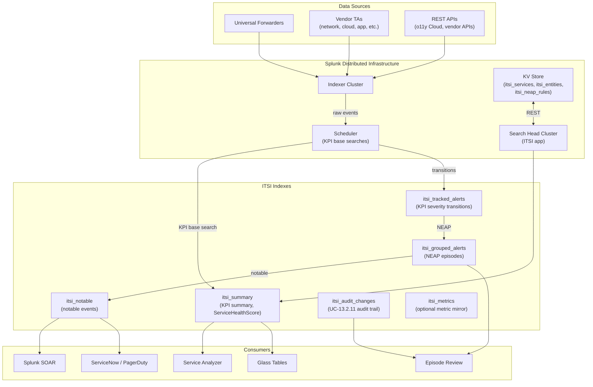

# Splunk IT Service Intelligence (ITSI) Integration Guide

> The definitive guide to operating Splunk's premium AIOps platform.
> 41 use cases for monitoring ITSI ITSELF — service health regression
> tracking, KPI base-search efficacy, NEAP storm detection, threshold
> tuning, episode lifecycle management, and entity inventory drift.
> This is the meta-monitoring guide: how to operate ITSI in production
> while it operates everything else.

---

## Table of Contents

- [Quick Start](#quick-start)
- [Overview](#overview)
- [Architecture and Data Flow](#architecture)
- [Prerequisites](#prerequisites)
- [ITSI Concepts Reference](#concepts)
- [Data Sources Reference](#data-sources)
- [Field Dictionary](#field-dictionary)
- [Sample Events](#sample-events)
- [Indexes ITSI Writes To](#itsi-indexes)
- [REST API for Inventory](#rest-api)
- [KPI Base Search Patterns](#kpi-base-search)
- [Service Modeling Best Practices](#service-modeling)
- [Adaptive Thresholding](#adaptive-thresholding)
- [Notable Event Aggregation Policies (NEAPs)](#neap)
- [Glass Tables](#glass-tables)
- [Cross-Product Correlation](#cross-product)
- [CIM Mapping Reference](#cim-mapping)
- [Compliance Mapping](#compliance)
- [Capacity Planning and Sizing](#sizing)
- [Recommended Dashboard Layouts](#dashboards)
- [SOAR Playbook Examples](#soar)
- [Multi-Stack / Federated Strategy](#multi-stack)
- [Security Hardening](#security-hardening)
- [Crawl / Walk / Run Roadmap](#roadmap)
- [Validation Checklist](#validation-checklist)
- [Known Limitations and Gaps](#known-limitations)
- [Troubleshooting](#troubleshooting)
- [FAQ](#faq)
- [Glossary](#glossary)
- [References](#references)
- [Contribution and Feedback](#contribution)

---

<a id="quick-start"></a>
## Quick Start — Operating ITSI

Unlike vendor TA-based integrations, **ITSI is not "set up and ingested" — it is the platform you operate**. This guide assumes ITSI is already installed and you need to monitor it as a critical production service.

1. **Verify ITSI is healthy** (5 minutes):

    ```spl
    | rest /services/itoa_interface/service splunk_server=local
    | stats count
    | eval status=if(count>0, "ITSI services responding", "ITSI REST not responding")
    ```

2. **Confirm KPI base searches are scheduled**:

    ```spl
    index=_internal sourcetype=itsi_searchlog earliest=-15m
    | stats count by base_search_name
    ```

3. **Verify Service Health Score is being written**:

    ```spl
    index=itsi_summary earliest=-1h
    | stats count by service_title
    | sort -count
    ```

4. **Activate self-monitoring UCs** — UC-13.2.1 (Service Health regression), UC-13.2.6 (Rules engine health), UC-13.2.11 (KPI threshold tuning), UC-13.2.18 (adaptive threshold quality), UC-13.2.27 (Observability Cloud integration health).

---

<a id="overview"></a>
## Overview

### What ITSI is

Splunk IT Service Intelligence (ITSI) is Splunk's premium AIOps platform that:

- Models your **services and their dependencies** as a tree of entities + KPIs
- Computes a **Service Health Score** (0–100) per service, weighted by KPI importance
- Aggregates raw alerts into **Episodes** via Notable Event Aggregation Policies (NEAPs)
- Provides **Glass Tables** for executive at-a-glance views
- Applies **adaptive thresholding** (mean ± n×stdev) to learn KPI baselines
- Powers **predictive analytics** via the embedded ML engine

### What this guide is — and is NOT

| This guide | NOT this guide |
|-----------|---------------|
| How to **monitor ITSI itself** in production | How to install ITSI |
| How ITSI's data flows so you can troubleshoot | A general "what is ITSI" beginner's guide |
| Detection patterns for ITSI degradation | A replacement for Splunk Education courses |
| Patterns for tuning KPI quality | KPI authoring tutorials |

### Why monitor ITSI?

ITSI itself runs on:

- **Search heads** (or SH cluster) — KPI base searches, Service Health computation, Glass Table rendering
- **Indexer cluster** — `itsi_summary`, `itsi_tracked_alerts`, `itsi_grouped_alerts`, `itsi_audit_changes` indexes
- **KV Store** — service / entity definitions, NEAP rules
- **Scheduler** — runs hundreds to thousands of KPI base searches per minute

If any of these tier degrades, ITSI accuracy degrades — and you can't trust your service health scores anymore. **You need to monitor ITSI like any other business-critical platform.**

### What good looks like

| Dimension | Without self-monitoring | With self-monitoring |
|-----------|-------------------------|----------------------|
| KPI base-search skip rate | Unknown until SOC complains | Real-time visibility |
| Service Health Score gaps | "Why is this service N/A?" | UC-13.2.1 alert + RCA |
| NEAP storms | Episode review unusable | UC-13.2.x storm detection |
| Adaptive threshold drift | Bad alerts no one trusts | UC-13.2.18 calibration alerts |
| Entity inventory rot | Stale services | Periodic inventory drift detection |

---

<a id="architecture"></a>
## Architecture and Data Flow



**Data flow stages:**

1. **Raw data lands** — vendor TAs / forwarders write to source-of-truth indexes
2. **KPI base search runs** — scheduler invokes search every N minutes, computes per-entity KPI value
3. **KPI summary written** — result lands in `itsi_summary`
4. **Severity computed** — comparison against threshold yields severity (1=info to 6=critical)
5. **Service Health Score** — weighted aggregation of KPIs per service
6. **Tracked alerts written** — severity transitions land in `itsi_tracked_alerts`
7. **NEAP groups them** — Notable Event Aggregation Policy clusters into episodes
8. **Notable events written** — landing in `itsi_notable` for external delivery (SOAR, ServiceNow)

**Failure modes you want to detect:**

- Scheduler skipping KPI base searches → KPI values stale
- KPI base search returning empty → Service Health Score becomes N/A
- Adaptive threshold mis-learning → false positive storm
- NEAP grouping logic broken → episode review filling with noise
- KV Store latency → UI slow, KPIs delayed

---

<a id="prerequisites"></a>
## Prerequisites

### Splunk requirements

| Item | Detail |
|------|--------|
| **Splunk Enterprise** | 9.0+ (9.4 current as of 2026); Splunk Cloud Victoria supported |
| **ITSI license** | Premium — billed by KPI volume / service count |
| **Splunk_SA_CIM** | Required for many ITSI content packs |
| **Indexer cluster** | Recommended for production ITSI |
| **Search head cluster** | Recommended for production ITSI |
| **KV Store** | Required (always-on in ITSI) |
| **Splunk Enterprise Security** | Optional (ITSI + ES integration enables Risk Based Alerting) |

### Skill requirements

ITSI is a power tool. To operate it well you need:

- A **service owner** who curates services and KPIs
- A **scheduler operator** who watches base-search performance
- An **episode manager** who tunes NEAPs and keeps Episode Review usable
- A **content author** who builds and maintains base searches and templates

---

<a id="concepts"></a>
## ITSI Concepts Reference

| Concept | Definition |
|---------|-----------|
| **Service** | A monitored business or technical capability (e.g., "Payment Processing", "Email Delivery") |
| **Entity** | A monitored asset (host, VM, container, app) that contributes to a service |
| **KPI** | A measurable signal about service health (e.g., "API error rate", "DB latency") |
| **Base search** | The SPL that computes KPI values per entity per time bucket |
| **Threshold template** | Reusable severity rules (e.g., warn > 100 ms, critical > 500 ms) |
| **Static thresholds** | Hard-coded numeric limits |
| **Adaptive thresholds** | ML-learned baselines using mean ± stdev |
| **Service Health Score** | Weighted KPI aggregation, 0–100, with severity bands |
| **Service template** | Reusable service definition for cloning |
| **Entity rule** | Lookup-driven mapping of entities to services |
| **Glass Table** | Drag-and-drop dashboard with embedded service health |
| **NEAP** | Notable Event Aggregation Policy — clusters tracked alerts into episodes |
| **Episode** | A collection of related notable events under one ticket |
| **Episode Review** | UI for triaging open episodes |
| **Predictive analytics** | ML model predicting future service health degradation |

---

<a id="data-sources"></a>
## Data Sources Reference

These are the indexes ITSI writes to — and which you query to **monitor ITSI itself**.

| Index | Sourcetype(s) | Contains |
|-------|--------------|----------|
| `itsi_summary` | `itsi_kpi`, `itsi_health_monitor` | Per-KPI summary rows, ServiceHealthScore rows |
| `itsi_tracked_alerts` | `itsi_tracked_alerts` | KPI severity transitions feeding NEAPs |
| `itsi_grouped_alerts` | `itsi_notable_group` | NEAP episode metadata |
| `itsi_notable` | `itsi_notable`, `itsi_notable_audit` | Notable events created from episodes |
| `itsi_audit_changes` | `itsi:audit:changes` | KPI / threshold / NEAP edit audit trail |
| `_internal` | `itsi_searchlog` | KPI base search execution telemetry (skip, error, duration) |
| `itsi_metrics` | `itsi:metrics` | Optional metric mirror of KPI values |

### REST endpoints (for inventory + freshness)

| Endpoint | Returns |
|----------|---------|
| `/services/itoa_interface/service` | All service definitions |
| `/services/itoa_interface/entity` | All entities |
| `/services/itoa_interface/notable_event_group` | Active NEAPs |
| `/services/itoa_interface/kpi_threshold_template` | Threshold templates |
| `/services/itoa_interface/kpi_base_search` | KPI base searches |
| `/services/itoa_interface/notable_event_aggregation_policy` | NEAP definitions |

---

<a id="field-dictionary"></a>
## Field Dictionary

### `itsi_summary` rows

| Field | Example | Description |
|-------|---------|-------------|
| `service_id` | `abc123def` | Hex ID of service |
| `service_title` | `Payment Processing` | Display name |
| `kpi_id` | `xyz789` | KPI ID |
| `kpi_name` | `API Error Rate` | KPI display name |
| `entity_key` | `host=web-1` | Entity key |
| `severity_value` | `1` (info) – `6` (critical) | Severity |
| `severity_label` | `info` / `low` / `medium` / `high` / `critical` | Label |
| `health_score` | `85` | (only on health rows) Aggregated 0–100 |
| `is_service_in_maintenance` | `0` / `1` | Maintenance flag |
| `_time` | rounded timestamp | Bucket |

### `itsi_tracked_alerts` rows

| Field | Example | Description |
|-------|---------|-------------|
| `event_id` | UUID | Notable event ID |
| `event_owner` | `user@org` | Assignee |
| `severity` | `high` | Severity |
| `kpi` | `API Error Rate` | Source KPI |
| `service_id` | hex | Source service |
| `policy_name` | `Production NEAP` | NEAP that grouped this |

### `itsi_grouped_alerts` rows

| Field | Example | Description |
|-------|---------|-------------|
| `itsi_group_id` | UUID | Episode ID |
| `itsi_group_severity` | `critical` | Episode severity |
| `itsi_group_count` | `42` | Notable events in episode |
| `itsi_group_status` | `1` (new), `2` (in progress), `3` (resolved), `4` (closed) | Status |
| `itsi_group_assignee` | `user@org` | Assignee |

### `_internal sourcetype=itsi_searchlog`

| Field | Example | Description |
|-------|---------|-------------|
| `base_search_name` | `Network_Performance_BS` | KPI base search |
| `total_run_time` | `12.4` | Seconds |
| `total_events_searched` | `1234567` | Volume |
| `skip_reason` | `concurrency_limit` / `disabled` / `error` | If skipped |
| `error` | message | If errored |

---

<a id="sample-events"></a>
## Sample Events

### Service Health Score row (itsi_summary)

```json
{
    "_time": "2026-04-25T14:30:00Z",
    "service_id": "abc123def",
    "service_title": "Payment Processing",
    "health_score": 78,
    "is_service_in_maintenance": 0,
    "source": "itsi_health_monitor"
}
```

### KPI severity row (itsi_summary)

```json
{
    "_time": "2026-04-25T14:30:00Z",
    "service_id": "abc123def",
    "service_title": "Payment Processing",
    "kpi_id": "xyz789",
    "kpi_name": "API Error Rate",
    "entity_key": "host=web-1",
    "severity_value": 4,
    "severity_label": "medium",
    "is_service_in_maintenance": 0,
    "alert_value": "5.2"
}
```

### Tracked alert (itsi_tracked_alerts)

```json
{
    "_time": "2026-04-25T14:30:00Z",
    "event_id": "evt-abc-123",
    "severity": "high",
    "kpi": "API Error Rate",
    "service_id": "abc123def",
    "policy_name": "Production NEAP",
    "src": "host=web-1"
}
```

### NEAP episode (itsi_grouped_alerts)

```json
{
    "_time": "2026-04-25T14:30:00Z",
    "itsi_group_id": "grp-xyz-456",
    "itsi_group_severity": "high",
    "itsi_group_count": 12,
    "itsi_group_status": 1,
    "itsi_group_assignee": "noc@example.com",
    "policy_name": "Production NEAP"
}
```

### KPI base search execution (_internal)

```
04-25-2026 14:30:00.123 -0000 INFO ItsiKpiBaseSearch [12345 SearchProcessor]
  base_search_name="Network_Performance_BS" total_run_time=12.4
  total_events_searched=1234567 status="completed"
```

---

<a id="itsi-indexes"></a>
## Indexes ITSI Writes To

These are managed by ITSI — don't write to them yourself. But you query them to monitor ITSI.

### `itsi_summary` — the most important index

Every KPI value lands here every interval. Two row types:

- **`itsi_kpi` rows** — per-KPI per-entity per-time-bucket value + severity
- **`itsi_health_monitor` rows** — per-service per-time-bucket aggregated health score

Use this to:

- Detect Service Health Score regressions (UC-13.2.1)
- Trend KPI severity over time (UC-13.2.11)
- Identify N/A KPIs (data gaps)

### `itsi_tracked_alerts`

Each KPI severity transition (info → high, etc.) lands here. NEAPs read from this.

Use this to:

- Detect alert volume spikes
- Audit which KPIs are firing most
- Cross-correlate with Episode Review

### `itsi_grouped_alerts`

NEAP-grouped episodes. One row per episode lifecycle event.

Use this to:

- Detect episode storms (UC-13.2.x)
- Measure NEAP efficacy (false-positive rate)
- Episode Review backlog tracking

### `itsi_notable` and `itsi_notable_audit`

Notable events delivered to external systems (SOAR, ServiceNow). Audit trail.

### `itsi_audit_changes`

Every KPI / threshold template / NEAP edit lands here. Critical for change tracking.

```spl
index=itsi_audit_changes earliest=-30d
| spath path=changes
| stats count by user, change_type, kpi_name
| sort -count
```

### `_internal sourcetype=itsi_searchlog`

Per-base-search execution log. Not in ITSI's "managed" indexes — ITSI writes to splunkd's standard `_internal`.

```spl
index=_internal sourcetype=itsi_searchlog earliest=-1h
| stats sum(total_run_time) as total_runtime, count, count(eval(skip_reason!="")) as skips by base_search_name
| eval skip_pct = round(skips/count*100, 2)
| where skip_pct > 5
| sort -skip_pct
```

---

<a id="rest-api"></a>
## REST API for Inventory

Pull current ITSI configuration via REST for inventory drift detection:

```spl
| rest /services/itoa_interface/service splunk_server=local
| spath path={}
| mvexpand {}
| spath input={}
| stats count as service_count
```

Or:

```spl
| rest /services/itoa_interface/service splunk_server=local
| spath
| table title, services_depends_on{}.serviceid, kpis{}.title, severity_value
```

For lookup enrichment:

```spl
| rest /services/itoa_interface/service splunk_server=local
| spath
| table title, _key as service_id, owner_team, environment
| outputlookup itsi_service_inventory.csv
```

---

<a id="kpi-base-search"></a>
## KPI Base Search Patterns

### Pattern 1 — Time-bucketed accelerated search

```spl
| tstats summariesonly=true count from datamodel=Web.Web
  WHERE earliest=-5m latest=now status>=400
  by host, service
| eval kpi_value = count
```

### Pattern 2 — Metric `mstats` (low overhead)

```spl
| mstats avg(cpu_used_percent) as kpi_value
  WHERE index=netmetrics earliest=-5m
  span=5m
  BY host
```

### Pattern 3 — Synthetic / custom KPI

```spl
index=app_logs earliest=-5m latest=now
  | stats count(eval(status>=500)) as errors, count as total by host, service
  | eval kpi_value = round(errors/total*100, 2)
```

### Best practices

- **Use `tstats` or `mstats`** wherever possible — orders of magnitude faster
- **Use `summariesonly=true`** with accelerated data models
- **Limit time range** to the KPI search interval (default 5 min)
- **Always group by entity_key field** — required for ITSI
- **Set search interval ≥ data update frequency** (don't run KPI every min if data only updates every 5 min)
- **Tag base searches with cron expressions** in the title for clarity
- **Set max concurrent search limit** in scheduler to prevent thundering herd

---

<a id="service-modeling"></a>
## Service Modeling Best Practices

### Service hierarchy depth

- Aim for **3–4 levels max**: business → application → tier → component
- Deeper trees become unmaintainable
- Use service templates for repeating patterns

### KPI count per service

- **5–10 KPIs per service** is the sweet spot
- More than 15 → diluted health score, hard to interpret
- Fewer than 3 → not differentiated

### Entity discovery

- Prefer **lookup-driven entity rules** (CSV updated nightly via scripted input from CMDB)
- Avoid **manual entity addition** — doesn't scale
- Use **entity tags** for service auto-assignment

### Threshold strategy

- **Static thresholds** for SLA-driven KPIs (e.g., "API latency must be < 500ms")
- **Adaptive thresholds** for trending KPIs (e.g., "this is unusual for Tuesday at 9am")
- **Multi-window** to reduce noise (e.g., must persist for 3 buckets to alert)

---

<a id="adaptive-thresholding"></a>
## Adaptive Thresholding

### How it works

ITSI computes a **rolling baseline** (mean ± n×stdev) over a sliding window (default 7 days). KPIs are scored against this baseline:

- Within ±1 stdev → info
- ±1–2 stdev → low
- ±2–3 stdev → medium
- ±3–4 stdev → high
- > ±4 stdev → critical

### When NOT to use adaptive

- Brand-new KPI (no history → bad baseline)
- Highly bursty/seasonal data without daily/weekly seasonality awareness
- KPIs that hit absolute SLAs (use static)

### Self-monitoring (UC-13.2.18)

Detect when adaptive thresholds are mis-calibrated:

```spl
index=itsi_summary earliest=-7d severity_value>=4
| stats count, dc(_time) as buckets by service_title, kpi_name
| eval breach_density = count/buckets
| where breach_density > 0.5
| sort -breach_density
```

A KPI breaching > 50% of buckets means the threshold is too tight (or the KPI is genuinely degraded — investigate).

---

<a id="neap"></a>
## Notable Event Aggregation Policies (NEAPs)

### What NEAPs do

NEAPs read from `itsi_tracked_alerts` and group related events into episodes based on:

- **Same service** (group all alerts about same service)
- **Same KPI category** (group network alerts together)
- **Time window** (combine alerts within 5 min)
- **Custom field grouping** (by region, by app, etc.)

### NEAP storm detection (UC-13.2.x)

```spl
index=itsi_grouped_alerts earliest=-1h
| stats count as episodes by policy_name
| sort -episodes
| where episodes > 50
```

If a single NEAP creates > 50 episodes/hour, the grouping logic is too granular — tune it.

### NEAP efficacy

```spl
index=itsi_grouped_alerts earliest=-7d
| stats count, count(eval(itsi_group_status=4 AND itsi_group_disposition="false_positive")) as fp by policy_name
| eval fp_rate = round(fp/count*100, 2)
| sort -fp_rate
```

---

<a id="glass-tables"></a>
## Glass Tables

Glass Tables are ITSI's drag-and-drop service visualization. Best practices:

- **One per executive audience** — don't overload
- **Limit to top 5–10 services** per glass table
- **Pull KPIs visible to context** — operations vs business
- **Use color thresholds aligned with severity** (red=critical, amber=high, green=info)

Self-monitor glass table render performance:

```spl
index=_internal sourcetype=splunkd_ui_access uri="*glass_table*"
| stats avg(time_taken) as avg_render, max(time_taken) as max_render by uri
| where avg_render > 5
```

---

<a id="cross-product"></a>
## Cross-Product Correlation

### ITSI + Splunk Enterprise Security (Risk-Based Alerting)

Create a `risk_score` KPI for ES integration:

```spl
| rest /services/data/indexes/risk
| stats sum(risk_score) as total_risk by user
| where total_risk > 100
```

Feed into ITSI as a per-user risk score → drives security service health.

### ITSI + SOAR

NEAPs deliver notable events to SOAR via webhook. Configure SOAR to:

1. Pull notable event detail
2. Run enrichment playbook
3. Update episode in ITSI with findings (via REST callback)

### ITSI + Splunk Observability Cloud (UC-13.2.27)

```spl
index=itsi_tracked_alerts source="*observability*"
| stats count by detector_name
```

Universal Alerting bridges Observability Cloud detectors into ITSI episodes.

---

<a id="cim-mapping"></a>
## CIM Mapping Reference

ITSI doesn't expose data via CIM models per se — it consumes CIM data to compute KPIs.

| CIM model | ITSI use |
|-----------|---------|
| Performance | Host CPU/memory KPIs |
| Web | HTTP error rate, latency KPIs |
| Authentication | Failed auth volume KPIs |
| Network_Traffic | Throughput, conn count |
| Application_State | Service status |

ITSI's own data (`itsi_summary`, `itsi_tracked_alerts`) is queried natively, not via CIM.

---

<a id="compliance"></a>
## Compliance Mapping

### ITIL Service Management

| Practice | ITSI capability |
|---------|----------------|
| Service Level Management | Service Health Score + SLA reports |
| Availability Management | Per-service uptime KPIs |
| Capacity Management | Trending KPIs |
| Incident Management | Episode Review |
| Problem Management | Notable event correlation |
| Change Enablement | Change overlay on Glass Tables |

### ISO 20000

| Clause | Coverage |
|--------|----------|
| 6.x Service delivery | Service modeling |
| 7.x Relationship | Per-service ownership |
| 9.x Resolution | Episode Review + SOAR |

### NIST 800-53

| Control | UC examples |
|---------|------------|
| **AU-6** Audit Review | Episode Review |
| **AU-12** Audit Generation | All ITSI rolls into audit |
| **CA-7** Continuous Monitoring | Foundational |
| **CP-2** Contingency Planning | KPI continuity tracking |

---

<a id="sizing"></a>
## Capacity Planning and Sizing

### KPI volume per service per day

Typical:

- 10 KPIs × 100 entities × 288 buckets/day = 288,000 KPI summary rows / service / day

For 100 services: 28.8M KPI rows / day → ~30 GB / day in `itsi_summary`.

### Search head load

- Each KPI base search consumes one search slot
- Default scheduler concurrency: 8 base searches per slot
- For 200 base searches running every 5 min, you need 200 / (5*60/3) = ~6.7 search slots

### KV Store load

- Service definitions, NEAP rules, threshold templates all in KV Store
- Watch for KV Store mongod CPU > 50% — symptom of inventory bloat

### Recommendations

| Estate size | Indexer count | SH count | KV Store memory |
|-----------|---------------|----------|----------------|
| < 50 services | 3 indexer cluster | 1 SH | 4 GB |
| 50–500 | 6 cluster | 3 SHC | 8 GB |
| 500–2000 | 12 cluster | 5 SHC | 16 GB |
| > 2000 (SP) | 24+ cluster | 7+ SHC | 32 GB |

---

<a id="dashboards"></a>
## Recommended Dashboard Layouts

### Crawl — "ITSI Self-Health"

```
+---------------------+---------------------+
| BASE SEARCH SKIP %  | KV STORE STATUS     |
+---------------------+---------------------+
| SERVICE COUNT       | KPI COUNT           |
+---------------------+---------------------+
| EPISODE BACKLOG     | UNASSIGNED EPISODES |
+---------------------+---------------------+
```

### Walk — "KPI Quality"

```
+---------------------+---------------------+
| KPI EFFICACY (chronic vs transient)       |
+---------------------+---------------------+
| ADAPTIVE THRESHOLD CALIBRATION            |
+---------------------+---------------------+
| TOP NOISIEST KPIs                         |
+---------------------+---------------------+
| TOP SILENT KPIs (no transitions in 30d)   |
+---------------------+---------------------+
```

### Run — "Service Operations"

```
+---------------------+---------------------+
| SERVICE HEALTH HEAT MAP (all services)    |
+---------------------+---------------------+
| EPISODE REVIEW BACKLOG TREND              |
+---------------------+---------------------+
| NEAP EFFICACY (FP rate, MTTR)             |
+---------------------+---------------------+
| AUDIT TRAIL (config changes)              |
+---------------------+---------------------+
```

---

<a id="soar"></a>
## SOAR Playbook Examples

### Playbook 1: Service Health Score Regression (UC-13.2.1)

**Trigger:** UC-13.2.1 alert — service health drops > 30 points in 15 min.

```
1. RECEIVE alert (service_id, service_title, prior_score, current_score)
2. PULL contributing KPIs (lowest health scores) for that service
3. PULL recent change-management events for entities in that service
4. CHECK NEAP open episodes for that service
5. DECISION:
   - Recent CR + matching service → likely change-induced (page CR owner)
   - No CR + sudden drop → likely real incident (page service owner)
6. CREATE incident; auto-attach KPI evidence
7. UPDATE episode disposition once resolved
```

### Playbook 2: NEAP Storm (UC-13.2.x)

**Trigger:** > 50 episodes from one NEAP in 1 hour.

```
1. RECEIVE alert (policy_name, episode_count)
2. PULL underlying KPIs feeding the NEAP
3. CHECK if upstream system (KPI source) is failing
4. IF upstream failing → escalate to platform team
5. IF NEAP grouping too granular → page episode manager for tuning
6. APPLY temporary suppression rule (with expiry)
7. NOTIFY ITSI admin
```

### Playbook 3: KPI Base Search Skip Spike

**Trigger:** Base search skip rate > 10% in 1 hour.

```
1. RECEIVE alert (base_search_name, skip_count, total_count)
2. PULL skip reasons from itsi_searchlog
3. CHECK SH scheduler queue depth
4. CHECK if base search SPL is taking too long (> 30s)
5. DECISION:
   - Concurrency limit → page Splunk admin to scale
   - SPL slow → page KPI author to optimize
   - Search head overloaded → page platform team
6. CREATE platform ticket
```

---

<a id="multi-stack"></a>
## Multi-Stack / Federated Strategy

For multi-region or multi-tenant ITSI:

- **One ITSI instance per region** (latency-sensitive)
- **Federated Service Health** — top-level Glass Table can reference services across stacks
- **Cross-stack search** to roll up KPIs
- **Per-tenant ITSI** in MSP scenarios — each tenant gets their own ITSI license

---

<a id="security-hardening"></a>
## Security Hardening

- **RBAC by team** — only Service Owner can edit their service definitions
- **Audit log retention** — `itsi_audit_changes` 7-year cold for compliance
- **REST API token scoping** — read-only for monitoring scripts
- **Service Health Score visibility** — restrict by team for sensitive services

---

<a id="roadmap"></a>
## Crawl / Walk / Run Roadmap

### Crawl (Week 1)

1. Baseline ITSI health UCs (13.2.1, 13.2.6) deployed
2. Self-health dashboard live
3. Audit log retention configured

### Walk (Week 2–4)

1. KPI quality UCs (13.2.11, 13.2.18)
2. NEAP efficacy UCs
3. Episode Review SLA tracking
4. Adaptive threshold calibration alerts

### Run (Month 2+)

1. SOAR playbooks for self-health
2. Cross-stack federation (if multi-region)
3. Quarterly KPI cleanup (remove silent KPIs)
4. Service template standardisation
5. Predictive analytics rollout

---

<a id="validation-checklist"></a>
## Validation Checklist

### Day 1

- [ ] ITSI installed and licensed
- [ ] At least one service modeled
- [ ] KPI base search returning data
- [ ] Service Health Score visible in Service Analyzer

### Week 1

- [ ] UC-13.2.1, 13.2.6 deployed
- [ ] Self-health dashboard live
- [ ] Episode Review reviewed by NOC

### Month 1

- [ ] All major services modeled
- [ ] NEAP tuned to reasonable episode rate
- [ ] Adaptive threshold calibration live
- [ ] First SOAR playbook in production

### Quarter

- [ ] All ITSI self-health UCs deployed
- [ ] Quarterly KPI / NEAP review process
- [ ] Service template standardised

---

<a id="known-limitations"></a>
## Known Limitations and Gaps

| Limitation | Impact | Workaround |
|------------|--------|------------|
| **KPI base search runs are concurrent-limited** | Skips during peak | Increase scheduler concurrency, optimize searches |
| **Adaptive thresholds need 7+ days of data** | Cold start | Use static for new KPIs |
| **NEAP changes apply only to NEW events** | Stuck episodes from old policy | Manually re-process or close stuck episodes |
| **Glass Table render slow with > 20 services** | Bad UX | Split into multiple |
| **Service health score formula is opaque** | Hard to debug "Why 78?" | Drill to KPI level |
| **No native multi-tenant isolation** | One ITSI = one tenant | Separate stacks for MSP |
| **Predictive analytics needs Splunk MLTK** | Extra license / setup | Validate ROI before adoption |

---

<a id="troubleshooting"></a>
## Troubleshooting

### KPI shows N/A

- Base search returning no rows
- Check base search SPL in dispatch artifacts
- Verify entity_key field present in results

### Service Health Score stuck at 100%

- All KPIs in info severity (good — but check for missing data)
- KPI threshold templates too lax

### Episode Review backlogged

- NEAP grouping too granular → episodes per minute
- Tune NEAP grouping window or split criteria

### KV Store mongod high CPU

- Inventory bloat (too many entities/services/templates)
- Periodic cleanup of stale entities

### KPI base search timing out

- SPL too expensive — use tstats / mstats
- Reduce time range or split base search

---

<a id="faq"></a>
## FAQ

**Q: ITSI vs Splunk Observability Cloud?**
A: ITSI for service modeling + episode management at enterprise scale. Observability Cloud for high-cardinality metrics + APM. Best deployed together (ITSI + o11y for unified service health — see UC-13.2.27).

**Q: How many services can ITSI handle?**
A: Up to ~5000 services in a single stack. Beyond that, federate.

**Q: Static or adaptive thresholds?**
A: Static for SLA-driven KPIs (binding contract). Adaptive for trending KPIs without hard limits.

**Q: How do I justify the ITSI license cost?**
A: Compare:
- MTTR reduction × cost per minute
- Number of NOC hours saved
- Compliance + audit attestation effort
- Integrated SOAR vs standalone tools

**Q: ITSI in containers?**
A: ITSI search heads in Kubernetes is supported; KV Store is the operational pinch point.

**Q: How often should I review services?**
A: Quarterly KPI cleanup; annual service-tree review; ad-hoc after major architecture changes.

---

<a id="glossary"></a>
## Glossary

| Term | Definition |
|------|-----------|
| **ITSI** | IT Service Intelligence (Splunk Premium) |
| **AIOps** | AI for IT Operations |
| **KPI** | Key Performance Indicator |
| **NEAP** | Notable Event Aggregation Policy |
| **MAD** | Median Absolute Deviation |
| **Service Health Score** | Weighted KPI aggregation 0–100 |
| **Glass Table** | ITSI's executive dashboard |
| **Service Analyzer** | ITSI's service-tree view |
| **Episode** | Grouped notable events under one ticket |
| **Base search** | The SPL behind a KPI |
| **Entity** | A monitored asset (host/VM/etc.) |
| **Adaptive thresholding** | ML-learned baselines |
| **Static threshold** | Hard-coded numeric limits |

---

<a id="references"></a>
## References

- [Splunk ITSI on Splunkbase](https://splunkbase.splunk.com/app/2871)
- [Splunk ITSI documentation](https://docs.splunk.com/Documentation/ITSI)
- [Content Pack for Monitoring and Alerting](https://splunkbase.splunk.com/app/5406)
- [ITSI documentation hub (incl. REST API reference)](https://docs.splunk.com/Documentation/ITSI)
- [Splunk Lantern (ITSI)](https://lantern.splunk.com) (search "ITSI")

---

<a id="contribution"></a>
## Contribution and Feedback

Part of the [Splunk Monitoring Use Cases](https://github.com/fenre/splunk-monitoring-use-cases) project. [Open an issue](https://github.com/fenre/splunk-monitoring-use-cases/issues/new).

---

*Last updated: 2026-05-09. Covers ITSI 4.18+ on Splunk Enterprise 9.x and Splunk Cloud Victoria.*
