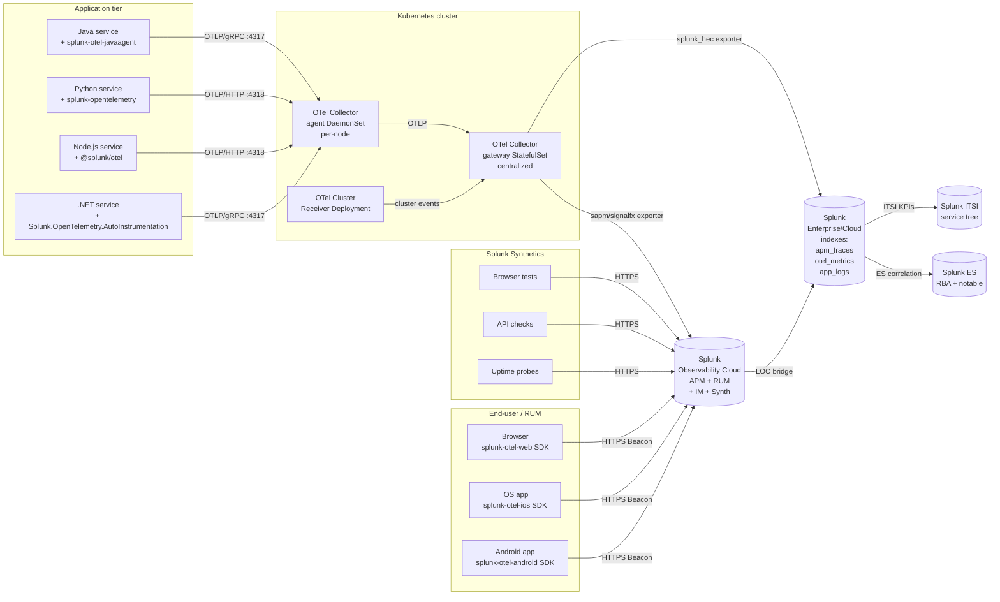

# Splunk Observability Cloud, OpenTelemetry, and SRE Patterns Integration Guide

> The definitive guide to running Splunk Observability Cloud and the
> Splunk Distribution of OpenTelemetry Collector for distributed tracing,
> metrics, RUM, Synthetics, and SRE practices. 21 use cases across cat
> 13.5 covering trace duration outliers, error-rate SLOs, sampling drift,
> trace completeness, OTel collector queue health, RED/USE/golden-signal
> dashboards, error budget burn rate, multi-window/multi-burn alerting,
> end-to-end correlation between APM traces and Splunk Enterprise log
> indexes, AlwaysOn Profiling, Tag Spotlight, and NoSample retention.

---

## Table of Contents

- [Quick Start](#quick-start)
- [Overview](#overview)
- [Architecture and Data Flow](#architecture)
- [Prerequisites](#prerequisites)
- [Splunk Observability Cloud Components](#components)
- [The Splunk Distribution of OpenTelemetry Collector](#otel-collector)
- [Auto-Instrumentation by Language](#instrumentation)
- [OpenTelemetry Semantic Conventions](#semconv)
- [Sampling Strategies](#sampling)
- [Real User Monitoring (RUM)](#rum)
- [Splunk Synthetics](#synthetics)
- [Infrastructure Monitoring (IM)](#infrastructure-monitoring)
- [Log Observer Connect (LOC)](#log-observer-connect)
- [AlwaysOn Profiling](#profiling)
- [Tag Spotlight and NoSample](#tag-spotlight)
- [Splunk-Side Configuration](#splunk-config)
- [The Three Pillars in Splunk](#three-pillars)
- [Field Dictionary](#field-dictionary)
- [Sample Events](#sample-events)
- [SLO and Error Budget Patterns](#slo)
- [The Four Golden Signals (Google SRE)](#golden-signals)
- [RED Method and USE Method](#red-use)
- [Cross-Product Correlation](#cross-product)
- [CIM Mapping Reference](#cim-mapping)
- [Compliance Mapping](#compliance)
- [Capacity Planning and Sizing](#sizing)
- [Recommended Dashboard Layouts](#dashboards)
- [ITSI Service Modeling for SRE](#itsi)
- [SOAR Playbook Examples](#soar)
- [Multi-Region and Multi-Tenant Strategy](#multi-region)
- [Security Hardening](#security-hardening)
- [Crawl / Walk / Run Roadmap](#roadmap)
- [Validation Checklist](#validation-checklist)
- [Known Limitations and Gaps](#known-limitations)
- [Troubleshooting](#troubleshooting)
- [FAQ](#faq)
- [Glossary](#glossary)
- [References](#references)
- [Contribution and Feedback](#contribution)

---

<a id="quick-start"></a>
## Quick Start — 30 Minutes to First Trace

> Goal: a fresh microservice exporting metrics, logs, and a distributed
> trace through the Splunk OpenTelemetry Collector to either Splunk
> Observability Cloud (APM service map within five minutes) or Splunk
> Enterprise (`index=apm_traces`, immediately searchable).

### 1. Install the Splunk OpenTelemetry Collector (one-line installer)

```bash
# Linux (Debian/RHEL/Amazon Linux/SUSE)
curl -sSL https://dl.signalfx.com/splunk-otel-collector.sh > /tmp/splunk-otel.sh
sudo sh /tmp/splunk-otel.sh \
    --realm us1 \
    --access-token <YOUR_O11Y_TOKEN> \
    --mode agent \
    --with-fluentd
```

```powershell
# Windows (PowerShell as Administrator)
& {Set-ExecutionPolicy Bypass -Scope Process -Force; \
   $script = ((New-Object System.Net.WebClient).DownloadString('https://dl.signalfx.com/splunk-otel-collector.ps1')); \
   $params = @{access_token = "<YOUR_O11Y_TOKEN>"; realm = "us1"; mode = "agent"}; \
   Invoke-Command -ScriptBlock ([scriptblock]::Create(". {$script} $(&{$args} @params)"))}
```

For Kubernetes, prefer the Helm chart:

```bash
helm repo add splunk-otel-collector-chart https://signalfx.github.io/splunk-otel-collector-chart
helm repo update
helm install splunk-otel splunk-otel-collector-chart/splunk-otel-collector \
    --set splunkObservability.realm=us1 \
    --set splunkObservability.accessToken=<YOUR_O11Y_TOKEN> \
    --set clusterName=prod-east \
    --set environment=prod \
    --set splunkPlatform.token=<HEC_TOKEN> \
    --set splunkPlatform.endpoint=https://hec.splunk.example.com:8088/services/collector \
    --set splunkPlatform.index=otel \
    --set splunkPlatform.metricsIndex=otel_metrics \
    --namespace splunk-otel --create-namespace
```

This single Helm chart gives you: cluster-receiver (per-cluster
events), agent DaemonSet (per-node host metrics + log tail + OTLP
endpoint), and gateway (StatefulSet for centralized batching, tail
sampling, and dual export to Observability Cloud + Splunk Enterprise).

### 2. Auto-instrument an application (zero code change)

```bash
# Java
curl -L https://github.com/signalfx/splunk-otel-java/releases/latest/download/splunk-otel-javaagent.jar \
    -o /opt/splunk-otel-javaagent.jar
java -javaagent:/opt/splunk-otel-javaagent.jar \
    -Dotel.service.name=checkout-svc \
    -Dotel.resource.attributes=deployment.environment=prod,service.version=1.42.0 \
    -Dotel.exporter.otlp.endpoint=http://localhost:4318 \
    -jar checkout.jar
```

```bash
# Python
pip install splunk-opentelemetry[all]
splunk-py-trace --service-name=checkout-svc \
    --resource-attributes deployment.environment=prod \
    -- python checkout.py
```

```bash
# Node.js
npm install @splunk/otel
node --require @splunk/otel/instrument checkout.js
```

```bash
# .NET
dotnet add package Splunk.OpenTelemetry.AutoInstrumentation
$env:OTEL_SERVICE_NAME="checkout-svc"
$env:OTEL_EXPORTER_OTLP_ENDPOINT="http://localhost:4318"
dotnet run
```

### 3. Verify in Splunk Observability Cloud

Navigate to **Splunk Observability Cloud → APM → Service Map**.
Within 60 seconds your `checkout-svc` should appear with a request
rate, error rate, and p95/p99 latency tile. Click into it for trace
samples (Tag Spotlight). For RUM, drop the browser SDK snippet into
your front-end:

```html
<script src="https://cdn.signalfx.com/o11y-gdi-rum/v0.20.0/splunk-otel-web.js"
        crossorigin="anonymous"></script>
<script>
  SplunkRum.init({
    realm: 'us1',
    rumAccessToken: '<YOUR_RUM_TOKEN>',
    applicationName: 'checkout-frontend',
    deploymentEnvironment: 'prod',
    version: '1.42.0'
  });
</script>
```

### 4. Verify in Splunk Enterprise

```spl
| mstats avg(http.client.request.duration) AS lat_ms WHERE index=otel_metrics service.name="checkout-svc" span=1m
| timechart span=1m max(lat_ms) AS p_max BY service.name
```

```spl
index=apm_traces sourcetype=otel:trace service="checkout-svc" earliest=-15m
| stats count BY service, name, status_code
```

### 5. Activate crawl tier

UC-13.5.1 (Trace duration outliers), UC-13.5.2 (Error-rate SLOs),
UC-13.5.7 (OTel collector queue health), UC-13.5.10 (RED dashboard),
UC-13.5.13 (SLO error budget burn rate), UC-13.5.16 (RUM core web
vitals).

---

<a id="overview"></a>
## Overview

### What this guide covers

Splunk Observability Cloud is Splunk's purpose-built SaaS for the
**three pillars of observability**: metrics, traces, and logs, plus
**Real User Monitoring (RUM)**, **Synthetics**, **Infrastructure
Monitoring (IM)**, and **Log Observer Connect (LOC)** that bridges to
Splunk Enterprise / Splunk Cloud Platform.

This guide covers:

| Domain | Content |
|--------|---------|
| **Distributed tracing** | OpenTelemetry traces; APM service map; tail sampling |
| **Metrics (APM-derived)** | Service-level histograms; RED method counters |
| **Real User Monitoring** | Browser, iOS, Android SDKs; Core Web Vitals |
| **Synthetics** | Browser tests, API checks, uptime probes |
| **Infrastructure Monitoring** | Host, container, Kubernetes, AWS/Azure/GCP |
| **Log Observer Connect** | Bridge to Splunk Enterprise/Cloud log indexes |
| **OpenTelemetry Collector** | Receivers, processors, exporters, queue health |
| **SRE Patterns** | SLOs, error budgets, burn rates, RED, USE, golden signals |

### What's NOT in scope

| Domain | Where to look |
|--------|---------------|
| **Splunk Enterprise platform health** | [Splunk Platform Health Guide](splunk-platform-health.md) |
| **Splunk ITSI service modeling** | [Splunk ITSI Guide](splunk-itsi.md) |
| **AI/LLM observability** | [AI & LLM Observability Guide](ai-llm-observability.md) |
| **Third-party monitoring (Prometheus, Datadog, Dynatrace ingest)** | [Third-Party Monitoring Guide](third-party-monitoring.md) |
| **Application server JMX deep dive** | [Application Servers Guide](application-servers.md) |
| **Kubernetes deep monitoring** | [Kubernetes Guide](kubernetes.md) |

### Why monitor with Splunk Observability Cloud

Without observability:

- Slow APIs blamed on "the network" while a single hot span dominates wall time
- Cold-start P99 spikes after deploys page on-call who cannot tell
  rollouts from regressions
- Front-end Core Web Vitals degrade silently — bounce rate climbs
  before dashboards know
- Tail sampling drops the slow traces the SRE team needed
- Log lines from one transaction live in a different system than the
  trace and metric — root-cause analysis loses minutes per incident

With Splunk Observability Cloud + OpenTelemetry:

| Capability | Outcome |
|---|---|
| **Service map** auto-built from spans | New microservice appears in 60 seconds |
| **Tag Spotlight** — high-cardinality dimensions | Customer-segment slow-path discovered without dashboards |
| **NoSample** trace retention | Every error trace kept; everything else sampled smartly |
| **AlwaysOn Profiling** | CPU/memory hot methods correlated with the request that triggered them |
| **End-to-end MELT correlation** | trace_id binds metric timeseries to logs to spans to RUM session |

### What good looks like

| Dimension | Without integration | With full deployment |
|-----------|---------------------|----------------------|
| New service onboarding | 2-week dashboard project | 30 minutes (auto-instrument + service map) |
| Slow API root cause | "Network team review" → 4h | Dependency tree drilldown → 5 min |
| Frontend regression | User complaint | Real-time RUM Core Web Vitals alert |
| SLO breach | Postmortem next quarter | Multi-window burn-rate page within 5 min |
| Error trace lost to sampling | "Cannot reproduce" | NoSample keeps every error trace |

---

<a id="architecture"></a>
## Architecture and Data Flow



### Architectural model

| Component | Role | Where it runs |
|---|---|---|
| **Auto-instrumentation agents** | Capture spans, metrics, logs from the runtime | Inside the application process |
| **OTel Collector — agent** | Receive OTLP from local apps, scrape host metrics, tail logs | DaemonSet (one per node) |
| **OTel Collector — gateway** | Centralized batching, tail sampling, fan-out to backends | StatefulSet (HA pair) |
| **OTel Cluster Receiver** | Kubernetes-cluster-level events (deployments, pods) | Single Deployment |
| **Splunk Observability Cloud** | APM, RUM, Synthetics, IM SaaS backend | SaaS |
| **Splunk Enterprise / Cloud** | Long-term log retention, ES correlation, ITSI services | Self-managed or Splunk Cloud |
| **Log Observer Connect (LOC)** | Federated log search from O11y → Splunk | Splunk Cloud Platform |

### Why dual export

The recommended pattern is to **dual export** from the gateway: APM
and metrics to Splunk Observability Cloud (real-time SaaS for service
map, Tag Spotlight, AlwaysOn Profiling), and a configurable subset
(error traces, slow traces, all logs) to Splunk Enterprise / Cloud
for long-term retention, ES correlation searches, and ITSI service
modeling. The gateway uses the `splunk_hec` exporter for the latter
and the `sapm` (now deprecated `signalfx`) or OTLP exporter for the
former.

---

<a id="prerequisites"></a>
## Prerequisites

### Splunk Observability Cloud

| Item | Notes |
|---|---|
| **Realm** | `us0`, `us1`, `us2`, `eu0`, `jp0`, `au0` — pick closest to your apps |
| **Org token** | Provisioned by Org Admin under Settings → Access Tokens |
| **RUM access token** | Separate scope (`rum_token`) — never expose your full org token to browsers |
| **Ingest token** | For OTel Collector → SaaS path |
| **Plan tier** | Trace volume sized in spans/sec; metric MTS (metric time series) |

### Splunk Enterprise / Cloud (for dual export and LOC)

| Item | Notes |
|---|---|
| **Splunk version** | 9.0+ (recommended 9.4 for Edge Processor and Federated Search) |
| **HEC tokens** | Per-purpose (traces, metrics, logs); allow indexers `apm_traces`, `otel_metrics`, `otel`, `apm_platform` |
| **Indexes** | Events index for traces; metric index for metrics; events index for collector logs |
| **Splunk_TA_otel** | Optional add-on for sourcetype mapping in Splunk Enterprise |

### OpenTelemetry Collector — minimum version

| Component | Min version | Recommended |
|---|---|---|
| Splunk Distribution | 0.110 | 0.115+ (Sep 2025+) |
| Helm chart | 0.108 | 0.115+ |
| Java agent | 2.0 | 2.7+ |
| .NET instrumentation | 1.7 | 1.10+ |
| Python | 1.20 | 2.0+ |
| JS Node | 2.0 | 2.5+ |
| Go | 1.18 | 1.20+ |

### Network requirements

| Direction | Port/Protocol | Notes |
|---|---|---|
| App → Collector agent | 4317/TCP (gRPC), 4318/TCP (HTTP) | OTLP, localhost preferred |
| Agent → Gateway | 4317/TCP | gRPC inside cluster |
| Gateway → O11y SaaS | 443/TCP | `https://ingest.<realm>.signalfx.com` |
| Gateway → Splunk HEC | 8088/TCP HTTPS | HTTP Event Collector |
| Browser → O11y RUM | 443/TCP | `https://rum-ingest.<realm>.signalfx.com` |
| Synthetics agents → tested endpoint | 443/TCP, 80/TCP | Outbound from Splunk runner pool or self-hosted runner |

---

<a id="components"></a>
## Splunk Observability Cloud Components

### APM (Application Performance Monitoring)

OpenTelemetry-native distributed tracing. Service map is auto-built
from span resource attributes. Key concepts:

- **Service** — derived from `service.name` resource attribute
- **Operation / span name** — `name` attribute on each span
- **Tag Spotlight** — automatic high-cardinality dimension analysis
- **NoSample** — every error trace and every slow trace retained;
  representative sample of normal traces kept
- **Tail-based sampling** — done at the collector gateway, then
  Observability Cloud applies further server-side rules

### Real User Monitoring (RUM)

Browser, iOS, and Android SDKs collect:

- Page load timings, navigation, fetch/XHR durations
- **Core Web Vitals** — LCP (Largest Contentful Paint), INP (Interaction
  to Next Paint), CLS (Cumulative Layout Shift)
- JavaScript errors with stack traces
- Session and user-aware traces (linked to APM spans via traceparent
  header propagation)

### Synthetics

Three product lines:

| Product | Use |
|---|---|
| **Browser tests** | Real-Chrome scripted user journeys (login, checkout) |
| **API checks** | HTTP/HTTPS endpoint correctness + latency |
| **Uptime tests** | Simple HTTPS GET / TCP / ICMP probes |

Tests run from Splunk's globally distributed pool or your own private
locations.

### Infrastructure Monitoring (IM)

Native receivers for: AWS (CloudWatch + Cost), Azure Monitor, GCP
Stackdriver, Kubernetes, Docker, host metrics (CPU, memory, disk,
network), Prometheus scrape, Nagios checks, StatsD. Plus 200+
integrations via the Smart Agent's monitor library (now in OTel
Collector receiver form).

### Log Observer Connect (LOC)

Federated log search: from Splunk Observability Cloud, query indexes
in your Splunk Cloud Platform tenant directly. Pivot from a slow
APM trace to its logs in two clicks. **No dual ingest** — logs stay
in Splunk Cloud, queries proxy through.

### Network Explorer

eBPF-based per-connection visibility for Kubernetes — every TCP/UDP
flow within the cluster, plus inbound/outbound. Useful for spotting
service mesh misconfigurations and "where does my service actually
talk to" questions.

### Splunk On-Call (formerly VictorOps)

Incident routing, escalation, and on-call schedules. Bidirectional
with Splunk Observability Cloud detectors and Splunk Enterprise
Security notable events.

---

<a id="otel-collector"></a>
## The Splunk Distribution of OpenTelemetry Collector

### Three deployment modes

| Mode | Use case | Where it runs |
|---|---|---|
| **agent** | Per-host or per-node receiver | Linux/Windows host, K8s DaemonSet |
| **gateway** | Centralized batching/sampling/fan-out | StatefulSet, dedicated VMs |
| **dual-mode** | Single instance is both | Small clusters, dev |

### Pipeline anatomy

```yaml
# /etc/otel/config.yaml — gateway example
extensions:
  health_check: {endpoint: 0.0.0.0:13133}
  pprof: {endpoint: 0.0.0.0:1777}
  zpages: {endpoint: 0.0.0.0:55679}
  memory_ballast:
    size_mib: 1024

receivers:
  otlp:
    protocols:
      grpc: {endpoint: 0.0.0.0:4317}
      http: {endpoint: 0.0.0.0:4318}
  prometheus:
    config:
      scrape_configs:
        - job_name: 'kubelet'
          scrape_interval: 30s
          static_configs:
            - targets: ['localhost:10250']

processors:
  memory_limiter:
    check_interval: 2s
    limit_mib: 4096
    spike_limit_mib: 512
  batch:
    send_batch_size: 8192
    send_batch_max_size: 16384
    timeout: 5s
  resourcedetection:
    detectors: [env, system, ec2, eks, k8s_node]
  attributes/redact:
    actions:
      - key: http.request.header.authorization
        action: delete
      - key: db.statement
        action: hash
  tail_sampling:
    decision_wait: 30s
    num_traces: 100000
    expected_new_traces_per_sec: 10000
    policies:
      - name: errors-policy
        type: status_code
        status_code: {status_codes: [ERROR]}
      - name: latency-policy
        type: latency
        latency: {threshold_ms: 1500}
      - name: rate-policy
        type: probabilistic
        probabilistic: {sampling_percentage: 5}
      - name: tier0-policy
        type: string_attribute
        string_attribute:
          key: deployment.tier
          values: [tier-0]

exporters:
  otlphttp/o11y:
    endpoint: https://ingest.us1.signalfx.com/v2/trace/otlp
    headers:
      "X-SF-Token": "${env:SPLUNK_OBSERVABILITY_ACCESS_TOKEN}"
    sending_queue: {enabled: true, num_consumers: 10, queue_size: 5000}
    retry_on_failure: {enabled: true, initial_interval: 1s, max_interval: 30s}
  splunk_hec/traces:
    token: "${env:SPLUNK_HEC_TOKEN}"
    endpoint: https://hec.splunk.example.com:8088/services/collector
    source: otel
    sourcetype: otel:trace
    index: apm_traces
    tls: {insecure_skip_verify: false}
  splunk_hec/metrics:
    token: "${env:SPLUNK_HEC_TOKEN}"
    endpoint: https://hec.splunk.example.com:8088/services/collector
    source: otel
    index: otel_metrics

service:
  extensions: [health_check, memory_ballast, pprof, zpages]
  pipelines:
    traces:
      receivers: [otlp]
      processors: [memory_limiter, resourcedetection, attributes/redact, tail_sampling, batch]
      exporters: [otlphttp/o11y, splunk_hec/traces]
    metrics:
      receivers: [otlp, prometheus]
      processors: [memory_limiter, resourcedetection, batch]
      exporters: [otlphttp/o11y, splunk_hec/metrics]
    logs:
      receivers: [otlp]
      processors: [memory_limiter, resourcedetection, attributes/redact, batch]
      exporters: [splunk_hec/metrics]
```

### Critical processor patterns

| Processor | Use |
|---|---|
| **memory_limiter** | First processor; refuses new data when memory >limit_mib |
| **batch** | Always present; tune `send_batch_size` to backend acceptance |
| **resourcedetection** | Adds host/cloud/k8s context for free |
| **attributes** | Redact PII, hash secrets, drop noisy headers |
| **tail_sampling** | Smart sampling — keep all errors, all slow traces, % of normal |
| **k8sattributes** | Enrich with pod/namespace/deployment metadata |
| **transform** | Generic OTTL transforms — change types, derive fields |
| **filter** | Drop spans/metrics/logs matching predicate |

### Health endpoints

| Endpoint | Purpose |
|---|---|
| `:13133/` | health_check — for K8s liveness probe |
| `:1777/debug/pprof/` | Go runtime profiling — CPU, heap, goroutines |
| `:55679/debug/tracez` | zpages — recent traces processed by collector |
| `:8888/metrics` | Collector's own internal Prometheus metrics |

### Internal collector metrics to watch

| Metric | Meaning | Critical threshold |
|---|---|---|
| `otelcol_processor_dropped_spans` | Spans dropped before export | > 0 sustained → resize |
| `otelcol_exporter_send_failed_spans` | Backend rejection | > 0 sustained → backend issue |
| `otelcol_exporter_queue_size` | Queue depth | > 80% queue_size → backpressure |
| `otelcol_processor_refused_spans` | memory_limiter activation | > 0 → resize collector |
| `otelcol_processor_tail_sampling_count_traces_sampled` | Sampled vs total | Watch ratio drift |
| `otelcol_process_uptime` | Restart detection | Drops to 0 → crash |

UC-13.5.7 (OTel Collector queue health) wraps these into a single
saved search.

---

<a id="instrumentation"></a>
## Auto-Instrumentation by Language

### Java — splunk-otel-java

**Best path: javaagent.** Drop-in `-javaagent:splunk-otel-javaagent.jar`
captures all major frameworks: Spring Boot, Tomcat, JBoss, Jetty,
Netty, Akka, JDBC, Apache HttpClient, OkHttp, Kafka, RabbitMQ, gRPC,
HikariCP, Cassandra, MongoDB, Elasticsearch, Lettuce/Jedis, AWS SDK,
gRPC, Vertx, Reactor.

```bash
# Recommended environment variables
export OTEL_SERVICE_NAME=checkout-svc
export OTEL_RESOURCE_ATTRIBUTES=deployment.environment=prod,service.version=1.42.0
export OTEL_EXPORTER_OTLP_ENDPOINT=http://localhost:4318
export OTEL_LOGS_EXPORTER=otlp                  # send logs as OTLP too
export SPLUNK_PROFILER_ENABLED=true             # AlwaysOn Profiling
export SPLUNK_METRICS_ENABLED=true              # micrometer/JMX → OTel metrics
java -javaagent:splunk-otel-javaagent.jar -jar checkout.jar
```

Spring Boot Starter alternative (compile-time):

```gradle
dependencies {
    implementation 'com.splunk.public:splunk-opentelemetry-javaagent:2.7.0'
}
```

### .NET — Splunk.OpenTelemetry.AutoInstrumentation

```bash
# Linux
dotnet add package Splunk.OpenTelemetry.AutoInstrumentation
export OTEL_SERVICE_NAME=checkout-svc
export OTEL_EXPORTER_OTLP_ENDPOINT=http://localhost:4318
export CORECLR_ENABLE_PROFILING=1
export CORECLR_PROFILER={918728DD-259F-4A6A-AC2B-B85E1B658318}
export CORECLR_PROFILER_PATH=$HOME/.nuget/packages/splunk.opentelemetry.autoinstrumentation/.../OpenTelemetry.AutoInstrumentation.Native.so
dotnet run
```

```powershell
# Windows installer
Invoke-WebRequest -Uri "https://github.com/signalfx/splunk-otel-dotnet/releases/latest/download/splunk-otel-dotnet-install.ps1" -OutFile splunk-otel-dotnet-install.ps1
.\splunk-otel-dotnet-install.ps1
```

Captured: ASP.NET Core, ASP.NET Framework, HttpClient, gRPC client &
server, SqlClient, MySql.Data, Npgsql, MongoDB.Driver, StackExchange.Redis,
RabbitMQ.Client, AWSSDK, Azure SDK, Quartz, MassTransit, Elasticsearch.Net.

### Node.js — @splunk/otel

```bash
npm install @splunk/otel
node --require @splunk/otel/instrument app.js
```

```javascript
// programmatic init (alternative)
const {start} = require('@splunk/otel');
start({
  serviceName: 'checkout-svc',
  endpoint: 'http://localhost:4318',
  metrics: {enabled: true},
  profiling: {enabled: true},
});
```

Captured: Express, Fastify, Koa, NestJS, http, https, fetch, gRPC,
mysql, mysql2, pg, mongodb, redis, ioredis, kafkajs, amqplib, aws-sdk,
azure-sdk.

### Python — splunk-opentelemetry

```bash
pip install splunk-opentelemetry[all]
splunk-py-trace --service-name=checkout-svc -- python checkout.py
```

```bash
# alternative: explicit
opentelemetry-instrument \
    --service_name=checkout-svc \
    --exporter_otlp_endpoint=http://localhost:4318 \
    python checkout.py
```

Captured: Django, Flask, FastAPI, Starlette, requests, urllib3,
psycopg2, pymongo, pymysql, redis, kafka-python, pika, boto3,
SQLAlchemy, Celery, gRPC, asyncpg.

### Go — splunk-otel-go

Go is **explicit** — no auto-instrumentation; you import packages:

```go
import (
    "github.com/signalfx/splunk-otel-go/distro"
)

func main() {
    sdk, err := distro.Run()
    if err != nil { log.Fatal(err) }
    defer sdk.Shutdown(context.Background())
    // ... your app
}
```

For HTTP, use `otelhttp` middleware; for gRPC, `otelgrpc` interceptors;
for Postgres, `otelpgx`. Splunk's distro provides sane defaults
(splunk-friendly resource attributes, OTLP exporters preconfigured).

### Ruby — splunk-otel-ruby

```ruby
# Gemfile
gem 'splunk-otel'

# config/initializers/splunk_otel.rb (Rails)
require 'splunk/otel'
Splunk::Otel.configure
```

### PHP

PHP auto-instrumentation is community-maintained via `open-telemetry/opentelemetry-auto-*`
packages. Splunk does not ship a packaged distro for PHP today.

### Mobile (iOS, Android, React Native)

```swift
// iOS - AppDelegate.swift
import SplunkOtel
SplunkRum.initialize(beaconUrl: URL(string: "https://rum-ingest.us1.signalfx.com/v1/rum")!,
                     rumAuth: "<RUM_TOKEN>",
                     options: SplunkRumOptions(applicationName: "checkout-ios",
                                               environment: "prod"))
```

```kotlin
// Android - Application.onCreate()
SplunkRum.builder()
    .setApplicationName("checkout-android")
    .setRumAccessToken("<RUM_TOKEN>")
    .setBeaconEndpoint("https://rum-ingest.us1.signalfx.com")
    .setDeploymentEnvironment("prod")
    .build(this)
```

### Browser (RUM Web)

```html
<script src="https://cdn.signalfx.com/o11y-gdi-rum/v0.20.0/splunk-otel-web.js"
        crossorigin="anonymous"></script>
<script src="https://cdn.signalfx.com/o11y-gdi-rum/v0.20.0/splunk-otel-web-session-recorder.js"
        crossorigin="anonymous"></script>
<script>
  SplunkRum.init({
    realm: 'us1',
    rumAccessToken: '<RUM_TOKEN>',
    applicationName: 'checkout-web',
    deploymentEnvironment: 'prod',
    version: '1.42.0',
    instrumentations: {
      websocket: true,
      visibility: true,
      socketio: true
    }
  });
  SplunkSessionRecorder.init({
    realm: 'us1',
    rumAccessToken: '<RUM_TOKEN>',
  });
</script>
```

---

<a id="semconv"></a>
## OpenTelemetry Semantic Conventions

OpenTelemetry **semantic conventions** standardize attribute names so
backends and dashboards work across vendors. The 1.x→2.x convention
migration in 2024-2025 changed many names — Splunk Observability Cloud
accepts both old and new (auto-mapped server-side).

### Resource attributes (set once per service)

| Attribute | Example | Purpose |
|---|---|---|
| `service.name` | `checkout-svc` | Primary service identity |
| `service.namespace` | `payments` | Logical grouping |
| `service.version` | `1.42.0` | Deploy correlation |
| `service.instance.id` | UUID | Per-pod / per-process unique |
| `deployment.environment` | `prod` / `staging` / `dev` | Env split |
| `host.name` | `pod-checkout-7d8` | K8s pod or hostname |
| `k8s.cluster.name` | `prod-east-1` | Multi-cluster routing |
| `k8s.namespace.name` | `payments` | K8s namespace |
| `k8s.pod.name` | `checkout-7d8c4-xz4pq` | Per-pod context |
| `cloud.provider` | `aws` / `azure` / `gcp` | Cloud-specific dashboards |
| `cloud.region` | `us-east-1` | Regional split |

### Span attributes (per-operation)

| Attribute | Example | Use |
|---|---|---|
| `http.request.method` | `POST` | HTTP server/client spans |
| `http.response.status_code` | `503` | HTTP outcome |
| `http.route` | `/api/v2/checkout/{id}` | Templated route, not URL |
| `http.client.request.duration` | `1247.3` (ms) | Latency histogram |
| `db.system` | `postgresql` | Database semantic |
| `db.statement` | (sanitized) | Query — **mind PII** |
| `messaging.system` | `kafka` | Async messaging |
| `messaging.destination.name` | `orders.created` | Topic / queue |
| `rpc.system` | `grpc` | RPC semantic |
| `error.type` | `java.lang.NullPointerException` | Exception class |

### Span kinds

| Kind | Meaning |
|---|---|
| **CLIENT** | Outbound call (DB query, HTTP request out, RPC call) |
| **SERVER** | Inbound call (HTTP request received, RPC handler) |
| **PRODUCER** | Async send (Kafka producer, queue publish) |
| **CONSUMER** | Async receive (Kafka consumer, queue subscriber) |
| **INTERNAL** | In-process work (batch processing, cache lookup) |

### Status codes

| Code | Use |
|---|---|
| `UNSET` | Default — no explicit status set |
| `OK` | Explicitly successful |
| `ERROR` | Failed — paired with status_message |

The `error.type` and `exception.*` attributes carry exception details.
APM error rate computations look for `status.code = ERROR`.

---

<a id="sampling"></a>
## Sampling Strategies

Distributed tracing produces enormous volumes — 100% retention is
expensive and rarely useful. Splunk recommends **NoSample** at
the SaaS layer (every error, every slow trace, plus probabilistic
sample of normal traces) and **tail-based sampling at the gateway**
for cost control.

### Head-based sampling (avoid except for cost control)

Decision made by the SDK at trace start:

```bash
export OTEL_TRACES_SAMPLER=traceidratio
export OTEL_TRACES_SAMPLER_ARG=0.10  # 10%
```

Problem: drops the slow trace before you know it was slow.

### Tail-based sampling (recommended)

Decision made by the gateway after the entire trace completes
(typically 30s decision window):

```yaml
processors:
  tail_sampling:
    decision_wait: 30s
    num_traces: 100000
    policies:
      - name: errors      # ALL errors retained
        type: status_code
        status_code: {status_codes: [ERROR]}
      - name: slow         # ALL traces > 1.5s retained
        type: latency
        latency: {threshold_ms: 1500}
      - name: rate         # 5% sample of normal traces
        type: probabilistic
        probabilistic: {sampling_percentage: 5}
      - name: tier0        # 100% of tier-0 traffic
        type: string_attribute
        string_attribute: {key: deployment.tier, values: [tier-0]}
```

### NoSample mode (Splunk Observability Cloud SaaS)

When you ingest 100% of spans into Observability Cloud, NoSample
guarantees you never lose an error trace or a slow trace. Background
"normal" traces are sampled by default for storage efficiency, but
the slow/error tail is always preserved. **Required for AlwaysOn
Profiling correlation** since profiling needs the full call context.

### Sampling drift detection

UC-13.5.4 (Trace completeness) detects:

- Sudden drops in trace volume (collector dropping)
- Skewed sampling ratios (probabilistic policy producing too few)
- Orphan spans (parent collector lost the trace before tail decision)

---

<a id="rum"></a>
## Real User Monitoring (RUM)

### Browser RUM — what is captured

| Signal | Source |
|---|---|
| **Page load** | navigation timing API (TTFB, FCP, LCP) |
| **Core Web Vitals** | LCP, INP, CLS — Google ranking signals |
| **Long tasks** | Performance Observer ≥50ms tasks |
| **Resource timing** | Each fetch/XHR/image/css/js with timings |
| **JavaScript errors** | `window.onerror` + unhandledrejection with stack |
| **User interactions** | Click, scroll, input timing |
| **Session replay** | Optional via session-recorder package |

### Mobile RUM (iOS / Android / React Native)

| Signal | Captured |
|---|---|
| App launches (cold/warm/hot) | Yes |
| ANRs (Application Not Responding, Android) | Yes |
| Crashes with symbolicated stack | Yes |
| Network requests via URLSession / OkHttp | Yes |
| Custom events / spans | Yes |

### RUM-to-APM correlation

When the browser SDK calls your backend, it propagates `traceparent`
header → backend continues the trace. Splunk Observability Cloud
links the RUM session to the APM trace; one click pivots from
"slow page load" to "slow database query".

### RUM data in Splunk Enterprise

Optional: Observability Cloud can re-export RUM events to a Splunk
Enterprise index via Log Observer Connect or HEC bridge:

```spl
index=rum sourcetype=splunk:rum:web
| stats count BY page_url, browser.name
| sort -count
```

---

<a id="synthetics"></a>
## Splunk Synthetics

### Browser tests

Real-Chrome scripted user journeys. Created via **WebDriver** /
**Selenium IDE** export, or written directly in JavaScript:

```javascript
// Synthetics browser test
const { browser, $, By } = require('@splunk/synthetics');

await browser.get('https://shop.example.com/login');
await $('#email').type('test@example.com');
await $('#password').type(process.env.TEST_PASSWORD);
await $('#submit').click();
await browser.wait(until.elementLocated(By.id('dashboard')), 5000);
```

Output: timing per step, screenshot per step, full waterfall, hint
about failed assertion. Each run produces a synthetic trace stitched
to your APM if the headers propagate.

### API checks

```yaml
# Synthetics API check definition
name: checkout-api-health
url: https://api.example.com/v1/health
method: GET
headers:
  Authorization: Bearer ${env:HEALTH_TOKEN}
assertions:
  - source: status_code
    operator: equals
    target: 200
  - source: response_time
    operator: less_than
    target: 1500
  - source: response_body
    operator: contains
    target: "\"status\":\"healthy\""
locations: [aws-us-east-1, aws-eu-west-1, gcp-asia-southeast1]
frequency_minutes: 5
```

### Uptime tests

Simple HTTPS GET / TCP / ICMP probes from many global locations.
Useful for "is my site up from Sydney right now?" answers.

### Private locations

Run synthetic tests from inside your own network for internal apps
or private API endpoints.

```bash
# private location agent (Docker)
docker run -d --name splunk-synth-agent \
    -e ACCESS_TOKEN=<TOKEN> \
    -e LOCATION_NAME=corp-dc-east \
    -e REALM=us1 \
    quay.io/signalfx/splunk-synthetics-agent:latest
```

---

<a id="infrastructure-monitoring"></a>
## Infrastructure Monitoring (IM)

### Out-of-the-box receivers (in Splunk OTel Collector)

| Receiver | Captures |
|---|---|
| `hostmetrics` | CPU, memory, disk, network, filesystem |
| `kubeletstats` | Kubernetes pod/container metrics from kubelet |
| `k8s_cluster` | K8s cluster events (deployments, pods, services) |
| `prometheus` | Scrape any Prometheus exporter |
| `signalfx` | Smart Agent monitor library — 200+ integrations |
| `awscontainerinsightreceiver` | AWS ECS/EKS Container Insights |
| `awsecscontainermetrics` | ECS task-level metrics |
| `aws_firehose` | AWS Kinesis Firehose receiver |
| `azureeventhub` | Azure Event Hubs receiver |
| `googlecloudpubsub` | GCP Pub/Sub receiver |
| `mongodb` | MongoDB server stats |
| `mysql` | MySQL server stats |
| `postgresql` | PostgreSQL server stats |
| `redis` | Redis info stats |
| `nginx` | NGINX status page scrape |
| `apache` | Apache HTTPD mod_status scrape |
| `iis` | IIS performance counters |
| `oracledb` | Oracle DB metrics (via OracleDB) |

### Cloud integrations (managed by SaaS, no collector needed)

In Splunk Observability Cloud → Integrations:

| Provider | Captured |
|---|---|
| **AWS** | CloudWatch metrics, AWS Cost & Usage Report, CloudTrail correlation |
| **Azure** | Azure Monitor metrics, Activity Log, Cost Management |
| **GCP** | Stackdriver metrics, Asset Inventory, Billing |

These pull metrics directly via cloud APIs — no collector needed,
no agent installation in the customer cloud account beyond an IAM
role.

### Kubernetes monitoring

Out of the box from the OTel Collector Helm chart:

- Per-pod CPU, memory, network, restarts, ready/not-ready states
- Per-container exit codes, OOM kills, throttling
- Cluster events (Pod Pending, Failed, Killed, BackOff)
- HPA scaling activity, PDB violations
- PVC usage, capacity, mount status
- Node conditions (Ready, MemoryPressure, DiskPressure, PIDPressure)

---

<a id="log-observer-connect"></a>
## Log Observer Connect (LOC)

LOC bridges Splunk Cloud Platform indexes into Splunk Observability
Cloud — **federated query, no dual ingest**.

### Setup

1. **Splunk Cloud Platform**: Settings → Tokens → Create token with
   `search` capability scoped to indexes you want exposed.
2. **Splunk Observability Cloud**: Data Setup → Log Observer
   Connect → New Connection → paste Splunk Cloud URL + token.
3. Link a service: in APM, edit a service, add LOC connection, set
   index filter (e.g., `index=app_logs sourcetype=spring-boot`).

### How it appears in O11y

When you view an APM trace, LOC fetches matching log events from
the linked Splunk Cloud index using `trace_id` as the filter:

```
| index=app_logs sourcetype=spring-boot trace_id="6a8b3c..."
| sort _time
```

You see them inline in the trace waterfall. Click into the line, jump
into Splunk Cloud Search for full context.

### Field requirements

For LOC to correlate, your application logs must include `trace_id`
and `span_id`. The OTel SDKs inject these into MDC / log context
automatically when log instrumentation is enabled. For Spring Boot
+ Logback:

```xml
<encoder class="ch.qos.logback.classic.encoder.PatternLayoutEncoder">
  <pattern>%d{ISO8601} %-5level [%X{trace_id:-},%X{span_id:-}] %logger{36} - %msg%n</pattern>
</encoder>
```

---

<a id="profiling"></a>
## AlwaysOn Profiling

Splunk's continuous profiling. Captures CPU and memory profiles
**always**, with negligible overhead (typically < 1% CPU). Correlates
profile samples with APM spans via trace_id, so you can answer:

> "What method was hot when this slow request was running?"

### Enable per language

| Language | Flag |
|---|---|
| **Java** | `-Dsplunk.profiler.enabled=true -Dsplunk.profiler.memory.enabled=true` |
| **.NET** | `SPLUNK_PROFILER_ENABLED=true` |
| **Python** | `splunk-py-trace --profile-cpu` |
| **Node.js** | `start({ profiling: { enabled: true } })` |
| **Go** | `distro.Run(distro.WithProfiler())` |

### Where it shows up

Splunk Observability Cloud → APM → service → Profiling tab. Flame
graphs by:

- Function (top-down or bottom-up)
- Trace (only profile samples that overlap with this trace)
- Endpoint (only profile samples on /api/checkout)
- Time slice (last 30 minutes for this pod)

Used heavily during incident triage to pinpoint the hot method
without relying on lucky JFR captures.

---

<a id="tag-spotlight"></a>
## Tag Spotlight and NoSample

### Tag Spotlight

Automatically detects high-cardinality dimensions in your traces
(e.g., customer_id, plan_tier, region, browser) and surfaces the
ones with strongly anomalous P95/error rate vs the baseline.

Example: a 5% error spike on /api/checkout → Tag Spotlight reveals
`payment.provider=stripe` accounts for 95% of the errors. You did
not have to build a dashboard.

### NoSample™

Splunk's tail-sampling brand. Always retains:

- Every trace with `status.code = ERROR`
- Every trace exceeding service-specific latency thresholds
- Configured tier-0 traces (high-priority routes)

Plus a representative sample of normal traffic for baselines.

This means **the trace your incident depends on is always there** —
you are not gambling on probabilistic sampling.

---

<a id="splunk-config"></a>
## Splunk-Side Configuration (For Dual-Export Setups)

### Index recipes (`indexes.conf`)

```ini
[apm_traces]
homePath   = $SPLUNK_DB/apm_traces/db
coldPath   = $SPLUNK_DB/apm_traces/colddb
thawedPath = $SPLUNK_DB/apm_traces/thaweddb
maxDataSizeMB = 10000
maxHotBuckets = 10
maxWarmDBCount = 300
frozenTimePeriodInSecs = 2592000        # 30d hot/warm
maxTotalDataSizeMB = 1500000

[otel_metrics]
datatype = metric
homePath   = $SPLUNK_DB/otel_metrics/db
coldPath   = $SPLUNK_DB/otel_metrics/colddb
thawedPath = $SPLUNK_DB/otel_metrics/thaweddb
maxDataSizeMB = 5000
frozenTimePeriodInSecs = 7776000        # 90d
metric.maxHotBuckets = 5

[apm_platform]
# OTel collector logs, internal metrics
homePath   = $SPLUNK_DB/apm_platform/db
coldPath   = $SPLUNK_DB/apm_platform/colddb
thawedPath = $SPLUNK_DB/apm_platform/thaweddb
maxDataSizeMB = 2000
frozenTimePeriodInSecs = 1209600        # 14d

[rum]
homePath   = $SPLUNK_DB/rum/db
coldPath   = $SPLUNK_DB/rum/colddb
thawedPath = $SPLUNK_DB/rum/thaweddb
maxDataSizeMB = 5000
frozenTimePeriodInSecs = 2592000        # 30d
```

### `props.conf` — sourcetype mapping for OTLP

```ini
[otel:trace]
KV_MODE = json
TIMESTAMP_FIELDS = startTimeUnixNano
TIME_FORMAT = %s%9N
SHOULD_LINEMERGE = false
LINE_BREAKER = ([\r\n]+)\{
TRUNCATE = 0
disabled = false

[otel:metrics]
KV_MODE = json
TIMESTAMP_FIELDS = timeUnixNano
TIME_FORMAT = %s%9N
SHOULD_LINEMERGE = false

[otel:logs]
KV_MODE = json
TIMESTAMP_FIELDS = observedTimeUnixNano,timeUnixNano
TIME_FORMAT = %s%9N
SHOULD_LINEMERGE = false

[otel:collector:log]
SHOULD_LINEMERGE = false
TIME_FORMAT = %Y-%m-%dT%H:%M:%S.%9N%Z
```

### HEC token configuration (`inputs.conf` on indexer or HEC server)

```ini
[http]
disabled = 0
port = 8088
enableSSL = 1
sslPassword = <encrypted>
serverCert = $SPLUNK_HOME/etc/auth/server.pem
maxThreads = 0
maxSockets = 0
useDeploymentServer = 0
ackIdleCleanup = 1
useACK = 1                          # for at-least-once durability

[http://otel-traces-token]
token = <generated UUID>
disabled = 0
indexes = apm_traces, apm_platform
sourcetype = otel:trace
index = apm_traces
useACK = 1

[http://otel-metrics-token]
token = <generated UUID>
disabled = 0
indexes = otel_metrics
sourcetype = otel:metrics
index = otel_metrics
useACK = 1
```

### Macros (recommended)

```ini
# macros.conf
[apm_traces_idx]
definition = (index=apm_traces OR index=apm)

[apm_platform_idx]
definition = (index=apm_platform OR index=otel)

[otel_metrics_idx]
definition = (index=otel_metrics OR index=metrics)
```

Then your saved searches reference `\`apm_traces_idx\`` etc., so
multi-tenant deployments can override index names without rewriting
queries.

---

<a id="three-pillars"></a>
## The Three Pillars in Splunk

| Pillar | Where it lives | SPL example |
|---|---|---|
| **Metrics** | `index=otel_metrics` (datatype=metric) | `\| mstats avg(http.client.request.duration) WHERE service.name=...` |
| **Traces** | `index=apm_traces sourcetype=otel:trace` | `... \| stats count BY service, status_code` |
| **Logs** | `index=app_logs` (your existing log index) with `trace_id` field | `... trace_id="$trace$" \| sort _time` |

### Pivot pattern

You start in **metrics** (a dashboard panel shows P99 spike) → click
into **traces** (find a slow trace) → click into **logs** (full
context for that trace_id) → in Splunk Enterprise → ES correlation
search may have flagged it as a notable.

This pivot is what observability is **for**. Without it, you context-
switch between three tools and lose minutes per incident.

### Linking metrics → traces

Splunk's metric exemplar feature: an OTel metric histogram bucket can
carry exemplar trace_ids:

```yaml
processors:
  metricstransform:
    transforms:
      - include: http.client.request.duration
        action: include
        match_type: strict
        new_name: http.client.request.duration.with_exemplars
        operations:
          - action: experimental_scale_value
            scale: 1.0
```

Click on the timechart spike → exemplar trace_id → drill into the
trace.

### Linking traces → logs

Required: log instrumentation injects `trace_id` and `span_id` into
every log event from that runtime. Then a single search:

```spl
index=app_logs trace_id="6a8b3c..." | sort _time
```

Or via Log Observer Connect from the APM UI — one click.

---

<a id="field-dictionary"></a>
## Field Dictionary

| Field | Type | Source | Notes |
|---|---|---|---|
| `_time` | epoch | All | Auto-extracted |
| `service.name` | string | All spans, metrics, logs | Resource attribute |
| `service.namespace` | string | Resource | Logical grouping |
| `service.version` | string | Resource | Deploy version |
| `deployment.environment` | string | Resource | prod/staging/dev |
| `host.name` | string | Resource | Pod name or hostname |
| `k8s.cluster.name` | string | Resource | Multi-cluster |
| `k8s.namespace.name` | string | Resource | K8s namespace |
| `k8s.pod.name` | string | Resource | Pod name |
| `cloud.provider` | string | Resource | aws/azure/gcp |
| `cloud.region` | string | Resource | Region |
| `trace_id` | hex | spans, logs | 16-byte hex (W3C trace context) |
| `span_id` | hex | spans, logs | 8-byte hex |
| `parent_span_id` | hex | spans | Parent span |
| `name` | string | spans | Operation name |
| `kind` | enum | spans | CLIENT/SERVER/PRODUCER/CONSUMER/INTERNAL |
| `status_code` | enum | spans | OK / ERROR / UNSET |
| `status_message` | string | spans | If status_code=ERROR |
| `duration_ms` | number | spans (computed) | duration_nanos / 1_000_000 |
| `http.request.method` | string | HTTP spans | GET, POST, etc. |
| `http.response.status_code` | int | HTTP spans | 200, 404, 503 |
| `http.route` | string | HTTP server spans | Templated route |
| `http.url` | URL | HTTP client spans | Full URL |
| `db.system` | string | DB spans | postgresql, mysql, mongodb |
| `db.statement` | string | DB spans | Sanitized query |
| `messaging.system` | string | messaging spans | kafka, rabbitmq |
| `error.type` | string | error spans | Exception class |
| `exception.message` | string | error spans | Exception message |
| `exception.stacktrace` | string | error spans | Full stack |
| `metric_name` | string | metrics | http.server.request.duration etc. |
| `value` | number | metrics | Metric value |
| `unit` | string | metrics | ms, By, ratio |
| `metric_type` | enum | metrics | gauge, counter, histogram |

---

<a id="sample-events"></a>
## Sample Events

### otel:trace — server span (HTTP)

```json
{
  "traceId": "6a8b3c4d5e6f7a8b9c0d1e2f3a4b5c6d",
  "spanId": "1234567890abcdef",
  "parentSpanId": "fedcba0987654321",
  "name": "POST /api/v1/checkout",
  "kind": "SPAN_KIND_SERVER",
  "startTimeUnixNano": "1746812345678000000",
  "endTimeUnixNano": "1746812345892000000",
  "status": {"code": "STATUS_CODE_OK"},
  "attributes": {
    "http.request.method": "POST",
    "http.route": "/api/v1/checkout",
    "http.response.status_code": 200,
    "url.path": "/api/v1/checkout",
    "url.scheme": "https",
    "user_agent.original": "Mozilla/5.0 ...",
    "server.address": "checkout-svc.payments.svc.cluster.local"
  },
  "resource": {
    "service.name": "checkout-svc",
    "service.namespace": "payments",
    "service.version": "1.42.0",
    "deployment.environment": "prod",
    "k8s.pod.name": "checkout-7d8c4-xz4pq",
    "k8s.namespace.name": "payments",
    "k8s.cluster.name": "prod-east-1"
  }
}
```

### otel:trace — error span

```json
{
  "traceId": "6a8b3c4d5e6f7a8b9c0d1e2f3a4b5c6d",
  "spanId": "abcdef0123456789",
  "name": "POST stripe.api/charges",
  "kind": "SPAN_KIND_CLIENT",
  "startTimeUnixNano": "1746812345700000000",
  "endTimeUnixNano": "1746812345880000000",
  "status": {"code": "STATUS_CODE_ERROR", "message": "503 Service Unavailable"},
  "attributes": {
    "http.request.method": "POST",
    "http.url": "https://api.stripe.com/v1/charges",
    "http.response.status_code": 503,
    "error.type": "stripe.error.APIConnectionError"
  },
  "events": [{
    "name": "exception",
    "attributes": {
      "exception.type": "stripe.error.APIConnectionError",
      "exception.message": "Could not connect to Stripe"
    }
  }]
}
```

### otel:metrics — histogram

```json
{
  "name": "http.server.request.duration",
  "description": "Duration of HTTP server requests",
  "unit": "ms",
  "histogram": {
    "dataPoints": [{
      "attributes": {
        "http.request.method": "POST",
        "http.route": "/api/v1/checkout",
        "http.response.status_code": 200,
        "service.name": "checkout-svc"
      },
      "startTimeUnixNano": "1746812340000000000",
      "timeUnixNano": "1746812400000000000",
      "count": 421,
      "sum": 89432.5,
      "bucketCounts": [12, 89, 201, 89, 23, 5, 2, 0],
      "explicitBounds": [10, 50, 100, 250, 500, 1000, 2500, 5000]
    }]
  }
}
```

### splunk:rum:web — page load

```json
{
  "_time": 1746812345.678,
  "session.id": "abc123-session",
  "user_agent.original": "Mozilla/5.0 ...",
  "page_url": "https://shop.example.com/checkout",
  "navigation.type": "navigate",
  "lcp": 2347.5,
  "inp": 187.3,
  "cls": 0.018,
  "ttfb": 142.1,
  "trace_id": "6a8b3c4d5e6f7a8b9c0d1e2f3a4b5c6d",
  "deployment.environment": "prod",
  "service.name": "checkout-frontend"
}
```

### splunk:synthetics:browser — test result

```json
{
  "test_name": "checkout-flow-prod-us-east",
  "test_id": "syn_abc123",
  "location": "aws-us-east-1",
  "status": "FAILED",
  "duration_ms": 12483,
  "step_failed_index": 4,
  "step_failed_name": "click checkout button",
  "screenshot_url": "https://...",
  "trace_id": "abc123...",
  "har": "..."
}
```

### otel:collector:log — tail-sampling decision drop

```
2026-05-09T12:34:56.789Z  INFO  tailsamplingprocessor  TraceID rejected by tail-sampling
{"traceID": "6a8b3c...", "policy": "rate-policy", "decision": "DROP",
 "queue_size": 4831, "expected_new_traces_per_sec": 10000}
```

---

<a id="slo"></a>
## SLO and Error Budget Patterns

### Defining an SLO

| Element | Example |
|---|---|
| **SLI (Indicator)** | `http.server.request.duration p95 ≤ 500ms` |
| **SLO (Objective)** | 99.5% of requests in 30d window meet the SLI |
| **Error budget** | (1 - 0.995) × 30d = 3.6h of "bad" allowed per 30d |
| **Burn rate** | How fast error budget is depleting |

### Multi-window, multi-burn-rate alerting

Recommended by Google SRE Workbook:

| Severity | Burn rate | Window | Triggers when |
|---|---|---|---|
| **Page (fast)** | 14.4× | 1h | 2% of monthly budget burned in 1h |
| **Page (slow)** | 6× | 6h | 5% of monthly budget burned in 6h |
| **Ticket (slow)** | 1× | 24h or 3d | 10% / 30% burned |

Avoids both alert fatigue (slow burn that doesn't matter for weeks)
and missed critical (sudden burn that took out the entire budget).

### Burn rate SPL

UC-13.5.13 implements this. Sketch:

```spl
| mstats sum(events.success) AS good sum(events.total) AS total
    WHERE service.name="checkout-svc" earliest=-1h@h latest=now span=1m
| eval bad = total - good
| eval slo = 0.995
| eval slo_bad_budget = (1 - slo) * total
| eval burn_rate = if(slo_bad_budget > 0, bad / slo_bad_budget, 0)
| stats sum(bad) AS bad_1h sum(slo_bad_budget) AS budget_1h
| eval burn_1h = bad_1h / budget_1h
| eval severity = case(
    burn_1h >= 14.4, "page",
    burn_1h >= 6,    "warn",
    burn_1h >= 1,    "info",
    1==1, "ok")
```

### Error budget summary index

Roll burn rate into a summary index for long-term tracking:

```spl
| mstats sum(events.success) AS good sum(events.total) AS total
    WHERE service.name=* earliest=-5m@m latest=now span=5m
| eval bad = total - good, slo = 0.995
| eval ok = if(total > 0, good/total, 1)
| eval below_slo_minutes = if(ok < slo, 5, 0)
| collect index=sli_summary sourcetype=sli:burn:summary
```

Then dashboards query `index=sli_summary` for 30-day rolling
budgets without re-computing from raw spans.

---

<a id="golden-signals"></a>
## The Four Golden Signals (Google SRE)

| Signal | OTel source | Splunk SPL skeleton |
|---|---|---|
| **Latency** | `http.server.request.duration` histogram | `\| mstats perc95(...) WHERE ...` |
| **Traffic** | `http.server.request.duration` count | `\| mstats sum(...count) WHERE ...` |
| **Errors** | spans where `status.code = ERROR` | `... status_code=ERROR \| stats count` |
| **Saturation** | `process.cpu.utilization`, `process.memory.physical` | `\| mstats avg(...) WHERE ...` |

A **golden signals dashboard** has exactly these four panels per
service. Customers can stop building 80-panel dashboards once they
adopt this pattern (and they almost always thank you).

---

<a id="red-use"></a>
## RED Method and USE Method

### RED — for request-driven services

| Letter | Meaning | Example |
|---|---|---|
| **R**ate | Requests per second | 4250 rps |
| **E**rrors | % of requests failing | 0.3% |
| **D**uration | Request latency distribution | p50=85ms, p95=320ms, p99=1240ms |

UC-13.5.10 builds a per-service RED dashboard.

### USE — for resources (host, container, disk)

| Letter | Meaning | Example |
|---|---|---|
| **U**tilization | % of resource busy | CPU 78% |
| **S**aturation | Queue depth or backlog | run-queue length 4 |
| **E**rrors | Resource errors | Disk IO error count 3 |

USE applies cleanly to: CPU, memory, disk, network interface, GC
heap, thread pool, connection pool, message queue.

UC-13.5.11 builds a USE dashboard for a resource set.

---

<a id="cross-product"></a>
## Cross-Product Correlation

| With… | Pattern |
|---|---|
| **Splunk Enterprise Security** | RBA: high-error-rate service → risk score on the host; pivot to authentication logs for the same trace_id window |
| **Splunk ITSI** | Each microservice → ITSI service; KPIs from APM (RED metrics) feed service health |
| **Splunk SOAR** | Tag Spotlight detects a customer-segment problem → SOAR playbook auto-creates ServiceNow ticket with attached trace |
| **Splunk On-Call** | Detector alerts route to on-call schedule with full trace context |
| **Splunk Mission Control** | Unified SOC + observability incident view |

### Example: APM error → ITSI service health

```spl
| mstats sum(spans.error) AS errors sum(spans.count) AS total
    WHERE service.name=* earliest=-5m@m latest=now span=1m
| eval error_rate = errors / total
| stats avg(error_rate) AS avg_err_rate BY service.name
| eval kpi_value = round(100 - (avg_err_rate * 100), 2)  /* health score */
| collect index=itsi_summary sourcetype=itsi_kpi
```

ITSI's service tree picks this up via base search.

### Example: APM trace → ES notable

When Tag Spotlight identifies that errors concentrate on a single
`user_id`, ES can correlate against authentication logs:

```spl
index=apm_traces sourcetype=otel:trace status_code=ERROR earliest=-15m
| stats count BY user_id
| where count > 10
| join user_id [search index=auth sourcetype=okta:system OR sourcetype=splunk:azuread:signin
                 earliest=-1h | stats max(_time) AS last_login BY user_id]
| eval notable_severity = if(count > 50, "high", "medium")
| `notable`
```

---

<a id="cim-mapping"></a>
## CIM Mapping Reference

| CIM Data Model | OTel attribute mapping |
|---|---|
| **Web** | `http.request.method` → `http_method`, `http.response.status_code` → `status`, `http.route` → `uri_path`, `service.name` → `dest`, `host.name` → `src` |
| **Performance** | `process.cpu.utilization` → `cpu_load_percent`, `process.memory.physical` → `mem_used`, `host.name` → `host` |
| **Network_Traffic** | OTel network attributes — `network.peer.address`, `network.peer.port` |
| **Authentication** | RUM session attributes can map to authentication events when `user.id` is captured |
| **Alerts** | Detector firings from O11y → notable in ES via webhook |

### Field aliases (`props.conf`)

```ini
[otel:trace]
FIELDALIAS-cim = service.name AS dest
FIELDALIAS-cim2 = host.name AS src
FIELDALIAS-cim3 = http.response.status_code AS status

[otel:metrics]
FIELDALIAS-cim4 = service.name AS dest_app
```

---

<a id="compliance"></a>
## Compliance Mapping

| Framework | How Splunk Observability supports |
|---|---|
| **NIST 800-53 SI-4 (Information System Monitoring)** | APM continuous trace ingest = continuous monitoring of application behavior |
| **NIST 800-53 AU-2 / AU-12 (Audit Records)** | OpenTelemetry logs with trace_id form an audit trail of distributed operations |
| **ISO 27001 A.12.4 (Logging and Monitoring)** | RUM + APM + LOC = continuous observability across stack |
| **SOC 2 CC7.2 (Monitoring of Controls)** | Detectors + SLO burn-rate alerts = monitored controls |
| **PCI-DSS v4 Req 10** | Trace-linked logs for cardholder-data flows; LOC retention via Splunk Cloud |
| **HIPAA 164.312(b)** | Audit controls for PHI-handling services |
| **DORA (EU) Art. 16-17** | ICT incident detection within 24h via SLO burn alerts; audit trails 5 years |

For PII / PHI minimization, use the OTel Collector `attributes`
processor to redact `db.statement`, `http.url` query params, and
HTTP headers before export.

---

<a id="sizing"></a>
## Capacity Planning and Sizing

### Splunk Observability Cloud (SaaS sizing — pay model)

| Resource | Sizing axis |
|---|---|
| **APM** | Trace spans per second + retention |
| **RUM** | RUM sessions per month |
| **Synthetics** | Test runs per month |
| **IM** | Metric time series (MTS) — unique combinations of metric + dimensions |
| **Log Observer Connect** | Splunk Cloud ingest GB/day already paid for |

### Splunk OTel Collector — gateway sizing

| Throughput | Recommended |
|---|---|
| ≤ 50K spans/sec | 2× collectors, 4 vCPU, 8 GB RAM each |
| 50-200K spans/sec | 4-6× collectors, 8 vCPU, 16 GB RAM each, behind LB |
| 200K-1M spans/sec | 10+× collectors, 16 vCPU, 32 GB RAM, dedicated tail-sampling tier |
| > 1M spans/sec | Engagement with Splunk PS for ref architecture |

### HEC ingest budget for dual export to Splunk Enterprise

A typical service emits 1-3 KB per span (compressed). Calculate:

```
spans_per_sec × kb_per_span × 86400s/day × kept_ratio = GB/day
```

Example: 50K spans/sec × 2 KB × 86400 × 0.1 (10% kept after tail
sampling) = 86,400 GB/day uncompressed → ~17 TB/day. Plan indexer
capacity accordingly. Often the 10% kept ratio drops to 1-2% in
practice once tail sampling matures.

### Mobile RUM ingest

| Sessions/month | Approx data (compressed) |
|---|---|
| 1M sessions | ~3 GB/month |
| 10M sessions | ~30 GB/month |
| 100M sessions | ~300 GB/month |

---

<a id="dashboards"></a>
## Recommended Dashboard Layouts

### Per-service (one dashboard per microservice)

| Row | Panel |
|---|---|
| **Header** | Service name, version, environment, owner_team, on-call schedule |
| **Golden signals** | 4 panels: latency p95/p99, traffic rps, error rate %, saturation (CPU/memory) |
| **Errors** | Top error types + status codes + sample stack traces |
| **Slow operations** | Top 10 by p99, with span count and trace samples |
| **Dependencies** | Downstream service map + per-dependency latency |
| **Deployments** | Deploy markers overlaid on golden signals |
| **Drilldowns** | Trace explorer with current filters preserved |

### Per-cluster (one per K8s cluster)

| Row | Panel |
|---|---|
| **Cluster health** | Node ready %, pod ready %, restart count, OOM kill count |
| **Resource saturation** | CPU/memory pressure, network throughput, disk fill |
| **Service overview** | RED summary across all services in cluster |
| **Network** | Top talkers, mesh policy violations |

### SRE / SLO dashboard

| Row | Panel |
|---|---|
| **SLO status** | Per-service traffic light vs SLO target, 30d budget remaining |
| **Burn rate** | Multi-window burn-rate timeline (1h/6h/24h) |
| **Errors deep dive** | Errors over time, top error types |
| **Toil ratio** | Manual interventions vs automated remediations |

### RUM / Frontend dashboard

| Row | Panel |
|---|---|
| **Core Web Vitals** | LCP/INP/CLS distributions, threshold compliance % |
| **Page load** | TTFB, FCP, LCP across pages and regions |
| **JS errors** | Top errors by URL and version |
| **User journey funnel** | Step-by-step conversion timing |

---

<a id="itsi"></a>
## ITSI Service Modeling for SRE

| ITSI concept | OTel mapping |
|---|---|
| **Service** | One per microservice (`service.name`) |
| **Service template** | "Microservice (RED)" — applies to all services with the same KPI definitions |
| **Entity** | One per pod (`k8s.pod.name`) or host |
| **KPI** | RED metrics (rate, error rate, p95 duration), saturation |
| **Service tree** | Built from APM dependency graph (auto-discovered from spans) |
| **Service health score** | Weighted combination of KPI thresholds |
| **NEAP** | Notable event aggregation — group APM-derived alerts by service.name + cluster.name |
| **Glass table** | Executive summary — service tree + RED tiles + SLO burn |

### Auto-import APM service map → ITSI service tree

A scheduled job extracts service dependencies from spans:

```spl
index=apm_traces sourcetype=otel:trace earliest=-1h
| eval parent_service = if(kind="SPAN_KIND_SERVER" AND isnotnull(parent_span_id), service.name, null())
| where isnotnull(parent_service)
| stats count BY parent_service service.name
| outputlookup apm_service_dependencies.csv
```

Then a Python ITSI Modular Action reads the CSV and creates / updates
service objects via the ITSI REST API.

---

<a id="soar"></a>
## SOAR Playbook Examples

### Playbook 1 — APM error spike → assemble forensic bundle

```yaml
name: apm_error_spike_assemble_forensics
trigger:
  type: splunk_alert
  alert_name: apm_uc_13_5_2_error_rate_slo_breach
steps:
  - extract:
      fields: [service.name, deployment.environment, recent_deploy_version]
  - splunk_search:
      query: |
        index=apm_traces sourcetype=otel:trace
        service.name="$service.name$" status_code=ERROR
        earliest=-30m
        | stats count BY error.type, exception.message
        | sort -count | head 10
      save_as: top_errors
  - splunk_search:
      query: |
        index=otel sourcetype=otel:logs trace_id IN ($error_trace_ids$)
        | sort _time
      save_as: error_logs
  - servicenow_create_incident:
      short_description: "APM error spike $service.name$ in $deployment.environment$"
      description: |
        Error rate exceeded SLO threshold.
        Recent deploy: $recent_deploy_version$
        Top errors: $top_errors$
        Sample trace IDs: $error_trace_ids$
      assignment_group: "$owner_team$"
  - splunk_oncall_alert:
      routing_key: "$owner_team$"
      message_type: critical
      payload: $bundle$
```

### Playbook 2 — RUM Core Web Vital regression → notify front-end team

```yaml
name: rum_cwv_regression
trigger:
  type: splunk_alert
  alert_name: rum_uc_13_5_16_cwv_lcp_regression
steps:
  - splunk_search:
      query: |
        index=rum sourcetype=splunk:rum:web
        page_url="$page$" earliest=-1h
        | stats avg(lcp) AS avg_lcp avg(inp) AS avg_inp avg(cls) AS avg_cls BY page_url, browser.name, device.type
      save_as: cwv_breakdown
  - github_create_issue:
      repo: "$frontend_repo$"
      title: "RUM regression: LCP on $page$ ≥ $threshold$ms (last 1h)"
      body: |
        $cwv_breakdown$
        Recent deployments: $recent_deploys$
        Browser/device breakdown attached.
      assignees: ["$frontend_team_lead$"]
```

### Playbook 3 — Trace completeness drop → page platform on-call

```yaml
name: trace_completeness_drop
trigger:
  type: splunk_alert
  alert_name: apm_uc_13_5_4_trace_completeness_drop
steps:
  - extract:
      fields: [collector_pod, dropped_span_count, queue_size]
  - kubernetes_describe_pod:
      pod: $collector_pod$
      namespace: splunk-otel
  - splunk_oncall_alert:
      routing_key: platform_oncall
      message: "OTel collector $collector_pod$ dropping $dropped_span_count$ spans/min, queue $queue_size$"
```

---

<a id="multi-region"></a>
## Multi-Region and Multi-Tenant Strategy

### Multi-region

| Pattern | Trade-off |
|---|---|
| **Single O11y org, multi-region collectors** | One pane of glass; export latency to single region SaaS endpoint |
| **Multi-org per region** | Lower export latency, sovereignty; harder cross-region search |
| **Realm by data sovereignty** | EU traffic to `eu0`, US to `us1`, etc. |

### Multi-tenant (one O11y org, many internal teams)

Use **resource attributes** (`team`, `cost_center`, `business_unit`)
on every span. Then filter dashboards and detectors by these tags.
For chargeback, use a saved search that aggregates span volume by
team monthly and exports to FinOps tooling.

### Federation between Splunk Enterprise + O11y

LOC bridges. Federated Search for Splunk (FSP) bridges traces in
Splunk Cloud to other Splunk searches. For very-large estates,
treat O11y as the realtime UI and Splunk Enterprise as the long-
term store.

---

<a id="security-hardening"></a>
## Security Hardening

| Risk | Mitigation |
|---|---|
| **Org token exposure in code** | Use env vars; rotate; scope to ingest only (not admin) |
| **RUM token in browser HTML** | Cannot be hidden; scope to RUM ingest only; rate-limit per IP |
| **PII in span attributes** | OTel Collector `attributes` processor: delete or hash sensitive fields |
| **PII in HTTP query params** | Truncate `http.url` to path only via `transform` processor |
| **Free-text in db.statement** | Server-side query sanitization or hash entire statement |
| **HEC token in collector config** | K8s Secrets, never plaintext in ConfigMap |
| **Collector listening on 0.0.0.0** | Use NetworkPolicy to restrict OTLP endpoints to within cluster |
| **Tail sampling decision based on user attribute** | Avoid — leaks user info in collector logs |

### Collector hardening checklist

```yaml
processors:
  attributes/redact:
    actions:
      - key: http.request.header.authorization
        action: delete
      - key: http.request.header.cookie
        action: delete
      - key: db.statement
        action: hash
      - key: http.url
        action: update
        from_attribute: url.path     # path only, drop query string
  filter/drop_internal:
    spans:
      span:
        - 'attributes["http.route"] == "/healthz"'
        - 'attributes["http.route"] == "/metrics"'
```

### Token rotation cadence

| Token | Rotate every |
|---|---|
| O11y org token (admin) | 90 days |
| O11y ingest token | 180 days |
| RUM token | 365 days (more disruptive) |
| Splunk HEC token | 180 days |

---

<a id="roadmap"></a>
## Crawl / Walk / Run Roadmap

### Crawl (Week 0-2) — 6 use cases

| UC | Why |
|---|---|
| UC-13.5.1 | Trace duration outliers — first signal of regression |
| UC-13.5.2 | Error-rate SLO — most common SRE control |
| UC-13.5.7 | OTel collector queue health — proves your pipeline works |
| UC-13.5.10 | RED dashboard per service — golden signals operational |
| UC-13.5.13 | SLO error budget burn rate — multi-window/multi-burn paging |
| UC-13.5.16 | RUM Core Web Vitals — frontend health |

### Walk (Month 1-3) — 8 more

| UC | Why |
|---|---|
| UC-13.5.3 | Trace completeness — orphan spans, sampling drift |
| UC-13.5.4 | Tail-sampling policy effectiveness |
| UC-13.5.6 | Span-attribute cardinality budget |
| UC-13.5.11 | USE method dashboard — resource saturation |
| UC-13.5.12 | Distributed-trace fan-out anomalies |
| UC-13.5.14 | Synthetic test failure correlation with APM |
| UC-13.5.17 | Mobile RUM crash rate |
| UC-13.5.20 | LOC log latency per trace |

### Run (Month 3+) — 7 advanced

| UC | Why |
|---|---|
| UC-13.5.5 | OTel collector tail-sampling decision drift |
| UC-13.5.8 | AlwaysOn Profiling hot-method correlation with slow trace |
| UC-13.5.9 | Service map dependency drift detection |
| UC-13.5.15 | Cross-cluster trace continuity |
| UC-13.5.18 | RUM session replay PII redaction audit |
| UC-13.5.19 | Synthetic private-location agent health |
| UC-13.5.21 | Detector → SOAR closed-loop runbook automation |

### Maturity benchmarks

| Tier | KPIs |
|---|---|
| **Crawl** | 1+ service in APM, 1 RED dashboard, 1 SLO defined, 1 burn-rate alert |
| **Walk** | 80% of services in APM, ITSI service tree from spans, RUM on key pages |
| **Run** | 100% services, AlwaysOn Profiling, multi-cluster correlation, NoSample + tail sampling tuned, automated SLO reporting |

---

<a id="validation-checklist"></a>
## Validation Checklist

- [ ] Splunk OTel Collector running on every node (DaemonSet)
- [ ] Gateway StatefulSet running with at least 2 replicas
- [ ] Collector internal metrics exposed at `:8888/metrics`
- [ ] `otelcol_processor_dropped_spans` = 0 sustained
- [ ] `otelcol_exporter_send_failed_spans` < 1% of total
- [ ] `otelcol_exporter_queue_size` < 60% of `queue_size` config
- [ ] Each service has `service.name`, `service.version`, `deployment.environment`
- [ ] Service map renders in O11y APM with no orphan services
- [ ] At least 1 SLO with multi-window burn-rate alert
- [ ] RUM SDK present on all customer-facing pages with realm + token
- [ ] Synthetic test running every 5 min for tier-0 endpoint
- [ ] LOC connection from O11y to Splunk Cloud verified (one-click pivot from trace → log)
- [ ] AlwaysOn Profiling enabled on at least 1 tier-0 service
- [ ] Detector with on-call routing for tier-0 services
- [ ] Tail sampling policy keeps all errors and all slow traces
- [ ] PII redaction processors active in collector
- [ ] HEC tokens in K8s Secrets, never in plaintext ConfigMap
- [ ] Token rotation cadence documented

---

<a id="known-limitations"></a>
## Known Limitations and Gaps

| Limitation | Workaround |
|---|---|
| OTel SDK initialization can be slow (1-3s) on small Lambda functions | Use `aws-lambda` Splunk OTel layer that pre-initializes |
| Tail sampling decision_wait adds 30s end-to-end trace latency in O11y | Acceptable; some cost teams use 15s |
| RUM session replay impacts page weight (~30KB gzip) | Sample replay (e.g., 10% of sessions) |
| Mobile SDKs do not symbolicate stack traces automatically | Upload dSYMs (iOS) / mapping files (Android) on every release |
| LOC search syntax is Splunk SPL — different from O11y query language | Provide users with both syntaxes in onboarding docs |
| AlwaysOn Profiling unsupported on Java 8 | Upgrade to Java 11+ |
| AWS Bedrock invoke spans require manual instrumentation today | Use `boto3` instrumentation + custom span attributes |
| Network Explorer eBPF requires Linux kernel ≥4.14 | Most modern distros support; check for old GKE node pools |
| Splunk On-Call (VictorOps) integration with O11y detectors via webhook | Some lag (typically 30-90s); for sub-30s SLA use PagerDuty native |

---

<a id="troubleshooting"></a>
## Troubleshooting

### "No traces in O11y APM"

1. Collector receiving spans? `curl :13133` healthy + `:8888/metrics`
   shows `otelcol_receiver_accepted_spans` > 0
2. Token correct? `tail -n 100 /var/log/splunk-otel-collector.log` for
   `Permanent error: rpc error: code = Unauthenticated`
3. Realm correct? `eu0` ≠ `us1` — check the URL in `endpoint`
4. Service name set? In O11y, "Untitled Service" usually means
   `service.name` resource attribute is missing

### "Spans visible in Splunk Enterprise but not O11y"

1. The dual export is misconfigured — check `service.pipelines.traces`
   exporters list includes `otlphttp/o11y`
2. Token in env not propagating to container — check `env_from`
3. Network egress blocked from cluster — try
   `curl https://ingest.us1.signalfx.com/v2/trace -H "X-SF-Token: ..."`

### "Trace shows up but logs do not"

1. Application not injecting `trace_id` into log MDC — check the SDK
   log instrumentation flag (e.g., `otel.instrumentation.logback.enabled=true`)
2. LOC connection broken — re-verify Splunk Cloud token + index access
3. Time skew — log _time vs span timestamp differs > 5 min — check
   NTP on host

### "OTel collector OOM-killing"

1. `memory_limiter` not configured or set too high
2. Tail sampling `num_traces` too large for available RAM (each
   in-flight trace can be ~10-100KB)
3. Batch size too large — reduce `send_batch_max_size`

### "RUM showing zero events"

1. CDN URL blocked by CSP — add `cdn.signalfx.com` to `script-src`
2. Token wrong scope — RUM token != org ingest token
3. AdBlocker active — known limitation; expect 5-15% session loss
4. CORS error — `rumAccessToken` should be in URL query, not headers

### "Synthetic test passes locally, fails in Splunk"

1. Network egress from Splunk runner cannot reach private endpoint —
   use Private Location agent
2. Test depends on time-of-day data — pin to fixtures
3. Test depends on cookies/sessions — initialize at start of test
4. Selenium timing-flaky — use explicit waits, not `sleep`

### "AlwaysOn Profiling shows no flame graph"

1. Java < 11 — unsupported
2. `SPLUNK_PROFILER_ENABLED` not set
3. Service did not produce enough samples (need ≥ 60s of activity)
4. Dimensions too cardinal (e.g., user_id in profile context) — strip via Collector

---

<a id="faq"></a>
## FAQ

**Q: Can I use OpenTelemetry without Splunk Observability Cloud?**
Yes — point exporters at Splunk Enterprise via HEC only. You lose
the SaaS APM UI, NoSample, AlwaysOn Profiling, and Tag Spotlight,
but tracing data still flows.

**Q: Does Splunk Observability Cloud support Jaeger or Zipkin formats?**
Yes — receivers exist in the OTel Collector for both. Convert at
the collector and export OTLP downstream.

**Q: Can I migrate from Datadog APM to Splunk Observability Cloud?**
Yes — replace Datadog agents with Splunk OTel Collector + auto-
instrumentation agents. The OpenTelemetry abstraction layer means
your service code does not change. Dashboards must be re-created
(no automated import).

**Q: How long are traces retained in O11y?**
Per-service span retention varies by plan. NoSample-retained traces
(errors + slow) are kept longer than baseline samples. Long-term
retention should go to Splunk Enterprise / Cloud via dual export.

**Q: Can I disable AlwaysOn Profiling per service?**
Yes — `SPLUNK_PROFILER_ENABLED=false` overrides per process.

**Q: Is OTel Collector mTLS supported?**
Yes — both inbound (OTLP) and outbound (Splunk HEC, O11y) support
mTLS. Use cert-manager in K8s for automatic rotation.

**Q: Can I run on Splunk Enterprise only without O11y?**
Yes — the dual-export pattern lets you test the full O11y experience
on a free trial while keeping data in your Splunk Enterprise. Many
customers run "Splunk only" successfully — the trade-off is no SaaS
APM UI.

**Q: How do I migrate a Smart Agent (legacy SignalFx) deployment to OTel Collector?**
Use `signalfx` receiver in OTel Collector for backward compatibility.
Then incrementally move integrations to OTel-native receivers. Smart
Agent EOL was 2024.

**Q: Does Splunk RUM violate GDPR?**
Per default, RUM does not capture PII. Session replay can — disable
or sample replay; configure replay with explicit privacy masks for
input fields.

---

<a id="glossary"></a>
## Glossary

| Term | Definition |
|---|---|
| **APM** | Application Performance Monitoring — Splunk Observability Cloud's distributed tracing UI |
| **OTLP** | OpenTelemetry Protocol — wire format for traces/metrics/logs |
| **MTS** | Metric Time Series — unique combo of metric + dimensions in O11y IM |
| **SLI** | Service Level Indicator — what you measure (e.g., latency p95) |
| **SLO** | Service Level Objective — target for the SLI (e.g., 99.5%) |
| **SLA** | Service Level Agreement — contractual commitment, usually with penalty |
| **Burn rate** | Rate at which error budget is being consumed |
| **NoSample** | Splunk's tail-sampling brand — keeps all errors and slow traces |
| **RED** | Rate, Errors, Duration — golden signals for request services |
| **USE** | Utilization, Saturation, Errors — golden signals for resources |
| **MELT** | Metrics, Events, Logs, Traces — the four observability signals |
| **eBPF** | Extended Berkeley Packet Filter — Linux kernel observability used by Network Explorer |
| **LOC** | Log Observer Connect — federation from O11y to Splunk Cloud Platform |
| **GDI** | Get-Data-In — Splunk's term for ingest setup workflows |
| **Realm** | Splunk Observability Cloud SaaS region (us0, us1, eu0, etc.) |
| **Detector** | O11y's term for an alert definition |
| **Tag Spotlight** | O11y feature: automatic high-cardinality dimension analysis |
| **AlwaysOn Profiling** | Continuous always-on CPU/memory profiling correlated with traces |

---

<a id="references"></a>
## References

### Official Splunk Observability Cloud documentation

- [Splunk Observability Cloud — main docs](https://docs.splunk.com/observability/en/)
- [APM — Application Performance Monitoring](https://docs.splunk.com/observability/en/apm/intro-to-apm.html)
- [RUM — Real User Monitoring](https://docs.splunk.com/observability/en/rum/intro-to-rum.html)
- [Synthetics](https://docs.splunk.com/observability/en/synthetics/intro-to-synthetics.html)
- [Infrastructure Monitoring](https://docs.splunk.com/observability/en/infrastructure/intro-to-infrastructure.html)
- [Log Observer Connect](https://docs.splunk.com/observability/en/logs/intro-to-logs.html)
- [Splunk Distribution of OpenTelemetry Collector](https://docs.splunk.com/observability/en/gdi/opentelemetry/opentelemetry.html)

### OpenTelemetry official

- [OpenTelemetry — main site](https://opentelemetry.io/)
- [OpenTelemetry Specification](https://opentelemetry.io/docs/specs/otel/)
- [OpenTelemetry — Trace API](https://opentelemetry.io/docs/specs/otel/trace/)
- [OpenTelemetry — Metrics API](https://opentelemetry.io/docs/specs/otel/metrics/)
- [OpenTelemetry — Semantic Conventions](https://opentelemetry.io/docs/specs/semconv/)
- [W3C Trace Context](https://www.w3.org/TR/trace-context/)

### Splunk distribution GitHub

- [splunk-otel-collector](https://github.com/signalfx/splunk-otel-collector)
- [splunk-otel-collector-chart (Helm)](https://github.com/signalfx/splunk-otel-collector-chart)
- [splunk-otel-java](https://github.com/signalfx/splunk-otel-java)
- [splunk-otel-dotnet](https://github.com/signalfx/splunk-otel-dotnet)
- [splunk-otel-python](https://github.com/signalfx/splunk-otel-python)
- [splunk-otel-js](https://github.com/signalfx/splunk-otel-js)
- [splunk-otel-go](https://github.com/signalfx/splunk-otel-go)
- [splunk-rum-web](https://github.com/signalfx/splunk-otel-js-web)
- [splunk-otel-android](https://github.com/signalfx/splunk-otel-android)
- [splunk-otel-ios](https://github.com/signalfx/splunk-otel-ios)

### SRE / golden signals

- [Google SRE Book](https://sre.google/sre-book/table-of-contents/)
- [Google SRE Workbook — Alerting on SLOs](https://sre.google/workbook/alerting-on-slos/)
- [Google SRE — Monitoring distributed systems](https://sre.google/sre-book/monitoring-distributed-systems/)
- [USE Method (Brendan Gregg)](https://www.brendangregg.com/usemethod.html)
- [RED Method (Tom Wilkie)](https://www.weave.works/blog/the-red-method-key-metrics-for-microservices-architecture/)

### Splunk Lantern

- [Lantern — Splunk Observability Cloud articles](https://lantern.splunk.com/Splunk_Platform/Observability_Cloud)

### CIM and ITSI integration

- [Splunk Common Information Model](https://docs.splunk.com/Documentation/CIM)
- [Splunk ITSI integration with Observability Cloud](https://docs.splunk.com/Documentation/ITSI/latest/Configure/IntegrateITSIwithObservabilityCloud)

---

<a id="contribution"></a>
## Contribution and Feedback

This guide is part of the Splunk Monitoring Use Cases catalog.

- **Add a use case** — Open a PR adding a JSON sidecar in
  `content/cat-13-observability-monitoring-stack/UC-13.5.{N+1}.json`
- **Suggest a correction** — Open a GitHub issue with the section anchor
  and the correction
- **Share a dashboard** — PR a dashboard XML or Studio JSON to
  `dashboards/observability-cloud/`
- **Production story** — We welcome anonymized case studies on real
  SRE practice with Splunk Observability Cloud

The full catalog is at
[github.com/fenre/splunk-monitoring-use-cases](https://github.com/fenre/splunk-monitoring-use-cases).
