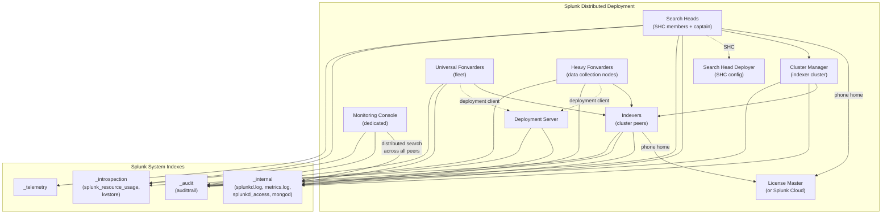

# Splunk Platform Health Monitoring Guide

> The definitive guide to monitoring Splunk itself with Splunk. 59 use cases
> spanning indexer pipeline saturation, KV Store health, deployment server
> management, search head clustering, forwarder fleet health, license usage,
> queue pressure, search performance, and platform capacity — all using the
> built-in `_internal`, `_audit`, `_introspection`, and `_telemetry` indexes
> plus the Monitoring Console (MC).

---

## Table of Contents

- [Quick Start](#quick-start)
- [Overview and What Good Looks Like](#overview)
- [Architecture and Data Flow](#architecture)
- [Prerequisites](#prerequisites)
- [Data Sources Reference](#data-sources)
- [Field Dictionary](#field-dictionary)
- [Sample Events](#sample-events)
- [Monitoring Console Setup](#mc-setup)
- [Distributed Monitoring Console](#dmc)
- [Forwarder Management Visibility](#forwarders)
- [Search Performance Telemetry](#search-perf)
- [Cross-Component Health Correlation](#health-correlation)
- [License and Subscription Usage](#license)
- [CIM Mapping Reference](#cim-mapping)
- [Capacity Planning and Sizing](#sizing)
- [Recommended Dashboard Layouts](#dashboards)
- [ITSI Service Modeling](#itsi)
- [SOAR Playbook Examples](#soar)
- [Multi-Stack / Multi-Tenant Strategy](#multi-stack)
- [Security Hardening](#security-hardening)
- [Crawl / Walk / Run Roadmap](#roadmap)
- [Validation Checklist](#validation-checklist)
- [Known Limitations and Gaps](#known-limitations)
- [Troubleshooting](#troubleshooting)
- [FAQ](#faq)
- [Glossary](#glossary)
- [References](#references)
- [Contribution and Feedback](#contribution)

---

<a id="quick-start"></a>
## Quick Start — 10 Minutes to Platform Visibility

Splunk's internal indexes are populated by default — there is no add-on or input to install. Configuration is mostly about *unlocking* and *organising* the data.

1. **Verify the internal indexes are populated**:

    ```spl
    | tstats count where index=_internal by sourcetype
    | sort -count
    ```

    You should see at minimum: `splunkd`, `splunkd_access`, `splunk_python`, `audittrail`, `splunk_resource_usage`.

2. **Enable the Monitoring Console (MC)** — Splunk Web → Settings → Monitoring Console:
   - On a single Splunk Enterprise: MC is enabled by default in standalone mode.
   - On a distributed deployment: configure a dedicated MC instance per [Distributed MC](#dmc).

3. **Configure the MC role** for your deployment topology:
   - Settings → General Setup → Distributed Mode (if applicable)
   - Add all search peers (indexer cluster managers, search heads)
   - Forwarder Management → Setup

4. **Review the MC dashboards**:
   - Indexing Performance (per-instance, deployment-level)
   - Search Activity
   - Forwarder Activity
   - License Usage
   - KV Store
   - Resource Usage

5. **Activate UC-13.1.1** (Indexer pipeline saturation) and UC-13.1.8 (Deployment Server health) — the highest-value detections.

**Stuck?** Jump to [Troubleshooting](#troubleshooting).

---

<a id="overview"></a>
## Overview and What Good Looks Like

### What Splunk emits about itself

Every Splunk instance writes to four "system" indexes:

| Index | Sourcetype(s) | Purpose |
|-------|--------------|---------|
| **`_internal`** | `splunkd`, `splunkd_access`, `splunkd_ui_access`, `splunk_python`, `kvstore`, `mongod` | Splunkd process logs, REST access, Python script logs, KV Store engine logs |
| **`_audit`** | `audittrail` | User actions, authentication, modular input changes, search history, configuration changes |
| **`_introspection`** | `splunk_resource_usage`, `kvstore` | Per-instance CPU/memory/disk, KV Store stats |
| **`_telemetry`** | `splunkd_telemetry` (etc) | Phone-home telemetry to Splunk (about your deployment) |

In addition:

- **`metrics.log`** within `_internal` carries structured per-component performance lines (`group=queue`, `group=tcpin_connections`, `group=tcpout_connections`, `group=per_sourcetype_thruput`, `group=phonehome_connections`, etc) — the gold mine for platform health.
- **`splunkd.log`** carries lifecycle and error messages.
- **`scheduler.log`** carries saved search execution detail.

### Why monitor Splunk with Splunk?

| Capability | Without monitoring | With UC catalog |
|------------|-------------------|------------------|
| Indexer queue saturation | Discovered when ingest stops | Predictive alerts (UC-13.1.1) |
| KV Store health | Discovered when ES/ITSI fails | Per-cluster KPIs (UC-13.1.7) |
| Deployment server drift | Forwarder configurations silently stale | Coverage + checksum alerts (UC-13.1.8) |
| Search head cluster split | Outage | Real-time captain monitoring (UC-13.1.10) |
| TCP forwarder failure | Visible only when bytes drop | Connection-level alerts (UC-13.1.19) |
| License overage | Email at end-of-day | Real-time threshold alerts |
| Forwarder fleet drift | Unknown | UF inventory dashboards |
| Search performance regression | Hard to diagnose | Per-search SLA tracking (UC-13.1.49) |

### Who should read this guide?

| Role | Relevant sections |
|------|-------------------|
| **Splunk admin** | All sections — this is your primary playbook |
| **Splunk platform team** | Architecture, MC, ITSI, SOAR |
| **SRE / on-call** | Crawl roadmap, Troubleshooting, FAQ |
| **Capacity / FinOps** | License, Sizing |
| **Audit** | Audit trail (`_audit` data) |

### What good looks like

| Dimension | Before integration | After full deployment |
|-----------|-------------------|-----------------------|
| **Indexer queue blockage** | Alarm at first user complaint | Alert at 80% fill (predictive) |
| **Forwarder management** | Unknown forwarder count | Live fleet dashboard with phone-home age |
| **Search performance** | Per-user complaint | SLI/SLO per saved search |
| **License utilization** | Daily email | Real-time + 7-day forecast |
| **KV Store** | Black box | WiredTiger cache hits + replication lag |
| **Deployment Server** | Unknown drift | Bundle checksum alerts |
| **Search head cluster** | Split-brain investigation | Captain election alerts |

---

<a id="architecture"></a>
## Architecture and Data Flow



**Key flows:**

1. **Every Splunk instance** writes its own `_internal`, `_audit`, `_introspection` data locally. In a distributed deployment, indexers replicate this data among the indexer cluster (just like any other index).

2. **Forwarders** also write `_internal` — but the volume is so light that they typically forward it to the indexer tier (default behaviour: forwarders ship `_internal` along with everything else).

3. **Monitoring Console** runs distributed search across all Splunk instances (search peers) and presents aggregated views.

4. **Telemetry** (`_telemetry`) is collected separately and may phone home to Splunk if telemetry is enabled.

---

<a id="prerequisites"></a>
## Prerequisites

### Splunk requirements

| Requirement | Detail |
|-------------|--------|
| **Splunk version** | Splunk Enterprise 9.0+ recommended |
| **Topology** | Single instance, distributed cluster, search head cluster, multi-site |
| **MC instance** | Recommended dedicated MC for deployments > 10 nodes |
| **Roles** | `splunk_admin` for full visibility; `splunk_observer` for read-only |
| **Internal indexes** | Default retention 30 days for `_internal`/`_audit`; bump to 90 days minimum for trending |

### What's NOT required

- No add-ons to install (data is built-in)
- No HF for data collection (Splunk emits its own data)
- No external dependencies

### What you SHOULD install

- **Splunk on Splunk (SoS)** — older Splunkbase app for additional visualisations
- **Monitoring Console** — built-in (Splunk Enterprise 9.0+)
- **Splunk Health Detail View** — Splunk Cloud
- Optional: **Splunk Add-on for Splunk** (Splunkbase 4055) for some additional KV Store / search detail

---

<a id="data-sources"></a>
## Data Sources Reference

### `index=_internal sourcetype=splunkd`

The catch-all log of `splunkd.log`. Multi-faceted:

| `component` field value | What it tells you |
|------------------------|-------------------|
| `Metrics` | metrics.log structured lines |
| `TcpOutputProc` | Forwarder→Indexer connection events |
| `TcpInputProc` | Indexer-side connection acceptance |
| `IndexProcessor` | Indexing details |
| `IndexerService` | Per-index indexing status |
| `BucketMover` | Hot→warm→cold→frozen bucket transitions |
| `DeploymentServer` | DS reload, checksum, state machine errors |
| `DeploymentClient` | Forwarder-side DS connection issues |
| `HttpListener` | REST endpoint access |
| `HttpInputProcessor` | HEC ingest |
| `SHCMember` | Search head cluster member events |
| `SHCConfig` | Search head config replication |
| `KVStoreLite` / `KVStoreCollections` | KV Store engine |
| `ExecProcessor` | Modular input subprocesses (TA inputs) |
| `SearchProcessor` | Search execution |
| `Saved scheduler` (with `sourcetype=scheduler`) | Saved search runs |

### `index=_internal sourcetype=splunkd source=*metrics.log*`

Structured per-component metrics. Crucial fields:

| `group` | Key fields | Used by |
|---------|-----------|---------|
| `queue` | `name` (parsing/agg/typing/index), `current_size_kb`, `max_size_kb` | UC-13.1.1 |
| `queue_thruput` | `name`, `kb`, `ev` | UC-13.1.1 |
| `pipeline` | `name`, `processor` (per-pipeline detail) | UC-13.1.1 |
| `pipelineinputchannel` | `name`, channel pressure | UC-13.1.1 |
| `tcpin_connections` | `sourceIp`, `connectionType`, `cumulative_kbytes` | UC-13.1.1, .19 |
| `tcpout_connections` | `dest_IP`, `dest_port`, `current_size_kb`, `largest_size`, `cumulative_dropped` | UC-13.1.19 |
| `per_sourcetype_thruput` | `series` (sourcetype), `eps`, `kb` | UC-13.1.9 |
| `per_index_thruput` | `series` (index), `eps`, `kb` | License / capacity |
| `per_host_thruput` | `series` (host), `eps`, `kb` | Forwarder fleet |
| `per_source_thruput` | `series` (source), `eps`, `kb` | Source-level visibility |
| `phonehome_connections` | `clientIP`, `connectionType` (forwarder phone-home) | UC-13.1.8 |
| `searchscheduler` | `name` (saved search), `priority`, `delay_s` | Search scheduler health |
| `realtime_search` | RT search metrics | RT search load |

### `index=_internal sourcetype=scheduler`

Per-saved-search run records:
- `app`, `user`, `savedsearch_name`
- `status` (success/failed/skipped)
- `result_count`, `scan_count`
- `dispatch_time`, `run_time`, `total_run_time`

### `index=_audit sourcetype=audittrail`

User actions:
- `action` (login, logout, search, modify, etc)
- `user`, `info` (more detail per action)
- `search` (the SPL string for search actions)

### `index=_introspection sourcetype=splunk_resource_usage`

Per-instance host-level resource usage emitted by splunkd's introspection:
- `data.process_class` (`splunkd`, `searches`)
- `data.cpu_user_pct`, `data.cpu_system_pct`
- `data.mem_used_mb`, `data.mem_total_mb`
- `data.io_*`

### `index=_introspection sourcetype=kvstore`

KV Store engine stats:
- `cache_hit_ratio` / `wt_cache_hit_ratio`
- `dirty_bytes`
- `eviction_pressure`
- `connections_active`
- `db_size_bytes`
- `oplog_lag_seconds` (when SHC)

### `index=splunk_platform sourcetype=deployment_rest_clients` (custom REST polling)

Many UCs (e.g. UC-13.1.8) supplement metrics.log data with periodic REST API polls of `/services/deployment/server/clients`, `/services/deployment/server/serverclasses`, `/services/cluster/manager/peers`, etc. These need a saved search or scripted input to populate.

---

<a id="field-dictionary"></a>
## Field Dictionary

### `metrics.log group=queue` (UC-13.1.1)

| Field | Type | Example | Description |
|-------|------|---------|-------------|
| `name` | string | `parsingQueue`, `aggQueue`, `typingQueue`, `indexQueue` | Queue name |
| `current_size_kb` | int | `2048` | Current queue depth |
| `max_size_kb` | int | `8192` | Configured max |
| `largest_size` | int | `5000` | Peak in measurement window |
| `smallest_size` | int | `100` | Minimum in window |
| `cumulative_inputs` / `outputs` | int | counters | Lifetime in/out |

UC-13.1.1 calculates `fill_ratio = current_size_kb / max_size_kb`. Alert at 0.85; page at 0.92.

### `metrics.log group=tcpout_connections` (UC-13.1.19)

| Field | Type | Example | Description |
|-------|------|---------|-------------|
| `dest_IP` / `destIp` | string | `10.0.1.23` | Indexer IP |
| `dest_port` | int | `9997` | Indexer port |
| `current_size_kb` | int | `4096` | Out-queue size to that destination |
| `largest_size` | int |  | Peak |
| `smallest_size` | int |  | Min |
| `cumulative_dropped` | int | counter | Dropped events |
| `connectionType` | string | `cooked` | Forwarder protocol |

### `metrics.log group=per_sourcetype_thruput` (UC-13.1.9)

| Field | Type | Example | Description |
|-------|------|---------|-------------|
| `series` | string | `aws:cloudtrail`, `WinEventLog:Security` | Sourcetype |
| `eps` | float | `200.5` | Events per second (this measurement window) |
| `kbps` | float | `512.3` | KB per second |
| `kb` | float | `30000` | Cumulative KB in window |
| `ev` | int | counter | Cumulative events |

### `_audit sourcetype=audittrail`

| Field | Type | Example | Description |
|-------|------|---------|-------------|
| `action` | string | `login attempt`, `search`, `modify`, `logout` | Action |
| `info` | string | `succeeded`, `failed`, full info | Detail |
| `user` | string | `admin`, `alice` | Acting user |
| `search` | string | full SPL | The search executed (when action=search) |
| `total_run_time` | float | seconds | Search execution time |

### `_introspection sourcetype=splunk_resource_usage`

| Field | Type | Example | Description |
|-------|------|---------|-------------|
| `data.process_class` | string | `splunkd`, `search`, `kvstore` | Process category |
| `data.cpu_user_pct` / `data.cpu_system_pct` | float | percent | CPU |
| `data.mem_used_mb` | float | MB | Memory |
| `data.read_ops` / `write_ops` | int | counter | I/O |

### `_introspection sourcetype=kvstore` (UC-13.1.7)

| Field | Type | Example | Description |
|-------|------|---------|-------------|
| `cache_hit_ratio` / `wt_cache_hit_ratio` | float | `0.95` | WiredTiger cache hit |
| `dirty_bytes` | int | bytes | Dirty cache pressure |
| `eviction_pressure` | int |  | WT eviction pressure score |
| `connections_active` | int |  | Active connections |
| `db_size_bytes` | int |  | Database footprint |
| `replication_status` | string | `PRIMARY`, `SECONDARY`, `RECOVERING` | SHC member state |
| `oplog_lag_seconds` | int |  | Replication lag |

---

<a id="sample-events"></a>
## Sample Events

### `metrics.log group=queue` (parsing queue near full)

```
04-25-2026 14:30:00.123 +0000 INFO Metrics - group=queue, name=parsingQueue, blocked=true, max_size_kb=8192, current_size_kb=7800, largest_size=8192, smallest_size=4500
```

UC-13.1.1 trigger: `fill_ratio = 7800/8192 ≈ 0.95` → page.

### `metrics.log group=tcpout_connections`

```
04-25-2026 14:30:00.123 +0000 INFO Metrics - group=tcpout_connections, sourcePort=8089, destIp=10.0.1.23, destPort=9997, _udp_in=0, _udp_out=0, _tcp_in=0, _tcp_out=2456, current_size_kb=512, largest_size=2048, smallest_size=0, cumulative_dropped=0
```

### `splunkd.log` (TcpOutputProc connection failure — UC-13.1.19)

```
04-25-2026 14:30:00.123 +0000 ERROR TcpOutputFd - Connection to host=10.0.1.23 port=9997 timed out
04-25-2026 14:30:00.456 +0000 WARN TcpOutputProc - Cooked connection to ip=10.0.1.23 port=9997 timed out
```

### `_audit` (search executed)

```
Audit:[timestamp=04-25-2026 14:30:00.123, user=alice, action=search, info=granted, search='index=aws_cloudtrail eventName=ConsoleLogin', autojoin=1, buckets=20, ttl=600, max_count=500000, maxtime=8640000, enable_lookups=1, extra_fields='', apiStartTime='ZERO_TIME', apiEndTime='now'][n/a]
```

### `_introspection` (KV Store stats)

```
{"data":{"cache_hit_ratio":0.95,"dirty_bytes":134217728,"eviction_pressure":234,"connections_active":340,"db_size_bytes":12884901888,"replication_status":"PRIMARY","oplog_lag_seconds":2}}
```

### `splunkd.log` (Deployment Server reload — UC-13.1.8)

```
04-25-2026 14:30:00.123 +0000 INFO DeploymentServer - Reloading state. Took 2.3 seconds.
04-25-2026 14:30:01.456 +0000 ERROR DeploymentServer - Failed to compute repository_checksum for serverclass=monitoring_apps
```

---

<a id="mc-setup"></a>
## Monitoring Console Setup

### Single-instance setup

In Splunk Web → Settings → Monitoring Console → Setup → "Standalone".

The MC will use the local instance for all distributed searches.

### Distributed setup

For deployments with > 1 search head or > 1 indexer:

1. **Designate an MC instance** (typically a dedicated search head, possibly a search head not part of any cluster)
2. Settings → Monitoring Console → General Setup → Distributed Mode
3. Add all search peers:
   - Cluster Manager (the cluster manager is searchable as a peer)
   - Other search heads
   - SHC members (if not the MC itself)
   - Standalone indexers (if not in a cluster)
4. For each peer, specify its server role: Indexer, Search Head, KV Store, License Master, Deployment Server, Cluster Manager, etc.
5. Save and apply

### MC dashboards out-of-the-box

| Dashboard | Tells you |
|-----------|-----------|
| Indexing Performance — Deployment | Aggregate ingest, queue health, top hosts |
| Indexing Performance — Instance | Per-indexer pipeline detail |
| Search Activity — Deployment | Search load, top users/apps, slow searches |
| Search Activity — Instance | Per-search head stats |
| Forwarder Activity — Deployment | UF count, phone-home cadence, top sourcetypes |
| KV Store | KVS engine stats per SHC |
| License Usage — Deployment | License consumption by index/sourcetype/host |
| Resource Usage — Deployment | CPU/Memory/Disk per node |

### Customising MC alerts

MC ships with built-in alerts (Settings → Monitoring Console → Alerts) — enable + tune:
- Indexer pipeline blocked
- Indexer disk usage
- Forwarder lag
- Search head cluster captain election
- License usage approaching quota

---

<a id="dmc"></a>
## Distributed Monitoring Console

### When to deploy a dedicated MC

| Topology | Recommendation |
|----------|---------------|
| < 5 nodes | Use any search head as MC (standalone) |
| 5–50 nodes | Dedicated MC search head |
| > 50 nodes | Dedicated MC + DMC for forwarder management |
| Multi-site | One MC per site OR a primary MC at the master site |

### Configuration

A dedicated MC search head is a regular Splunk search head with `monitoring_console` app activated:

```
Settings → Monitoring Console → General Setup → Distributed Mode = "Distributed"
Settings → Monitoring Console → General Setup → "Add Splunk Servers"
```

Add each search peer with its role(s).

### Deployment server role

If you have a dedicated MC, the MC search head is often ALSO the Deployment Server (or a separate DS reports to MC). MC can show forwarder management views including:
- Forwarder count by serverclass
- Phone home cadence
- App distribution

---

<a id="forwarders"></a>
## Forwarder Management Visibility

### Forwarder fleet inventory

Build a `forwarder_inventory.csv` lookup from `metrics.log group=phonehome_connections`:

```spl
index=_internal source=*metrics.log* group=phonehome_connections
| stats latest(_time) as last_phonehome by clientIP, hostname, splunk_server
| eval phonehome_age_s = now() - last_phonehome
| where phonehome_age_s > 0
| outputlookup forwarder_inventory.csv
```

Schedule daily.

### Phone-home age alert

```spl
index=_internal source=*metrics.log* group=phonehome_connections earliest=-1h
| stats latest(_time) as last_phonehome by clientIP, hostname
| eval age_min = round((now() - last_phonehome) / 60, 0)
| where age_min > 30
| sort -age_min
```

UC-13.1.8 expands this with `phoneHomeIntervalInSecs` (default 60s) — alerts if a forwarder is silent for `3 * phoneHomeIntervalInSecs`.

### Forwarder disposition (online / silent / unhealthy)

```spl
| inputlookup forwarder_inventory.csv
| eval status = case(
    age_min < 15, "ONLINE",
    age_min < 60, "DELAYED",
    age_min < 1440, "SILENT_24H",
    1=1, "MISSING_24H+"
  )
| stats count by status
```

### Forwarder ingest by sourcetype

```spl
index=_internal source=*metrics.log* group=per_sourcetype_thruput
| stats sum(kb) as total_kb by series
| sort -total_kb
| eval total_gb = round(total_kb / (1024*1024), 2)
```

---

<a id="search-perf"></a>
## Search Performance Telemetry

### Top slow scheduled searches

```spl
index=_internal sourcetype=scheduler earliest=-7d
| stats avg(total_run_time) as avg_runtime, count by savedsearch_name, app, user
| where count > 5
| sort -avg_runtime
| head 50
```

### Saved-search SLA violators

```spl
index=_internal sourcetype=scheduler earliest=-24h
| eval is_long = if(total_run_time > 60, 1, 0)
| stats sum(is_long) as long_runs, count, avg(total_run_time) as avg_runtime by savedsearch_name
| where long_runs > 2
| sort -avg_runtime
```

### User-driven (ad-hoc) search load

```spl
index=_audit action=search NOT (savedsearch_name=* OR scheduled=1) earliest=-1h
| stats count, avg(total_run_time) as avg_runtime, sum(scan_count) as total_scan by user
| sort -count
```

### Concurrency saturation

Splunk has a configured per-search-head concurrency cap. When exceeded, searches queue:

```spl
index=_internal sourcetype=splunkd "could not dispatch" OR "concurrency limit" earliest=-1h
| stats count by component, log_level
```

Or look at `metrics.log` for `searchscheduler` `delay_s`.

### UC-13.1.49 — Latency seasonal anomaly

The catalog's UC-13.1.49 uses the MLTK `DensityFunction` algorithm to learn p95/p99 latency seasonality (hour-of-week) and alerts on outliers. Apply to *any* time-series, including search performance.

---

<a id="health-correlation"></a>
## Cross-Component Health Correlation

### Indexer queue + forwarder backpressure (root-cause chain)

```spl
(index=_internal source=*metrics.log* group=queue (name=parsingQueue OR name=indexQueue))
OR (index=_internal source=*metrics.log* group=tcpin_connections)
| eval is_queue = if(group="queue", 1, 0)
| stats max(current_size_kb) as max_q, sum(_tcp_in) as in_bytes by host
| sort -max_q
```

### Search head cluster health

```spl
index=_internal sourcetype=splunkd component=SHCMember earliest=-1h
| stats count by component, log_level, splunk_server
```

For captain elections (UC-13.1.10):

```spl
index=_internal sourcetype=splunkd component=SHCMember "captain" OR "election"
| table _time, splunk_server, _raw
```

### KV Store + ES correlation

If KV Store has issues, ES dashboards stop loading. Correlate:

```spl
(index=_introspection sourcetype=kvstore replication_status!=PRIMARY)
OR (index=_internal sourcetype=splunk_search_messages "Notable" OR "RBAC")
| transaction maxspan=5m
```

---

<a id="license"></a>
## License and Subscription Usage

### Today's license use

```spl
index=_internal source=*license_usage.log* type=Usage earliest=@d
| stats sum(b) as bytes by st, idx, h
| eval gb = round(bytes / (1024*1024*1024), 3)
| sort -gb
```

### 7-day trend with forecast

```spl
index=_internal source=*license_usage.log* type=Usage earliest=-30d
| timechart sum(b) as bytes
| eval gb = bytes / (1024*1024*1024)
| predict gb future_timespan=7
```

### Per-index spend

```spl
index=_internal source=*license_usage.log* type=Usage earliest=-30d
| stats sum(b) as bytes by idx
| eval gb = round(bytes / (1024*1024*1024), 2)
| sort -gb
| head 25
```

### Splunk Cloud subscription usage

Splunk Cloud emits `cloud_usage.log` with subscription consumption. Use:

```spl
index=_internal source=*cloud_usage.log* | head 100
```

Splunk Cloud Monitoring Console (SCMC) — provided to Cloud customers — shows this in detail.

---

<a id="cim-mapping"></a>
## CIM Mapping Reference

| CIM Data Model | Mapped sourcetypes | Validation SPL |
|----------------|--------------------|----------------|
| **Performance** | `splunk_resource_usage` (CPU, mem) | `\| tstats count from datamodel=Performance` |
| **Authentication** | `audittrail` (login attempts) | `\| tstats count from datamodel=Authentication` |
| **Change** | `audittrail` (config changes) | `\| tstats count from datamodel=Change` |

CIM Splunk Add-on (Common Information Model) ships with mappings for many internal sourcetypes — verify in Settings → Data Models after install.

---

<a id="sizing"></a>
## Capacity Planning and Sizing

### Per-instance internal volume

| Instance | Daily `_internal` |
|----------|-------------------|
| Universal Forwarder | ~10 MB |
| Heavy Forwarder (light load) | ~50–200 MB |
| Heavy Forwarder (TA-heavy) | ~500 MB – 2 GB |
| Indexer | 200 MB – 2 GB |
| Search Head | 100 MB – 1 GB |
| Cluster Manager | ~200 MB |
| Deployment Server | 50–200 MB |

### Worked examples

| Estate | Daily `_internal` ingest |
|--------|--------------------------|
| **Small (1 SH, 3 IDX, 100 UFs)** | ~3 GB/day |
| **Medium (SHC, 10 IDX, 1000 UFs)** | ~25 GB/day |
| **Large (SHC, 50 IDX, 10K UFs)** | ~150 GB/day |
| **Very large (multi-site, 100+ IDX, 50K UFs)** | ~500 GB/day |

### Retention recommendations

| Index | Recommended retention |
|-------|----------------------|
| `_internal` | 90d minimum (180d for capacity trending) |
| `_audit` | 1y minimum (compliance) |
| `_introspection` | 30d (high-cardinality data) |
| `_telemetry` | 30d |

### Search head sizing for MC

- 8 vCPU, 32 GB RAM for deployments with up to ~50 search peers
- 16 vCPU, 64 GB for 100+ search peers
- Dedicated MC; not also serving end users

---

<a id="dashboards"></a>
## Recommended Dashboard Layouts

### Crawl Dashboard — "Splunk At a Glance"

```
+----------------------------------+----------------------------------+
| INDEXER QUEUE FILL (UC-13.1.1)   | INDEXER DISK USAGE               |
| Per indexer per queue            | %used and free GB                |
+----------------------------------+----------------------------------+
| FORWARDER COUNT BY STATE         | LICENSE USE TODAY vs QUOTA       |
| (online / delayed / silent)      |                                  |
+----------------------------------+----------------------------------+
| TOP DROPPED EVENTS (UC-13.1.19)  | KV STORE HEALTH (UC-13.1.7)      |
+----------------------------------+----------------------------------+
```

### Walk Dashboard — "Operational Intelligence"

```
+----------------------------------+----------------------------------+
| TOP-N SAVED SEARCHES BY RUNTIME  | DEPLOYMENT SERVER COVERAGE       |
| (UC-13.1.49)                     | (UC-13.1.8)                      |
+----------------------------------+----------------------------------+
| SEARCH SCHEDULER SKIPS / DELAYS  | SHC MEMBER STATUS / CAPTAIN      |
| (UC-13.1.10)                     |                                  |
+----------------------------------+----------------------------------+
| TOP CONSUMING SOURCETYPES        | LICENSE TREND + FORECAST         |
| (UC-13.1.9)                      |                                  |
+----------------------------------+----------------------------------+
```

### Run Dashboard — "Capacity & Cost"

```
+----------------------------------+----------------------------------+
| ESTIMATED 30D INDEX GROWTH       | INDEX RETENTION COMPLIANCE       |
+----------------------------------+----------------------------------+
| FORWARDER FLEET DRIFT            | UNUSED SAVED SEARCHES (90d)      |
+----------------------------------+----------------------------------+
| SEARCH PEAK CONCURRENCY          | PER-USER SEARCH LOAD             |
+----------------------------------+----------------------------------+
```

---

<a id="itsi"></a>
## ITSI Service Modeling

### Service hierarchy

```
Splunk Platform
├── Indexer Tier (per cluster)
│   ├── Pipeline health (UC-13.1.1)
│   ├── Disk capacity (UC-13.1.23)
│   └── Bucket replication
├── Search Head Tier
│   ├── SHC health (UC-13.1.10)
│   ├── KV Store (UC-13.1.7)
│   └── Search performance
├── Forwarder Tier
│   ├── Phone-home health (UC-13.1.8)
│   ├── TCP output (UC-13.1.19)
│   └── Coverage by serverclass
├── Deployment Server (UC-13.1.8)
└── License (subscription usage trend)
```

### Recommended KPIs

| KPI | Source | Threshold |
|-----|--------|-----------|
| **Indexer queue fill (max across all queues)** | UC-13.1.1 | Adaptive (warn 80%, page 92%) |
| **KV Store cache hit ratio** | UC-13.1.7 | Static (warn < 0.85) |
| **Deployment Server coverage %** | UC-13.1.8 | Static (warn < 95%) |
| **Forwarder phone-home age (p99)** | UC-13.1.8 | Static (warn > 3× interval) |
| **TCP output queue (max across HFs)** | UC-13.1.19 | Adaptive |
| **License burn-rate vs quota** | license_usage.log | Static (warn 80%, crit 95%) |

### Entity import (Splunk hosts)

```spl
index=_internal earliest=-24h
| dedup splunk_server
| table splunk_server host server_roles
| eval role = mvjoin(server_roles, ", ")
| outputlookup splunk_hosts_inventory.csv
```

---

<a id="soar"></a>
## SOAR Playbook Examples

### Playbook 1: Indexer Queue Saturation Auto-Triage (UC-13.1.1)

**Trigger:** UC-13.1.1 alert (any queue at 92% on any indexer).

```
1. RECEIVE alert (indexer, queue, fill_ratio)
2. PULL last 30min of metrics.log group=queue for the indexer
3. PULL top sourcetypes ingesting to that indexer (per_sourcetype_thruput)
4. PULL TCP-in connection load
5. DECISION:
   - Rapid spike from one sourcetype → throttle / stop the source HF
   - Sustained growth all sourcetypes → indexer is undersized; scale
   - Specific source IP problematic → block at network
6. NOTIFY platform team via Slack with full context
7. CREATE INCIDENT (P1)
```

### Playbook 2: Deployment Server Coverage Failure (UC-13.1.8)

**Trigger:** UC-13.1.8 alert (forwarders < 95% coverage of expected serverclass).

```
1. RECEIVE alert (serverclass, expected_count, actual_count, missing_forwarders)
2. PULL each missing forwarder's last phone-home time
3. CHECK if forwarder host is up (via inventory ping)
4. CATEGORISE:
   - Host down → infrastructure issue; ticket to ops
   - Host up, UF down → SSH and restart UF
   - UF up, but DS unreachable → check network path
5. CREATE INCIDENT
6. AUTO-RESTART UF where allowed (with safety check)
```

### Playbook 3: KV Store Replication Lag (UC-13.1.7)

**Trigger:** UC-13.1.7 alert (oplog lag > 60s on any SHC member).

```
1. RECEIVE alert (member, oplog_lag_s)
2. PULL KV Store metrics for that member (cache, eviction, IO)
3. CHECK SHC captain status (still healthy?)
4. CHECK whether one collection is dominating writes
5. IF lag continues > 5min:
   - Demote member out of search rotation
   - Initiate KVStore resync
6. NOTIFY Splunk platform team
7. CREATE INCIDENT (P2)
```

---

<a id="multi-stack"></a>
## Multi-Stack / Multi-Tenant Strategy

### Multiple Splunk deployments (e.g. prod + dev + DR)

Pattern: each deployment has its own MC; a "meta MC" cross-search peers across all deployments for a single pane.

### Splunk Cloud + Splunk Enterprise hybrid

Splunk Cloud has its own SCMC and you can't add the Enterprise MC to it. For visibility:
- SCMC for Cloud-side
- On-prem MC for Enterprise-side
- Build a custom "platform health" dashboard pulling from both via Splunk-to-Splunk forwarding of `_internal` data

### Multi-tenant (MSP) within one Splunk

- Use indexes per tenant (`tenant_acme_main`, `tenant_acme_security`)
- Use `_internal` from the platform (single-tenant view of SLA)
- Custom search-time RBAC via `srchFilter` per role

---

<a id="security-hardening"></a>
## Security Hardening

### `_audit` index protection

- `_audit` records all user actions including SPL searches
- Apply field-level RBAC: only `splunk_admin` can see `search` field content (as it may include sensitive query text)
- Protect against `delete` by non-admin roles
- Forward `_audit` to a separate Splunk index in a different security domain for tamper protection

### Minimum required permissions

- Most users only need `_internal` read for self-service performance (they want to see why their search is slow)
- Restrict `_audit` to admins
- Restrict `_introspection` to admins (CPU/memory of customers)

### Detection of Splunk attacks

- Alert on `_audit action=login info=failed` patterns (brute force on Splunk admin)
- Alert on `_audit action=modify` on sensitive savedsearches (UCs, knowledge objects)
- Alert on bulk export via REST (`splunkd_access` POST `/services/search/export`)

---

<a id="roadmap"></a>
## Crawl / Walk / Run Roadmap

### Crawl (Week 1–2)

| Order | UC | Title |
|-------|----|-------|
| 1 | UC-13.1.1 | Indexer pipeline saturation |
| 2 | (License) | License usage today vs quota |
| 3 | UC-13.1.8 | Deployment Server health |
| 4 | UC-13.1.19 | TCP output failures |
| 5 | (Forwarder phone-home) | Forwarder fleet visibility |

### Walk (Week 3–6)

1. UC-13.1.7 — KV Store
2. UC-13.1.10 — SHC health
3. UC-13.1.9 — Forwarder ingest SLA
4. UC-13.1.49 — Search latency anomalies
5. Saved-search performance dashboards

### Run (Month 2+)

1. ITSI services (every Splunk role mapped)
2. SOAR playbooks (queue auto-triage, DS coverage, KV Store recovery)
3. Capacity forecasting (license + disk + search load)
4. Audit trail reporting for governance

---

<a id="validation-checklist"></a>
## Validation Checklist

### Day 1

- [ ] MC enabled and configured (standalone or distributed)
- [ ] All search peers added with correct roles
- [ ] `_internal` retention bumped to 90d
- [ ] Crawl-tier UCs deployed
- [ ] License alert working

### Day 7

- [ ] Crawl dashboard built and shared
- [ ] First UC-13.1.1 alert tested
- [ ] Forwarder inventory dashboard working
- [ ] License trend reviewed

### Day 30

- [ ] Walk-tier UCs deployed
- [ ] KV Store + SHC dashboards reviewed
- [ ] Saved-search performance baseline captured
- [ ] Deployment server coverage tracked

### Day 90

- [ ] Run-tier UCs deployed
- [ ] ITSI services configured
- [ ] First SOAR playbook in production
- [ ] Capacity forecast reviewed quarterly

---

<a id="known-limitations"></a>
## Known Limitations and Gaps

| Limitation | Impact | Workaround |
|------------|--------|------------|
| **MC scales to ~100 search peers** | Performance issues with very large deployments | Multiple MC instances per environment |
| **`_introspection` high cardinality** | Slow searches | Use sample period (e.g. 5 min instead of 10s) |
| **`_audit` index can be large** | Disk growth | Rotate/compress aggressively |
| **Splunk Cloud restricts internal access** | Some metrics not exposed | Use SCMC; some custom searches blocked |
| **MC alerts not always tunable** | False positives | Build custom alerts replacing MC defaults |
| **No native cross-stack view** | Multi-stack visibility manual | Splunk-to-Splunk forwarding pattern |
| **Bucket-level metrics rare** | Deep storage health hard to see | Custom REST polling of `/services/cluster/manager/buckets` |

---

<a id="troubleshooting"></a>
## Troubleshooting

### MC shows no data

1. Confirm "Distributed Mode" is set
2. Confirm search peers are added and reachable
3. Test from MC's search bar: `| rest /services/server/info`
4. Check `_internal` indexing: `index=_internal earliest=-1h | head 1`

### `_internal` data isn't replicating to indexer cluster

- By default `_internal` is forwarded to indexers
- Check `outputs.conf` on the SH/HF instance
- Check forwarder→indexer connection

### Indexer queue alerts noisy

- Check time of day: queues may briefly spike during bucket roll
- Tune fill_ratio threshold to your environment (some lab tunes are 0.85; production may need 0.92)
- Suppress during scheduled bucket actions

### Forwarder shows phone-home but no data

- Phone-home and data ingest are different paths
- Check `metrics.log group=tcpout_connections` from the forwarder
- Check `splunkd.log` for `TcpOutputProc` errors

---

<a id="faq"></a>
## FAQ

**Q: Should I run MC on my busiest search head?**
A: No. Use a dedicated search head for MC. MC's distributed searches across many peers can be heavy.

**Q: How do I monitor Splunk Cloud?**
A: Use SCMC (Splunk Cloud Monitoring Console) provided by Splunk. You can also forward `_internal` from your Cloud stack to an on-prem stack for cross-correlation, but check with Splunk Support first.

**Q: What's the difference between `_internal` and `_introspection`?**
A: `_internal` carries log lines from `splunkd.log`/`metrics.log`/`scheduler.log` — narrative + metric in JSON-ish text. `_introspection` carries structured per-process resource usage stats. Both useful; different angles.

**Q: Why are my MC dashboards slow?**
A: Likely the underlying tstats searches are heavy. Increase `_internal` summary acceleration (Settings → Data Models → check Acceleration).

**Q: Should I delete old `_internal` data?**
A: Don't delete; rotate via `frozenTimePeriodInSecs`. Keep at least 90d for trend.

**Q: How do I correlate a Splunk slowdown with infra issues?**
A: `_introspection` gives you per-process CPU/mem inside Splunk. Combine with host-level data (Linux: `/var/log/messages`; Windows: System log) via UC-1.1 / UC-1.2 guides.

**Q: Why does my license use spike on Mondays?**
A: Common pattern: weekly batch jobs, AD sync sweeps, or backup verification all run on Monday. Use `per_sourcetype_thruput` filtered by hour-of-week to identify.

**Q: How do I plan my Splunk capacity for next year?**
A: Use UC-13.1's Splunk on Splunk dashboards + the `predict` SPL command for license trend. Add 30% headroom for surprise sources.

---

<a id="glossary"></a>
## Glossary

| Term | Definition |
|------|-----------|
| **DMC** | Deployment Monitoring Console (older name for MC) |
| **MC** | Monitoring Console |
| **SCMC** | Splunk Cloud Monitoring Console |
| **SoS** | Splunk on Splunk (older app, partially superseded by MC) |
| **SHC** | Search Head Cluster |
| **CM** | Cluster Manager (indexer cluster) |
| **DS** | Deployment Server |
| **HF** | Heavy Forwarder |
| **UF** | Universal Forwarder |
| **WiredTiger** | KV Store's MongoDB storage engine |

---

<a id="references"></a>
## References

| Resource | URL |
|----------|-----|
| Monitoring Console docs | [docs.splunk.com/Documentation/Splunk/latest/DMC](https://docs.splunk.com/Documentation/Splunk/latest/DMC) |
| Splunk Validated Architectures | [www.splunk.com/en_us/pdfs/tech-brief/splunk-validated-architectures.pdf](https://www.splunk.com/pdfs/tech-brief/splunk-validated-architectures.pdf) |
| Splunk Add-on for Splunk (Splunkbase 4055) | [splunkbase.splunk.com/app/4055](https://splunkbase.splunk.com/app/4055) |
| Splunk on Splunk app | [splunkbase.splunk.com/app/748](https://splunkbase.splunk.com/app/748) |
| Splunk Cloud Monitoring Console | [docs.splunk.com/Documentation/SplunkCloud/latest/Admin](https://docs.splunk.com/Documentation/SplunkCloud/latest/Admin) |
| Splunk Lantern - Platform monitoring | [lantern.splunk.com](https://lantern.splunk.com) (search "monitoring console") |

---

<a id="contribution"></a>
## Contribution and Feedback

Part of the [Splunk Monitoring Use Cases](https://github.com/fenre/splunk-monitoring-use-cases) project. Found an error? [Open an issue](https://github.com/fenre/splunk-monitoring-use-cases/issues/new).

---

*Last updated: 2026-05-08. Covers Splunk Enterprise 9.0+, Splunk Cloud (Victoria, Classic).*
