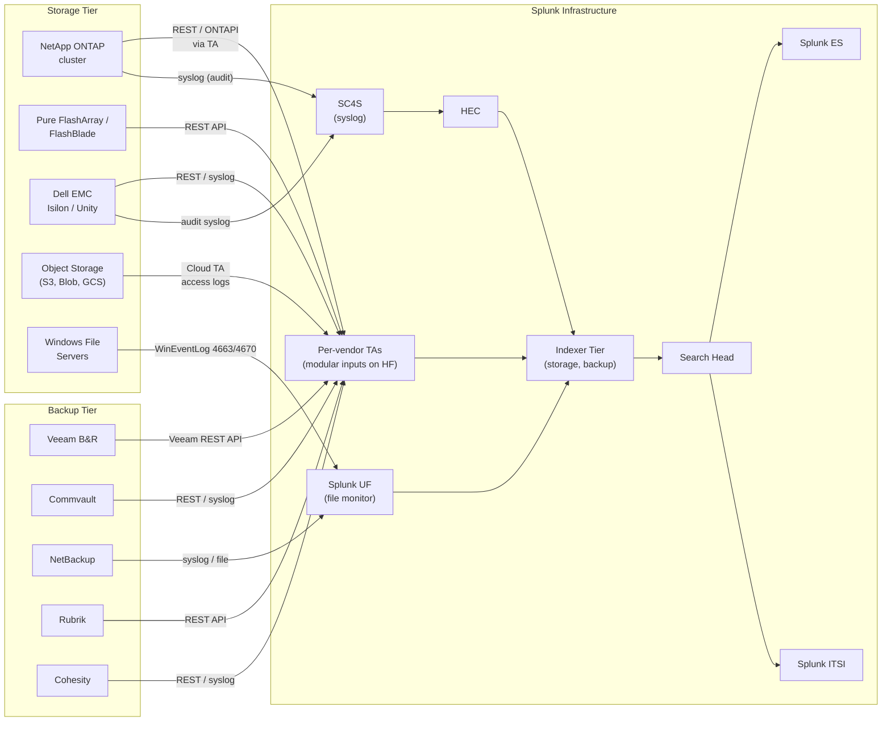

# Storage & Backup (NetApp, Pure, Dell EMC, Veeam, Commvault) Integration Guide

> The definitive guide to monitoring enterprise storage and backup
> with Splunk. 152 use cases across SAN/NAS arrays (NetApp, Pure,
> Dell EMC), object storage (S3, Azure Blob, GCS, MinIO), backup &
> recovery platforms (Veeam, Commvault, NetBackup, Rubrik, Cohesity),
> and file services (Windows file audit, NFS, SMB). Capacity
> trending, IOPS/latency SLAs, controller failover, snapshot
> management, ransomware detection on snapshots, immutable backup
> verification, public-bucket detection, and full audit trails for
> SOX/PCI/HIPAA storage compliance.

---

## Table of Contents

- [Quick Start](#quick-start)
- [Overview](#overview)
- [Architecture and Data Flow](#architecture)
- [Prerequisites](#prerequisites)
- [Platform Coverage Matrix](#platform-matrix)
- [NetApp ONTAP](#netapp)
- [Pure Storage](#pure)
- [Dell EMC (Isilon, Unity, PowerStore, PowerMax)](#emc)
- [Object Storage (S3, Azure Blob, GCS, MinIO)](#object-storage)
- [Veeam Backup & Replication](#veeam)
- [Commvault, NetBackup, Rubrik, Cohesity](#other-backup)
- [Windows File Services](#windows-files)
- [Field Dictionary (Cross-Vendor)](#field-dictionary)
- [Sample Events](#sample-events)
- [Splunk-Side Configuration](#splunk-config)
- [Ransomware Detection on Storage / Snapshots](#ransomware)
- [Cross-Product Correlation](#cross-product)
- [CIM Mapping Reference](#cim-mapping)
- [Compliance Mapping](#compliance)
- [Capacity Planning and Sizing](#sizing)
- [Recommended Dashboard Layouts](#dashboards)
- [ITSI Service Modeling](#itsi)
- [SOAR Playbook Examples](#soar)
- [Multi-Site / DR Strategy](#multi-site)
- [Security Hardening](#security-hardening)
- [Crawl / Walk / Run Roadmap](#roadmap)
- [Validation Checklist](#validation-checklist)
- [Known Limitations and Gaps](#known-limitations)
- [Troubleshooting](#troubleshooting)
- [FAQ](#faq)
- [Glossary](#glossary)
- [References](#references)
- [Contribution and Feedback](#contribution)

---

<a id="quick-start"></a>
## Quick Start — 30 Minutes to First Telemetry

> Pick the section matching your platform. **All platforms share the
> same end-state**: capacity / performance / audit events flow into
> the `storage` / `backup` indexes, normalize to CIM Performance
> data model, ready for capacity dashboards, IOPS/latency SLAs,
> failover detection, and ransomware detection.

### NetApp ONTAP (fastest)

1. Install [Splunk Add-on for NetApp Data ONTAP (Splunkbase 1664)](https://splunkbase.splunk.com/app/1664) on a Heavy Forwarder + indexers + SH.
2. Create read-only ONTAP user:

    ```
    cluster1::> security login create -user-or-group-name splunk -application ontapi -authentication-method password -role readonly
    ```

3. Configure the TA modular input (in Splunk Web → Add-on for NetApp → Add Cluster):
    - Cluster: `https://cluster1.example.com:443`
    - Username: `splunk`
    - Polling interval: 300s
4. Validate: `index=storage sourcetype="netapp:ontap*" earliest=-15m | stats count by sourcetype`

### Pure Storage FlashArray

```bash
# Pure REST API token (via Pure UI: Settings > Users > API Tokens)
# Then configure Splunk Add-on for Pure Storage modular input
```

### Dell EMC (Isilon example)

```ini
[isilon_audit]
auditing = on
audit_protocols = SMB,NFS
syslog_destination = <sc4s-vip>:514
```

### Activate crawl tier

UC-6.1.1 (Volume Capacity Trending), UC-6.1.2 (Storage Latency), UC-6.1.4 (Disk Failure), UC-6.1.6 (Controller Failover).

---

<a id="overview"></a>
## Overview

### Why monitor storage & backup

Storage failures cause silent data loss + immediate application outages. Backup failures are even worse — often noticed only when you NEED them.

### What this guide covers

| Category | Platforms |
|---------|-----------|
| **6.1 SAN / NAS Storage** | NetApp ONTAP, Pure FlashArray, Dell EMC, HPE 3PAR/Nimble |
| **6.2 Object Storage** | AWS S3, Azure Blob, GCS, MinIO, Cloudian, OneFS |
| **6.3 Backup & Recovery** | Veeam, Commvault, NetBackup, Rubrik, Cohesity, Avamar |
| **6.4 File Services** | Windows file audit, NFS, SMB, Varonis |

### Domains covered

| Domain | Examples |
|--------|---------|
| **Capacity** | Volume / aggregate / LUN utilization, snapshot space |
| **Performance** | IOPS, latency, throughput, queue depth |
| **Availability** | Controller failover, disk failure, path failover |
| **Backup** | Job success/failure, RPO/RTO compliance, retention |
| **Security** | Audit access, ransomware detection, immutable verification |
| **Compliance** | SOX retention, GDPR right-to-be-forgotten, FIPS 140 |

### What's NOT in scope

| Domain | Where to look |
|--------|---------------|
| **Database storage IOPS** | [Relational Databases Guide](relational-databases.md) |
| **VM-level disk performance** | [VMware Guide](vmware.md) |
| **Cloud provider storage IAM** | [AWS](aws.md), [Azure](azure.md), [GCP](gcp.md) guides |

### What good looks like

| Dimension | Without integration | With full deployment |
|-----------|---------------------|----------------------|
| Volume full at 3am | Application crash | 80% threshold + 30-day predict |
| Disk failure | Outage | Pre-failure smart alert + auto-RMA ticket |
| Backup failure | Notice during disaster | Real-time alert + retry policy |
| Ransomware on snapshot | Unrecoverable | Snapshot integrity validation |
| Public S3 bucket | Compliance breach | Continuous detection + remediation |

---

<a id="architecture"></a>
## Architecture and Data Flow



---

<a id="prerequisites"></a>
## Prerequisites

### Splunk requirements

| Item | Detail |
|------|--------|
| **Splunk version** | 9.0+ Enterprise or Cloud |
| **CIM 6.x** | Performance, Change, Authentication models |
| **Heavy Forwarder** | For per-vendor TA modular inputs (REST polling) |
| **SC4S** | For syslog from arrays + backup platforms |

### Storage-side requirements

| Platform | Required configs |
|---------|-----------------|
| **NetApp ONTAP** | Read-only API user with `ontapi` + `console` apps |
| **Pure** | API token (read-only) |
| **Dell EMC Isilon** | Audit user + REST API access; syslog forwarding |
| **Veeam** | REST API enabled + read-only token |
| **AWS S3** | CloudTrail + S3 access logs to S3 bucket |
| **Azure Blob** | Storage diagnostic settings → Log Analytics or Event Hub |

---

<a id="platform-matrix"></a>
## Platform Coverage Matrix

| Vendor | TA | Splunkbase | Sourcetypes | Cloud-vetted |
|--------|----|-----------|-------------|--------------|
| **NetApp ONTAP** | TA-netapp_ontap | [1664](https://splunkbase.splunk.com/app/1664) | `netapp:ontap:*` | Yes |
| **Pure Storage** | Splunk Add-on for Pure Storage | [3724](https://splunkbase.splunk.com/app/3724) | `pure:*` | Yes |
| **Dell EMC** | Splunk Add-on for Dell EMC | [1932](https://splunkbase.splunk.com/app/1932) | `emc:*` | Yes |
| **Veeam** | Veeam App for Splunk | [4097](https://splunkbase.splunk.com/app/4097) | `veeam:*` | Yes |
| **Commvault** | Splunk Add-on for Commvault | [3160](https://splunkbase.splunk.com/app/3160) | `commvault:*` | Yes |
| **AWS S3** | Splunk_TA_aws | [1876](https://splunkbase.splunk.com/app/1876) | `aws:s3:accesslogs` | Yes |
| **Azure Blob** | Splunk_TA_microsoft-cloudservices | [3110](https://splunkbase.splunk.com/app/3110) | `azure:storage:*` | Yes |
| **GCS** | Splunk_TA_google-cloudplatform | [3088](https://splunkbase.splunk.com/app/3088) | `google:gcp:storage` | Yes |

---

<a id="netapp"></a>
## NetApp ONTAP

### Required Splunk components

| Component | Purpose |
|-----------|--------|
| TA-netapp_ontap | Modular input + field extractions |

### TA configuration

```
# Splunk Web → Add-on for NetApp → Add Cluster
Cluster Hostname: cluster1.example.com
Port: 443 (HTTPS)
Username: splunk (read-only)
Verify SSL: yes (recommended)
Polling intervals:
    Volume metrics: 300s
    Performance: 60s (high-frequency)
    Aggregate metrics: 600s
    Audit: 60s
```

### NetApp-side configuration

```bash
# Create read-only API user
cluster1::> security login create -user-or-group-name splunk \
    -application ontapi \
    -authentication-method password \
    -role readonly

cluster1::> security login create -user-or-group-name splunk \
    -application http \
    -authentication-method password \
    -role readonly

# Enable EMS (Event Management System) syslog forwarding
cluster1::> event syslog destination create -destination <sc4s-vip> \
    -port 514 \
    -syslog-facility local6 \
    -syslog-severity informational
```

### Sample sourcetypes

| Sourcetype | Source | Use |
|-----------|--------|-----|
| `netapp:ontap:volume` | REST `/api/storage/volumes` | Capacity per volume |
| `netapp:ontap:performance` | Performance metrics REST | IOPS, latency |
| `netapp:ontap:aggregate` | REST `/api/storage/aggregates` | Aggregate utilization |
| `netapp:ontap:audit` | Audit log via syslog | API access audit |
| `netapp:ontap:syslog` | EMS syslog | Hardware events, failover |
| `netapp:ontap:autosupport` | AutoSupport messages | Vendor support telemetry |

### Sample event

```json
{
    "vserver": "svm-prod",
    "volume_name": "vol_db_data",
    "size_total": 10995116277760,
    "size_used": 9345876543210,
    "size_used_percent": 85.0,
    "snapshot_count": 32,
    "snapshot_total_size": 549755813888,
    "aggregate": "aggr01",
    "node": "cluster1-01"
}
```

### Top NetApp UCs

| UC | Description |
|----|------------|
| UC-6.1.1 | Volume Capacity Trending |
| UC-6.1.2 | Storage Latency Monitoring |
| UC-6.1.4 | Disk Failure Alerts |
| UC-6.1.6 | Controller Failover Events |
| UC-6.1.x | Snapshot Reserve Exhaustion |
| UC-6.1.x | Inode Exhaustion |
| UC-6.1.x | SVM (vserver) inventory drift |

---

<a id="pure"></a>
## Pure Storage

### Required Splunk components

| Component | Purpose |
|-----------|--------|
| Splunk Add-on for Pure Storage | REST API polling |

### Pure-side configuration

In Pure UI:
1. **Settings > Users**: create read-only user `splunk`
2. **Settings > Users > Create API Token** for that user
3. Copy token; configure Splunk TA modular input

### Sample event (pure:array)

```json
{
    "array_name": "pure-array-01",
    "total_capacity_tb": 100,
    "used_capacity_tb": 67.5,
    "data_reduction_ratio": 4.2,
    "iops_read": 12340,
    "iops_write": 5670,
    "latency_us_read": 250,
    "latency_us_write": 180,
    "throughput_mb_read": 312,
    "throughput_mb_write": 145
}
```

### Top Pure UCs

| UC | Description |
|----|------------|
| Capacity utilization (effective + reduction-aware) |
| IOPS / latency SLA |
| Replication health |
| Audit access |
| Volume snapshot health |

---

<a id="emc"></a>
## Dell EMC (Isilon, Unity, PowerStore, PowerMax)

### Multi-product TA

The Splunk Add-on for Dell EMC covers Isilon (PowerScale), Unity, PowerStore, PowerMax, and VPLEX. Configure per-platform endpoint.

### Isilon (PowerScale) — audit

```isilon
isi audit modify --audited-zones=System,zone1
isi audit settings modify --audit-success=write,delete,set_security
isi syslog forwarder add --server=<sc4s-vip> --port=514 --protocol=udp
```

### Sample events

```json
// emc:isilon (audit)
{
    "timestamp": "2026-04-25T14:30:15Z",
    "user": "DOMAIN\\jdoe",
    "client_ip": "10.20.30.40",
    "operation": "DELETE",
    "path": "/ifs/data/finance/Q1-2026.xlsx",
    "result": "SUCCESS"
}

// emc:unity (storage)
{
    "lun_name": "lun_db_data",
    "pool": "pool_ssd",
    "size_gb": 10240,
    "used_gb": 8704,
    "iops_total": 23456,
    "latency_ms": 1.23,
    "tier": "all_flash"
}
```

### Top EMC UCs

| UC | Description |
|----|------------|
| Pool / LUN capacity |
| File audit (Isilon — sensitive directories) |
| Performance per-LUN |
| Pool over-subscription tracking |

---

<a id="object-storage"></a>
## Object Storage (S3, Azure Blob, GCS, MinIO)

### AWS S3

```ini
# Splunk_TA_aws inputs.conf
[aws_s3://access-logs]
aws_account = prod
sourcetype = aws:s3:accesslogs
index = object_storage
bucket_name = my-s3-access-logs

[aws_cloudtrail://s3-events]
aws_account = prod
sourcetype = aws:cloudtrail
index = object_storage  # filter to S3 only via search filter
```

### Azure Blob

Configure Storage Account diagnostic settings → Event Hub → Splunk:

```ini
# Splunk_TA_microsoft-cloudservices
[azure_eventhub://storage-diag]
event_hub_namespace = ehns-storage-prod
event_hub_name = blob-diag
sourcetype = azure:storage:diagnosticlogs
index = object_storage
```

### GCS

Use [GCP Guide](gcp.md) Pub/Sub log sink pattern.

### MinIO (self-hosted S3-compatible)

```bash
# minio.env
MINIO_AUDIT_WEBHOOK_ENABLE_target=on
MINIO_AUDIT_WEBHOOK_ENDPOINT_target=https://hec.splunk.example.com:8088/services/collector
MINIO_AUDIT_WEBHOOK_AUTH_TOKEN_target=<HEC token>
```

### Top object-storage UCs

| UC | Description |
|----|------------|
| **UC-6.2.3** Public Bucket Detection — CRITICAL |
| Bucket policy change audit |
| Object access audit (delete, getObject) |
| Cost per bucket |
| Storage class transitions |

---

<a id="veeam"></a>
## Veeam Backup & Replication

### Required Splunk components

| Component | Purpose |
|-----------|--------|
| Veeam App for Splunk | Job results, repo health, audit |

### Veeam-side configuration

In Veeam Console:
1. Enable Veeam REST API service
2. Create API user with read-only access
3. Configure modular input in Splunk TA pointing at Veeam server `https://veeam-srv.example.com:9419`

### Sample event (veeam:job)

```json
{
    "job_name": "VM-Daily-Backup",
    "vm_name": "DC01",
    "status": "Success",
    "result": "Success",
    "start_time": "2026-04-25T22:00:00Z",
    "end_time": "2026-04-25T22:35:42Z",
    "duration_minutes": 35.7,
    "data_size_gb": 245,
    "transferred_size_gb": 12.3,
    "compression_ratio": 19.9,
    "repo_used_tb": 87.5,
    "repo_capacity_tb": 100
}
```

### Top Veeam UCs

| UC | Description |
|----|------------|
| Job success/failure trend |
| Repo capacity |
| RPO compliance (last successful backup age) |
| RTO testing (restore time SLO) |
| Immutable backup verification |
| Backup chain integrity |
| Replication lag |

---

<a id="other-backup"></a>
## Commvault, NetBackup, Rubrik, Cohesity

### Common patterns

All backup platforms expose:
- **Job log** (success/failure, duration, data volume)
- **Audit log** (admin actions, retention changes)
- **Repo / storage utilization**

### Per-platform notes

**Commvault:**
- Splunk Add-on for Commvault polls REST API
- Sourcetypes: `commvault:job`, `commvault:audit`, `commvault:capacity`

**NetBackup:**
- File monitor `/usr/openv/netbackup/logs/bpdbm/log.<date>` and `bpcd/log.<date>`
- Or syslog forwarding via `bpdebug` config

**Rubrik:**
- REST API polling via custom modular input or webhook
- Sourcetypes: `rubrik:event`, `rubrik:capacity`

**Cohesity:**
- REST API polling
- Sourcetypes: `cohesity:event`, `cohesity:cluster`

### Common SPL — RPO compliance

```spl
index=backup sourcetype=veeam:job result=Success
| stats latest(_time) as last_success_epoch by job_name, vm_name
| eval hours_since_last = round((now() - last_success_epoch)/3600, 1)
| eval rpo_breach = if(hours_since_last > 24, "BREACH", "OK")
| sort -hours_since_last
```

---

<a id="windows-files"></a>
## Windows File Services

### Splunk_TA_windows file audit

```ini
# inputs.conf — file system audit
[WinEventLog://Security]
disabled = 0
sourcetype = WinEventLog:Security
index = file_services

# Filter to relevant events at Splunk-side via eval/search:
# 4656 — Object access requested
# 4660 — Object deleted
# 4663 — Access attempt
# 4670 — Permissions changed
```

Enable file system audit via Group Policy:
- Computer Config > Security Settings > Advanced Audit Policy
- Object Access > Audit File System: Success + Failure

### Sample SPL — sensitive directory access

```spl
index=file_services EventCode IN (4663, 4660, 4670)
ObjectName="\\fileserver01\Finance\*"
| stats count by SubjectUserName, AccessMask, ObjectName
| sort -count
```

---

<a id="field-dictionary"></a>
## Field Dictionary (Cross-Vendor)

After CIM Performance / Change / Authentication mapping:

| Field | NetApp | Pure | EMC | Veeam |
|-------|--------|------|-----|-------|
| `volume_name` | `volume_name` | `volume.name` | `lun_name` | n/a |
| `array_name` | `cluster_name` | `array_name` | `array_name` | n/a |
| `size_total_bytes` | `size_total` | `total_capacity` | `size_gb*1024^3` | n/a |
| `size_used_bytes` | `size_used` | `used_capacity` | `used_gb*1024^3` | n/a |
| `size_used_percent` | `size_used_percent` | (computed) | (computed) | n/a |
| `iops` | `total_iops` | `iops_total` | `iops_total` | n/a |
| `latency_ms` | `latency_total` | `latency_us / 1000` | `latency_ms` | n/a |
| `job_name` | n/a | n/a | n/a | `job_name` |
| `result` | n/a | n/a | n/a | `result` |
| `data_size_gb` | n/a | n/a | n/a | `data_size_gb` |

---

<a id="sample-events"></a>
## Sample Events

(See per-platform sections.)

---

<a id="splunk-config"></a>
## Splunk-Side Configuration

### Index strategy

```ini
[storage]
homePath = $SPLUNK_DB/storage/db
maxDataSize = auto_high_volume
frozenTimePeriodInSecs = 7776000

[backup]
homePath = $SPLUNK_DB/backup/db
maxDataSize = auto_high_volume
frozenTimePeriodInSecs = 31536000   # 1 year for SOX retention proof

[object_storage]
homePath = $SPLUNK_DB/object_storage/db
maxDataSize = auto_high_volume
frozenTimePeriodInSecs = 31536000   # 1 year for compliance

[file_services]
homePath = $SPLUNK_DB/file_services/db
maxDataSize = auto_high_volume
frozenTimePeriodInSecs = 31536000
```

---

<a id="ransomware"></a>
## Ransomware Detection on Storage / Snapshots

Ransomware encrypts files at high volume in short time. Detection vectors:

### File-rename storm

```spl
index=file_services EventCode=4663 AccessMask="*4*" earliest=-15m
| eval is_rename = if(match(ObjectName, "\\.encrypted$|\\.locked$|\\.crypt$|\\.[a-z0-9]{6,12}$"), 1, 0)
| stats sum(is_rename) as renames count as accesses by SubjectUserName
| where renames > 100
```

### NetApp FPolicy / SnapDiff anomaly

```spl
index=storage sourcetype="netapp:ontap:fpolicy" 
| stats count by client_ip, operation, path_prefix
| where count > 1000
```

### Snapshot integrity

```spl
index=storage sourcetype="netapp:ontap:volume"
| eval snap_growth_24h = round((latest(snapshot_total_size) - earliest(snapshot_total_size))/1073741824, 2)
| where snap_growth_24h > 100   /* > 100 GB snapshot delta in 24h = abnormal */
```

### Immutable backup verification

```spl
index=backup sourcetype=veeam:job 
| stats count by repo_immutability_status
```

---

<a id="cross-product"></a>
## Cross-Product Correlation

### Storage + EDR (ransomware response)

```spl
(index=storage sourcetype="netapp:ontap:fpolicy" earliest=-1h)
OR (index=edr earliest=-1h sourcetype="crowdstrike:detection" tactic=Impact)
| transaction client_ip src maxspan=10s
```

### Backup + Active Directory (privileged restore)

```spl
(index=backup sourcetype=veeam:audit action=restore)
OR (index=wineventlog EventCode=4624 LogonType=10)
| transaction user maxspan=5m
```

### Object Storage + IAM (public bucket via misconfig)

```spl
(index=object_storage sourcetype="aws:cloudtrail" eventName="PutBucketPolicy")
OR (index=aws sourcetype="aws:cloudtrail" eventName="PutBucketAcl")
| stats latest(requestParameters.bucketName) as bucket, latest(_time) as ts by user, bucket
```

---

<a id="cim-mapping"></a>
## CIM Mapping Reference

| CIM model | Sourcetype | Auto-mapped? |
|-----------|-----------|--------------|
| **Performance / Storage** | `netapp:ontap:volume`, `pure:array`, `emc:*` | Yes (per TA) |
| **Change** | `netapp:ontap:audit`, `*:audit` | Partial |
| **Authentication** | Backup admin events | Partial |
| **Alerts** | Hardware syslog events | Partial |

---

<a id="compliance"></a>
## Compliance Mapping

### NIST 800-53

| Control | Coverage |
|---------|----------|
| **CP-9** Backup | All backup UCs |
| **CP-10** Recovery | RTO testing UC |
| **AU-2/12** Audit | Storage + backup audit |
| **MP-6** Media Sanitization | Decommission tracking |

### NIS2

| Article | Coverage |
|---------|----------|
| **Art 21(2)(c)** Business continuity | Backup / DR UCs |
| **Art 21(2)(g)** Vulnerabilities | Storage firmware tracking |

### PCI-DSS 4.0

| Requirement | Coverage |
|-------------|----------|
| **3.3.1** Storage of CHD | Encryption / audit UCs |
| **9.4.1** Backup security | Immutable + offsite verification |
| **10.2.x** Audit | All admin/file access UCs |

### HIPAA

| §164.308/312 | Coverage |
|---------|----------|
| **(a)(7)** Contingency Plan | Backup + DR UCs |
| **(b)** Audit Controls | File audit + storage admin UCs |

### SOX (ITGC)

| ITGC | Coverage |
|------|----------|
| Backup | Job success + retention |
| Change Mgmt | Storage config audit |
| Access | Privileged access UCs |

### GDPR

| Article | Coverage |
|---------|----------|
| **Art 5(1)(f)** Integrity / confidentiality | File audit + ransomware detection |
| **Art 17** Right to erasure | Object delete audit |

---

<a id="sizing"></a>
## Capacity Planning and Sizing

### Per-source ingest

| Source | Daily ingest |
|--------|-------------|
| NetApp ONTAP cluster (10 SVMs, 100 vols) | ~500 MB |
| Pure FlashArray | ~200 MB |
| EMC Isilon (with audit) | ~2 GB |
| AWS S3 access logs (1M req/day) | ~500 MB |
| Veeam (1000 jobs/day) | ~100 MB |
| Windows file audit (1 FS per host, 100 servers) | ~5 GB |

### Retention

| Data | Retention | Rationale |
|------|-----------|-----------|
| Capacity / performance | 90 days | Trending |
| Audit (storage + backup) | 1 year+ | SOX / PCI / HIPAA |
| File audit | 1 year | DLP / GDPR |
| Backup job results | 1 year+ | RTO/RPO evidence |

---

<a id="dashboards"></a>
## Recommended Dashboard Layouts

### Crawl — "Storage At a Glance"

```
+---------------------+---------------------+
| TOP-N VOLUMES > 80% USED                   |
+---------------------+---------------------+
| LATENCY HEATMAP (per array)                |
+---------------------+---------------------+
| DISK FAILURE EVENTS                        |
+---------------------+---------------------+
| BACKUP JOBS (success/fail by job)          |
+---------------------+---------------------+
```

### Walk — "Capacity Forecast & SLA"

```
+---------------------+---------------------+
| 90-DAY CAPACITY TREND + PREDICT            |
+---------------------+---------------------+
| IOPS / LATENCY SLA COMPLIANCE              |
+---------------------+---------------------+
| BACKUP RPO (last successful backup age)    |
+---------------------+---------------------+
| OBJECT STORAGE COST / BUCKET               |
+---------------------+---------------------+
```

### Run — "Security & Compliance"

```
+---------------------+---------------------+
| RANSOMWARE INDICATORS (file storm)         |
+---------------------+---------------------+
| PUBLIC BUCKET DETECTION                    |
+---------------------+---------------------+
| PRIVILEGED FILE / BACKUP ACCESS            |
+---------------------+---------------------+
| IMMUTABLE BACKUP VERIFICATION              |
+---------------------+---------------------+
```

---

<a id="itsi"></a>
## ITSI Service Modeling

### Service hierarchy

```
Storage & Backup
├── Per-Tier Storage Arrays
│   ├── Tier 0 — All-flash (Pure / NetApp AFF)
│   ├── Tier 1 — Hybrid (NetApp FAS / EMC Unity)
│   ├── Tier 2 — Capacity (Isilon / NAS)
│   └── Tier 3 — Object (S3 / Blob / GCS)
├── Backup Tier
│   ├── Veeam jobs
│   ├── Commvault / NetBackup
│   └── Rubrik / Cohesity
└── File Services
    └── Per-FS audit
```

### Recommended KPIs

| KPI | Source | Threshold |
|-----|--------|-----------|
| Volume capacity % | NetApp / Pure / EMC | Static (warn 80%, page 90%) |
| Read latency (p99) | Per array | Adaptive |
| Backup success rate (24h) | All backup TAs | Static (page < 95%) |
| RPO breach count | Backup job | Static (warn > 0) |
| Public buckets count | Object storage | Static (page > 0) |

---

<a id="soar"></a>
## SOAR Playbook Examples

### Playbook 1: Volume Capacity > 90%

**Trigger:** UC-6.1.1 — single volume > 90%.

```
1. RECEIVE alert (volume, used%, growth_rate, days_to_full)
2. AUTO-CHECK old snapshots that can be deleted
3. AUTO-EXTEND if storage pool has free space
4. CREATE Sev-3 ticket if extension fails
5. NOTIFY storage team + application owner
```

### Playbook 2: Ransomware on File Server

**Trigger:** UC-6.1.x — file rename storm > 100 / 15 min.

```
1. RECEIVE alert (user, file_count, top_extensions)
2. ISOLATE user's host via EDR
3. DISABLE user's AD account
4. INITIATE NetApp/Isilon snapshot from before storm
5. PAGE incident response team
6. PRESERVE evidence (snapshot, EDR logs, user session data)
```

### Playbook 3: Public S3 Bucket

**Trigger:** UC-6.2.3 — bucket policy allows public read/write.

```
1. RECEIVE alert (bucket, policy_change, user_who_changed)
2. AUTO-ROLLBACK to previous policy via boto3
3. NOTIFY data owner
4. CREATE compliance ticket
5. AUDIT all objects in bucket for sensitive data
```

### Playbook 4: Backup Failure

**Trigger:** Backup job fails 2 nights in a row.

```
1. RECEIVE alert (job_name, vm/server, failure_reason)
2. AUTO-RETRY via Veeam REST API
3. IF still fails → CREATE Sev-2 ticket
4. NOTIFY storage + application teams
5. ESCALATE if VM is critical-tier
```

---

<a id="multi-site"></a>
## Multi-Site / DR Strategy

For globally-distributed estates:

- **Per-region indexes** (`storage_emea`, `storage_amer`, `backup_emea`...)
- **Cross-region search** for global capacity views
- **DR-pair tracking**: NetApp SnapMirror, EMC RecoverPoint, Pure ActiveCluster lag
- **Object replication health**: S3 cross-region replication (CRR) lag

---

<a id="security-hardening"></a>
## Security Hardening

- Read-only API users for all TA polling
- TLS for all REST API + syslog
- API tokens rotated 90-day
- ONTAP `ssh-pubkey` auth where possible
- Storage admin audit immutable (forwarded to write-once Splunk index)
- Field-level RBAC for sensitive file paths

---

<a id="roadmap"></a>
## Crawl / Walk / Run Roadmap

### Crawl (Week 1–2)

1. Install primary storage TA (NetApp, Pure, or EMC)
2. Install primary backup TA (Veeam typically)
3. Build "Storage At a Glance" dashboard
4. UC-6.1.1, UC-6.1.4, UC-6.2.3, backup success alert

### Walk (Week 3–6)

1. Onboard remaining vendors
2. CIM Performance acceleration
3. RPO/RTO compliance UCs
4. ITSI per-tier service

### Run (Month 2+)

1. Ransomware detection UCs
2. Object storage public-bucket continuous compliance
3. Full SOAR playbooks
4. Long-term audit retention

---

<a id="validation-checklist"></a>
## Validation Checklist

### Day 1

- [ ] Primary storage TA installed
- [ ] First array sending data
- [ ] First backup platform connected

### Day 7

- [ ] All vendors onboarded
- [ ] Crawl dashboard live
- [ ] Threshold alerts wired

### Day 30

- [ ] Walk-tier UCs deployed
- [ ] ITSI services live
- [ ] RPO/RTO compliance dashboard

### Day 90

- [ ] Run-tier ransomware detection
- [ ] SOAR playbooks
- [ ] Compliance audit reports

---

<a id="known-limitations"></a>
## Known Limitations and Gaps

| Limitation | Impact | Workaround |
|------------|--------|------------|
| **REST API rate limits** | Polling can throttle | Tune polling intervals |
| **NetApp 7-mode (legacy)** | Different REST | Use 7-mode TA / SNMP |
| **Cloud storage access logs lag** | Real-time gap | Use CloudTrail Data Events for S3 |
| **File audit very high volume** | Index pressure | Filter to sensitive paths only |
| **Backup chain integrity** | Manual verification | Use backup vendor REST + Splunk validation |
| **Object versioning audit gaps** | Limited visibility | Enable S3 Object Logging |

---

<a id="troubleshooting"></a>
## Troubleshooting

### NetApp TA returns no data

```
# Test API connectivity from HF
curl -k -u splunk:<pwd> https://cluster1.example.com/api/storage/volumes

# Check TA modular input log
index=_internal source=*netapp* log_level=ERROR
```

### Pure REST API token expired

- Re-issue token in Pure UI; update Splunk TA modular input

### Veeam REST not responding

```
curl -k -u "<USERNAME>:<PASSWORD>" https://veeam-srv.example.com:9419/api/v1/sessions
```

Check Veeam REST API service is running.

### S3 access logs not arriving

- Verify bucket logging enabled in S3 console
- Check IAM role has s3:GetObject permission on log bucket

### CIM Performance returns nothing

- Check field aliases in TA props.conf
- Run `| datamodel Performance Storage search`
- Verify acceleration completed

---

<a id="faq"></a>
## FAQ

**Q: Should I use the vendor TA or write custom REST inputs?**
A: Vendor TA always — they handle pagination, error handling, field extractions.

**Q: How do I prevent backup-job alerts from flooding the SOC?**
A: Use Splunk ITSI Notable Event Aggregation Policies (NEAPs) to group related job failures by repository or VM.

**Q: Can I detect cloud storage exfiltration?**
A: Yes — combine S3 access logs (object-level) with CloudTrail Data Events. Look for high-volume GetObject from non-typical IAM roles.

**Q: What's the best ransomware early-warning?**
A: NetApp Autonomous Ransomware Protection (ARP) + Splunk file-rename storm + EDR correlation. Triage in < 5 min.

**Q: How do I track immutable backup compliance?**
A: Veeam reports `repo_immutability_status` per job. Build SPL to count immutable vs mutable jobs.

**Q: How do I correlate backup failure with storage failure?**
A: Cross-correlate storage hardware events (controller failover, disk fail) with backup job failures by timestamp + array.

---

<a id="glossary"></a>
## Glossary

| Term | Definition |
|------|-----------|
| **SVM / vserver** | NetApp Storage Virtual Machine (logical tenant) |
| **Aggregate** | NetApp pool of disks |
| **Volume** | NetApp data container (single namespace) |
| **LUN** | Logical Unit Number (block storage volume) |
| **SnapMirror** | NetApp asynchronous replication |
| **FlashArray** | Pure all-flash block storage |
| **FlashBlade** | Pure scale-out file/object storage |
| **PowerStore** | Dell EMC unified storage |
| **OneFS** | Dell EMC Isilon scale-out NAS OS |
| **Veeam B&R** | Veeam Backup & Replication |
| **RPO / RTO** | Recovery Point Objective / Time Objective |
| **CDP** | Continuous Data Protection |
| **WORM** | Write Once Read Many (immutable) |
| **Air-gap** | Physical isolation of backups |

---

<a id="references"></a>
## References

- [Splunk Add-on for NetApp Data ONTAP (Splunkbase 1664)](https://splunkbase.splunk.com/app/1664)
- [Splunk Add-on for Pure Storage (Splunkbase 3724)](https://splunkbase.splunk.com/app/3724)
- [Splunk Add-on for Dell EMC (Splunkbase 1932)](https://splunkbase.splunk.com/app/1932)
- [Veeam App for Splunk (Splunkbase 4097)](https://splunkbase.splunk.com/app/4097)
- [Splunk Add-on for Commvault (Splunkbase 3160)](https://splunkbase.splunk.com/app/3160)
- [CIM Performance model](https://docs.splunk.com/Documentation/CIM/latest/User/Performance)
- [NetApp ONTAP REST API docs](https://docs.netapp.com/us-en/ontap-restapi/)
- [Pure REST API docs](https://support.purestorage.com/Solutions/REST_API)

---

<a id="contribution"></a>
## Contribution and Feedback

Part of the [Splunk Monitoring Use Cases](https://github.com/fenre/splunk-monitoring-use-cases) project. [Open an issue](https://github.com/fenre/splunk-monitoring-use-cases/issues/new).

---

*Last updated: 2026-05-09. Covers TA-netapp_ontap 4.x, Splunk_TA_pure 1.x, Splunk_TA_dellemc 3.x, Veeam App for Splunk 4.x.*
