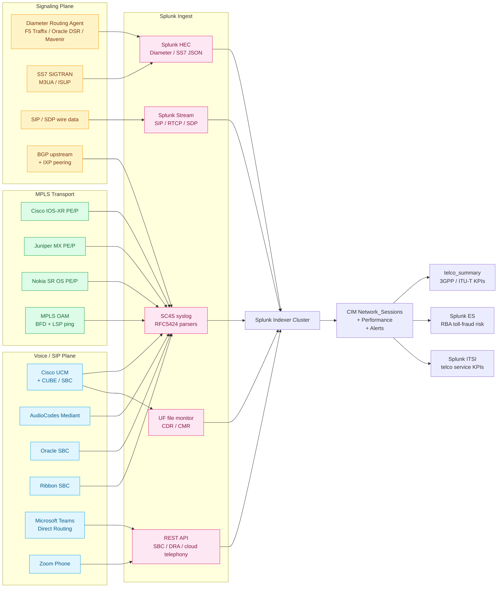

# Telco / Service Provider Networking Integration Guide

> Operational, security, and regulatory monitoring for the **carrier
> and service provider signaling plane** (Diameter, SS7, SIP, BGP
> upstream / IXP, PSTN / SIP gateway, SBC / CUBE, cat 5.10), the
> **telecommunications voice plane** (CDR, MOS / RTCP-XR voice
> quality, toll fraud, trunk groups, voicemail, cat 5.12), and the
> **MPLS service-provider transport plane** (LSP, LDP, RSVP-TE,
> PE-CE BGP, VRF, MPLS L3VPN, cat 5.18). Companion guide to
> `cisco-networks.md` (cat 5.1), `network-flow.md` (cat 5.7),
> `wireless-infrastructure.md` (cat 5.4), `dns-dhcp.md` (cat 5.6),
> and `industry-verticals.md` (cat 21 telco vertical).

## Table of Contents

- [Quick Start — From Zero to First Telco Dashboard](#quick-start--from-zero-to-first-telco-dashboard)
- [Overview](#overview)
- [Architecture and Data Flow](#architecture-and-data-flow)
- [Prerequisites](#prerequisites)
- [Domain 1 — Carrier Signaling (cat 5.10, 15 UCs)](#domain-1--carrier-signaling-cat-510-15-ucs)
- [Domain 2 — Telecom & CDR Analytics (cat 5.12, 15 UCs)](#domain-2--telecom--cdr-analytics-cat-512-15-ucs)
- [Domain 3 — MPLS Service-Provider Transport (cat 5.18, 9 UCs)](#domain-3--mpls-service-provider-transport-cat-518-9-ucs)
- [Sizing and Capacity Planning](#sizing-and-capacity-planning)
- [Compliance and Audit Evidence Pack](#compliance-and-audit-evidence-pack)
- [Crawl / Walk / Run Roadmap](#crawl--walk--run-roadmap)
- [Dashboards](#dashboards)
- [SPL Examples](#spl-examples)
- [Troubleshooting](#troubleshooting)
- [SOAR Playbooks](#soar-playbooks)
- [Cross-Product Integration](#cross-product-integration)

## Quick Start — From Zero to First Telco Dashboard

### Day 1: Inventory the telecom estate

| Layer | Common products |
|---|---|
| Voice / SIP / Unified Communications | Cisco UCM, CUBE / SBC, AudioCodes Mediant, Oracle SBC, Ribbon SBC, Asterisk / FreePBX, Microsoft Teams Direct Routing, Zoom Phone |
| Signaling | Diameter (S6a/Gx/Sx/Sh), SS7 SIGTRAN/M3UA, SIP/SDP, ENUM/E.164 |
| Carrier transport | MPLS LSP/LDP/RSVP-TE, PE-CE BGP, VRF L3VPN |
| Mobile / 4G / 5G | DRA, PCRF/PCF, MME, AMF, SMF, UPF, HSS, UDM, AUSF |
| BGP peering | Upstream transit, IXP peering, RPKI ROV, MANRS posture |

### Day 2: Stand up the indexes

```ini
[telco]
homePath = $SPLUNK_DB/telco/db
coldPath = $SPLUNK_DB/telco/colddb
thawedPath = $SPLUNK_DB/telco/thaweddb
maxDataSize = auto_high_volume
frozenTimePeriodInSecs = 31536000

[telco_summary]
homePath = $SPLUNK_DB/telco_summary/db
coldPath = $SPLUNK_DB/telco_summary/colddb
thawedPath = $SPLUNK_DB/telco_summary/thaweddb
maxDataSize = auto
frozenTimePeriodInSecs = 220752000

[cdr]
homePath = $SPLUNK_DB/cdr/db
coldPath = $SPLUNK_DB/cdr/colddb
thawedPath = $SPLUNK_DB/cdr/thaweddb
maxDataSize = auto_high_volume
frozenTimePeriodInSecs = 220752000
# CDR retention typically 7 years for billing reconciliation + lawful intercept

[mpls]
homePath = $SPLUNK_DB/mpls/db
coldPath = $SPLUNK_DB/mpls/colddb
thawedPath = $SPLUNK_DB/mpls/thaweddb
maxDataSize = auto_high_volume
frozenTimePeriodInSecs = 31536000

[signaling]
homePath = $SPLUNK_DB/signaling/db
coldPath = $SPLUNK_DB/signaling/colddb
thawedPath = $SPLUNK_DB/signaling/thaweddb
maxDataSize = auto_high_volume
frozenTimePeriodInSecs = 31536000
```

### Day 3: Splunk Connect for Syslog (SC4S) for carrier syslog

Cisco IOS-XR / Junos / Nokia SR OS routers ship structured syslog
(RFC5424) to SC4S TCP/6514. Custom parsers in
`/etc/syslog-ng/conf.d/local/parsers/`:

```text
parser p_mpls_lsp { 
  pcre {
    pattern("^.*MPLS-LSP-(?<lsp_event>UP|DOWN|PATH_CHANGE).*lsp_name=(?<lsp_name>[^,\\s]+).*head=(?<head>[\\d.]+).*tail=(?<tail>[\\d.]+).*");
  };
};
```

### Day 4: Cisco UCM CDR via UF file monitor

Cisco UCM writes CDR / CMR files to `/var/log/active/cm/cdr/CARChangeLog/`:

```ini
[monitor:///var/log/active/cm/cdr/CARChangeLog/cdr_*.csv]
sourcetype = cisco:ucm:cdr
index = cdr

[monitor:///var/log/active/cm/cdr/CARChangeLog/cmr_*.csv]
sourcetype = cisco:ucm:cmr
index = cdr
```

Apply CSV header mapping in `props.conf`:

```ini
[cisco:ucm:cdr]
INDEXED_EXTRACTIONS = csv
HEADER_FIELD_LINE_NUMBER = 1
TIMESTAMP_FIELDS = dateTimeOrigination
TIME_FORMAT = %s
```

### Day 5: Splunk Stream wire-data SIP/RTCP

Splunk Stream installed on a SPAN port near SBC / CUBE. Enable
`sip` and `rtcp` protocols:

```ini
[stream://sip]
protocol_type = sip
sourcetype = sip:invite
index = signaling

[stream://rtcp]
protocol_type = rtcp
sourcetype = rtcp:xr
index = voice_quality
```

### Day 6: Diameter signaling

DRA (F5 Traffix, Oracle DSR, Mavenir) export Diameter audit JSON to
HEC:

```bash
curl -X POST "https://hec.splunk.example.com:8088/services/collector/event" \
  -H "Authorization: Splunk $HEC_TOKEN" \
  -d '{"event": {...}, "sourcetype": "diameter:request", "index": "signaling"}'
```

### Day 7: First three dashboards

- Diameter signaling success rate (UC-5.10.1)
- CDR call failure breakdown (UC-5.12.1)
- MPLS LSP state changes (UC-5.18.1)

## Overview

### Why telco / SP networking matters

Telcos and service providers operate the most uptime-critical networks
in the world. Diameter signaling failures at a Tier-1 mobile operator
cost $200k/min in lost MOU + regulator scrutiny. MPLS LSP flap on a
service provider backbone breaks customer L3VPN circuits with SLA
penalty clauses. CDR pipeline failures break billing reconciliation
within hours and trigger CFO escalation. Splunk consolidates these
signals into one operational + regulatory + security pane.

For STIR/SHAKEN compliance (FCC TRACED Act, CRTC, Ofcom), every
SIP INVITE leg carries a SHAKEN PASSporT JWT claim that must be
verified, attested, and **logged for 6 months**. Splunk + this guide
captures that evidence.

For CALEA (Communications Assistance for Law Enforcement Act, US
47 CFR Part 1), every CDR + signaling event for a wiretapped
subscriber must be retained and made available to law-enforcement
agencies in a defined format. CDR retention of 7 years and signaling
of 18 months is industry standard.

### Why MPLS deserves dedicated coverage

MPLS isn't going away. Despite SD-WAN displacement at the edge,
service-provider backbones still run almost entirely on MPLS — VRF
L3VPN, EVPN-MPLS, and 6PE/6VPE for IPv6 transport. Operators need
end-to-end LSP visibility, RSVP-TE bandwidth utilization, LDP
adjacency stability, and PE-CE BGP health that ordinary enterprise
network monitoring can't provide. This guide treats MPLS as a
first-class subdomain.

### Why telecom CDR analytics is different from VoIP enterprise

Telecom CDR (5.12) operates at carrier scale: millions of calls/day
per OPCO, multi-vendor SBC fleets (CUBE + AudioCodes + Oracle +
Ribbon), and toll-fraud detection that must run in near-real-time
to limit financial loss. The data model overlaps with enterprise
unified-communications monitoring but the **scale, retention, and
toll-fraud business value** are different.

### Domains covered

| Sub | Name | UCs | Highlight |
|---|---|---|---|
| 5.10 | Carrier Signaling | 15 | Diameter, SS7, BGP upstream, IXP |
| 5.12 | Telecom & CDR Analytics | 15 | CDR, MOS, toll fraud, voicemail |
| 5.18 | MPLS Service-Provider WAN Transport | 9 | LSP, LDP, RSVP-TE, PE-CE BGP, VRF |

### What "good" looks like

| KPI | Healthy target | Source |
|---|---|---|
| Diameter signaling success rate | > 99.95% | DRA |
| MPLS LSP availability | > 99.99% per LSP | Cisco IOS-XR / Junos |
| CDR pipeline freshness | < 5 min lag | UF file monitor |
| MOS score | > 4.0 average | RTCP-XR |
| Toll-fraud detection MTTR | < 15 min | CDR analytics |
| BGP peering session stability | 0 unplanned flaps / 24h | Cisco / Junos / Nokia |
| RPKI ROV coverage | 100% of internet-facing prefixes | BGP |

## Architecture and Data Flow



### Core principles

1. **CDR retention = 7 years.** Billing reconciliation, lawful
   intercept (CALEA), tax audit, and fraud-reconciliation processes
   require 7 years across most jurisdictions.
2. **Signaling retention = 18 months.** Lawful intercept and
   regulator-driven retention for Diameter / SS7 / SIP signaling.
3. **MPLS LSP state-change retention = 1 year.** Operational forensics
   for SP customer SLA disputes typically have a 12-month window.
4. **SC4S handles RFC5424 carrier syslog.** Carrier-grade routers
   produce structured syslog; SC4S parses and routes correctly.
5. **Wire-data via Splunk Stream is for sampled QoE.** Full SIP /
   RTCP capture at carrier scale is not viable; sample 10-20% near
   SBC / CUBE for trending, full-detail capture for forensics on demand.
6. **3GPP TS 32.422 CDR format normalisation.** Different vendors
   produce slightly different CDR formats; normalise via `props.conf`
   FIELDALIAS into a CIM-compatible schema (`src_user`, `dest_user`,
   `duration`, `disposition`).
7. **STIR/SHAKEN PASSporT verification at the SBC.** Verify and log
   the PASSporT JWT attestation level (A, B, C) at every carrier
   border; non-A traffic gets risk-scored.

## Prerequisites

### Pre-deployment checklist

- [ ] Cisco UCM CDR enabled, CDR Repository service running
- [ ] CUBE / SBC syslog forwarding to SC4S configured
- [ ] DRA Diameter audit-log forwarding configured (F5 Traffix,
  Oracle DSR, or Mavenir)
- [ ] BGP looking-glass scrape script set up
- [ ] MPLS PE / P syslog + telemetry export to SC4S configured
- [ ] Splunk Stream installed on SPAN port near SBC / CUBE
- [ ] STIR/SHAKEN PASSporT verifier deployed on SBC
- [ ] CALEA wiretap collection appliance integrated with Splunk
  (separate index, separate ACL)
- [ ] CIM Network_Sessions + Performance + Alerts data models
  accelerated

### Splunk components used

- **Splunk Enterprise / Cloud**
- **Splunk App for Telecommunications** — telco-specific dashboards
  + KPI templates
- **Splunk Stream** — wire-data SIP / RTCP / SDP capture
- **Splunk ITSI<sup class="ref">[<a href="#ref-11">11</a>]</sup>** — service KPIs aligned to 3GPP TS 32.422 + ITU-T E.500
- **Splunk ES** — RBA toll-fraud detection, STIR/SHAKEN attestation
  scoring
- **Splunk SOAR** — toll-fraud auto-block, fraud-amount notification,
  STIR/SHAKEN low-attestation routing decisions
- **MLTK** — anomaly detection on CDR volume per source/destination
  pair, MOS score regression, MPLS LSP flap clustering

## Domain 1 — Carrier Signaling (cat 5.10, 15 UCs)

### Highlight UCs

- **UC-5.10.1** — Diameter Signaling Health Monitoring
- **UC-5.10.10** — BGP Community / AS-Path Anomaly from Upstream
- **UC-5.10.11** — Provider SLA Measurement (Latency, Jitter, Loss)
- **UC-5.10.12** — Carrier Maintenance Window Correlation
- **UC-5.10.13** — PSTN Gateway Health (Analog / PRI / SIP Gateway)
- **UC-5.10.14** — Internet Exchange Point (IXP) Peering Health

### Configuration — Diameter via DRA

Configure F5 Traffix / Oracle DSR / Mavenir to push Diameter audit
JSON to HEC:

```yaml
# Oracle DSR YAML config
audit:
  destination:
    - type: http
      url: https://hec.splunk.example.com:8088/services/collector/event
      auth_header: Splunk <HEC_TOKEN>
      sourcetype: diameter:request
      index: signaling
  filter:
    - command_codes: [305, 304, 309, 268]   # AAR, ASR, RAR, AIR
    - severity: error
```

### Configuration — BGP looking-glass scraper

```python
import requests, splunk_hec

LG_SOURCES = [
    "https://lg.he.net/?as=AS6939",
    "https://lg.tata.com/lg.cgi",
]

for src in LG_SOURCES:
    r = requests.get(src, params={"q": "show ip bgp neighbors 192.0.2.1"})
    splunk_hec.send(r.text, sourcetype="bgp:looking:glass:export", index="bgp_peering")
```

## Domain 2 — Telecom & CDR Analytics (cat 5.12, 15 UCs)

### Highlight UCs

- **UC-5.12.1** — CDR Call Failure Statistics
- **UC-5.12.10** — Toll Fraud Detection
- **UC-5.12.11** — Call Quality Metrics (MOS, Jitter, Packet Loss
  per Call Leg)
- **UC-5.12.12** — Trunk Group Utilization and All-Trunks-Busy
- **UC-5.12.13** — Voicemail System Health (Cisco Unity, Exchange UM)
- **UC-5.12.14** — SBC Registration Trending

### Configuration — Microsoft Teams CDR

Microsoft Graph API for Teams Communication Reports + Call Analytics:

```ini
[REST://teams_calling_audit]
endpoint = https://graph.microsoft.com/v1.0/communications/callRecords
auth_type = oauth2
oauth2_token_endpoint = https://login.microsoftonline.com/<TENANT_ID>/oauth2/v2.0/token
client_id = <APP_ID>
client_secret = <APP_SECRET>
scope = https://graph.microsoft.com/.default
polling_interval = 1800
sourcetype = microsoft:teams:cdr
index = cdr
```

### Configuration — Toll fraud detection lookup

```csv
country_code,iso_code,risk_class,reason
+228,TG,high,Togo - common toll-fraud destination
+247,AC,high,Ascension Island - premium destination
+672,AQ,critical,Antarctic - virtually no legitimate traffic
+509,HT,medium,Haiti - flagged for fraud spikes
+233,GH,medium,Ghana - intermittent fraud
```

### Configuration — RTCP-XR via SBC

Most modern SBCs support RTCP-XR (RFC 7005) export to a collector.
Configure CUBE / Oracle / Ribbon to send RTCP-XR statistics to a
Splunk Stream listener:

```bash
# Cisco CUBE config snippet
voice service voip
 sip
  rtcp-xr enable

ip stream
 export destination 10.0.0.1 udp 9999
```

## Domain 3 — MPLS Service-Provider Transport (cat 5.18, 9 UCs)

### Highlight UCs

- **UC-5.18.1** — LSP State Changes and Failures
- **UC-5.18.2** — LDP Neighbor Adjacency Monitoring
- **UC-5.18.3** — RSVP-TE Tunnel State and Bandwidth Reservation
- **UC-5.18.4** — PE-CE BGP Session Health (VRF-Aware)
- **UC-5.18.5** — MPLS Label Table Utilization
- **UC-5.18.6** — VRF Route Leaking Detection
- **UC-5.18.7** — MPLS Penultimate-Hop-Popping (PHP) Anomaly
- **UC-5.18.8** — MPLS QoS EXP-Bit Mismatch / DSCP Remapping Drift
- **UC-5.18.9** — BFD Session Flap Tracking

### Configuration — Cisco IOS-XR streaming telemetry

```ini
# IOS-XR YAML telemetry sensor
sensor-group SPLUNK_MPLS_SENSORS
 sensor-path Cisco-IOS-XR-mpls-te-oper:mpls-te/tunnels/tunnel-info
 sensor-path Cisco-IOS-XR-mpls-ldp-oper:mpls-ldp/global/active/default-vrf/discovery
 sensor-path Cisco-IOS-XR-bfd-oper:bfd/session-detail

destination-group SPLUNK_HEC
 vrf default
 address-family ipv4 10.0.0.1 port 5697
   encoding json
   protocol grpc

subscription SPLUNK_TELEMETRY
 sensor-group-id SPLUNK_MPLS_SENSORS sample-interval 30000
 destination-id SPLUNK_HEC
```

### Configuration — Junos OpenConfig telemetry

```yaml
# Junos OpenConfig MPLS sensor paths
sensors:
  - /network-instances/network-instance/mpls/lsps/static-lsps/static-lsp/state
  - /network-instances/network-instance/mpls/lsps/constrained-path/tunnels/tunnel/state
  - /network-instances/network-instance/protocols/protocol/ldp/global/state
  - /network-instances/network-instance/protocols/protocol/bgp/neighbors
```

### Configuration — VRF route-leak detection

```spl
index=mpls sourcetype=cisco:iosxr:syslog "VRF" ("LEAK" OR "INTRUSION")
| stats count by src_vrf, dst_vrf, prefix
| where count > 0
| eval alert = "VRF route leak detected — investigate"
```

## Sizing and Capacity Planning

| Source | Per-1k-router daily volume | Per-1k-router monthly storage |
|---|---|---|
| Carrier syslog (IOS-XR + Junos + Nokia) | 8 GB | 240 GB |
| MPLS streaming telemetry | 30 GB | 900 GB |
| BGP state changes + looking-glass | 1 GB | 30 GB |
| Diameter signaling | 50 GB / 1k subscribers | 1.5 TB |
| SS7 SIGTRAN | 30 GB / 1k subscribers | 900 GB |
| SIP wire data (Splunk Stream sampled 10%) | 100 GB / 1M calls/day | 3 TB |
| RTCP-XR | 5 GB / 1M calls/day | 150 GB |
| Cisco UCM CDR + CMR | 3 GB / 100k calls/day | 90 GB |
| Microsoft Teams CDR | 1 GB / 100k calls/day | 30 GB |
| SBC CDR (CUBE / AudioCodes / Oracle) | 5 GB / 100k calls/day | 150 GB |
| Voicemail (Unity / Exchange UM) | 200 MB / 1k mailboxes | 6 GB |

For a representative Tier-2 mobile operator with 5M subscribers and
20M calls/day: budget **~3-5 TB/day** indexed telco data depending on
sampling depth.

## Compliance and Audit Evidence Pack

### STIR/SHAKEN (FCC TRACED Act, CRTC, Ofcom)

UC-5.10.1 + UC-5.12.1 + UC-5.12.14 jointly produce per-call SHAKEN
attestation evidence. Retention: 6 months minimum.

### CALEA (US 47 CFR Part 1)

UC-5.10.x signaling + UC-5.12.x CDR produce the lawful-intercept
evidence trail. Retention: 7 years, separate ACL on `cdr` and
`signaling` indexes.

### GDPR Art. 5 + Art. 32

CDR is personal data. Pseudonymise telephone numbers at index time
via Splunk Edge Processor; retain mapping in a separate
HSM-protected lookup.

### ePrivacy Directive (EU 2002/58/EC, Art. 6)

Traffic data retention — UC-5.12.x CDR retention periods comply with
Member-State implementations of the Directive (typically 6-24
months for traffic data).

### NIS2 Annex II §a

Telecom is sector 2 (essential services). UC-5.10.1 + UC-5.18.1
incident-handling evidence directly required.

### DORA Art. 8

For telecom-as-financial-service-provider arrangements, UC-5.18.1
LSP availability KPI directly maps.

### MTR / FUM regulator submissions

Many regulators (Ofcom CISAS, ANATEL, ANRT) require monthly KPI
submissions. UC-5.10.11 + UC-5.12.11 + UC-5.18.x feed these reports.

### SOC 2 + ISO 27001 + ISO 27011

UC-5.10.x + UC-5.12.x + UC-5.18.x are evidence streams for ISO 27011
(telecom-specific extension to 27001).

### MANRS

UC-5.10.10 BGP community / AS-path anomaly + RPKI ROV coverage
demonstrate MANRS-compliant routing posture.

### 3GPP TS 32.422 CDR + 3GPP TS 32.299 Charging

UC-5.12.x CDR pipeline complies with 3GPP standardised formats.

### ITU-T E.500 Network Performance KPIs

UC-5.10.11 + UC-5.18.x map to ITU-T E.500 service-quality definitions.

## Crawl / Walk / Run Roadmap

### Crawl tier (9 UCs — week 1–4)

| UC | Title |
|---|---|
| 5.10.1 | Diameter Signaling Health |
| 5.10.13 | PSTN Gateway Health |
| 5.10.14 | IXP Peering Health |
| 5.12.1 | CDR Call Failure Statistics |
| 5.12.10 | Toll Fraud Detection |
| 5.12.12 | Trunk Group Utilization |
| 5.18.1 | MPLS LSP State Changes |
| 5.18.2 | LDP Neighbor Adjacency |
| 5.18.4 | PE-CE BGP Session Health |

### Walk tier (19 UCs — month 2–3)

Highlights:
- All Carrier Signaling UCs (5.10.x — Diameter command-code breakdown,
  BGP upstream anomaly, IXP peering, carrier maintenance correlation,
  SLA measurement)
- All Telecom CDR UCs (5.12.x — MOS quality, voicemail health, SBC
  registration trending, hunt group ACD)
- All MPLS UCs (5.18.x — RSVP-TE bandwidth, label table utilization,
  PHP anomaly, BFD flap, QoS EXP drift)

### Run tier (11 UCs — month 4+)

Highlights:
- ML-driven toll-fraud detection with MLTK Anomaly Detection
- ML-driven LSP flap clustering for proactive ticket creation
- STIR/SHAKEN attestation scoring + automated low-attestation routing
- ITU-T E.500 service-quality scorecard
- 3GPP TS 32.422 CDR full normalisation + multi-vendor reconciliation
- CALEA wiretap evidence pack auto-generation
- Regulator KPI auto-submission

## Dashboards

| Dashboard | Audience | Refresh |
|---|---|---|
| Telco Executive | CTO + COO + Regulator | 1h |
| Diameter Signaling Operations | NOC + DSR Team | 1 min |
| CDR & Voice Quality | Voice Operations | 5 min |
| Toll Fraud Triage | Fraud Team + SOC | 1 min |
| MPLS Operations | NOC + Backbone Engineering | 1 min |
| BGP Peering & RPKI | Internet Operations | 5 min |
| STIR/SHAKEN Attestation | Compliance + Regulator | 1h |

## SPL Examples

### Diameter signaling success-rate SLO

```spl
index=signaling sourcetype=diameter:request OR sourcetype=diameter:answer
| stats count(eval(sourcetype="diameter:request")) as requests,
        count(eval(sourcetype="diameter:answer" AND result_code<3000)) as success
        by command_code, span=5m
| eval success_rate = round(success/requests*100, 3)
| where success_rate < 99.95
| eval alert = "Diameter SLO breach"
```

### Toll fraud — high-cost destinations spike

```spl
index=cdr sourcetype=cisco:ucm:cdr OR sourcetype=cisco:cube:cdr
| eval country_code = case(
    match(dest_user, "^\\+228"), "TG",
    match(dest_user, "^\\+247"), "AC",
    match(dest_user, "^\\+672"), "AQ",
    match(dest_user, "^\\+509"), "HT")
| where country_code IN ("TG", "AC", "AQ", "HT")
| stats count, sum(duration) as total_duration by country_code, span=5m
| where count > 10
| eval alert = "Toll fraud spike to high-risk destination"
```

### MPLS LSP flap detection

```spl
index=mpls sourcetype=cisco:iosxr:syslog "MPLS-LSP-DOWN"
| stats count by lsp_name, head, tail, span=15m
| where count > 3
| eval alert = "MPLS LSP flap > 3 times in 15min — investigate"
```

## Troubleshooting

| Symptom | Likely cause | Fix |
|---|---|---|
| Diameter HEC empty | DRA audit destination not configured | DRA → Audit → HTTP destination |
| CDR pipeline lag growing | UF file monitor falling behind | Increase UF queues; partition by hour |
| MPLS telemetry empty | gRPC subscription not active | `show telemetry model-driven subscription` |
| MOS scores all 0 | RTCP-XR not enabled on SBC | Enable on CUBE/AudioCodes/Oracle config |
| BGP looking-glass scraper failing | LG site changed format | Update parser regex |
| STIR/SHAKEN PASSporT empty | SBC not verifying tokens | Enable PASSporT verification on SBC |
| SS7 ISUP missing | SIGTRAN gateway not exporting M3UA | Configure M3UA audit forwarding |
| BFD flap noise | Aggressive timers (50ms × 3) | Tune to 100ms × 3 minimum |

## SOAR Playbooks

### Playbook 1 — Toll fraud auto-block

```yaml
playbook: toll_fraud_auto_block
triggers:
  - notable_event: "Toll Fraud Spike"
phases:
  identify:
    - splunk_search:
        query: "index=cdr country_code=${notable.country_code} earliest=-1h"
  contain:
    - cube_block_destination_route_pattern: ${notable.country_code}
    - notify_billing:
        amount_at_risk: ${notable.total_cost}
  notify:
    - servicenow_create_ticket:
        category: "Toll Fraud"
        severity: 1
    - splunk_es_create_notable
```

### Playbook 2 — STIR/SHAKEN low-attestation routing

```yaml
playbook: shaken_low_attestation_route
triggers:
  - rule: "PASSporT attestation = C OR no PASSporT"
phases:
  enrich:
    - sti_pa_lookup: ${notable.calling_party}
  remediate:
    - cube_set_route_priority: low
    - cube_apply_call_treatment: spam_warning_announcement
  audit:
    - splunk_log_evidence: ${notable.shaken_evidence}
```

### Playbook 3 — MPLS LSP failover

```yaml
playbook: mpls_lsp_failover
triggers:
  - notable_event: "MPLS LSP Down"
phases:
  identify:
    - splunk_search:
        query: "index=mpls lsp_name=${notable.lsp_name}"
  remediate:
    - iosxr_activate_backup_lsp: ${notable.lsp_name}
  notify:
    - pagerduty_alert:
        urgency: critical
        service: "Backbone NOC"
    - jira_create_ticket:
        project: "BACKBONE"
        priority: high
```

## Cross-Product Integration

| Other guide | Relationship |
|---|---|
| `cisco-networks.md` (cat 5.1) | IOS / NX-OS / IOS-XR routers, switches, IGP |
| `sd-wan-network-management.md` (cat 5.5, 5.8) | vManage, Catalyst Center, Mist |
| `network-flow.md` (cat 5.7) | NetFlow / IPFIX |
| `wireless-infrastructure.md` (cat 5.4) | RAN backhaul + Wi-Fi calling |
| `dns-dhcp.md` (cat 5.6) | ENUM, DNS-SRV for SIP |
| `industry-verticals.md` (cat 21) | Telecommunications vertical |
| `vulnerability-management.md` (cat 10.6) | Service-provider CVE patching |
| `siem-soar.md` (cat 10.7) | Telco fraud detection RBA |
| `splunk-itsi.md` (cat 13.2) | Telco service KPIs (3GPP TS 32.422) |
| `splunk-observability-cloud.md` (cat 13.4) | RAN, Core, Edge SLO |
| `regulatory-compliance-master.md` (cat 22) | STIR/SHAKEN, CALEA, NIS2<sup class="ref">[<a href="#ref-3">3</a>]</sup>, regulators |

---

**Document maintenance.** Reviewed quarterly against vendor + 3GPP +
ITU-T release notes. Last verified against:
- Splunk Enterprise 9.4
- Splunk App for Telecommunications current
- Splunk Add-on for Cisco IOS 4.x
- Splunk Add-on for Juniper 1.x
- Splunk Stream 8.0
- SC4S 3.0
- Cisco IOS-XR 7.10.x
- Junos 23.x
- Nokia SR OS 23.x
- Cisco UCM 14.x
- Cisco CUBE 17.x
- Oracle SBC 9.x
- AudioCodes Mediant 7.40
- Ribbon SBC 11.x
- Microsoft Teams Direct Routing — current
- 3GPP TS 32.422 + TS 32.299
- ITU-T E.500
- FCC TRACED Act + RFC 8224 (PASSporT)

For corrections or additions, file an issue with `cat-5.10`,
`cat-5.12`, or `cat-5.18` labels.

---

<!-- BEGIN-AUTOGENERATED-SOURCES -->

## References

*Auto-generated by `scripts/generate_doc_references.py` from `data/source-references.json` and `data/source-mappings.json`. Edit those files (or the document body) to change citations; this footer is rewritten on every run.*

### Supporting sources

<a id="ref-1"></a>**[1]** American Institute of Certified Public Accountants. (2017). *Trust Services Criteria (2017) for Security, Availability, Processing Integrity, Confidentiality, and Privacy*. AICPA & CIMA. SOC 2 / TSP Section 100. https://www.aicpa-cima.com/topic/audit-assurance/soc-suite-of-services

<a id="ref-2"></a>**[2]** Cisco Systems, Inc. (2026). *Cisco Catalyst SD-WAN Documentation*. Retrieved May 11, 2026, from https://www.cisco.com/c/en/us/support/routers/sd-wan/series.html

<a id="ref-3"></a>**[3]** European Parliament and Council of the European Union. (2022, December). *Directive (EU) 2022/2555 — NIS2 Directive on cybersecurity*. Official Journal of the European Union, L 333. ELI: dir/2022/2555. https://eur-lex.europa.eu/eli/dir/2022/2555/oj

<a id="ref-4"></a>**[4]** European Parliament and Council of the European Union. (2016, April). *Regulation (EU) 2016/679 — General Data Protection Regulation*. Official Journal of the European Union, L 119. ELI: reg/2016/679. https://eur-lex.europa.eu/eli/reg/2016/679/oj

<a id="ref-5"></a>**[5]** European Parliament and Council of the European Union. (2022, December). *Regulation (EU) 2022/2554 — Digital Operational Resilience Act (DORA)*. Official Journal of the European Union, L 333. ELI: reg/2022/2554. https://eur-lex.europa.eu/eli/reg/2022/2554/oj

<a id="ref-6"></a>**[6]** Gerhards, R. (2009, March). *The Syslog Protocol*. Internet Engineering Task Force. RFC 5424. https://www.rfc-editor.org/rfc/rfc5424

<a id="ref-7"></a>**[7]** International Organization for Standardization. (2022). *ISO/IEC 27001:2022 — Information security, cybersecurity and privacy protection — Information security management systems — Requirements*. ISO/IEC. ISO/IEC 27001:2022. https://www.iso.org/standard/27001

<a id="ref-8"></a>**[8]** Jones, M., Bradley, J., & Sakimura, N. (2015, May). *JSON Web Token (JWT)*. Internet Engineering Task Force. RFC 7519. https://www.rfc-editor.org/rfc/rfc7519

<a id="ref-9"></a>**[9]** Splunk Inc. (2026). *Splunk Common Information Model Add-on Manual*. Splunk LLC, a Cisco company. Retrieved May 11, 2026, from https://docs.splunk.com/Documentation/CIM

<a id="ref-10"></a>**[10]** Splunk Inc. (2026). *Splunk Infrastructure Monitoring Documentation*. Splunk LLC, a Cisco company. Retrieved May 11, 2026, from https://docs.splunk.com/observability/en/infrastructure/intro-to-infrastructure.html

<a id="ref-11"></a>**[11]** Splunk Inc. (2026). *Splunk IT Service Intelligence Administration Manual*. Splunk LLC, a Cisco company. Retrieved May 11, 2026, from https://docs.splunk.com/Documentation/ITSI

<details>
<summary>Additional online sources cited in the document body (3)</summary>

<a id="ref-12"></a>**[12]** splunkbase.splunk.com. *Splunkbase app #1809*. Retrieved May 11, 2026, from https://splunkbase.splunk.com/app/1809

<a id="ref-13"></a>**[13]** splunkbase.splunk.com. *Splunkbase*. Retrieved May 11, 2026, from https://splunkbase.splunk.com/

<a id="ref-14"></a>**[14]** splunkbase.splunk.com. *Splunkbase app #7719*. Retrieved May 11, 2026, from https://splunkbase.splunk.com/app/7719

</details>

<!-- END-AUTOGENERATED-SOURCES -->
