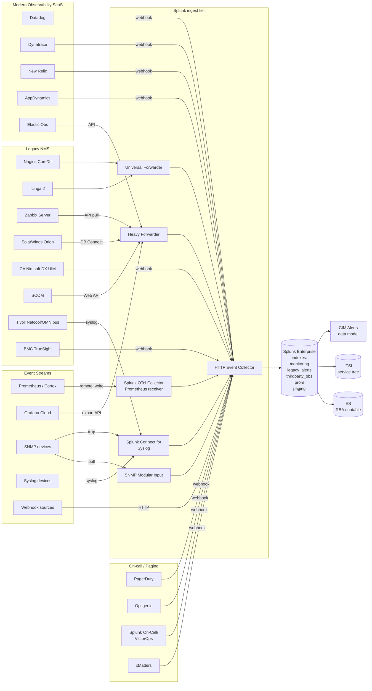

# Third-Party Monitoring Integration Guide

> The definitive guide to consolidating legacy NMS, modern observability
> SaaS, paging, and event-stream tools into Splunk. 19 use cases
> across cat 13.3 covering legacy Nagios/Zabbix/Icinga/SolarWinds/SCOM
> alert ingestion + dedup, modern Datadog/Dynatrace/New Relic event
> bridges, Prometheus + OpenMetrics scrape and remote-write, Grafana
> Cloud export, SNMP trap receiver health, Splunk Connect for Syslog
> (SC4S), webhook ingestion, and on-call paging integration with
> PagerDuty, Opsgenie, and Splunk On-Call.

---

## Table of Contents

- [Quick Start](#quick-start)
- [Overview](#overview)
- [Architecture](#architecture)
- [Prerequisites](#prerequisites)
- [Tool Coverage Matrix](#tool-matrix)
- [Legacy NMS Bridges](#legacy-nms)
  - [Nagios (Core, XI)](#nagios)
  - [Icinga 2](#icinga)
  - [Zabbix](#zabbix)
  - [SolarWinds NPM/SAM/NCM](#solarwinds)
  - [CA Nimsoft DX UIM](#nimsoft)
  - [Microsoft SCOM](#scom)
  - [IBM Tivoli Netcool/OMNIbus](#tivoli)
  - [BMC TrueSight](#bmc)
- [Modern Observability SaaS](#modern-saas)
  - [Datadog](#datadog)
  - [Dynatrace](#dynatrace)
  - [New Relic](#newrelic)
  - [AppDynamics](#appd)
  - [Elastic Observability](#elastic)
- [Prometheus and OpenMetrics](#prometheus)
- [Grafana Cloud Export](#grafana-cloud)
- [SNMP Traps and Polling](#snmp)
- [Splunk Connect for Syslog (SC4S)](#sc4s)
- [Webhook Ingestion to HEC](#webhooks)
- [Paging and On-Call Integration](#paging)
  - [PagerDuty](#pagerduty)
  - [Opsgenie](#opsgenie)
  - [Splunk On-Call (VictorOps)](#splunk-oncall)
  - [xMatters](#xmatters)
- [Messaging Tools](#messaging)
- [Splunk-Side Configuration](#splunk-config)
- [Field Dictionary](#field-dictionary)
- [Sample Events](#sample-events)
- [CIM Alerts Data Model Mapping](#cim-mapping)
- [Cross-Tool Deduplication](#dedup)
- [Heartbeat and Source Health](#heartbeat)
- [Cross-Product Correlation](#cross-product)
- [Capacity Planning](#sizing)
- [Recommended Dashboard Layouts](#dashboards)
- [ITSI Integration](#itsi)
- [SOAR Playbook Examples](#soar)
- [Migration Patterns](#migration)
- [Security Hardening](#security-hardening)
- [Crawl / Walk / Run Roadmap](#roadmap)
- [Validation Checklist](#validation-checklist)
- [Known Limitations](#known-limitations)
- [Troubleshooting](#troubleshooting)
- [FAQ](#faq)
- [Glossary](#glossary)
- [References](#references)
- [Contribution and Feedback](#contribution)

---

<a id="quick-start"></a>
## Quick Start — 30 Minutes per Tool

### 1. Pick a tool and integration mode

| Tool | Best mode |
|---|---|
| Nagios Core/XI | UF tail of `nagios.log` + `host/service_perfdata` |
| Icinga 2 | UF tail of `icinga2.log` + ido2db perfdata file |
| Zabbix | Zabbix Add-on (HEC pull from Zabbix API) |
| SolarWinds NPM | SolarWinds Add-on (DB Connect to Orion DB) |
| SCOM | Operations Manager Web API + scheduled HTTP modular input |
| Nimsoft DX UIM | UMP webhook → HEC |
| Datadog | Webhook destination → HEC |
| Dynatrace | Problem notification → webhook → HEC + OneAgent OTel exporter |
| New Relic | Alert webhook → HEC + Insights Events API pull |
| Prometheus | Remote-write receiver in OTel Collector |
| SNMP traps | SC4S or `snmptrapd` → SC4S → HEC |
| Syslog | SC4S (always SC4S in 2026 — no exceptions) |
| PagerDuty | Webhook to HEC + REST API for acknowledgements |

### 2. Land in dedicated indexes

```spl
| makeindex monitoring legacy_alerts thirdparty_obs paging
```

### 3. Reconcile with Splunk's CIM Alerts data model

```spl
index=monitoring sourcetype=*
| eval signature=coalesce(check_name, problem_name, alert_name, "unknown")
| `cim_alerts_field_mapping`
```

### 4. Activate crawl tier

UC-13.3.1 (Legacy NMS reconciliation), UC-13.3.5 (Cross-paging
storm detection), UC-13.3.10 (Datadog/Dynatrace event normalization),
UC-13.3.15 (OTel collector backpressure).

---

<a id="overview"></a>
## Overview

### Why integrate third-party monitoring with Splunk

Most enterprises run a heterogeneous monitoring estate accumulated
over a decade. Nagios for ping checks, SolarWinds for network, SCOM
for Windows, Datadog for cloud, Prometheus for Kubernetes, PagerDuty
for paging. **No single tool sees everything.** Without consolidation:

- Operators tab between 6 consoles during an incident
- Duplicate alerts page two on-calls for the same outage
- A "silent" tool (e.g., Nagios stopped checking) goes unnoticed for hours
- Audit reports cannot answer "did we receive any alert about X at 14:32?"
- Tool migrations (e.g., SolarWinds → ITSI) lack a parallel-run reference

### What Splunk provides

| Capability | Outcome |
|---|---|
| **One alert event index** (`index=monitoring`) | Single search across all tools |
| **CIM Alerts normalization** | Identical SPL across vendors |
| **Cross-tool dedup** by `correlation_key` | One incident, not seven pages |
| **Heartbeat health per source** | Detect silent tools |
| **ITSI service tree absorbs all signals** | One health score regardless of tool |
| **SOAR playbooks** call back to source tool API | Acknowledge in Nagios from Splunk |

### What's NOT in scope

| Domain | Where to look |
|---|---|
| Splunk Observability Cloud (APM/RUM/IM SaaS) | [Splunk Observability Cloud Guide](splunk-observability-cloud.md) |
| Splunk-internal platform health | [Splunk Platform Health Guide](splunk-platform-health.md) |
| ITSM integration deep dive | [Service Management & ITSM Guide](service-management-itsm.md) |
| AI/LLM observability | [AI & LLM Observability Guide](ai-llm-observability.md) |

---

<a id="architecture"></a>
## Architecture



### Data flow patterns

| Pattern | Tools | Trade-off |
|---|---|---|
| **Push (webhook → HEC)** | Datadog, Dynatrace, New Relic, PagerDuty, Opsgenie, BMC, Nimsoft | Lowest latency; tool drives schedule |
| **Pull (API → HF)** | Zabbix, SCOM Web API, New Relic Insights, Datadog Events API | Predictable load; can backfill |
| **Tail file (UF)** | Nagios `nagios.log`, Icinga `icinga2.log`, perfdata files | Simple; needs file rotation handled |
| **DB Connect (DBX)** | SolarWinds Orion DB | Slower; requires DB credentials |
| **Syslog** (SC4S) | Tivoli, BMC, network gear, anything with syslog | Universal; SC4S handles parsing |
| **SNMP traps** | Network gear, UPS, environmental | Use SC4S since 2024 |
| **Prometheus remote_write** | Prometheus, Cortex, Mimir, Thanos | Native OTel Collector receiver |

---

<a id="prerequisites"></a>
## Prerequisites

| Item | Notes |
|---|---|
| **Splunk Enterprise** ≥ 9.0 (recommended 9.4) | Edge Processor available for inline filtering |
| **HEC token(s)** | Per-tool tokens for accountability and rate limiting |
| **Indexes** | `monitoring`, `legacy_alerts`, `thirdparty_obs`, `prom`, `paging` (events); `prom_metrics` (metric) |
| **SC4S** ≥ 3.40 | For all syslog and SNMP trap (replaces UF syslog input) |
| **Splunk OTel Collector** ≥ 0.110 | For Prometheus remote_write reception |
| **DBX (Splunk DB Connect)** ≥ 3.16 | For SolarWinds Orion DB pulls |
| **Inventory CSV** (`legacy_nms_host_inventory.csv`) | Crucial for cross-tool host correlation |

### Required field normalization

Every alert event landed in Splunk should be normalized to:

| Splunk field | Source mapping |
|---|---|
| `dest` | hostname being monitored |
| `signature` | check name / problem name |
| `severity` | `critical`/`high`/`medium`/`low`/`info` |
| `severity_id` | numeric 1-5 (5 worst) |
| `status` | `triggered` / `acknowledged` / `resolved` |
| `vendor_product` | `nagios` / `zabbix` / `datadog` etc. |
| `correlation_key` | `md5(host || check)` for dedup |

---

<a id="tool-matrix"></a>
## Tool Coverage Matrix

| Tool | Splunk integration | Data model | Latency | Bidirectional |
|---|---|---|---|---|
| **Nagios Core / XI** | UF + perfdata | Alerts | <60s | API ack possible |
| **Icinga 2** | UF + ido2db | Alerts | <60s | REST ack |
| **Zabbix** | Zabbix Add-on (API) | Alerts | <5min | API ack |
| **SolarWinds NPM/SAM/NCM** | SolarWinds Add-on (DB Connect) | Alerts | 5min poll | n/a |
| **CA Nimsoft DX UIM** | UMP webhook → HEC | Alerts | <60s | n/a |
| **SCOM** | Web API + modular input | Alerts | 5min | PowerShell ack |
| **Tivoli Netcool/OMNIbus** | Syslog → SC4S | Alerts | <30s | n/a |
| **BMC TrueSight** | Webhook → HEC | Alerts | <60s | REST ack |
| **Datadog** | Webhook + Events API | Alerts | <30s | n/a |
| **Dynatrace** | Problem webhook + OneAgent OTel | Alerts | <30s | API ack |
| **New Relic** | Webhook + Insights Events API | Alerts | <30s | n/a |
| **AppDynamics** | Splunk_TA_AppDynamics | Alerts, Performance | <60s | n/a |
| **Elastic Observability** | Filebeat-to-Splunk module | Alerts | <60s | n/a |
| **Prometheus** | OTel Collector remote_write | Metrics | realtime | n/a |
| **Grafana Cloud** | Logs/Metrics export API | Logs/Metrics | <60s | n/a |
| **PagerDuty** | Webhook + REST API | Alerts | <30s | API ack |
| **Opsgenie** | Webhook + REST API | Alerts | <30s | API ack |
| **Splunk On-Call** | Native + REST API | Alerts | <30s | API ack |
| **xMatters** | Webhook | Alerts | <30s | n/a |

---

<a id="legacy-nms"></a>
## Legacy NMS Bridges

<a id="nagios"></a>
### Nagios (Core, XI)

#### What to ingest

| File | Purpose |
|---|---|
| `nagios.log` | State changes (host UP/DOWN, service OK/CRITICAL/WARNING/UNKNOWN) |
| `host_perfdata.dat` | Per-host performance metrics |
| `service_perfdata.dat` | Per-service performance metrics |
| `objects.cache` | Inventory of hosts and services (load via lookup) |

#### inputs.conf

```ini
[monitor:///usr/local/nagios/var/nagios.log]
sourcetype = nagios:nagios.log
index = monitoring
disabled = 0

[monitor:///usr/local/nagios/var/host_perfdata.dat]
sourcetype = nagios:host_perfdata
index = monitoring
disabled = 0

[monitor:///usr/local/nagios/var/service_perfdata.dat]
sourcetype = nagios:service_perfdata
index = monitoring
disabled = 0
```

#### props.conf — sourcetype recipes

```ini
[nagios:nagios.log]
TIME_PREFIX = ^\[
TIME_FORMAT = %s
SHOULD_LINEMERGE = false
EXTRACT-state = (?:HOST|SERVICE) ALERT: (?<host>[^;]+);(?<service>[^;]*?);?(?<state>OK|UP|WARNING|CRITICAL|DOWN|UNKNOWN);(?<state_type>[^;]+);(?<attempts>\d+);(?<output>.*)
EVAL-severity = case(state="OK" OR state="UP", "info", state="WARNING", "medium", state="CRITICAL" OR state="DOWN", "high", state="UNKNOWN", "low", 1==1, "info")
EVAL-vendor_product = "nagios"
FIELDALIAS-cim = host AS dest, service AS signature
```

#### Bidirectional acknowledgement

Use Nagios's external command file (`/usr/local/nagios/var/rw/nagios.cmd`)
or NagiosXI REST API to acknowledge from Splunk SOAR.

<a id="icinga"></a>
### Icinga 2

#### What to ingest

| File | Purpose |
|---|---|
| `icinga2.log` | Server log including check transitions |
| `service-perfdata` (via PerfDataWriter) | Performance data |

Or use the **API** (Icinga2 REST):

```bash
curl -k -s -u root:icinga \
    'https://icinga.example.com:5665/v1/objects/services?attrs=last_state&attrs=name'
```

#### Splunk side

```ini
[monitor:///var/log/icinga2/icinga2.log]
sourcetype = icinga2:event
index = monitoring
```

```ini
[icinga2:event]
SHOULD_LINEMERGE = false
EXTRACT-state = service .*?\!(?<service>[^!]+) state=(?<state>OK|WARNING|CRITICAL|UNKNOWN)
EVAL-severity = case(state="OK", "info", state="WARNING", "medium", state="CRITICAL", "high", state="UNKNOWN", "low")
EVAL-vendor_product = "icinga2"
```

<a id="zabbix"></a>
### Zabbix

#### Zabbix Add-on for Splunk (Splunkbase 6037)

REST API pull from Zabbix → land as `sourcetype=zabbix:problem`.

```ini
# inputs.conf for Zabbix Add-on
[zabbix://prod-zabbix]
url = https://zabbix.example.com
username = splunk-reader
password = <encrypted>
interval = 60
zabbix_index = monitoring
```

Configurable endpoints:

- `/api_jsonrpc.php` `problem.get` — open and resolved problems
- `/api_jsonrpc.php` `event.get` — historical events
- `/api_jsonrpc.php` `alert.get` — actions taken
- `/api_jsonrpc.php` `host.get` + `template.get` — inventory

#### Field mapping

```ini
[zabbix:problem]
EVAL-severity = case(severity_id=5, "critical", severity_id=4, "high", severity_id=3, "medium", severity_id=2, "low", 1==1, "info")
EVAL-vendor_product = "zabbix"
FIELDALIAS-cim-1 = host AS dest, name AS signature
FIELDALIAS-cim-2 = trigger_name AS signature
```

<a id="solarwinds"></a>
### SolarWinds NPM/SAM/NCM

#### Splunk Add-on for SolarWinds (Splunkbase 1923)

DB Connect-based pull from Orion's SQL Server DB:

```sql
-- Sample: alerts last 5 min
SELECT
    ah.AlertActiveID,
    ao.EntityType,
    ao.EntityCaption AS host,
    a.Name AS alert_name,
    a.Severity AS sev_num,
    ah.TriggeredDateTime,
    ah.Acknowledged,
    ah.AcknowledgedBy,
    ah.AcknowledgedDateTime
FROM AlertActive aa
INNER JOIN AlertHistory ah ON ah.AlertActiveID = aa.AlertActiveID
INNER JOIN AlertObjects ao ON ao.AlertObjectID = aa.AlertObjectID
INNER JOIN AlertConfigurations a ON a.AlertID = ao.AlertID
WHERE ah.TriggeredDateTime > DATEADD(MINUTE, -5, GETUTCDATE())
ORDER BY ah.TriggeredDateTime DESC
```

#### Field mapping

```ini
[solarwinds:event]
EVAL-severity = case(sev_num=4, "critical", sev_num=3, "high", sev_num=2, "medium", sev_num=1, "low", 1==1, "info")
EVAL-vendor_product = "solarwinds_npm"
```

NetFlow ingestion via `solarwinds:netflow` is a separate sourcetype
for flow data; alert events come via the DB query above.

<a id="nimsoft"></a>
### CA Nimsoft DX UIM

UMP (Unified Management Portal) webhook → HEC:

```bash
# In UMP: Settings → Notifications → Add Webhook
URL: https://hec.splunk.example.com:8088/services/collector
Headers:
  Authorization: Splunk <HEC_TOKEN>
  Content-Type: application/json
Method: POST
Payload (JSON):
{
  "time": "${alarm.created}",
  "host": "${alarm.robot}",
  "source": "nimsoft",
  "sourcetype": "nimsoft:alarm",
  "index": "monitoring",
  "event": {
    "robot": "${alarm.robot}",
    "probe": "${alarm.probe}",
    "severity": "${alarm.severity}",
    "alarm_msg": "${alarm.message}",
    "supp_key": "${alarm.suppression_key}"
  }
}
```

<a id="scom"></a>
### Microsoft SCOM

The legacy `Splunk_TA_microsoft-scom` is deprecated. Modern path is
**SCOM Web API** + scheduled HTTP modular input:

```bash
# scheduled HTTP input pulling SCOM alerts
GET https://scom.example.com/OperationsManager/data/alert?criteria=ResolutionState%20!=%20255
```

Authentication: Windows Integrated (use `requests-kerberos`) or Basic
with a SCOM service account.

```ini
[scom:alert]
EVAL-severity = case(Severity="Error", "critical", Severity="Warning", "medium", Severity="Information", "info", 1==1, "low")
EVAL-vendor_product = "scom"
FIELDALIAS-cim-1 = MonitoringObjectDisplayName AS dest, AlertName AS signature
```

<a id="tivoli"></a>
### IBM Tivoli Netcool/OMNIbus

Syslog forwarding via OMNIbus syslog gateway → SC4S → HEC:

```ini
# /etc/syslog-ng/conf.d/local/app-tivoli.conf (SC4S addon)
filter f_tivoli {
  match("OMNIbus" value("MSG"));
};

destination d_splunk_tivoli {
  splunk-hec(
    url("https://hec.splunk.example.com:8088/services/collector")
    token("...")
    index("monitoring")
    sourcetype("tivoli:omnibus")
  );
};

log {
  source(s_DEFAULT);
  filter(f_tivoli);
  destination(d_splunk_tivoli);
};
```

<a id="bmc"></a>
### BMC TrueSight (Patrol)

Webhook → HEC. Configure TrueSight Notification Server → New Recipient
→ HTTP POST to HEC URL.

---

<a id="modern-saas"></a>
## Modern Observability SaaS

<a id="datadog"></a>
### Datadog

Two paths — **events** (alerts) and **metrics** (sampled, optional).

#### Datadog Webhook (alerts only) — RECOMMENDED

```yaml
# Datadog Integrations → Webhooks → New Webhook
Name: splunk-hec
URL: https://hec.splunk.example.com:8088/services/collector
Custom headers:
  Authorization: Splunk <HEC_TOKEN>
Payload (Datadog @-mention syntax):
{
  "time": "$EVENT_TIME",
  "host": "$HOSTNAME",
  "source": "datadog",
  "sourcetype": "datadog:event",
  "index": "thirdparty_obs",
  "event": {
    "alert_id": "$ID",
    "alert_title": "$EVENT_TITLE",
    "alert_message": "$EVENT_MSG",
    "alert_status": "$ALERT_STATUS",
    "alert_priority": "$PRIORITY",
    "alert_url": "$LINK",
    "alert_type": "$ALERT_TYPE",
    "alert_org": "$ORG_NAME",
    "alert_metric_query": "$ALERT_METRIC_QUERY",
    "alert_tags": "$TAGS"
  }
}
```

#### Datadog Events API pull (for backfill / batch)

```python
import requests
headers = {"DD-API-KEY": DD_KEY, "DD-APPLICATION-KEY": DD_APP_KEY}
resp = requests.get('https://api.datadoghq.com/api/v1/events',
                    params={'start': start, 'end': end},
                    headers=headers)
events = resp.json()['events']
# POST to HEC
```

#### Field mapping

```ini
[datadog:event]
EVAL-severity = case(alert_priority="P1" OR alert_status="Triggered", "critical",
                     alert_priority="P2", "high",
                     alert_priority="P3", "medium",
                     alert_status="Recovered", "info", 1==1, "low")
EVAL-vendor_product = "datadog"
FIELDALIAS-cim-1 = HOSTNAME AS dest, alert_title AS signature
```

<a id="dynatrace"></a>
### Dynatrace

#### Problem notification webhook

```json
POST https://hec.splunk.example.com:8088/services/collector
Headers:
  Authorization: Splunk <HEC_TOKEN>
Body:
{
  "time": "{ImpactedEntities[0]Time}",
  "source": "dynatrace",
  "sourcetype": "dynatrace:problem",
  "index": "thirdparty_obs",
  "event": {
    "ProblemID": "{ProblemID}",
    "PID": "{PID}",
    "ProblemTitle": "{ProblemTitle}",
    "ProblemSeverity": "{ProblemSeverity}",
    "ProblemImpact": "{ProblemImpact}",
    "ImpactedEntities": "{ImpactedEntities}",
    "ProblemURL": "{ProblemURL}",
    "Tags": "{Tags}"
  }
}
```

#### Dynatrace OneAgent OTel exporter

For metrics and traces, OneAgent supports OTLP export. Configure to
point at the Splunk OTel Collector gateway.

<a id="newrelic"></a>
### New Relic

#### Alert webhook

```yaml
URL: https://hec.splunk.example.com:8088/services/collector
Headers:
  Authorization: Splunk <HEC_TOKEN>
Payload:
{
  "time": "{{updatedAt}}",
  "source": "newrelic",
  "sourcetype": "newrelic:alert",
  "index": "thirdparty_obs",
  "event": {{ json data }}
}
```

#### Insights Events API (for backfill / arbitrary NRQL)

```bash
curl -X POST \
    -H "Accept: application/json" \
    -H "X-Query-Key: NEW_RELIC_QUERY_KEY" \
    -H "Content-Type: application/json" \
    "https://insights-api.newrelic.com/v1/accounts/<ACCOUNT_ID>/query?nrql=SELECT+*+FROM+Transaction+SINCE+1+hour+ago"
```

<a id="appd"></a>
### AppDynamics

Splunk_TA_AppDynamics (Splunkbase 4533) — REST polling:

```ini
[appd_input]
controller_host = appd-controller.example.com
controller_port = 443
account = customer1
username = splunk-reader
password = <encrypted>
api_endpoint = /controller/rest/applications
interval = 300
```

Lands as `sourcetype=appd:event`, `appd:metric`, `appd:health_violation`.

<a id="elastic"></a>
### Elastic Observability

```bash
# Pull from Elastic via the search API
curl -X GET "elastic.example.com:9200/.alerts-observability.metrics.alerts-default/_search" \
     -H 'Content-Type: application/json' \
     -d '{"query": {"range": {"@timestamp": {"gte": "now-5m"}}}}'
```

Output → POST to Splunk HEC as `sourcetype=elastic:apm`.

---

<a id="prometheus"></a>
## Prometheus and OpenMetrics

### Pattern A: Prometheus → Splunk OTel Collector (remote_write receiver)

```yaml
# Prometheus side: prometheus.yml
remote_write:
  - url: http://splunk-otel-gateway:9090/api/v1/write
    queue_config:
      max_samples_per_send: 5000
      capacity: 10000
```

```yaml
# OTel Collector receiver
receivers:
  prometheusremotewrite:
    endpoint: 0.0.0.0:9090

exporters:
  splunk_hec/metrics:
    token: ${env:SPLUNK_HEC_TOKEN}
    endpoint: https://hec.splunk.example.com:8088/services/collector
    index: prom_metrics
    source: prometheus

service:
  pipelines:
    metrics:
      receivers: [prometheusremotewrite]
      processors: [memory_limiter, batch]
      exporters: [splunk_hec/metrics]
```

### Pattern B: OTel Collector scrapes Prometheus exporters directly

```yaml
receivers:
  prometheus:
    config:
      scrape_configs:
        - job_name: 'node-exporter'
          scrape_interval: 30s
          static_configs:
            - targets: ['node1:9100', 'node2:9100']
        - job_name: 'kafka-exporter'
          static_configs:
            - targets: ['kafka-exporter:9308']
```

### Prometheus Alertmanager → Splunk

```yaml
# alertmanager.yml
receivers:
  - name: splunk
    webhook_configs:
      - url: https://hec.splunk.example.com:8088/services/collector
        http_config:
          authorization:
            type: Splunk
            credentials: <HEC_TOKEN>
        send_resolved: true

route:
  receiver: splunk
```

Sourcetype: `prometheus:alertmanager`. Field mapping:

```ini
[prometheus:alertmanager]
EVAL-severity = case('labels.severity'="critical", "critical",
                     'labels.severity'="warning", "medium",
                     status="resolved", "info", 1==1, "low")
EVAL-vendor_product = "prometheus_alertmanager"
FIELDALIAS-cim-1 = 'labels.instance' AS dest, 'labels.alertname' AS signature
```

---

<a id="grafana-cloud"></a>
## Grafana Cloud Export

Grafana Cloud allows scheduled export of logs and metrics:

- **Logs**: Loki API → custom HEC bridge
- **Metrics**: Mimir/Cortex remote-read → Prometheus remote_write to OTel Collector
- **Alerts**: Grafana Alerting → contact point → webhook → HEC

```yaml
# Grafana Alerting → Notification Policy → New Webhook
URL: https://hec.splunk.example.com:8088/services/collector
HTTP method: POST
Body:
{
  "time": "{{ .Receiver }}",
  "source": "grafana_cloud",
  "sourcetype": "grafana:cloud:export",
  "index": "thirdparty_obs",
  "event": {{ . | toJSON }}
}
```

---

<a id="snmp"></a>
## SNMP Traps and Polling

### SNMP Traps — SC4S receiver

In 2026, **SC4S is the canonical receiver for SNMP traps** (replacing
the legacy `snmp:trap` UF input). SC4S leverages syslog-ng's snmptrap
driver.

```ini
# /etc/syslog-ng/conf.d/local/app-snmptrap.conf (SC4S addon)
source s_snmptrap {
  network(
    transport("udp")
    port(162)
    flags(no-parse)
  );
};

destination d_snmptrap_splunk {
  splunk-hec(
    url("https://hec.splunk.example.com:8088/services/collector")
    token("...")
    index("monitoring")
    sourcetype("snmp:trap")
  );
};

log {
  source(s_snmptrap);
  destination(d_snmptrap_splunk);
};
```

For OID-to-name resolution, ship MIB files into a lookup
(`snmp_oid_translation.csv`) and reference at search time.

### SNMP Polling (active GET)

Use Splunk's SNMP Modular Input (Splunkbase 1851) for periodic GET
of SNMP devices:

```ini
[snmp://core-switch-01]
destination = 10.1.1.1
port = 161
ipv6 = 0
snmp_version = 2c
communitystring = public
object_names = 1.3.6.1.2.1.2.2.1.10  # ifInOctets
snmpinterval = 60
index = monitoring
sourcetype = snmp:poll
```

UC-13.3.4 detects SNMP trap receiver health (e.g., trap rate drop or
unparsable trap rate spike).

---

<a id="sc4s"></a>
## Splunk Connect for Syslog (SC4S)

SC4S is the recommended syslog receiver for all RFC3164 / RFC5424 /
SNMP trap sources in 2026. It runs as a containerized syslog-ng with
HEC output.

### Minimum installation

```bash
# Docker compose
docker run -d \
    --name sc4s \
    -p 514:514/udp \
    -p 514:514/tcp \
    -p 6514:6514/tcp \
    -p 162:162/udp \
    -e SC4S_DEST_SPLUNK_HEC_DEFAULT_URL=https://hec.splunk.example.com:8088 \
    -e SC4S_DEST_SPLUNK_HEC_DEFAULT_TOKEN=... \
    -e SC4S_USE_NAME_CACHE=yes \
    ghcr.io/splunk/splunk-connect-for-syslog/container3:latest
```

### Tested vendor coverage (200+)

SC4S out of the box recognizes:

- **Network**: Cisco IOS/NX-OS/IOS-XE, Juniper Junos, Arista EOS,
  HP/Aruba, Palo Alto, Fortinet, Check Point, F5
- **Security**: All major firewall vendors, IDS/IPS, WAF
- **Servers**: Linux, AIX, Solaris, HP-UX
- **Storage**: NetApp, EMC/Dell, Pure, Hitachi
- **OT**: BACnet, Modbus, ICS/SCADA via syslog-RFC5424
- **Legacy NMS**: Tivoli, BMC, OMNIbus output

Each vendor has a vendor-specific filter that sets index and sourcetype
correctly.

### Custom vendor add

```ini
# /etc/syslog-ng/conf.d/local/app-mycustom.conf
filter f_mycustom { match("MyCustom" value("MSG")); };

destination d_mycustom {
  splunk-hec(
    url("https://hec.splunk.example.com:8088/services/collector")
    token("...")
    index("custom_logs")
    sourcetype("mycustom:syslog")
  );
};

log { source(s_DEFAULT); filter(f_mycustom); destination(d_mycustom); };
```

UC-13.3.6 detects SC4S queue depth issues; UC-13.3.7 detects unknown-
vendor syslog drift (events landing in `_unknown`).

---

<a id="webhooks"></a>
## Webhook Ingestion to HEC

Generic pattern for any "send to webhook on event" tool:

```bash
# Tool sends:
POST https://hec.splunk.example.com:8088/services/collector
Authorization: Splunk <HEC_TOKEN>
Content-Type: application/json

{
  "time": <epoch>,
  "host": "tool-host",
  "source": "tool_name",
  "sourcetype": "tool_name:webhook",
  "index": "thirdparty_obs",
  "event": { /* tool-defined JSON */ }
}
```

### Best practice: dedicated HEC tokens per tool

Pros: per-tool rate limit, per-tool index routing, accountability for
ingest spikes. Use Splunk Cloud's HEC token UI to scope each token to
specific indexes and sourcetypes.

### Acknowledgement handshake

Use HEC `ack` mode (`useACK=1`) for at-least-once guarantees on
critical paths:

```bash
POST .../services/collector?channel=<UUID>
Body: {...}
Response: {"text":"Success","code":0,"ackId":42}

# Verify acknowledgement asynchronously
POST .../services/collector/ack?channel=<UUID>
Body: {"acks": [42]}
Response: {"acks": {"42": true}}
```

UC-13.3.18 detects HEC token failure rates and acknowledgment
backlog.

---

<a id="paging"></a>
## Paging and On-Call Integration

<a id="pagerduty"></a>
### PagerDuty

#### Webhook → HEC

```yaml
PagerDuty: Service → Integrations → Add Generic Webhook
URL: https://hec.splunk.example.com:8088/services/collector
HTTP Method: POST
Headers:
  Authorization: Splunk <HEC_TOKEN>
  Content-Type: application/json
Customize Payload: Yes
Sourcetype: splunk:pagerduty:webhook
Index: paging
```

PagerDuty events of interest: `incident.triggered`,
`incident.acknowledged`, `incident.resolved`,
`incident.assigned`, `incident.escalated`, `incident.note_added`.

#### REST API for query

```bash
curl -H "Authorization: Token token=<API_KEY>" \
     -H "Accept: application/vnd.pagerduty+json;version=2" \
     "https://api.pagerduty.com/incidents?since=2026-05-09T00:00:00Z"
```

#### MTTA / MTTR computation

```spl
index=paging sourcetype=splunk:pagerduty:webhook earliest=-30d
| eval event_time = strptime(created_at, "%Y-%m-%dT%H:%M:%S%Z")
| stats min(event_time) AS triggered
        max(eval(if(event="incident.acknowledged", event_time, null()))) AS acked
        max(eval(if(event="incident.resolved", event_time, null()))) AS resolved
        BY incident_id
| eval mtta_seconds = acked - triggered, mttr_seconds = resolved - triggered
| stats avg(mtta_seconds) AS avg_mtta avg(mttr_seconds) AS avg_mttr
        perc95(mtta_seconds) AS p95_mtta perc95(mttr_seconds) AS p95_mttr
        BY service
```

<a id="opsgenie"></a>
### Opsgenie

#### Webhook → HEC

```yaml
Opsgenie: Settings → Integrations → Add Webhook
Webhook URL: https://hec.splunk.example.com:8088/services/collector
Headers:
  Authorization: Splunk <HEC_TOKEN>
Sourcetype: splunk:opsgenie:webhook
Index: paging
```

Opsgenie alerts include: `Create`, `Acknowledge`, `Close`, `Escalate`,
`AddTeam`, `RemoveTeam`, `AddNote`.

<a id="splunk-oncall"></a>
### Splunk On-Call (formerly VictorOps)

Native Splunk product. Use the **VictorOps Add-on for Splunk** for
deeper integration. Webhook to HEC for incident audit:

```yaml
Splunk On-Call: Integrations → Outbound → Webhook
Sourcetype: splunk:victorops:webhook
Index: paging
```

<a id="xmatters"></a>
### xMatters

xMatters Outbound Integration → POST to HEC. Sourcetype:
`splunk:xmatters:webhook`.

---

<a id="messaging"></a>
## Messaging Tools (Slack, Teams)

| Tool | Splunk integration |
|---|---|
| **Slack** | Workflow: Slack Event Subscriptions → AWS Lambda → HEC; or Slack audit log API → HEC |
| **Microsoft Teams** | Teams Audit Log via Splunk_TA_o365 (`splunk:m365:audit`); Teams Outgoing Webhook → HEC for chat events |

Use cases: track on-call channel chatter during an incident; detect
when no one acked a paged @here; correlate ITSI episode with Slack
conversation timing.

---

<a id="splunk-config"></a>
## Splunk-Side Configuration

### Index recipes (`indexes.conf`)

```ini
[monitoring]
homePath   = $SPLUNK_DB/monitoring/db
maxDataSizeMB = 10000
frozenTimePeriodInSecs = 7776000  # 90d hot/warm

[legacy_alerts]
homePath   = $SPLUNK_DB/legacy_alerts/db
maxDataSizeMB = 5000
frozenTimePeriodInSecs = 31536000  # 1y for compliance trail

[thirdparty_obs]
homePath   = $SPLUNK_DB/thirdparty_obs/db
maxDataSizeMB = 5000
frozenTimePeriodInSecs = 7776000  # 90d

[prom]
homePath   = $SPLUNK_DB/prom/db
maxDataSizeMB = 2000

[prom_metrics]
datatype = metric
homePath   = $SPLUNK_DB/prom_metrics/db
maxDataSizeMB = 5000

[paging]
homePath   = $SPLUNK_DB/paging/db
maxDataSizeMB = 2000
frozenTimePeriodInSecs = 31536000  # 1y for SLA reporting
```

### Macros for cross-tool queries

```ini
[all_alert_sourcetypes]
definition = (sourcetype=nagios:* OR sourcetype=zabbix:* OR sourcetype=icinga2:* \
              OR sourcetype=solarwinds:* OR sourcetype=nimsoft:* \
              OR sourcetype=scom:* OR sourcetype=tivoli:* \
              OR sourcetype=datadog:* OR sourcetype=dynatrace:* OR sourcetype=newrelic:* \
              OR sourcetype=appd:* OR sourcetype=elastic:apm \
              OR sourcetype=prometheus:alertmanager OR sourcetype=grafana:cloud:export \
              OR sourcetype=splunk:pagerduty:webhook OR sourcetype=splunk:opsgenie:webhook)
```

### Cross-tool correlation key

```ini
[macros.conf]
[corr_key]
definition = eval correlation_key=md5(coalesce(dest, host) . "|" . coalesce(signature, alert_name, problem_name, name))
```

Then any saved search:

```spl
... | `corr_key` | stats values(vendor_product) AS tools BY correlation_key
```

---

<a id="field-dictionary"></a>
## Field Dictionary

| Field | Meaning |
|---|---|
| `dest` | Hostname or device monitored |
| `signature` | Alert / check / problem name |
| `severity` | Normalized severity: critical/high/medium/low/info |
| `severity_id` | Numeric 1-5 |
| `status` | triggered/acknowledged/resolved/closed |
| `vendor_product` | nagios/zabbix/etc. |
| `correlation_key` | md5(dest+signature) for dedup |
| `assignee` | On-call who got paged |
| `mtta_seconds` | Mean time to acknowledge (computed) |
| `mttr_seconds` | Mean time to resolve (computed) |
| `incident_id` | PagerDuty / Opsgenie / Splunk On-Call incident ID |
| `tool_dc` | Distinct tools seeing the same correlation_key |
| `heartbeat_age_min` | Minutes since last event from this source |
| `dm_gap_min` | Minutes since last CIM Alerts data model entry for this dest |

---

<a id="sample-events"></a>
## Sample Events

### nagios:nagios.log

```
[1746812345] HOST ALERT: webserver-01;DOWN;HARD;3;CRITICAL - Host Unreachable (10.1.1.42)
[1746812355] SERVICE ALERT: webserver-01;HTTP;CRITICAL;HARD;3;HTTP CRITICAL - Connection refused
```

### zabbix:problem

```json
{
  "eventid": "12345",
  "objectid": "98765",
  "name": "Free disk space on /var is less than 5%",
  "severity": "4",
  "severity_id": 4,
  "host": "db-prod-01",
  "trigger_name": "Free disk space on /var is less than 5%",
  "clock": 1746812345,
  "value": "1",
  "acknowledged": "0"
}
```

### datadog:event (webhook)

```json
{
  "time": "1746812345",
  "host": "webserver-01.example.com",
  "source": "datadog",
  "sourcetype": "datadog:event",
  "event": {
    "alert_id": "abc123",
    "alert_title": "[Triggered on {host:webserver-01}] CPU Usage above 90%",
    "alert_message": "CPU 95% on webserver-01 for 5min",
    "alert_status": "Triggered",
    "alert_priority": "P2",
    "alert_url": "https://app.datadoghq.com/monitors/...",
    "alert_tags": "env:prod,team:web"
  }
}
```

### dynatrace:problem

```json
{
  "ProblemID": "P-2026050912",
  "PID": "ENVIRONMENT-1234",
  "ProblemTitle": "Slow application: checkout-svc",
  "ProblemSeverity": "PERFORMANCE",
  "ProblemImpact": "SERVICE",
  "ImpactedEntities": [{"name": "checkout-svc", "id": "SERVICE-A1B2C3"}],
  "ProblemURL": "https://abc.live.dynatrace.com/#problems/problemdetails;pid=...",
  "Tags": "[env:prod, business_unit:retail]"
}
```

### prometheus:alertmanager

```json
{
  "version": "4",
  "groupKey": "{}:{alertname=\"HighErrorRate\"}",
  "status": "firing",
  "receiver": "splunk",
  "groupLabels": {"alertname": "HighErrorRate"},
  "commonLabels": {"alertname": "HighErrorRate", "severity": "critical"},
  "alerts": [{
    "status": "firing",
    "labels": {"alertname": "HighErrorRate", "instance": "checkout:8080", "severity": "critical"},
    "annotations": {"summary": "Error rate 5% on checkout-svc"},
    "startsAt": "2026-05-09T12:34:56Z",
    "generatorURL": "http://prometheus.example.com/graph?g0.expr=..."
  }]
}
```

### splunk:pagerduty:webhook

```json
{
  "messages": [{
    "event": "incident.triggered",
    "incident": {
      "id": "PXXXXX",
      "incident_number": 42,
      "title": "[Datadog] CPU Usage above 90% on webserver-01",
      "service": {"id": "PSERVICE", "name": "Web Tier"},
      "urgency": "high",
      "status": "triggered",
      "created_at": "2026-05-09T12:34:56Z",
      "assignments": [{"assignee": {"id": "PUSER", "summary": "alice@example.com"}}]
    }
  }]
}
```

---

<a id="cim-mapping"></a>
## CIM Alerts Data Model Mapping

The CIM Alerts data model normalizes alerts across all monitoring
sources. Field expectations:

| CIM Alerts field | Source mapping |
|---|---|
| `dest` | hostname / device |
| `severity` | critical/high/medium/low/info |
| `severity_id` | 1-5 |
| `signature` | alert/check/problem name |
| `app` | tool that generated alert |
| `description` | full alert text |
| `category` | alert category (e.g., performance, security) |
| `vendor_product` | tool name |
| `id` | unique alert/incident ID |

```ini
# eventtypes.conf
[third_party_alert]
search = (sourcetype=nagios:* OR sourcetype=zabbix:* OR sourcetype=icinga2:* OR sourcetype=datadog:* OR sourcetype=dynatrace:* OR sourcetype=newrelic:* OR sourcetype=prometheus:alertmanager OR sourcetype=splunk:pagerduty:webhook)

# tags.conf
[eventtype=third_party_alert]
alert = enabled
```

Then the CIM Alerts data model auto-includes all of them.

```spl
# Cross-tool dashboard panel
| tstats summariesonly=true count FROM datamodel=Alerts WHERE Alerts.severity=critical earliest=-1h
        BY Alerts.app, Alerts.severity, Alerts.dest
```

---

<a id="dedup"></a>
## Cross-Tool Deduplication

UC-13.3.1 (Legacy NMS reconciliation) and UC-13.3.5 (Cross-tool storm
detection). Pattern:

```spl
`all_alert_sourcetypes` earliest=-1h
| `corr_key`
| stats values(vendor_product) AS tools max(severity_id) AS worst_sev
        min(severity_id) AS best_sev count AS evt_count
        latest(_time) AS last_event
        BY correlation_key, dest, signature
| eval has_conflict = if(mvcount(tools) > 1 AND worst_sev >= 4 AND best_sev <= 2, 1, 0)
| eval is_dedup = if(mvcount(tools) > 1 AND has_conflict = 0, 1, 0)
| where has_conflict = 1 OR is_dedup = 1 OR evt_count > 8
```

Conflict means: tools disagree on severity → human reconciliation
needed. Dedup means: tools agree → suppress all but one route.

---

<a id="heartbeat"></a>
## Heartbeat and Source Health

Every source must emit *something* periodically — at minimum, a
heartbeat event from the integration (UF, HF, SC4S, OTel Collector, or
the source tool itself). UC-13.3.2 detects:

```spl
| metadata type=sourcetypes index=monitoring index=legacy_alerts index=thirdparty_obs
| eval mins_since_last = round((now() - lastTime)/60, 1)
| where mins_since_last > 30
| sort -mins_since_last
| table sourcetype, totalCount, lastTime, mins_since_last
```

Alert if a typically-chatty source goes quiet > 30 min.

---

<a id="cross-product"></a>
## Cross-Product Correlation

| With… | Pattern |
|---|---|
| **Splunk ITSI** | All third-party alerts → ITSI service tree via NEAP rules |
| **Splunk ES** | Security-relevant alerts (e.g., FortiGate from SC4S) → ES Notable |
| **Splunk SOAR** | PagerDuty/Opsgenie incident → SOAR playbook for triage |
| **Splunk Observability Cloud** | LOC pivot from APM trace to legacy NMS event for same host |
| **Service Management & ITSM** | Auto-create ServiceNow ticket from any third-party alert via SOAR |

### Pattern: Datadog alert → ITSI service health

```spl
index=thirdparty_obs sourcetype=datadog:event alert_status="Triggered"
        earliest=-5m
| stats count BY HOSTNAME, alert_priority
| join HOSTNAME [search index=cmdb sourcetype=cmdb:ci | fields HOSTNAME service_id]
| eval kpi_value = case(alert_priority="P1", 0, alert_priority="P2", 25, alert_priority="P3", 50, 1=1, 75)
| collect index=itsi_summary sourcetype=itsi_kpi
```

---

<a id="sizing"></a>
## Capacity Planning

| Source type | Approx volume |
|---|---|
| Nagios (1000 hosts, 20 services each, 1min checks) | ~50 GB/day |
| Zabbix (500 hosts, problem.get every 60s) | ~5 GB/day |
| SolarWinds (DB pull every 5 min) | ~1 GB/day |
| Datadog webhook (typical alert volume) | ~50 MB/day |
| Dynatrace webhook | ~50 MB/day |
| Prometheus remote_write (10K series) | ~2 GB/day |
| SNMP trap (large network, 10K traps/day) | ~500 MB/day |
| PagerDuty webhook (100 incidents/day) | ~5 MB/day |

Total: a typical large enterprise lands 80-200 GB/day from third-
party monitoring sources alone. Plan indexer capacity, accelerated
data models, and SmartStore retention accordingly.

---

<a id="dashboards"></a>
## Recommended Dashboard Layouts

### Cross-tool incident overview

| Row | Panel |
|---|---|
| **Single value** | Active incidents (critical+high) by tool |
| **Time chart** | Alert rate per tool, last 4h |
| **Table** | Top 10 hosts with most alerts (cross-tool) |
| **Heatmap** | Tool × severity correlation matrix |
| **Drilldown** | Per-tool detail panel |

### Tool integration health

| Row | Panel |
|---|---|
| **Heartbeat** | Mins since last event by sourcetype |
| **Throughput** | Events/min per tool |
| **HEC token health** | Per-token success/failure rate |
| **SC4S queue** | Syslog backpressure |
| **OTel collector** | Prometheus remote_write throughput |

### Paging effectiveness

| Row | Panel |
|---|---|
| **MTTA / MTTR** | Per service, last 30d |
| **Page volume** | Pages by hour, by on-call |
| **Acknowledged %** | Percent paged that were acked within 15min |
| **Escalations** | Escalation rate by service |

---

<a id="itsi"></a>
## ITSI Integration

| ITSI concept | Third-party mapping |
|---|---|
| **Service** | Maps to logical app or business service (CMDB-aligned) |
| **Entity** | Each monitored host/device |
| **KPI** | Per-tool alert rate, MTTA, MTTR, severity mix |
| **Service tree** | Built from CMDB or from cross-tool dependency analysis |
| **NEAP** | Episode grouping — all alerts from any tool for the same entity |
| **Event analytics** | Cross-tool correlation, automatic suppression of duplicates |

### NEAP rule example

```ini
# itsi_notable_event_aggregation_policy.conf
[multi_tool_dedup]
filter_criteria = `corr_key`
group_by_field = correlation_key
duration = 600                                 # 10 min episode
include_event_types = third_party_alert
```

---

<a id="soar"></a>
## SOAR Playbook Examples

### Playbook 1 — Nagios CRITICAL → assemble + ITSM ticket

```yaml
name: nagios_critical_assemble
trigger:
  splunk_alert: nagios_critical_uc_13_3_8
steps:
  - extract: [host, service]
  - splunk_search:
      query: |
        index=monitoring `all_alert_sourcetypes` dest="$host$"
        earliest=-30m | stats count BY vendor_product, signature
      save_as: cross_tool
  - servicenow_create_incident:
      short_description: "Nagios CRITICAL: $host $service"
      description: "Cross-tool: $cross_tool$"
      assignment_group: $owner_team$
  - nagios_acknowledge:
      host: $host$
      service: $service$
      comment: "Acknowledged by Splunk SOAR — ticket $incident_number$"
```

### Playbook 2 — PagerDuty incident → enrich with telemetry context

```yaml
name: pd_incident_enrich
trigger:
  splunk_alert: splunk_pagerduty_webhook_event:incident.triggered
steps:
  - extract: [incident_id, service, urgency]
  - splunk_search:
      query: |
        index=monitoring `all_alert_sourcetypes` earliest=-15m
        | stats values(vendor_product) AS tools count BY dest, signature
      save_as: context
  - pagerduty_add_note:
      incident_id: $incident_id$
      note: "Splunk SOAR enrichment: $context$"
```

### Playbook 3 — Cross-tool storm detection → suppress duplicates

```yaml
name: cross_tool_storm
trigger:
  splunk_alert: cross_tool_storm_uc_13_3_5
steps:
  - extract: [correlation_key, tools]
  - opsgenie_close_alert:
      tag: $correlation_key$
      reason: "Duplicate from $tools$ — primary alert kept"
  - servicenow_add_comment:
      incident_id: $primary_inc$
      comment: "Suppressed $count$ duplicate alerts from $tools$"
```

---

<a id="migration"></a>
## Migration Patterns

### Parallel run during legacy → modern migration

When migrating SolarWinds → Splunk ITSI:

1. Continue ingesting from SolarWinds DB Connect
2. Onboard new Splunk-native KPI base searches in parallel
3. Build NEAP that prefers Splunk-native signal but falls back to
   SolarWinds when new signal absent
4. Track agreement rate (% of incidents flagged by both)
5. Sunset SolarWinds when agreement > 95% for 30 days

UC-13.3.16 implements the parallel-run agreement scoring.

### Datadog / Dynatrace exit strategy

If consolidating onto Splunk Observability Cloud + Splunk Enterprise:

1. Mirror APM agent installations (OneAgent / dd-agent → OTel Collector)
2. Cutover dashboards to Splunk equivalents
3. Switch alert routing to Splunk Detectors / saved searches
4. Maintain webhook bridge (Datadog → Splunk) until contract end
5. Final cutover: disable third-party agents

---

<a id="security-hardening"></a>
## Security Hardening

| Risk | Mitigation |
|---|---|
| **HEC token leaked in webhook config** | Use scoped tokens; rotate quarterly; monitor unusual source IPs |
| **Malicious syslog source** (RFC3164 has no auth) | Bind SC4S to internal interfaces only; use TLS+mTLS where possible |
| **SNMP community strings (v1/v2c)** | Use SNMPv3 with auth+priv; isolate trap-receiver on management VLAN |
| **PagerDuty/Opsgenie webhook spoofing** | Verify webhook signatures; allow-list source IPs |
| **DB Connect credentials in plaintext** | Use Splunk credential storage; rotate quarterly |
| **Modular input PowerShell creds (SCOM)** | Service account with read-only role; rotate; LAPS for password |

### Token rotation cadence

| Tool | Rotate every |
|---|---|
| HEC tokens (third-party webhooks) | 90 days |
| Zabbix API password | 90 days |
| SolarWinds DB credentials | 90 days |
| SCOM service account password | 60 days (or LAPS) |
| PagerDuty/Opsgenie API tokens | 90 days |

---

<a id="roadmap"></a>
## Crawl / Walk / Run Roadmap

### Crawl (Week 0-2) — 5 use cases

| UC | Why |
|---|---|
| UC-13.3.1 | Legacy NMS reconciliation (Nagios+Zabbix+SolarWinds+SCOM) |
| UC-13.3.2 | Source heartbeat health |
| UC-13.3.3 | Modern SaaS event normalization (Datadog+Dynatrace+New Relic) |
| UC-13.3.10 | PagerDuty / Opsgenie MTTA/MTTR baseline |
| UC-13.3.15 | OTel Collector backpressure |

### Walk (Month 1-3) — 8 more

| UC | Why |
|---|---|
| UC-13.3.4 | SNMP trap receiver health |
| UC-13.3.5 | Cross-tool storm detection + suppression |
| UC-13.3.6 | SC4S queue depth |
| UC-13.3.7 | Unknown-vendor syslog drift |
| UC-13.3.8 | Prometheus remote_write health |
| UC-13.3.11 | Slack/Teams on-call channel chatter |
| UC-13.3.13 | DB Connect (SolarWinds) lag |
| UC-13.3.16 | Parallel-run agreement scoring (migration) |

### Run (Month 3+) — 6 advanced

| UC | Why |
|---|---|
| UC-13.3.9 | AppDynamics/AppD-to-ITSI bridge |
| UC-13.3.12 | Webhook signature verification |
| UC-13.3.14 | Grafana Cloud export pipeline health |
| UC-13.3.17 | Cross-tool root cause clustering |
| UC-13.3.18 | HEC ack backlog + token rotation evidence |
| UC-13.3.19 | Bidirectional acknowledgement closed-loop (SOAR → tool) |

---

<a id="validation-checklist"></a>
## Validation Checklist

- [ ] All key indexes created
- [ ] Per-tool HEC tokens scoped and stored
- [ ] SC4S deployed with high availability
- [ ] OTel Collector Prometheus remote_write receiver active
- [ ] Each tool has dedicated sourcetype with field aliases mapped to CIM
- [ ] `all_alert_sourcetypes` macro defined
- [ ] `corr_key` macro defined
- [ ] CIM Alerts data model accelerated for tool indexes
- [ ] Heartbeat detection saved search scheduled
- [ ] First cross-tool dashboard live
- [ ] First SOAR playbook tested (e.g., PagerDuty enrichment)
- [ ] ITSI NEAP rule with cross-tool dedup tested

---

<a id="known-limitations"></a>
## Known Limitations

| Limitation | Workaround |
|---|---|
| Datadog free tier limits webhook event volume | Use Datadog Events API pull for backfill |
| Dynatrace problem detail in webhook is summarized | Pull full detail via Dynatrace API on webhook receipt |
| New Relic alert payload format changes between versions | Pin payload schema; test on upgrade |
| SCOM Web API requires Windows auth from Splunk HF | Use AD-joined HF or kerberos keytab |
| SolarWinds Orion DB schema changes between releases | Pin Orion version; test on upgrade |
| SC4S RFC3164 syslog cannot be authenticated | Bind to internal-only interfaces; TLS+mTLS for RFC5424 |
| Prometheus federation has data quality differences vs scrape | Document per-metric semantics |
| PagerDuty webhook can deliver out-of-order events | Order by `created_at` timestamp at search time |

---

<a id="troubleshooting"></a>
## Troubleshooting

### "No events from tool X"

1. Check HEC token: `curl -H "Authorization: Splunk <token>" https://hec.../services/collector/health`
2. Check tool's webhook config (URL exact match? port 443 vs 8088?)
3. Check Splunk indexer firewall (8088 inbound from tool egress IPs)
4. Check `_internal index=_internal sourcetype=splunkd "Channel*"` for HEC errors

### "Same alert appearing 5x in dashboard"

1. Cross-tool dedup not running — verify NEAP rule active
2. `correlation_key` computation differs per tool — normalize hostnames first
3. Multi-tenant scenario — segregate by tenant before dedup

### "MTTA computation wildly off"

1. Tool emits events out of order — sort by `created_at` not `_time`
2. Tool returns local time without TZ — set `TZ=` in props.conf
3. Multiple acknowledgements counted — keep `min(ack_time)` only

### "SNMP traps land in `_unknown`"

1. SC4S filter for vendor missing — add custom filter
2. MIB missing for OID translation — load MIB lookup
3. Trap auth failure — check SNMPv3 user

### "Prometheus remote_write dropping"

1. OTel Collector queue full — increase `sending_queue.queue_size`
2. HEC throttling — increase `maxThreads` on HEC server
3. Prometheus producing > 10K samples/sec per shard — add more shards

---

<a id="faq"></a>
## FAQ

**Q: Should I keep my legacy NMS or migrate to Splunk?**
Run in parallel for 30-90 days, then sunset based on agreement
percentage and operational maturity. UC-13.3.16 quantifies this.

**Q: Can I send Splunk-side alerts back to PagerDuty/Opsgenie?**
Yes — Splunk has alert actions for both. Use them when ITSI episodes
or ES notables should drive paging.

**Q: Datadog has its own dedup. Why dedup again in Splunk?**
Datadog dedupes within Datadog. When you have alerts from Datadog
+ Nagios + PagerDuty for the same event, only Splunk has the cross-
tool view.

**Q: Should I use SC4S for everything or still use Universal Forwarder?**
SC4S for syslog and SNMP traps. UF for application logs and Splunk
forwarding. They are complementary.

**Q: Can I monitor my Prometheus → Splunk OTel Collector path?**
Yes — UC-13.3.15 wraps OTel Collector internal metrics + Prometheus
scrape success rate.

**Q: What about Splunk Edge Processor for filtering?**
Highly recommended in front of HEC for noise reduction (e.g., drop
nagios `OK` recovery events if you only care about transitions).

**Q: How do I handle webhook spoofing?**
PagerDuty signs webhook payloads with HMAC; verify in a Modular
Input wrapper before forwarding to HEC.

---

<a id="glossary"></a>
## Glossary

| Term | Definition |
|---|---|
| **NMS** | Network Management System (legacy term, used for Nagios/Zabbix/SolarWinds/etc.) |
| **MELT** | Metrics, Events, Logs, Traces |
| **MTTA** | Mean Time To Acknowledge |
| **MTTR** | Mean Time To Resolve |
| **NEAP** | Notable Event Aggregation Policy (ITSI) |
| **SC4S** | Splunk Connect for Syslog |
| **HEC** | HTTP Event Collector |
| **DBX** | Splunk DB Connect |
| **Webhook** | HTTP POST callback fired by source tool on event |
| **SLA** | Service Level Agreement (paging target) |
| **CIM Alerts** | Splunk Common Information Model — Alerts data model |
| **Single pane of glass** | Marketing term for unified-view objective |
| **Toil** | Manual work that scales with workload (vs. engineering) |

---

<a id="references"></a>
## References

### Splunk add-ons

- [Splunk Add-on for Nagios Core](https://splunkbase.splunk.com/app/1944)
- [Zabbix Add-on for Splunk (Splunkbase 6037)](https://splunkbase.splunk.com/app/6037)
- [Splunk Add-on for SolarWinds (Splunkbase 1923)](https://splunkbase.splunk.com/app/1923)
- [Splunk Add-on for SNMP (Splunkbase 1851)](https://splunkbase.splunk.com/app/1851)
- [Splunk_TA_AppDynamics (Splunkbase 4533)](https://splunkbase.splunk.com/app/4533)
- [Splunk Add-on for OpenTelemetry (Splunkbase 4923)](https://splunkbase.splunk.com/app/4923)
- [Splunk PagerDuty App](https://splunkbase.splunk.com/app/1378)
- [Splunk Opsgenie App](https://splunkbase.splunk.com/app/4521)

### SC4S

- [Splunk Connect for Syslog GitHub](https://github.com/splunk/splunk-connect-for-syslog)
- [SC4S documentation](https://splunk.github.io/splunk-connect-for-syslog/)

### Tool documentation

- [Nagios Core docs](https://www.nagios.org/documentation/)
- [Zabbix API](https://www.zabbix.com/documentation/current/en/manual/api)
- [Icinga 2 API](https://icinga.com/docs/icinga-2/latest/doc/12-icinga2-api/)
- [SolarWinds Orion SDK](https://github.com/solarwinds/OrionSDK)
- [SCOM Web API](https://docs.microsoft.com/en-us/system-center/scom/manage-mp-applications)
- [Datadog Events API](https://docs.datadoghq.com/api/latest/events/)
- [Dynatrace Problem API](https://docs.dynatrace.com/docs/dynatrace-api/environment-api/problems/)
- [New Relic NerdGraph](https://docs.newrelic.com/docs/apis/nerdgraph/get-started/introduction-new-relic-nerdgraph/)
- [PagerDuty REST API](https://developer.pagerduty.com/api-reference/)
- [Opsgenie REST API](https://docs.opsgenie.com/docs/api-overview)
- [Splunk On-Call (VictorOps) API](https://help.victorops.com/knowledge-base/api/)

### Prometheus / OpenMetrics

- [Prometheus Remote Write spec](https://prometheus.io/docs/concepts/remote_write_spec/)
- [OpenMetrics specification](https://openmetrics.io/)
- [OTel Collector Prometheus receiver](https://github.com/open-telemetry/opentelemetry-collector-contrib/tree/main/receiver/prometheusreceiver)

---

<a id="contribution"></a>
## Contribution and Feedback

This guide is part of the Splunk Monitoring Use Cases catalog.

- **Add a use case** — PR a JSON sidecar in
  `content/cat-13-observability-monitoring-stack/UC-13.3.{N+1}.json`
- **Suggest a tool integration** — Open a GitHub issue with the tool
  name and signal types
- **Share a SC4S filter** — PR to `sc4s-filters/`

The full catalog is at
[github.com/fenre/splunk-monitoring-use-cases](https://github.com/fenre/splunk-monitoring-use-cases).
