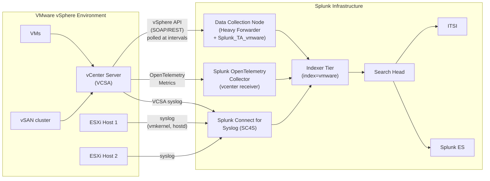

# VMware vSphere Integration Guide

> The definitive guide to monitoring VMware vSphere with Splunk. 48 use cases
> covering vCenter, ESXi hosts, VMs, datastores, vSAN, vMotion / DRS, HA,
> snapshots, alarms, audit, and capacity — across vSphere 7.x and 8.x — with
> deployment patterns for both the legacy Distributed Collector (DCN) and the
> modern Splunk OpenTelemetry Collector vCenter receiver.

---

## Table of Contents

- [Quick Start](#quick-start)
- [Overview and What Good Looks Like](#overview)
- [Architecture and Data Flow](#architecture)
- [Prerequisites](#prerequisites)
- [Data Sources Reference](#data-sources)
- [Field Dictionary](#field-dictionary)
- [Sample Events](#sample-events)
- [TA Configuration (DCN)](#ta-configuration)
- [OpenTelemetry vCenter Receiver](#otel)
- [ESXi Syslog Pipeline](#esxi-syslog)
- [vCenter Server Appliance (VCSA) Audit](#vcsa-audit)
- [Custom Scripted Inputs (PowerCLI)](#custom-scripted-inputs)
- [Cross-Product Correlation](#cross-product-correlation)
- [CIM Mapping Reference](#cim-mapping)
- [Compliance Mapping](#compliance-mapping)
- [Capacity Planning and Sizing](#sizing)
- [Version Compatibility Matrix](#compatibility)
- [Recommended Dashboard Layouts](#dashboards)
- [ITSI Service Modeling](#itsi)
- [SOAR Playbook Examples](#soar)
- [Multi-vCenter and Multi-Tenancy](#multi-vcenter)
- [Security Hardening](#security-hardening)
- [Crawl / Walk / Run Roadmap](#roadmap)
- [Validation Checklist](#validation-checklist)
- [Known Limitations and Gaps](#known-limitations)
- [Troubleshooting](#troubleshooting)
- [FAQ](#faq)
- [Glossary](#glossary)
- [Migration to Modern Collection (OTel)](#migration)
- [References](#references)
- [Contribution and Feedback](#contribution)

---

<a id="quick-start"></a>
## Quick Start — 30 Minutes to First Data

For engineers who want data flowing before reading the rest:

1. **Install the TA** — Download the [Splunk Add-on for VMware (Splunkbase 3215)](https://splunkbase.splunk.com/app/3215). Install on the search head AND on a Heavy Forwarder dedicated to vSphere collection (the DCN does not run on Universal Forwarders).

2. **Create the index** — In Splunk: Settings → Indexes → New Index. Name: `vmware`, type: Events. Retention per the highest framework you operate under (PCI: 1y; SOX/HIPAA: 6–7y).

3. **Create a vCenter service account** — In vCenter Server, create a read-only user (e.g. `splunk-svc`) and assign:
   - Built-in `Read-Only` role at vCenter root, OR
   - A custom role with: `System.View`, `System.Read`, `System.Anonymous`, `Sessions.ValidateSession`, `Performance.ModifyIntervals` (the last one only if you need to query non-default historical intervals)

4. **Configure DCN via the TA setup UI** — On the Heavy Forwarder, navigate to the Splunk Add-on for VMware app → Setup. Add:
   - **vCenter URL**: `https://vcenter.example.com/sdk`
   - **Username / Password**: your read-only service account
   - **Collection intervals**:
     - Performance: 300s (5 min)
     - Inventory: 600s (10 min)
     - Tasks/Events: 60s
     - Hierarchy: 3600s (1h)
   - **Index**: `vmware`

5. **Verify data** — Within 10 minutes:
   ```spl
   index=vmware | stats count by sourcetype
   ```
   You should see `vmware:perf:cpu`, `vmware:inv:vm`, `vmware:events`, and friends.

6. **Deploy core UCs** — Start with the [Crawl tier roadmap](#roadmap) (CPU ready, datastore capacity, HA failover).

**Stuck?** Jump to [Troubleshooting](#troubleshooting).

---

<a id="overview"></a>
## Overview and What Good Looks Like

### What `Splunk_TA_vmware` collects

The Splunk Add-on for VMware uses a Data Collection Node (DCN) — a Heavy Forwarder running the TA — that polls the vCenter API (vSphere SOAP/REST APIs) and emits data into four broad categories:

- **Performance** (`vmware:perf:*`) — counter-based metrics for CPU, memory, network, disk, datastore, vSAN, host system. Pulled from vCenter's historical interval store.
- **Inventory** (`vmware:inv:*`) — current state of VMs, hosts, datastores, networks, clusters. Refreshed periodically.
- **Tasks and Events** (`vmware:tasks`, `vmware:events`) — a chronological audit log of every action and state change in vCenter.
- **Logs** (`vmware:vclog`, `vmware:esxilog`, `vmware:vcsa:syslog`) — raw log files from vCenter Server Appliance and ESXi hosts (delivered via syslog).

This dual collection model (API polling + syslog) gives you both the *meaning* (which VM moved where) and the *raw forensic* trail (the underlying ESXi vmkernel and vpxd logs).

### Why integrate with Splunk?

| Capability | vCenter UI / Aria Operations | Splunk + Splunk_TA_vmware |
|------------|------------------------------|---------------------------|
| Real-time dashboards | Yes | Yes; cross-cluster aggregation easier |
| Long-term performance trending | Aria (90d default) | Splunk: months/years |
| Event audit trail | vCenter (90d default) | Splunk: full retention |
| Cross-product correlation (NSX, AD, ESCU) | Limited | Native via SPL |
| Compliance evidence | Manual export | Auditor-ready saved searches |
| Capacity planning | Aria Operations (paid) | UC catalog provides forecasts |
| SOAR auto-remediation | None native | Splunk SOAR + vCenter API |
| MTTR for VM-level issues | Hours of triage | Minutes — events + perf + change correlated |

### Who should read this guide?

| Role | Relevant sections |
|------|-------------------|
| **VMware admin / virtualisation team** | Quick Start, TA Configuration, Custom Scripted Inputs |
| **Platform / SRE** | ITSI, Dashboards, Sizing, Multi-vCenter |
| **Security operations** | VCSA Audit, Compliance Mapping, SOAR |
| **Compliance / audit** | Compliance Mapping, Validation Checklist |
| **Splunk architecture** | DCN sizing, OTel migration |

### What good looks like

| Dimension | Before integration | After full deployment |
|-----------|-------------------|-----------------------|
| **Performance trending** | vCenter UI 30d | Splunk: 1y+ for capacity planning |
| **HA failover detection** | Email from vCenter | Splunk alert + correlation with hardware health + ESXi syslog |
| **Snapshot sprawl** | Manual cleanup script | Auto-aged snapshot dashboard + ticket creation |
| **DRS imbalance** | Manual investigation | Pattern detection alert + root-cause panel |
| **vSAN health** | vCenter Health UI | Splunk dashboard + alerting tied to capacity |
| **Audit (who did what)** | vCenter Tasks UI | Splunk: searchable, queryable, retention-controlled |
| **Capacity decisions** | Spreadsheet + guesswork | Trend predict for CPU/mem/datastore |

---

<a id="architecture"></a>
## Architecture and Data Flow



**Three collection patterns:**

1. **DCN (Distributed Collection Node) — primary** — A Heavy Forwarder running `Splunk_TA_vmware` polls vCenter via SOAP/REST APIs at configured intervals. This is the legacy and still-supported method; it provides the richest event/inventory data via `vmware:events`, `vmware:tasks`, `vmware:inv:*`.

2. **Splunk OpenTelemetry Collector vCenter receiver — modern** — A lighter-weight metrics collection path using OTel + the [vcenter receiver](https://github.com/open-telemetry/opentelemetry-collector-contrib/tree/main/receiver/vcenterreceiver). Best for high-cardinality performance metrics into a metric store. Use alongside DCN, not as a complete replacement (OTel currently lacks the rich event/inventory data the DCN provides).

3. **Syslog (ESXi + VCSA) — supplemental** — Both ESXi hosts and the VCSA can stream syslog to a central collector (SC4S, syslog-ng, or directly into Splunk). Provides forensic-grade data: VMware vmkernel oops, vpxd authentication failures, host hardware (`hostd`) errors. Critical for incident response.

The dominant pattern in 2026 production is: DCN for events/inv/tasks + (optionally) OTel for high-resolution metrics + SC4S for syslog. Most catalog UCs target the DCN sourcetypes.

---

<a id="prerequisites"></a>
## Prerequisites

### vSphere requirements

| Requirement | Detail |
|-------------|--------|
| **vSphere version** | vSphere 7.0 U3 or later. vSphere 8 (U2/U3) recommended. vSphere 6.x is end-of-general-support and may have API differences. |
| **vCenter Server** | VCSA (VMware-supported); standalone Windows vCenter is end-of-life. |
| **License** | Standard or higher; vSAN counters require vSAN license. Distributed Switch counters require vDS license. |
| **Service account** | Dedicated read-only user (NOT a personal account). At minimum: `Read-Only` role on the vCenter root object. Some advanced UCs (vSAN performance) need `Performance.ModifyIntervals`. |
| **API access** | HTTPS (TCP 443) from the DCN to the vCenter management interface. |
| **Time sync** | NTP/PTP — vCenter, ESXi, and the DCN all in sync. Skew breaks event ordering and `vmware:perf:*` time-bucketing. |

### Splunk requirements

| Requirement | Detail |
|-------------|--------|
| **Splunk version** | Splunk Enterprise 9.0+ or Splunk Cloud (Victoria or Classic). |
| **DCN host** | Heavy Forwarder (NOT Universal Forwarder). The TA depends on a full Splunk install for the modular-input subprocess to run the data collection. |
| **DCN sizing** | A typical DCN supports up to ~10,000 VMs across one or several vCenters. Larger fleets need multiple DCNs partitioned by vCenter or cluster. |
| **TA install scope** | Heavy Forwarder (data collection) + Search Head (knowledge bundle, dashboards, eventtypes). Indexer only needs it if you've installed the optional `SA-VMware` premium app. |
| **Index** | `vmware` (events). Optional `vmware_metrics` (metric store) for high-cardinality OTel metrics. |
| **Roles** | `vmware_observer` for ops; `vmware_admin` for full access. Don't grant `admin`. |

### Network requirements

| From | To | Port | Protocol | Purpose |
|------|----|------|----------|---------|
| DCN (HF) | vCenter | 443 | HTTPS | vSphere API polling |
| DCN (HF) | ESXi (each host) | 443 | HTTPS | Optional direct host queries (some UCs) |
| ESXi host | SC4S | 514 (UDP) / 6514 (TLS) | UDP/TCP | Syslog forwarding |
| VCSA | SC4S | 514/6514 | UDP/TCP | Syslog forwarding |
| OTel Collector | Splunk HEC | 8088 | HTTPS | OTel metric ingest |

---

<a id="data-sources"></a>
## Data Sources Reference

### Performance metrics (`vmware:perf:*`)

| Sourcetype | Source | Default Interval | Key Counters | Used by |
|------------|--------|-----------------|-------------|---------|
| `vmware:perf:cpu` | vCenter perf API | 300s | `cpu.usage.average`, `cpu.ready.summation`, `cpu.demand.average`, `cpu.usagemhz.average` | UC-2.1.1 (CPU ready), capacity UCs |
| `vmware:perf:mem` | vCenter perf API | 300s | `mem.usage.average`, `mem.swapinRate.average`, `mem.swapoutRate.average`, `mem.compressed.average`, `mem.balloon.average` | Memory pressure UCs |
| `vmware:perf:net` | vCenter perf API | 300s | `net.usage.average`, `net.droppedRx.summation`, `net.droppedTx.summation`, `net.broadcastRx.summation`, `net.errorsTx.summation` | UC-2.1.47 (dropped packets) |
| `vmware:perf:disk` | vCenter perf API | 300s | `disk.usage.average`, `disk.totalLatency.average`, `disk.queueLatency.average`, `disk.commands.summation` | Storage latency UCs |
| `vmware:perf:datastore` | vCenter perf API | 300s | `datastore.totalReadLatency.average`, `datastore.totalWriteLatency.average`, `datastore.numberReadAveraged.average` | Datastore latency / IO UCs |
| `vmware:perf:vsan` | vCenter (vSAN cluster) | 300s | vSAN-specific metrics (read/write latency, IOPS, congestion) | UC-2.1.10 (vSAN health) |
| `vmware:perf:hostsystem` | vCenter perf API | 300s | Per-ESXi-host aggregate perf | Host-level capacity UCs |

### Inventory (`vmware:inv:*`)

| Sourcetype | Source | Default Interval | Key Fields | Used by |
|------------|--------|-----------------|-----------|---------|
| `vmware:inv:vm` | vCenter | 600s | `vm_name`, `power_state`, `numCpu`, `memoryMB`, `storage_committed`, `storage_uncommitted`, `snapshot_name`, `snapshot_createTime`, `tools_status`, `host`, `cluster`, `lastPowerOnTime`, `lastPowerOffTime` | UC-2.1.5 (snapshots), .9 (idle VMs) |
| `vmware:inv:host` | vCenter | 600s | `name`, `connection_state`, `power_state`, `cpu_total_mhz`, `mem_total_mb`, `numCpuPkgs`, `numCpuCores`, `numNics`, `vendor`, `model`, `version` | Host inventory UCs |
| `vmware:inv:cluster` | vCenter | 600s | `name`, `total_cpu_mhz`, `total_mem_mb`, `effective_cpu_mhz`, `drs_enabled`, `ha_enabled` | Cluster capacity UCs |
| `vmware:inv:datastore` | vCenter | 600s | `name`, `type`, `capacity`, `freeSpace`, `accessible`, `multipleHostAccess`, `cluster` | UC-2.1.3 (datastore capacity) |
| `vmware:inv:network` | vCenter | 600s | Standard / distributed switches, port groups | Network topology UCs |

### Tasks and Events

| Sourcetype | Source | Default Interval | Key Fields | Used by |
|------------|--------|-----------------|-----------|---------|
| `vmware:tasks` | vCenter | 60s | `task_id`, `task_name`, `task_state` (Success/Error/Running), `entity`, `user`, `start_time`, `complete_time` | Audit / change tracking |
| `vmware:events` | vCenter | 60s | `event_type`, `vm_name`, `host`, `user`, `message`, `severity`, `cluster` | UC-2.1.6 (vMotion), .7 (HA), .8 (DRS), .11 (alarms), .46 (alarms unack), .48 (DRS) |

### Logs

| Sourcetype | Source | Notes |
|------------|--------|-------|
| `vmware:vclog` | vCenter Server logs (vpxd, vws, sso, etc.) | Pulled by `vCenterFileLogs` modular input from VCSA via API or shipped via syslog |
| `vmware:esxilog` | ESXi host syslog (vmkernel, hostd, vpxa, fdm, vmkwarning) | Forwarded via syslog (UDP 514 or TLS 6514) |
| `vmware:vcsa:syslog` | VCSA Photon OS syslog (general) | Forwarded via syslog |

---

<a id="field-dictionary"></a>
## Field Dictionary

### `vmware:perf:cpu` (and other `vmware:perf:*`)

| Field | Type | Example | Description | Used by |
|-------|------|---------|-------------|---------|
| `host` | string | `esx-01.dc.example.com` | ESXi host (or VM name when querying VM-scope counter) | All perf UCs |
| `vm_name` | string | `app-web-01` | When metric is VM-scoped | UC-2.1.1, .47 |
| `cluster` | string | `prod-cluster-01` | Owning cluster | All perf UCs |
| `counter` | string | `cpu.ready.summation` | vSphere counter name | All |
| `instance` | string | `0`, `1`, `aggregate` | Per-CPU/per-NIC instance, or aggregate | All |
| `Value` | float / int | `523` | Counter value (units vary per counter) | All |
| `unit` | string | `millisecond`, `kilobytesPerSecond` | Counter unit | All |
| `interval` | int | `20` | Sample period in seconds (vSphere historical interval) | All |

### `vmware:inv:vm`

| Field | Type | Example | Description | Used by |
|-------|------|---------|-------------|---------|
| `vm_name` | string | `app-web-01` | VM display name | UC-2.1.5, .6, .9, .47 |
| `host` | string | `esx-01.dc.example.com` | Current ESXi host | All inv UCs |
| `cluster` | string | `prod-cluster-01` | Cluster | All |
| `power_state` | string | `poweredOn`, `poweredOff`, `suspended` | Power state | UC-2.1.9 |
| `numCpu` | int | `4` | vCPU count | Capacity UCs |
| `memoryMB` | int | `8192` | RAM (MB) | Capacity UCs |
| `storage_committed` | int (bytes) | `42949672960` | Used storage | UC-2.1.5 |
| `storage_uncommitted` | int (bytes) | `21474836480` | Reserved but not used | Capacity |
| `snapshot_name` | string | `pre-patch-2026-04-25` | Latest snapshot | UC-2.1.5 |
| `snapshot_createTime` | string (ISO) | `2026-04-25T14:30:00Z` | Snapshot creation time | UC-2.1.5 |
| `tools_status` | string | `toolsOk`, `toolsOld`, `toolsNotInstalled` | VMware Tools state | Tools health UCs |
| `lastPowerOnTime` / `lastPowerOffTime` | string (ISO) | `2026-04-25T14:30:00Z` | Power transition timestamps | UC-2.1.9 |
| `guest_state` | string | `running`, `notRunning` | OS-level state via Tools | UC-2.1.9 |

### `vmware:inv:datastore`

| Field | Type | Example | Description | Used by |
|-------|------|---------|-------------|---------|
| `name` | string | `vsanDatastore-prod` | Datastore name | UC-2.1.3 |
| `type` | string | `vsan`, `VMFS`, `NFS`, `vVol` | Datastore type | UC-2.1.3 |
| `capacity` | int (bytes) | `4398046511104` | Total capacity | UC-2.1.3 |
| `freeSpace` | int (bytes) | `1099511627776` | Free space | UC-2.1.3 |
| `accessible` | bool | `true` | Reachable | Health |
| `multipleHostAccess` | bool | `true` | Multi-host accessible | HA |

### `vmware:events`

| Field | Type | Example | Description | Used by |
|-------|------|---------|-------------|---------|
| `event_type` | string | `VmMigratedEvent`, `DrsVmMigratedEvent`, `DasVmPoweredOnEvent`, `DasHostFailedEvent`, `AlarmStatusChangedEvent`, `LicenseExpiringEvent` | Event class name | UC-2.1.6, .7, .8, .11, .46, .48 |
| `vm_name` | string | `app-web-01` | Affected VM | Most |
| `host` | string | `esx-01.dc.example.com` | Affected host | Most |
| `cluster` | string | `prod-cluster-01` | Cluster context | Cluster UCs |
| `user` | string | `splunk-svc@vsphere.local` | Acting user | Audit UCs |
| `message` | string | "Virtual machine app-web-01 was migrated by DRS from esx-01 to esx-02" | Human-readable | All |
| `alarm_name` | string | `Host hardware health` | Triggered alarm | UC-2.1.11, .46 |
| `old_status` / `new_status` | string | `green`, `yellow`, `red` | Alarm color transition | UC-2.1.11, .46 |
| `source_host` / `dest_host` | string | `esx-01`, `esx-02` | vMotion source/destination | UC-2.1.6, .8 |

---

<a id="sample-events"></a>
## Sample Events

### `vmware:perf:cpu` (CPU ready)

```
04-25-2026 14:30:00 host=esx-01.dc.example.com vm_name=app-web-01 cluster=prod-cluster-01 counter=cpu.ready.summation instance=0 Value=523 unit=millisecond interval=20
```

UC-2.1.1 alerts when `cpu.ready.summation` translated to percentage exceeds 5%:

```spl
index=vmware sourcetype=vmware:perf:cpu counter=cpu.ready.summation
| eval cpu_ready_pct = (Value / (interval * 1000)) * 100
| stats avg(cpu_ready_pct) as avg_ready by vm_name
| where avg_ready > 5
```

### `vmware:inv:datastore`

```
04-25-2026 14:30:00 name=vsanDatastore-prod type=vsan capacity=4398046511104 freeSpace=219902325555 accessible=true multipleHostAccess=true cluster=prod-cluster-01
```

UC-2.1.3 alerts when datastore is >85% used.

### `vmware:events` (HA failover)

```
04-25-2026 14:42:33 event_type=DasHostFailedEvent host=esx-03.dc.example.com cluster=prod-cluster-01 message="HA detected host esx-03.dc.example.com is no longer responding" severity=error
```

UC-2.1.7 fires immediately on this event (P1).

### `vmware:events` (snapshot creation)

```
04-25-2026 11:15:00 event_type=VmSnapshotCreatedEvent vm_name=app-web-01 host=esx-01.dc.example.com user=admin@vsphere.local snapshot_name="pre-patch-2026-04-25" message="Snapshot created"
```

### `vmware:tasks` (vMotion)

```
04-25-2026 13:25:18 task_id=task-12345 task_name=Relocate task_state=success entity=app-web-01 user=admin@vsphere.local start_time=2026-04-25T13:25:00Z complete_time=2026-04-25T13:25:18Z
```

### `vmware:esxilog` (vmkernel error)

```
2026-04-25T14:42:33.123Z esx-03 vmkernel: NMP: nmp_DeviceRetryCommand:151: Device "naa.6000c298f1234..." performing failover/retry
```

UC-2.1.36-equivalent uses these for storage path failure detection.

---

<a id="ta-configuration"></a>
## TA Configuration (DCN — Step-by-Step)

### Step 1: Install the TA on the search head

Download from [Splunkbase 3215](https://splunkbase.splunk.com/app/3215). Install via Splunk Web (Apps → Install App from File) on:
- **Search Head** (knowledge bundle, dashboards, eventtypes)
- **Heavy Forwarder** (data collection — runs the Python modular input that polls vCenter)

The TA is NOT supported on Universal Forwarders. The DCN must be a Heavy Forwarder.

### Step 2: Create the index

```ini
# indexes.conf
[vmware]
homePath   = $SPLUNK_DB/vmware/db
coldPath   = $SPLUNK_DB/vmware/colddb
thawedPath = $SPLUNK_DB/vmware/thaweddb
maxTotalDataSizeMB = 524288
frozenTimePeriodInSecs = 31536000  ; 1 year minimum
```

### Step 3: Create the vCenter service account

In vCenter: Administration → Single Sign-On → Users → Add User.

| Setting | Value |
|---------|-------|
| Domain | `vsphere.local` (or your SSO domain) |
| Username | `splunk-svc` |
| Password | (strong, store in Splunk credential manager later) |

Then assign permissions: Hosts and Clusters → vCenter root → Permissions → Add → user `splunk-svc@vsphere.local`, role `Read-Only`, propagate to children = checked.

For the optional `Performance.ModifyIntervals` privilege (only needed if you query non-default historical intervals): create a custom role with `Read-Only` + `Performance.ModifyIntervals` and assign that instead.

### Step 4: Configure the TA via the setup UI

On the Heavy Forwarder, browse to the **Splunk Add-on for VMware** app → **Setup**.

| Field | Value |
|-------|-------|
| vCenter URL | `https://vcenter.example.com/sdk` |
| Username | `splunk-svc@vsphere.local` |
| Password | (your service account password) |
| Performance collection interval | 300 (5 minutes) |
| Inventory collection interval | 600 (10 minutes) |
| Tasks/events collection interval | 60 (1 minute) |
| Hierarchy refresh interval | 3600 (1 hour) |
| Index | `vmware` |
| Verify SSL certificate | Yes (production) |

Click **Save**. The TA writes to `etc/apps/Splunk_TA_vmware/local/inputs.conf`:

```ini
[vmware:perf]
disabled = 0
interval = 300

[vmware:inv]
disabled = 0
interval = 600

[vmware:taskevent]
disabled = 0
interval = 60

[vmware:hierarchy]
disabled = 0
interval = 3600
```

### Step 5: Validate

```spl
index=vmware | stats count earliest(_time) as first latest(_time) as last by sourcetype
```

Within 10 minutes you should see all expected sourcetypes. Cross-check VM count:

```spl
index=vmware sourcetype=vmware:inv:vm | dedup vm_name | stats count
```

This should equal the count in vCenter Hosts and Clusters → Inventory.

### Step 6: Production hardening

- Schedule the DCN's vCenter password rotation
- Enable TLS (verify certificate)
- Restrict the DCN's outbound rules (only 443 to vCenter, 9997/9998 to indexer)
- Run the DCN as a non-root system user (`splunk` user, default)

---

<a id="otel"></a>
## OpenTelemetry vCenter Receiver

For modern, metric-store-friendly performance data alongside the DCN, deploy the [Splunk OpenTelemetry Collector](https://github.com/signalfx/splunk-otel-collector) with the `vcenter` receiver.

### When to use OTel

- High-cardinality metrics (per-VM, per-counter) without bloating the events index
- Splunk Observability Cloud tenants
- Migration from Aria Operations metrics

The OTel `vcenter` receiver does NOT yet provide the full event/task/inventory richness of the DCN — keep the DCN for those.

### Sample OTel configuration

`otel-collector-config.yaml`:

```yaml
receivers:
  vcenter:
    endpoint: https://vcenter.example.com
    username: splunk-svc@vsphere.local
    password: ${env:VCENTER_PASSWORD}
    collection_interval: 300s
    tls:
      insecure: false

processors:
  batch:
    timeout: 5s

exporters:
  splunk_hec/metrics:
    token: ${env:SPLUNK_HEC_TOKEN}
    endpoint: https://splunk-hec.example.com:8088/services/collector
    source: otel-vcenter
    sourcetype: otel:vcenter:metrics
    index: vmware_metrics

service:
  pipelines:
    metrics:
      receivers: [vcenter]
      processors: [batch]
      exporters: [splunk_hec/metrics]
```

Run as a Linux systemd service or container. Verify in Splunk:

```spl
| mstats avg(vcenter.host.cpu.utilization) WHERE index=vmware_metrics span=5m by host.name
```

### Comparing OTel + DCN coverage

| Data | DCN | OTel vcenter receiver |
|------|-----|----------------------|
| Performance metrics | Yes (events) | Yes (metrics, lower volume) |
| Inventory snapshots | Yes | Limited |
| Tasks/Events | Yes | No |
| Logs | Via syslog | No |
| vSAN metrics | Yes | Partial |

Recommendation: DCN for events/inv/tasks; OTel for metric-store dashboards. Don't try to replace one with the other yet.

---

<a id="esxi-syslog"></a>
## ESXi Syslog Pipeline

ESXi hosts can stream all log files (`vmkernel`, `hostd`, `vpxa`, `fdm`, `vmkwarning`, `auth`) to a central syslog destination.

### Configure ESXi to forward syslog

In vCenter → Hosts and Clusters → select host → Configure → Advanced System Settings → search `Syslog.global.logHost`.

Set value to:
```
tcp://syslog.example.com:514
```
or
```
ssl://syslog.example.com:6514
```

Or via PowerCLI:

```powershell
Get-VMHost | Set-VMHostAdvancedConfiguration -Name Syslog.global.logHost -Value "tcp://syslog.example.com:514"
Get-VMHost | Get-VMHostFirewallException -Name "syslog" | Set-VMHostFirewallException -Enabled:$true
```

### SC4S / Splunk receive

If using SC4S, deploy the included VMware ESXi parser (`splunk-connect-for-syslog/package/etc/sc4s/conf.d/0_meta_vps_vmware_esxi.conf` and friends). It auto-detects ESXi syslog format and assigns sourcetypes:

- `vmware:esxilog` (default)
- Sub-sourcetypes per facility if separately configured

For inputs.conf direct receive on a Heavy Forwarder:

```ini
[tcp://514]
sourcetype = vmware:esxilog
index = vmware
no_appending_timestamp = true
```

### What ESXi syslog gives you that the API doesn't

| ESXi log | Insight |
|----------|---------|
| `vmkernel` | Storage path failures, NIC link state, scheduler events |
| `hostd` | Per-host management daemon (HBA discoveries, alarm trigger) |
| `vpxa` | vCenter agent events on the host |
| `fdm` | HA agent events (failover, isolation, election) |
| `vmkwarning` | Critical kernel warnings |
| `auth` | ESXi local auth (root SSH) |

UCs in the catalog correlate `vmware:events` (DasHostFailedEvent) with ESXi syslog (`fdm`, `vmkwarning`) for full root-cause context.

---

<a id="vcsa-audit"></a>
## vCenter Server Appliance (VCSA) Audit

VCSA runs on Photon OS. Splunk audit-grade UCs need:

### Forward VCSA syslog

VCSA → Appliance Management → Syslog → Add Forwarding Configuration. Set destination to your syslog/SC4S target.

Or via SSH on the VCSA:

```bash
syslog-config-set --destination=splunk-syslog.example.com:514
```

### Enable vCenter audit logging

In vCenter: Administration → Single Sign-On → Configuration → Login Banner / Audit. Enable:
- SSO login successes and failures
- Privilege role changes
- Failed permission attempts

These flow to `vmware:events` and to VCSA syslog.

### Why VCSA logs matter

| Log file | Insight |
|----------|---------|
| `/var/log/vmware/sso/sso-server.log` | SSO authentication failures |
| `/var/log/vmware/vpxd/vpxd.log` | vCenter management daemon events |
| `/var/log/audit/audit.log` | Photon OS auditd (login, privilege changes) |
| `/var/log/vmware/vmware-updatemgr/vum-server/vmware-vum-server.log` | Update Manager events |

UC-2.1.* audit UCs use VCSA syslog to detect:
- Brute-force SSO logins
- Privilege escalation in vCenter
- Update Manager failures
- vmdir replication issues

---

<a id="custom-scripted-inputs"></a>
## Custom Scripted Inputs (PowerCLI)

For data the TA doesn't natively cover, use VMware PowerCLI as a scripted input. PowerCLI runs on Linux and Windows.

### vSAN health detail

`bin/vsan_health.ps1`:

```powershell
Connect-VIServer -Server $env:VCENTER -User $env:VCENTER_USER -Password $env:VCENTER_PASS

$cluster = Get-Cluster | Where-Object {$_.VsanEnabled -eq $true}
foreach ($c in $cluster) {
  $health = Get-VsanClusterHealth -Cluster $c
  $obj = @{
    cluster = $c.Name
    overall_health = $health.OverallHealth
    network_health = $health.NetworkHealth
    physical_disk_health = $health.PhysicalDiskHealth
    encryption_health = $health.EncryptionHealth
    capacity_health = $health.CapacityHealth
    timestamp = (Get-Date).ToString("o")
  }
  $obj | ConvertTo-Json -Compress
}

Disconnect-VIServer -Confirm:$false
```

### Snapshot age detail (UC-2.1.5 supplement)

```powershell
Connect-VIServer -Server $env:VCENTER -User $env:VCENTER_USER -Password $env:VCENTER_PASS

Get-VM | Get-Snapshot | Select-Object @{N='vm_name';E={$_.VM}},
  Name, Description, SizeGB, Created, IsCurrent |
  ForEach-Object {
    $age_days = [math]::Round((New-TimeSpan -Start $_.Created -End (Get-Date)).TotalDays, 1)
    [pscustomobject]@{
      vm_name = $_.vm_name
      snapshot_name = $_.Name
      description = $_.Description
      size_gb = [math]::Round($_.SizeGB, 1)
      created = $_.Created.ToString("o")
      age_days = $age_days
      is_current = $_.IsCurrent
    } | ConvertTo-Json -Compress
  }

Disconnect-VIServer -Confirm:$false
```

### Distributed Switch health (vDS)

```powershell
Connect-VIServer -Server $env:VCENTER -User $env:VCENTER_USER -Password $env:VCENTER_PASS

Get-VDSwitch | ForEach-Object {
  $vds = $_
  Get-VMHost -DistributedSwitch $vds | ForEach-Object {
    [pscustomobject]@{
      vds_name = $vds.Name
      host = $_.Name
      vds_version = $vds.Version
      max_ports = $vds.MaxPorts
      num_ports = $vds.NumPorts
    } | ConvertTo-Json -Compress
  }
}
```

### inputs.conf for PowerCLI on Linux DCN

```ini
[script://./bin/vsan_health.ps1]
disabled = 0
interval = 600
sourcetype = vmware:vsan:health
index = vmware
```

`PowerShell Core` (`pwsh`) on Linux is required, plus PowerCLI module. Set environment variables in `splunk-launch.conf` or use Splunk credential manager.

---

<a id="cross-product-correlation"></a>
## Cross-Product Correlation

### vSphere + NSX-T

For NSX-T-secured clusters, correlate VM placement events (vMotion) with NSX-T DFW state changes:

```spl
index=vmware sourcetype="vmware:events" event_type="VmMigratedEvent" vm_name="$vm$"
| join vm_name, _time
   [search index=nsx sourcetype="nsx:dfw" earliest=-5m
    | eval _time=_time-300]
| where isnotnull(rule_name)
```

### vSphere + Active Directory (DRS impact on AD-joined VMs)

```spl
(index=vmware sourcetype="vmware:events" event_type="DrsVmMigratedEvent")
OR (index=wineventlog sourcetype="WinEventLog:System" EventCode IN (6005, 6006, 6008))
| transaction host maxspan=15m
```

### vSphere + Hardware (BMC / iDRAC / iLO)

Correlate ESXi hardware alarm with BMC/IPMI events:

```spl
(index=vmware sourcetype="vmware:events" event_type="AlarmStatusChangedEvent" alarm_name="Host hardware*")
OR (index=hardware sourcetype="ipmi:sel")
| transaction host maxspan=10m
| where mvcount(sourcetype) > 1
```

### vSphere + Splunk ITSI

| Service | KPIs |
|---------|------|
| **Compute Capacity** | CPU ready (UC-2.1.1), CPU usage % per host, memory active % |
| **Storage** | Datastore latency, datastore capacity (UC-2.1.3), vSAN health (UC-2.1.10) |
| **Resilience** | Open alarms (UC-2.1.46), HA failover events (UC-2.1.7), DRS imbalance (UC-2.1.48) |
| **Audit** | vMotion velocity (UC-2.1.6), snapshot age (UC-2.1.5) |

---

<a id="cim-mapping"></a>
## CIM Mapping Reference

| CIM Data Model | Mapped sourcetypes / UCs | Validation SPL |
|----------------|--------------------------|----------------|
| **Performance** | `vmware:perf:cpu`, `vmware:perf:mem`, `vmware:perf:disk`, `vmware:perf:net` | `\| tstats count from datamodel=Performance` |
| **Change** | `vmware:tasks`, `vmware:events` (config changes) | `\| tstats count from datamodel=Change` |
| **Inventory** | `vmware:inv:vm`, `vmware:inv:host`, `vmware:inv:datastore` | `\| tstats count from datamodel=Compute_Inventory` |
| **Authentication** | `vmware:vcsa:syslog` (SSO logins) | `\| tstats count from datamodel=Authentication` |
| **Alerts** | `vmware:events` (AlarmStatusChangedEvent) | `\| tstats count from datamodel=Alerts` |

The TA ships eventtypes/tags for most of the above. Verify in Settings → Data Models.

---

<a id="compliance-mapping"></a>
## Compliance Mapping

### NIST 800-53 Rev. 5

| UC | Control | Description |
|----|---------|-------------|
| UC-2.1.6 (vMotion audit) | AU-2 | Event Logging |
| UC-2.1.5 (snapshot age) | CM-7 | Least Functionality (sprawl prevention) |
| UC-2.1.7 (HA failover) | CP-2 | Contingency Plan |
| UC-2.1.10 (vSAN health) | SI-4 | System Monitoring |
| UC-2.1.11 (hardware alarm) | MA-2 | Controlled Maintenance |

### PCI-DSS v4.0

| UC | Requirement | Description |
|----|------------|-------------|
| UC-2.1.6 | 10.2 | Audit logs |
| UC-2.1.* (vCenter login) | 8.5 | Account management |

### ISO 27001:2022

| UC | Annex Control |
|----|---------------|
| UC-2.1.6 | A.8.16 Monitoring activities |
| UC-2.1.5 | A.8.13 Information backup |
| UC-2.1.10 | A.8.16 Monitoring activities |

### CIS VMware vSphere Benchmark

| UC | CIS Section |
|----|-------------|
| UC-2.1.* (audit) | 1.x SSO and Identity |
| UC-2.1.5 | 2.x VM Configuration |
| ESXi syslog | 4.x Logging |

---

<a id="sizing"></a>
## Capacity Planning and Sizing

### DCN sizing rule of thumb

| Fleet size | DCNs needed | Notes |
|------------|-------------|-------|
| < 1,000 VMs | 1 DCN | 8 vCPU, 16 GB RAM, 100 GB disk |
| 1,000–5,000 VMs | 1–2 DCNs | Partition by vCenter or by metric/event |
| 5,000–10,000 VMs | 2–4 DCNs | One per vCenter |
| > 10,000 VMs | Multi-DCN per vCenter | Split perf/inv/events across DCNs |

### Per-VM daily ingest

| Sourcetype | Volume |
|------------|--------|
| `vmware:perf:cpu/mem/net/disk` | ~100 KB/VM/day at 300s interval |
| `vmware:inv:vm` | ~50 KB/VM/day |
| `vmware:events` | Highly variable; ~50–500 KB/VM/day |
| `vmware:tasks` | ~10–100 KB/VM/day |
| `vmware:esxilog` | ~1–10 MB/host/day |

### Worked examples

| Fleet | Ingest |
|-------|--------|
| **500 VMs, 25 hosts** | ~150 MB/day perf+inv + ~250 MB/day events + ~50 MB/day syslog ≈ 450 MB/day |
| **5,000 VMs, 200 hosts** | ~1.5 GB/day perf + ~2.5 GB events + ~2 GB syslog ≈ 6 GB/day |
| **20,000 VMs, 1000 hosts** | ~6 GB perf + ~10 GB events + ~10 GB syslog ≈ 26 GB/day |

### vCenter API rate limiting

vCenter does not have a published rate limit, but very aggressive polling (sub-60s for perf with 1000s of VMs) can cause vCenter to slow. Symptoms: `vpxd.log` shows `Lengthy task observed`, DCN logs show `5xx` HTTP errors.

Mitigation: stagger DCN intervals; partition large fleets across multiple DCNs.

---

<a id="compatibility"></a>
## Version Compatibility Matrix

| vSphere | TA support | Notes |
|---------|-----------|-------|
| **vSphere 8.0 U3** | TA 5.x+ | Recommended target |
| **vSphere 8.0 U2 / U1** | TA 5.x+ | Fully supported |
| **vSphere 7.0 U3** | TA 5.x+ | Standard |
| **vSphere 7.0 (early)** | TA 5.x+ | Some perf counters renamed |
| **vSphere 6.7** | TA 5.x | Limited; EOL by VMware |
| **vSphere 6.5 and earlier** | Not supported | EOL |

VMware by Broadcom: licence model changed in 2024; some metric/feature availability tied to subscription tiers — confirm with your account.

---

<a id="dashboards"></a>
## Recommended Dashboard Layouts

### Crawl Dashboard — "vSphere at a Glance"

```
+----------------------------------+----------------------------------+
| HOSTS REPORTING / TOTAL          | OPEN ALARMS                      |
| (from vmware:inv:host)           | (UC-2.1.46)                      |
+----------------------------------+----------------------------------+
| TOP 10 VMs BY CPU READY          | DATASTORES > 85% USED            |
| (UC-2.1.1)                       | (UC-2.1.3)                       |
+----------------------------------+----------------------------------+
| HA FAILOVER LAST 24H             | OLD SNAPSHOTS                    |
| (UC-2.1.7)                       | (UC-2.1.5)                       |
+----------------------------------+----------------------------------+
```

### Walk Dashboard — "Operational Intelligence"

```
+----------------------------------+----------------------------------+
| vSAN HEALTH (UC-2.1.10)          | DRS MIGRATIONS / HOUR (UC-2.1.48)|
+----------------------------------+----------------------------------+
| HARDWARE ALARMS (UC-2.1.11)      | NETWORK DROPPED PACKETS (UC-2.1.47)|
+----------------------------------+----------------------------------+
| IDLE VMS LAST 30D (UC-2.1.9)     | vMotion VELOCITY (UC-2.1.6)      |
+----------------------------------+----------------------------------+
```

### Run Dashboard — "Capacity & Compliance"

```
+----------------------------------+----------------------------------+
| 90-DAY CPU CAPACITY FORECAST     | COMPLIANCE SCORECARD             |
| Trend per cluster + projection   | per UC against CIS Benchmark     |
+----------------------------------+----------------------------------+
| vMOTION AUDIT TRAIL              | CRITICAL EVENTS LAST 90D         |
| (who, when, where)               | (HA, host failure, alarm storms) |
+----------------------------------+----------------------------------+
```

---

<a id="itsi"></a>
## ITSI Service Modeling

### Service hierarchy

```
Virtualisation Platform
├── Cluster: prod-cluster-01
│   ├── Compute KPIs (CPU ready, mem active, host count)
│   ├── Storage KPIs (datastore latency, vSAN health)
│   ├── Network KPIs (dropped packets, NIC errors)
│   └── Resilience KPIs (open alarms, recent HA failovers)
└── Cluster: dr-cluster-01
    └── ...
```

### Recommended KPIs

| KPI | UC | Base search | Threshold |
|-----|----|------------|-----------|
| **CPU Ready (cluster avg)** | UC-2.1.1 | `index=vmware sourcetype=vmware:perf:cpu counter=cpu.ready.summation \| eval ready_pct=(Value/(interval*1000))*100 \| stats avg(ready_pct) by cluster` | Adaptive (warn 5, crit 10) |
| **Datastore Free %** | UC-2.1.3 | `index=vmware sourcetype=vmware:inv:datastore \| eval free_pct=(freeSpace/capacity)*100 \| stats min(free_pct) by name` | Static (warn 15, crit 5) |
| **vSAN Health** | UC-2.1.10 | `index=vmware sourcetype=vmware:vsan:health \| stats latest(overall_health) by cluster` | Status (red/yellow/green) |
| **Open Alarms** | UC-2.1.46 | `index=vmware sourcetype=vmware:events event_type=AlarmStatusChangedEvent new_status="red" \| dedup alarm_name, host \| stats count` | Static (warn >0, crit >5) |
| **Recent HA Failover** | UC-2.1.7 | `index=vmware sourcetype=vmware:events (event_type="DasHostFailedEvent" OR event_type="ClusterFailoverActionTriggered") earliest=-1h \| stats count by cluster` | Static (any) |

### Entity import

```spl
index=vmware sourcetype=vmware:inv:host earliest=-24h
| dedup name
| table name, cluster, vendor, model, version, numCpuCores, mem_total_mb
```

Entity definition: title `name`, identifier `name`, informational `cluster`, `model`, `version`.

---

<a id="soar"></a>
## SOAR Playbook Examples

### Playbook 1: Critical Snapshot Auto-Cleanup

**Trigger:** UC-2.1.5 alert fires (snapshot >7 days, size >50 GB).

```
1. RECEIVE alert (vm_name, snapshot_name, age_days, size_gb)
2. CHECK change ticket via ServiceNow
   ├── If ticket open referencing snapshot → CLOSE alert
   └── If no ticket → CONTINUE
3. NOTIFY VM owner via email + Slack
4. WAIT 72 hours
5. IF still present:
   AUTO-DELETE via vCenter API: PowerCLI Remove-Snapshot
   CREATE post-action ServiceNow record
6. VERIFY deletion completed within 4h
```

### Playbook 2: HA Failover Auto-Triage

**Trigger:** UC-2.1.7 alert fires.

```
1. RECEIVE alert (failed_host, cluster)
2. CHECK ESXi syslog last 1h for clue
   SPL: index=vmware sourcetype=vmware:esxilog host=$failed_host earliest=-1h
        (vmkernel OR fdm) (warning OR error)
3. CHECK BMC for hardware alert
   SPL: index=hardware sourcetype="ipmi:sel" host=$failed_host earliest=-1h
4. DECISION:
   ├── BMC shows hardware fault → DISPATCH hands-on-server ticket
   ├── Network errors → ESCALATE to network team
   └── Unknown → P1 incident ticket
5. DOCUMENT root cause in incident
6. CONFIRM all VMs restarted via DAS / VM events
```

### Playbook 3: Datastore Critical (95%+) Triage

**Trigger:** UC-2.1.3 alert fires.

```
1. RECEIVE alert (datastore_name, free_gb, capacity_gb)
2. SCAN for orphaned VMDK files via PowerCLI
   $orphans = Get-View -ViewType Datastore | ForEach-Object { ... }
3. CHECK snapshot bloat via UC-2.1.5
4. CHECK recent VM clones
5. NOTIFY storage team with:
   - Top-10 largest VMs on datastore
   - Snapshot sizes
   - Orphaned VMDK list
6. CREATE P1/P2 ticket based on free_gb (P1 if < 100GB)
```

---

<a id="multi-vcenter"></a>
## Multi-vCenter and Multi-Tenancy

### Multiple vCenters

Each vCenter requires its own DCN configuration entry. In `inputs.conf`:

```ini
[vmware:perf://vc1]
target = https://vcenter-prod.example.com/sdk
username = splunk-svc@vsphere.local
password = ...
disabled = 0
interval = 300

[vmware:perf://vc2]
target = https://vcenter-dr.example.com/sdk
username = splunk-svc@vsphere.local
password = ...
disabled = 0
interval = 300
```

The TA collects each vCenter independently; events are tagged with the vCenter URL/host as part of the `host` field.

### Index strategy

**Option A: Shared index** — all vCenters write to `index=vmware`. Add a `vcenter_name` field via inputs metadata. Use for environments where access boundaries align with role-based access controls.

**Option B: Separate indexes** — `vmware_prod`, `vmware_dr`. Stricter isolation; harder to build cross-VC views.

### Dashboard tokens

```xml
<input type="dropdown" token="vc_filter">
  <label>vCenter</label>
  <choice value="*">All vCenters</choice>
  <choice value="vcenter-prod*">Production</choice>
  <choice value="vcenter-dr*">DR</choice>
  <default>*</default>
</input>
```

---

<a id="security-hardening"></a>
## Security Hardening

### Service account

- Dedicated read-only user (`splunk-svc@vsphere.local`)
- Strong password rotated on schedule (90d typical)
- Stored in Splunk credential manager (TA stores as encrypted `passwords.conf`)
- Disable interactive login (set token expiration aggressively if possible)

### TLS

- Production: verify SSL certificate (use a proper CA-signed cert on vCenter)
- Lab: only acceptable to skip verify if using self-signed Cisco/VMware lab cert

### DCN host hardening

- Run as `splunk` user (default for Splunk Enterprise)
- Ingress: only 8089 from deployment management
- Egress: only 443 to vCenter, 9997/9998 to indexer
- Apply CIS Benchmark for the DCN host OS

### Sensitive data

vSphere events may include human-readable usernames and IP addresses — apply field-level RBAC if PII is in scope. Snapshot names sometimes contain ticket numbers — usually fine but document in privacy review.

---

<a id="roadmap"></a>
## Crawl / Walk / Run Roadmap

### Crawl (Week 1–2)

| Order | UC | Title |
|-------|----|-------|
| 1 | UC-2.1.1 | CPU Ready Trending |
| 2 | UC-2.1.3 | Datastore Capacity |
| 3 | UC-2.1.7 | HA Failover Events |
| 4 | UC-2.1.11 | Hardware Alarms |
| 5 | UC-2.1.46 | Open Alarms (unack > 4h) |

### Walk (Week 3–6)

1. **Capacity**: idle VMs (UC-2.1.9), snapshot sprawl (UC-2.1.5)
2. **Performance**: dropped packets (UC-2.1.47), datastore latency, memory pressure
3. **DRS / vMotion**: UC-2.1.6 (audit), UC-2.1.8 / .48 (oscillation detection)
4. **vSAN**: UC-2.1.10 — health status + capacity

### Run (Month 2+)

1. ITSI service tree
2. SOAR playbooks (snapshot cleanup, HA triage, datastore critical)
3. Cross-product correlation with NSX-T, AD, BMC hardware
4. Capacity forecasting for 90/180/365 day refresh decisions

---

<a id="validation-checklist"></a>
## Validation Checklist

### Day 1

- [ ] DCN Heavy Forwarder built and reachable
- [ ] `Splunk_TA_vmware` installed on DCN and Search Head
- [ ] vCenter service account created and tested
- [ ] TA setup UI configured and saved
- [ ] `index=vmware` exists with retention
- [ ] `index=vmware | stats count by sourcetype` shows expected sourcetypes
- [ ] VM count in Splunk matches vCenter inventory

### Day 7

- [ ] All crawl-tier UCs deployed
- [ ] Crawl dashboard built
- [ ] First alerts (HA failover, datastore critical, hardware alarm)
- [ ] ESXi syslog forwarding configured
- [ ] VCSA syslog forwarding configured

### Day 30

- [ ] Walk-tier UCs deployed
- [ ] Compliance dashboard reviewed
- [ ] Custom PowerCLI scripted inputs operational (vSAN, snapshots)
- [ ] Capacity report distributed to stakeholders

### Day 90

- [ ] Run-tier UCs deployed
- [ ] ITSI services modelled
- [ ] At least one SOAR playbook in production
- [ ] Cross-product correlation operational
- [ ] Multi-vCenter dashboards working

---

<a id="known-limitations"></a>
## Known Limitations and Gaps

| Limitation | Impact | Workaround |
|------------|--------|------------|
| **DCN must be Heavy Forwarder** | Can't run on UF | Plan a dedicated HF VM |
| **vSphere API rate limits at scale** | DCN polling can stress vCenter | Stagger intervals; multiple DCNs |
| **vSAN performance counters licence-dependent** | vSAN counters may be empty without proper licence | Verify licence; some metrics need PowerCLI |
| **`vmware:events` retention limited at vCenter** | vCenter purges after configured days | Splunk retains forever; bridge the gap |
| **OTel + DCN partial overlap** | Risk of duplicate metric ingest | Choose one for metrics; DCN for events |
| **Snapshots in `vmware:inv:vm` only show latest** | Multi-snapshot detail needs PowerCLI | Use the snapshot script in [Custom Scripted Inputs](#custom-scripted-inputs) |
| **VCSA 7.x → 8.x migration** | Some advanced settings reset | Re-validate sourcetypes after upgrade |
| **No native NSX-T integration in TA** | Need separate NSX-T add-on | Splunk_TA_vmware-nsx (Splunkbase) for NSX |

---

<a id="troubleshooting"></a>
## Troubleshooting

### No data from vCenter

1. **DCN reachable from Search Head?** `splunk btool inputs list --debug | grep vmware` on the DCN.
2. **vCenter URL correct?** Test: `curl -k https://vcenter.example.com/sdk` should return XML.
3. **Service account valid?** Login to vCenter Web Client with the credentials.
4. **Splunkd logs**: `index=_internal sourcetype=splunkd component=ExecProcessor "Splunk_TA_vmware" ERROR`
5. **Common errors**:
   - `401 Unauthorized` → credentials wrong
   - `Connection refused` → URL or firewall
   - `SSL certificate verify failed` → set `verify=False` in TA setup (lab only)

### Events arrive but fields are missing

1. **Vsphere version mismatch** — older vSphere may not emit some counters.
2. **Field extraction broken** — `index=vmware sourcetype=vmware:perf:cpu | head 1` and inspect `_raw`.
3. **TA on Search Head?** — required for field extractions.

### vCenter complains about query load

1. **DCN poll too aggressive** — increase intervals.
2. **vpxd.log** on VCSA: look for `Lengthy task observed`.
3. **Partition** — split DCN load across multiple DCNs.

### vMotion / DRS event volume too high

1. **Filter at DCN** — disable `[vmware:taskevent]` if event volume isn't needed.
2. **Filter at index time** — `transforms.conf` SED rule (warning: destroys evidence).

---

<a id="faq"></a>
## FAQ

**Q: Do I need both DCN and OTel?**
A: For most environments, yes — DCN for events/inventory/tasks, OTel for high-cardinality metrics into a metric store. OTel is not yet a complete DCN replacement.

**Q: Can I run DCN on a Universal Forwarder?**
A: No. The TA needs a Heavy Forwarder (full Splunk install) to run the Python modular input.

**Q: How do I monitor a vSAN-only cluster?**
A: Standard TA collection works; vSAN metrics appear in `vmware:perf:vsan` if licensed. Augment with PowerCLI `Get-VsanClusterHealth` for detail.

**Q: What about VMware Cloud on AWS / VMC?**
A: VMC exposes vCenter API. Configure DCN to point at the VMC vCenter URL (`vcenter.sddc-XXX.vmwarevmc.com`). Service account creation differs slightly — see VMware docs.

**Q: How do I monitor NSX-T alongside this?**
A: Use the Splunk Add-on for VMware NSX (separate Splunkbase entry). Cross-correlate via VM tags or VM names.

**Q: What if my vCenter is in DR, only reachable during failover?**
A: Configure a separate DCN per vCenter. The DR DCN sits idle most of the time but begins polling immediately during failover.

**Q: How do I size DCN for very large fleets (>20K VMs)?**
A: Multiple DCNs per vCenter, each handling a subset (e.g. one for performance, one for events/tasks). VMware customers running 50K+ VMs typically use 8–10 DCNs.

**Q: Why are my VM counts in Splunk different from vCenter?**
A: Common causes: (1) DCN service account doesn't have visibility on all clusters, (2) inventory poll hasn't completed yet, (3) "templates" are excluded from `vmware:inv:vm` by default.

---

<a id="glossary"></a>
## Glossary

| Term | Definition |
|------|-----------|
| **DCN** | Data Collection Node — a Heavy Forwarder running `Splunk_TA_vmware` |
| **DRS** | Distributed Resource Scheduler — automated VM placement and balancing |
| **HA** | High Availability — VMs auto-restart on host failure |
| **vCenter** | Central management server for vSphere |
| **VCSA** | vCenter Server Appliance (Photon OS-based, the only supported deployment now) |
| **vMotion** | Live VM migration between ESXi hosts |
| **vSAN** | VMware's hyper-converged software-defined storage |
| **vSphere** | VMware's compute virtualisation product family |
| **vDS** | vSphere Distributed Switch |
| **PowerCLI** | VMware's PowerShell-based automation toolkit |
| **OTel** | OpenTelemetry — vendor-neutral observability standard |

---

<a id="migration"></a>
## Migration to Modern Collection (OTel)

**Recommended approach:** keep DCN; add OTel for metrics.

### Migration sequence

1. **Phase 1**: Establish DCN baseline (the bulk of UC content depends on `vmware:events`, `vmware:inv:*`, `vmware:tasks`).
2. **Phase 2**: Deploy OTel vCenter receiver alongside DCN. Route OTel to a metric index (`vmware_metrics`).
3. **Phase 3**: Build new dashboards using `mstats` against `vmware_metrics` for high-cardinality metrics.
4. **Phase 4**: Where DCN-collected `vmware:perf:*` overlaps with OTel, consider disabling the DCN perf collection (keep events/inv/tasks only) to reduce ingest.

Don't migrate to OTel-only until the OTel receiver matches DCN coverage for events/inv/tasks (not the case in 2026).

---

<a id="references"></a>
## References

| Resource | URL |
|----------|-----|
| Splunk Add-on for VMware (Splunkbase 3215) | [splunkbase.splunk.com/app/3215](https://splunkbase.splunk.com/app/3215) |
| `Splunk_TA_vmware` documentation | [Splunkbase: Splunk Add-on for VMware](https://splunkbase.splunk.com/app/3215) and [docs.splunk.com/Documentation/AddOns](https://docs.splunk.com/Documentation/AddOns) |
| Splunk OpenTelemetry Collector | [github.com/signalfx/splunk-otel-collector](https://github.com/signalfx/splunk-otel-collector) |
| OTel vcenter receiver | [github.com/open-telemetry/opentelemetry-collector-contrib/tree/main/receiver/vcenterreceiver](https://github.com/open-telemetry/opentelemetry-collector-contrib/tree/main/receiver/vcenterreceiver) |
| vSphere API documentation | [developer.broadcom.com/xapis/vsphere-management-sdk](https://developer.broadcom.com/xapis/vsphere-management-sdk/latest/) |
| ESXi Syslog Configuration | [knowledge.broadcom.com](https://knowledge.broadcom.com/external/article/345077) |
| VMware PowerCLI | [developer.broadcom.com/powercli](https://developer.broadcom.com/powercli) |
| CIS VMware vSphere Benchmark | [cisecurity.org/benchmark/vmware](https://www.cisecurity.org/benchmark/vmware) |

---

<a id="contribution"></a>
## Contribution and Feedback

Part of the [Splunk Monitoring Use Cases](https://github.com/fenre/splunk-monitoring-use-cases) project. Found an error? [Open an issue](https://github.com/fenre/splunk-monitoring-use-cases/issues/new).

---

*Last updated: 2026-05-08. Covers `Splunk_TA_vmware` 5.x on vSphere 7.0 U3 and 8.0 U2/U3.*
