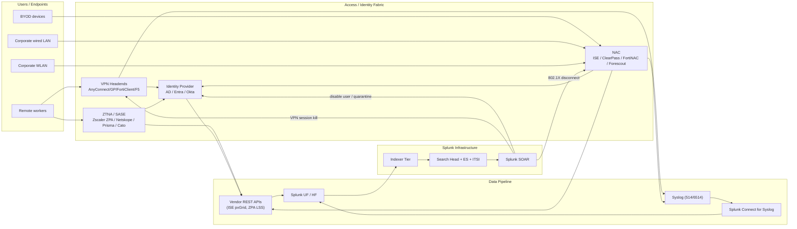

# VPN, NAC, Zero Trust & SASE Integration Guide

> The definitive guide to integrating VPN, Network Access Control (NAC),
> Zero Trust Network Access (ZTNA), and Secure Access Service Edge (SASE)
> platforms with Splunk. **172 use cases** spanning Cisco AnyConnect /
> Secure Client, Palo Alto GlobalProtect + Prisma Access, Fortinet
> FortiClient + FortiSASE, F5 APM, Pulse / Ivanti Connect Secure, Citrix
> NetScaler Gateway, OpenVPN, WireGuard; Cisco ISE (NAC + posture +
> profiler), Aruba ClearPass, FortiNAC, Forescout, Microsoft NPS,
> packetfence; Zscaler ZPA + ZIA, Netskope, Palo Alto Prisma Access, Cato
> Networks, FortiSASE, Cloudflare Zero Trust, Microsoft Entra Conditional
> Access, Akamai EAA. VPN auth failures, brute-force / credential
> stuffing detection, NAC profiler accuracy, posture compliance, 802.1X
> failure analysis, ZTNA conditional access enforcement, SASE policy
> decisions, BYOD onboarding, impossible-travel detection, and the full
> identity → device → application access chain through Splunk Enterprise
> Security.

---

## Table of Contents

- [Quick Start](#quick-start)
- [Overview](#overview)
- [Architecture and Data Flow](#architecture)
- [Prerequisites](#prerequisites)
- [Platform Coverage Matrix](#platform-matrix)
- [VPN — Cisco AnyConnect / Secure Client](#anyconnect)
- [VPN — Palo Alto GlobalProtect](#globalprotect)
- [VPN — Fortinet FortiClient / SSL VPN](#forticlient)
- [VPN — F5 APM, Pulse / Ivanti, Citrix NetScaler Gateway, OpenVPN](#other-vpn)
- [NAC — Cisco ISE](#cisco-ise)
- [NAC — Aruba ClearPass](#clearpass)
- [NAC — FortiNAC, Forescout, Microsoft NPS, packetfence](#other-nac)
- [Zero Trust / SASE — Zscaler ZPA + ZIA](#zscaler)
- [Zero Trust / SASE — Netskope](#netskope)
- [Zero Trust / SASE — Palo Alto Prisma Access, FortiSASE, Cato, Cloudflare Access, Akamai EAA](#other-sase)
- [Microsoft Entra Conditional Access](#entra-ca)
- [VPN Failure & Brute-Force Detection](#vpn-detect)
- [NAC Posture / Compliance / Profiler Quality](#nac-posture)
- [ZTNA Policy Effectiveness](#zt-effectiveness)
- [Field Dictionary](#field-dictionary)
- [Sample Events](#sample-events)
- [Splunk-Side Configuration](#splunk-config)
- [Cross-Product Correlation](#cross-product)
- [CIM Mapping Reference](#cim-mapping)
- [Splunk ES Notable Event Pipeline](#es-notable)
- [Compliance Mapping](#compliance)
- [Capacity Planning and Sizing](#sizing)
- [Recommended Dashboard Layouts](#dashboards)
- [ITSI Service Modeling](#itsi)
- [SOAR Playbook Examples](#soar)
- [Multi-Tenant / Multi-Region Strategy](#multi-tenant)
- [Security Hardening](#security-hardening)
- [Crawl / Walk / Run Roadmap](#roadmap)
- [Validation Checklist](#validation-checklist)
- [Known Limitations and Gaps](#known-limitations)
- [Troubleshooting](#troubleshooting)
- [FAQ](#faq)
- [Glossary](#glossary)
- [References](#references)
- [Contribution and Feedback](#contribution)

---

<a id="quick-start"></a>
## Quick Start — 90 Minutes to First VPN/NAC/ZT Insight

### Cisco AnyConnect / Secure Client (most common VPN)

1. On ASA / FTD: enable AnyConnect logging:
    ```cisco
    logging trap informational
    logging facility 21
    logging host inside <sc4s-vip>
    logging permit-hostdown
    ```
2. Install [Cisco Secure Firewall Add-on (Splunkbase 5402)](https://splunkbase.splunk.com/app/5402).
3. Validate: `index=vpn sourcetype="cisco:asa:vpn" earliest=-15m | stats count by user, action`

### Cisco ISE (NAC)

1. Install [TA-cisco-ise (Splunkbase 3559)](https://splunkbase.splunk.com/app/3559).
2. ISE → Administration → System → Logging → Remote Logging Targets:
    - + Add SC4S target on ports 514 (TCP), 6514 (TLS)
    - Categories: Failed Attempts, Passed Authentications, RADIUS Diagnostics, Posture and Client Provisioning Audit, Profiler
3. Validate: `index=cisco_ise sourcetype="cisco:ise:syslog" earliest=-15m | stats count by category`

### Zscaler ZPA (ZTNA)

1. Install [Splunk Add-on for Zscaler (Splunkbase 3866)](https://splunkbase.splunk.com/app/3866).
2. Zscaler ZPA Admin → Administration → Log Streaming Service → Splunk:
    - Stream all of: User Activity, App Connector, Audit, Browser Access
3. Validate: `index=zt sourcetype="zscaler:zpa" earliest=-15m | stats count by policy_action, application`

### Activate crawl tier

UC-17.1.2 (NAC Authentication Trending), UC-17.2.2 (VPN Auth Failures), UC-17.3.1 (Conditional Access Enforcement), UC-17.3.x (ZT Posture Failures).

---

<a id="overview"></a>
## Overview

### Why VPN/NAC/ZT/SASE observability matters

The remote access perimeter is **the** identity attack surface:

- VPN credential compromise → corporate network access
- 802.1X bypass via rogue device → wired LAN access
- ZTNA policy gaps → SaaS / private app data exfil
- SASE misconfiguration → blanket allow-all paths
- Compliance: NIST 800-207 Zero Trust, PCI-DSS 8.x access controls, NIS2 multi-factor

### Architecture transitions covered

| Era | Pattern |
|-----|---------|
| **Legacy** | Pure VPN tunnels, all-or-nothing access |
| **Hybrid** | VPN + 802.1X NAC for posture + ZTNA for SaaS |
| **Modern Zero Trust** | SASE replaces VPN; identity-centric access; per-app micro-tunnels |

### Data domains

| Domain | Examples |
|--------|---------|
| **VPN** | Auth success/fail, session length, posture state, brute-force |
| **NAC** | 802.1X / MAB, profiler accuracy, posture compliance, BYOD |
| **ZTNA** | Per-app access, conditional access decisions, step-up MFA |
| **SASE** | Cloud-edge enforcement, app discovery, data exfil prevention |

### What's NOT in scope

| Domain | Where to look |
|--------|---------------|
| **Identity providers (AD/Entra)** | [AD/Entra ID Guide](active-directory-entra-id.md) |
| **Web filtering / SWG** | [Web Security Guide](web-security.md) |
| **Firewalls (perimeter)** | [Firewalls Guide](firewalls.md) |
| **MFA platforms (Duo, Okta)** | (separate guide) |

### What good looks like

| Dimension | Without integration | With full integration |
|-----------|---------------------|-----------------------|
| VPN brute-force detection | Hours to days | < 5 minutes |
| NAC profiler accuracy | Unknown | Daily report with drift detection |
| ZTNA policy decision visibility | Per-vendor dashboards | Single Splunk dashboard |
| Impossible-travel detection | Manual investigation | Auto-detected, SOAR enriched |
| Compliance (NIST 800-207) attestation | Days/weeks | Hours, automated |

---

<a id="architecture"></a>
## Architecture and Data Flow



---

<a id="prerequisites"></a>
## Prerequisites

| Item | Detail |
|------|--------|
| **Splunk version** | 9.0+ Enterprise / Cloud |
| **CIM 6.x** | Authentication, Network_Sessions, Change |
| **Splunk Connect for Syslog (SC4S)** | Strongly recommended |
| **Splunk Enterprise Security** | For correlation searches |
| **Identity integration** | AD/Entra synced + Asset & Identity framework |

---

<a id="platform-matrix"></a>
## Platform Coverage Matrix

| Category | Platform | TA / Splunkbase |
|----------|----------|------|
| **VPN** | Cisco AnyConnect / Secure Client | Cisco Secure Firewall Add-on [5402](https://splunkbase.splunk.com/app/5402) |
| **VPN** | Palo Alto GlobalProtect / Prisma | Splunk_TA_paloalto [2757](https://splunkbase.splunk.com/app/2757) |
| **VPN** | Fortinet FortiClient / FortiSASE | TA-fortinet_fortigate [2846](https://splunkbase.splunk.com/app/2846) |
| **VPN** | F5 BIG-IP APM | Splunk Add-on for F5 BIG-IP [2680](https://splunkbase.splunk.com/app/2680) |
| **VPN** | Pulse / Ivanti Connect Secure | (custom syslog SC4S vendor pack) |
| **NAC** | Cisco ISE | TA-cisco-ise [3559](https://splunkbase.splunk.com/app/3559) |
| **NAC** | Aruba ClearPass | Aruba ClearPass App [3865](https://splunkbase.splunk.com/app/3865) |
| **NAC** | FortiNAC, Forescout | (vendor TAs / SC4S) |
| **NAC** | Microsoft NPS | Splunk_TA_windows [742](https://splunkbase.splunk.com/app/742) |
| **ZTNA** | Zscaler ZPA / ZIA | Splunk Add-on for Zscaler [3866](https://splunkbase.splunk.com/app/3866) |
| **ZTNA** | Netskope | Netskope Add-on [3808](https://splunkbase.splunk.com/app/3808) |
| **ZTNA** | Cloudflare Zero Trust | Cloudflare Add-on |
| **ZTNA** | Microsoft Entra Conditional Access | Splunk_TA_microsoft-cloudservices [3110](https://splunkbase.splunk.com/app/3110) |

---

<a id="anyconnect"></a>
## VPN — Cisco AnyConnect / Secure Client

### Configuration

```cisco
!! ASA / FTD
logging enable
logging timestamp
logging trap informational
logging facility 21
logging host inside <sc4s-vip>
logging permit-hostdown

!! AnyConnect-specific
webvpn
 anyconnect ssl logout-time 30
 anyconnect ssl client-services port 443

!! Track posture (HostScan)
group-policy DfltGrpPolicy attributes
 vpn-tunnel-protocol ssl-client
```

### Sample event (AnyConnect login)

```
%ASA-6-722022: Group <ZTGroup> User <john.doe> IP <203.0.113.45> TCP SVC connection established without compression
%ASA-6-113039: Group <ZTGroup> User <john.doe> IP <203.0.113.45> AnyConnect parent session started.
%ASA-6-722055: Group <ZTGroup> User <john.doe> IP <203.0.113.45> Client Type: Mac OS X (15.4.0); Client Version: 5.1.5.65
```

### SPL — VPN auth failure trending

```spl
index=vpn sourcetype="cisco:asa:vpn" (713061 OR 113006 OR 722037) earliest=-1d
| rex field=_raw "User <(?<user>[^>]+)>"
| stats count by user, src_ip
| where count > 5
| sort -count
```

---

<a id="globalprotect"></a>
## VPN — Palo Alto GlobalProtect

```
Device → GlobalProtect → Portal → Agent → Profile → Logging:
  + Authentication Log Forwarding: enabled
  + System Log Forwarding: enabled
  + Both → Log Forwarding Profile → Splunk-SC4S
```

Sourcetype: `pan:globalprotect`. Fields include `eventid`, `stage` (before-login/login/connect/disconnect), `user`, `srcregion`, `clientos`, `clientver`.

### SPL — Brute-force GP detection

```spl
index=vpn sourcetype="pan:globalprotect" stage="login" eventid="login-fail" earliest=-1h
| stats dc(srcip) as ips, count by user
| where count > 10
| sort -count
```

---

<a id="forticlient"></a>
## VPN — Fortinet FortiClient / SSL VPN

```fortios
config log syslogd setting
    set status enable
    set server <sc4s-vip>
    set port 514
    set facility local6
end

config vpn ssl settings
    set tunnel-ip-pools "VPN_POOL"
    set port 443
    set login-attempt-limit 3
    set login-block-time 60
end
```

Sourcetype: `fortigate:vpn`. Fields: `action`, `user`, `tunneltype`, `tunnelip`, `reason`.

---

<a id="other-vpn"></a>
## VPN — F5 APM, Pulse / Ivanti, Citrix, OpenVPN

### F5 APM

```
GUI → Access → Event Logs → Settings → Log Publisher:
  + Destination: Splunk syslog publisher
  + Filter: include All Sessions, All Login Failures, ACL Allowed/Denied
```

Sourcetypes: `f5:apm:syslog`, `f5:apm:request`.

### Pulse Secure / Ivanti Connect Secure

Standard syslog: configure System → Log/Monitoring → User Access → Settings → "Set destination = SC4S, severity = info, format CEF".

Sourcetype: `pulse:secure:syslog` or `ivanti:connectsecure`.

### OpenVPN

```bash
# /etc/openvpn/server.conf
status /var/log/openvpn-status.log
log-append /var/log/openvpn.log
verb 3
```

UF inputs.conf monitors `/var/log/openvpn.log` → sourcetype `openvpn:syslog`.

---

<a id="cisco-ise"></a>
## NAC — Cisco ISE

ISE is the most-deployed enterprise NAC platform. Splunk integrates via syslog and the pxGrid REST API.

### Configuration

```
ISE → Administration → System → Logging → Remote Logging Targets:
  + Add SC4S target on TCP/514, UDP/6514 (TLS)

ISE → Administration → System → Logging → Logging Categories:
  + Failed Attempts → Splunk-SC4S
  + Passed Authentications → Splunk-SC4S
  + RADIUS Diagnostics → Splunk-SC4S
  + Profiler → Splunk-SC4S
  + Posture → Splunk-SC4S
  + System Statistics → Splunk-SC4S
```

### Subcategory sourcetypes

| Sourcetype | Source |
|-----------|--------|
| `cisco:ise:syslog` | All ISE syslog generic |
| `cisco:ise:radius` | RADIUS auth events |
| `cisco:ise:tacacs` | TACACS+ command auth |
| `cisco:ise:profiler` | Endpoint profiler |
| `cisco:ise:posture` | Posture compliance |

### SPL — Posture failure detection

```spl
index=cisco_ise sourcetype="cisco:ise:posture" earliest=-1d
| where Status="NonCompliant"
| stats count by EndpointMacAddress, UserName, FailedReq
| sort -count
```

### SPL — Profiler accuracy (unknown / mis-profiled)

```spl
index=cisco_ise sourcetype="cisco:ise:profiler" earliest=-1d
| stats count by EndpointPolicy, MatchedPolicy
| where EndpointPolicy="Unknown" OR EndpointPolicy=""
```

---

<a id="clearpass"></a>
## NAC — Aruba ClearPass

```
ClearPass Policy Manager → Administration → External Servers → Syslog Targets:
  + Add SC4S
ClearPass → Monitoring → Live Monitoring → Syslog Filters:
  + Auth events: enabled
  + RADIUS accounting: enabled
  + Audit: enabled
```

Sourcetypes: `aruba:clearpass:syslog`, `aruba:clearpass:tacacs`.

---

<a id="other-nac"></a>
## NAC — FortiNAC, Forescout, Microsoft NPS, packetfence

### FortiNAC syslog

```
Settings → Logging → Syslog
+ Server: <sc4s-vip>:514
+ Format: CEF
```

Sourcetype: `fortinac:syslog`.

### Forescout

```
Tools → Options → Syslog
+ Add Forescout-to-Splunk syslog target
```

Sourcetype: `forescout:syslog`.

### Microsoft NPS (Windows-native RADIUS)

NPS audit events are in Windows event log `System` channel. Use [Splunk_TA_windows (Splunkbase 742)](https://splunkbase.splunk.com/app/742).

Sourcetype: `ms:nps`.

---

<a id="zscaler"></a>
## Zero Trust / SASE — Zscaler ZPA + ZIA

ZPA = Zero Trust Network Access for private apps; ZIA = Internet Access (SWG, see [Web Security Guide](web-security.md)).

### ZPA configuration

```
Zscaler ZPA Admin Portal → Administration → Log Streaming Service (LSS):
  + Streaming Receiver: Add Splunk
  + Receiver Protocol: TLS 6514
  + Domain: Splunk-receiver
  + Logs to stream: User Activity, App Connector Status, Audit Logs, Browser Access
```

### Sample event (ZPA user activity)

```json
{
    "Customer": "yourcorp",
    "SessionID": "abc-123",
    "ConnectionID": "xyz-789",
    "InternalReason": "policy",
    "ApplicationName": "JIRA-Internal",
    "Application": "internal-jira.yourcorp.com",
    "PolicyAction": "Allow",
    "Service": "https",
    "User": "john.doe@yourcorp.com",
    "Connector": "AppConn-Datacenter-01",
    "ClientPublicIP": "203.0.113.45",
    "Country": "United States",
    "Posture": "compliant"
}
```

### SPL — ZPA policy denials

```spl
index=zt sourcetype="zscaler:zpa" PolicyAction="Block" earliest=-1d
| stats count by User, Application, InternalReason
| sort -count
```

---

<a id="netskope"></a>
## Zero Trust / SASE — Netskope

```
Netskope Tenant → Settings → Tools → Log Forwarding:
  + Add Splunk forwarder profile
  + Stream: Audit Logs, Application Events, Alerts, Page Events
```

Sourcetypes: `netskope:event`, `netskope:alert`, `netskope:audit`.

### SPL — Netskope policy alerts

```spl
index=netskope sourcetype="netskope:alert" earliest=-1d
| stats count by alert_type, policy, src_user
| sort -count
```

---

<a id="other-sase"></a>
## Zero Trust / SASE — Prisma Access, FortiSASE, Cato, Cloudflare Access, Akamai EAA

### Palo Alto Prisma Access

Same TA as on-prem Palo Alto firewalls: [Splunk_TA_paloalto](https://splunkbase.splunk.com/app/2757). Sourcetype: `paloalto:prismaaccess`.

### FortiSASE

Use TA-fortinet_fortigate; sourcetype `fortigate:fortisase`.

### Cato Networks

Cato API exports events to Splunk HEC. Sourcetype: `cato:event`.

### Cloudflare Zero Trust (Access + Gateway)

Cloudflare Logpush → S3 → Splunk Add-on for AWS, or direct HEC.
Sourcetypes: `cloudflare:access`, `cloudflare:gateway`, `cloudflare:zerotrust`.

### Akamai Enterprise Application Access (EAA)

EAA REST API export. Sourcetype: `akamai:eaa`.

---

<a id="entra-ca"></a>
## Microsoft Entra Conditional Access

Conditional Access decisions are in M365 Sign-In logs.

```
Azure → Sign-In Logs → Diagnostic Settings → Stream to Event Hub → Splunk Add-on for Microsoft Cloud Services
```

Sourcetype: `ms:o365:management` (Operation = "UserLoggedIn"); ConditionalAccessStatus, ConditionalAccessPolicies fields contain CA decisions.

### SPL — Conditional Access blocked sign-ins

```spl
index=o365 sourcetype="ms:o365:management" Operation="UserLoggedIn" ConditionalAccessStatus="failure" earliest=-1d
| spath output=ca_policy ConditionalAccessPolicies{}.displayName
| spath output=ca_result ConditionalAccessPolicies{}.result
| where match(ca_result, "failure")
| stats count by UserId, ca_policy
```

---

<a id="vpn-detect"></a>
## VPN Failure & Brute-Force Detection

### Cross-VPN credential stuffing

```spl
(index=vpn sourcetype IN ("cisco:asa:vpn","pan:globalprotect","fortigate:vpn","f5:apm:syslog") action="failure" earliest=-1h)
| stats dc(src_ip) as src_ips, dc(user) as users, count by user
| where count > 20 OR src_ips > 5
| sort -count
```

### Impossible travel

```spl
(index=vpn sourcetype IN ("cisco:asa:vpn","pan:globalprotect","fortigate:vpn") action="success" earliest=-24h)
| iplocation src_ip
| stats values(Country) as countries, dc(Country) as country_count, earliest(_time) as first_login, latest(_time) as last_login by user
| where country_count > 1 AND (last_login - first_login) < 14400
| eval travel_hours=round((last_login-first_login)/3600,1)
```

---

<a id="nac-posture"></a>
## NAC Posture / Compliance / Profiler Quality

### Posture compliance trending (ISE)

```spl
index=cisco_ise sourcetype="cisco:ise:posture" earliest=-7d
| timechart span=1h count by Status
```

### Profiler accuracy (unknown rate)

```spl
index=cisco_ise sourcetype="cisco:ise:profiler" earliest=-1d
| stats count by EndpointPolicy
| eventstats sum(count) as total
| eval pct=round(count/total*100,2)
| where EndpointPolicy IN ("Unknown","Workstation","")
```

---

<a id="zt-effectiveness"></a>
## ZTNA Policy Effectiveness

### Policy decision distribution

```spl
(index=zt sourcetype="zscaler:zpa" earliest=-1d)
OR (index=netskope sourcetype="netskope:event" earliest=-1d)
| eval action=coalesce(PolicyAction, action)
| stats count by action, sourcetype
| eventstats sum(count) as total by sourcetype
| eval pct=round(count/total*100,1)
```

---

<a id="field-dictionary"></a>
## Field Dictionary

| Field | AnyConnect | GlobalProtect | FortiClient | F5 APM | ISE | ClearPass | Zscaler ZPA | Netskope |
|-------|-----------|---------------|-------------|--------|-----|-----------|-------------|----------|
| `user` | User | user | user | username | UserName | username | User | src_user |
| `src_ip` | IP | srcip | tunnelip | clientip | FramedIPAddress | ip | ClientPublicIP | src_ip |
| `action` | (decoded) | eventid | action | (status) | Type | RADIUSAccountStatusType | PolicyAction | action |
| `device` | Client Type | clientos | device | client | EndpointPolicy | Device-Category | Posture | hostname |
| `app` | (n/a) | (n/a) | (n/a) | (vpe_target) | (n/a) | (n/a) | ApplicationName | app |
| `result` | (decoded) | eventid | reason | error_msg | FailureReason | RADIUSReplyMessage | InternalReason | alert_type |

---

<a id="sample-events"></a>
## Sample Events

(See per-platform sections above.)

---

<a id="splunk-config"></a>
## Splunk-Side Configuration

### Index strategy

```ini
[vpn]
homePath = $SPLUNK_DB/vpn/db
maxDataSize = auto_high_volume
frozenTimePeriodInSecs = 31536000   # 1 year (compliance)

[nac]
homePath = $SPLUNK_DB/nac/db
maxDataSize = auto_high_volume
frozenTimePeriodInSecs = 31536000

[zt]
homePath = $SPLUNK_DB/zt/db
maxDataSize = auto_high_volume
frozenTimePeriodInSecs = 31536000

[cisco_ise]
homePath = $SPLUNK_DB/cisco_ise/db
maxDataSize = auto_high_volume
frozenTimePeriodInSecs = 31536000
```

---

<a id="cross-product"></a>
## Cross-Product Correlation

### Compromised VPN account → ZTNA misuse

```spl
(index=vpn action="success" earliest=-24h)
| stats values(src_ip) as vpn_ips by user
| join user [search index=zt sourcetype="zscaler:zpa" earliest=-24h
    | iplocation ClientPublicIP
    | stats values(ClientPublicIP) as zt_ips, values(Country) as zt_countries by User as user]
| where mvcount(vpn_ips) > 0 AND mvcount(zt_countries) > 1
```

### NAC-quarantined device → still authenticating elsewhere

```spl
(index=cisco_ise sourcetype="cisco:ise:syslog" "Quarantine" earliest=-1d)
| stats values(EndpointMacAddress) as macs by UserName
| join UserName [search index=cisco_ise sourcetype="cisco:ise:radius" earliest=-1d action="Pass" | stats count by UserName, EndpointMacAddress]
| where mvcount(macs) > 1
```

---

<a id="cim-mapping"></a>
## CIM Mapping Reference

| CIM model | Sourcetype |
|-----------|-----------|
| **Authentication** | All VPN, NAC, ZTNA, SASE auth events |
| **Network_Sessions** | VPN tunnel events, NAC sessions |
| **Change** | Policy changes (audit) |
| **Web** | ZIA web filtering |
| **Endpoint** | NAC posture results |

---

<a id="es-notable"></a>
## Splunk ES Notable Event Pipeline

ES + ESCU correlation searches:
- "VPN — Brute Force"
- "VPN — Impossible Travel"
- "VPN — New Country"
- "NAC — Posture Compliance Drop"
- "NAC — Profiler Unknown Spike"
- "ZTNA — Policy Bypass Attempt"
- "ZTNA — Conditional Access Failure Pattern"

---

<a id="compliance"></a>
## Compliance Mapping

### NIST 800-53

| Control | Coverage |
|---------|----------|
| **AC-17** Remote Access | All VPN UCs |
| **AC-3** Access Enforcement | NAC + ZTNA |
| **IA-2** Multi-Factor | MFA failures across all platforms |
| **AU-2/12** Audit | Centralized syslog ingest |

### NIST 800-207 Zero Trust Architecture

| Tenet | Coverage |
|-------|----------|
| **All resources authenticated and authorized** | NAC + ZTNA UCs |
| **Per-session policy enforcement** | ZPA / Netskope policy decisions |
| **Asset state continuously monitored** | NAC posture |

### PCI-DSS 4.0

| Requirement | Coverage |
|-------------|----------|
| **8.x** Multi-factor + access control | VPN MFA + NAC |
| **1.x** Network segmentation | NAC VLAN assignment audit |
| **10.x** Audit | Centralized logging |

---

<a id="sizing"></a>
## Capacity Planning and Sizing

| Org size | Daily VPN | Daily NAC | Daily ZTNA |
|---------|-----------|-----------|-----------|
| < 1k users | ~50 MB | ~100 MB | ~50 MB |
| 1k - 10k | ~500 MB | ~1 GB | ~500 MB |
| 10k - 50k | ~5 GB | ~10 GB | ~5 GB |
| 50k - 250k | ~25 GB | ~50 GB | ~25 GB |
| 250k+ | ~100+ GB | ~200+ GB | ~100+ GB |

---

<a id="dashboards"></a>
## Recommended Dashboard Layouts

### Crawl

```
+---------------------+---------------------+
| VPN AUTH SUCCESS / FAILURE TREND           |
+---------------------+---------------------+
| TOP VPN USERS (last 24h)                   |
+---------------------+---------------------+
| NAC AUTH RATE (success / fail)             |
+---------------------+---------------------+
| ZTNA POLICY DECISIONS (allow / block)      |
+---------------------+---------------------+
```

### Walk

```
+---------------------+---------------------+
| BRUTE-FORCE / CREDENTIAL-STUFFING ALERTS   |
+---------------------+---------------------+
| IMPOSSIBLE TRAVEL DETECTIONS               |
+---------------------+---------------------+
| NAC POSTURE COMPLIANCE GAUGE               |
+---------------------+---------------------+
| TOP BLOCKED ZT APPS / USERS                |
+---------------------+---------------------+
```

### Run

```
+---------------------+---------------------+
| ZERO TRUST MATURITY SCORECARD              |
+---------------------+---------------------+
| VPN-TO-ZTNA MIGRATION TRACKER              |
+---------------------+---------------------+
| ASSUMED COMPROMISE WORKBENCH               |
+---------------------+---------------------+
| COMPLIANCE EVIDENCE (NIST 800-207)         |
+---------------------+---------------------+
```

---

<a id="itsi"></a>
## ITSI Service Modeling

### Service hierarchy

```
Identity & Access Posture
├── VPN Tier
│   ├── AnyConnect / Secure Client health
│   ├── GlobalProtect health
│   └── FortiClient health
├── NAC Tier
│   ├── ISE PSN availability
│   ├── ClearPass availability
│   └── Profiler accuracy KPI
├── ZTNA / SASE Tier
│   ├── Zscaler ZPA tenant health
│   ├── Netskope tenant health
│   └── Conditional Access failure rate
└── Identity Posture
    ├── Posture compliance % (NAC)
    ├── ZT policy decision % (allow vs deny)
    └── Brute-force / impossible-travel rate
```

---

<a id="soar"></a>
## SOAR Playbook Examples

### Playbook 1: VPN brute-force → auto-block

```
1. RECEIVE notable: "VPN Brute Force"
2. EXTRACT user, src_ip
3. ENRICH src_ip (threat intel, geo, ASN)
4. AUTO-BLOCK src_ip on perimeter firewall via API
5. DISABLE user account in AD/Entra
6. NOTIFY SOC + user
7. CREATE Sev-2 ticket
```

### Playbook 2: NAC posture-failed device → Quarantine

```
1. RECEIVE notable: "Posture Non-Compliant Device on Production VLAN"
2. CALL ISE API → set EndpointGroup=Quarantine
3. SEND user notification with remediation steps
4. CREATE incident ticket
```

### Playbook 3: ZTNA policy bypass → Step-up MFA

```
1. RECEIVE notable: "ZT Anomalous Access"
2. CALL Entra/Okta API → add user to "step-up MFA" group
3. AUTO-REVOKE active sessions
4. NOTIFY user + SOC
```

---

<a id="multi-tenant"></a>
## Multi-Tenant / Multi-Region Strategy

- Per-tenant indexes for ZPA / Netskope (`zt_tenant1`, `zt_tenant2`)
- Per-region VPN headend macros for tagging
- ISE Distributed deployment: per-PSN sourcetype tagging via inputs.conf

---

<a id="security-hardening"></a>
## Security Hardening

- TLS 6514 for syslog wherever possible (vs UDP 514)
- API tokens stored in Splunk credential store, rotated 90-day
- Field-level RBAC for user identifiers (PII)
- Forward all auth logs to write-once / immutable storage
- Encrypt VPN/NAC/ZT indexes at rest

---

<a id="roadmap"></a>
## Crawl / Walk / Run Roadmap

### Crawl (Week 1-4)

1. Onboard largest VPN platform
2. CIM Authentication acceleration
3. Crawl-tier dashboards
4. UC-17.2.2 (VPN Auth Failures), UC-17.1.2 (NAC trends)

### Walk (Month 2-3)

1. Onboard NAC + ZTNA platform
2. Brute-force + impossible-travel detections
3. ES correlation enabled
4. SOAR auto-block on brute-force

### Run (Month 4+)

1. Full SOAR auto-response (block, quarantine, step-up)
2. Zero Trust maturity dashboards
3. Quarterly NIST 800-207 attestation
4. NAC profiler ML-driven baselining

---

<a id="validation-checklist"></a>
## Validation Checklist

- [ ] Day 1: First VPN platform sending events
- [ ] Day 7: All VPN + 1 NAC + 1 ZTNA platform onboarded
- [ ] Day 30: Walk-tier UCs deployed
- [ ] Day 90: SOAR playbooks operational; Zero Trust dashboards live

---

<a id="known-limitations"></a>
## Known Limitations and Gaps

| Limitation | Impact | Workaround |
|------------|--------|------------|
| **AnyConnect 4.x vs Secure Client 5.x sourcetype drift** | Different field names | Maintain props/transforms for both |
| **ISE syslog vs pxGrid REST** | Different data shapes | Standardize on syslog for breadth, pxGrid for depth |
| **ZTNA vendor APIs limited** | Smaller field set than logs | Combine vendor LSS + API |
| **Conditional Access nested JSON depth** | spath complexity | Pre-extract via props.conf |

---

<a id="troubleshooting"></a>
## Troubleshooting

### VPN events not parsed correctly

- Verify Cisco Secure Firewall Add-on installed on indexers + SH
- Check SC4S vendor pack version
- Inspect `index=_internal source=*splunkd.log* component=DateParser*` for time issues

### ISE syslog truncated

- Increase `MAX_EVENTS` in props.conf for `cisco:ise:*` sourcetypes
- ISE chunks long messages over multiple syslog frames

### ZPA logs missing

- Verify LSS config + TLS cert chain
- Check Receiver Policy: must include `*` for all log types

---

<a id="faq"></a>
## FAQ

**Q: VPN vs ZTNA — replace or coexist?**
A: Most enterprises run both for years. VPN remains for legacy thick-client / non-HTTP apps; ZTNA replaces for SaaS + private web apps.

**Q: ISE vs ClearPass — which to integrate first?**
A: Whichever you have most coverage of. Both have mature TAs. ISE is more common in Cisco shops; ClearPass in mixed-vendor.

**Q: How to detect SASE policy bypass?**
A: Compare expected SASE-routed app access (per policy) to actual destination IPs from the same user via firewall logs.

**Q: Best detections for first 30 days?**
A: VPN brute-force, impossible travel, NAC posture failures, conditional access blocked sign-ins.

---

<a id="glossary"></a>
## Glossary

| Term | Definition |
|------|-----------|
| **VPN** | Virtual Private Network |
| **NAC** | Network Access Control |
| **ZTNA** | Zero Trust Network Access |
| **SASE** | Secure Access Service Edge |
| **ISE** | Cisco Identity Services Engine |
| **PSN** | Policy Service Node (ISE) |
| **MAB** | MAC Authentication Bypass |
| **802.1X** | IEEE port-based access control |
| **EAP** | Extensible Authentication Protocol |
| **Posture** | Device compliance state |
| **LSS** | Log Streaming Service (Zscaler) |
| **EAA** | Enterprise Application Access (Akamai) |

---

<a id="references"></a>
## References

- [Cisco Secure Firewall Add-on (Splunkbase 5402)](https://splunkbase.splunk.com/app/5402)
- [Splunk Add-on for Palo Alto Networks (Splunkbase 2757)](https://splunkbase.splunk.com/app/2757)
- [TA-cisco-ise (Splunkbase 3559)](https://splunkbase.splunk.com/app/3559)
- [Aruba ClearPass App for Splunk (Splunkbase 3865)](https://splunkbase.splunk.com/app/3865)
- [Splunk Add-on for Zscaler (Splunkbase 3866)](https://splunkbase.splunk.com/app/3866)
- [Netskope Add-on (Splunkbase 3808)](https://splunkbase.splunk.com/app/3808)
- [NIST 800-207 Zero Trust Architecture](https://csrc.nist.gov/publications/detail/sp/800-207/final)
- [CISA Zero Trust Maturity Model](https://www.cisa.gov/zero-trust-maturity-model)
- [CIM: Authentication](https://docs.splunk.com/Documentation/CIM/latest/User/Authentication)

---

<a id="contribution"></a>
## Contribution and Feedback

Part of the [Splunk Monitoring Use Cases](https://github.com/fenre/splunk-monitoring-use-cases) project. [Open an issue](https://github.com/fenre/splunk-monitoring-use-cases/issues/new).

---

*Last updated: 2026-05-09. Covers Cisco Secure Client 5.x, AnyConnect 4.x, GlobalProtect 6.x, FortiClient 7.x, F5 APM 17.x, ISE 3.x, ClearPass 6.x, Zscaler ZPA current, Netskope current, Prisma Access current, FortiSASE current, Cato current, Cloudflare Access current.*
