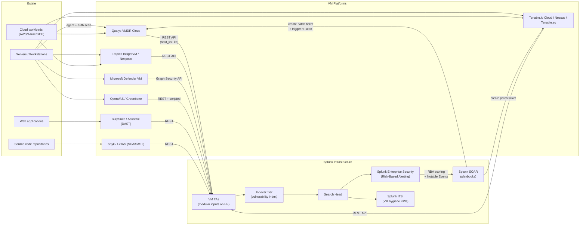

# Vulnerability Management (Qualys, Tenable, Rapid7, Microsoft) Integration Guide

> The definitive guide to integrating vulnerability management with
> Splunk. **200 use cases** covering Qualys VMDR, Tenable
> (Nessus/Tenable.io/Tenable.sc), Rapid7 (InsightVM/Nexpose),
> Microsoft Defender Vulnerability Management, OpenVAS / Greenbone,
> DAST tools (BurpSuite, Acunetix), and SCA/SAST (Snyk, GHAS).
> CVE/CVSS/EPSS/KEV-driven prioritization, exploit-evidence-based
> risk scoring, patch SLA tracking, and the full vulnerability
> lifecycle from discovery to remediation. Make your patching
> evidence-based, not panic-based.

---

## Table of Contents

- [Quick Start](#quick-start)
- [Overview](#overview)
- [Architecture and Data Flow](#architecture)
- [Prerequisites](#prerequisites)
- [Platform Coverage Matrix](#platform-matrix)
- [Qualys VMDR](#qualys)
- [Tenable (Nessus / Tenable.io / Tenable.sc)](#tenable)
- [Rapid7 (InsightVM / Nexpose)](#rapid7)
- [Microsoft Defender Vulnerability Management](#mdvm)
- [OpenVAS / Greenbone](#openvas)
- [DAST tools (BurpSuite, Acunetix)](#dast)
- [SCA / SAST (Snyk, GitHub Advanced Security)](#sca-sast)
- [CVSS, EPSS, KEV — Prioritization Frameworks](#prioritization)
- [Field Dictionary (Cross-Vendor)](#field-dictionary)
- [Sample Events](#sample-events)
- [Splunk-Side Configuration](#splunk-config)
- [Cross-Product Correlation (EDR + Vuln)](#cross-product)
- [CIM Mapping Reference](#cim-mapping)
- [Splunk ES Risk-Based Alerting](#es-rba)
- [Compliance Mapping](#compliance)
- [Capacity Planning and Sizing](#sizing)
- [Recommended Dashboard Layouts](#dashboards)
- [ITSI Service Modeling](#itsi)
- [SOAR Playbook Examples](#soar)
- [Multi-Tenant / Multi-BU Strategy](#multi-tenant)
- [Security Hardening](#security-hardening)
- [Crawl / Walk / Run Roadmap](#roadmap)
- [Validation Checklist](#validation-checklist)
- [Known Limitations and Gaps](#known-limitations)
- [Troubleshooting](#troubleshooting)
- [FAQ](#faq)
- [Glossary](#glossary)
- [References](#references)
- [Contribution and Feedback](#contribution)

---

<a id="quick-start"></a>
## Quick Start — 60 Minutes to First Vulnerability Insight

> Pick the section for your scanner. **All scanners share the same
> end-state**: vulnerability + asset events flow into the
> `vulnerability` index, normalize via Vulnerabilities CIM, ready for
> CVE prioritization, KEV cross-reference, EDR-evidence correlation,
> and SLA tracking dashboards.

### Qualys VMDR (fastest)

1. Install [TA-QualysCloudPlatform (Splunkbase 2964)](https://splunkbase.splunk.com/app/2964) on a Heavy Forwarder.
2. Create Qualys API user (Manager role; consider read-only via Reader role).
3. Configure the TA (Splunk Web → Qualys Cloud Platform):
    - API URL: `https://qualysapi.qg2.apps.qualys.com` (regional)
    - Username + password (encrypted)
    - Schedule: detection sync every 1h, KB sync every 24h, asset sync every 6h
4. Validate: `index=vulnerability sourcetype="qualys:host_detection" earliest=-24h | stats count by SEVERITY`

### Tenable.io / Nessus

1. Install [Splunk Add-on for Tenable (Splunkbase 4060)](https://splunkbase.splunk.com/app/4060).
2. Generate Tenable API keys (Tenable.io: My Profile > API Keys).
3. Configure TA with access key + secret key.
4. Validate: `index=vulnerability sourcetype="tenable:io:vuln" earliest=-24h | stats count by severity`

### Rapid7 InsightVM

1. Install [Splunk Add-on for Rapid7 (Splunkbase 4889)](https://splunkbase.splunk.com/app/4889).
2. Generate API key in InsightVM Console (Administration > Tools > API).
3. Configure TA with InsightVM URL + API key.
4. Validate: `index=vulnerability sourcetype="rapid7:insightvm:*" earliest=-24h | stats count by sourcetype`

### Activate crawl tier

UC-10.6.1 (Critical CVE Inventory), UC-10.6.x (KEV Coverage), UC-10.6.x (SLA tracking).

---

<a id="overview"></a>
## Overview

### Why Vulnerability Management matters

VM is the **systematic discovery, prioritization, remediation, and verification of weaknesses** in your estate. Without Splunk integration:

- Patch teams chase CVSS-9.x phantoms while real exploit risk goes unpatched
- No correlation between scanner findings and actual exploit evidence (EDR)
- SLA reporting via spreadsheet — auditors lose patience
- Multi-scanner deployments duplicate findings without dedup

### What this guide covers

| Platform | Use case fit |
|---------|------------|
| **Qualys VMDR** | Cloud-native VM with CMDB integration |
| **Tenable Nessus / IO / SC** | Industry-standard scanner; cloud and on-prem |
| **Rapid7 InsightVM / Nexpose** | InsightVM cloud, Nexpose on-prem |
| **Microsoft Defender VM** | Free-tier with M365 E5 / standalone |
| **OpenVAS / Greenbone** | Open-source baseline |
| **DAST (Burp / Acunetix)** | Web application scanning |
| **SCA / SAST (Snyk / GHAS)** | Code + dependency scanning |

### Domains covered

| Domain | Examples |
|--------|---------|
| **Asset inventory** | Cross-scanner asset normalisation |
| **CVE prioritization** | CVSS + EPSS + KEV + Exploit evidence |
| **SLA tracking** | Time-to-patch by severity, by BU |
| **Patch validation** | Re-scan confirmation |
| **Risk-based alerting** | High-risk + exploited + critical asset |
| **Compliance** | PCI 11.x, NIST 800-53<sup class="ref">[<a href="#ref-2">2</a>]</sup>, ISO |
| **Web app scanning** | OWASP Top 10<sup class="ref">[<a href="#ref-10">10</a>]</sup>, DAST findings |
| **Code scanning** | SCA, SAST, secret scanning |

### What's NOT in scope

| Domain | Where to look |
|--------|---------------|
| **Endpoint detection** | [EDR Guide](edr.md) |
| **Network IDS** | [Firewalls Guide](firewalls.md) |
| **Patch deployment** | SCCM / Intune / MECM (separate) |
| **CMDB** | ServiceNow / external |

### What good looks like

| Dimension | Without integration | With full VM + ES + SOAR |
|-----------|---------------------|---------------------------|
| Patch prioritization | CVSS-9.x panic | Exploit-aware (EPSS + KEV + EDR evidence) |
| Multi-scanner dedup | Manual spreadsheet | Splunk-side normalised view |
| SLA reporting | Manual quarterly | Real-time dashboard |
| Patch validation | Hope | Automated re-scan trigger via SOAR |
| Audit evidence | PDF screenshots | Splunk drill-through proof |

---

<a id="architecture"></a>
## Architecture and Data Flow



### Core principles

- **VM platforms remain authoritative** for scan execution and findings
- **Splunk is the cross-vendor risk lens** + correlation engine
- **Splunk ES Risk-Based Alerting** prioritizes via EPSS + KEV + EDR + CVSS
- **Splunk SOAR triggers patch tickets and re-scans** post-remediation

---

<a id="prerequisites"></a>
## Prerequisites

| Item | Detail |
|------|--------|
| **Splunk version** | 9.0+ Enterprise or Cloud |
| **Splunk ES** | 7.x+ (Risk-Based Alerting strongly recommended) |
| **Splunk SOAR** | 6.x+ (for ticket auto-creation) |
| **CIM 6.x** | Vulnerabilities, Inventory, Identity Management |
| **Splunk Threat Intelligence** | KEV ingest, EPSS scoring |
| **Heavy Forwarder** | For VM API polling |

### Scanner-side requirements

| Platform | Required permissions |
|---------|---------------------|
| **Qualys** | Manager (or Reader for read-only) API user |
| **Tenable.io** | API access key + secret key |
| **Tenable.sc** | API user with Auditor role |
| **Rapid7 InsightVM** | API key (admin or read-only role) |
| **MDVM** | App registration with `Vulnerability.Read.All` |
| **GitHub Advanced Security** | Personal access token + repo scope |

---

<a id="platform-matrix"></a>
## Platform Coverage Matrix

| Platform | TA | Splunkbase | Sourcetypes | Cloud-vetted |
|---------|----|-----------|-------------|--------------|
| **Qualys VMDR** | TA-QualysCloudPlatform | [2964](https://splunkbase.splunk.com/app/2964) | `qualys:*` | Yes |
| **Tenable** | Splunk Add-on for Tenable | [4060](https://splunkbase.splunk.com/app/4060) | `tenable:*` | Yes |
| **Rapid7** | Splunk Add-on for Rapid7 | [4889](https://splunkbase.splunk.com/app/4889) | `rapid7:*` | Yes |
| **MDVM** | Microsoft 365 Defender Add-on | [6207](https://splunkbase.splunk.com/app/6207) | `microsoft:defender:exposure` | Yes |
| **OpenVAS** | (custom REST input) | n/a | `openvas:report` | n/a |
| **Snyk** | (custom REST / webhook) | n/a | `snyk:vuln` | n/a |
| **GHAS** | (REST / webhook) | n/a | `github:advanced_security` | n/a |

---

<a id="qualys"></a>
## Qualys VMDR

### Key inputs

| Input | Description |
|-------|-------------|
| `host_detection` | Per-host CVE detections (the workhorse) |
| `vulnerability_kb` | Qualys KnowledgeBase (CVE descriptions) |
| `host_list` | Asset inventory |
| `scans` | Scan execution metadata |
| `audit` | Console audit events |
| `was` | Web Application Scanner findings |
| `policy_compliance` | PC findings |

### TA configuration

```ini
# TA-QualysCloudPlatform/local/inputs.conf
[qualys://host_detection]
api_user = svc-splunk-qualys
api_password = <encrypted>
api_url = https://qualysapi.qg2.apps.qualys.com
sourcetype = qualys:host_detection
index = vulnerability
schedule = 0 */1 * * *
status = Active,Re-Opened,New
severity = 3,4,5

[qualys://knowledgebase]
api_user = svc-splunk-qualys
api_password = <encrypted>
api_url = https://qualysapi.qg2.apps.qualys.com
sourcetype = qualys:knowledgebase
index = vulnerability
schedule = 0 0 * * *

[qualys://host_list]
api_user = svc-splunk-qualys
api_password = <encrypted>
api_url = https://qualysapi.qg2.apps.qualys.com
sourcetype = qualys:asset
index = asset
schedule = 0 */6 * * *
```

### Sample event (host_detection)

```xml
<HOST>
    <ID>123456789</ID>
    <IP>10.10.10.10</IP>
    <DNS>ws-finance-001.corp.local</DNS>
    <NETBIOS>WS-FINANCE-001</NETBIOS>
    <OS>Microsoft Windows 11 Enterprise 22H2</OS>
    <DETECTION>
        <QID>91234</QID>
        <SEVERITY>5</SEVERITY>
        <PORT>0</PORT>
        <PROTOCOL>tcp</PROTOCOL>
        <RESULTS>Vulnerable patch level confirmed.</RESULTS>
        <STATUS>Active</STATUS>
        <FIRST_FOUND_DATETIME>2026-04-01T14:30:15Z</FIRST_FOUND_DATETIME>
        <LAST_FOUND_DATETIME>2026-04-25T14:30:15Z</LAST_FOUND_DATETIME>
        <TIMES_FOUND>15</TIMES_FOUND>
    </DETECTION>
</HOST>
```

### Sample event (KnowledgeBase entry for QID)

```xml
<VULN>
    <QID>91234</QID>
    <VULN_TYPE>Vulnerability</VULN_TYPE>
    <SEVERITY_LEVEL>5</SEVERITY_LEVEL>
    <TITLE>Microsoft Windows Critical Privilege Escalation Vulnerability</TITLE>
    <CATEGORY>Windows</CATEGORY>
    <CVE_LIST>
        <CVE>
            <ID>CVE-2026-12345</ID>
            <URL>https://nvd.nist.gov/vuln/detail/CVE-2026-12345</URL>
        </CVE>
    </CVE_LIST>
    <CVSS_V3>
        <BASE>9.8</BASE>
    </CVSS_V3>
</VULN>
```

### Top Qualys UCs

| UC | Description |
|----|------------|
| UC-10.6.1 | Critical CVE Inventory |
| UC-10.6.x | KEV (CISA Known Exploited) Coverage |
| UC-10.6.x | Patch SLA — Sev-5 within 7 days |
| UC-10.6.x | Asset coverage % (scanned/known) |
| UC-10.6.x | Aging vulnerabilities (>30/60/90 days) |

---

<a id="tenable"></a>
## Tenable (Nessus / Tenable.io / Tenable.sc)

### Key inputs

| Input | Description |
|-------|-------------|
| `tenable:io:vuln` | Per-host CVE detections |
| `tenable:io:asset` | Asset inventory |
| `tenable:io:scan` | Scan execution metadata |
| `tenable:sc:vuln` | Tenable.sc (formerly SecurityCenter) findings |
| `tenable:nessus:scan` | Nessus standalone scan results |

### TA configuration

```ini
# Splunk_TA_tenable/local/inputs.conf

# Tenable.io
[tenable_io://prod]
access_key = <encrypted>
secret_key = <encrypted>
url = https://cloud.tenable.com
sourcetype_vulns = tenable:io:vuln
sourcetype_assets = tenable:io:asset
index = vulnerability
schedule = 0 */1 * * *

# Tenable.sc (on-prem)
[tenable_sc://prod]
url = https://tenable-sc.corp.local
access_key = <encrypted>
secret_key = <encrypted>
sourcetype = tenable:sc:vuln
index = vulnerability
schedule = 0 */2 * * *
```

### Sample event (Tenable.io vuln)

```json
{
    "asset": {
        "uuid": "abcdef-1234-5678",
        "ipv4": "10.10.10.10",
        "fqdn": "ws-finance-001.corp.local",
        "hostname": "WS-FINANCE-001",
        "operating_system": "Microsoft Windows 11 Enterprise"
    },
    "plugin": {
        "id": 12345,
        "name": "Microsoft Windows: CVE-2026-12345",
        "family": "Windows",
        "severity": 4,
        "cve": ["CVE-2026-12345"],
        "cvss3_base_score": 9.8,
        "exploit_available": true,
        "vpr": {
            "score": 9.5,
            "drivers": {
                "exploit_code_maturity": "FUNCTIONAL",
                "threat_intensity_last_28": "VERY_HIGH"
            }
        }
    },
    "first_found": "2026-04-01T14:30:15Z",
    "last_found": "2026-04-25T14:30:15Z",
    "state": "OPEN"
}
```

---

<a id="rapid7"></a>
## Rapid7 (InsightVM / Nexpose)

### TA configuration

```
# Splunk Web → Rapid7 Add-on → Add Account
URL: https://insightvm.example.com:3780
API Key: <encrypted>
Polling Interval: 3600s
```

### Sample event

```json
{
    "asset_id": 12345,
    "asset_ip": "10.10.10.10",
    "asset_hostname": "WS-FINANCE-001",
    "asset_os": "Microsoft Windows 11",
    "vuln_id": "msft-cve-2026-12345",
    "vuln_title": "Microsoft Windows: CVE-2026-12345",
    "severity": "Critical",
    "cvss_v3": 9.8,
    "exploits": [{"id": 4321, "title": "EXPLOIT-DB-50001"}],
    "malware_kits": [{"id": 11, "name": "Eternal Family"}],
    "first_found": "2026-04-01T14:30:15Z",
    "last_found": "2026-04-25T14:30:15Z"
}
```

---

<a id="mdvm"></a>
## Microsoft Defender Vulnerability Management

Free with M365 E5 license; standalone licensing also available.

### TA configuration

Uses the same Microsoft 365 Defender Add-on as MDE:

```
# Splunk Web → Microsoft 365 Defender Add-on → Edit Account
Additional API permissions:
    - WindowsDefenderATP.Vulnerability.Read.All
    - WindowsDefenderATP.SoftwareInventory.Read.All
```

### Sample event (MDVM vulnerability)

```json
{
    "id": "CVE-2026-12345",
    "name": "CVE-2026-12345",
    "description": "...",
    "severity": "Critical",
    "cvssV3": 9.8,
    "exposedMachinesCount": 234,
    "publishedOn": "2026-04-01",
    "updatedOn": "2026-04-15",
    "publicExploit": true,
    "exploitVerified": true,
    "exploitInKit": true,
    "exploitTypes": ["RemoteCodeExecution"],
    "exploitUris": ["https://github.com/example/poc"]
}
```

---

<a id="openvas"></a>
## OpenVAS / Greenbone

### Custom REST input via gvm-tools

```bash
# /opt/splunk/etc/apps/openvas_input/bin/openvas_pull.sh
#!/bin/bash
gvm-cli --gmp-username admin --gmp-password $PWD socket --xml '<get_reports/>' \
    | xmllint --format -
```

```ini
[script:///opt/splunk/etc/apps/openvas_input/bin/openvas_pull.sh]
sourcetype = openvas:report
index = vulnerability
interval = 3600
```

---

<a id="dast"></a>
## DAST tools (BurpSuite, Acunetix)

### BurpSuite Enterprise — REST polling

```bash
# Burp Enterprise REST API
curl -H "Authorization: $BURP_TOKEN" \
    "https://burp-enterprise.example.com/api/v0.1/scans" \
    > /tmp/burp-scans.json
```

```ini
[script:///opt/splunk/etc/apps/burp_input/bin/burp_pull.sh]
sourcetype = burpsuite:scan
index = vulnerability
interval = 1800
```

### Acunetix — webhook to HEC

```
# Acunetix webhook → POST to HEC endpoint
URL: https://hec.splunk.example.com:8088/services/collector/raw?sourcetype=acunetix:scan&index=vulnerability
Header: Authorization: Splunk <hec-token>
```

---

<a id="sca-sast"></a>
## SCA / SAST (Snyk, GitHub Advanced Security)

### Snyk webhook

```
# Snyk webhook → POST to HEC
URL: https://hec.splunk.example.com:8088/services/collector/raw?sourcetype=snyk:vuln&index=vulnerability
```

### GitHub Advanced Security — REST polling

```bash
# Pull GHAS code-scanning alerts
curl -H "Authorization: token $GH_PAT" \
    "https://api.github.com/orgs/yourorg/code-scanning/alerts?state=open"
```

---

<a id="prioritization"></a>
## CVSS, EPSS, KEV — Prioritization Frameworks

### Why CVSS alone is insufficient

CVSS scores are static — they don't reflect:
- Whether an exploit exists in the wild
- Whether it's actively used by threat actors
- Whether your specific asset is reachable

### Combine: CVSS + EPSS + KEV + EDR Evidence

| Signal | Source |
|--------|--------|
| **CVSS v3 base** | Scanner output |
| **EPSS** (Exploit Prediction Scoring System) | https://www.first.org/epss/ |
| **KEV** (CISA Known Exploited Vulnerabilities<sup class="ref">[<a href="#ref-1">1</a>]</sup>) | https://www.cisa.gov/known-exploited-vulnerabilities-catalog |
| **EDR exploit detection** | Cat 10.3 EDR data |
| **Asset criticality** | CMDB / ServiceNow |
| **Network exposure** | Internet-facing? Behind firewall? |

### EPSS daily ingest (lookup)

```bash
# Daily cronjob to fetch EPSS
curl -L "https://epss.cyentia.com/epss_scores-current.csv.gz" -o /tmp/epss.csv.gz
gunzip /tmp/epss.csv.gz
mv /tmp/epss.csv /opt/splunk/etc/apps/vuln_lookups/lookups/epss.csv
```

```ini
# transforms.conf
[epss_lookup]
filename = epss.csv
case_sensitive_match = false
```

### CISA KEV daily ingest

```bash
curl -L "https://www.cisa.gov/sites/default/files/csv/known_exploited_vulnerabilities.csv" \
    -o /opt/splunk/etc/apps/vuln_lookups/lookups/cisa_kev.csv
```

### Risk-weighted prioritization SPL

```spl
| `vulnerability_dm` 
| eval cve_id = mvindex(cve, 0)
| lookup epss_lookup cve as cve_id OUTPUT epss as epss_score, percentile as epss_percentile
| lookup cisa_kev_lookup cveID as cve_id OUTPUT shortDescription as kev_description, dueDate as kev_remediation_due
| eval is_kev = if(isnotnull(kev_description), 1, 0)
| eval risk_score = cvss_v3_base * 5 + (epss_score * 20) + (is_kev * 30)
| sort -risk_score
| head 50
```

---

<a id="field-dictionary"></a>
## Field Dictionary (Cross-Vendor)

After Vulnerabilities CIM mapping:

| Field | Qualys | Tenable | Rapid7 | MDVM | Sysadmin meaning |
|-------|--------|---------|--------|------|------------------|
| `dest` | DNS / NETBIOS / IP | hostname / fqdn / ipv4 | asset_hostname / asset_ip | computerDnsName | host being scanned |
| `cve` | CVE_LIST.CVE.ID | plugin.cve | (custom) | id (when CVE-formatted) | CVE identifier |
| `cvss_v3_base` | CVSS_V3.BASE | plugin.cvss3_base_score | cvss_v3 | cvssV3 | CVSS 3.x base score |
| `severity` | SEVERITY (1-5) | plugin.severity (0-4) | severity (Critical/High/Med/Low) | severity (Critical/High/...) | scanner severity |
| `signature` | KB title (lookup) | plugin.name | vuln_title | name | vuln title |
| `signature_id` | QID | plugin.id | vuln_id | (id) | scanner-specific ID |
| `vendor_product` | (derive) | (derive) | (derive) | (derive) | affected product |
| `first_found` | FIRST_FOUND_DATETIME | first_found | first_found | publishedOn | first detection |
| `last_found` | LAST_FOUND_DATETIME | last_found | last_found | updatedOn | last detection |
| `status` | STATUS | state | (custom) | (custom) | Open/Fixed/etc. |
| `exploit_available` | (lookup KB) | plugin.exploit_available | exploits[*] | publicExploit | known exploit? |

---

<a id="sample-events"></a>
## Sample Events

(See per-platform sections.)

---

<a id="splunk-config"></a>
## Splunk-Side Configuration

### Index strategy

```ini
[vulnerability]
homePath = $SPLUNK_DB/vulnerability/db
maxDataSize = auto_high_volume
frozenTimePeriodInSecs = 31536000   # 1 year (compliance evidence)

[vuln_scans]
homePath = $SPLUNK_DB/vuln_scans/db
maxDataSize = auto_high_volume
frozenTimePeriodInSecs = 7776000   # 90 days (scan execution audit)

[asset]
homePath = $SPLUNK_DB/asset/db
frozenTimePeriodInSecs = 31536000   # 1 year
```

### CIM data model acceleration

```ini
[Vulnerabilities]
acceleration = 1
acceleration.earliest_time = -90d
acceleration.cron_schedule = 23 * * * *

[Inventory]
acceleration = 1
acceleration.earliest_time = -30d
acceleration.cron_schedule = 28 * * * *
```

### Lookups maintained daily

| Lookup | Source | Update |
|--------|--------|--------|
| `epss.csv` | first.org/epss | Daily |
| `cisa_kev.csv` | cisa.gov | Daily |
| `cve_db.csv` | NVD JSON | Weekly |
| `asset_owners.csv` | CMDB | Daily sync |

---

<a id="cross-product"></a>
## Cross-Product Correlation (EDR + Vuln)

### Exploited CVE on host

```spl
(index=edr DetectName="*Exploit*" earliest=-7d)
OR (index=vulnerability earliest=-7d severity IN ("Critical","High"))
| eval host_id = lower(coalesce(host, dest, ComputerName, computerDnsName))
| stats values(cve) as cves, values(DetectName) as detections by host_id
| where mvcount(detections) > 0 AND mvcount(cves) > 0
```

### Asset-criticality + KEV cross-reference

```spl
| `vulnerability_dm` cve=*
| lookup cisa_kev_lookup cveID as cve OUTPUT shortDescription as kev_desc
| where isnotnull(kev_desc)
| lookup asset_criticality_lookup host as dest OUTPUT criticality, business_owner
| where criticality IN ("CRITICAL","HIGH")
| stats values(cve) as kev_cves by dest, business_owner, criticality
```

### Patch SLA breach

```spl
| `vulnerability_dm` status="Open"
| eval days_open = round((now() - first_found_epoch) / 86400, 0)
| eval sla_target = case(severity="Critical", 7, severity="High", 14, severity="Medium", 30, severity="Low", 90)
| eval sla_breached = if(days_open > sla_target, "Yes", "No")
| stats count by severity, sla_breached
```

---

<a id="cim-mapping"></a>
## CIM Mapping Reference

| CIM model | Sourcetype | Auto-mapped? |
|-----------|-----------|--------------|
| **Vulnerabilities** | `qualys:host_detection`, `tenable:io:vuln`, `rapid7:insightvm:vuln`, `microsoft:defender:vulnerability` | Yes (per TA) |
| **Inventory** | `qualys:asset`, `tenable:io:asset`, `rapid7:insightvm:asset` | Yes |
| **Web** | `qualys:was`, `burpsuite:scan` | Partial |

---

<a id="es-rba"></a>
## Splunk ES Risk-Based Alerting

### RBA — Vulnerability + Identity + EDR

```spl
| `vulnerability_dm` severity IN ("Critical","High")
| lookup epss_lookup cve OUTPUT epss
| lookup cisa_kev_lookup cveID as cve OUTPUT shortDescription as kev
| eval risk_score = case(
    isnotnull(kev) AND severity="Critical", 100,
    epss > 0.5, 80,
    severity="Critical", 60,
    severity="High", 40,
    1=1, 20)
| eval risk_object_type = "system"
| eval risk_object = dest
| `update_risk(risk_score, risk_object, risk_object_type, "Vulnerability detected")`
```

Combined with EDR risk events from cat 10.3, ES RBA aggregates per-asset risk and surfaces only the highest-priority targets.

---

<a id="compliance"></a>
## Compliance Mapping

### NIST 800-53

| Control | Coverage |
|---------|----------|
| **RA-5** Vulnerability Scanning | All scanner UCs |
| **SI-2** Flaw Remediation | Patch SLA tracking UCs |
| **CA-7** Continuous Monitoring | Continuous scan + dashboard |
| **CM-3** Config Change Control | New vulns post-config-change UC |

### PCI-DSS 4.0

| Requirement | Coverage |
|-------------|----------|
| **6.3.1** | Identify vulnerabilities in custom code |
| **6.3.3** | Patches installed within 1 month (Critical) |
| **11.3.1** | Internal vulnerability scans quarterly |
| **11.3.2** | External vulnerability scans (ASV) quarterly |
| **11.4.x** | Address vulnerabilities found |

### NIS2

| Article | Coverage |
|---------|----------|
| **Art 21(2)(b)** Vulnerability handling and disclosure | All UCs |
| **Art 21(2)(d)** Supply chain security (SCA) | Snyk/GHAS UCs |

### CISA KEV (Mandatory for federal)

Federal agencies and many private sector orgs are required to remediate KEV-listed vulnerabilities within specific deadlines. Splunk dashboard tracks KEV remediation against CISA-mandated due dates.

---

<a id="sizing"></a>
## Capacity Planning and Sizing

### Per-platform ingest (typical)

| Platform | 10K asset estate daily |
|---------|------------------------|
| Qualys host_detection (Active+Re-Opened only) | ~500 MB |
| Qualys host_detection (all states) | ~5 GB |
| Tenable.io vulns | ~300 MB |
| Rapid7 InsightVM vulns | ~400 MB |
| MDVM | ~50 MB (alert-tier only) |

### Retention recommendations

| Data | Retention | Rationale |
|------|-----------|-----------|
| Vulnerability findings | 1 year+ | Audit, trend, SLA |
| Scan execution metadata | 90 days | Operational |
| Asset inventory | 1 year+ | Trend, audit |

---

<a id="dashboards"></a>
## Recommended Dashboard Layouts

### Crawl — "VM At a Glance"

```
+---------------------+---------------------+
| OPEN CRITICAL CVES TOTAL                   |
+---------------------+---------------------+
| KEV-LISTED OPEN VULNERABILITIES            |
+---------------------+---------------------+
| TOP-10 MOST VULNERABLE HOSTS               |
+---------------------+---------------------+
| SCAN COVERAGE % (scanned vs known assets)  |
+---------------------+---------------------+
```

### Walk — "Patch SLA & Aging"

```
+---------------------+---------------------+
| SLA BREACHES BY SEVERITY                   |
+---------------------+---------------------+
| AGING — VULN COUNT BY AGE BUCKET           |
| (0-7d / 7-30d / 30-90d / 90+ days)         |
+---------------------+---------------------+
| MTTR PATCH (mean time to remediate)        |
+---------------------+---------------------+
| TOP UNPATCHED CVES (by host count)         |
+---------------------+---------------------+
```

### Run — "Risk-Based Prioritization"

```
+---------------------+---------------------+
| KEV + EXPLOITED + CRITICAL ASSET            |
| (the "patch this week" list)               |
+---------------------+---------------------+
| EPSS-RANKED CVES (>50th percentile)        |
+---------------------+---------------------+
| EDR-EVIDENCE-WEIGHTED VULN PRIORITY         |
+---------------------+---------------------+
| RBA RISK-SCORED ASSETS                     |
+---------------------+---------------------+
```

---

<a id="itsi"></a>
## ITSI Service Modeling

### Service hierarchy

```
Vulnerability Management Posture
├── Per-Vendor VM Coverage
│   ├── Qualys
│   ├── Tenable
│   ├── Rapid7
│   └── MDVM
├── Patch SLA Compliance
│   ├── Critical (7-day SLA)
│   ├── High (14-day SLA)
│   ├── Medium (30-day SLA)
│   └── Low (90-day SLA)
└── Risk Surface
    ├── KEV exposure
    ├── EPSS-high exposure
    └── Internet-facing critical
```

### Recommended KPIs

| KPI | Source | Threshold |
|-----|--------|-----------|
| Open Critical CVE count | Vuln DM | Static (warn > 50, crit > 200) |
| KEV-listed open count | Cross-lookup | Static (warn > 5, crit > 20) |
| SLA breach % | SLA calc | Static (warn > 10%, crit > 25%) |
| Asset scan coverage % | Asset DM | Static (warn < 95%) |
| MTTR Critical patches | Time delta | Adaptive |

---

<a id="soar"></a>
## SOAR Playbook Examples

### Playbook 1: New KEV-Listed CVE Detected

**Trigger:** New vuln finding where CVE in CISA KEV.

```
1. ENRICH affected hosts (asset criticality, owner)
2. CREATE Sev-1 Jira ticket per host (or aggregate)
3. ASSIGN to BU patch team
4. NOTIFY SOC + Patch + Compliance
5. SCHEDULE auto-rescan for 7 days from now
```

### Playbook 2: Critical CVE on Internet-Facing Host

**Trigger:** Vuln finding Critical severity on host tagged `internet-facing=true` in CMDB.

```
1. PRIORITIZE — push to top of patch queue
2. CREATE Sev-1 ticket
3. NOTIFY CISO
4. (Optional) AUTO-WAF-RULE if vendor supports virtual patching
5. SCHEDULE auto-rescan post-patch
```

### Playbook 3: Patch Validation

**Trigger:** Manual ticket close OR scheduled re-scan.

```
1. TRIGGER on-demand re-scan via VM API
2. WAIT 30 min for scan completion
3. QUERY new finding state for the CVE+host
4. IF still Open → reopen ticket, escalate
   IF Fixed → close ticket, log evidence
```

---

<a id="multi-tenant"></a>
## Multi-Tenant / Multi-BU Strategy

- **Per-BU Qualys subscriptions / Tenable container scans** for ownership clarity
- **Asset criticality lookup per-BU** drives RBA prioritization
- **Per-BU dashboards** with role-based access
- **Per-BU patch SLA targets** (e.g., financial > IT > dev)

---

<a id="security-hardening"></a>
## Security Hardening

- Read-only API users where possible (Qualys Reader, Tenable read-only role)
- API keys rotated quarterly
- Field-level RBAC (vulnerability findings can include sensitive software inventory)
- Audit immutable: forward all VM admin actions to write-once index
- TLS for all VM API connections

---

<a id="roadmap"></a>
## Crawl / Walk / Run Roadmap

### Crawl (Week 1–4)

1. Deploy primary VM TA
2. CIM Vulnerabilities + Inventory acceleration
3. KEV + EPSS daily lookups maintained
4. At-a-glance dashboard live
5. UC-10.6.1 alert wired

### Walk (Month 2–3)

1. Onboard remaining VM vendors (multi-source dedup)
2. Patch SLA tracking dashboard
3. Asset criticality lookup integrated
4. ES RBA risk-scoring active

### Run (Month 4+)

1. Full SOAR playbook auto-ticketing
2. Auto-rescan validation flow
3. Quarterly executive risk reporting
4. Cross-product (EDR + Vuln) correlation
5. Monthly KEV remediation review

---

<a id="validation-checklist"></a>
## Validation Checklist

### Day 1

- [ ] First VM TA installed
- [ ] First vuln finding visible
- [ ] KEV + EPSS lookups in place

### Day 7

- [ ] All VM vendors onboarded
- [ ] CIM Vulnerabilities accelerated
- [ ] At-a-glance dashboard live

### Day 30

- [ ] SLA tracking dashboard live
- [ ] ES RBA risk scoring active
- [ ] First SOAR auto-ticket created

### Day 90

- [ ] Full SOAR validation flow
- [ ] Quarterly exec report generated
- [ ] Cross-product correlation operational

---

<a id="known-limitations"></a>
## Known Limitations and Gaps

| Limitation | Impact | Workaround |
|------------|--------|------------|
| **Multi-scanner deduplication is hard** | Same CVE reported by Qualys+Tenable | Splunk-side dedup by CVE+host_id (see Cross-Product) |
| **Asset name normalisation** | "WS-001" vs "ws-001.corp.local" vs IP | Normalize host_id via CMDB lookup |
| **Scanner-side false positives** | Real but unexploitable findings | Use SOAR to capture suppression rationale |
| **Authenticated vs unauth scans** | Different detection coverage | Track scan_type in dashboard |
| **Scan window blackouts** | No fresh data during change windows | Schedule offset scans |
| **EPSS lookup CSV refresh** | Stale data if cron fails | Monitor lookup mtime; alert if stale |

---

<a id="troubleshooting"></a>
## Troubleshooting

### Qualys host_detection input not pulling

```
# Check TA log
index=_internal source=*qualys* log_level=ERROR

# Test API auth manually
curl -u "user:pwd" "https://qualysapi.qg2.apps.qualys.com/api/2.0/fo/scan/?action=list"
```

### Tenable.io 403 errors

- Verify API access key + secret key are tied to a user with sufficient permissions
- Check rate limits — Tenable.io limits to ~3,000 calls/minute per token

### Rapid7 polling too slow

- Increase HF polling interval to 6h for vuln data
- Use REST endpoint pagination correctly (page-based, not offset-based)

### EPSS lookup not found in dashboards

- Verify file is in `lookups/` directory of the app
- Check transforms.conf points to correct filename
- Run `| inputlookup epss_lookup | head 1` to verify

### Vulnerabilities CIM returns nothing

- Verify TA-side CIM mapping (props.conf)
- Check acceleration completed: `| rest /services/datamodel/acceleration/info`
- Verify sourcetype tagged correctly with `tag=vulnerability`

---

<a id="faq"></a>
## FAQ

**Q: Which scanner should I use?**
A: All three majors (Qualys, Tenable, Rapid7) cover ~95% the same CVEs. Choice depends on existing relationships, cloud vs on-prem preference, and price. Multi-scanner is common for redundancy.

**Q: Should I rely only on CVSS for prioritization?**
A: No. CVSS misses temporal/environmental factors. Always combine with EPSS (probability of exploitation) and KEV (proof of active exploitation).

**Q: Is MDVM enough by itself?**
A: For Windows + Linux + Mac estates with M365 E5, often yes. For network appliances, IoT, OT, you'll still need a traditional scanner.

**Q: How do I dedupe findings across multiple scanners?**
A: Splunk-side: GROUP BY (CVE, normalized_host_id). Use the highest CVSS and earliest first_found.

**Q: How often should I scan?**
A: Authenticated agent-based: continuous. Network-based unauth: weekly minimum, daily for internet-facing.

**Q: What's a good patch SLA?**
A: NIST/PCI suggest: Critical 7d, High 14d, Medium 30d, Low 90d. Tighten for internet-facing.

**Q: How do I deal with vendor "won't fix" findings?**
A: Use SOAR to capture and tag exception with: (1) compensating control, (2) business justification, (3) review date.

**Q: Is virtual patching via WAF a substitute for real patching?**
A: A bridge, not a replacement. Track virtual-patched vulns separately and remediate properly within reasonable timeframe.

---

<a id="glossary"></a>
## Glossary

| Term | Definition |
|------|-----------|
| **CVE** | Common Vulnerabilities and Exposures (vuln identifier) |
| **CVSS** | Common Vulnerability Scoring System (severity 0-10) |
| **EPSS** | Exploit Prediction Scoring System (probability 0-1) |
| **KEV** | Known Exploited Vulnerabilities (CISA catalog) |
| **VPR** | Vulnerability Priority Rating (Tenable proprietary) |
| **VMDR** | Vulnerability Management, Detection, and Response (Qualys product) |
| **SCA** | Software Composition Analysis (dependency scanning) |
| **SAST** | Static Application Security Testing (code analysis) |
| **DAST** | Dynamic Application Security Testing (running app) |
| **WAF** | Web Application Firewall |
| **RBA** | Risk-Based Alerting (Splunk ES) |
| **NVD** | National Vulnerability Database (NIST) |
| **OWASP Top 10** | Web app security risk taxonomy |

---

<a id="references"></a>
## References

- [TA-QualysCloudPlatform (Splunkbase 2964)](https://splunkbase.splunk.com/app/2964)
- [Splunk Add-on for Tenable (Splunkbase 4060)](https://splunkbase.splunk.com/app/4060)
- [Splunk Add-on for Rapid7 (Splunkbase 4889)](https://splunkbase.splunk.com/app/4889)
- [Microsoft 365 Defender Add-on (Splunkbase 6207)](https://splunkbase.splunk.com/app/6207)
- [Splunk Enterprise Security](https://splunkbase.splunk.com/app/263)
- [CISA KEV catalog](https://www.cisa.gov/known-exploited-vulnerabilities-catalog)
- [EPSS scoring](https://www.first.org/epss/)
- [NVD JSON feeds](https://nvd.nist.gov/vuln/data-feeds)
- [CIM Vulnerabilities model](https://docs.splunk.com/Documentation/CIM/latest/User/Vulnerabilities)
- [Risk-Based Alerting (Splunk Lantern)](https://lantern.splunk.com/)

---

<a id="contribution"></a>
## Contribution and Feedback

Part of the [Splunk Monitoring Use Cases](https://github.com/fenre/splunk-monitoring-use-cases) project. [Open an issue](https://github.com/fenre/splunk-monitoring-use-cases/issues/new).

---

*Last updated: 2026-05-09. Covers TA-QualysCloudPlatform 1.x, Splunk Add-on for Tenable 7.x, Splunk Add-on for Rapid7 1.x, Microsoft 365 Defender Add-on 1.x.*

---

<!-- BEGIN-AUTOGENERATED-SOURCES -->

## References

*Auto-generated by `scripts/generate_doc_references.py` from `data/source-references.json` and `data/source-mappings.json`. Edit those files (or the document body) to change citations; this footer is rewritten on every run.*

### Primary sources

<a id="ref-1"></a>**[1]** Cybersecurity and Infrastructure Security Agency. (2026). *CISA Known Exploited Vulnerabilities Catalog*. U.S. Department of Homeland Security. Retrieved May 11, 2026, from https://www.cisa.gov/known-exploited-vulnerabilities-catalog

<a id="ref-2"></a>**[2]** National Institute of Standards and Technology. (2020). *Security and Privacy Controls for Information Systems and Organizations* (Revision 5). U.S. Department of Commerce. NIST SP 800-53 Rev. 5. https://csrc.nist.gov/pubs/sp/800/53/r5/upd1/final

### Supporting sources

<a id="ref-3"></a>**[3]** American Institute of Certified Public Accountants. (2017). *Trust Services Criteria (2017) for Security, Availability, Processing Integrity, Confidentiality, and Privacy*. AICPA & CIMA. SOC 2 / TSP Section 100. https://www.aicpa-cima.com/topic/audit-assurance/soc-suite-of-services

<a id="ref-4"></a>**[4]** Center for Internet Security. (2021). *CIS Critical Security Controls v8* (v8). https://www.cisecurity.org/controls

<a id="ref-5"></a>**[5]** European Parliament and Council of the European Union. (2022, December). *Directive (EU) 2022/2555 — NIS2 Directive on cybersecurity*. Official Journal of the European Union, L 333. ELI: dir/2022/2555. https://eur-lex.europa.eu/eli/dir/2022/2555/oj

<a id="ref-6"></a>**[6]** International Organization for Standardization. (2022). *ISO/IEC 27001:2022 — Information security, cybersecurity and privacy protection — Information security management systems — Requirements*. ISO/IEC. ISO/IEC 27001:2022. https://www.iso.org/standard/27001

<a id="ref-7"></a>**[7]** MITRE Corporation. (2026). *MITRE ATT&CK Knowledge Base*. MITRE Engenuity. https://attack.mitre.org/

<a id="ref-8"></a>**[8]** National Institute of Standards and Technology. (2024). *Cybersecurity Framework (CSF) 2.0* (2.0). U.S. Department of Commerce. NIST CSWP 29. https://www.nist.gov/cyberframework

<a id="ref-9"></a>**[9]** OWASP Foundation. (2026). *OWASP Cheat Sheet Series*. OWASP Foundation, Inc. Retrieved May 11, 2026, from https://cheatsheetseries.owasp.org/

<a id="ref-10"></a>**[10]** OWASP Foundation. (2021). *OWASP Top 10:2021 — The Ten Most Critical Web Application Security Risks*. OWASP Foundation, Inc. Retrieved May 11, 2026, from https://owasp.org/Top10/

<a id="ref-11"></a>**[11]** Splunk Inc. (2026). *Splunk Common Information Model Add-on Manual*. Splunk LLC, a Cisco company. Retrieved May 11, 2026, from https://docs.splunk.com/Documentation/CIM

<a id="ref-12"></a>**[12]** Splunk Inc. (2026). *Splunk Enterprise Security Administration Manual*. Splunk LLC, a Cisco company. Retrieved May 11, 2026, from https://docs.splunk.com/Documentation/ES

<a id="ref-13"></a>**[13]** U.S. Department of Health & Human Services. (2002). *HIPAA Privacy Rule (45 CFR Parts 160 and 164, Subparts A and E)*. Office for Civil Rights, HHS. 45 CFR 160, 164. https://www.hhs.gov/hipaa/for-professionals/privacy/index.html

<a id="ref-14"></a>**[14]** U.S. Department of Health & Human Services. (2013). *HIPAA Security Rule (45 CFR Parts 160 and 164, Subparts A and C)*. Office for Civil Rights, HHS. 45 CFR 160, 164. https://www.hhs.gov/hipaa/for-professionals/security/index.html

<a id="ref-15"></a>**[15]** U.S. General Services Administration / FedRAMP PMO. (2023). *FedRAMP Security Controls Baseline, Rev. 5* (Rev. 5). FedRAMP Program Management Office. https://www.fedramp.gov/rev5/baselines/

<details>
<summary>Additional online sources cited in the document body (11)</summary>

<a id="ref-16"></a>**[16]** splunkbase.splunk.com. *TA-QualysCloudPlatform (Splunkbase 2964)*. Retrieved May 11, 2026, from https://splunkbase.splunk.com/app/2964

<a id="ref-17"></a>**[17]** splunkbase.splunk.com. *Splunk Add-on for Tenable (Splunkbase 4060)*. Retrieved May 11, 2026, from https://splunkbase.splunk.com/app/4060

<a id="ref-18"></a>**[18]** splunkbase.splunk.com. *Splunk Add-on for Rapid7 (Splunkbase 4889)*. Retrieved May 11, 2026, from https://splunkbase.splunk.com/app/4889

<a id="ref-19"></a>**[19]** splunkbase.splunk.com. *Splunkbase app #6207*. Retrieved May 11, 2026, from https://splunkbase.splunk.com/app/6207

<a id="ref-20"></a>**[20]** splunkbase.splunk.com. *Splunk Enterprise Security*. Retrieved May 11, 2026, from https://splunkbase.splunk.com/app/263

<a id="ref-21"></a>**[21]** first.org. *EPSS scoring*. Retrieved May 11, 2026, from https://www.first.org/epss/

<a id="ref-22"></a>**[22]** nvd.nist.gov. *NVD JSON feeds*. Retrieved May 11, 2026, from https://nvd.nist.gov/vuln/data-feeds

<a id="ref-23"></a>**[23]** docs.splunk.com. *CIM Vulnerabilities model*. Retrieved May 11, 2026, from https://docs.splunk.com/Documentation/CIM/latest/User/Vulnerabilities

<a id="ref-24"></a>**[24]** lantern.splunk.com. *Risk-Based Alerting (Splunk Lantern)*. Retrieved May 11, 2026, from https://lantern.splunk.com/

<a id="ref-25"></a>**[25]** github.com. *Splunk Monitoring Use Cases*. Retrieved May 11, 2026, from https://github.com/fenre/splunk-monitoring-use-cases

<a id="ref-26"></a>**[26]** github.com. *Open an issue*. Retrieved May 11, 2026, from https://github.com/fenre/splunk-monitoring-use-cases/issues/new

</details>

### Related repository documents

- [`docs/guides/edr.md`](edr.md)
- [`docs/guides/firewalls.md`](firewalls.md)

### Cited by

- [`docs/guides/edr.md`](edr.md)
- [`docs/guides/industry-verticals.md`](industry-verticals.md)
- [`docs/guides/siem-soar.md`](siem-soar.md)
- [`docs/regulatory-primer.md`](../regulatory-primer.md)

<!-- END-AUTOGENERATED-SOURCES -->
