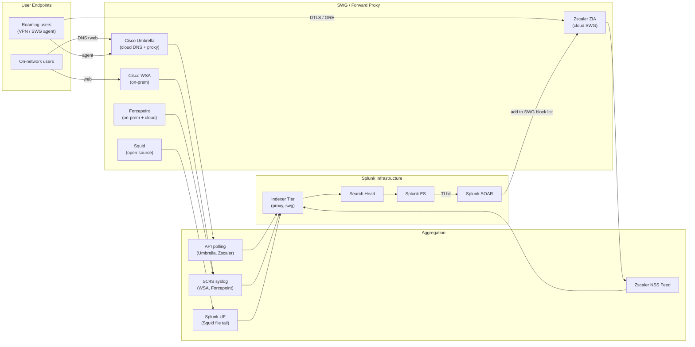

# Web Security / SWG / Forward Proxies (Zscaler, Cisco Umbrella, Forcepoint, Symantec ProxySG, Squid) Integration Guide

> The definitive guide to integrating Secure Web Gateways and forward
> proxies with Splunk. **25 use cases** in cat 10.5 plus
> security-relevant Squid use cases. Covers Zscaler Internet Access
> (ZIA), Cisco Umbrella + Cisco Secure Web Appliance (WSA / IronPort),
> Forcepoint Web Security, Broadcom/Symantec ProxySG (Blue Coat),
> Netskope, Trellix Web Gateway, and Squid open-source proxy. URL
> category trending, malware blocks, sanctioned vs unsanctioned SaaS
> usage, data exfil detection, anonymizer / VPN circumvention, and
> the SWG → DNS → AD identity chain integration via Splunk
> Enterprise Security.

---

## Table of Contents

- [Quick Start](#quick-start)
- [Overview](#overview)
- [Architecture and Data Flow](#architecture)
- [Prerequisites](#prerequisites)
- [Platform Coverage Matrix](#platform-matrix)
- [Zscaler Internet Access (ZIA)](#zscaler)
- [Cisco Umbrella](#umbrella)
- [Cisco Secure Web Appliance (WSA / IronPort)](#wsa)
- [Forcepoint Web Security](#forcepoint)
- [Broadcom/Symantec ProxySG (Blue Coat)](#proxysg)
- [Netskope Web](#netskope)
- [Trellix Web Gateway](#trellix)
- [Squid (open-source)](#squid)
- [URL Categorization & Block Categories](#categories)
- [Sanctioned vs Unsanctioned SaaS (Shadow IT)](#shadow-it)
- [SSL Inspection (TLS Decryption)](#ssl-inspection)
- [Field Dictionary (Cross-Vendor)](#field-dictionary)
- [Sample Events](#sample-events)
- [Splunk-Side Configuration](#splunk-config)
- [Cross-Product Correlation](#cross-product)
- [CIM Mapping Reference](#cim-mapping)
- [Splunk ES Notable Event Pipeline](#es-notable)
- [Compliance Mapping](#compliance)
- [Capacity Planning and Sizing](#sizing)
- [Recommended Dashboard Layouts](#dashboards)
- [ITSI Service Modeling](#itsi)
- [SOAR Playbook Examples](#soar)
- [Multi-Site / Roaming User Strategy](#multi-site)
- [Security Hardening](#security-hardening)
- [Crawl / Walk / Run Roadmap](#roadmap)
- [Validation Checklist](#validation-checklist)
- [Known Limitations and Gaps](#known-limitations)
- [Troubleshooting](#troubleshooting)
- [FAQ](#faq)
- [Glossary](#glossary)
- [References](#references)
- [Contribution and Feedback](#contribution)

---

<a id="quick-start"></a>
## Quick Start — 30 Minutes to First Web Security Insight

### Cisco Umbrella (DNS-layer + proxy)

1. Install [Splunk Add-on for Cisco Umbrella (Splunkbase 3088)](https://splunkbase.splunk.com/app/3088).
2. Umbrella Dashboard → Admin → API Keys → generate Reporting API key.
3. Configure Splunk Umbrella add-on with API key.
4. Validate: `index=proxy sourcetype="cisco:umbrella" earliest=-15m | stats count by action, categories`

### Zscaler Internet Access (ZIA)

1. Install [Splunk Add-on for Zscaler (Splunkbase 3866)](https://splunkbase.splunk.com/app/3866).
2. Configure Zscaler NSS Feed → Splunk HEC.
3. Validate: `index=proxy sourcetype="zscaler:web" earliest=-15m | stats count by action, urlcategory`

### Squid (open-source)

```ini
# UF inputs.conf
[monitor:///var/log/squid/access.log]
sourcetype = squid:access
index = proxy
```

### Activate crawl tier

UC-10.5.1 (Blocked Category Trending), UC-10.5.x (Top Blocked Domains), UC-10.5.x (User Web Activity), UC-10.5.x (SaaS Usage Discovery).

---

<a id="overview"></a>
## Overview

### Why SWG / Web Security matters

Web is the second most common attack vector after email. SWGs:
- **Block malicious URLs** (phishing, malware download, C2)
- **Enforce acceptable use policies** (gambling, adult content, etc.)
- **Detect data exfil** via web upload monitoring
- **Provide SaaS visibility** (sanctioned vs shadow IT)
- **Inspect TLS traffic** (decrypt → scan → re-encrypt)
- **Support roaming users** (cloud SWG via PAC / IPSec / DTLS tunnels)
- **DNS-layer protection** (Umbrella block at DNS query time)

### Platforms covered

| Platform | Deployment Model |
|---------|----------------|
| **Zscaler ZIA** | Cloud SWG; user-traffic via Zapp / GRE / IPSec |
| **Cisco Umbrella** | DNS-layer + cloud proxy + cloud firewall |
| **Cisco WSA (Secure Web Appliance)** | On-prem proxy / cloud-managed |
| **Forcepoint Web Security** | On-prem appliance + cloud SWG |
| **Symantec ProxySG (Blue Coat)** | Legacy on-prem appliance |
| **Netskope Web** | Cloud SWG + CASB combined |
| **Trellix Web Gateway** | On-prem + cloud SWG |
| **Squid** | Open-source forward/reverse proxy (legacy + dev/test) |

### Domains covered

| Domain | Examples |
|--------|---------|
| **Block category trending** | Daily blocks per URL category |
| **Top denied domains** | High-frequency blocks |
| **User web activity** | Per-user browsing summary |
| **SaaS discovery** | Sanctioned vs unsanctioned application use |
| **Data exfil detection** | Large uploads to non-corp domains |
| **Anonymizer/VPN bypass** | TOR, anonymizer category hits |
| **Compliance** | Acceptable use policy reporting |

### What's NOT in scope

| Domain | Where to look |
|--------|---------------|
| **NGFW URL filtering** | [NGFW Security Guide](ngfw-security.md) |
| **DNS infrastructure** | [DNS & DHCP Guide](dns-dhcp.md) |
| **Email URL Defense** | [Email Security Guide](email-security.md) |
| **EDR endpoint URL events** | [EDR Guide](edr.md) |
| **Reverse proxies / load balancers** | [API Gateways Guide](api-gateways.md) |

### What good looks like

| Dimension | Without integration | With full integration |
|-----------|---------------------|-----------------------|
| Roaming user web visibility | None (off-network) | Cloud SWG (Zscaler/Umbrella) |
| Blocked category trending | One-off vendor reports | Daily Splunk dashboard |
| SaaS shadow IT discovery | Manual surveys | Auto-discovered via SWG |
| Data exfil monitoring | Limited DLP | SWG + DLP integration |
| Auto-block policy update | Quarterly manual | SOAR-triggered immediate |

---

<a id="architecture"></a>
## Architecture and Data Flow



### Core principles

- **All web traffic → centralised Splunk** for cross-SWG view
- **CIM Web** is the unifier
- **DNS + Web layers complementary** (Umbrella both)
- **Roaming user coverage critical** in hybrid work era

---

<a id="prerequisites"></a>
## Prerequisites

| Item | Detail |
|------|--------|
| **Splunk version** | 9.0+ Enterprise / Cloud |
| **Splunk ES** | Recommended for full notable workflow |
| **CIM 6.x** | Web, Network_Resolution |
| **SC4S** | For on-prem WSA / Forcepoint |
| **API access** | Per-cloud-vendor (Umbrella API, Zscaler NSS) |
| **SWG license** | Per-vendor licensing |

---

<a id="platform-matrix"></a>
## Platform Coverage Matrix

| Platform | TA | Splunkbase | Sourcetypes |
|---------|----|-----------|-------------|
| **Cisco Umbrella** | Splunk Add-on for Cisco Umbrella | [3088](https://splunkbase.splunk.com/app/3088) | `cisco:umbrella`, `cisco:umbrella:dns`, `cisco:umbrella:proxy` |
| **Zscaler ZIA** | Splunk Add-on for Zscaler | [3866](https://splunkbase.splunk.com/app/3866) | `zscaler:web`, `zscaler:nss`, `zscaler:zia:web` |
| **Cisco WSA** | Splunk Add-on for Cisco WSA | [3658](https://splunkbase.splunk.com/app/3658) | `cisco:wsa:squid`, `cisco:wsa:w3c` |
| **Forcepoint Web** | Splunk Add-on for Forcepoint | [2887](https://splunkbase.splunk.com/app/2887) | `forcepoint:web:syslog`, `forcepoint:syslog` |
| **Symantec ProxySG (Blue Coat)** | (custom syslog via SC4S) | n/a | `bluecoat:proxysg`, `symantec:proxysg` |
| **Netskope** | (custom REST input) | n/a | `netskope:web` |
| **Trellix Web Gateway** | (custom syslog via SC4S) | n/a | `trellix:webgateway` |
| **Squid** | Splunk Add-on for Squid | [4088](https://splunkbase.splunk.com/app/4088) | `squid:access`, `squid:cache` |

---

<a id="zscaler"></a>
## Zscaler Internet Access (ZIA)

### NSS Feed configuration

```
Zscaler Admin → Administration → Cloud Service API → NSS Feeds:
+ Feed Type: Web Logs
+ Feed Output Type: Splunk format (or QRadar, ArcSight, etc.)
+ Feed Output Format: csv (or fields template)
+ SIEM Destination: Splunk HEC URL + token
```

### Sample event (Zscaler Web)

```csv
2026-04-25 14:30:15,user@yourcorp.com,10.10.10.10,203.0.113.45,evil.example.com,/login,Phishing,Block,200,Mozilla/5.0 (...),phishing,user-agent,...
```

### Sample SPL — Top blocked URL categories

```spl
index=proxy sourcetype="zscaler:web" action="Blocked" earliest=-24h
| top limit=20 urlcategory
```

---

<a id="umbrella"></a>
## Cisco Umbrella

### API + S3 integration

Umbrella exports detailed logs to S3 / Azure Blob; reporting API for short-term queries.

```
Umbrella Dashboard → Admin → Log Management:
+ Configure S3 destination
+ Or use Umbrella Reporting API key for query-time access

Splunk Add-on for Cisco Umbrella → configure:
+ S3 bucket name + key + region
+ OR API key for reporting endpoint
```

### Sample event (Umbrella DNS)

```json
{
    "timestamp": "2026-04-25 14:30:15",
    "policyIdentity": "yourcorp\\jdoe",
    "identities": ["jdoe@yourcorp.com"],
    "internalIp": "10.10.10.10",
    "externalIp": "203.0.113.45",
    "actionStatus": "Blocked",
    "queryType": "A",
    "responseCode": "NXDOMAIN",
    "domain": "phishing.example.com",
    "categories": ["Phishing"],
    "policyCategories": ["Block-malware"]
}
```

---

<a id="wsa"></a>
## Cisco Secure Web Appliance (WSA / IronPort)

### Configuration

```
WSA UI → System Administration → Log Subscriptions:
+ Add: Splunk-Access
+ Log Type: Access Logs
+ Log Format: Squid (or W3C custom)
+ Retrieval: syslog → <sc4s-vip>:514
```

### Sample event (WSA Squid format)

```
1745596215.123 1234 10.10.10.10 TCP_DENIED/403 1234 GET http://evil.example.com/login - DEFAULT_PARENT/proxy.example.com text/html "BLOCK_ADMIN_FILTERS-DefaultGroup-DefaultGroup-NONE-NONE-NONE-DefaultGroup-NONE" "Mozilla/5.0 (...)" - "Phishing"
```

---

<a id="forcepoint"></a>
## Forcepoint Web Security

### Configuration

```
Forcepoint Manager → Settings → SIEM Integration:
+ Add: Splunk
+ Format: SIEM (CEF or LEEF)
+ Destination: <sc4s-vip>
```

---

<a id="proxysg"></a>
## Broadcom/Symantec ProxySG (Blue Coat)

ProxySG is in life-extended status (acquired by Broadcom). Many enterprises still run it.

### Configuration

```
Management Console → Configuration → Access Logs → Custom Log Format:
+ Define field list per Splunk requirements
+ Forward to <sc4s-vip>:514 via syslog
+ Or use ICAP for inline DLP integration
```

---

<a id="netskope"></a>
## Netskope Web

Netskope offers REST APIs for Web event pulling. Recommended pull frequency: every 5-15 minutes.

```
Netskope Admin → REST API → Generate token
Splunk → custom modular input or splunk-add-on-for-netskope
```

---

<a id="trellix"></a>
## Trellix Web Gateway

```
Trellix MWG Console → Configuration → Logging → Syslog:
+ Server: <sc4s-vip>
+ Format: CEF
+ Facility: local6
```

---

<a id="squid"></a>
## Squid (open-source)

### Configuration

```squid
# /etc/squid/squid.conf
access_log /var/log/squid/access.log squid
logformat squid %ts.%03tu %6tr %>a %Ss/%03>Hs %<st %rm %ru %[un %Sh/%<a %mt
```

### UF inputs.conf

```ini
[monitor:///var/log/squid/access.log]
sourcetype = squid:access
index = proxy
```

### Sample event (Squid access.log)

```
1745596215.123 234 10.10.10.10 TCP_DENIED/403 4321 GET http://evil.example.com/login - DEFAULT_PARENT/proxy.upstream.com text/html
```

---

<a id="categories"></a>
## URL Categorization & Block Categories

### Common high-risk categories

| Category | Risk |
|---------|------|
| **Phishing** | Critical |
| **Malware** | Critical |
| **Command-and-Control** | Critical |
| **Anonymizers / Proxies** | High (data exfil risk) |
| **Adult / Gambling** | High (HR/policy risk) |
| **Suspicious / Newly Registered Domains** | Medium-High |
| **Known Bad Reputation** | High |

### Vendor-category mapping issue

Each vendor has its own taxonomy. Normalise via lookup table:

```spl
... | lookup category_normalisation.csv vendor_category OUTPUT normalised_category
```

---

<a id="shadow-it"></a>
## Sanctioned vs Unsanctioned SaaS (Shadow IT)

### Discovery

```spl
index=proxy earliest=-7d
| iplocation src
| eval app_used = case(
    match(domain, "(?i)(salesforce|workday|servicenow|m365|outlook|microsoftonline)"), "sanctioned",
    match(domain, "(?i)(box|dropbox|googledrive|evernote|notion|discord|telegram)"), "unsanctioned",
    1=1, "unknown")
| stats dc(domain) as unique_domains, sum(bytes_out) as data_uploaded by user, app_used
```

### Block decision support

For unsanctioned high-risk apps:
1. Confirm via SWG / Netskope / CASB
2. Engage business owner
3. Either approve (move to sanctioned) or block (SWG policy update)

---

<a id="ssl-inspection"></a>
## SSL Inspection (TLS Decryption)

### Why TLS inspection matters

>95% of web traffic is now TLS. Without inspection, SWG sees only domain + connection metadata, not URL paths or content.

### Trade-offs

| Pro | Con |
|-----|-----|
| Full URL visibility | Endpoint cert chain modification |
| Malware-in-HTTPS detection | Some apps require pinning bypass |
| DLP enforcement | User privacy concerns |
| Compliance (PCI 11.x) | TLS 1.3 ECH future-proofing |

### Bypass list

Maintain bypass list for:
- Banking sites
- Government / tax sites
- Healthcare sites (HIPAA<sup class="ref">[<a href="#ref-15">15</a>]</sup>)
- Apps with cert pinning
- Trusted internal apps

---

<a id="field-dictionary"></a>
## Field Dictionary (Cross-Vendor)

After CIM Web mapping:

| Field | Zscaler | Umbrella | WSA | Forcepoint | Squid |
|-------|---------|----------|-----|-----------|-------|
| `src` | clientip | internalIp | client_ip | source_ip | client_ip |
| `user` | user | policyIdentity | username | user | (X-Forwarded) |
| `dest` | (resolved IP) | externalIp | server_ip | dest_ip | server_ip |
| `url` | url | url | url | url | url |
| `domain` | host | domain | hostname | host | domain |
| `category` | urlcategory | categories | category | category | (custom) |
| `action` | action | actionStatus | action | action | result |
| `bytes_in` | bytes_in | (n/a) | bytes_in | bytes_in | bytes |
| `bytes_out` | bytes_out | (n/a) | bytes_out | bytes_out | (n/a) |
| `http_method` | method | (n/a) | method | method | method |
| `status` | (response code) | (n/a) | status | status | status |
| `user_agent` | user_agent | (n/a) | user_agent | user_agent | user_agent |

---

<a id="sample-events"></a>
## Sample Events

(See per-platform sections.)

---

<a id="splunk-config"></a>
## Splunk-Side Configuration

### Index strategy

```ini
[proxy]
homePath = $SPLUNK_DB/proxy/db
maxDataSize = auto_high_volume
frozenTimePeriodInSecs = 31536000   # 1 year (compliance)

[swg]
homePath = $SPLUNK_DB/swg/db
maxDataSize = auto_high_volume
frozenTimePeriodInSecs = 31536000
```

### CIM data model acceleration

```ini
[Web]
acceleration = 1
acceleration.earliest_time = -7d
```

---

<a id="cross-product"></a>
## Cross-Product Correlation

### SWG block + EDR drive-by attempt

```spl
(index=proxy action="Blocked" category="malware" earliest=-1h)
| join src [search index=edr DetectName="*drive-by*" earliest=-1h | rename device_id as src | fields src]
| stats count by src, url, user
```

### SWG + DNS sinkhole correlation

```spl
(index=proxy action="Blocked" earliest=-1h)
OR (index=dns action="sinkhole" earliest=-1h)
| eval entity = coalesce(src, source_ip)
| stats values(domain) as domains by entity
| where mvcount(domains) > 1
```

### SWG + Email URL Defense (Proofpoint)

```spl
(index=email sourcetype="proofpoint:url" earliest=-7d) 
OR (index=proxy earliest=-7d)
| stats values(url) as urls by recipient, src
| where mvcount(urls) > 0
```

---

<a id="cim-mapping"></a>
## CIM Mapping Reference

| CIM model | Sourcetype |
|-----------|-----------|
| **Web.Web** | All SWG sourcetypes |
| **Network_Resolution.DNS** | Umbrella DNS-layer |
| **Authentication** | (when SWG includes user auth) |

---

<a id="es-notable"></a>
## Splunk ES Notable Event Pipeline

ES + ESCU correlation searches:
- "Web - Block Volume Spike for Same User"
- "Web - Anonymizer / TOR Detection"
- "Web - Data Exfil to Personal Cloud Storage"
- "Web - Suspicious User Agent String"
- "Web - Drive-By Download Attempt"

---

<a id="compliance"></a>
## Compliance Mapping

### NIST 800-53

| Control | Coverage |
|---------|----------|
| **SC-7** Boundary Protection | All SWG block UCs |
| **SI-3** Malware Protection | All SWG malware UCs |
| **AU-2/12** Audit | All SWG access UCs |

### PCI-DSS 4.0

| Requirement | Coverage |
|-------------|----------|
| **6.x** Secure development | TLS inspection support |
| **8.x** Authentication | Per-user web auth via SWG |

---

<a id="sizing"></a>
## Capacity Planning and Sizing

| Tenant size (users) | Daily web events |
|--------------------|---------------------|
| < 1k | ~500 MB |
| 1k - 10k | ~5 GB |
| 10k - 50k | ~30 GB |
| 50k - 250k | ~150 GB |
| 250k+ | ~500 GB+ |

Without TLS inspection, drop ~50% volume.

---

<a id="dashboards"></a>
## Recommended Dashboard Layouts

### Crawl

```
+---------------------+---------------------+
| BLOCK VOLUME LAST 24H — TREND BY CATEGORY  |
+---------------------+---------------------+
| TOP-10 DENIED DOMAINS                      |
+---------------------+---------------------+
| TOP USERS WITH BLOCKS                      |
+---------------------+---------------------+
```

### Walk

```
+---------------------+---------------------+
| SHADOW IT — UNSANCTIONED APPS              |
+---------------------+---------------------+
| ANONYMIZER / TOR DETECTION                 |
+---------------------+---------------------+
| LARGE UPLOADS TO NON-CORP DOMAINS          |
+---------------------+---------------------+
```

### Run

```
+---------------------+---------------------+
| WEB → AD → EDR ATTACK CHAIN                |
+---------------------+---------------------+
| AUTO-BLOCK POLICY UPDATES (SOAR)           |
+---------------------+---------------------+
| TLS INSPECTION COVERAGE                    |
+---------------------+---------------------+
```

---

<a id="itsi"></a>
## ITSI Service Modeling

### Service hierarchy

```
Web Security Posture
├── Per-Vendor Health
│   ├── Zscaler ZIA tunnels up
│   ├── Umbrella DNS resolver health
│   └── WSA proxy queue depth
├── Block Pipeline
│   ├── Block events/hr
│   └── Block category coverage
└── Detection Pipeline
    ├── Malware blocks/hr
    └── Anonymizer detection rate
```

---

<a id="soar"></a>
## SOAR Playbook Examples

### Playbook 1: Repeated Malware Block → User Notification

```
1. RECEIVE notable: 5+ malware blocks for same user in 1h
2. ENRICH user (AD attributes, recent activity)
3. NOTIFY user via Slack/Teams ("Caution: your browsing was flagged")
4. CREATE ticket for Tier-2 review
5. IF sustained → recommend EDR isolation
```

### Playbook 2: Threat Intel IOC → SWG Block

```
1. RECEIVE TI hit on URL/domain
2. AUTO-ADD to Zscaler / Umbrella block list (vendor API)
3. NOTIFY SOC
```

---

<a id="multi-site"></a>
## Multi-Site / Roaming User Strategy

- Cloud SWG (Zscaler / Umbrella) for roaming users
- Multi-region deployment (closest cloud node)
- VPN-coexistence considerations
- Failover to direct internet with local DNS-layer protection

---

<a id="security-hardening"></a>
## Security Hardening

- SWG admin in vault, MFA-protected
- API keys rotated 90-day
- TLS for all SWG → Splunk transport
- Audit immutable: forward all SWG admin to write-once index
- Encrypt proxy indexes at rest (may contain URL paths with PII)
- Field-level RBAC for full URL paths in compliance contexts

---

<a id="roadmap"></a>
## Crawl / Walk / Run Roadmap

### Crawl (Week 1-4)

1. Onboard primary SWG vendor
2. CIM Web acceleration
3. Crawl-tier dashboards
4. UC-10.5.1 wired

### Walk (Month 2-3)

1. Onboard remaining SWG vendors
2. Shadow IT discovery dashboard
3. ES correlation enabled
4. Squid + WSA legacy proxy onboarded

### Run (Month 4+)

1. Full SOAR auto-block via TI hits
2. SWG + EDR + DNS attack chain dashboards
3. TLS inspection coverage tracking
4. Quarterly shadow IT report

---

<a id="validation-checklist"></a>
## Validation Checklist

- [ ] Day 1: First SWG sending events
- [ ] Day 7: All SWGs onboarded; CIM acceleration
- [ ] Day 30: Walk-tier UCs deployed
- [ ] Day 90: SOAR playbooks operational; quarterly metrics

---

<a id="known-limitations"></a>
## Known Limitations and Gaps

| Limitation | Impact | Workaround |
|------------|--------|------------|
| **TLS 1.3 ECH** breaks SNI inspection | Metadata visibility loss | Plan for ECH adoption |
| **Cloud SWG bypass via DoH/DoT** | Users circumvent corp DNS/web | Block DoH endpoints + endpoint policy |
| **Per-vendor API quotas** | Throttling on busy days | Stagger pulls |
| **Roaming user policy gap** | Off-VPN users unprotected | Cloud SWG mandatory |
| **Squid no native TLS inspection** | Limited modern protection | Use commercial SWG for security |

---

<a id="troubleshooting"></a>
## Troubleshooting

### Zscaler NSS Feed not arriving

- Verify NSS Feed config + HEC URL
- Check Zscaler Cloud Health Dashboard

### Umbrella S3 ingest delayed

- Verify S3 bucket + IAM policy
- Splunk Add-on input scheduled
- Check S3 listing for new files

### WSA syslog not parsing

- Confirm log format = Squid or W3C custom matching TA expectations
- Update SC4S vendor pack

### Squid not parsing

- Confirm logformat directive matches sourcetype expected fields
- INDEXED_EXTRACTIONS not used for native Squid format

---

<a id="faq"></a>
## FAQ

**Q: Cloud SWG (Zscaler) vs on-prem proxy?**
A: Cloud SWG wins on roaming user coverage and HA. On-prem wins on regulatory data residency. Many run hybrid.

**Q: DNS-layer (Umbrella) vs full proxy?**
A: DNS-layer is fast and easy (no PAC file, transparent). Full proxy gives URL path / payload visibility. Best to layer both.

**Q: TLS inspection — yes or no?**
A: Largely yes for security/compliance, with documented bypass list for sensitive sites and pinning-aware apps.

**Q: How does SWG compare to NGFW URL filtering?**
A: NGFW URL is at firewall layer (north-south + east-west). SWG is at user/edge layer. Both used together for defense-in-depth.

**Q: What about CASB?**
A: CASB (Netskope, McAfee MVISION, Microsoft Defender for Cloud Apps) sits above SWG for SaaS-specific control (data classification, sharing, OAuth-based). Often integrated with SWG.

---

<a id="glossary"></a>
## Glossary

| Term | Definition |
|------|-----------|
| **SWG** | Secure Web Gateway |
| **CASB** | Cloud Access Security Broker |
| **PAC** | Proxy Auto-Configuration file |
| **DoH/DoT** | DNS over HTTPS / TLS |
| **DTLS** | Datagram TLS |
| **GRE** | Generic Routing Encapsulation (tunnel protocol) |
| **NSS** | Nano Streaming Service (Zscaler log feed) |
| **SNI** | Server Name Indication (TLS) |
| **ECH** | Encrypted Client Hello (TLS 1.3 evolution) |
| **WSA** | Web Security Appliance (Cisco) |
| **MWG** | McAfee/Trellix Web Gateway |

---

<a id="references"></a>
## References

- [Splunk Add-on for Cisco Umbrella (Splunkbase 3088)](https://splunkbase.splunk.com/app/3088)
- [Splunk Add-on for Zscaler (Splunkbase 3866)](https://splunkbase.splunk.com/app/3866)
- [Splunk Add-on for Cisco WSA (Splunkbase 3658)](https://splunkbase.splunk.com/app/3658)
- [Splunk Add-on for Forcepoint (Splunkbase 2887)](https://splunkbase.splunk.com/app/2887)
- [Splunk Add-on for Squid (Splunkbase 4088)](https://splunkbase.splunk.com/app/4088)
- [Cisco Umbrella documentation](https://docs.umbrella.com/)
- [Zscaler documentation](https://help.zscaler.com/zia)
- [Squid documentation](http://www.squid-cache.org/Doc/)
- [CIM: Web](https://docs.splunk.com/Documentation/CIM/latest/User/Web)

---

<a id="contribution"></a>
## Contribution and Feedback

Part of the [Splunk Monitoring Use Cases](https://github.com/fenre/splunk-monitoring-use-cases) project. [Open an issue](https://github.com/fenre/splunk-monitoring-use-cases/issues/new).

---

*Last updated: 2026-05-09. Covers Zscaler ZIA current, Cisco Umbrella current, Cisco WSA AsyncOS 15.x, Squid 5.x.*

---

<!-- BEGIN-AUTOGENERATED-SOURCES -->

## References

*Auto-generated by `scripts/generate_doc_references.py` from `data/source-references.json` and `data/source-mappings.json`. Edit those files (or the document body) to change citations; this footer is rewritten on every run.*

### Primary sources

<a id="ref-1"></a>**[1]** OWASP Foundation. (2021). *OWASP Top 10:2021 — The Ten Most Critical Web Application Security Risks*. OWASP Foundation, Inc. Retrieved May 11, 2026, from https://owasp.org/Top10/

<a id="ref-2"></a>**[2]** OWASP Foundation. (2024). *OWASP Application Security Verification Standard 5.0* (5.0). OWASP Foundation, Inc. https://owasp.org/www-project-application-security-verification-standard/

### Supporting sources

<a id="ref-3"></a>**[3]** American Institute of Certified Public Accountants. (2017). *Trust Services Criteria (2017) for Security, Availability, Processing Integrity, Confidentiality, and Privacy*. AICPA & CIMA. SOC 2 / TSP Section 100. https://www.aicpa-cima.com/topic/audit-assurance/soc-suite-of-services

<a id="ref-4"></a>**[4]** Center for Internet Security. (2021). *CIS Critical Security Controls v8* (v8). https://www.cisecurity.org/controls

<a id="ref-5"></a>**[5]** European Parliament and Council of the European Union. (2022, December). *Directive (EU) 2022/2555 — NIS2 Directive on cybersecurity*. Official Journal of the European Union, L 333. ELI: dir/2022/2555. https://eur-lex.europa.eu/eli/dir/2022/2555/oj

<a id="ref-6"></a>**[6]** Gerhards, R. (2009, March). *The Syslog Protocol*. Internet Engineering Task Force. RFC 5424. https://www.rfc-editor.org/rfc/rfc5424

<a id="ref-7"></a>**[7]** International Organization for Standardization. (2022). *ISO/IEC 27001:2022 — Information security, cybersecurity and privacy protection — Information security management systems — Requirements*. ISO/IEC. ISO/IEC 27001:2022. https://www.iso.org/standard/27001

<a id="ref-8"></a>**[8]** National Institute of Standards and Technology. (2024). *Cybersecurity Framework (CSF) 2.0* (2.0). U.S. Department of Commerce. NIST CSWP 29. https://www.nist.gov/cyberframework

<a id="ref-9"></a>**[9]** National Institute of Standards and Technology. (2020). *Security and Privacy Controls for Information Systems and Organizations* (Revision 5). U.S. Department of Commerce. NIST SP 800-53 Rev. 5. https://csrc.nist.gov/pubs/sp/800/53/r5/upd1/final

<a id="ref-10"></a>**[10]** OWASP Foundation. (2023). *OWASP API Security Top 10 — 2023*. OWASP Foundation, Inc. Retrieved May 11, 2026, from https://owasp.org/API-Security/editions/2023/en/0x00-header/

<a id="ref-11"></a>**[11]** OWASP Foundation. (2026). *OWASP Cheat Sheet Series*. OWASP Foundation, Inc. Retrieved May 11, 2026, from https://cheatsheetseries.owasp.org/

<a id="ref-12"></a>**[12]** Splunk Inc. (2026). *Splunk Common Information Model Add-on Manual*. Splunk LLC, a Cisco company. Retrieved May 11, 2026, from https://docs.splunk.com/Documentation/CIM

<a id="ref-13"></a>**[13]** Splunk Inc. (2026). *Splunk Enterprise Security Administration Manual*. Splunk LLC, a Cisco company. Retrieved May 11, 2026, from https://docs.splunk.com/Documentation/ES

<a id="ref-14"></a>**[14]** U.S. Department of Health & Human Services. (2002). *HIPAA Privacy Rule (45 CFR Parts 160 and 164, Subparts A and E)*. Office for Civil Rights, HHS. 45 CFR 160, 164. https://www.hhs.gov/hipaa/for-professionals/privacy/index.html

<a id="ref-15"></a>**[15]** U.S. Department of Health & Human Services. (2013). *HIPAA Security Rule (45 CFR Parts 160 and 164, Subparts A and C)*. Office for Civil Rights, HHS. 45 CFR 160, 164. https://www.hhs.gov/hipaa/for-professionals/security/index.html

<details>
<summary>Additional online sources cited in the document body (11)</summary>

<a id="ref-16"></a>**[16]** splunkbase.splunk.com. *Splunk Add-on for Cisco Umbrella (Splunkbase 3088)*. Retrieved May 11, 2026, from https://splunkbase.splunk.com/app/3088

<a id="ref-17"></a>**[17]** splunkbase.splunk.com. *Splunk Add-on for Zscaler (Splunkbase 3866)*. Retrieved May 11, 2026, from https://splunkbase.splunk.com/app/3866

<a id="ref-18"></a>**[18]** splunkbase.splunk.com. *Splunkbase app #3658*. Retrieved May 11, 2026, from https://splunkbase.splunk.com/app/3658

<a id="ref-19"></a>**[19]** splunkbase.splunk.com. *Splunkbase app #2887*. Retrieved May 11, 2026, from https://splunkbase.splunk.com/app/2887

<a id="ref-20"></a>**[20]** splunkbase.splunk.com. *Splunkbase app #4088*. Retrieved May 11, 2026, from https://splunkbase.splunk.com/app/4088

<a id="ref-21"></a>**[21]** docs.umbrella.com. *Cisco Umbrella documentation*. Retrieved May 11, 2026, from https://docs.umbrella.com/

<a id="ref-22"></a>**[22]** help.zscaler.com. *Zscaler documentation*. Retrieved May 11, 2026, from https://help.zscaler.com/zia

<a id="ref-23"></a>**[23]** squid-cache.org. *Squid documentation*. Retrieved May 11, 2026, from http://www.squid-cache.org/Doc/

<a id="ref-24"></a>**[24]** docs.splunk.com. *CIM: Web*. Retrieved May 11, 2026, from https://docs.splunk.com/Documentation/CIM/latest/User/Web

<a id="ref-25"></a>**[25]** github.com. *Splunk Monitoring Use Cases*. Retrieved May 11, 2026, from https://github.com/fenre/splunk-monitoring-use-cases

<a id="ref-26"></a>**[26]** github.com. *Open an issue*. Retrieved May 11, 2026, from https://github.com/fenre/splunk-monitoring-use-cases/issues/new

</details>

### Related repository documents

- [`docs/guides/api-gateways.md`](api-gateways.md)
- [`docs/guides/dns-dhcp.md`](dns-dhcp.md)
- [`docs/guides/edr.md`](edr.md)
- [`docs/guides/email-security.md`](email-security.md)
- [`docs/guides/ngfw-security.md`](ngfw-security.md)

### Cited by

- [`docs/guides/api-gateways.md`](api-gateways.md)
- [`docs/guides/email-security.md`](email-security.md)
- [`docs/guides/ngfw-security.md`](ngfw-security.md)
- [`docs/guides/vpn-zerotrust-sase.md`](vpn-zerotrust-sase.md)

<!-- END-AUTOGENERATED-SOURCES -->
