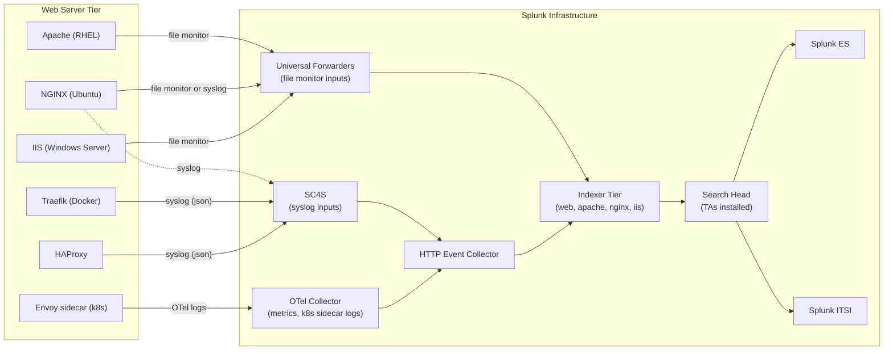

# Web Servers & Reverse Proxies Integration Guide

> The definitive guide to monitoring Apache HTTP Server, NGINX (OSS +
> Plus), Microsoft IIS, and modern reverse proxies (Traefik, HAProxy,
> Caddy, Envoy) with Splunk. 70 use cases covering HTTP error rates,
> response time SLAs, SSL/TLS certificate health, virtual host
> isolation, security signatures (WAF-style), and full observability of
> the application delivery layer.

---

## Table of Contents

- [Quick Start](#quick-start)
- [Overview](#overview)
- [Architecture and Data Flow](#architecture)
- [Prerequisites](#prerequisites)
- [Server Coverage Matrix](#server-matrix)
- [Apache HTTP Server](#apache)
- [NGINX (OSS and Plus)](#nginx)
- [Microsoft IIS](#iis)
- [Traefik](#traefik)
- [Caddy](#caddy)
- [Envoy (sidecar / standalone)](#envoy)
- [HAProxy](#haproxy)
- [Field Dictionary (Cross-Server)](#field-dictionary)
- [Sample Events](#sample-events)
- [Splunk-Side Configuration](#splunk-config)
- [SSL/TLS Certificate Monitoring](#ssl-monitoring)
- [SC4S Pipeline](#sc4s)
- [Cross-Product Correlation](#cross-product)
- [CIM Mapping Reference](#cim-mapping)
- [Compliance Mapping](#compliance)
- [Capacity Planning and Sizing](#sizing)
- [Recommended Dashboard Layouts](#dashboards)
- [ITSI Service Modeling](#itsi)
- [SOAR Playbook Examples](#soar)
- [Multi-Site Strategy](#multi-site)
- [Security Hardening](#security-hardening)
- [Crawl / Walk / Run Roadmap](#roadmap)
- [Validation Checklist](#validation-checklist)
- [Known Limitations and Gaps](#known-limitations)
- [Troubleshooting](#troubleshooting)
- [FAQ](#faq)
- [Glossary](#glossary)
- [References](#references)
- [Contribution and Feedback](#contribution)

---

<a id="quick-start"></a>
## Quick Start — 30 Minutes to First Telemetry

> All web servers share the same end-state: access + error logs flow
> via UF (file monitor) or syslog into the `web` index, normalized to
> the CIM `Web` data model.

### Apache (fastest path)

1. Install [Splunk Add-on for Apache](https://splunkbase.splunk.com/app/3186) on indexers + SH.
2. Deploy Splunk Universal Forwarder on each Apache host.
3. Configure inputs.conf:

    ```ini
    [monitor:///var/log/httpd/access_log]
    sourcetype = access_combined
    index = web

    [monitor:///var/log/httpd/error_log]
    sourcetype = apache_error
    index = web
    ```

4. Validate: `index=web sourcetype=access_combined earliest=-15m | stats count by host`

### NGINX

```ini
[monitor:///var/log/nginx/access.log]
sourcetype = nginx:plus:access
index = web

[monitor:///var/log/nginx/error.log]
sourcetype = nginx:plus:error
index = web
```

### IIS

```ini
[monitor://C:\inetpub\logs\LogFiles\W3SVC1\u_ex*.log]
sourcetype = ms:iis
index = web
disabled = false
crcSalt = <SOURCE>
```

### Activate crawl tier

UC-8.1.1 (HTTP error rate), UC-8.1.5 (SSL cert expiry).

---

<a id="overview"></a>
## Overview

### What this guide covers

| Web server / proxy | Use case fit |
|------------------|------------|
| **Apache HTTP Server (httpd)** | Most-deployed web server in enterprise, common in legacy stacks |
| **NGINX (OSS)** | Modern web server / reverse proxy, dominant in cloud-native |
| **NGINX Plus** | Commercial NGINX with extended JSON logging + API |
| **Microsoft IIS** | Windows-native; SharePoint, .NET, Exchange OWA backend |
| **Traefik** | Modern container-aware reverse proxy (Docker, K8s) |
| **HAProxy** | High-performance L4/L7 LB and reverse proxy |
| **Caddy** | Auto-HTTPS-by-default web server |
| **Envoy** | L7 proxy used standalone or as service-mesh sidecar (Istio) |

### Domains covered

| Domain | Examples |
|--------|---------|
| **Performance** | HTTP error rate, response time, latency percentiles |
| **Security** | Suspicious URI patterns, attack signatures, geo-anomaly |
| **SSL/TLS** | Certificate expiry, weak cipher usage, TLS version trends |
| **Capacity** | Request rate, bandwidth, virtual host distribution |
| **Configuration** | Vhost changes, mod_security rule hits |
| **Backend health** | Upstream health (NGINX/HAProxy/Envoy) |

### What's NOT in scope

| Domain | Where to look |
|--------|---------------|
| **Application code-level APM** | Splunk APM / Observability Cloud |
| **Hardware / OS** | [Linux Servers Guide](linux-servers.md), [Windows Servers Guide](windows-servers.md) |
| **L4/L7 LB devices (F5, NetScaler)** | [F5 BIG-IP Guide](f5-bigip.md) |
| **Cloud LBs (ALB, App Gateway, GCP LB)** | Cloud-specific guides |
| **Service mesh control plane** | [Kubernetes Guide](kubernetes.md) |
| **WAF (separate appliance)** | [Firewalls Guide](firewalls.md) |

### What good looks like

| Dimension | Without integration | With full deployment |
|-----------|---------------------|----------------------|
| Detect 5xx spike | Reactive ticket | Real-time alert |
| Identify slow page | Manual Apache `mod_status` | Per-URL P95/P99 |
| Cert expiry | Surprise outage | 30/14/7-day countdown |
| Web attack | Nothing | Suspicious-pattern alerts |
| Capacity planning | Provisioning guesswork | Trended request/sec graphs |

---

<a id="architecture"></a>
## Architecture and Data Flow



**Two main ingest patterns:**

1. **File monitor via UF** — for traditional servers (Apache, NGINX OSS, IIS)
2. **Syslog via SC4S** — for modern/container reverse proxies (Traefik, HAProxy, Envoy) where the container's stdout/stderr is the log path

NGINX Plus + Envoy can ALSO push metrics via the Splunk OTel Collector for high-cardinality observability data.

---

<a id="prerequisites"></a>
## Prerequisites

### Splunk requirements

| Item | Detail |
|------|--------|
| **Splunk version** | Splunk Enterprise 9.0+ or Splunk Cloud |
| **Splunkbase add-ons** | Per server type (see [Server Coverage Matrix](#server-matrix)) |
| **Universal Forwarder** | Standard for file monitor |
| **CIM Add-on** | For Web data model |

### OS requirements

| OS | Notes |
|----|-------|
| Linux | Apache, NGINX, Traefik, HAProxy, Caddy — file monitor via UF |
| Windows | IIS — Splunk_TA_windows includes IIS file monitor configs |
| Docker / Kubernetes | Containers log to stdout/stderr; collect via container engine + UF or OTel collector |

---

<a id="server-matrix"></a>
## Server Coverage Matrix

| Server | TA | Splunkbase | Sourcetypes | Cloud-vetted |
|--------|----|-----------|-------------|--------------|
| **Apache HTTP Server** | Splunk_TA_apache | [3186](https://splunkbase.splunk.com/app/3186) | `access_combined`, `apache_error` | Yes |
| **NGINX (OSS + Plus)** | TA-nginx | [3258](https://splunkbase.splunk.com/app/3258) | `nginx:plus:access`, `nginx:plus:error`, `nginx:plus:upstream` | Yes |
| **Microsoft IIS** | Splunk_TA_windows | [742](https://splunkbase.splunk.com/app/742) | `ms:iis` | Yes |
| **Traefik** | (no dedicated TA) | n/a | `traefik:syslog`, `traefik:access` | n/a |
| **HAProxy** | (custom or SC4S) | n/a | `haproxy:json`, `haproxy:syslog` | n/a |
| **Caddy** | (custom) | n/a | `caddy:access` | n/a |
| **Envoy** | (OTel collector) | n/a | `envoy:access` | n/a |

---

<a id="apache"></a>
## Apache HTTP Server

### Required Splunk components

| Component | Purpose |
|-----------|--------|
| Splunk_TA_apache | Field extractions, CIM mapping for `access_combined` and `apache_error` |
| Splunk Universal Forwarder | File monitor input on host |

### Apache log paths

| OS | Default access log | Default error log |
|----|-------------------|--------------------|
| RHEL/CentOS | `/var/log/httpd/access_log` | `/var/log/httpd/error_log` |
| Ubuntu/Debian | `/var/log/apache2/access.log` | `/var/log/apache2/error.log` |
| Per-vhost | `/etc/httpd/conf.d/*.conf` (custom paths) | (custom paths) |

### inputs.conf

```ini
[monitor:///var/log/httpd/access_log]
sourcetype = access_combined
index = web
disabled = false

[monitor:///var/log/httpd/error_log]
sourcetype = apache_error
index = web

[monitor:///var/log/httpd/*-access_log]
sourcetype = access_combined
index = web

[monitor:///var/log/httpd/*-error_log]
sourcetype = apache_error
index = web
```

### Recommended Apache log format (combined)

```apache
LogFormat "%h %l %u %t \"%r\" %>s %b \"%{Referer}i\" \"%{User-Agent}i\" %D %v" combined_extended
CustomLog /var/log/httpd/access_log combined_extended
```

The trailing `%D` (response time microseconds) and `%v` (vhost) extensions enable per-URL latency tracking and vhost isolation.

### Apache module recommendations

- **mod_status** — exposes `/server-status` for instantaneous stats (scrape via Splunk OTel Collector for metrics)
- **mod_security** — WAF; logs to error_log with `[security]` tag (UC-8.1.x security UCs)

### Sample event

```
203.0.113.5 - john.doe [25/Apr/2026:14:30:00 +0000] "GET /api/v1/users HTTP/1.1" 200 1234 "https://app.example.com/dashboard" "Mozilla/5.0 (Macintosh; Intel Mac OS X 10_15_7) AppleWebKit/537.36" 187432 app.example.com
```

Parsed fields: `clientip`=203.0.113.5, `user`=john.doe, `status`=200, `bytes`=1234, `response_time_us`=187432, `vhost`=app.example.com.

---

<a id="nginx"></a>
## NGINX (OSS and Plus)

### Required Splunk components

| Component | Purpose |
|-----------|--------|
| TA-nginx | Field extractions for access + error + upstream logs |
| Splunk Universal Forwarder | File monitor |

### NGINX log paths

| Default | Path |
|---------|------|
| Access | `/var/log/nginx/access.log` |
| Error | `/var/log/nginx/error.log` |

### Recommended NGINX log format (JSON-extended)

```nginx
log_format upstream_extended escape=json
    '{"time_local":"$time_iso8601","client_ip":"$remote_addr","status":$status,'
    '"upstream":"$upstream_addr","upstream_status":"$upstream_status",'
    '"upstream_response_time":"$upstream_response_time","request_time":$request_time,'
    '"bytes_sent":$bytes_sent,"http_method":"$request_method",'
    '"http_uri":"$request_uri","http_referer":"$http_referer",'
    '"http_user_agent":"$http_user_agent","http_host":"$host",'
    '"vhost":"$server_name","request_id":"$request_id"}';

access_log /var/log/nginx/access.log upstream_extended;
```

### inputs.conf

```ini
[monitor:///var/log/nginx/access.log]
sourcetype = nginx:plus:access
index = web
INDEXED_EXTRACTIONS = json

[monitor:///var/log/nginx/error.log]
sourcetype = nginx:plus:error
index = web
```

### NGINX Plus extras

NGINX Plus exposes a JSON status API at `/api/<version>/`. Scrape with Splunk OTel Collector or scripted input:

```bash
# scripted input every 60s
curl -s http://nginx-host/api/9/ \
    | jq '. + {"@timestamp": now}' \
    > /tmp/nginx-status-$(date +%s).json
```

### Sample event (JSON format)

```json
{
    "time_local": "2026-04-25T14:30:00+00:00",
    "client_ip": "203.0.113.5",
    "status": 200,
    "upstream": "10.0.0.5:8080",
    "upstream_status": "200",
    "upstream_response_time": "0.187",
    "request_time": 0.189,
    "bytes_sent": 1234,
    "http_method": "GET",
    "http_uri": "/api/v1/users",
    "http_referer": "https://app.example.com/dashboard",
    "http_user_agent": "Mozilla/5.0",
    "http_host": "app.example.com",
    "vhost": "app.example.com",
    "request_id": "abc-123-def"
}
```

---

<a id="iis"></a>
## Microsoft IIS

### Required Splunk components

| Component | Purpose |
|-----------|--------|
| Splunk Add-on for Microsoft Windows (Splunk_TA_windows) | Includes IIS log parsing |
| Splunk Universal Forwarder | File monitor input on Windows host |

### IIS log paths

| IIS version | Default path |
|-----------|--------------|
| IIS 7.0+ | `C:\inetpub\logs\LogFiles\W3SVC<sitenum>\u_ex<YYMMDD>.log` |
| Per-site | Configurable per IIS Manager |

### inputs.conf (Windows UF)

```ini
[monitor://C:\inetpub\logs\LogFiles\W3SVC1\u_ex*.log]
sourcetype = ms:iis
index = web
disabled = false
crcSalt = <SOURCE>

[monitor://C:\inetpub\logs\LogFiles\W3SVC2\u_ex*.log]
sourcetype = ms:iis
index = web
disabled = false
crcSalt = <SOURCE>
```

### IIS Site Logging — recommended fields (W3C extended)

In IIS Manager > Logging:
- Format: W3C
- Fields: Date, Time, Client IP Address, User Name, Service Name, Server Name, Server IP, Server Port, Method, URI Stem, URI Query, Protocol Status, Substatus, Win32 Status, Bytes Sent, Bytes Received, **Time Taken**, Protocol Version, Host, User Agent, Cookie, Referer

### Sample event

```
#Software: Microsoft Internet Information Services 10.0
#Version: 1.0
#Date: 2026-04-25 14:30:00
#Fields: date time s-ip cs-method cs-uri-stem cs-uri-query s-port cs-username c-ip cs(User-Agent) cs(Referer) sc-status sc-substatus sc-win32-status sc-bytes cs-bytes time-taken
2026-04-25 14:30:00 10.0.0.50 GET /api/v1/users - 443 john.doe 203.0.113.5 Mozilla/5.0 https://app.example.com/dashboard 200 0 0 1234 567 187
```

Parsed: `c-ip`=203.0.113.5, `cs-method`=GET, `cs-uri-stem`=/api/v1/users, `sc-status`=200, `time-taken`=187 ms.

---

<a id="traefik"></a>
## Traefik

Traefik is a modern container-aware reverse proxy. It outputs JSON logs by default.

### Configure JSON logging

```yaml
# traefik.yml or docker labels
log:
    level: INFO
    format: json
    filePath: /var/log/traefik/traefik.log

accessLog:
    format: json
    filePath: /var/log/traefik/access.log
```

### inputs.conf (file monitor)

```ini
[monitor:///var/log/traefik/access.log]
sourcetype = traefik:access
index = web
INDEXED_EXTRACTIONS = json
```

### Or via syslog (when in Docker)

```yaml
# docker-compose.yml
services:
    traefik:
        image: traefik:latest
        logging:
            driver: syslog
            options:
                syslog-address: "udp://sc4s-vip:514"
                tag: "traefik"
```

SC4S vendor pack auto-classifies as `traefik:syslog`.

### Sample event

```json
{
    "ClientHost": "203.0.113.5",
    "ClientPort": "49234",
    "RequestMethod": "GET",
    "RequestPath": "/api/v1/users",
    "RequestProtocol": "HTTP/1.1",
    "RequestHost": "app.example.com",
    "DownstreamStatus": 200,
    "DownstreamContentSize": 1234,
    "Duration": 187432000,
    "OriginStatus": 200,
    "OriginContentSize": 1234,
    "RouterName": "app-router@docker",
    "ServiceName": "app-svc@docker",
    "level": "info"
}
```

---

<a id="caddy"></a>
## Caddy

```caddy
# Caddyfile
{
    log {
        output file /var/log/caddy/access.log
        format json
    }
}

example.com {
    reverse_proxy localhost:8080
}
```

```ini
[monitor:///var/log/caddy/access.log]
sourcetype = caddy:access
index = web
INDEXED_EXTRACTIONS = json
```

---

<a id="envoy"></a>
## Envoy (sidecar / standalone)

In service mesh deployments (Istio, Linkerd), Envoy is a sidecar in each pod. Best collected via OTel collector (see [Kubernetes Guide](kubernetes.md)).

For standalone Envoy:

```yaml
# envoy.yaml
access_log:
- name: envoy.access_loggers.file
    typed_config:
        "@type": type.googleapis.com/envoy.extensions.access_loggers.file.v3.FileAccessLog
        path: /var/log/envoy/access.log
        log_format:
            json_format:
                start_time: "%START_TIME%"
                method: "%REQ(:METHOD)%"
                path: "%REQ(X-ENVOY-ORIGINAL-PATH?:PATH)%"
                response_code: "%RESPONSE_CODE%"
                bytes_sent: "%BYTES_SENT%"
                duration: "%DURATION%"
                upstream_host: "%UPSTREAM_HOST%"
                user_agent: "%REQ(USER-AGENT)%"
```

---

<a id="haproxy"></a>
## HAProxy

```cfg
# /etc/haproxy/haproxy.cfg
global
    log <sc4s-vip>:514 local6 info
    log-format "haproxy {\"client_ip\":\"%ci\",\"backend\":\"%b\",\"server\":\"%s\",\"http_status\":%ST,\"bytes_in\":%U,\"bytes_out\":%B,\"duration_ms\":%Tt,\"http_method\":\"%HM\",\"http_uri\":\"%HU\",\"haproxy_status\":\"%ts\"}"

defaults
    log global
    option httplog
    option dontlognull
```

Cross-reference: [F5 BIG-IP Guide](f5-bigip.md) covers HAProxy as a load-balancer alternative.

---

<a id="field-dictionary"></a>
## Field Dictionary (Cross-Server)

After CIM `Web` mapping, all servers expose the same canonical fields:

| Field | Example | Description |
|-------|---------|-------------|
| `src` | `203.0.113.5` | Client IP |
| `dest` | `10.0.0.50` | Server IP |
| `dest_port` | `443` | Server port |
| `url` | `/api/v1/users?id=42` | Full URL path + query |
| `url_path` | `/api/v1/users` | Path only |
| `http_method` | `GET` / `POST` | HTTP verb |
| `http_user_agent` | `Mozilla/5.0...` | UA string |
| `http_referer` | `https://app.example.com/dashboard` | Referer |
| `status` | `200` / `404` / `500` | HTTP status code |
| `bytes_in` | `567` | Request body bytes |
| `bytes_out` | `1234` | Response body bytes |
| `response_time` | `0.187` | Total time (seconds) |
| `vhost` | `app.example.com` | Virtual host (Apache `%v`, NGINX `$server_name`, IIS `s-computername`) |
| `user` | `john.doe` | Authenticated user (when present) |
| `dvc` | `web-prod-01` | Server hostname |
| `vendor_product` | `Apache`, `NGINX`, `IIS`, `Traefik` | CIM normalised |

---

<a id="sample-events"></a>
## Sample Events

(See per-server sections above.)

---

<a id="splunk-config"></a>
## Splunk-Side Configuration

### Index strategy

```ini
# Single shared index (small estate)
[web]
homePath = $SPLUNK_DB/web/db
maxDataSize = auto_high_volume
frozenTimePeriodInSecs = 7776000   # 90 days

# Per-server-type indexes (large estate)
[apache]
homePath = $SPLUNK_DB/apache/db
maxDataSize = auto_high_volume

[nginx]
homePath = $SPLUNK_DB/nginx/db
maxDataSize = auto_high_volume

[iis]
homePath = $SPLUNK_DB/iis/db
maxDataSize = auto_high_volume
```

### Datamodel acceleration (Web)

```ini
# datamodel.conf
[Web]
acceleration = true
acceleration.earliest_time = -7d
acceleration.cron_schedule = */5 * * * *
```

Validate:

```spl
| tstats summariesonly=true count from datamodel=Web.Web
  by sourcetype, vendor_product
| sort -count
```

---

<a id="ssl-monitoring"></a>
## SSL/TLS Certificate Monitoring (UC-8.1.5)

The most critical Web UC: detect cert expiry BEFORE outage.

### Method 1 — Scripted input (openssl s_client)

```bash
#!/bin/bash
# /opt/splunk/etc/apps/cert_check/bin/cert_check.sh
ENDPOINTS_FILE=/opt/splunk/etc/apps/cert_check/local/endpoints.conf
while read endpoint; do
    expiry=$(echo | openssl s_client -servername "$endpoint" \
                 -connect "$endpoint:443" 2>/dev/null \
              | openssl x509 -noout -enddate \
              | cut -d= -f2)
    expiry_epoch=$(date -d "$expiry" +%s 2>/dev/null)
    cn=$(echo | openssl s_client -servername "$endpoint" \
              -connect "$endpoint:443" 2>/dev/null \
          | openssl x509 -noout -subject \
          | sed 's/.*CN = //' | cut -d, -f1)
    issuer=$(echo | openssl s_client -servername "$endpoint" \
                 -connect "$endpoint:443" 2>/dev/null \
              | openssl x509 -noout -issuer \
              | sed 's/.*CN = //' | cut -d, -f1)
    echo "endpoint=$endpoint cn=\"$cn\" issuer=\"$issuer\" cert_expiry_epoch=$expiry_epoch"
done < "$ENDPOINTS_FILE"
```

### inputs.conf

```ini
[script:///opt/splunk/etc/apps/cert_check/bin/cert_check.sh]
interval = 86400  # daily
sourcetype = cert_check
index = certificates
```

### Saved-search alert

```spl
index=certificates sourcetype=cert_check earliest=-2d
| stats latest(cert_expiry_epoch) as cert_expiry by endpoint, cn
| eval days_until_expiry = round((cert_expiry - now())/86400)
| where days_until_expiry < 30
| eval severity = case(days_until_expiry < 7, "critical", days_until_expiry < 14, "high", days_until_expiry < 30, "medium", true(), "low")
| table endpoint, cn, days_until_expiry, severity
| sort days_until_expiry
```

### Method 2 — Certificate Transparency logs

For internet-facing endpoints, monitor CT logs (e.g., crt.sh API) for unauthorised certificate issuance.

---

<a id="sc4s"></a>
## SC4S Pipeline

For container-based reverse proxies (Traefik, HAProxy, Envoy), SC4S vendor packs auto-route. Configure containers to log via syslog driver pointing at SC4S VIP.

For non-container web servers, file monitor via UF is simpler than syslog.

---

<a id="cross-product"></a>
## Cross-Product Correlation

### Web + LB (front-to-back latency)

```spl
(index=web sourcetype=access_combined) 
OR (index=f5_bigip sourcetype="f5:bigip:irule" app=*)
| transaction client_ip uri maxspan=2s
| stats avg(response_time) as web_resp, avg(duration_ms) as f5_dur by uri
| eval network_overhead = (f5_dur - web_resp*1000)
| sort -network_overhead
```

### Web + Firewall (correlate WAF blocks with web errors)

```spl
(index=web sourcetype=access_combined status>=400)
OR (index=firewall sourcetype="pan:threat")
| transaction client_ip src maxspan=10s
```

### Web + AD (authenticated user analysis)

```spl
(index=web sourcetype=access_combined user=*)
| join type=left user
    [ search index=ad sourcetype=admon AND object_class=user
      | rename sAMAccountName as user, displayName as display_name ]
| stats count by user, display_name, status
| sort -count
```

### Web + APM (deep transaction correlation)

```spl
(index=web sourcetype=nginx:plus:access)
OR (index=apm sourcetype="otel:traces")
| transaction request_id, traceId
```

---

<a id="cim-mapping"></a>
## CIM Mapping Reference

| CIM model | Sourcetype | Auto-mapped? |
|-----------|-----------|--------------|
| **Web** | `access_combined`, `nginx:plus:access`, `ms:iis`, `traefik:access`, `caddy:access`, `envoy:access` | Yes (via TA + custom) |
| **Authentication** | When `user` field present | Partial |
| **Network_Traffic** | (rarely needed at web tier) | No |

Validate Web data model:

```spl
| datamodel Web Web search 
| stats count by sourcetype
```

---

<a id="compliance"></a>
## Compliance Mapping

### PCI-DSS 4.0

| Requirement | UC examples |
|-------------|------------|
| **6.4.2** WAF for public-facing apps | URI pattern UCs |
| **8.2** Strong authentication | User-attributed access |
| **10.2** Audit logging | Access logs (foundational) |
| **10.7** Audit retention (≥1 year) | Index policy |

### OWASP Top 10 (2023)

| OWASP | UC examples |
|-------|------------|
| A01 Broken Access Control | 401/403 spike UCs |
| A02 Cryptographic Failures | TLS version + cert expiry |
| A03 Injection | URI pattern detection |
| A05 Security Misconfiguration | Default page exposure |
| A07 Authentication Failures | Login failure rate |
| A09 Logging Failures | UF availability monitoring |

### HIPAA Security Rule

| §164.312 | Coverage |
|---------|----------|
| (a)(2)(i) Unique user ID | Auth log UCs |
| (b) Audit Controls | Access logs |
| (e)(1) Transmission Security | TLS UCs |

### NIST 800-53

| Control | UC examples |
|---------|------------|
| **AU-2/12** Audit | Foundational |
| **SC-13** Crypto Protection | TLS UCs |
| **SI-4** System Monitoring | Error rate UCs |

### GDPR

| Article | Coverage |
|---------|----------|
| Art 32 Security of processing | All security UCs |
| Art 33 Breach notification | 4xx/5xx spikes |

---

<a id="sizing"></a>
## Capacity Planning and Sizing

### Per-server daily ingest (typical)

| Tier | Requests/sec | Avg event bytes | Daily ingest |
|------|--------------|----------------|-------------|
| Low (intranet) | 10 | 500 | ~430 MB |
| Medium (corp app) | 100 | 600 | ~5 GB |
| High (public web) | 1000 | 700 | ~60 GB |
| Very high (CDN backend) | 10000+ | 800 | ~700 GB |

### Worked examples

| Estate | Servers | Daily ingest |
|--------|---------|-------------|
| Small (5 web servers) | 5 medium | ~25 GB/day |
| Mid (50 servers) | 50 medium | ~250 GB/day |
| Large e-commerce (500) | 500 mixed | ~3 TB/day |
| CDN edge (5K nodes) | 5000 high | ~30 TB/day |

### Retention recommendations

| Data | Retention | Rationale |
|------|-----------|-----------|
| Access logs | 90 days hot+warm; 1 year cold | DFIR + PCI |
| Error logs | 90 days hot; 1 year cold | Operational |
| SSL cert telemetry | 2 years | Audit trail |

---

<a id="dashboards"></a>
## Recommended Dashboard Layouts

### Crawl — "Web At a Glance"

```
+---------------------+---------------------+
| HTTP STATUS DISTRIBUTION (per vhost)      |
+---------------------+---------------------+
| ERROR RATE (5xx/4xx) TREND                |
+---------------------+---------------------+
| CERT EXPIRY COUNTDOWN                     |
+---------------------+---------------------+
| TOP-N URLS BY VOLUME                      |
+---------------------+---------------------+
```

### Walk — "Performance"

```
+---------------------+---------------------+
| RESPONSE TIME P50/P95/P99 PER URL         |
+---------------------+---------------------+
| TOP SLOW PAGES                            |
+---------------------+---------------------+
| BANDWIDTH (in/out) PER VHOST              |
+---------------------+---------------------+
| CONCURRENT REQUEST GAUGE                  |
+---------------------+---------------------+
```

### Run — "Security & Audit"

```
+---------------------+---------------------+
| SUSPICIOUS URI PATTERNS (SQL inj, XSS)    |
+---------------------+---------------------+
| TLS VERSION + CIPHER USAGE                |
+---------------------+---------------------+
| GEO-MAP SOURCE TRAFFIC                    |
+---------------------+---------------------+
| BOT vs HUMAN TRAFFIC                      |
+---------------------+---------------------+
```

---

<a id="itsi"></a>
## ITSI Service Modeling

### Service hierarchy

```
Web Tier
├── Public Web
│   ├── www.example.com (entity)
│   └── api.example.com (entity)
├── Internal Web
│   ├── intranet.example.com
│   └── confluence.example.com
└── Reverse Proxy / LB
    ├── traefik-edge-01
    └── nginx-lb-01
```

### Recommended KPIs

| KPI | Source | Threshold |
|-----|--------|-----------|
| HTTP error rate | Web access logs | Static (warn 5%, page 10%) |
| Response time P95 | Web access logs | Adaptive |
| Response time P99 | Web access logs | Adaptive |
| Requests/sec | Web access logs | Adaptive |
| Cert expiry days | cert_check input | Static (page < 14) |
| 5xx rate | Web access logs | Static (page > 1%) |
| Bandwidth | Web access logs | Adaptive |

---

<a id="soar"></a>
## SOAR Playbook Examples

### Playbook 1: HTTP Error Spike (UC-8.1.1)

**Trigger:** Error rate > 10% in 5 min.

```
1. RECEIVE alert (vhost, error_rate, top URLs)
2. PULL last 1h of error logs (apache_error / nginx error)
3. CHECK if backend is down (cross-product LB / app server)
4. CHECK if recent deployment correlates (CI/CD logs)
5. CHECK if WAF / firewall blocking traffic upstream
6. DECISION:
   - Backend down → page hosting team
   - Recent deploy → page release manager
   - WAF block → page security team
7. CREATE Sev-2 incident
```

### Playbook 2: SSL Cert Expiring (UC-8.1.5)

**Trigger:** Cert expires in < 14 days.

```
1. RECEIVE alert (endpoint, cn, days_until_expiry)
2. CHECK if cert is in Let's Encrypt auto-renewal
3. CHECK if cert is in PKI managed renewal (Vault, etc.)
4. CREATE renewal ticket assigned to PKI owner
5. NOTIFY service owner
6. AUTO-RENEW if Let's Encrypt + no manual intervention needed
```

### Playbook 3: Suspicious URI Pattern (security)

**Trigger:** SQL injection / XSS / path traversal pattern detected.

```
1. RECEIVE event (src, url, pattern_matched)
2. CORRELATE with WAF / firewall logs
3. CHECK threat intel for source IP
4. CHECK if response was 200 (potentially exploited)
5. DECISION:
   - 4xx response → log + monitor
   - 200 response with pattern → P1 incident
6. AUTO-BLOCK src IP at WAF if confirmed malicious
7. CREATE security ticket
```

---

<a id="multi-site"></a>
## Multi-Site Strategy

For globally-distributed web infrastructure:

- **Per-region UF** writing to local indexer cluster
- **Per-region indexes** (`web_emea`, `web_amer`, `web_apac`)
- **Cross-region search** for global views
- **CDN edge logs** ingested separately (high volume — likely sampled)

---

<a id="security-hardening"></a>
## Security Hardening

### Don't log credentials

- Apache: `LogFormat` should NOT include POST body, Authorization header
- NGINX: same — don't include `$request_body`
- IIS: don't enable POST body logging unless explicitly needed

### Field-level RBAC

- `user` field in web logs may be PII — restrict via Splunk role
- Cookies in `access_combined_wcookie` may contain session IDs — restrict

### Anonymisation patterns

```ini
# props.conf — anonymise client IPs in archived logs
[access_combined]
SEDCMD-anonymize_ip = s/(\d+\.\d+\.\d+)\.\d+/\1.0/g
```

(Apply in cold/archive only, not for live troubleshooting.)

---

<a id="roadmap"></a>
## Crawl / Walk / Run Roadmap

### Crawl (Week 1–2)

1. Install relevant TA(s) (Splunk_TA_apache, TA-nginx, Splunk_TA_windows)
2. UF deployment on web hosts
3. Configure recommended log formats
4. UC-8.1.1 (error rate) + UC-8.1.5 (cert expiry)
5. Crawl dashboard

### Walk (Week 3–6)

1. JSON log format for NGINX / Traefik / Caddy
2. CIM Web model + acceleration
3. Walk-tier UCs (response time, top pages, geo, bot detection)
4. Cert monitoring scripted input

### Run (Month 2+)

1. ITSI services per vhost
2. SOAR playbooks
3. Cross-product correlation (LB, firewall, AD)
4. Security UCs (URI patterns, anomalies)
5. Quarterly performance review

---

<a id="validation-checklist"></a>
## Validation Checklist

### Day 1

- [ ] At least one TA installed
- [ ] First web server logging
- [ ] CIM Web populating
- [ ] UC-8.1.1 alert wired

### Day 7

- [ ] All web servers onboarded
- [ ] Recommended log formats deployed
- [ ] Crawl dashboard live
- [ ] Cert expiry monitoring active

### Day 30

- [ ] Walk-tier UCs deployed
- [ ] CIM acceleration enabled
- [ ] First SOAR playbook in production

### Day 90

- [ ] ITSI services per vhost
- [ ] Run-tier UCs + dashboards
- [ ] Quarterly review

---

<a id="known-limitations"></a>
## Known Limitations and Gaps

| Limitation | Impact | Workaround |
|------------|--------|------------|
| **Combined log format lacks response time** | No latency UCs | Switch to extended format with `%D` |
| **JSON log format requires NGINX OSS recompile (older)** | Can't use cleanly | Upgrade to NGINX 1.11.8+ |
| **IIS log fields aren't enabled by default** | Some UCs miss data | Enable via IIS Manager logging settings |
| **Container stdout logs lose context if not labeled** | Can't isolate vhost | Add request_id middleware |
| **Apache mod_security logs are noisy** | Index pressure | Tune signature severity |
| **No native CIM model for HAProxy/Traefik** | Custom search needed | Field-aliased to Web model |
| **`access_combined_wcookie` may contain session IDs** | PII / security | Field-level RBAC + anonymisation |

---

<a id="troubleshooting"></a>
## Troubleshooting

### Apache logs not parsing into fields

- Verify TA is installed on indexer + SH
- Check `props.conf` sourcetype matches log format (e.g., `combined` vs `combined_extended`)
- Test with `splunk btool props list access_combined --debug`

### NGINX JSON logs not being parsed as JSON

- `INDEXED_EXTRACTIONS = json` must be set on the inputs.conf stanza
- Check raw event for valid JSON syntax

### IIS file monitor not picking up new logs

- IIS rotates daily — ensure `crcSalt = <SOURCE>` is set
- Check UF has read permission on `C:\inetpub\logs\LogFiles\`

### High volume from one server

- Check for `LogLevel debug` in Apache (revert to `LogLevel warn`)
- Or `error_log` in NGINX set to `info` instead of `warn`

### Time skew

- Ensure NTP synced on web hosts
- Verify `TIME_FORMAT` in props matches log format

---

<a id="faq"></a>
## FAQ

**Q: File monitor or syslog?**
A: File monitor for traditional servers (simpler, more reliable). Syslog for containers / proxies that ship to stdout.

**Q: Single `web` index or per-server-type indexes?**
A: Single for small estates; per-type for >10 servers (better RBAC + capacity isolation).

**Q: How do I correlate web logs with backend application logs?**
A: Use a `request_id` field in NGINX (`$request_id`) propagated as a header to backend, logged by app. Then `transaction request_id` to join.

**Q: Should I use Splunk Observability Cloud for HTTP metrics?**
A: For high-cardinality metrics (per-URL P99 across 10K URLs) — yes. For log-based search and DFIR — Splunk Cloud.

**Q: How do I monitor static files vs dynamic content?**
A: Filter by `url_path` extension (`.css`, `.js`, `.png` = static). Or by `vhost` if you separate them.

**Q: User-Agent reveals what about clients?**
A: OS, browser version, possibly device. Useful for analytics + bot detection but PII-adjacent — handle accordingly.

**Q: WAF logs vs error logs?**
A: WAF (mod_security in Apache, NAXSI in NGINX) logs to error_log with specific tags. Build separate UCs for WAF events vs general errors.

**Q: I'm in Kubernetes — should I use this guide or the K8s guide?**
A: For container stdout/stderr collection, the K8s guide. For application-specific reverse-proxy logic (Traefik dashboard, NGINX upstream), this guide complements.

---

<a id="glossary"></a>
## Glossary

| Term | Definition |
|------|-----------|
| **vhost** | Virtual host (Apache `ServerName`, NGINX `server_name`, IIS site) |
| **upstream** | Backend server behind a reverse proxy |
| **mod_security** | Apache WAF module |
| **NAXSI** | NGINX WAF module |
| **HSTS** | HTTP Strict Transport Security header |
| **CSP** | Content Security Policy header |
| **TTFB** | Time To First Byte (server processing time) |
| **P95 / P99** | 95th / 99th percentile (latency tail) |
| **Combined log format** | Apache standard format with referer + user-agent |
| **W3C extended** | IIS standard log format |

---

<a id="references"></a>
## References

- [Splunk Add-on for Apache (Splunkbase 3186)](https://splunkbase.splunk.com/app/3186)
- [Splunk Add-on for NGINX (Splunkbase 3258)](https://splunkbase.splunk.com/app/3258)
- [Splunk Add-on for Microsoft Windows (Splunkbase 742)](https://splunkbase.splunk.com/app/742)
- [Apache LogFormat documentation](https://httpd.apache.org/docs/2.4/mod/mod_log_config.html)
- [NGINX log format reference](https://docs.nginx.com/nginx/admin-guide/monitoring/logging/)
- [IIS W3C Extended Log File Format](https://learn.microsoft.com/en-us/windows/win32/http/w3c-logging)
- [OWASP Top 10](https://owasp.org/Top10/)

---

<a id="contribution"></a>
## Contribution and Feedback

Part of the [Splunk Monitoring Use Cases](https://github.com/fenre/splunk-monitoring-use-cases) project. [Open an issue](https://github.com/fenre/splunk-monitoring-use-cases/issues/new).

---

*Last updated: 2026-05-09. Covers Splunk_TA_apache 1.x, TA-nginx 1.x, Splunk_TA_windows 9.x.*

---

<!-- BEGIN-AUTOGENERATED-SOURCES -->

## References

*Auto-generated by `scripts/generate_doc_references.py` from `data/source-references.json` and `data/source-mappings.json`. Edit those files (or the document body) to change citations; this footer is rewritten on every run.*

### Primary sources

<a id="ref-1"></a>**[1]** Splunk Inc. (2026). *Splunk Common Information Model Add-on Manual*. Splunk LLC, a Cisco company. Retrieved May 11, 2026, from https://docs.splunk.com/Documentation/CIM

### Supporting sources

<a id="ref-2"></a>**[2]** European Parliament and Council of the European Union. (2016, April). *Regulation (EU) 2016/679 — General Data Protection Regulation*. Official Journal of the European Union, L 119. ELI: reg/2016/679. https://eur-lex.europa.eu/eli/reg/2016/679/oj

<a id="ref-3"></a>**[3]** Gerhards, R. (2009, March). *The Syslog Protocol*. Internet Engineering Task Force. RFC 5424. https://www.rfc-editor.org/rfc/rfc5424

<a id="ref-4"></a>**[4]** International Organization for Standardization. (2022). *ISO/IEC 27001:2022 — Information security, cybersecurity and privacy protection — Information security management systems — Requirements*. ISO/IEC. ISO/IEC 27001:2022. https://www.iso.org/standard/27001

<a id="ref-5"></a>**[5]** National Institute of Standards and Technology. (2020). *Security and Privacy Controls for Information Systems and Organizations* (Revision 5). U.S. Department of Commerce. NIST SP 800-53 Rev. 5. https://csrc.nist.gov/pubs/sp/800/53/r5/upd1/final

<a id="ref-6"></a>**[6]** OpenTelemetry Authors. (2026). *OpenTelemetry Specification*. Cloud Native Computing Foundation. Retrieved May 11, 2026, from https://opentelemetry.io/docs/specs/otel/

<a id="ref-7"></a>**[7]** OWASP Foundation. (2024). *OWASP Application Security Verification Standard 5.0* (5.0). OWASP Foundation, Inc. https://owasp.org/www-project-application-security-verification-standard/

<a id="ref-8"></a>**[8]** OWASP Foundation. (2026). *OWASP Cheat Sheet Series*. OWASP Foundation, Inc. Retrieved May 11, 2026, from https://cheatsheetseries.owasp.org/

<a id="ref-9"></a>**[9]** OWASP Foundation. (2021). *OWASP Top 10:2021 — The Ten Most Critical Web Application Security Risks*. OWASP Foundation, Inc. Retrieved May 11, 2026, from https://owasp.org/Top10/

<a id="ref-10"></a>**[10]** Splunk Inc. (2026). *Splunk Enterprise Security Administration Manual*. Splunk LLC, a Cisco company. Retrieved May 11, 2026, from https://docs.splunk.com/Documentation/ES

<a id="ref-11"></a>**[11]** Splunk Inc. (2026). *Splunk Infrastructure Monitoring Documentation*. Splunk LLC, a Cisco company. Retrieved May 11, 2026, from https://docs.splunk.com/observability/en/infrastructure/intro-to-infrastructure.html

<a id="ref-12"></a>**[12]** U.S. Department of Health & Human Services. (2002). *HIPAA Privacy Rule (45 CFR Parts 160 and 164, Subparts A and E)*. Office for Civil Rights, HHS. 45 CFR 160, 164. https://www.hhs.gov/hipaa/for-professionals/privacy/index.html

<a id="ref-13"></a>**[13]** U.S. Department of Health & Human Services. (2013). *HIPAA Security Rule (45 CFR Parts 160 and 164, Subparts A and C)*. Office for Civil Rights, HHS. 45 CFR 160, 164. https://www.hhs.gov/hipaa/for-professionals/security/index.html

<details>
<summary>Additional online sources cited in the document body (8)</summary>

<a id="ref-14"></a>**[14]** splunkbase.splunk.com. *Splunk Add-on for Apache*. Retrieved May 11, 2026, from https://splunkbase.splunk.com/app/3186

<a id="ref-15"></a>**[15]** splunkbase.splunk.com. *Splunkbase app #3258*. Retrieved May 11, 2026, from https://splunkbase.splunk.com/app/3258

<a id="ref-16"></a>**[16]** splunkbase.splunk.com. *Splunkbase app #742*. Retrieved May 11, 2026, from https://splunkbase.splunk.com/app/742

<a id="ref-17"></a>**[17]** httpd.apache.org. *Apache LogFormat documentation*. Retrieved May 11, 2026, from https://httpd.apache.org/docs/2.4/mod/mod_log_config.html

<a id="ref-18"></a>**[18]** docs.nginx.com. *NGINX log format reference*. Retrieved May 11, 2026, from https://docs.nginx.com/nginx/admin-guide/monitoring/logging/

<a id="ref-19"></a>**[19]** learn.microsoft.com. *IIS W3C Extended Log File Format*. Retrieved May 11, 2026, from https://learn.microsoft.com/en-us/windows/win32/http/w3c-logging

<a id="ref-20"></a>**[20]** github.com. *Splunk Monitoring Use Cases*. Retrieved May 11, 2026, from https://github.com/fenre/splunk-monitoring-use-cases

<a id="ref-21"></a>**[21]** github.com. *Open an issue*. Retrieved May 11, 2026, from https://github.com/fenre/splunk-monitoring-use-cases/issues/new

</details>

### Related repository documents

- [`docs/guides/f5-bigip.md`](f5-bigip.md)
- [`docs/guides/firewalls.md`](firewalls.md)
- [`docs/guides/kubernetes.md`](kubernetes.md)
- [`docs/guides/linux-servers.md`](linux-servers.md)
- [`docs/guides/windows-servers.md`](windows-servers.md)

### Cited by

- [`docs/guides/api-gateways.md`](api-gateways.md)
- [`docs/guides/application-servers.md`](application-servers.md)
- [`docs/guides/cert-pki.md`](cert-pki.md)
- [`docs/guides/datagen-top10-use-cases.md`](datagen-top10-use-cases.md)
- [`docs/guides/f5-bigip.md`](f5-bigip.md)

<!-- END-AUTOGENERATED-SOURCES -->
