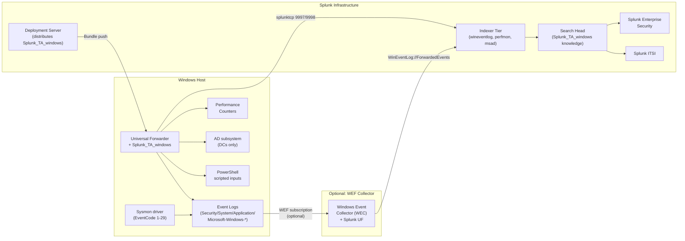

# Windows Servers Integration Guide

> The definitive guide to monitoring Windows Server<sup class="ref">[<a href="#ref-1">1</a>]</sup> fleets with Splunk —
> Active Directory authentication, Group Policy and AdminSDHolder integrity,
> Performance counters, Sysmon process telemetry, AppLocker, Windows Defender,
> WinRM, RDP, NTLM auditing, Service Control Manager events, and full audit
> trails for SOX<sup class="ref">[<a href="#ref-11">11</a>]</sup>, PCI, HIPAA<sup class="ref">[<a href="#ref-13">13</a>]</sup>, and CIS Microsoft Benchmarks. 130 use cases
> across crawl/walk/run maturity tiers covering Server 2016 → 2025.

---

## Table of Contents

- [Quick Start](#quick-start)
- [Overview and What Good Looks Like](#overview)
- [Architecture and Data Flow](#architecture)
- [Prerequisites](#prerequisites)
- [Data Sources Reference](#data-sources)
- [Field Dictionary](#field-dictionary)
- [Sample Events](#sample-events)
- [TA Configuration](#ta-configuration)
- [Windows Event Forwarding (WEF) Pattern](#wef)
- [Sysmon Deployment](#sysmon)
- [PowerShell Logging](#powershell-logging)
- [Custom Scripted Inputs (PowerShell)](#custom-scripted-inputs)
- [Cross-Product Correlation](#cross-product-correlation)
- [CIM Mapping Reference](#cim-mapping)
- [Compliance Mapping](#compliance-mapping)
- [Capacity Planning and Sizing](#sizing)
- [Version Compatibility Matrix](#compatibility)
- [Recommended Dashboard Layouts](#dashboards)
- [ITSI Service Modeling](#itsi)
- [SOAR Playbook Examples](#soar)
- [Security Hardening](#security-hardening)
- [Crawl / Walk / Run Roadmap](#roadmap)
- [Validation Checklist](#validation-checklist)
- [Known Limitations and Gaps](#known-limitations)
- [Troubleshooting](#troubleshooting)
- [FAQ](#faq)
- [Glossary](#glossary)
- [Migrating from Legacy Windows Add-Ons](#migration)
- [References](#references)
- [Contribution and Feedback](#contribution)

---

<a id="quick-start"></a>
## Quick Start — 15 Minutes to First Data

For engineers who want data flowing before reading the rest:

1. **Install the TA** — Download [Splunk Add-on for Microsoft Windows (Splunkbase 742)](https://splunkbase.splunk.com/app/742). Install on your search head, indexer, and ship via Forwarder Management to every Windows Universal Forwarder.

2. **Create indexes** — In Splunk: Settings → Indexes. Create:
   - `wineventlog` (events) — for `WinEventLog:*` sourcetypes
   - `perfmon` (events; consider metric store for high-volume) — for `Perfmon:*`
   - `msad` (events) — for AD-specific events if you separate
   - Retention per the highest framework you operate under (PCI: 1y; SOX/HIPAA: 6–7y).

3. **Enable foundational inputs** — Edit the deployment app `windows_uf/local/inputs.conf`:

   ```ini
   # --- Event log inputs ---
   [WinEventLog://Security]
   disabled = 0
   start_from = oldest
   current_only = 0
   evt_resolve_ad_obj = 1
   index = wineventlog

   [WinEventLog://System]
   disabled = 0
   index = wineventlog

   [WinEventLog://Application]
   disabled = 0
   index = wineventlog

   # --- Perfmon foundation ---
   [perfmon://CPU]
   counters = % Processor Time
   instances = _Total
   interval = 60
   object = Processor
   index = perfmon

   [perfmon://Memory]
   counters = % Committed Bytes In Use; Available MBytes
   interval = 60
   object = Memory
   index = perfmon

   [perfmon://LogicalDisk]
   counters = % Free Space; Avg. Disk Queue Length
   instances = *
   interval = 60
   object = LogicalDisk
   index = perfmon
   ```

4. **Deploy and verify** — From the deployment server: `splunk reload deploy-server`. Within 5 minutes:

   ```spl
   index=wineventlog OR index=perfmon | stats count by sourcetype
   ```

5. **Deploy core UCs** — Start with [Crawl tier](#roadmap) — Failed Logon (4625), Service Stopped (7036), Filesystem Low Space.

**Stuck?** Jump to [Troubleshooting](#troubleshooting).

---

<a id="overview"></a>
## Overview and What Good Looks Like

### What `Splunk_TA_windows` collects

The Splunk Add-on for Microsoft Windows provides Splunk-supported inputs for nine major data classes:

| Input | What it collects | Default volume |
|-------|------------------|---------------|
| **Event logs** (`WinEventLog://`) | Security, System, Application, Setup, Forwarded Events, all `Microsoft-Windows-*` channels | Highly variable; Security on a busy DC = 50–500 GB/day |
| **Performance counters** (`perfmon://`) | Any Performance Monitor counter — Processor, Memory, Disk, Network, Process | ~1 event per (counter × instance × poll) |
| **Active Directory** (`admon://`) | Schema and replication of AD objects; usually limited to one input on a DC | Inventory-heavy on first run, then incremental |
| **Host monitor** (`WinHostMon://`) | Computer, Process, Service, Application, OS, Disk, NetworkAdapter, Driver, RoleAndFeature inventory | Low volume; inventory snapshots |
| **Network monitor** (`WinNetMon://`) | TCP/UDP connections — packet metadata only (no payload) | Variable; mediated by user filter |
| **Print monitor** (`WinPrintMon://`) | Print jobs | Low volume |
| **Registry monitor** (`WinRegMon://`) | Registry key set/change events | Filter or it overwhelms |
| **WMI** (`WMI://`) | Generic WMI provider queries (CPU, Process, etc.) | Variable; subscription mode |
| **Scripted inputs** (PowerShell `script://`) | Anything PowerShell can output | Free-form; common for Get-HotFix, Get-WindowsFeature etc. |

You usually do not need all nine. Most production deployments use Event Log + Perfmon + admon (on DCs) + WinHostMon, with PowerShell scripted inputs filling the rest.

### Why integrate with Splunk?

| Capability | Native Microsoft tooling | Splunk + `Splunk_TA_windows` |
|------------|--------------------------|------------------------------|
| Event log central collection | WEF (Windows Event Forwarding) | Direct from each host OR WEF subscription |
| Long-term retention | Event Log capped per-host | Years; auditable |
| Cross-host correlation | None | Trivial in SPL |
| AD security graph | Defender for Identity (premium) | UC catalog covers Kerberoasting, AS-REP roasting, AdminSDHolder, etc. |
| Compliance evidence | Manual export | Auditor-ready saved searches |
| Security forensics | Sysmon + WEC + manual | Sysmon + Splunk + ES correlation |

### Who should read this guide?

| Role | Relevant sections |
|------|-------------------|
| **Windows / AD Engineering** | Quick Start, TA Configuration, Sysmon, Custom Scripted Inputs |
| **Security Operations** | Sysmon, PowerShell Logging, Compliance Mapping, SOAR |
| **Compliance / Audit** | Compliance Mapping, Validation Checklist, Sample Events |
| **Splunk Architecture** | Sizing, Multi-Site, Security Hardening, WEF Pattern |
| **NOC / SRE** | Perfmon, Dashboards, Troubleshooting |

### What good looks like

| Dimension | Before integration | After full deployment |
|-----------|-------------------|-----------------------|
| **Auth visibility** | Per-DC Event Viewer triage | One Splunk dashboard, all DCs, real-time |
| **Service outages** | Event Viewer + manual ticket | UC-1.2.x service alerts → ITSI/SOAR |
| **Performance trending** | Perfmon snapshots | Months of historical CPU/disk/memory trend |
| **Sysmon process telemetry** | Sparse, on-host only | Centralised, queryable, MITRE ATT&CK mapped |
| **AD security** | Manual `repadmin`, `dcdiag` | Replication health, FSMO role, AdminSDHolder integrity all dashboarded |
| **Patch state** | WSUS reports | UC-1.2.9 + Get-HotFix scripted input + cross-CVE join |
| **Compliance** | Quarterly screenshot scramble | Auditor-ready saved searches with retention |
| **MTTR** | Hours of triage | Minutes — auth + perf + change all correlated |

---

<a id="architecture"></a>
## Architecture and Data Flow



**Two collection patterns:**

1. **Direct from each host** — UF on every Windows server reads its own Event Logs and Perfmon counters. Pros: low latency, no single point of failure. Cons: needs UF deployed everywhere; firewall rules per host.

2. **Windows Event Forwarding (WEF) collector** — Windows-native subscription model where source hosts forward events to a central WEC server, where a single UF reads `WinEventLog://ForwardedEvents`. Pros: fewer UFs to manage, useful when UF rollout is constrained. Cons: WEC is a chokepoint; subscription configuration is its own discipline; some events (Sysmon especially at scale) overwhelm WEC.

Most enterprise Splunk deployments use **direct collection** for primary fleets and add WEF only for limited-access network segments where deploying a UF is impractical (DMZ, legacy hosts, third-party appliances).

---

<a id="prerequisites"></a>
## Prerequisites

### Windows host requirements

| Requirement | Detail |
|-------------|--------|
| **OS Version** | Windows Server 2016, 2019, 2022, or 2025; Windows 10 / 11 LTSC for endpoint scenarios. Server 2012 R2 is EOL and unsupported by recent UF versions. |
| **Universal Forwarder** | UF 9.0 or later (64-bit). Default install path: `C:\Program Files\SplunkUniversalForwarder`. Run as `LOCAL SYSTEM` (default) for full Event Log and Perfmon access. A custom domain account works but requires explicit delegations. |
| **PowerShell** | 5.1 (built-in) for scripted inputs. PowerShell 7 supported for advanced cmdlets but not required. |
| **WMI / CIM service** | Running (`winmgmt`). WMI inputs depend on it. |
| **Event Log service** | Running (`EventLog`). Stopping it kills all event ingestion. |
| **Auditing policy** | Advanced Audit Policy must be configured to generate the events the UCs depend on (see [Sysmon Deployment](#sysmon) and [TA Configuration](#ta-configuration)). |

### Splunk requirements

| Requirement | Detail |
|-------------|--------|
| **Splunk version** | Splunk Enterprise 9.0+ or Splunk Cloud (Victoria or Classic). |
| **TA install scope** | Universal Forwarder (collection) + Indexer (parsing & CIM eventtypes/tags) + Search Head (eventtype/tag knowledge for CIM acceleration). |
| **Indexes** | At minimum `wineventlog`. Recommended split: `wineventlog`, `perfmon`, `msad` (AD-specific), `windows` (catch-all for scripted inputs). |
| **Roles** | `windows_observer` for ops; `windows_security` for SOC analysts (read across security-relevant sourcetypes). Don't grant `admin`. |
| **Deployment server** | Recommended for any deployment >25 hosts. |

### Network requirements

| From | To | Port | Protocol | Purpose |
|------|----|------|----------|---------|
| UF | Indexer / IDM | 9997 (or 9998 TLS) | TCP | splunktcp event forwarding |
| UF | Deployment Server | 8089 | TCP (HTTPS) | Bundle pull |
| WEC server | Source hosts | 5985 (HTTP) / 5986 (HTTPS) | TCP | WEF subscription pull (only if using WEF) |
| Source hosts | WEC | 5985/5986 | TCP | WEF push subscription model (alternative) |

For locked-down environments, document outbound 9997/9998 from each Windows host as a firewall exception.

---

<a id="data-sources"></a>
## Data Sources Reference

### Event log inputs (`WinEventLog://`)

| Sourcetype | Source channel | Volume (typical) | Used by |
|------------|----------------|------------------|---------|
| `WinEventLog:Security` | Security | High (50–500 GB/day on busy DC) | UC-1.2.* security UCs (failed logon, sudo-equivalent, etc.) |
| `WinEventLog:System` | System | Medium | UC-1.2.9 (HotFix), service control, hardware events |
| `WinEventLog:Application` | Application | Medium | UC-1.2.* application crash, .NET errors |
| `WinEventLog:Setup` | Setup | Low | Patch installation events |
| `WinEventLog:ForwardedEvents` | ForwardedEvents | Variable | Used on WEC servers only |
| `WinEventLog:Microsoft-Windows-PowerShell/Operational` | PowerShell op log | Variable; high if Script Block Logging enabled | UC-1.2.* PowerShell forensics |
| `WinEventLog:Microsoft-Windows-Sysmon/Operational` | Sysmon | Very high (10–100 GB/day per busy host) | UC-1.2.79 (DNS), .81 (process tree), etc. |
| `WinEventLog:Microsoft-Windows-NTLM/Operational` | NTLM | Variable; high during AD audit | UC-1.2.86 (NTLM auditing) |
| `WinEventLog:Microsoft-Windows-WinRM/Operational` | WinRM | Variable | UC-1.2.72 (WinRM session monitoring) |
| `WinEventLog:Microsoft-Windows-TerminalServices-LocalSessionManager/Operational` | RDP session lifecycle | Low–Medium | UC-1.2.103 (RDP sessions) |
| `WinEventLog:Microsoft-Windows-AppLocker/EXE and DLL` | AppLocker EXE | Low (when configured) | UC-1.2.* application allowlisting |
| `WinEventLog:Microsoft-Windows-AppLocker/MSI and Script` | AppLocker MSI/Script | Low | UC-1.2.* |
| `WinEventLog:Microsoft-Windows-DeviceGuard/Operational` | Device/Credential Guard | Low (status events) | UC-1.2.82 |
| `WinEventLog:Microsoft-Windows-TaskScheduler/Operational` | Scheduled Tasks | Medium | UC-1.2.* persistence detection |
| `WinEventLog:Directory-Service` | AD Directory Service log (DCs only) | Medium on busy DC | UC-1.2.76, .77 (AdminSDHolder, SPN) |
| `WinEventLog:DNS Server` | Microsoft DNS Server | Variable; high on busy DCs | UC-1.2.* DNS UCs |
| `WinEventLog:DFS Replication` | DFS-R | Low | UC-1.2.* DFS health |

### Performance counter inputs (`perfmon://`)

| Sourcetype | Object / Counter | Default Interval | Used by |
|------------|-----------------|------------------|---------|
| `Perfmon:System` | System / Context Switches/sec, Processor Queue Length | 60s | UC-1.2.70 |
| `Perfmon:Process` | Process / Handle Count, Thread Count, Working Set | 300s | UC-1.2.22 (handle leak) |
| `Perfmon:Memory` | Memory / % Committed Bytes In Use, Available MBytes | 60s | Memory pressure UCs |
| `Perfmon:LogicalDisk` | LogicalDisk / % Free Space, Avg. Disk Queue Length, Disk Reads/sec | 60s | Disk capacity & I/O UCs |
| `Perfmon:PhysicalDisk` | PhysicalDisk / Avg. Disk sec/Transfer | 60s | Disk latency UCs |
| `Perfmon:Network Interface` | Network Interface / Bytes Total/sec, Output Queue Length | 60s | NIC saturation UCs |

Counters use Performance Monitor naming exactly — verify with `perfmon.msc` on the host or `Get-Counter -ListSet *` in PowerShell.

### Host monitor inputs (`WinHostMon://`)

| Sourcetype | Source class | Used by |
|------------|--------------|---------|
| `WinHostMon` (type=Computer) | Hardware/OS inventory | Asset inventory UCs |
| `WinHostMon` (type=Process) | Running processes (snapshot) | Process inventory |
| `WinHostMon` (type=Service) | Service status snapshot | UC-1.2.* service health |
| `WinHostMon` (type=Application) | Installed applications | Patch / inventory |
| `WinHostMon` (type=Driver) | Loaded drivers | Driver tampering detection |
| `WinHostMon` (type=RoleAndFeature) | Server roles and features | Inventory |

### Active Directory monitor (`admon://`)

Single input per DC; replication of objects under a search base:

```ini
[admon://default]
disabled = 0
targetDc =
startingNode =
monitorSubtree = 1
printSchema = 1
printADSchema = 1
index = msad
```

Sourcetype: `ActiveDirectory`. Initial run can be 10–100 GB on a large forest; afterwards incremental.

### Network and registry monitors

```ini
[WinNetMon://default]
disabled = 0
addressFamily = ipv4;ipv6
direction = inbound;outbound
packetType = connect;accept;transport
sourcetype = WinNetMon
index = wineventlog

[WinRegMon://hklm-policies]
disabled = 0
hive = HKEY_LOCAL_MACHINE\\SOFTWARE\\Policies
proc = .*
type = set;create;delete;rename
sourcetype = WinRegistry
index = wineventlog
```

---

<a id="field-dictionary"></a>
## Field Dictionary

### `WinEventLog:Security` (common Security event fields)

| Field | Type | Example | Description | Used by |
|-------|------|---------|-------------|---------|
| `EventCode` | int | `4624` | Security Event ID | Many UCs (4624, 4625, 4634, 4672, 4720, 4732, 4768, 4769, 4776, 4794, 5136, etc.) |
| `Account_Name` | string | `alice` | Account performing the action | Many UCs |
| `Account_Domain` | string | `EXAMPLE` | Domain of the account | UC-1.2.* |
| `Logon_Type` | int | `2`, `3`, `10` | Type of logon (2=interactive, 3=network, 10=RDP) | UC-1.2.103, .68 |
| `Workstation_Name` | string | `LAPTOP-ALICE` | Originating workstation | UC-1.2.86 (NTLM trace) |
| `Source_Network_Address` | string | `10.1.1.5` | Source IP for network logons | UC-1.2.103 |
| `LogonProcessName` | string | `Kerberos`, `NtLmSsp` | Logon process | UC-1.2.86 |
| `AuthenticationPackageName` | string | `Kerberos`, `NTLM` | Authentication package used | UC-1.2.86 |
| `Status` | hex | `0xc000006d` | Failure code (4625) | UC-1.2.* failed-logon |
| `SubjectUserName` | string | `SYSTEM` | The performing user | UC-1.2.* |
| `TargetUserName` | string | `Administrator` | The target user | UC-1.2.* |
| `ObjectDN` | string | `CN=Domain Admins,...` | Distinguished Name of object modified | UC-1.2.76 (AdminSDHolder) |
| `AttributeLDAPDisplayName` | string | `servicePrincipalName` | LDAP attribute name (5136) | UC-1.2.77 |
| `OperationType` | string | `%%14674` | Add (14674) / Delete (14675) | UC-1.2.77 |

### `Perfmon:*`

| Field | Type | Example | Description | Used by |
|-------|------|---------|-------------|---------|
| `host` | string | `WIN-WEB01` | Reporting host | All Perfmon UCs |
| `object` | string | `Processor`, `Memory`, `LogicalDisk` | Performance object | All |
| `counter` | string | `% Processor Time` | Counter name | All |
| `instance` | string | `_Total`, `0`, `1` | Instance | All (often `_Total`) |
| `Value` | float | `42.7` | Counter value | All |
| `interval` | int | `60` | Sample interval seconds | All |

### `WinEventLog:Microsoft-Windows-Sysmon/Operational`

| EventCode | Meaning | Key fields |
|-----------|---------|------------|
| `1` | Process create | `Image`, `ProcessId`, `ParentImage`, `ParentProcessId`, `CommandLine`, `User`, `IntegrityLevel`, `Hashes` |
| `2` | File creation timestamp change | `Image`, `TargetFilename`, `CreationUtcTime` |
| `3` | Network connection | `Image`, `Protocol`, `Initiated`, `SourceIp`, `SourcePort`, `DestinationIp`, `DestinationPort` |
| `5` | Process terminated | `Image`, `ProcessId` |
| `7` | Image loaded | `Image`, `ImageLoaded`, `Signed`, `SignatureStatus` |
| `8` | CreateRemoteThread | `SourceImage`, `TargetImage`, `NewThreadId` |
| `10` | ProcessAccess | `SourceImage`, `TargetImage`, `GrantedAccess` |
| `11` | FileCreate | `Image`, `TargetFilename` |
| `12-14` | Registry events | `EventType`, `TargetObject`, `Image` |
| `22` | DNS query | `QueryName`, `QueryStatus`, `QueryResults`, `Image`, `User` |

UC-1.2.79 (Sysmon DNS query monitoring) uses EventCode 22.

### `WinEventLog:Microsoft-Windows-NTLM/Operational`

| EventCode | Meaning |
|-----------|---------|
| `8001` | Outgoing NTLM authentication |
| `8002` | NTLM authentication denied by policy |
| `8003` | Incoming NTLM accepted by server |
| `8004` | NTLM authentication blocked |

UC-1.2.86 uses these to track NTLM dependencies before disabling.

### `WinHostMon`

| Field | Type | Example | Description |
|-------|------|---------|-------------|
| `Type` | string | `Service`, `Process`, `Application` | The WinHostMon class |
| `Name` | string | `wuauserv`, `chrome.exe` | Item name |
| `State` | string | `Running`, `Stopped`, `Disabled` | Service state |
| `StartMode` | string | `Auto`, `Manual`, `Disabled` | Service start mode |
| `Path` | string | `C:\Windows\System32\svchost.exe` | Image path |

---

<a id="sample-events"></a>
## Sample Events

### `WinEventLog:Security` 4624 (successful logon)

```
04/25/2026 02:45:12 PM
LogName=Security
SourceName=Microsoft Windows security auditing.
EventCode=4624
EventType=0
Type=Information
ComputerName=DC01.example.com
TaskCategory=Logon
OpCode=Info
RecordNumber=43891234
Keywords=Audit Success
Message=An account was successfully logged on.

Subject:
    Security ID:        S-1-0-0
    Account Name:        -
    Account Domain:        -
    Logon ID:        0x0

Logon Information:
    Logon Type:        3
    Restricted Admin Mode:    -
    Virtual Account:        No

New Logon:
    Security ID:        S-1-5-21-...
    Account Name:        alice
    Account Domain:        EXAMPLE
    Logon ID:        0x12345678

Process Information:
    Process Name:        -

Network Information:
    Workstation Name:    LAPTOP-ALICE
    Source Network Address:    10.1.1.5
    Source Port:        53124

Detailed Authentication Information:
    Logon Process:        Kerberos
    Authentication Package:    Kerberos
    Transited Services:    -
    Package Name (NTLM only):    -
    Key Length:        0
```

### `WinEventLog:Security` 4625 (failed logon)

```
EventCode=4625
Message=An account failed to log on.

...
Account For Which Logon Failed:
    Security ID:        NULL SID
    Account Name:        admin
    Account Domain:        EXAMPLE

Failure Information:
    Failure Reason:        Unknown user name or bad password.
    Status:            0xC000006D
    Sub Status:        0xC000006A
```

### `Perfmon:System`

```
04/25/2026 14:50:00.121 +0000
collection=System
object=System
counter=Context Switches/sec
instance=
Value=12345.67
host=WIN-WEB01
```

### `WinEventLog:Microsoft-Windows-Sysmon/Operational` (EventCode 1 process create)

```
EventCode=1
Message=Process Create:
RuleName: -
UtcTime: 2026-04-25 14:42:33.123
ProcessGuid: {12345678-1234-1234-1234-123456789012}
ProcessId: 4521
Image: C:\Windows\System32\cmd.exe
FileVersion: 10.0.20348.169 (WinBuild.160101.0800)
Description: Windows Command Processor
Product: Microsoft® Windows® Operating System
Company: Microsoft Corporation
OriginalFileName: Cmd.Exe
CommandLine: cmd.exe /c whoami
CurrentDirectory: C:\Users\alice\
User: EXAMPLE\alice
LogonGuid: ...
LogonId: 0x12345678
TerminalSessionId: 1
IntegrityLevel: Medium
Hashes: SHA1=...,MD5=...,SHA256=...,IMPHASH=...
ParentProcessGuid: ...
ParentProcessId: 1234
ParentImage: C:\Windows\System32\WindowsPowerShell\v1.0\powershell.exe
ParentCommandLine: powershell.exe
```

### `WinHostMon` (Service)

```
04/25/2026 14:50:00.000
Type=Service
Name=wuauserv
DisplayName=Windows Update
State=Running
StartMode=Manual
ExitCode=0
ProcessId=1234
ServiceType=ShareProcess
Path=C:\Windows\System32\svchost.exe -k netsvcs -p
```

---

<a id="ta-configuration"></a>
## TA Configuration (Step-by-Step)

### Step 1: Install the TA on the indexer and search head

Download from [Splunkbase 742](https://splunkbase.splunk.com/app/742). Install on:
- **Search Head** (knowledge bundle, CIM eventtypes/tags, lookups)
- **Indexer** (parsing — many sources rely on this)
- **Universal Forwarder** (collection)

For SHC: deploy via the deployer. For indexer cluster: deploy via the cluster manager (`splunk apply cluster-bundle`).

### Step 2: Create indexes

```ini
# indexes.conf
[wineventlog]
homePath   = $SPLUNK_DB/wineventlog/db
coldPath   = $SPLUNK_DB/wineventlog/colddb
thawedPath = $SPLUNK_DB/wineventlog/thaweddb
maxTotalDataSizeMB = 1048576
frozenTimePeriodInSecs = 31536000

[perfmon]
homePath   = $SPLUNK_DB/perfmon/db
coldPath   = $SPLUNK_DB/perfmon/colddb
thawedPath = $SPLUNK_DB/perfmon/thaweddb
maxTotalDataSizeMB = 524288
frozenTimePeriodInSecs = 7776000

[msad]
homePath   = $SPLUNK_DB/msad/db
coldPath   = $SPLUNK_DB/msad/colddb
thawedPath = $SPLUNK_DB/msad/thaweddb
maxTotalDataSizeMB = 524288
frozenTimePeriodInSecs = 7776000
```

### Step 3: Build the deployment app `windows_uf`

Layered approach — separate the inputs from the TA bundle so updates to `Splunk_TA_windows` don't overwrite your input choices. Place under `etc/deployment-apps/windows_uf/local/inputs.conf`:

```ini
# --- Event logs (foundation) ---
[WinEventLog://Security]
disabled = 0
start_from = oldest
current_only = 0
checkpointInterval = 5
evt_resolve_ad_obj = 1
evt_dc_name = $env:USERDNSDOMAIN  ; or specify
renderXml = 1   ; emit XML format
index = wineventlog

[WinEventLog://System]
disabled = 0
index = wineventlog

[WinEventLog://Application]
disabled = 0
index = wineventlog

# --- Microsoft-Windows-* channels (selectively enable) ---
[WinEventLog://Microsoft-Windows-PowerShell/Operational]
disabled = 0
index = wineventlog

[WinEventLog://Microsoft-Windows-Sysmon/Operational]
disabled = 0
renderXml = 1
index = wineventlog

[WinEventLog://Microsoft-Windows-WinRM/Operational]
disabled = 0
index = wineventlog

[WinEventLog://Microsoft-Windows-TaskScheduler/Operational]
disabled = 0
index = wineventlog

[WinEventLog://Microsoft-Windows-NTLM/Operational]
disabled = 0
index = wineventlog

[WinEventLog://Microsoft-Windows-TerminalServices-LocalSessionManager/Operational]
disabled = 0
index = wineventlog

[WinEventLog://Microsoft-Windows-DeviceGuard/Operational]
disabled = 0
index = wineventlog

# --- Performance counters ---
[perfmon://CPU]
counters = % Processor Time
instances = _Total; 0; 1; 2; 3; 4; 5; 6; 7
interval = 60
object = Processor
mode = single
useEnglishOnly = true
index = perfmon

[perfmon://Memory]
counters = % Committed Bytes In Use; Available MBytes; Pages/sec
interval = 60
object = Memory
useEnglishOnly = true
index = perfmon

[perfmon://LogicalDisk]
counters = % Free Space; Avg. Disk Queue Length; Disk Reads/sec; Disk Writes/sec; Avg. Disk sec/Transfer
instances = *
interval = 60
object = LogicalDisk
useEnglishOnly = true
index = perfmon

[perfmon://Network]
counters = Bytes Total/sec; Output Queue Length; Packets Received Errors
instances = *
interval = 60
object = Network Interface
useEnglishOnly = true
index = perfmon

# --- Host monitor (inventory) ---
[WinHostMon://Service]
type = Service
interval = 600
disabled = 0
index = windows

[WinHostMon://Application]
type = Application
interval = 86400
disabled = 0
index = windows

[WinHostMon://Process]
type = Process
interval = 300
disabled = 0
index = windows
```

`useEnglishOnly = true` is critical for non-English Windows installs — without it, counter names are localised and your SPL field references break.

### Step 4: Domain Controllers — enable AD inputs

For each DC, in addition to the above, enable `admon://`:

```ini
[admon://default]
targetDc =
startingNode =
monitorSubtree = 1
printSchema = 1
disabled = 0
index = msad
sourcetype = ActiveDirectory
```

### Step 5: Configure Windows Audit Policy

Many UC SPL queries depend on Advanced Audit Policy being configured. The CIS Benchmark for the OS version provides a comprehensive list. The minimum for the catalog UCs:

```cmd
:: Run as elevated cmd.exe on each Windows host (or via GPO):
auditpol /set /category:"Logon/Logoff" /success:enable /failure:enable
auditpol /set /category:"Account Logon" /success:enable /failure:enable
auditpol /set /category:"Account Management" /success:enable /failure:enable
auditpol /set /category:"DS Access" /success:enable /failure:enable    :: DCs
auditpol /set /category:"Privilege Use" /success:enable /failure:enable
auditpol /set /category:"Object Access" /success:enable /failure:enable
auditpol /set /category:"Detailed Tracking" /success:enable
auditpol /set /category:"Policy Change" /success:enable /failure:enable
auditpol /set /category:"System" /success:enable /failure:enable
```

For DCs add subcategory tuning:

```cmd
auditpol /set /subcategory:"Directory Service Changes" /success:enable
auditpol /set /subcategory:"Kerberos Service Ticket Operations" /success:enable /failure:enable
auditpol /set /subcategory:"Kerberos Authentication Service" /success:enable /failure:enable
```

Apply via GPO for at-scale deployments: Computer Config → Policies → Windows Settings → Security Settings → Advanced Audit Policy Configuration.

### Step 6: Validate

```spl
index=wineventlog | stats count by sourcetype, host
| sort host, sourcetype
```

Every (host, sourcetype) pair should be growing. Spot-check Sysmon:

```spl
index=wineventlog source="WinEventLog:Microsoft-Windows-Sysmon/Operational" EventCode=1
| head 1 | table _time host CommandLine ParentImage Image User
```

---

<a id="wef"></a>
## Windows Event Forwarding (WEF) Pattern

When direct UF deployment isn't possible, configure WEF subscriptions to a Windows Event Collector (WEC) server, then run a single UF on the WEC reading `WinEventLog://ForwardedEvents`.

### Subscription configuration

On the WEC server (Server 2019/2022/2025), enable WEF:

```cmd
wecutil qc /q
```

Configure subscription via XML (`subscription.xml`):

```xml
<Subscription xmlns="http://schemas.microsoft.com/2006/03/windows/events/subscription">
  <SubscriptionId>SecurityWindows</SubscriptionId>
  <SubscriptionType>SourceInitiated</SubscriptionType>
  <Description>Security log forwarding</Description>
  <Enabled>true</Enabled>
  <Uri>http://schemas.microsoft.com/wbem/wsman/1/windows/EventLog</Uri>
  <ConfigurationMode>Custom</ConfigurationMode>
  <Delivery Mode="Push">
    <Batching>
      <MaxItems>5</MaxItems>
      <MaxLatencyTime>1000</MaxLatencyTime>
    </Batching>
    <PushSettings>
      <Heartbeat Interval="60000"/>
    </PushSettings>
  </Delivery>
  <Query>
    <![CDATA[
      <QueryList>
        <Query Id="0">
          <Select Path="Security">*[System[(Level=1 or Level=2 or Level=3 or Level=4)]]</Select>
        </Query>
      </QueryList>
    ]]>
  </Query>
  <ReadExistingEvents>false</ReadExistingEvents>
  <TransportName>http</TransportName>
  <ContentFormat>RenderedText</ContentFormat>
  <Locale Language="en-US"/>
  <LogFile>ForwardedEvents</LogFile>
  <PublisherName>Microsoft-Windows-EventCollector</PublisherName>
  <AllowedSourceNonDomainComputers>
    <AllowedIssuerCAList></AllowedIssuerCAList>
    <AllowedSubjectList></AllowedSubjectList>
    <DeniedSubjectList></DeniedSubjectList>
  </AllowedSourceNonDomainComputers>
  <AllowedSourceDomainComputers>O:NSG:NSD:(A;;GA;;;DC)(A;;GA;;;NS)</AllowedSourceDomainComputers>
</Subscription>
```

Deploy:

```cmd
wecutil cs subscription.xml
```

On source hosts (via GPO):
- Computer Config → Admin Templates → Windows Components → Event Forwarding → Configure target Subscription Manager → `Server=http://wec.example.com:5985/wsman/SubscriptionManager/WEC,Refresh=60`

### Splunk UF on the WEC

Read the ForwardedEvents log:

```ini
[WinEventLog://ForwardedEvents]
disabled = 0
start_from = oldest
current_only = 0
renderXml = 1
sourcetype = WinEventLog:ForwardedEvents
index = wineventlog
```

WEF events arrive with `Computer=` set to the original source — preserve it as `host` via a transforms.conf rewrite (`SOURCE_KEY = field:Computer; FORMAT = host::$1`).

### When to use WEF vs direct UF

| Scenario | Recommended |
|----------|-------------|
| Standard server fleet | Direct UF |
| Workstations (10K+) | WEF (UF licence concerns aside, mass deployment less invasive) |
| DMZ / restricted segment | WEF (only WEC needs outbound to Splunk) |
| Mixed-trust forests | WEF per forest, with UF on each WEC |
| Air-gapped | WEF + diode-mediated copy + standalone Splunk |
| Sysmon at high volume | Direct UF (WEF buffers can drop events under load) |

---

<a id="sysmon"></a>
## Sysmon Deployment

Sysmon is Microsoft Sysinternals' kernel-mode driver that emits rich process/network/registry telemetry. Many Windows security UCs depend on it.

### Install Sysmon

```powershell
# Latest release from sysinternals.com
Invoke-WebRequest -Uri "https://download.sysinternals.com/files/Sysmon.zip" -OutFile "$env:TEMP\Sysmon.zip"
Expand-Archive "$env:TEMP\Sysmon.zip" -DestinationPath "C:\Sysmon"
& "C:\Sysmon\Sysmon64.exe" -accepteula -i "C:\Sysmon\sysmon-config.xml"
```

### Recommended configuration

Use the SwiftOnSecurity / Olaf Hartong configurations as starting points:
- [SwiftOnSecurity sysmon-config](https://github.com/SwiftOnSecurity/sysmon-config)
- [Olaf Hartong sysmon-modular](https://github.com/olafhartong/sysmon-modular) — modular by MITRE ATT&CK technique

Sysmon writes to `Microsoft-Windows-Sysmon/Operational`. Enable in inputs.conf:

```ini
[WinEventLog://Microsoft-Windows-Sysmon/Operational]
disabled = 0
renderXml = 1
index = wineventlog
```

### Sysmon volume management

Sysmon is **noisy** — a busy host (Windows Server 2022 with .NET workloads) can produce 10–50 GB/day. Lever options:

1. **Filter at Sysmon config** — exclude well-known benign image paths (`SearchProtocolHost.exe`, `MicrosoftEdgeUpdate.exe`).
2. **Filter at Splunk index time** — `transforms.conf` SED rules. **Caution:** destroys evidence.
3. **Use `archive_path` in Sysmon for full forensic retention** alongside reduced Splunk ingest.

### Validation

```spl
index=wineventlog source="WinEventLog:Microsoft-Windows-Sysmon/Operational"
| stats count by EventCode | sort -count
```

You should see EventCode 1 (process create) and 3 (network connection) dominating. Absence of EC=1 means Sysmon isn't running.

---

<a id="powershell-logging"></a>
## PowerShell Logging

PowerShell is the most powerful Windows automation language and the most-abused by attackers. Multiple logs need to be enabled together.

### Enable all three PowerShell logs

Via Group Policy (Computer Config → Admin Templates → Windows Components → Windows PowerShell):

1. **Module Logging** — turn on; module names = `*`
2. **Script Block Logging** — turn on; do NOT log invocation start/stop separately
3. **Transcription** — turn on; output directory = `\\fileserver\PSTranscripts$` (write-only ACL for hosts)

Resulting events:

| Log | EventCode | Detail |
|-----|-----------|--------|
| `Microsoft-Windows-PowerShell/Operational` | `4103` | Module logging — pipeline execution detail |
| `Microsoft-Windows-PowerShell/Operational` | `4104` | Script block logging — entire block contents (deobfuscated) |
| `Microsoft-Windows-PowerShell/Operational` | `4105–4106` | Script block start/end |
| `Windows PowerShell` (legacy) | `400`, `403`, `600` | Engine state |

### Splunk inputs

```ini
[WinEventLog://Microsoft-Windows-PowerShell/Operational]
disabled = 0
index = wineventlog

[WinEventLog://Windows PowerShell]
disabled = 0
index = wineventlog
```

### Detection patterns

```spl
index=wineventlog source="WinEventLog:Microsoft-Windows-PowerShell/Operational" EventCode=4104
| eval scriptBlockText=lower(Message)
| where match(scriptBlockText, "(downloadstring|invoke-expression|iex|net\\s+webclient|frombase64string|encodedcommand)")
| stats count by host, User, scriptBlockText
| sort -count
```

**Privacy note:** PowerShell transcripts may include sensitive data typed by admins (passwords, tokens). Apply role-based access controls.

---

<a id="custom-scripted-inputs"></a>
## Custom Scripted Inputs (PowerShell)

Use PowerShell scripts where built-in inputs don't cover what you need.

### Get-HotFix (UC-1.2.9 supplement)

`bin/get_hotfix.ps1`:

```powershell
Get-HotFix | Select-Object @{N='host';E={$env:COMPUTERNAME}}, HotFixID, Description, InstalledOn, InstalledBy |
  ConvertTo-Json -Compress
```

`inputs.conf`:

```ini
[script://.\bin\get_hotfix.ps1]
sourcetype = winhotfix:json
interval = 86400
disabled = 0
index = windows
```

For PowerShell scripts on Windows UF, set `interpreter` in props.conf or use the `.ps1` association. Older UF versions need `script://powershell.exe -ExecutionPolicy Bypass -File .\bin\get_hotfix.ps1`.

### Get-LocalUser / Get-LocalGroupMember (privileged group drift)

```powershell
$out = @()
Get-LocalGroup | Where-Object {$_.Name -in 'Administrators','Backup Operators','Hyper-V Administrators','Performance Log Users'} |
  ForEach-Object {
    $group = $_
    Get-LocalGroupMember $group | ForEach-Object {
      $out += [pscustomobject]@{
        host = $env:COMPUTERNAME
        group = $group.Name
        member_name = $_.Name
        member_sid = $_.SID
        member_objectClass = $_.ObjectClass
        member_principalSource = $_.PrincipalSource
      }
    }
  }
$out | ConvertTo-Json -Compress
```

### Get-WindowsFeature (Server inventory)

```powershell
Get-WindowsFeature | Where-Object {$_.InstallState -eq 'Installed'} |
  Select-Object @{N='host';E={$env:COMPUTERNAME}}, Name, DisplayName, FeatureType |
  ConvertTo-Json -Compress
```

### Certificate inventory

```powershell
Get-ChildItem -Path Cert:\LocalMachine -Recurse |
  Where-Object {$_.Subject -ne $null -and $_.NotAfter -lt (Get-Date).AddDays(60)} |
  Select-Object @{N='host';E={$env:COMPUTERNAME}}, Subject, Issuer, Thumbprint, NotAfter, NotBefore |
  ConvertTo-Json -Compress
```

---

<a id="cross-product-correlation"></a>
## Cross-Product Correlation

### Windows + Active Directory + ISE

For an end-user authenticating via 802.1X (ISE) → AD:

```spl
(index=nac sourcetype="cisco:ise:syslog" Step=11036)
OR (index=wineventlog sourcetype="WinEventLog:Security" EventCode=4768)
| stats values(NAS_IP_Address) as nas, values(Source_Network_Address) as src_ip, values(EventCode) as evts by user
| where mvcount(evts) > 1
```

### Windows + Microsoft Defender for Endpoint (MDE)

MDE forwards alerts to the Microsoft 365 Defender<sup class="ref">[<a href="#ref-5">5</a>]</sup> unified console; pull via the [Microsoft 365 Defender Add-on for Splunk](https://splunkbase.splunk.com/app/6207). Correlate with WinEventLog:

```spl
(index=mdatp Severity="High")
OR (index=wineventlog sourcetype="WinEventLog:Security" EventCode IN (4625, 4720, 4732))
| transaction host maxspan=10m
| where mvcount(sourcetype) > 1
```

### Windows + ES Risk-Based Alerting

Score Sysmon signals + auth failures for risk-based correlation. Tag with `tags.conf`:

```ini
[eventtype=windows_pwsh_obfuscated]
search = source="WinEventLog:Microsoft-Windows-PowerShell/Operational" EventCode=4104 (frombase64string OR encodedcommand)
risk = enabled
threat = enabled
```

### Windows + ITSI service tree

| Service | KPIs derived from this guide |
|---------|-------------------------------|
| **Active Directory** | DC health (UC-1.2.9, .76, .78), Replication latency, Auth failure rate (4625) |
| **File Services** | DFS-R health, Free space, Print spooler |
| **Application Servers** | CPU, Handle Count (UC-1.2.22), Service start failures |
| **RDP / Terminal Services** | Session count (UC-1.2.103), failed RDP, simultaneous sessions |

---

<a id="cim-mapping"></a>
## CIM Mapping Reference

| CIM Data Model | Mapped sourcetypes / EventCodes / UCs | Validation SPL |
|----------------|--------------------------------------|----------------|
| **Authentication** | `WinEventLog:Security` 4624, 4625, 4634, 4768, 4769, 4776 (Account Logon UCs) | `\| tstats count from datamodel=Authentication by Authentication.action, Authentication.app` |
| **Change** | `WinEventLog:Security` 4720 (account create), 4732 (member added), 5136 (DS object modified) | `\| tstats count from datamodel=Change by All_Changes.action` |
| **Endpoint.Processes** | Sysmon EC=1 | `\| tstats count from datamodel=Endpoint.Processes by Processes.parent_process_name` |
| **Endpoint.Filesystem** | Sysmon EC=11 | `\| tstats count from datamodel=Endpoint.Filesystem` |
| **Endpoint.Registry** | Sysmon EC=12-14 | `\| tstats count from datamodel=Endpoint.Registry` |
| **Endpoint.Ports** | `WinNetMon` | `\| tstats count from datamodel=Endpoint.Ports` |
| **Network_Sessions** | Sysmon EC=3, `WinNetMon` | `\| tstats count from datamodel=Network_Sessions` |
| **Performance.CPU** | `Perfmon:Processor` (% Processor Time) | `\| tstats count from datamodel=Performance where nodename=Performance.CPU` |
| **Performance.Memory** | `Perfmon:Memory` | `\| tstats count from datamodel=Performance where nodename=Performance.Memory` |
| **Performance.Storage** | `Perfmon:LogicalDisk` (% Free Space, Avg. Disk sec/Transfer) | `\| tstats count from datamodel=Performance where nodename=Performance.Storage` |
| **Performance.Network** | `Perfmon:Network Interface` | `\| tstats count from datamodel=Performance where nodename=Performance.Network` |
| **Updates** | `Get-HotFix` scripted input | `\| tstats count from datamodel=Updates` |

`Splunk_TA_windows` ships eventtypes/tags for most of the above. Verify in Settings → Data Models → → Documents.

---

<a id="compliance-mapping"></a>
## Compliance Mapping

### NIST 800-53 Rev. 5

| UC | Control | Description |
|----|---------|-------------|
| UC-1.2.* failed logon (4625) | AC-7 | Unsuccessful Logon Attempts |
| UC-1.2.* account creation (4720) | AC-2 | Account Management |
| UC-1.2.76 (AdminSDHolder) | SI-7 | Software, Firmware, Information Integrity |
| UC-1.2.77 (SPN tracking) | SI-7, AU-2 | Detect Kerberoasting precursors |
| UC-1.2.86 (NTLM auditing) | SC-8 | Transmission Confidentiality |
| UC-1.2.78 (DSRM) | AC-2 | Account Management (highly privileged) |
| UC-1.2.9 (HotFix) | SI-2 | Flaw Remediation |
| UC-1.2.22 (handle leak) | SI-4 | System Monitoring |
| UC-1.2.79 (Sysmon DNS) | SI-4 | System Monitoring |
| UC-1.2.82 (Credential Guard) | IA-5 | Authenticator Management |

### PCI-DSS v4.0

| UC | Requirement | Description |
|----|------------|-------------|
| UC-1.2.* (4624, 4625) | 10.2.1, 10.2.2 | Audit logs for user authentication and changes |
| UC-1.2.9 | 6.3.3 | Patch management evidence |
| UC-1.2.86 | 4.2 | Strong cryptography for authentication |
| UC-1.2.103 (RDP) | 8.5.1 | Account/session monitoring |

### HIPAA Security Rule

| UC | Safeguard | Description |
|----|-----------|-------------|
| UC-1.2.* (4624, 4625) | §164.312(b) | Audit Controls |
| UC-1.2.9 | §164.308(a)(5)(ii)(B) | Protection from Malicious Software |
| UC-1.2.* (4720, 4732) | §164.308(a)(4) | Information Access Management |

### ISO 27001:2022

| UC | Annex Control |
|----|---------------|
| UC-1.2.* (Sysmon, PowerShell) | A.8.16 Monitoring activities |
| UC-1.2.9 | A.8.8 Management of technical vulnerabilities |
| UC-1.2.76, .77, .78 | A.5.16 Identity management |

### CIS Microsoft Windows Server Benchmark

| UC | CIS Section |
|----|-------------|
| UC-1.2.86 (NTLM) | 2.3.11 Network Security NTLM |
| UC-1.2.82 (Credential Guard) | 18.9 Virtualization-Based Security |
| UC-1.2.9 (Hotfix) | 18.10 Windows Update |
| UC-1.2.78 (DSRM) | 2.3.7 Interactive Logon (DCs) |

### SOX ITGC

| UC | Control Area |
|----|-------------|
| UC-1.2.* admin auth (4672) | Logical access |
| UC-1.2.9 | Change management |
| UC-1.2.* policy change (4719) | Configuration management |

---

<a id="sizing"></a>
## Capacity Planning and Sizing

### Per-host daily ingest by sourcetype

| Sourcetype | Volume | Notes |
|------------|--------|-------|
| `WinEventLog:Security` (member server, idle) | 50–200 MB/day | Mostly logon/logoff |
| `WinEventLog:Security` (busy DC) | 10–50 GB/day | All Account Logon + DS Access |
| `WinEventLog:Security` (busy DC, full audit) | 50–500 GB/day | Detailed Tracking enabled |
| `WinEventLog:System` | 10–100 MB/day | Service control, hardware |
| `WinEventLog:Application` | 50–500 MB/day | Application crashes, .NET errors |
| `Perfmon:*` (foundation set @ 60s) | ~50–200 MB/host/day | Depends on instance count (multi-disk hosts higher) |
| `Microsoft-Windows-Sysmon/Operational` (default config) | 1–10 GB/host/day | Driver-busy hosts higher |
| `Microsoft-Windows-Sysmon/Operational` (heavy config) | 10–100 GB/host/day | If logging all Image Loaded events |
| `Microsoft-Windows-PowerShell/Operational` (script block) | 10 MB – 1 GB/host/day | Depends on PowerShell usage |
| `WinHostMon` (Service @ 600s) | ~10 MB/host/day | Service inventory snapshots |
| `ActiveDirectory` (admon, initial) | 1–100 GB | One-time inventory; afterwards incremental |

### Worked examples

| Fleet | Scenario | Daily ingest | 1-year retention |
|-------|----------|--------------|------------------|
| **20 servers + 4 DCs** | Foundation set + DC AD | ~5 GB/day | ~1.8 TB |
| **200 servers + 10 DCs** | Foundation + Sysmon (light) | ~150 GB/day | ~55 TB |
| **2,000 servers + 50 DCs** | Foundation + Sysmon + PowerShell | ~1 TB/day | ~360 TB |

### Cost-cutting levers

1. **Filter Security log** — exclude noisy benign events (4624 Type 5 = service logon) at index time via `transforms.conf` SED rules. Note: this destroys forensic evidence; require security review.
2. **Sysmon configuration tuning** — start with SwiftOnSecurity baseline; exclude well-known signed Microsoft binaries.
3. **WEC subscription filtering** — filter at the WEC subscription Query, not at Splunk.
4. **Perfmon metric store** — `WMI:CPUTime` and `Perfmon:*` work as metric inputs; switch sourcetype and route to a metric index.

---

<a id="compatibility"></a>
## Version Compatibility Matrix

| Windows Version | UF Support | TA notes |
|-----------------|-----------|----------|
| **Windows Server 2025** | UF 9.2+ recommended | All inputs work |
| **Windows Server 2022** | UF 9.0+ | All inputs work |
| **Windows Server 2019** | UF 9.0+ | All inputs work |
| **Windows Server 2016** | UF 9.0+ (extended support; LTSC 2016 EOM Jan 2027) | Limited driver support for newer Sysmon |
| **Windows Server 2012 R2** | EOL (Splunk 9.0+ unsupported) | Migrate to current OS |
| **Windows 10/11** (endpoints) | UF 9.0+ | Consider WEF rather than direct UF for scale |

### TA version

`Splunk_TA_windows` 9.x is the current major. Confirm:

```bash
splunk find-app /opt/splunk/etc/apps/Splunk_TA_windows
```

### .NET Framework

UF and Splunk_TA_windows depend on .NET Framework 4.8+ (default on Server 2019+).

---

<a id="dashboards"></a>
## Recommended Dashboard Layouts

### Crawl Dashboard (Day 1) — "Windows Fleet at a Glance"

```
+----------------------------------+----------------------------------+
| HOSTS REPORTING                  | FAILED LOGONS LAST 1H (4625)     |
| Single value: dc(host) sparkline | Single value w/ red threshold    |
+----------------------------------+----------------------------------+
| DISKS <15% FREE                  | SERVICES UNEXPECTEDLY STOPPED    |
| Sortable table by host, drive    | (System log 7036 with stop reason)|
+----------------------------------+----------------------------------+
| CPU >90% SUSTAINED 1H            | EVENT LOG SILENCE > 5 MINUTES    |
| Sortable table; bg color heat    | Table: host, last_event, alert   |
+----------------------------------+----------------------------------+
```

### Walk Dashboard (Week 2) — "Operational Intelligence"

```
+----------------------------------+----------------------------------+
| ACCOUNT CREATION (4720) LAST 24H | RDP SESSIONS (UC-1.2.103)        |
| Table: account, who, when, host  | Geo-map by Source IP             |
+----------------------------------+----------------------------------+
| HOTFIX DRIFT (UC-1.2.9)          | ADMIN GROUP ADDS (4732)          |
| Table: host, days_since_patch    | Highlight: privileged group      |
+----------------------------------+----------------------------------+
| POWERSHELL EVENTCODE 4104        | NTLM AUDITED (UC-1.2.86)         |
| Top blocks by host (timeline)    | Inbound NTLM trend by source     |
+----------------------------------+----------------------------------+
```

### Run Dashboard (Month 2+) — "Security & Compliance"

```
+----------------------------------+----------------------------------+
| ADMINSDHOLDER MOD (UC-1.2.76)    | SPN ADD ON USER OBJ (UC-1.2.77)  |
| Real-time tile w/ alert escal.   | Highlight: privileged target     |
+----------------------------------+----------------------------------+
| SYSMON DNS QUERIES (UC-1.2.79)   | DSRM PASSWORD CHANGE (UC-1.2.78) |
| Top suspicious queries           | Critical alert (rare event)      |
+----------------------------------+----------------------------------+
| CRED GUARD STATUS (UC-1.2.82)    | KERBEROAST PRECURSORS            |
| Inventory of enabled hosts       | (correlate w/ UC-1.2.77)         |
+----------------------------------+----------------------------------+
```

---

<a id="itsi"></a>
## ITSI Service Modeling

### Service hierarchy

```
Windows Compute Platform
├── Active Directory (forest-wide service)
│   ├── DC: dc-01
│   ├── DC: dc-02
│   └── ...
├── File Services
│   ├── DFS-R health
│   └── SMB share availability
├── Application Tier
│   ├── App Server: web-01
│   └── ...
└── RDP / Terminal Services
```

### Recommended KPIs

| KPI | UC | Base search | Threshold |
|-----|----|------------|-----------|
| **Failed logon rate** | UC-1.2.* | `index=wineventlog sourcetype=WinEventLog:Security EventCode=4625 \| stats count by host` | Adaptive |
| **CPU saturation** | Perfmon | `index=perfmon sourcetype="Perfmon:Processor" instance=_Total \| stats avg(Value) by host` | Adaptive |
| **Memory committed %** | Perfmon | `index=perfmon counter="% Committed Bytes In Use" \| stats avg(Value) by host` | Static (warn 80, crit 95) |
| **Disk free %** | Perfmon | `index=perfmon counter="% Free Space" \| stats min(Value) by host, instance` | Static (warn 15, crit 5) |
| **Service watch (e.g. SQL Server)** | UC-1.2.* | `index=windows sourcetype=WinHostMon Type=Service Name=MSSQLSERVER \| stats latest(State) by host` | State machine |
| **AD DC replication health** | `repadmin` scripted input | `index=msad sourcetype=ad:replication \| stats max(LastFailureTime) by host` | Static (warn >2h) |

---

<a id="soar"></a>
## SOAR Playbook Examples

### Playbook 1: Failed-Logon Threshold Auto-Triage

**Trigger:** UC-1.2.* (4625 spike) > 50 failures from one source IP in 5 minutes.

```
1. RECEIVE alert (target_user, source_ip, count)
2. ENRICH source_ip via VirusTotal / AbuseIPDB
3. CHECK if user is approved bulk-tester / patching tool
   SPL: | inputlookup approved_login_tools.csv | search source_ip=$ip
   ├── If match → CLOSE as expected
   └── If no match → CONTINUE
4. CHECK auth flow context — RDP? SMB? PowerShell?
   SPL: index=wineventlog source="WinEventLog:Microsoft-Windows-TerminalServices-LocalSessionManager/Operational"
        Source_Network_Address=$ip
5. DECISION:
   ├── External IP, RDP brute-force → AUTO-BLOCK at edge firewall (Palo/Forti API call)
   │   + create P1 SOC ticket
   └── Internal IP → P3 SOC ticket; analyst review
6. NOTIFY user owner + service desk
```

### Playbook 2: AdminSDHolder Modification (UC-1.2.76)

**Trigger:** EventCode 5136 with ObjectDN matching AdminSDHolder.

```
1. RECEIVE alert (account, attribute, dc)
2. CHECK change ticket via ServiceNow
   ├── If approved → CLOSE
   └── If unapproved → CONTINUE (P0)
3. SNAPSHOT current AdminSDHolder ACL via PowerShell:
   $sd = (Get-ADObject "CN=AdminSDHolder,CN=System,DC=example,DC=com" -Properties nTSecurityDescriptor).nTSecurityDescriptor
4. NOTIFY AD operations + IR + CISO immediately
5. CREATE P0 incident with ACL diff (vs known-good baseline)
6. PAGE on-call AD admin
```

### Playbook 3: Critical PowerShell Block (UC-1.2.* / EC=4104)

**Trigger:** PowerShell 4104 matches obfuscation indicators (`FromBase64String`, `EncodedCommand`, `IEX`, `DownloadString`).

```
1. RECEIVE alert (host, user, scriptBlockText)
2. EXTRACT and decode if base64
3. SUBMIT to malware sandbox (Carbon Black, AnyRun, or in-house)
4. CHECK process tree from Sysmon EC=1
   SPL: index=wineventlog source="WinEventLog:Microsoft-Windows-Sysmon/Operational" host=$host EventCode=1 ParentImage="*powershell*"
5. DECIDE:
   ├── Sandbox flags malicious → ISOLATE host via EDR API
   │                              + create P0 SOC ticket
   └── Benign / approved tool → P3 SOC ticket; tune detection
```

---

<a id="security-hardening"></a>
## Security Hardening

### UF service identity

UF runs as `LOCAL SYSTEM` by default. This is correct for full Event Log + Perfmon read access. Do NOT change to a regular user — most Windows audit reads require SYSTEM-level privilege.

### Splunk TLS

```ini
# UF outputs.conf
[tcpout]
defaultGroup = primary_indexers
[tcpout:primary_indexers]
server = idx-01:9998, idx-02:9998
sslCertPath = $SPLUNK_HOME\etc\auth\server.pem
sslPassword = ...
sslVerifyServerCert = true
```

Use a proper CA-signed certificate.

### Sensitive data handling

- **PowerShell transcripts** capture passwords typed by mistake. Restrict the index to a security-only role.
- **WinEventLog:Security** EventCode 4688 (process create) may include command-line arguments containing secrets. Set retention and access controls accordingly.
- **bash_history equivalent on Windows**: PowerShell ConsoleHost_history.txt — usually outside Splunk scope but be aware.

### Auditing the auditor

UC-1.2.* "Audit log clearing" (EventCode 1102) detects when someone clears the Security log. Always alert immediately on this event.

### Indexer-side index segregation

Consider an `audit_evidence` index (write-once, append-only ACLs) for compliance-critical events to satisfy auditor "tamper-evident" requirements:

```ini
[audit_evidence]
homePath = $SPLUNK_DB/audit_evidence/db
maxTotalDataSizeMB = 524288
frozenTimePeriodInSecs = 220838400  ; 7 years
warmToColdScript = $SPLUNK_HOME/bin/scripts/freeze_to_object_store.sh
```

---

<a id="roadmap"></a>
## Crawl / Walk / Run Roadmap

### Crawl (Week 1–2)

| UC | Title | Effort |
|----|-------|--------|
| UC-1.2.* failed logon (4625) | Failed Logon Trending | 30 min |
| UC-1.2.* service stopped (7036) | Critical Service Stopped | 30 min |
| UC-1.2.* low disk space | Disk Space Alert | 30 min |
| UC-1.2.* CPU sustained | CPU Saturation Trending | 30 min |
| Audit log silence | Event Log Forwarder Health | 30 min |

### Walk (Week 3–6)

1. **Auth deep-dive**: 4624, 4634, 4768, 4769, 4776, 4720, 4732 — privileged group changes
2. **AD DC**: AdminSDHolder (1.2.76), SPN tracking (1.2.77), DSRM (1.2.78)
3. **Sysmon**: Process tree analysis, DNS query monitoring (1.2.79), CreateRemoteThread (EC=8)
4. **PowerShell**: Script Block obfuscation, encoded commands
5. **NTLM audit** (1.2.86) → tracks NTLM dependencies before disabling

### Run (Month 2+)

1. Cross-product correlation (Defender for Endpoint, ISE, ServiceNow change)
2. ITSI service tree
3. SOAR playbooks
4. Compliance evidence packs

---

<a id="validation-checklist"></a>
## Validation Checklist

### Day 1

- [ ] `Splunk_TA_windows` installed on Search Head, Indexer, Universal Forwarder
- [ ] Indexes created (`wineventlog`, `perfmon`, `msad`, `windows`)
- [ ] Deployment server has `windows_uf` app pushed
- [ ] Sample host shows `WinEventLog:Security`, `Perfmon:*` sourcetypes
- [ ] No errors in `index=_internal sourcetype=splunkd component=ExecProcessor "Splunk_TA_windows"`
- [ ] Time sync on each host (`w32tm /query /status` shows synchronised)

### Day 7

- [ ] All foundation inputs enabled
- [ ] Crawl dashboard built with 6 panels
- [ ] First alerts configured
- [ ] CIM data models accelerated
- [ ] Advanced Audit Policy applied via GPO
- [ ] DC `admon://` input running

### Day 30

- [ ] Walk-tier UCs deployed
- [ ] Sysmon deployed via GPO/SCCM
- [ ] PowerShell Module + Script Block + Transcription enabled
- [ ] WEF subscriptions configured (if used)
- [ ] Compliance dashboard reviewed with audit team

### Day 90

- [ ] Run-tier UCs deployed
- [ ] ITSI services modelled
- [ ] At least one SOAR playbook in production
- [ ] Cross-product correlation with Defender for Endpoint / ES / ITSI

---

<a id="known-limitations"></a>
## Known Limitations and Gaps

| Limitation | Impact | Workaround |
|------------|--------|------------|
| **Localised Windows breaks counter names** | `% Processor Time` becomes `% Tiempo de procesador` (Spanish) | Set `useEnglishOnly = true` in perfmon stanza |
| **Sysmon EC=1 is verbose** | 10–100 GB/day per host | Filter at Sysmon config; archive Sysmon log separately |
| **WEC at scale is fragile** | Subscriptions silently drop events under load | Use direct UF for high-volume sources; WEC for low-traffic |
| **PowerShell transcripts contain secrets** | Privacy / regulatory risk | Encrypt transit + limit role-based access |
| **`admon://` initial run is heavy** | 10–100 GB on big forest | Run during maintenance window first time; afterwards incremental |
| **WMI inputs can leak handles** | UF memory grows over weeks | Restart UF on schedule; monitor UF memory |
| **Audit Policy via GPO can be silently overridden by local policy** | Events may not generate as expected | Use `auditpol /get /category:*` to verify current effective policy |
| **Server 2016 + new Sysmon driver** | Driver may BSOD older builds | Pin Sysmon version per OS; test before mass rollout |

---

<a id="troubleshooting"></a>
## Troubleshooting

### No events from a host

1. **Check UF service**: `services.msc` → `SplunkForwarder` should be Running.
2. **Check splunkd.log**: `C:\Program Files\SplunkUniversalForwarder\var\log\splunk\splunkd.log` — look for ERROR/WARN.
3. **Check connectivity**: `Test-NetConnection idx-host -Port 9997` (PowerShell).
4. **Check inputs.conf**: `splunk btool inputs list --debug | findstr WinEventLog`.

### Events arrive but fields are missing

1. **Compare raw event** — `WinEventLog:Security` should have `EventCode`, `Account_Name`, etc.
2. **Check renderXml setting** — `renderXml=1` produces XML format which the TA parses differently.
3. **Verify TA on indexer** — parsing happens at the indexer; missing TA = no field extraction.

### Stale events

1. **UF memory issue** — restart `SplunkForwarder` service.
2. **Event Log subsystem issue** — restart `EventLog` service.
3. **Disk space on UF** — `C:\Program Files\SplunkUniversalForwarder\var\` — full disk halts ingestion.

### Perfmon counter localisation issues

```cmd
:: Verify English counters available
typeperf -q "\Processor(*)\% Processor Time"
```

If localised, set `useEnglishOnly = true` in inputs.conf and restart UF.

### Sysmon not generating events

1. **Service running**: `Get-Service Sysmon64` (or `Sysmon`).
2. **Configuration loaded**: `Sysmon64.exe -c` should show current config.
3. **Driver loaded**: `fltmc filters` should list `Sysmon64`.
4. **Restart**: `Restart-Service Sysmon64`.

### High UF CPU

Usually `WinEventLog://Security` on a busy DC. Mitigations:
1. Use WEF subscription with batching for that DC.
2. Enable `checkpointInterval = 10` (or higher) to reduce checkpoint overhead.
3. Split DC events to a dedicated Heavy Forwarder.

---

<a id="faq"></a>
## FAQ

**Q: Do I need WEF or can I just install UF on every host?**
A: Direct UF is simpler and more reliable for most fleets. Use WEF only when policy or scale prevents UF deployment (DMZ, third-party appliances, mass workstations).

**Q: What's the difference between `WinEventLog:Security` and `WinEventLog:ForwardedEvents`?**
A: `Security` reads the local Security log directly. `ForwardedEvents` reads events forwarded TO this host via WEF subscriptions. Use one or the other depending on your collection model.

**Q: Should I use `renderXml = 1`?**
A: Recommended. XML format is more reliable to parse and preserves field structure across event types. The TA handles both formats but XML is the modern standard.

**Q: How do I monitor an entire AD forest?**
A: Deploy UF on every DC + enable `admon://` on each. For multi-forest, use a UF per forest and tag events with `forest=` field via inputs.conf.

**Q: Can I use the TA without `LOCAL SYSTEM`?**
A: Possible but not recommended. A custom service account needs:
- Membership in `Event Log Readers` group
- "Log on as a service" right
- Read access to all monitored Event Log channels
- WMI permissions for any `WMI://` inputs

**Q: How much volume does Sysmon really add?**
A: Highly config-dependent. SwiftOnSecurity baseline on a typical Windows server: 1–5 GB/day. Heavy logging (all Image Loaded events): 20–50 GB/day. Test before fleet rollout.

**Q: Can I read events from Windows 11 endpoints?**
A: Yes. UF works on Windows 10/11. Consider WEF for very large endpoint fleets to reduce per-endpoint footprint.

**Q: Does this work with Server Core?**
A: Yes. UF supports Server Core. PowerShell scripted inputs work; GUI tools obviously don't.

**Q: How do I troubleshoot WEF?**
A: On the WEC server: `wecutil rs <subscription-id>` shows runtime status. On source: `wevtutil gli ForwardingEvents` and check `Microsoft-Windows-Forwarding/Operational`.

**Q: What about Active Directory replication monitoring?**
A: `admon://` provides directory snapshot data; for replication health use a scripted input wrapping `repadmin /showrepl` or `Get-ADReplicationPartnerMetadata`.

**Q: My PowerShell transcripts are huge. How do I reduce volume?**
A: Either disable Module Logging (keep Script Block + Transcription), or restrict transcript path to the user-profile directory and only ingest specific patterns.

---

<a id="glossary"></a>
## Glossary

| Term | Definition |
|------|-----------|
| **AdminSDHolder** | Special AD object whose ACL is propagated by SDProp to all protected groups (Domain Admins etc.) every 60 minutes. Modification is highly suspicious. |
| **admon** | Splunk_TA_windows modular input that snapshots AD objects via LDAP. |
| **DSRM** | Directory Services Restore Mode — special boot mode for AD recovery. DSRM password changes are highly privileged. |
| **EWMC / WEC / WEF** | Windows Event Forwarding subsystem; collector and source-initiated subscription. |
| **Forwarded Events** | The Event Log channel that receives WEF-forwarded events. |
| **GPO** | Group Policy Object — Microsoft's mechanism for centralised configuration of Windows hosts. |
| **NTLM** | Legacy Windows authentication protocol (NT Lan Manager). Inferior to Kerberos; EventCode 4776 captures NTLM auth. |
| **SCCM / Intune / WSUS** | Windows patch management platforms. |
| **SPN** | Service Principal Name — Kerberos identifier for a service. SPNs on user accounts enable Kerberoasting. |
| **Sysmon** | Microsoft Sysinternals kernel-mode driver for rich process/network/registry telemetry. |
| **TA** | Technology Add-on. |
| **UF** | Universal Forwarder. |
| **WMI** | Windows Management Instrumentation — Microsoft's CIM implementation. |
| **WSUS** | Windows Server Update Services — on-prem Windows Update relay/approval system. |

---

<a id="migration"></a>
## Migrating from Legacy Windows Add-Ons

Legacy environments may have:
- `Splunk_TA_windows` 5.x or 6.x — older event log XML format; some field renames
- Custom `wineventlog-security` apps — pre-bundled saved searches
- `winhostmon` separate add-on — now folded into Splunk_TA_windows

### Migration steps

1. Inventory: `index=wineventlog | stats count by sourcetype` — identify legacy sourcetypes.
2. Install current TA on canary host alongside legacy.
3. Compare field names; build a transforms.conf alias if needed:
   ```ini
   [legacy_sec_to_modern]
   FORMAT = sourcetype::WinEventLog:Security
   DEST_KEY = MetaData:Sourcetype
   ```
4. Update SPL field references (e.g. `User_Name` → `Account_Name`).
5. Cut over in batches; keep legacy index for historical queries.

---

<a id="references"></a>
## References

| Resource | URL |
|----------|-----|
| Splunk Add-on for Microsoft Windows (Splunkbase 742) | [splunkbase.splunk.com/app/742](https://splunkbase.splunk.com/app/742) |
| `Splunk_TA_windows` documentation | [docs.splunk.com/Documentation/AddOns/released/Windows](https://docs.splunk.com/Documentation/AddOns/released/Windows/Description) |
| `inputs.conf` Windows-specific stanzas | [docs.splunk.com/Documentation/Splunk/latest/Admin/Inputsconf](https://docs.splunk.com/Documentation/Splunk/latest/Admin/Inputsconf) |
| Microsoft Sysmon | [docs.microsoft.com/en-us/sysinternals/downloads/sysmon](https://docs.microsoft.com/en-us/sysinternals/downloads/sysmon) |
| SwiftOnSecurity sysmon-config | [github.com/SwiftOnSecurity/sysmon-config](https://github.com/SwiftOnSecurity/sysmon-config) |
| Olaf Hartong sysmon-modular | [github.com/olafhartong/sysmon-modular](https://github.com/olafhartong/sysmon-modular) |
| Windows Event Forwarding (Microsoft) | [docs.microsoft.com/en-us/windows/security/threat-protection/use-windows-event-forwarding-to-assist-in-intrusion-detection](https://docs.microsoft.com/en-us/windows/security/threat-protection/use-windows-event-forwarding-to-assist-in-intrusion-detection) |
| Microsoft Audit Policy Recommendations | [docs.microsoft.com/en-us/windows-server/identity/ad-ds/plan/security-best-practices/audit-policy-recommendations](https://docs.microsoft.com/en-us/windows-server/identity/ad-ds/plan/security-best-practices/audit-policy-recommendations) |
| CIS Microsoft Windows Server Benchmarks | [cisecurity.org/cis-benchmarks/cis-benchmarks-microsoft-windows-server](https://www.cisecurity.org/cis-benchmarks) |
| Splunk CIM<sup class="ref">[<a href="#ref-8">8</a>]</sup> | [docs.splunk.com/Documentation/CIM](https://docs.splunk.com/Documentation/CIM/latest/User/Overview) |

---

<a id="contribution"></a>
## Contribution and Feedback

This guide is part of the [Splunk Monitoring Use Cases](https://github.com/fenre/splunk-monitoring-use-cases) project. Found an error or have a TA version-specific deviation? [Open a GitHub issue](https://github.com/fenre/splunk-monitoring-use-cases/issues/new).

---

*Last updated: 2026-05-08. This guide covers `Splunk_TA_windows` 9.x on Windows Server 2016 / 2019 / 2022 / 2025.*

---

<!-- BEGIN-AUTOGENERATED-SOURCES -->

## References

*Auto-generated by `scripts/generate_doc_references.py` from `data/source-references.json` and `data/source-mappings.json`. Edit those files (or the document body) to change citations; this footer is rewritten on every run.*

### Primary sources

<a id="ref-1"></a>**[1]** Microsoft Corporation. (2026). *Windows Server Documentation*. Retrieved May 11, 2026, from https://learn.microsoft.com/en-us/windows-server/

### Supporting sources

<a id="ref-2"></a>**[2]** European Parliament and Council of the European Union. (2022, December). *Directive (EU) 2022/2555 — NIS2 Directive on cybersecurity*. Official Journal of the European Union, L 333. ELI: dir/2022/2555. https://eur-lex.europa.eu/eli/dir/2022/2555/oj

<a id="ref-3"></a>**[3]** European Parliament and Council of the European Union. (2022, December). *Regulation (EU) 2022/2554 — Digital Operational Resilience Act (DORA)*. Official Journal of the European Union, L 333. ELI: reg/2022/2554. https://eur-lex.europa.eu/eli/reg/2022/2554/oj

<a id="ref-4"></a>**[4]** International Organization for Standardization. (2022). *ISO/IEC 27001:2022 — Information security, cybersecurity and privacy protection — Information security management systems — Requirements*. ISO/IEC. ISO/IEC 27001:2022. https://www.iso.org/standard/27001

<a id="ref-5"></a>**[5]** Microsoft Corporation. (2026). *Microsoft Defender XDR Documentation*. Retrieved May 11, 2026, from https://learn.microsoft.com/en-us/defender-xdr/

<a id="ref-6"></a>**[6]** National Institute of Standards and Technology. (2020). *Security and Privacy Controls for Information Systems and Organizations* (Revision 5). U.S. Department of Commerce. NIST SP 800-53 Rev. 5. https://csrc.nist.gov/pubs/sp/800/53/r5/upd1/final

<a id="ref-7"></a>**[7]** Public Company Accounting Oversight Board. (2007). *Auditing Standard 2201 — An Audit of Internal Control Over Financial Reporting*. PCAOB. PCAOB AS 2201. https://pcaobus.org/oversight/standards/auditing-standards/details/AS2201

<a id="ref-8"></a>**[8]** Splunk Inc. (2026). *Splunk Common Information Model Add-on Manual*. Splunk LLC, a Cisco company. Retrieved May 11, 2026, from https://docs.splunk.com/Documentation/CIM

<a id="ref-9"></a>**[9]** Splunk Inc. (2026). *Splunk Infrastructure Monitoring Documentation*. Splunk LLC, a Cisco company. Retrieved May 11, 2026, from https://docs.splunk.com/observability/en/infrastructure/intro-to-infrastructure.html

<a id="ref-10"></a>**[10]** Splunk Inc. (2026). *Splunk Observability Cloud Documentation*. Splunk LLC, a Cisco company. Retrieved May 11, 2026, from https://docs.splunk.com/observability/en/

<a id="ref-11"></a>**[11]** U.S. Congress. (2002). *Sarbanes-Oxley Act of 2002 — Public Company Accounting Reform and Investor Protection Act*. U.S. Government. Pub. L. 107–204. https://www.sec.gov/about/laws/soa2002.pdf

<a id="ref-12"></a>**[12]** U.S. Department of Health & Human Services. (2002). *HIPAA Privacy Rule (45 CFR Parts 160 and 164, Subparts A and E)*. Office for Civil Rights, HHS. 45 CFR 160, 164. https://www.hhs.gov/hipaa/for-professionals/privacy/index.html

<a id="ref-13"></a>**[13]** U.S. Department of Health & Human Services. (2013). *HIPAA Security Rule (45 CFR Parts 160 and 164, Subparts A and C)*. Office for Civil Rights, HHS. 45 CFR 160, 164. https://www.hhs.gov/hipaa/for-professionals/security/index.html

<details>
<summary>Additional online sources cited in the document body (13)</summary>

<a id="ref-14"></a>**[14]** splunkbase.splunk.com. *Splunk Add-on for Microsoft Windows (Splunkbase 742)*. Retrieved May 11, 2026, from https://splunkbase.splunk.com/app/742

<a id="ref-15"></a>**[15]** github.com. *SwiftOnSecurity sysmon-config*. Retrieved May 11, 2026, from https://github.com/SwiftOnSecurity/sysmon-config

<a id="ref-16"></a>**[16]** github.com. *Olaf Hartong sysmon-modular*. Retrieved May 11, 2026, from https://github.com/olafhartong/sysmon-modular

<a id="ref-17"></a>**[17]** splunkbase.splunk.com. *Microsoft 365 Defender Add-on for Splunk*. Retrieved May 11, 2026, from https://splunkbase.splunk.com/app/6207

<a id="ref-18"></a>**[18]** docs.splunk.com. *docs.splunk.com/Documentation/AddOns/released/Windows*. Retrieved May 11, 2026, from https://docs.splunk.com/Documentation/AddOns/released/Windows/Description

<a id="ref-19"></a>**[19]** docs.splunk.com. *docs.splunk.com/Documentation/Splunk/latest/Admin/Inputsconf*. Retrieved May 11, 2026, from https://docs.splunk.com/Documentation/Splunk/latest/Admin/Inputsconf

<a id="ref-20"></a>**[20]** docs.microsoft.com. *docs.microsoft.com/en-us/sysinternals/downloads/sysmon*. Retrieved May 11, 2026, from https://docs.microsoft.com/en-us/sysinternals/downloads/sysmon

<a id="ref-21"></a>**[21]** docs.microsoft.com. *docs.microsoft.com/en-us/windows/security/threat-protection/use-windows-event-forwarding-to-assist-in-intrusion-detection*. Retrieved May 11, 2026, from https://docs.microsoft.com/en-us/windows/security/threat-protection/use-windows-event-forwarding-to-assist-in-intrusion-detection

<a id="ref-22"></a>**[22]** docs.microsoft.com. *docs.microsoft.com/en-us/windows-server/identity/ad-ds/plan/security-best-practices/audit-policy-recommendations*. Retrieved May 11, 2026, from https://docs.microsoft.com/en-us/windows-server/identity/ad-ds/plan/security-best-practices/audit-policy-recommendations

<a id="ref-23"></a>**[23]** cisecurity.org. *cisecurity.org/cis-benchmarks/cis-benchmarks-microsoft-windows-server*. Retrieved May 11, 2026, from https://www.cisecurity.org/cis-benchmarks

<a id="ref-24"></a>**[24]** docs.splunk.com. *docs.splunk.com/Documentation/CIM*. Retrieved May 11, 2026, from https://docs.splunk.com/Documentation/CIM/latest/User/Overview

<a id="ref-25"></a>**[25]** github.com. *Splunk Monitoring Use Cases*. Retrieved May 11, 2026, from https://github.com/fenre/splunk-monitoring-use-cases

<a id="ref-26"></a>**[26]** github.com. *Open a GitHub issue*. Retrieved May 11, 2026, from https://github.com/fenre/splunk-monitoring-use-cases/issues/new

</details>

### Cited by

- [`docs/guides/active-directory-entra-id.md`](active-directory-entra-id.md)
- [`docs/guides/cert-pki.md`](cert-pki.md)
- [`docs/guides/industry-verticals.md`](industry-verticals.md)
- [`docs/guides/relational-databases.md`](relational-databases.md)
- [`docs/guides/web-servers.md`](web-servers.md)

<!-- END-AUTOGENERATED-SOURCES -->
