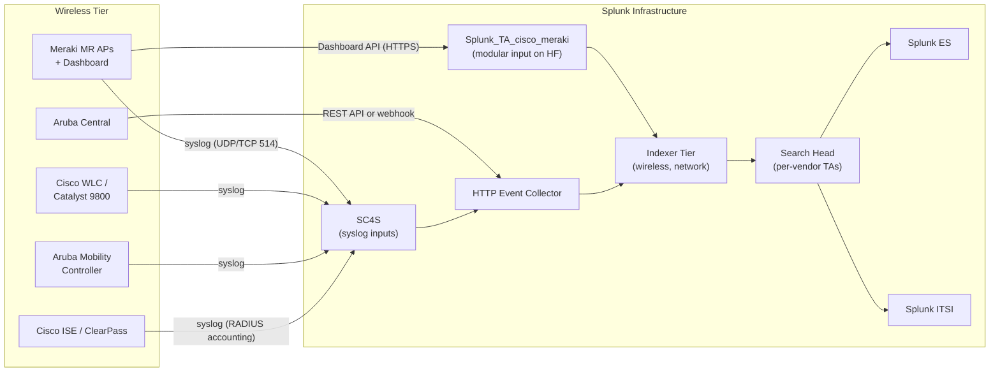

# Wireless Infrastructure (Cisco WLC, Meraki, Aruba) Integration Guide

> The definitive guide to monitoring enterprise wireless infrastructure
> with Splunk. 37 use cases covering Cisco Catalyst 9800 / WLC,
> Cisco Meraki<sup class="ref">[<a href="#ref-1">1</a>]</sup> cloud-managed wireless, HPE Aruba mobility controllers
> and Aruba Central. AP availability, RF health, client roaming, AAA
> attribution, rogue/Air Marshal detections, BYOD onboarding, mesh
> backhaul, and PCI-DSS 4.0 wireless compliance — all the way from
> simple "is the AP up?" to advanced location analytics.

---

## Table of Contents

- [Quick Start](#quick-start)
- [Overview](#overview)
- [Architecture and Data Flow](#architecture)
- [Prerequisites](#prerequisites)
- [Platform Coverage Matrix](#platform-matrix)
- [Cisco Catalyst 9800 / WLC (on-prem)](#cisco-wlc)
- [Cisco Meraki (cloud-managed)](#meraki)
- [HPE Aruba Mobility + Aruba Central](#aruba)
- [Aruba ClearPass / Cisco ISE Integration](#aaa-integration)
- [Field Dictionary (Cross-Vendor)](#field-dictionary)
- [Sample Events](#sample-events)
- [Splunk-Side Configuration](#splunk-config)
- [SC4S Pipeline](#sc4s)
- [AP Inventory Lookup (`wireless_ap_inventory.csv`)](#ap-inventory)
- [Cross-Product Correlation](#cross-product)
- [CIM Mapping Reference](#cim-mapping)
- [PCI-DSS 4.0 Wireless Compliance](#pci-wireless)
- [Compliance Mapping](#compliance)
- [Capacity Planning and Sizing](#sizing)
- [Recommended Dashboard Layouts](#dashboards)
- [ITSI Service Modeling](#itsi)
- [SOAR Playbook Examples](#soar)
- [Multi-Site / Multi-Org Strategy](#multi-site)
- [Security Hardening](#security-hardening)
- [Crawl / Walk / Run Roadmap](#roadmap)
- [Validation Checklist](#validation-checklist)
- [Known Limitations and Gaps](#known-limitations)
- [Troubleshooting](#troubleshooting)
- [FAQ](#faq)
- [Glossary](#glossary)
- [References](#references)
- [Contribution and Feedback](#contribution)

---

<a id="quick-start"></a>
## Quick Start — 30 Minutes to First Telemetry

> Pick the section matching your wireless platform. **All platforms
> share the same end-state**: AP / client / RF events flow into the
> `wireless` index, normalized via field aliases, ready for AP-offline
> alerts, RF interference dashboards, rogue / Air Marshal alerts, and
> ITSI services per building.

### Cisco Meraki (fastest)

1. Install [Cisco Meraki Add-on for Splunk](https://splunkbase.splunk.com/app/5580).
2. In Meraki Dashboard: **Network-wide > General > Reporting > Syslog server** — add Splunk SC4S VIP (port 514, all log levels).
3. Generate a Meraki API key (Dashboard > My Profile > API access) and configure the Splunk TA modular input pointing at `https://api.meraki.com/api/v1`.
4. Validate: `index=wireless sourcetype="meraki*" earliest=-15m | stats count by sourcetype, host`

### Cisco Catalyst 9800 / WLC

```cisco
!! Cisco Catalyst 9800 (IOS-XE)
logging host <sc4s-vip> transport tcp port 514
logging trap informational
logging source-interface Vlan100
service timestamps log datetime msec localtime show-timezone
```

### Aruba Mobility Controller

```aruba
!! Aruba ArubaOS
logging <sc4s-vip> severity informational
logging level informational system process all
logging facility local6
```

### Activate crawl tier

UC-5.4.1 (AP offline), UC-5.4.x (RF interference), UC-5.4.x (rogue AP / Air Marshal).

---

<a id="overview"></a>
## Overview

### What this guide covers

| Platform | Use case fit |
|---------|------------|
| **Cisco Catalyst 9800 / WLC** | On-prem controller-based AireOS / IOS-XE, FlexConnect, Mobility Express |
| **Cisco Meraki MR** | Cloud-managed wireless; Dashboard API + syslog |
| **HPE Aruba Mobility** | On-prem 7000/7200/9000 controllers, ArubaOS 8.x/10.x |
| **Aruba Central** | Cloud-managed wireless equivalent |
| **Cisco Aironet (legacy)** | Older WLC-managed APs (1815/2802/3802/4800) |

### Domains covered

| Domain | Examples |
|--------|---------|
| **Availability** | AP up/down, controller health, mesh backhaul |
| **Performance** | RF interference, channel utilisation, client roaming, RTT |
| **Capacity** | Client count per AP, BSSID load, bandwidth |
| **Security** | Rogue AP / Air Marshal, EAP failures, deauth flood, evil twin |
| **AAA / Identity** | 802.1X auth attribution, ClearPass / ISE policies, MAB |
| **BYOD / Onboarding** | Self-registration flows, device fingerprinting |
| **Compliance** | PCI-DSS 4.0 wireless requirements (rogue scan, encryption posture) |

### What's NOT in scope

| Domain | Where to look |
|--------|---------------|
| **Wired switching** | [Cisco Networks Guide](cisco-networks.md) |
| **Catalyst Center<sup class="ref">[<a href="#ref-3">3</a>]</sup> assurance** | [Catalyst Center Guide](catalyst-center.md) |
| **ISE policy decisions** | [Cisco ISE Guide](cisco-ise.md) |
| **End-user experience** | [ThousandEyes Guide](cisco-thousandeyes.md) |
| **Wireless intrusion / WIPS deep-dive** | [Firewalls Guide](firewalls.md) for L7 + Splunk ES correlation |

### What good looks like

| Dimension | Without integration | With full deployment |
|-----------|---------------------|----------------------|
| AP outage | Reactive ticket from user | Real-time alert + coverage-impact |
| RF interference | Manual sniffer on-site | Channel utilisation heatmap |
| Rogue AP | Quarterly compliance scan | Continuous Air Marshal alerts |
| Client roaming issues | "Wi-Fi is bad" | Per-client roam history + RSSI trace |
| Capacity planning | Provisioning guesswork | Trended client/AP load + 90-day forecast |

---

<a id="architecture"></a>
## Architecture and Data Flow



**Two main ingest patterns:**

1. **API polling (modular input)** — Meraki Dashboard API + Aruba Central API
2. **Syslog via SC4S** — WLC, Catalyst 9800, Aruba on-prem controllers, Meraki syslog

---

<a id="prerequisites"></a>
## Prerequisites

### Splunk requirements

| Item | Detail |
|------|--------|
| **Splunk version** | Splunk Enterprise 9.0+ or Splunk Cloud |
| **Splunkbase add-ons** | Per platform (see [Platform Coverage Matrix](#platform-matrix)) |
| **SC4S** | For syslog routing from on-prem controllers |
| **HEC token** | For SC4S → Splunk and API → HEC patterns |
| **Heavy Forwarder** | For Meraki TA modular input (Dashboard API polling) |

### Wireless-side requirements

| Platform | Required permissions / configs |
|---------|-------------------------------|
| **Meraki** | API key with org-level read; syslog server entry per-network |
| **Cisco WLC / 9800** | `enable` + `service timestamps`; logging host config; AAA radius accounting if integrating ISE |
| **Aruba Controller** | Admin role; `logging` config block; SNMP read (optional) |
| **Aruba Central** | API key + REST API access enabled |

---

<a id="platform-matrix"></a>
## Platform Coverage Matrix

| Platform | TA | Splunkbase | Sourcetypes | Cloud-vetted |
|---------|----|-----------|-------------|--------------|
| **Cisco Meraki** | Splunk_TA_cisco_meraki | [5580](https://splunkbase.splunk.com/app/5580) | `meraki`, `meraki:api:*`, `meraki:wireless:airmarshal` | Yes |
| **Cisco WLC / 9800** | TA-cisco_ios (syslog) | [1352](https://splunkbase.splunk.com/app/1352) | `cisco:wlc`, `cisco:wlc:syslog`, `cisco:catalyst9800` | Yes |
| **HPE Aruba Mobility** | Aruba Networks Add-on | [4668](https://splunkbase.splunk.com/app/4668) | `aruba:controller` | Yes |
| **HPE Aruba ClearPass** | HPE Aruba ClearPass App | [7865](https://splunkbase.splunk.com/app/7865) | `aruba:clearpass` | Yes |
| **Aruba Central** | (custom REST input) | n/a | `aruba:central` | n/a |

---

<a id="cisco-wlc"></a>
## Cisco Catalyst 9800 / WLC (on-prem)

### Required Splunk components

| Component | Purpose |
|-----------|--------|
| TA-cisco_ios | Field extractions for IOS-XE syslog (works for 9800) |
| SC4S | Vendor-pack routing |

### WLC syslog facility

```cisco
!! Cisco Catalyst 9800 (IOS-XE)
service timestamps log datetime msec localtime show-timezone
logging host <sc4s-vip> transport tcp port 514
logging trap informational
logging source-interface Loopback0
logging origin-id hostname

!! Enable specific WLC syslog modules at higher detail
logging discriminator wlc-detail msg-body includes "AP-COMMON|RRM|MOBILITY|SECURITY"
logging buffered discriminator wlc-detail 32768

!! For deeper RF / RRM events
logging level all 6
```

### Sample event (AP-COMMON: AP join)

```
*Apr 25 14:30:15.512: %CAPWAP-5-CHANGED: AP 'AP-Office-Floor3-NW' joined controller 'WLC-NYC-PRIMARY'. AP MAC: aa:bb:cc:dd:ee:ff IP: 10.20.30.40
```

### Top WLC events to monitor

| Event class | Splunk match |
|------------|-------------|
| AP join / disjoin | `%CAPWAP-5-CHANGED|%LWAPP-5-CHANGED|%APMGR-5-CHANGED` |
| RF interference / DFS | `%RRM-3-DFS|%RRM-4-INTERFERENCE` |
| Rogue AP / Air Marshal | `%ROGUEAP-5-DETECTED|%RM-5-ROGUE` |
| Client auth failure | `%DOT1X-5-FAIL|%MAB-5-FAIL` |
| Mobility events | `%MM-5-INTRA-DOMAIN|%MM-5-INTER-DOMAIN` |
| Power supply / fan | `%ENVMON-3-FAN_FAILED|%ENVMON-3-POWER_FAILED` |

---

<a id="meraki"></a>
## Cisco Meraki (cloud-managed)

### Required Splunk components

| Component | Purpose |
|-----------|--------|
| Splunk_TA_cisco_meraki | Field extractions + Dashboard API modular input |

### Two ingest paths (use BOTH)

**Path 1 — Meraki syslog (real-time events)**

In Meraki Dashboard:
- **Network-wide > General > Reporting > Syslog server**: add `<sc4s-vip>:514`
- Subscribe to: Wireless events, IDS alerts, Flows, URLs, Air Marshal events, Client connectivity
- SC4S vendor pack auto-classifies as `meraki` sourcetype

**Path 2 — Dashboard API (rich object metadata)**

```ini
# Splunk_TA_cisco_meraki/local/inputs.conf
[meraki_dashboard_api://devices_status]
api_key = <encrypted>
org_id = 12345
endpoint = /organizations/{orgId}/devices/statuses
interval = 300
sourcetype = meraki:api:devices
index = wireless

[meraki_dashboard_api://wireless_clients]
api_key = <encrypted>
org_id = 12345
endpoint = /networks/{networkId}/clients
interval = 600
sourcetype = meraki:api:clients
index = wireless

[meraki_dashboard_api://airmarshal]
api_key = <encrypted>
org_id = 12345
endpoint = /networks/{networkId}/wireless/airMarshal
interval = 600
sourcetype = meraki:wireless:airmarshal
index = wireless
```

### Sample events

**Syslog event (client connect):**
```
1745596200.123456789 MR-NYC-Office-3F airmarshal: type=rogue_ssid_detected ssid=Free_WiFi mac=aa:bb:cc:dd:ee:ff rssi=-65 channel=11
```

**Dashboard API event (device status):**
```json
{
    "name": "MR-NYC-Office-3F",
    "serial": "Q2PD-XXXX-YYYY",
    "model": "MR46",
    "status": "online",
    "lastReportedAt": "2026-04-25T14:30:00Z",
    "publicIp": "203.0.113.5",
    "lanIp": "10.20.30.40",
    "tags": ["floor3", "northwest"]
}
```

---

<a id="aruba"></a>
## HPE Aruba Mobility + Aruba Central

### Required Splunk components

| Component | Purpose |
|-----------|--------|
| Aruba Networks Add-on for Splunk | Field extractions for ArubaOS syslog |
| HPE Aruba ClearPass App | RADIUS / AAA event extractions |

### Aruba Mobility Controller syslog

```aruba
!! ArubaOS 8.x
logging <sc4s-vip> severity informational
logging level informational system process all
logging level warnings security process auth
logging facility local6
```

### Aruba Central API (cloud-managed)

```bash
# Get OAuth2 token
curl -X POST https://app1-apigw.central.arubanetworks.com/oauth2/token \
    -H "Content-Type: application/json" \
    -d '{"client_id":"...","client_secret":"...","grant_type":"client_credentials"}'

# Pull AP inventory
curl -H "Authorization: Bearer <token>" \
    https://app1-apigw.central.arubanetworks.com/configuration/v1/devices
```

Push results to Splunk via HEC scripted input or custom modular input.

### Sample event (AP state change)

```
Apr 25 14:30:15 ArubaOS-Mobility-Master cli[12345]: <532002> <NOTI> |stm|  AP MMRD-Lobby-AP1 (00:1a:1e:aa:bb:cc) state changed: up -> down (radio 1, channel 36)
```

---

<a id="aaa-integration"></a>
## Aruba ClearPass / Cisco ISE Integration

Wireless without AAA logs leaves you blind to **who** is on the network. Cross-reference is critical.

### Cisco ISE → Wireless correlation

```spl
(index=wireless sourcetype="cisco:wlc" "client connected")
OR (index=ise sourcetype="cisco:ise:syslog" event_name="Authentication succeeded")
| transaction client_mac maxspan=30s
| stats count by client_mac, user, ssid, ap_name, ise_policy
```

See [Cisco ISE Guide](cisco-ise.md) for ISE-side details.

### Aruba ClearPass-specific UCs

```spl
index=wireless sourcetype="aruba:clearpass" earliest=-1h
| stats count by service, role, status, auth_method
| sort -count
```

---

<a id="field-dictionary"></a>
## Field Dictionary (Cross-Vendor)

After CIM Authentication / Network_Sessions mapping, all platforms expose:

| Field | Example | Description |
|-------|---------|-------------|
| `ap_name` | `MR-NYC-Office-3F` | Access point friendly name |
| `ap_mac` | `aa:bb:cc:dd:ee:ff` | AP BSSID/MAC |
| `ap_model` | `MR46` / `9120AXI` | Hardware model |
| `controller` | `WLC-NYC-PRIMARY` | Controller hostname |
| `ssid` | `Corp-Wi-Fi` | SSID name |
| `client_mac` | `11:22:33:44:55:66` | Wireless client MAC |
| `user` | `john.doe@corp.com` | 802.1X authenticated identity |
| `auth_method` | `EAP-TLS` / `PEAP` / `MAB` / `PSK` | Authentication |
| `rssi` | `-65` | Received Signal Strength Indicator (dBm) |
| `snr` | `35` | Signal-to-Noise Ratio (dB) |
| `channel` | `36` | RF channel |
| `band` | `2.4GHz` / `5GHz` / `6GHz` | Frequency band |
| `data_rate` | `866 Mbps` | Negotiated data rate |
| `tx_power` | `17 dBm` | AP TX power |
| `event_type` | `AP-DISJOIN` / `client_connected` | Event class |
| `building` | `NYC-HQ` | (from `wireless_ap_inventory.csv` lookup) |
| `floor` | `3` | (from inventory) |

---

<a id="sample-events"></a>
## Sample Events

(See per-platform sections above.)

---

<a id="splunk-config"></a>
## Splunk-Side Configuration

### Index strategy

```ini
# Single shared index
[wireless]
homePath = $SPLUNK_DB/wireless/db
maxDataSize = auto_high_volume
frozenTimePeriodInSecs = 7776000   # 90 days hot+warm

# Or use shared "network" index
```

### Key field aliases

```ini
# props.conf
[meraki:api:devices]
EVAL-vendor_product = "Cisco Meraki"
FIELDALIAS-ap_alias = name AS ap_name

[cisco:wlc]
EVAL-vendor_product = "Cisco WLC"

[aruba:controller]
EVAL-vendor_product = "HPE Aruba"
```

---

<a id="sc4s"></a>
## SC4S Pipeline

SC4S vendor packs auto-route Cisco / Meraki / Aruba syslog to the right sourcetype. Configure SC4S env vars:

```bash
SC4S_DEST_SPLUNK_HEC_DEFAULT_URL=https://hec-vip.splunk.example.com:8088
SC4S_DEST_SPLUNK_HEC_DEFAULT_TOKEN=<token>
SC4S_LISTEN_DEFAULT_TCP_PORT=514
SC4S_LISTEN_DEFAULT_UDP_PORT=514
```

---

<a id="ap-inventory"></a>
## AP Inventory Lookup (`wireless_ap_inventory.csv`)

Build this once; it's the foundation for **every** physical-context dashboard:

```csv
ap_name,ap_mac,building,floor,zone,ap_model,expected_controller,owner_team
AP-NYC-3F-NW,aa:bb:cc:dd:ee:01,NYC-HQ,3,Northwest,9120AXI,WLC-NYC-PRIMARY,Network
AP-NYC-3F-NE,aa:bb:cc:dd:ee:02,NYC-HQ,3,Northeast,9120AXI,WLC-NYC-PRIMARY,Network
MR-LON-1F-Reception,11:22:33:44:55:01,LON-HQ,1,Reception,MR46,Meraki-Cloud,Network
```

Reference in props.conf or as automatic lookup. Used in all per-AP UCs to enrich raw events with location/owner context.

---

<a id="cross-product"></a>
## Cross-Product Correlation

### Wireless + Wired (PoE switch failure detection)

```spl
(index=wireless ("AP-DISJOIN" OR "offline"))
OR (index=network sourcetype="cisco:ios" "Interface down")
| transaction ap_name interface maxspan=30s
| stats count by switch, interface_status, ap_status
```

### Wireless + ISE (auth attribution)

```spl
(index=wireless event_type="client_connected")
OR (index=ise event_name="Authentication succeeded")
| transaction client_mac maxspan=30s
```

### Wireless + ThousandEyes (user-experience overlay)

Cross-link AP coverage to user-side ThousandEyes Endpoint Agent reports per building.

---

<a id="cim-mapping"></a>
## CIM Mapping Reference

| CIM model | Sourcetype | Auto-mapped? |
|-----------|-----------|--------------|
| **Authentication** | `cisco:wlc` (when 802.1X), `aruba:clearpass`, ISE-merged | Yes (via TA + custom) |
| **Network_Sessions** | `meraki:api:clients`, `cisco:wlc` connect events | Partial |
| **Network_Traffic** | Meraki flow events | Partial |
| **Alerts** | Air Marshal / rogue events | Partial |

---

<a id="pci-wireless"></a>
## PCI-DSS 4.0 Wireless Compliance

PCI-DSS 4.0 Section 11.2 mandates **quarterly rogue wireless detection** on all CDE-connected sites. Splunk + Meraki Air Marshal / Cisco Rogue AP detection make this continuous instead of point-in-time.

```spl
index=wireless (sourcetype="meraki:wireless:airmarshal" type="rogue_ssid_detected")
OR (sourcetype="cisco:wlc" "%ROGUEAP-5-DETECTED")
| stats count, latest(_time) as last_seen, values(channel) as channels by ssid, mac, ap_name
| eval days_since = round((now() - last_seen)/86400, 1)
| where count > 1   /* persistent — investigate */
```

Generate quarterly PCI evidence:

```spl
index=wireless sourcetype="meraki:wireless:airmarshal" earliest=-90d
| eval quarter = strftime(_time, "%Y-Q%q")
| stats values(ssid) as rogue_ssids, count, dc(mac) as unique_devices by quarter
```

---

<a id="compliance"></a>
## Compliance Mapping

### PCI-DSS 4.0

| Requirement | UC examples |
|-------------|------------|
| **11.2.1** Quarterly rogue wireless detection | Air Marshal / Rogue UCs |
| **9.1.3** Physical access to network | AP location enrichment |
| **4.2.1** Strong cryptography over open networks | TLS / encryption posture UCs |

### NIST 800-53

| Control | Coverage |
|---------|----------|
| **AC-18** Wireless Access | Auth + RBAC + encryption UCs |
| **SC-40** Wireless Link Protection | Encryption posture |
| **AU-2/12** Audit | All AAA + connection UCs |

### NIS2

| Article | Coverage |
|---------|----------|
| **Art 21(2)(a)** Network security | Wireless availability + intrusion |
| **Art 21(2)(d)** Supply chain (incl. wireless gear) | TA inventory tracking |

### HIPAA

| §164.312 | Coverage |
|---------|----------|
| (e)(1) Transmission Security | Encryption posture, rogue detection |
| (b) Audit Controls | All wireless audit UCs |

---

<a id="sizing"></a>
## Capacity Planning and Sizing

### Per-AP daily ingest (typical)

| Tier | Avg events / AP / day | Daily ingest / AP |
|------|----------------------|-------------------|
| Low (small office) | ~500 | ~250 KB |
| Medium (corporate) | ~5,000 | ~2.5 MB |
| High (campus / hospital) | ~50,000 | ~25 MB |

### Worked examples

| Estate | APs | Daily ingest |
|--------|-----|-------------|
| Small (50 APs) | 50 medium | ~125 MB/day |
| Mid (500 APs) | 500 medium | ~1.25 GB/day |
| Large enterprise | 5,000 high | ~125 GB/day |

### Retention recommendations

| Data | Retention | Rationale |
|------|-----------|-----------|
| Connection / disconnect | 90 days | DFIR + investigation |
| Air Marshal / rogue | 1 year | PCI quarterly evidence |
| RF / RRM metrics | 90 days | Capacity trending |
| ClearPass / RADIUS | 1 year | Compliance |

---

<a id="dashboards"></a>
## Recommended Dashboard Layouts

### Crawl — "Wireless At a Glance"

```
+---------------------+---------------------+
| AP STATUS GRID (per building/floor)        |
+---------------------+---------------------+
| OFFLINE APs (with location)                |
+---------------------+---------------------+
| ROGUE / AIR MARSHAL DETECTIONS (24h)       |
+---------------------+---------------------+
| TOP RF INTERFERENCE                        |
+---------------------+---------------------+
```

### Walk — "RF & Performance"

```
+---------------------+---------------------+
| CHANNEL UTILISATION HEATMAP                |
+---------------------+---------------------+
| CLIENT COUNT PER AP                        |
+---------------------+---------------------+
| ROAMING MATRIX (where do clients move?)    |
+---------------------+---------------------+
| RSSI / SNR DISTRIBUTION                    |
+---------------------+---------------------+
```

### Run — "Security & Identity"

```
+---------------------+---------------------+
| 802.1X AUTH SUCCESS / FAIL TREND           |
+---------------------+---------------------+
| BYOD ONBOARDING FUNNEL                     |
+---------------------+---------------------+
| TOP DEAUTH FLOOD SOURCES                   |
+---------------------+---------------------+
| EVIL TWIN DETECTION                        |
+---------------------+---------------------+
```

---

<a id="itsi"></a>
## ITSI Service Modeling

### Service hierarchy

```
Wireless Tier
├── Per-Building Wireless
│   ├── NYC-HQ (entity = building)
│   │   ├── Floor 1 APs
│   │   └── Floor 2-N APs
│   ├── LON-HQ
│   └── ...
├── Wireless Controllers
│   ├── WLC-NYC-PRIMARY
│   ├── WLC-NYC-SECONDARY
│   └── Aruba-7240-EU
└── AAA Backend
    └── ISE / ClearPass clusters
```

### Recommended KPIs

| KPI | Source | Threshold |
|-----|--------|-----------|
| AP availability % | meraki:api / cisco:wlc | Static (page < 95%) |
| Channel utilisation | RF metrics | Adaptive |
| Auth success % | 802.1X events | Static (page < 90%) |
| Roaming events / hr | Connect events | Adaptive |
| Rogue AP count | Air Marshal | Static (warn > 5) |

---

<a id="soar"></a>
## SOAR Playbook Examples

### Playbook 1: AP Offline (UC-5.4.1)

**Trigger:** AP offline > 15 min.

```
1. RECEIVE alert (ap_name, ap_mac, building, floor)
2. CHECK physical switch port status (cross-product UC-5.1.1)
3. IF >5 APs on same floor → page facilities (PoE switch / power)
4. IF single AP → create Sev-3 ticket; check warranty / RMA
5. NOTIFY building point-of-contact for visual inspection
```

### Playbook 2: Rogue AP / Air Marshal (PCI 11.2.1)

**Trigger:** Persistent rogue SSID detected (> 1 occurrence in 24h).

```
1. RECEIVE alert (ssid, mac, channel, ap detecting it)
2. CHECK if MAC is in `approved_wireless_devices.csv`
3. IF unapproved AND in CDE-connected building → page security
4. CONTAIN via Meraki Dashboard auto-containment / WLC rogue-on-wire
5. CREATE PCI evidence entry; log to compliance index
6. DISPATCH wireless engineer for physical removal
```

### Playbook 3: 802.1X Auth Failure Spike

**Trigger:** Auth failures > 100 / min.

```
1. RECEIVE alert (auth_method, top user/MAC, ssid)
2. CHECK if certificate expiry is the cause (cross-product cert-monitor)
3. CHECK ISE / ClearPass policy changes in last 1h
4. CHECK AD recent password reset for top users
5. NOTIFY identity team if not config-related
```

---

<a id="multi-site"></a>
## Multi-Site / Multi-Org Strategy

For globally-distributed wireless:

- **Per-region SC4S** receiving local controllers
- **Per-region indexes** (`wireless_emea`, `wireless_amer`, `wireless_apac`)
- **Meraki Multi-Org**: one TA modular input per Meraki org with org_id qualifier
- **Cross-region search** for global views (NOC bird's-eye)

---

<a id="security-hardening"></a>
## Security Hardening

- Meraki API key: scope to read-only org-level, rotate every 90 days
- Aruba Central API: use OAuth2 client credentials, not basic auth
- WLC `enable secret` and `aaa authentication` configured properly
- TLS for all controller-to-Splunk traffic; never plain syslog over WAN
- Field-level RBAC: `client_mac`, `user` may be PII → restrict via Splunk role

---

<a id="roadmap"></a>
## Crawl / Walk / Run Roadmap

### Crawl (Week 1–2)

1. Install per-platform TA(s)
2. Configure syslog forwarding from controllers
3. Configure Meraki Dashboard API
4. Build `wireless_ap_inventory.csv`
5. UC-5.4.1 (AP offline) + AP status dashboard

### Walk (Week 3–6)

1. RF metrics ingestion (channel utilisation, RSSI/SNR)
2. Air Marshal / rogue UCs
3. ClearPass / ISE integration for AAA attribution
4. Per-building ITSI services

### Run (Month 2+)

1. Full RF heatmaps + roaming analysis
2. PCI 11.2.1 quarterly evidence automation
3. SOAR playbooks
4. Cross-product correlation (PoE switch, ISE, ThousandEyes)

---

<a id="validation-checklist"></a>
## Validation Checklist

### Day 1

- [ ] At least one platform TA installed
- [ ] First controller / Meraki org sending data
- [ ] AP inventory CSV deployed
- [ ] UC-5.4.1 alert wired

### Day 7

- [ ] All controllers + Meraki orgs onboarded
- [ ] Crawl dashboard live
- [ ] Air Marshal events flowing

### Day 30

- [ ] Walk-tier UCs deployed
- [ ] ITSI services per building
- [ ] PCI quarterly evidence search built

### Day 90

- [ ] Run-tier UCs (RF heatmap, roaming, identity)
- [ ] SOAR playbooks for rogue AP + AP offline
- [ ] Quarterly PCI evidence delivered

---

<a id="known-limitations"></a>
## Known Limitations and Gaps

| Limitation | Impact | Workaround |
|------------|--------|------------|
| **Meraki API rate limits (5 req/s/org)** | Polling can throttle | Tune `interval` per input; use async pagination |
| **Meraki syslog lacks rich metadata** | Need API for object names | Use both syslog (real-time) + API (rich metadata) |
| **WLC syslog levels too verbose** | Index pressure | Use `logging discriminator` to filter |
| **Aruba Central token lifetime 7200s** | Token refresh needed | Implement OAuth2 refresh in scripted input |
| **Air Marshal default = scan only** | Rogue not contained | Enable containment in Meraki Dashboard policy |
| **6 GHz spectrum (Wi-Fi 6E) data** | Newer field set | Verify TA supports 6 GHz (TA versions matter) |
| **Mesh backhaul metrics minimal** | Limited insight | Use SNMP polling for mesh stats |

---

<a id="troubleshooting"></a>
## Troubleshooting

### Meraki API input failing

- Check API key validity: `curl -H "X-Cisco-Meraki-API-Key: <key>" https://api.meraki.com/api/v1/organizations`
- Check rate limit: HTTP 429 indicates throttling — increase `interval`
- Verify the TA modular input log: `index=_internal source=*meraki* log_level=ERROR`

### WLC events not parsing

- Verify TA-cisco_ios installed on indexer + SH
- Check `props.conf [cisco:wlc]` line breaking matches WLC timestamp format
- For 9800 IOS-XE, sourcetype may need to be `cisco:catalyst9800`

### No AP-COMMON events

- Increase WLC log level: `config syslog level AP-COMMON 5` (notifications)
- Verify syslog destination is reachable (`show logging`)

### Aruba Central data missing

- Verify OAuth2 token refresh logic
- Check `https://app1-apigw.central.arubanetworks.com` is reachable from HF

### Time skew

- Ensure NTP synced on all controllers + Splunk infrastructure
- Verify timezone in `service timestamps` config

---

<a id="faq"></a>
## FAQ

**Q: Can one platform TA cover all my wireless?**
A: No — Meraki, Cisco WLC, Aruba are entirely different control planes. You need vendor-specific TAs.

**Q: Should I use SC4S or direct UDP/TCP receiver?**
A: Always SC4S — it auto-classifies vendor packs, handles failover, and is Splunk Cloud-friendly.

**Q: How do I handle high client churn (e.g., university campus)?**
A: Adjust per-network Meraki API polling interval upward (10-15 min) for client lists; use syslog for real-time critical events.

**Q: Can I correlate Wi-Fi 6E vs Wi-Fi 6 client distribution?**
A: Yes — `band` field (2.4GHz / 5GHz / 6GHz) in connect events. Useful for capacity planning.

**Q: Does this guide cover wireless intrusion detection (WIDS)?**
A: Basic Air Marshal / Rogue AP yes. Deep-dive WIDS / WIPS (Aruba RFProtect, Cisco aWIPS) is supplementary — see vendor docs.

**Q: How do I handle ANCHOR / FOREIGN mobility events?**
A: Use `cisco:wlc` mobility events (`%MM-5-INTRA-DOMAIN|%MM-5-INTER-DOMAIN`); transaction-correlate with client_mac across both controllers.

**Q: Can I detect deauth flood attacks?**
A: Yes — Meraki Air Marshal categorises this. Alternatively, build SPL based on disconnect rate per AP.

---

<a id="glossary"></a>
## Glossary

| Term | Definition |
|------|-----------|
| **WLC** | Wireless LAN Controller (Cisco) |
| **CAPWAP** | Control And Provisioning of Wireless Access Points (tunnel protocol) |
| **BSS / BSSID** | Basic Service Set / its identifier (typically the AP's radio MAC) |
| **SSID** | Service Set Identifier (the network name users see) |
| **RSSI** | Received Signal Strength Indicator (dBm; closer to 0 = stronger) |
| **SNR** | Signal-to-Noise Ratio (dB; higher = cleaner signal) |
| **RRM** | Radio Resource Management (Cisco automatic RF tuning) |
| **DFS** | Dynamic Frequency Selection (5 GHz radar avoidance) |
| **EAP-TLS** | Extensible Authentication Protocol with TLS (cert-based 802.1X) |
| **MAB** | MAC Authentication Bypass (when 802.1X fails) |
| **Air Marshal** | Meraki's WIPS feature — rogue AP / WIDS |
| **Rogue AP** | Unauthorised AP near corporate infrastructure |
| **Evil Twin** | Rogue AP advertising legitimate SSID to phish credentials |
| **WIDS / WIPS** | Wireless Intrusion Detection / Prevention System |

---

<a id="references"></a>
## References

- [Cisco Meraki Add-on for Splunk (Splunkbase 5580)](https://splunkbase.splunk.com/app/5580)
- [Cisco Networks Add-on (Splunkbase 1352)](https://splunkbase.splunk.com/app/1352)
- [Aruba Networks Add-on (Splunkbase 4668)](https://splunkbase.splunk.com/app/4668)
- [HPE Aruba ClearPass App (Splunkbase 7865)](https://splunkbase.splunk.com/app/7865)
- [Cisco Catalyst 9800 syslog reference](https://www.cisco.com/c/en/us/support/wireless/catalyst-9800-series-wireless-controllers/series.html)
- [Meraki Dashboard API reference](https://developer.cisco.com/meraki/api-v1/)
- [PCI-DSS 4.0 Wireless requirements](https://www.pcisecuritystandards.org/document_library/)

---

<a id="contribution"></a>
## Contribution and Feedback

Part of the [Splunk Monitoring Use Cases](https://github.com/fenre/splunk-monitoring-use-cases) project. [Open an issue](https://github.com/fenre/splunk-monitoring-use-cases/issues/new).

---

*Last updated: 2026-05-09. Covers Splunk_TA_cisco_meraki 2.x, TA-cisco_ios 5.x, Aruba Networks Add-on 1.x.*

---

<!-- BEGIN-AUTOGENERATED-SOURCES -->

## References

*Auto-generated by `scripts/generate_doc_references.py` from `data/source-references.json` and `data/source-mappings.json`. Edit those files (or the document body) to change citations; this footer is rewritten on every run.*

### Primary sources

<a id="ref-1"></a>**[1]** Cisco Meraki. (2026). *Cisco Meraki Documentation*. Cisco Systems, Inc. Retrieved May 11, 2026, from https://documentation.meraki.com/

### Supporting sources

<a id="ref-2"></a>**[2]** Center for Internet Security. (2021). *CIS Critical Security Controls v8* (v8). https://www.cisecurity.org/controls

<a id="ref-3"></a>**[3]** Cisco Systems, Inc. (2026). *Cisco Catalyst Center Documentation*. Retrieved May 11, 2026, from https://www.cisco.com/site/us/en/products/networking/catalyst-center/index.html

<a id="ref-4"></a>**[4]** European Parliament and Council of the European Union. (2022, December). *Directive (EU) 2022/2555 — NIS2 Directive on cybersecurity*. Official Journal of the European Union, L 333. ELI: dir/2022/2555. https://eur-lex.europa.eu/eli/dir/2022/2555/oj

<a id="ref-5"></a>**[5]** Gerhards, R. (2009, March). *The Syslog Protocol*. Internet Engineering Task Force. RFC 5424. https://www.rfc-editor.org/rfc/rfc5424

<a id="ref-6"></a>**[6]** Hardt, D. (Ed.). (2012, October). *The OAuth 2.0 Authorization Framework*. Internet Engineering Task Force. RFC 6749. https://www.rfc-editor.org/rfc/rfc6749

<a id="ref-7"></a>**[7]** International Organization for Standardization. (2022). *ISO/IEC 27001:2022 — Information security, cybersecurity and privacy protection — Information security management systems — Requirements*. ISO/IEC. ISO/IEC 27001:2022. https://www.iso.org/standard/27001

<a id="ref-8"></a>**[8]** National Institute of Standards and Technology. (2020). *Security and Privacy Controls for Information Systems and Organizations* (Revision 5). U.S. Department of Commerce. NIST SP 800-53 Rev. 5. https://csrc.nist.gov/pubs/sp/800/53/r5/upd1/final

<a id="ref-9"></a>**[9]** Splunk Inc. (2026). *Splunk Common Information Model Add-on Manual*. Splunk LLC, a Cisco company. Retrieved May 11, 2026, from https://docs.splunk.com/Documentation/CIM

<a id="ref-10"></a>**[10]** Splunk Inc. (2026). *Splunk Infrastructure Monitoring Documentation*. Splunk LLC, a Cisco company. Retrieved May 11, 2026, from https://docs.splunk.com/observability/en/infrastructure/intro-to-infrastructure.html

<a id="ref-11"></a>**[11]** U.S. Department of Health & Human Services. (2002). *HIPAA Privacy Rule (45 CFR Parts 160 and 164, Subparts A and E)*. Office for Civil Rights, HHS. 45 CFR 160, 164. https://www.hhs.gov/hipaa/for-professionals/privacy/index.html

<a id="ref-12"></a>**[12]** U.S. Department of Health & Human Services. (2013). *HIPAA Security Rule (45 CFR Parts 160 and 164, Subparts A and C)*. Office for Civil Rights, HHS. 45 CFR 160, 164. https://www.hhs.gov/hipaa/for-professionals/security/index.html

<details>
<summary>Additional online sources cited in the document body (9)</summary>

<a id="ref-13"></a>**[13]** splunkbase.splunk.com. *Cisco Meraki Add-on for Splunk*. Retrieved May 11, 2026, from https://splunkbase.splunk.com/app/5580

<a id="ref-14"></a>**[14]** splunkbase.splunk.com. *Splunkbase app #1352*. Retrieved May 11, 2026, from https://splunkbase.splunk.com/app/1352

<a id="ref-15"></a>**[15]** splunkbase.splunk.com. *Splunkbase app #4668*. Retrieved May 11, 2026, from https://splunkbase.splunk.com/app/4668

<a id="ref-16"></a>**[16]** splunkbase.splunk.com. *Splunkbase app #7865*. Retrieved May 11, 2026, from https://splunkbase.splunk.com/app/7865

<a id="ref-17"></a>**[17]** cisco.com. *Cisco Catalyst 9800 syslog reference*. Retrieved May 11, 2026, from https://www.cisco.com/c/en/us/support/wireless/catalyst-9800-series-wireless-controllers/series.html

<a id="ref-18"></a>**[18]** developer.cisco.com. *Meraki Dashboard API reference*. Retrieved May 11, 2026, from https://developer.cisco.com/meraki/api-v1/

<a id="ref-19"></a>**[19]** pcisecuritystandards.org. *PCI-DSS 4.0 Wireless requirements*. Retrieved May 11, 2026, from https://www.pcisecuritystandards.org/document_library/

<a id="ref-20"></a>**[20]** github.com. *Splunk Monitoring Use Cases*. Retrieved May 11, 2026, from https://github.com/fenre/splunk-monitoring-use-cases

<a id="ref-21"></a>**[21]** github.com. *Open an issue*. Retrieved May 11, 2026, from https://github.com/fenre/splunk-monitoring-use-cases/issues/new

</details>

### Related repository documents

- [`docs/guides/catalyst-center.md`](catalyst-center.md)
- [`docs/guides/cisco-ise.md`](cisco-ise.md)
- [`docs/guides/cisco-networks.md`](cisco-networks.md)
- [`docs/guides/cisco-thousandeyes.md`](cisco-thousandeyes.md)
- [`docs/guides/firewalls.md`](firewalls.md)

### Cited by

- [`docs/guides/datacenter-fabric-sdn.md`](datacenter-fabric-sdn.md)

<!-- END-AUTOGENERATED-SOURCES -->
