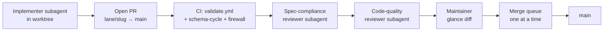

# Parallel execution substrate

This document is the **contributor-facing contract** for running many catalogue
improvement tasks in parallel without stepping on each other. It translates the
isolation and conflict rules from the internal *Catalog Parallel Execution
Atlas* (maintainers keep the full task atlas under
`.cursor/plans/catalog_parallel_execution_atlas_dbe5875a.plan.md` locally) into
day-to-day workflow guidance.

If you are a human contributor landing a single PR, you only need the quick start
in [CONTRIBUTING.md](../CONTRIBUTING.md). If you are dispatching subagents,
orchestrating lanes, or touching shared central files, read this page end to end.

---

## 1. Why isolation exists

The catalogue repo mixes:

- **7,900+ handwritten UC sidecars** (`content/cat-*/UC-*.json`) — maintainer-owned
- **Shared central data** (`data/regulations.json`, typed non-technical source, …)
- **A single UC JSON Schema** (`schemas/uc.schema.json`) that many features extend
- **One build pipeline** that regenerates large `dist/` trees
- **CI gates** that assume deterministic, serial merges for certain files

Parallel work is safe when each task has its **own checkout, branch, and build
output**, and when tasks that share a *central* resource follow the serialisation
protocols in §4 below.

---

## 2. Parallel-execution substrate

### 2.1 Worktree per task

Every parallel task runs inside its own [git worktree](https://git-scm.com/docs/git-worktree)
under `.worktrees/`. That directory is **gitignored** — it never lands in commits.

**Naming convention:**

```
.worktrees/<lane-letter>-<task-slug>
```

Examples:

| Task | Worktree path |
| --- | --- |
| Lane A, MCP HTTP transport | `.worktrees/A-mcp-http-transport` |
| Lane B, SPL fuzzer | `.worktrees/B-spl-fuzzer` |
| Lane I, UC detail page | `.worktrees/I-uc-detail-page-migration` |

Rules:

1. **Stay inside the worktree.** Do not read sibling worktrees or edit files in
   the main checkout while a lane task is in flight.
2. **One worktree per task.** Do not reuse a worktree path for a different slug
   without removing it first (`git worktree remove .worktrees/<slug>`).
3. **Verify gitignore:** `git check-ignore -v .worktrees` must report a match.

#### Creating a worktree

**Ad-hoc / smoke (Makefile helper):**

```bash
make worktree-new TASK=smoke
# → .worktrees/smoke on branch worktree/smoke
```

**Catalogue lane task (preferred for real work):**

```bash
git worktree add -b A/mcp-http-transport .worktrees/A-mcp-http-transport
cd .worktrees/A-mcp-http-transport
make devcontainer-init   # optional but recommended — editable install + hooks + warm dist/
```

Remove when done:

```bash
git worktree remove .worktrees/A-mcp-http-transport
git branch -d A/mcp-http-transport   # after merge
```

### 2.2 Branch per task

Each worktree checks out its **own branch**. Branch names mirror the worktree slug:

```
<lane-letter>/<task-slug>
```

Examples: `A/mcp-http-transport`, `B/spl-fuzzer`, `O/substrate`.

Every branch opens **one PR against `main`**. PRs merge through the GitHub merge
queue (one at a time). When merge conflicts appear, rebase the branch on latest
`main` inside a fresh worktree and re-run verification — do not force-push to
`main`.

The ad-hoc `make worktree-new` helper uses `worktree/<TASK>` instead of
`<lane>/<slug>` so smoke tests do not consume lane branch names.

### 2.3 Build-output isolation

Each worktree builds into its own `dist/` (default for `tools/build/build.py`):

```bash
python3 tools/build/build.py --out dist
# or: make build
```

Because each worktree is a separate checkout, `dist/` trees do not collide across
tasks. Legacy comparison dirs (`dist1/`, `dist2/`, `dist-legacy/`, …) remain
documented in `.gitignore`; new per-task dirs may use the `dist-*/` glob
(e.g. `dist-smoke/` when overriding `--out`).

**Python environment:**

- A shared `.venv/` at the repo root is typical for a single checkout.
- Per-worktree venvs are lightweight (`python3 -m venv .venv && pip install -e ".[audits,dev,test]"`).
- If pip cache races appear when many worktrees install in parallel, pin:

  ```bash
  export PIP_CACHE_DIR="$(pwd)/.pip-cache"
  ```

  `.pip-cache/` is gitignored.

**Cleaning:**

```bash
make clean-tree   # from repo root — removes known local build dirs only
```

### 2.4 Coordination gates (summary)

Some resources cannot be edited safely in parallel. §4 lists each resource and
its protocol. Before dispatching a task, check its **Conflict surface** field in
the execution atlas against §4.

In short:

| Resource class | Protocol |
| --- | --- |
| UC JSON Schema | One schema bump per merge cycle (§4.1) |
| Central data files | One writer at a time (§4.2) |
| Baselines | Refreshed by designated tasks / nightly jobs (§4.3) |
| Generated artefacts | CI regenerates at merge; never hand-edit (§4.4) |
| Lookup-shaped JSON | Proposal queue (§4.5) |
| Test fixtures | Namespaced under `tests/fixtures/<owner>/` (§4.6) |
| New docs | Register via proposal queue + merger (§4.7) |

### 2.5 Pre-merge gate (every PR)

Every PR — human or subagent — must pass the existing
[validate.yml](../.github/workflows/validate.yml) jobs, including:

- `make audit-full` (locally before push when touching audits)
- `make test` (unit + build validation)
- Build reproducibility (`make audit-reproducibility-fast` in CI)
- **Schema-cycle gate** (§4.1) — enforced in the `lint` job
- **Subagent UC-firewall** (§5) — placeholder until Task B-7 activates enforcement

Subagent-authored PRs additionally receive two reviewer passes (spec compliance,
then code quality) before entering the merge queue. See §6.

### 2.6 Human glance before merge

Even after CI and subagent reviews pass, the maintainer reads the PR diff before
merge. This catches systemic errors both automated passes miss.

---

## 3. Isolation rules (conflict matrix)

This section is the repo-facing version of **§3 Conflict matrix** in the
execution atlas. Every parallel task declares which rows apply in its
`Conflict surface:` field.

### 3.1 `schemas/uc.schema.json` — schema cycle

Many features add optional UC fields. Colliding schema edits break open PRs.

**Rules:**

1. **Additive only.** Never remove or rename a field. Never tighten constraints
   in a way that invalidates existing sidecars.
2. **One PR per schema bump.** A schema change opens a PR that touches *only*
   `schemas/uc.schema.json` and the matching `schemas/changelogs/uc.md` row —
   no other functional change in that PR.
3. **Dependent tasks rebase.** When a schema PR merges, every open PR that
   depends on the new field rebases onto `main`.
4. **CI enforcement.** The **schema-cycle gate** in `validate.yml` ensures at
   most one schema bump lands on `main` within a 24-hour merge cycle. If your PR
   modifies `schemas/uc.schema.json` while `main` already received a schema bump
   in the last 24 hours, CI fails — wait for the cycle to clear or coordinate
   with the maintainer.

### 3.2 Central data files — serialise writers

These files are read concurrently but **written by one task at a time**:

| File | Owner per window | Notes |
| --- | --- | --- |
| `data/regulations.json` | Lane C (one task) | Readers elsewhere OK |
| `data/source-references.json` | Lane C (one task) | Same |
| `data/source-mappings.json` | Lane C (one task) | Same |
| `apps/web/src/data/non-technical-view.data.ts` | Lane I + maintainer | SOT for non-technical UI; see `non-technical-sync.mdc` |
| `data/auto-generated-docs.json` | Lane L (one task) | When adding auto-generated docs |
| `non-technical-view.js` | **CI only** | Emitted by `npm run emit:legacy` — never hand-edit |
| `data/spl-reference.local.json` | **CI only** | From `make audit-spl-references-build` |
| `VERSION` | **Maintainer only** | See `versioning.mdc` |
| `CHANGELOG.md` | Maintainer cuts; subagents append Unreleased | No autonomous version bumps |
| `index.html` release notes block | **Maintainer only** | See `versioning.mdc` |

**MCP tools surface:** `mcp/splunk_uc_mcp/tools.py` is edited by many MCP tasks.
Serialise with the ordered merge chain `O-2 → O-3 → O-4 → O-5 → F-12 → F-13` or
use the proposal-queue pattern (§3.5) for additive registrations.

### 3.3 Baselines

Baseline snapshots gate later behaviour. Refresh only through designated tasks:

| File | Update protocol |
| --- | --- |
| `data/baselines/retrieval-eval-v1.0.json` | Task B-4 / embedding retriever tasks |
| `data/coverage-budget.json` | `audit-coverage-budget` baseline task |
| `data/license-inventory.json` | `make write-license-inventory`; CI drift gate |
| `data/metrics-history/<version>.json` | One per release via `make snapshot-metrics` |

Do not edit baselines opportunistically in feature PRs.

### 3.4 Generated artefacts

These are **never hand-edited**. CI regenerates them and fails on drift:

- `dist/**` (entire build output)
- `non-technical-view.js`
- `data/spl-reference.local.json`
- Doc footers between `<!-- BEGIN-AUTOGENERATED-SOURCES -->` … `<!-- END-AUTOGENERATED-SOURCES -->`
- Build telemetry, stewardship digest, retrieval-eval reports

If your task needs a new generated artefact, change the **generator** and let CI
emit-and-check at merge time.

### 3.5 Proposal queue — shared lookup-shaped files

For JSON arrays keyed by ID (lookup-table shape), parallel editors **append
proposals** instead of editing the canonical file:

```
data/proposals/<resource>/<task-slug>.json
```

A designated **merger task** consolidates proposals into the canonical file.
This avoids line-level merge conflicts.

**Applies to:**

- `data/inline-citation-phrases.json`
- Manual override portions of `data/spl-reference-vocabulary.json`
- `docs-uc-map.js` registrations (`data/proposals/docs-uc-map/<task-slug>.json`)
- Any new lookup tables added by parallel tasks

**Example (MCP tools):** Instead of two agents editing `mcp/splunk_uc_mcp/tools.py`
simultaneously, either merge in serial order with rebases between PRs, or land
tool registrations through a merger that applies queued diffs.

### 3.6 Test fixtures

`tests/fixtures/` is owned by Lane B (fixture explosion). Other tasks add fixtures
under:

```
tests/fixtures/<task-owner>/
```

Keep ownership obvious in code review.

### 3.7 Documentation cross-links

New docs must eventually appear in `docs-uc-map.js` per `docs-uc-map-sync.mdc`.
Concurrent doc additions use the proposal queue (§3.5); a merger registers entries.

---

## 4. Subagent UC-firewall

**Subagents must not commit changes to UC sidecar content.**

### 4.1 Protected paths

| Path | Rule |
| --- | --- |
| `content/cat-*/UC-*.json` | Handwritten catalogue content — maintainer / main session only |
| Handwritten entries in `apps/web/src/data/starter-bundles.data.ts` | Editorial bundle copy — Lane N / maintainer only (activated with Task F-13 / B-7 extension) |

Subagents **may** build tooling that *reads* sidecars (audits, queues, MCP tools,
generators with `--check` mode) and **may** modify schemas, CI, frontend shells,
and generators — but the prose inside a UC sidecar is never subagent-authored.

### 4.2 What counts as handwritten UC content

Includes (non-exhaustive): `description`, `value`, `grandmaExplanation` (curated
text upstream of the generator), `detailedImplementation`, `knownFalsePositives`,
`references[]` annotations, `controlTest`, `evidence` prose, compliance bullet
text, `splExplanation`, and new UC authoring in thin categories.

### 4.3 CI enforcement (Task B-7)

The **subagent-UC-firewall** step in `validate.yml` is a placeholder until
Task B-7 ships `audit-subagent-uc-firewall`. Today:

- PRs **without** the `subagent-authored` label → gate passes.
- PRs **with** the label → gate passes but logs a warning if UC paths changed;
  after B-7 activation the same condition **fails** CI.

Label subagent PRs explicitly so the firewall can enforce once B-7 lands.

### 4.4 Lift loop boundary

The `lift-score` / `lift-prompt` / `lift-validate` / `lift-batch` CLI verbs are
**advisory**. There is no batch orchestrator that auto-commits UC diffs. Humans
apply validated diffs after review.

---

## 5. Merge protocol

### 5.1 PR flow



### 5.2 Conflict resolution

When the merge queue reports conflicts:

1. Fetch latest `main` in the task worktree.
2. Rebase: `git rebase origin/main`.
3. Re-run the task's **Verification command** from the atlas.
4. Force-push **only** the task branch (`git push --force-with-lease`), never `main`.

If rebase complexity exceeds the task scope, re-dispatch the implementer subagent
with failure context in a fresh worktree.

### 5.3 Reviewer subagents

Every subagent PR gets:

1. **Spec compliance** — diff matches the task block (nothing missing, nothing extra).
2. **Code quality** — correct, tested, matches repo conventions.

Both must pass before merge queue entry.

### 5.4 Maintainer-only merges

The maintainer performs the final human diff review and clicks merge. Subagents do
not merge their own PRs.

---

## 6. Dispatcher checklist

Before spawning parallel tasks:

- [ ] Lane O Task O-1 substrate merged (`make worktree-new`, this doc, CI gates)
- [ ] Each task has worktree path, branch name, and verification command
- [ ] Conflict surfaces checked against §3
- [ ] Schema bump tasks scheduled alone in the merge cycle
- [ ] Central-file writers serialised per §3.2
- [ ] Subagent prompts include the UC-firewall prohibition
- [ ] PRs labeled `subagent-authored` when applicable

---

## 7. Quick reference

| Need | Command / doc |
| --- | --- |
| Create ad-hoc worktree | `make worktree-new TASK=<slug>` |
| Create lane worktree | `git worktree add -b <lane>/<slug> .worktrees/<lane>-<slug>` |
| Verify worktrees ignored | `git check-ignore .worktrees` |
| Full local bootstrap | `make devcontainer-init` |
| Core audits | `make audit` |
| All audits | `make audit-full` |
| Contributor quick start | [CONTRIBUTING.md](../CONTRIBUTING.md) |
| CI job map | [docs/ci-architecture.md](ci-architecture.md) |
| Planning-level task atlas | Maintainer copy: `.cursor/plans/catalog_parallel_execution_atlas_dbe5875a.plan.md` |

---

## 8. Related ADRs and rules

- [ADR-0007 — JSON as source of truth](adr/0007-json-as-source-of-truth.md)
- [Version management](../.cursor/rules/versioning.mdc) (maintainer-only `VERSION`)
- [Non-technical view sync](../.cursor/rules/non-technical-sync.mdc)
- [Docs ↔ UC map sync](../.cursor/rules/docs-uc-map-sync.mdc)

---

*Lane O Task O-1 installed this substrate. Schema-cycle and subagent-UC-firewall
CI gates live in `.github/workflows/validate.yml`. Task B-7 activates full
firewall enforcement.*
