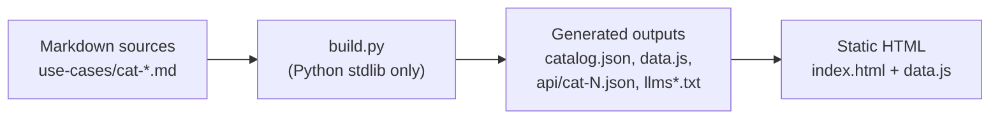

# Replication Guide

This guide shows how to use this project as a template for a new catalog — for a different vendor, a different query language, or a different content domain. The output is a working static dashboard plus JSON API, built by one Python stdlib script, hosted on any static host.

**Prerequisites:** Python 3.8+, a GitHub account (or any static host), a text editor.

**Time to a working fork:** ~30 minutes for the starter template; ~1 day to migrate 20 real use cases; ~1 week to reach production quality.

A minimal, runnable starter lives under [`templates/replication-starter/`](../templates/replication-starter/). Everything in this guide is demonstrated there.

---

## Contents

1. [When to replicate](#1-when-to-replicate)
2. [The three moving parts](#2-the-three-moving-parts)
3. [Starter template walkthrough](#3-starter-template-walkthrough)
4. [Porting to a new domain](#4-porting-to-a-new-domain)
5. [Worked example: Microsoft Sentinel (KQL)](#5-worked-example-microsoft-sentinel-kql)
6. [Worked example: Datadog monitors (DQL)](#6-worked-example-datadog-monitors-dql)
7. [Worked example: Chronicle (YARA-L)](#7-worked-example-chronicle-yara-l)
8. [Deploying your fork](#8-deploying-your-fork)
9. [Maintaining drift-free](#9-maintaining-drift-free)

---

## 1. When to replicate

Replicate when you need:

- A curated catalog of structured content items (detections, monitors, patterns, playbooks) with a shared schema.
- Multiple machine-readable projections (JSON for tools, conf for a platform, markdown for humans).
- A static dashboard with faceted filter and full-text search.
- Versioned, PR-reviewable authoring.
- No back-end, no database, no dependencies beyond Python.

Do **not** replicate if you need:

- Runtime execution of the queries (rule engine, scheduling). Use a platform SDK.
- Real-time collaboration on content (Google Docs / Notion use cases). Use Notion.
- Personalisation, user accounts, or multi-tenant access control.

---

## 2. The three moving parts



Only three parts matter. Everything else is audits, exports, and dashboards layered on top.

- **Content** — one markdown file per category, a fixed heading + bulleted-field schema.
- **Build** — a single Python stdlib script that parses markdown and emits JSON/JS/text.
- **Runtime** — a single HTML file that reads the generated `data.js` and renders the dashboard.

Swap any of the three without touching the other two.

---

## 3. Starter template walkthrough

The starter under [`templates/replication-starter/`](../templates/replication-starter/) is a **minimum viable fork**: one category, one use case, a ~30-line build script, a ~50-line dashboard.

```
templates/replication-starter/
├── README.md                       # quick-start
├── build.py                        # ~30 LOC
├── use-cases/
│   └── cat-01-example.md           # 1 category, 1 UC
├── index.html                      # ~50 LOC
└── catalog.schema.json             # JSON shape
```

Run it:

```bash
cd templates/replication-starter
python3 build.py
python3 -m http.server 8080
# open http://localhost:8080/
```

You will see a single card rendered from the markdown. Edit `use-cases/cat-01-example.md`, rerun `build.py`, refresh the browser.

The starter intentionally has no audits, no API shards, no LLM output, no exports. It exists to show the minimum moving parts.

---

## 4. Porting to a new domain

Five edits take you from this repo to a fork for a different domain. In each case the file to edit and the change type is listed; most are mechanical.

### 4.1 Rename the query language fence

**Where:** [`build.py:parse_category_file()`](../build.py)

```python
# was:
if stripped.startswith("```spl") or stripped.startswith("```SPL"):
# now:
if stripped.startswith("```kql") or stripped.startswith("```KQL"):
```

And update your markdown `- **SPL:**` field label to `- **KQL:**` (or `DQL:`, `YARA-L:`, etc.). Rename the `q` key if you want; stability matters more than purity.

### 4.2 Replace the schema / data-model vocabulary

**Where:** `- **CIM Models:**` field label and the `CIM SPL:` sibling field.

For Sentinel → `- **ASIM Schemas:**` and `- **ASIM KQL:**`. For Datadog → drop CIM; use `- **Metric namespace:**`. For Chronicle → `- **UDM event types:**`.

### 4.3 Rewrite the equipment/connector map

**Where:** `EQUIPMENT` in [`build.py`](../build.py) (L85–L1300 in the reference).

This is the largest edit. The reference repo's map covers ~150 Splunk TAs and ~400 equipment models. A Sentinel fork replaces this with ~200 Sentinel connectors. A Datadog fork replaces it with ~500 Datadog integrations. A Chronicle fork replaces it with the Chronicle source list.

### 4.4 Rewrite the auto-assignment rules

**Where:** [`build.py`](../build.py) — `assign_pillar()`, `assign_premium()`, `assign_regulations()`.

These functions embed Splunk-specific taxonomy (Security vs Observability pillar; ES / ITSI / SOAR premium apps). Rewrite them for your platform or delete them — auto-tagging is optional.

### 4.5 Rewrite the exports

**Where:** new generators under [`scripts/`](../scripts/).

- For Sentinel: `scripts/build_sentinel_solution.py` emits `<solution>/Solutions/<name>/Data/Solution_Metadata.json` + `Detections/*.yaml`.
- For Datadog: `scripts/build_datadog_terraform.py` emits `terraform/monitors.tf`.
- For Chronicle: `scripts/build_chronicle_rules_pack.py` emits `rules/<name>.yaral` + `rules_pack.json`.

The structure of `catalog.json` is the input contract; you do not need to parse markdown again.

### 4.6 Everything else stays

The following are **domain-agnostic** and work unchanged in any fork:

- The three-part ID scheme (`UC-X.Y.Z`) and the gap-free ordering rule.
- The virtualised list in `index.html`.
- The `api/cat-N.json` + `llms*.txt` output.
- The CI audits: `audit_uc_ids.py`, `audit_uc_structure.py`, `audit_non_technical_sync.py`, `audit_links.py`, `audit_catalog_schema.py`.
- The version triple (`VERSION` + `CHANGELOG.md` + `index.html` release notes) and its CI gate.
- The release-notes regeneration from CHANGELOG.

---

## 5. Worked example: Microsoft Sentinel (KQL)

**Goal:** a catalog of KQL analytic rules, deployable as a Sentinel solution.

### 5.1 Markdown example

````markdown
### UC-1.1.1 · Failed Azure AD sign-ins followed by success
- **Criticality:** 🟠 High
- **Difficulty:** 🔵 Intermediate
- **Monitoring type:** Security
- **Value:** Detects password-spray and credential-stuffing campaigns.
- **Connectors:** Azure Active Directory
- **Data Sources:** SigninLogs
- **ASIM Schemas:** Authentication
- **KQL:**
```kql
SigninLogs
| where ResultType != 0
| summarize count() by UserPrincipalName, bin(TimeGenerated, 5m)
| where count_ > 10
```
- **Implementation:** Deploy as an Analytic Rule; map to ASIM Authentication.
- **Visualization:** Workbook.
- **MITRE ATT&CK:** T1110.001
````

### 5.2 Minimal build changes

1. Change the fence: ` ```spl ` → ` ```kql `.
2. Rename parsed keys: `App/TA:` → `Connectors:`, `CIM Models:` → `ASIM Schemas:`.
3. Swap `EQUIPMENT` for a list of Azure/M365/AWS/GCP connectors.

### 5.3 Export generator

New `scripts/build_sentinel_solution.py` reads `catalog.json` and emits under `dist/sentinel-solution/`:

```
dist/sentinel-solution/
└── Solutions/MyCatalog/
    ├── Data/Solution_Metadata.json
    ├── Detections/UC-1-1-1.yaml
    └── Workbooks/MyCatalog.json
```

Each detection YAML uses the [Azure Sentinel GitHub format](https://github.com/Azure/Azure-Sentinel/tree/master/Solutions).

### 5.4 Effort estimate

A Sentinel fork takes ~3–5 days of engineering to reach parity with this repo's core features (catalog + dashboard + JSON API + solution export).

---

## 6. Worked example: Datadog monitors (DQL)

**Goal:** a catalog of Datadog monitors, deployable as Terraform.

### 6.1 Markdown example

````markdown
### UC-1.1.1 · High CPU on production web servers
- **Criticality:** 🟠 High
- **Difficulty:** 🟢 Beginner
- **Monitoring type:** Performance
- **Value:** Alerts on sustained CPU pressure that correlates with user-visible latency.
- **Integration:** system
- **Metric namespace:** system.cpu.user
- **DQL:**
```dql
avg(last_5m):avg:system.cpu.user{env:prod,role:web} by {host} > 85
```
- **Implementation:** Terraform via `datadog_monitor` resource.
- **Visualization:** Dashboard widget (timeseries).
- **Tags:** `env:prod`, `role:web`
````

### 6.2 Minimal build changes

1. Fence: ` ```spl ` → ` ```dql `.
2. Parsed keys: `Data Sources:` → `Integration:`, `CIM Models:` → `Metric namespace:`.
3. Drop `EQUIPMENT` or repurpose as "integration" map.

### 6.3 Export generator

`scripts/build_datadog_terraform.py` reads `catalog.json`, emits `terraform/monitors.tf` using `datadog_monitor` resources (one per UC).

### 6.4 Effort estimate

~2–3 days to a working fork (Datadog's schema is smaller than Sentinel's).

---

## 7. Worked example: Chronicle (YARA-L)

**Goal:** a catalog of YARA-L 2.0 rules for Google Security Operations (Chronicle).

### 7.1 Markdown example

````markdown
### UC-1.1.1 · Suspicious PowerShell download-and-execute
- **Criticality:** 🔴 Critical
- **Difficulty:** 🟠 Advanced
- **Monitoring type:** Security
- **Value:** Catches living-off-the-land PowerShell payload staging.
- **Log sources:** Windows Event Log (Sysmon), CrowdStrike Falcon
- **UDM event types:** PROCESS_LAUNCH
- **YARA-L:**
```yaral
rule suspicious_ps_downloadstring {
  meta:
    severity = "Critical"
    mitre_att_ck = "T1059.001"
  events:
    $e.metadata.event_type = "PROCESS_LAUNCH"
    $e.principal.process.command_line = /(?i)Invoke-WebRequest|IEX.*New-Object Net\.WebClient/
  condition:
    $e
}
```
- **Implementation:** Upload via Chronicle Rules Engine API.
- **MITRE ATT&CK:** T1059.001
````

### 7.2 Effort estimate

~3–4 days. The rules-pack export is a JSON array of rule objects, straightforward from `catalog.json`.

---

## 8. Deploying your fork

### 8.1 GitHub Pages (default)

1. Fork the starter template into your own GitHub repo.
2. Push `main`.
3. Settings → Pages → Source: `Deploy from a branch`, branch `main`, folder `/ (root)`.
4. Your site is live at `https://<user>.github.io/<repo>/`.

Update `SITE_BASE_URL` and `RAW_GITHUB_URL` in your `build.py` to match.

### 8.2 AWS S3 + CloudFront

1. Create an S3 bucket configured for static hosting.
2. Copy the repo root (excluding `use-cases/`, `scripts/`, `.github/`, `docs/` unless you want them served).
3. Point CloudFront at the bucket with an Origin Access Identity.
4. Add a CI step that runs `aws s3 sync . s3://your-bucket --exclude='...' --delete` on push to `main`.

### 8.3 Netlify

Drop a `netlify.toml` at repo root:

```toml
[build]
  publish = "."
  command = "python3 build.py"
```

Netlify will run `build.py` on every push and serve the result.

### 8.4 Vercel

Similar. Configure as a static project with no framework preset; set the build command to `python3 build.py`.

### 8.5 Internal GitLab Pages

`.gitlab-ci.yml`:

```yaml
pages:
  image: python:3
  script:
    - python3 build.py
    - mkdir -p public
    - cp -R . public/ || true
  artifacts:
    paths:
      - public
  only:
    - main
```

---

## 9. Maintaining drift-free

The single biggest long-term risk for a replicated fork is **drift between the design document and the code**. The upstream repo mitigates this with:

- A CI gate that runs `build.py` and fails if any generated file would change. Your fork should inherit this.
- `scripts/audit_design_doc_freshness.py` (optional, non-gating) that checks `DESIGN.md` section headings against a canonical list and verifies every linked file resolves.
- An ADR workflow that requires a new ADR for any change that contradicts an existing ADR.
- A single `VERSION` file as the source of truth, with CI enforcing triple-sync (`VERSION` ↔ top `CHANGELOG.md` entry ↔ top release-notes block).

Fork these conventions as-is. They are small and they work.

---

## Further reading

- [docs/DESIGN.md](DESIGN.md) — the full design document.
- [docs/adr/](adr/) — architecture decision records.
- [docs/catalog-schema.md](catalog-schema.md) — JSON shape.
- [docs/use-case-fields.md](use-case-fields.md) — field taxonomy.
- [CONTRIBUTING.md](../CONTRIBUTING.md) — how to submit a UC.
